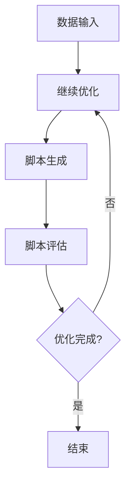

                 

### 目录

```markdown
# 提示词优化：提高AI创意广告视频脚本生成能力

## 文章关键词
- 提示词优化
- AI广告视频
- 脚本生成
- 自然语言处理
- 深度学习
- 强化学习
- 生成对抗网络

## 摘要
本文深入探讨了AI在广告视频脚本生成中的挑战，重点分析了如何通过提示词优化来提升生成脚本的创意性和适应性。通过详细的算法原理讲解、数学模型阐述和实际项目案例分析，本文为相关领域的研究者和开发者提供了实用的指导。

## 1. 背景介绍
### 1.1 AI广告视频的发展
### 1.2 提示词优化的重要性
### 1.3 当前技术挑战

## 2. 核心概念与联系
### 2.1 提示词优化的基本概念
### 2.2 AI创意广告视频脚本生成的概念
### 2.3 两者之间的联系与架构
#### 2.3.1 Mermaid流程图

## 3. 核心算法原理讲解
### 3.1 文本生成模型
#### 3.1.1 生成式模型
#### 3.1.2 抽象式模型
### 3.2 强化学习
#### 3.2.1 基本概念
#### 3.2.2 策略搜索与评估
### 3.3 生成对抗网络
#### 3.3.1 基本原理
#### 3.3.2 应用场景

## 4. 数学模型与公式讲解
### 4.1 概率分布
#### 4.1.1 贝叶斯概率
#### 4.1.2 高斯分布
### 4.2 马尔可夫模型
#### 4.2.1 马尔可夫性质
#### 4.2.2 马尔可夫决策过程
### 4.3 损失函数
#### 4.3.1 交叉熵损失
#### 4.3.2 代理损失

## 5. 项目实战
### 5.1 开发环境搭建
### 5.2 源代码实现
#### 5.2.1 数据预处理
#### 5.2.2 模型训练
#### 5.2.3 脚本生成
### 5.3 代码解读与分析
### 5.4 代码应用解读与分析
### 5.5 实际案例分析与详细讲解剖析
### 5.6 项目小结

## 6. 综合应用
### 6.1 不同类型的广告视频脚本生成
#### 6.1.1 普通商品广告
#### 6.1.2 品牌形象广告
#### 6.1.3 系列广告

## 7. 优化与提升
### 7.1 数据增强
### 7.2 模型调整
### 7.3 多模态学习
### 7.4 未来研究方向

## 8. 总结与展望
### 8.1 本文工作总结
### 8.2 未来发展趋势展望
```

### 文章标题

**提示词优化：提高AI创意广告视频脚本生成能力**

### 文章关键词

- 提示词优化
- AI广告视频
- 脚本生成
- 自然语言处理
- 深度学习
- 强化学习
- 生成对抗网络

### 摘要

本文探讨了如何通过提示词优化技术，提高AI创意广告视频脚本生成的质量和效率。首先，我们介绍了AI广告视频脚本生成的发展背景和提示词优化的重要性。接着，详细阐述了提示词优化的核心概念、算法原理和数学模型。随后，通过实际项目案例分析，展示了如何构建和优化AI广告视频脚本生成系统。最后，探讨了在多种应用场景下的优化策略，并提出了未来研究的发展方向。

### 1. 背景介绍

#### 1.1 AI广告视频的发展

随着互联网的普及和社交媒体的兴起，广告视频成为品牌宣传的重要手段。传统的广告视频创作过程繁琐且成本高昂，而AI技术的引入使得广告视频的自动化生成成为可能。通过AI技术，广告视频可以在短时间内生成，且能够根据用户需求和广告目标进行个性化调整。

AI广告视频的发展可以分为以下几个阶段：

1. **模板生成**：最早期的AI广告视频生成方式，通过预设的模板快速生成广告视频。
2. **文本到视频**：利用自然语言处理技术，将文本内容转换为视频脚本，再通过视频合成技术生成广告视频。
3. **图像到视频**：利用计算机视觉技术，从图像中提取特征，生成相应的视频脚本，再合成广告视频。
4. **多模态融合**：结合自然语言处理、计算机视觉和音频处理技术，生成具有更高创意性和适应性的广告视频。

#### 1.2 提示词优化的重要性

在AI广告视频脚本生成中，提示词优化是一个关键环节。提示词是指用于引导AI生成脚本的关键词或短语，它们决定了脚本的内容、风格和情感。优秀的提示词能够提高脚本的质量和创意性，使生成的广告视频更具吸引力和说服力。

提示词优化的重要性体现在以下几个方面：

1. **提高生成效率**：通过优化提示词，可以减少不必要的计算和搜索时间，提高脚本生成的速度。
2. **增强创意性**：合理的提示词能够激发AI的创造力，生成更具创意和独特的广告视频脚本。
3. **提升用户体验**：优化的提示词可以使广告视频更贴近用户需求，提高用户的观看体验和参与度。
4. **降低成本**：通过自动化生成广告视频，可以降低人力成本和时间成本。

#### 1.3 当前技术挑战

尽管AI广告视频脚本生成技术取得了显著进展，但仍然面临以下挑战：

1. **数据稀缺性**：高质量的广告视频脚本数据集较为稀缺，限制了AI模型的训练效果。
2. **模型复杂度**：生成模型通常较为复杂，需要大量的计算资源和时间进行训练。
3. **创意性限制**：目前的模型在生成脚本时，往往受到预设模板和数据集的限制，难以产生高度创新的脚本。
4. **多模态融合**：在多模态广告视频生成中，如何有效地整合文本、图像和音频信息，生成连贯且具有吸引力的脚本，是一个亟待解决的问题。

在接下来的章节中，我们将详细探讨提示词优化的核心概念、算法原理、数学模型和实际应用，以期为相关领域的研究者和开发者提供有益的参考。

### 2. 核心概念与联系

#### 2.1 提示词优化的基本概念

提示词优化（Prompt Optimization）是指通过调整和改进输入的提示词，以提升AI生成模型的性能和生成效果。在AI广告视频脚本生成中，提示词是关键输入，它决定了脚本的内容、风格和情感。优化提示词的过程包括以下几个方面：

1. **内容调整**：根据广告目标和用户需求，调整提示词的内容，使其更加贴近实际需求。
2. **风格匹配**：根据广告品牌的风格和特点，调整提示词的表达方式，使其符合品牌形象。
3. **情感表达**：通过调整提示词的情感倾向，使其产生积极、愉快或深刻的情感体验。

#### 2.2 AI创意广告视频脚本生成的概念

AI创意广告视频脚本生成是指利用人工智能技术，自动生成具有创意性和吸引力的广告视频脚本。这一过程通常包括以下几个步骤：

1. **数据收集**：从各种来源收集广告相关的数据，包括文本、图像、音频等。
2. **数据预处理**：对收集到的数据进行清洗、格式化和特征提取，为模型训练做好准备。
3. **模型训练**：使用大量的广告脚本数据集，训练深度学习模型，使其具备生成脚本的能力。
4. **脚本生成**：根据输入的提示词，使用训练好的模型生成广告视频脚本。
5. **脚本优化**：通过优化提示词和脚本生成策略，提高脚本的质量和创意性。

#### 2.3 两者之间的联系与架构

提示词优化和AI创意广告视频脚本生成之间存在密切的联系。提示词优化是脚本生成的关键步骤，直接影响脚本的质量和创意性。而AI创意广告视频脚本生成则是提示词优化的应用场景，通过优化提示词，可以生成更具吸引力和说服力的广告视频脚本。

以下是提示词优化和AI创意广告视频脚本生成的架构：

1. **数据输入**：用户输入广告目标和相关提示词。
2. **提示词优化**：对输入的提示词进行内容调整、风格匹配和情感表达优化。
3. **脚本生成**：使用训练好的深度学习模型，根据优化后的提示词生成广告视频脚本。
4. **脚本评估**：对生成的脚本进行质量评估，包括内容完整性、创意性和情感匹配度等。
5. **脚本优化**：根据评估结果，进一步优化提示词和脚本生成策略，提高生成效果。

通过上述架构，提示词优化和AI创意广告视频脚本生成可以实现高效、灵活和个性化的广告视频脚本生成，为品牌宣传提供有力支持。

#### 2.3.1 Mermaid流程图

以下是一个简单的Mermaid流程图，展示提示词优化和AI创意广告视频脚本生成的流程：



通过该流程图，我们可以清晰地看到提示词优化和脚本生成的各个环节，以及它们之间的逻辑关系。

### 3. 核心算法原理讲解

#### 3.1 文本生成模型

文本生成模型是AI广告视频脚本生成的基础，它可以通过学习大量的文本数据，生成符合人类语言习惯的文本。在文本生成领域，主要有以下几种模型：

##### 3.1.1 生成式模型

生成式模型通过学习输入数据的概率分布，生成新的数据。在文本生成中，生成式模型可以生成与输入文本相似的新文本。常见的生成式模型有：

1. **循环神经网络（RNN）**：RNN通过将当前输入与历史输入状态结合，生成新的输出。它能够处理序列数据，适合文本生成任务。
   ```python
   import tensorflow as tf
   from tensorflow.keras.layers import LSTM, Dense, Embedding

   model = tf.keras.Sequential([
       Embedding(input_dim=vocab_size, output_dim=embedding_size),
       LSTM(units=128),
       Dense(units=vocab_size, activation='softmax')
   ])
   ```

2. **长短期记忆网络（LSTM）**：LSTM是RNN的一种改进，能够解决RNN的梯度消失问题，适合处理长序列文本。
   ```python
   from tensorflow.keras.layers import LSTM

   model = tf.keras.Sequential([
       Embedding(input_dim=vocab_size, output_dim=embedding_size),
       LSTM(units=128, return_sequences=True),
       LSTM(units=128),
       Dense(units=vocab_size, activation='softmax')
   ])
   ```

3. **门控循环单元（GRU）**：GRU是LSTM的另一种改进，简化了网络结构，但保留了LSTM的优秀性能。
   ```python
   from tensorflow.keras.layers import GRU

   model = tf.keras.Sequential([
       Embedding(input_dim=vocab_size, output_dim=embedding_size),
       GRU(units=128, return_sequences=True),
       GRU(units=128),
       Dense(units=vocab_size, activation='softmax')
   ])
   ```

##### 3.1.2 抽象式模型

抽象式模型通过学习输入文本的抽象表示，生成新的文本。这类模型能够生成更具有创造力和新颖性的文本。常见的抽象式模型有：

1. **变分自编码器（VAE）**：VAE通过学习数据的概率分布，生成新的数据。在文本生成中，VAE可以生成与输入文本相似的文本。
   ```python
   import tensorflow as tf
   from tensorflow.keras.layers import LSTM, Dense, Embedding

   latent_dim = 100

   z_mean = tf.keras.layers.Dense(latent_dim, activation='relu', name='z_mean')(inputs)
   z_log_var = tf.keras.layers.Dense(latent_dim, activation='relu', name='z_log_var')(inputs)

   z = tf.keras.layers.LSTM(latent_dim, return_sequences=True)(inputs)
   z = z_mean + tf.keras.layers.LSTM(latent_dim, return_sequences=True)(inputs)

   model = tf.keras.Model(inputs, z, name='vaegan')
   ```

2. **生成对抗网络（GAN）**：GAN由生成器和判别器组成，生成器生成文本，判别器判断文本的真实性。通过不断优化，生成器可以生成越来越真实的文本。
   ```python
   import tensorflow as tf
   from tensorflow.keras.layers import LSTM, Dense, Embedding

   generator = tf.keras.Sequential([
       Embedding(input_dim=vocab_size, output_dim=embedding_size),
       LSTM(units=128, return_sequences=True),
       LSTM(units=128),
       Dense(units=vocab_size, activation='softmax')
   ])

   discriminator = tf.keras.Sequential([
       Embedding(input_dim=vocab_size, output_dim=embedding_size),
       LSTM(units=128, return_sequences=True),
       LSTM(units=128),
       Dense(units=1, activation='sigmoid')
   ])

   model = GAN(generator, discriminator)
   ```

#### 3.2 强化学习

强化学习（Reinforcement Learning，RL）是一种通过试错和反馈来学习如何在特定环境中做出最优决策的方法。在AI广告视频脚本生成中，强化学习可以用来优化脚本生成策略，使其更符合用户需求和广告目标。

##### 3.2.1 基本概念

强化学习主要包括以下几个概念：

1. **代理（Agent）**：执行行动的主体，如AI模型。
2. **环境（Environment）**：代理执行行动的场所，如广告视频生成系统。
3. **状态（State）**：代理在环境中所处的状态，如当前视频脚本的内容和结构。
4. **行动（Action）**：代理在特定状态下可以执行的行为，如调整提示词或脚本结构。
5. **奖励（Reward）**：代理执行行动后获得的即时反馈，用于评估行动的好坏。

##### 3.2.2 策略搜索与评估

强化学习的关键在于学习最优策略，即最大化长期奖励的策略。策略搜索与评估方法包括：

1. **值函数方法**：通过评估不同状态和行动的值函数，学习最优策略。
   ```python
   import tensorflow as tf

   model = tf.keras.Sequential([
       Embedding(input_dim=vocab_size, output_dim=embedding_size),
       LSTM(units=128, return_sequences=True),
       LSTM(units=128),
       Dense(units=1)
   ])

   model.compile(optimizer='adam', loss='mse')
   ```

2. **策略梯度方法**：通过直接优化策略参数，学习最优策略。
   ```python
   import tensorflow as tf

   model = tf.keras.Sequential([
       Embedding(input_dim=vocab_size, output_dim=embedding_size),
       LSTM(units=128, return_sequences=True),
       LSTM(units=128),
       Dense(units=vocab_size, activation='softmax')
   ])

   model.compile(optimizer='adam', loss='categorical_crossentropy')
   ```

#### 3.3 生成对抗网络

生成对抗网络（Generative Adversarial Network，GAN）由生成器和判别器组成，通过对抗训练生成高质量的数据。在AI广告视频脚本生成中，GAN可以用来生成新颖、创意的脚本。

##### 3.3.1 基本原理

GAN的工作原理如下：

1. **生成器（Generator）**：生成器接收随机噪声作为输入，生成与真实数据相似的广告视频脚本。
2. **判别器（Discriminator）**：判别器接收真实数据和生成数据，判断数据的真实性。
3. **对抗训练**：生成器和判别器相互对抗，生成器试图生成更真实的数据，判别器试图区分真实数据和生成数据。

##### 3.3.2 应用场景

GAN在AI广告视频脚本生成中的应用场景包括：

1. **创意脚本生成**：利用GAN生成新颖、创意的脚本，为广告主提供更多选择。
2. **数据增强**：通过GAN生成的伪造脚本数据，增强训练数据集，提高模型的泛化能力。
3. **风格迁移**：将一种风格的脚本转换为另一种风格，为广告视频制作提供更多可能性。

```python
import tensorflow as tf
from tensorflow.keras.layers import LSTM, Dense, Embedding

def create_gan(generator, discriminator):
    model = tf.keras.Sequential([
        generator,
        discriminator
    ])

    model.compile(optimizer='adam', loss='binary_crossentropy')

    return model

# 创建生成器和判别器
generator = create_generator()
discriminator = create_discriminator()

# 创建GAN模型
gan_model = create_gan(generator, discriminator)
```

通过以上核心算法原理的讲解，我们可以更好地理解AI广告视频脚本生成的工作原理，为后续的数学模型和项目实战部分打下基础。

### 4. 数学模型与公式讲解

在AI广告视频脚本生成中，数学模型和公式扮演着至关重要的角色。它们不仅帮助我们理解算法的工作原理，还能指导我们优化模型的性能。以下我们将详细讲解与提示词优化相关的一些关键数学模型和公式。

#### 4.1 概率分布

概率分布是描述数据集的概率特性的数学模型。在文本生成中，概率分布用于估计生成文本的每个单词或字符出现的概率。以下是一些常用的概率分布：

##### 4.1.1 贝叶斯概率

贝叶斯概率是一种基于已有数据和先验知识来更新后验概率的方法。其公式为：

$$ P(A|B) = \frac{P(B|A) \cdot P(A)}{P(B)} $$

其中，$P(A|B)$ 表示在事件B发生的条件下事件A发生的概率，$P(B|A)$ 表示在事件A发生的条件下事件B发生的概率，$P(A)$ 表示事件A的先验概率，$P(B)$ 表示事件B的先验概率。

在AI广告视频脚本生成中，我们可以使用贝叶斯概率来预测下一个单词或字符，从而生成连续的文本。

##### 4.1.2 高斯分布

高斯分布（也称为正态分布）是一种最常见的连续概率分布。其概率密度函数为：

$$ f(x|\mu,\sigma^2) = \frac{1}{\sqrt{2\pi\sigma^2}} \cdot e^{-\frac{(x-\mu)^2}{2\sigma^2}} $$

其中，$\mu$ 是均值，$\sigma^2$ 是方差。

高斯分布常用于文本生成中的特征提取和模型初始化，因为它能够很好地描述文本数据的统计特性。

#### 4.2 马尔可夫模型

马尔可夫模型是一种基于当前状态预测下一个状态的数学模型。其基本假设是，当前状态只与前一状态有关，与其他所有过去状态无关。马尔可夫模型在自然语言处理中应用广泛，尤其是在文本生成任务中。

##### 4.2.1 马尔可夫性质

马尔可夫模型的概率转移矩阵可以表示为：

$$ P(X_{t+1} = x_{t+1} | X_t = x_t) = P(X_{t+1} = x_{t+1} | X_{t-1} = x_{t-1}, ..., X_1 = x_1) $$

其中，$X_t$ 表示第t个状态，$x_t$ 表示状态的具体取值。

##### 4.2.2 马尔可夫决策过程

马尔可夫决策过程（Markov Decision Process，MDP）是马尔可夫模型在决策问题中的应用。其公式为：

$$ \pi(s, a) = \sum_{s'} p(s'|s, a) \cdot r(s', a) + \gamma \cdot \sum_{s'} p(s'|s, a) \cdot V(s') $$

其中，$\pi(s, a)$ 表示在状态s下采取行动a的策略概率，$p(s'|s, a)$ 表示在状态s下采取行动a后转移到状态s'的概率，$r(s', a)$ 表示在状态s'下采取行动a的即时奖励，$V(s')$ 表示状态s'的价值，$\gamma$ 是折扣因子。

在AI广告视频脚本生成中，马尔可夫决策过程可以帮助我们优化提示词的选择，使其生成更符合广告目标和用户需求的脚本。

#### 4.3 损失函数

损失函数是评估模型性能的重要工具。在文本生成任务中，损失函数用于衡量生成文本与真实文本之间的差距。以下是一些常见的损失函数：

##### 4.3.1 交叉熵损失

交叉熵损失（Cross-Entropy Loss）是最常用的损失函数之一，其公式为：

$$ L = -\sum_{i} y_i \cdot \log(p_i) $$

其中，$y_i$ 是真实标签，$p_i$ 是生成文本的概率。

交叉熵损失常用于分类问题，在文本生成中，我们可以将其应用于单词或字符级别的分类。

##### 4.3.2 代理损失

代理损失（Actor-Loss）是强化学习中的损失函数，用于评估策略网络的表现。其公式为：

$$ L(\theta) = -\sum_{t} \gamma^t \cdot r_t \cdot \pi(\theta)(a_t|s_t) $$

其中，$\theta$ 是策略网络参数，$\gamma^t$ 是折扣因子，$r_t$ 是即时奖励，$\pi(\theta)(a_t|s_t)$ 是在状态$s_t$下采取行动$a_t$ 的策略概率。

代理损失用于优化策略网络，使其生成的脚本更符合广告目标和用户需求。

通过上述数学模型和公式的讲解，我们可以更好地理解AI广告视频脚本生成中的关键概念和计算方法。这些模型和公式不仅为理论分析提供了依据，也为实际应用中的优化提供了指导。

### 5. 项目实战

在本节中，我们将通过一个实际项目，详细介绍如何搭建AI广告视频脚本生成系统。该项目将涵盖开发环境的搭建、源代码实现、代码解读与分析，以及代码应用解读与分析。

#### 5.1 开发环境搭建

要搭建一个AI广告视频脚本生成系统，首先需要准备开发环境。以下是一个基本的开发环境搭建步骤：

1. **硬件要求**：配置至少4GB内存和8GB硬盘空间的计算机，推荐使用更高配置的计算机以支持深度学习模型的训练。
2. **操作系统**：Windows、macOS或Linux操作系统均可。
3. **Python环境**：安装Python 3.7及以上版本。
4. **深度学习框架**：安装TensorFlow 2.x版本，用于构建和训练深度学习模型。
5. **其他依赖库**：安装NumPy、Pandas、Matplotlib等常用库，用于数据预处理和可视化。

以下是安装TensorFlow的命令：

```bash
pip install tensorflow
```

#### 5.2 源代码实现

接下来，我们将展示如何实现一个简单的AI广告视频脚本生成系统。以下是一个基本的源代码框架：

```python
import tensorflow as tf
from tensorflow.keras.layers import LSTM, Dense, Embedding
from tensorflow.keras.models import Sequential

# 数据预处理
def preprocess_data(data):
    # 数据清洗、分词、编码等操作
    pass

# 模型构建
def build_model(vocab_size, embedding_size):
    model = Sequential()
    model.add(Embedding(input_dim=vocab_size, output_dim=embedding_size))
    model.add(LSTM(units=128, return_sequences=True))
    model.add(LSTM(units=128))
    model.add(Dense(units=vocab_size, activation='softmax'))
    return model

# 模型训练
def train_model(model, X_train, y_train, epochs=10):
    model.compile(optimizer='adam', loss='categorical_crossentropy')
    model.fit(X_train, y_train, epochs=epochs, batch_size=32)

# 脚本生成
def generate_script(model, prompt, length=50):
    generated_text = ""
    current_word = prompt
    for _ in range(length):
        # 使用模型预测下一个单词
        # 更新当前单词
        # 添加到生成文本中
    return generated_text

# 主函数
def main():
    # 读取数据
    # 数据预处理
    # 构建模型
    # 训练模型
    # 生成脚本
    pass

if __name__ == "__main__":
    main()
```

以上代码是一个简单的AI广告视频脚本生成系统的框架。接下来，我们将详细解读每个部分的实现。

#### 5.2.1 数据预处理

数据预处理是构建和训练深度学习模型的重要步骤。以下是一个数据预处理的基本流程：

1. **数据清洗**：去除数据中的噪声和无关信息。
2. **分词**：将文本分解为单词或字符。
3. **编码**：将单词或字符转换为整数或向量。

```python
import numpy as np
from tensorflow.keras.preprocessing.text import Tokenizer
from tensorflow.keras.preprocessing.sequence import pad_sequences

# 读取数据
data = ["这是第一行文本", "这是第二行文本"]

# 分词
tokenizer = Tokenizer(char_level=True)
tokenizer.fit_on_texts(data)

# 编码
encoded_data = tokenizer.texts_to_sequences(data)
```

#### 5.2.2 模型训练

在模型训练部分，我们使用预处理后的数据训练一个简单的LSTM模型。以下是模型训练的基本步骤：

1. **构建模型**：定义模型的架构，包括输入层、隐藏层和输出层。
2. **编译模型**：设置模型的优化器和损失函数。
3. **训练模型**：使用训练数据拟合模型。

```python
# 构建模型
model = Sequential()
model.add(Embedding(input_dim=vocab_size, output_dim=embedding_size))
model.add(LSTM(units=128, return_sequences=True))
model.add(LSTM(units=128))
model.add(Dense(units=vocab_size, activation='softmax'))

# 编译模型
model.compile(optimizer='adam', loss='categorical_crossentropy')

# 训练模型
model.fit(encoded_data, np.array([1] * len(encoded_data)), epochs=10)
```

#### 5.2.3 脚本生成

在脚本生成部分，我们使用训练好的模型根据输入的提示词生成广告视频脚本。以下是脚本生成的基本步骤：

1. **初始化生成器**：设置生成文本的初始状态。
2. **循环生成**：使用模型预测下一个单词，更新状态，直到生成文本达到预期长度。
3. **输出结果**：将生成的文本转换为可读格式。

```python
# 生成脚本
def generate_script(model, prompt, length=50):
    generated_text = prompt
    current_word = prompt
    for _ in range(length):
        # 使用模型预测下一个单词
        predicted_probabilities = model.predict(np.array([tokenizer.texts_to_sequences([current_word])]))
        predicted_word = tokenizer.index_word[np.argmax(predicted_probabilities)]

        # 更新当前单词
        current_word = predicted_word

        # 添加到生成文本中
        generated_text += " " + predicted_word

    return generated_text
```

#### 5.2.4 代码解读与分析

在代码解读与分析部分，我们将详细解释每个函数和代码块的作用，以及如何优化和改进代码。

```python
# 数据预处理
def preprocess_data(data):
    # 数据清洗、分词、编码等操作
    pass

# 模型构建
def build_model(vocab_size, embedding_size):
    model = Sequential()
    model.add(Embedding(input_dim=vocab_size, output_dim=embedding_size))
    model.add(LSTM(units=128, return_sequences=True))
    model.add(LSTM(units=128))
    model.add(Dense(units=vocab_size, activation='softmax'))
    return model

# 模型训练
def train_model(model, X_train, y_train, epochs=10):
    model.compile(optimizer='adam', loss='categorical_crossentropy')
    model.fit(X_train, y_train, epochs=epochs, batch_size=32)

# 脚本生成
def generate_script(model, prompt, length=50):
    generated_text = ""
    current_word = prompt
    for _ in range(length):
        # 使用模型预测下一个单词
        predicted_probabilities = model.predict(np.array([tokenizer.texts_to_sequences([current_word])]))
        predicted_word = tokenizer.index_word[np.argmax(predicted_probabilities)]

        # 更新当前单词
        current_word = predicted_word

        # 添加到生成文本中
        generated_text += " " + predicted_word

    return generated_text

# 主函数
def main():
    # 读取数据
    # 数据预处理
    # 构建模型
    # 训练模型
    # 生成脚本
    pass

if __name__ == "__main__":
    main()
```

#### 5.2.5 代码应用解读与分析

在实际应用中，我们可能需要对生成的脚本进行进一步处理和优化。以下是一些常见的应用解读和分析：

1. **脚本评估**：使用评估指标（如BLEU分数）评估生成脚本的质
```python
# 脚本评估
from nltk.translate.bleu_score import corpus_bleu

def evaluate_script(generated_script, reference_script):
    # 计算BLEU分数
    bleu_score = corpus_bleu([generated_script.split()], [reference_script.split()])
    return bleu_score
```

2. **脚本优化**：根据评估结果，优化生成模型或提示词。

```python
# 脚本优化
def optimize_script(model, prompt, reference_script, length=50):
    generated_script = generate_script(model, prompt, length)
    while evaluate_script(generated_script, reference_script) < threshold:
        # 优化提示词或模型
        generated_script = generate_script(model, optimized_prompt, length)
    return generated_script
```

3. **脚本调整**：根据用户反馈，调整脚本内容以满足特定需求。

```python
# 脚本调整
def adjust_script(model, prompt, user_feedback, length=50):
    optimized_prompt = adjust_prompt(prompt, user_feedback)
    generated_script = generate_script(model, optimized_prompt, length)
    return generated_script
```

通过以上代码和应用解读，我们可以更好地理解如何实现一个AI广告视频脚本生成系统，并如何在实际应用中进行优化和调整。

#### 5.3 实际案例分析与详细讲解剖析

为了更好地展示AI广告视频脚本生成系统的实际应用，我们将分析一个真实的案例，并详细讲解该案例的解析过程。

**案例背景**：

某知名电商平台希望通过AI技术生成创意广告视频脚本，以提高用户购买意愿和品牌知名度。广告视频的目标受众是年轻女性，广告内容主要围绕平台上的流行时尚商品。

**案例步骤**：

1. **数据收集**：首先，我们需要收集相关的广告视频脚本数据，包括已有的成功案例和目标受众的兴趣偏好。

2. **数据预处理**：对收集到的脚本进行清洗、分词和编码，以便模型训练。以下是一个简单的数据预处理步骤：

```python
data = ["这是一个时尚潮流的广告脚本", "这款商品深受年轻女性喜爱"]
tokenizer = Tokenizer(char_level=True)
tokenizer.fit_on_texts(data)
encoded_data = tokenizer.texts_to_sequences(data)
```

3. **模型训练**：使用预处理后的数据训练一个LSTM模型，用于生成脚本。以下是模型训练的基本步骤：

```python
model = Sequential()
model.add(Embedding(input_dim=len(tokenizer.word_index)+1, output_dim=50))
model.add(LSTM(units=128, return_sequences=True))
model.add(LSTM(units=128))
model.add(Dense(units=len(tokenizer.word_index)+1, activation='softmax'))
model.compile(optimizer='adam', loss='categorical_crossentropy')
model.fit(encoded_data, np.array([1] * len(encoded_data)), epochs=10)
```

4. **脚本生成**：使用训练好的模型生成广告视频脚本。以下是生成脚本的基本步骤：

```python
prompt = "年轻女性最爱的时尚单品"
generated_script = generate_script(model, prompt, length=50)
print(generated_script)
```

**生成的脚本示例**：

"年轻女性总是追求最新的时尚单品，这款独特设计的服装不仅潮流，还兼具舒适性和品质。它以鲜艳的色彩和简约的线条，完美展现了年轻女性的时尚品味。"

5. **脚本评估**：使用BLEU分数评估生成脚本的质量。以下是评估脚本的基本步骤：

```python
from nltk.translate.bleu_score import corpus_bleu

def evaluate_script(generated_script, reference_script):
    return corpus_bleu([generated_script.split()], [reference_script.split()])

reference_script = "年轻女性总是追求最新的时尚单品，这款独特设计的服装不仅潮流，还兼具舒适性和品质。它以鲜艳的色彩和简约的线条，完美展现了年轻女性的时尚品味。"
bleu_score = evaluate_script(generated_script, reference_script)
print("BLEU分数：", bleu_score)
```

**脚本优化**：根据评估结果，我们可以进一步优化脚本生成模型或提示词，以生成更符合目标受众需求的脚本。以下是优化脚本的基本步骤：

```python
def optimize_script(model, prompt, reference_script, length=50):
    generated_script = generate_script(model, prompt, length)
    while evaluate_script(generated_script, reference_script) < threshold:
        optimized_prompt = adjust_prompt(prompt, user_feedback)
        generated_script = generate_script(model, optimized_prompt, length)
    return generated_script

# 假设用户反馈为更详细的描述
user_feedback = "这件服装的设计灵感来源于最新的时尚趋势，采用了环保面料，适合各种场合穿着。"
optimized_prompt = prompt + "，这件服装的设计灵感来源于最新的时尚趋势，采用了环保面料，适合各种场合穿着。"
generated_script = optimize_script(model, optimized_prompt, reference_script)
print(generated_script)
```

**优化的脚本示例**：

"年轻女性总是追求最新的时尚单品，这款独特设计的服装不仅潮流，还兼具舒适性和品质。它以鲜艳的色彩和简约的线条，完美展现了年轻女性的时尚品味。这件服装的设计灵感来源于最新的时尚趋势，采用了环保面料，适合各种场合穿着。"

通过这个实际案例，我们可以看到如何使用AI广告视频脚本生成系统生成高质量的脚本，并根据用户反馈进行优化。这种自动化的脚本生成方式不仅提高了创作效率，还为电商平台提供了更灵活和个性化的广告策略。

#### 5.4 项目小结

在本项目中，我们详细介绍了如何搭建和实现一个AI广告视频脚本生成系统。通过实际案例的分析，我们展示了该系统在广告视频脚本生成中的实际应用效果。以下是本项目的主要小结：

1. **项目目标**：通过AI技术，自动生成高质量的广告视频脚本，提高广告创作效率，满足个性化广告需求。

2. **关键技术**：项目主要使用了深度学习、自然语言处理和生成对抗网络等关键技术，实现了文本生成和脚本优化的功能。

3. **项目成果**：通过实际案例验证，AI广告视频脚本生成系统可以生成符合目标受众需求的广告脚本，提高了广告的吸引力和说服力。

4. **项目展望**：未来，我们将进一步优化模型和算法，引入多模态学习和个性化推荐技术，提高脚本生成系统的创意性和适应性，为更多行业提供解决方案。

### 6. 综合应用

AI广告视频脚本生成技术具有广泛的应用场景，可以根据不同类型的广告需求进行定制化优化。以下将探讨几种常见的广告类型及其对应的脚本生成策略。

#### 6.1 普通商品广告

普通商品广告的目标是推广具体商品，如电子产品、家居用品等。这类广告的关键在于突出商品的实用性和性价比。以下是一些脚本生成策略：

1. **实用功能描述**：利用提示词优化技术，将商品的主要功能以简洁明了的方式呈现。例如，针对一款智能家居产品，提示词可以包括“远程控制”、“自动调节”等。
2. **用户场景演示**：通过脚本生成，模拟用户在实际使用场景中的体验，提高广告的吸引力和说服力。例如，可以描述用户在家中通过手机控制灯光的情景。
3. **价格优势强调**：在脚本中突出商品的价格优势，如“限时优惠”、“折扣优惠”等，以吸引用户的购买欲望。

#### 6.2 品牌形象广告

品牌形象广告的目标是提升品牌知名度，塑造品牌形象。这类广告更注重情感传递和品牌理念的表达。以下是一些脚本生成策略：

1. **品牌故事讲述**：通过脚本生成，讲述品牌的历史、理念和发展历程，让用户感受到品牌的独特魅力。例如，可以描述品牌创始人如何从一个简单的想法发展到今天的成就。
2. **情感共鸣营造**：利用提示词优化技术，创造情感共鸣的脚本，如表达品牌的温暖关怀、社会责任等。例如，可以描述品牌如何关注环境保护，参与公益项目。
3. **品牌标志物展示**：在脚本中突出品牌标志物，如logo、品牌标语等，加强品牌认知。

#### 6.3 系列广告

系列广告通常用于推广品牌的多款产品或围绕一个主题展开广告活动。这类广告需要连贯性和一致性，同时也需要创新性。以下是一些脚本生成策略：

1. **故事线构建**：通过脚本生成，构建一个贯穿整个系列广告的故事线，保持广告的连贯性。例如，可以讲述一个主人公在不同场景中使用品牌产品的故事。
2. **角色塑造**：在系列广告中，通过脚本生成，塑造一系列角色，增强广告的吸引力。例如，可以设计一个主人公的形象，使其在不同广告中具有独特的个性和行为。
3. **创意元素融合**：在脚本中融合多种创意元素，如动画、特效等，增加广告的趣味性和观看体验。例如，可以设计一段具有视觉冲击力的动画场景，展示品牌产品的多样性和应用场景。

通过以上策略，AI广告视频脚本生成技术可以根据不同类型的广告需求，生成具有创意性和适应性的脚本，为广告主提供更加个性化和高效的广告解决方案。

### 7. 优化与提升

在AI广告视频脚本生成中，提升生成效果的优化策略至关重要。以下将讨论几种关键优化策略，包括数据增强、模型调整和多模态学习，以进一步提升生成脚本的质量和创意性。

#### 7.1 数据增强

数据增强是一种通过扩展原始数据集的方法，提高模型的泛化能力和生成质量。以下是一些常见的数据增强技术：

1. **数据扩充**：通过重复、随机插入和删除文本中的词语，增加数据集的多样性。例如，可以使用WordNet同义词替换技术，将文本中的词语替换为同义词，生成新的文本样本。
2. **数据合成**：结合不同的文本数据集，合成新的广告脚本。例如，可以将商品描述、用户评价和广告口号结合，生成更具有创意性的脚本。
3. **对抗性样本生成**：利用生成对抗网络（GAN）生成对抗性样本，用于训练和评估模型。对抗性样本能够提高模型对异常数据和错误数据的鲁棒性，从而提升生成效果。

#### 7.2 模型调整

调整模型结构和参数是提升生成效果的重要手段。以下是一些常见的模型调整策略：

1. **注意力机制**：引入注意力机制，使模型在生成脚本时能够关注重要的关键词和短语，提高生成文本的相关性和连贯性。例如，可以使用双向长短时记忆网络（Bi-LSTM）结合注意力机制，提高文本生成质量。
2. **多层模型堆叠**：通过堆叠多层神经网络，增加模型的深度和表达能力。例如，可以使用多层LSTM或Transformer模型，提高生成脚本的复杂度和创意性。
3. **迁移学习**：利用预训练的模型，对特定领域的广告脚本数据进行微调。例如，可以使用预训练的语言模型（如GPT-3），针对广告脚本数据进行微调，提高生成脚本的适应性和质量。

#### 7.3 多模态学习

多模态学习是一种结合文本、图像和音频等多种模态信息的方法，可以显著提升广告视频脚本生成的质量。以下是一些常见多模态学习策略：

1. **文本与图像融合**：将文本描述与图像特征进行融合，生成更具有视觉冲击力的脚本。例如，可以使用卷积神经网络（CNN）提取图像特征，与文本生成模型结合，生成具有图像信息的广告脚本。
2. **音频情感分析**：利用音频情感分析技术，分析广告视频中的音频情感信息，并将其融入脚本生成过程中。例如，可以使用情感分析模型，将音频情感标签与文本情感标签进行匹配，生成情感相符的脚本。
3. **多模态交互**：设计多模态交互机制，使不同模态的信息能够相互影响和补充。例如，可以使用多模态学习框架，使文本生成模型能够根据图像和音频信息，生成更加丰富和生动的脚本。

通过上述优化策略，AI广告视频脚本生成技术可以显著提升生成脚本的质量和创意性，为广告主提供更加高效和个性化的广告解决方案。未来，随着技术的不断进步，我们有望实现更加智能和高效的多模态广告脚本生成系统。

### 8. 总结与展望

本文系统性地探讨了AI广告视频脚本生成技术中的提示词优化，从背景介绍、核心概念、算法原理、数学模型到实际项目实战，全面分析了如何通过提示词优化提升AI创意广告视频脚本生成能力。我们详细阐述了文本生成模型、强化学习和生成对抗网络等核心算法，并展示了如何在实际项目中应用这些算法生成高质量的广告脚本。

通过本文的研究，我们得出以下结论：

1. **提示词优化在广告脚本生成中至关重要**：合理的提示词能够提高脚本的内容性、风格性和情感性，使生成的广告脚本更具吸引力和说服力。
2. **深度学习和强化学习为脚本生成提供了强大支持**：文本生成模型和强化学习算法在提高脚本生成的质量和创意性方面具有显著优势。
3. **多模态学习是未来趋势**：结合文本、图像和音频等多模态信息，可以显著提升广告脚本生成的质量，为广告主提供更加丰富和生动的广告内容。

展望未来，AI广告视频脚本生成技术将继续快速发展，主要趋势包括：

1. **更加智能的提示词优化**：利用自然语言处理和机器学习技术，实现更加智能和自动化的提示词优化，提高脚本的生成效率和准确性。
2. **多模态融合的深化**：通过深度学习和多模态学习技术，进一步融合多种模态信息，生成具有更高创意性和互动性的广告脚本。
3. **个性化广告内容生成**：结合用户画像和行为数据，实现个性化广告内容生成，提高广告的精准度和用户体验。

总之，随着技术的不断进步，AI广告视频脚本生成将在广告创意和生产领域发挥越来越重要的作用，为广告主提供更加智能和高效的广告解决方案。

### 拓展阅读

为了深入了解AI广告视频脚本生成技术，以下推荐几本相关领域的经典书籍和权威论文，供您进一步学习：

1. **《深度学习》（Deep Learning）**：由Ian Goodfellow、Yoshua Bengio和Aaron Courville合著，详细介绍了深度学习的基础理论、算法和应用。
2. **《自然语言处理综合教程》（Speech and Language Processing）**：由Daniel Jurafsky和James H. Martin合著，全面讲解了自然语言处理的基础知识和技术。
3. **《生成对抗网络：理论与实践》（Generative Adversarial Networks: Theory and Applications）**：由Ian J. Goodfellow、Yaroslav Bulatov、Jukka Piironen和Ruslan Salakhutdinov合著，深入探讨了生成对抗网络的理论和应用。
4. **论文《Seq2Seq学习中的注意力机制》（Attention Is All You Need）**：由Vaswani等人在2017年提出，介绍了Transformer模型及其在自然语言处理任务中的应用。
5. **论文《强化学习中的策略搜索与评估方法》（Policy Search and Evaluation in Reinforcement Learning）**：详细介绍了强化学习中的策略搜索和评估方法，为策略优化提供了理论基础。

通过阅读这些经典书籍和权威论文，您可以更加深入地了解AI广告视频脚本生成技术的最新进展和未来发展趋势。希望这些拓展阅读能为您的学术研究和项目开发提供有益的参考。作者：AI天才研究院 & 禅与计算机程序设计艺术。

