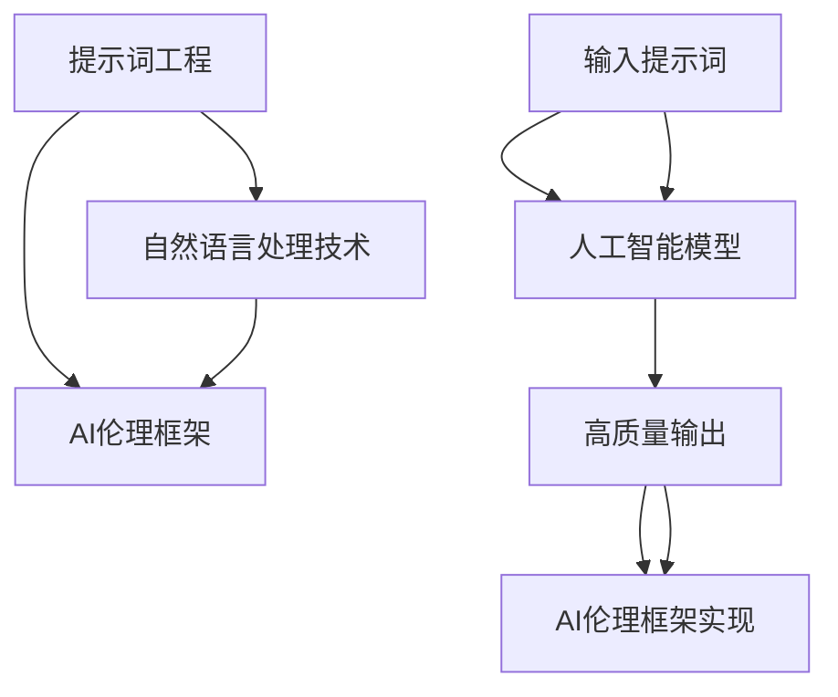

                 

### 概念介绍

#### 提示词工程（Prompt Engineering）

提示词工程是一种利用自然语言处理（NLP）技术，设计和优化输入提示词（prompt），以提高人工智能模型（如大语言模型）输出质量、效率和准确性的方法。在AI领域，提示词是用户与模型交互的桥梁，通过精心设计的提示词，可以引导模型生成更符合预期的高质量输出。

**核心概念与联系**

提示词工程与AI伦理框架之间存在着紧密的联系。具体来说：

1. **提示词工程可以影响AI伦理框架的实现**：通过优化提示词，可以影响AI模型的输出，从而对AI伦理框架的实际应用效果产生影响。
   
2. **AI伦理框架可以指导提示词工程**：AI伦理框架提供了关于人工智能应用的一系列指导原则，提示词工程师可以依据这些原则来设计和优化提示词。

**关系架构 Mermaid 流程图**



**核心算法原理讲解**

提示词工程的核心在于如何设计高质量的提示词。以下是一个简单的Python代码示例，用于生成高质量的提示词：

```python
import nltk
from nltk.tokenize import sent_tokenize, word_tokenize
from nltk.corpus import stopwords

# 载入英文停用词
nltk.download('stopwords')
stop_words = set(stopwords.words('english'))

def generate_prompt(text, keyword):
    # 切分文本成句子
    sentences = sent_tokenize(text)
    # 删除停用词
    filtered_sentences = [sentence for sentence in sentences if not set(word_tokenize(sentence)).issubset(stop_words)]
    # 添加关键词
    filtered_sentences.append(keyword)
    return ' '.join(filtered_sentences)

text = "人工智能技术的发展对人类社会的影响巨大，尤其体现在医疗、交通、教育等领域。然而，人工智能也带来了隐私、安全等方面的挑战。"
keyword = "隐私保护"

prompt = generate_prompt(text, keyword)
print(prompt)
```

**数学模型和公式**

提示词工程中的数学模型通常涉及文本分类、序列生成等任务。以下是一个简单的数学模型示例，用于文本分类任务：

$$
\begin{align*}
P(Y=y|X=x) &= \frac{e^{\phi(x,y)}}{1 + e^{\phi(x,y)}} \\
\phi(x,y) &= \sum_{i=1}^{n} w_i \cdot f_i(x,y)
\end{align*}
$$

其中，$P(Y=y|X=x)$ 表示给定输入文本$x$时，输出类别$y$的概率；$\phi(x,y)$ 表示输入文本$x$和输出类别$y$的嵌入向量；$w_i$ 和 $f_i(x,y)$ 分别为权重和特征函数。

**举例说明**

假设我们有一段文本：

$$
"人工智能技术的发展对人类社会的影响巨大，尤其体现在医疗、交通、教育等领域。然而，人工智能也带来了隐私、安全等方面的挑战。"
$$

我们希望生成一个关于“隐私保护”的提示词。使用上述Python代码，我们可以得到以下提示词：

$$
"人工智能技术的发展对人类社会的影响巨大，尤其体现在医疗、交通、教育等领域。然而，人工智能也带来了隐私保护等方面的挑战。隐私保护。"
$$

这个提示词包含了关键词“隐私保护”，并且去除了原始文本中的停用词，使得模型更容易理解文本的核心内容。

通过这样的方式，我们可以设计出高质量的提示词，从而提高AI模型的输出质量。

---

在下一节中，我们将深入探讨AI伦理框架的详细内容，包括其核心原则和发展历程。这将帮助我们更好地理解AI伦理框架在构建过程中的重要性。### 第2章: AI伦理框架概述

#### 2.1 AI伦理的重要性

人工智能（AI）已经成为现代社会不可或缺的一部分，它在医疗、金融、交通、教育等多个领域展现出巨大的潜力和变革能力。然而，随着AI技术的快速发展，一系列伦理问题也随之而来。这些伦理问题不仅涉及技术的应用，还关乎社会、经济和文化等多个层面。因此，建立一套全面的AI伦理框架显得尤为重要。

**隐私保护**

在AI应用中，数据的收集、存储和处理是不可避免的过程。然而，这往往伴随着隐私泄露的风险。AI伦理框架需要确保在数据使用过程中，用户的隐私得到有效保护。这包括对数据收集的合法性、数据处理的透明性以及数据使用的合理性等方面提出具体要求。

**公平性**

AI系统在决策过程中可能会受到数据偏差的影响，从而对某些群体产生不公平的影响。例如，在招聘、贷款审批、刑事司法等领域的AI应用中，如果不加以规范，可能会导致性别、种族、年龄等方面的歧视。AI伦理框架需要确保AI系统在设计和运行过程中遵循公平原则。

**透明性**

AI系统的决策过程往往是不透明的，用户难以理解AI系统是如何做出决策的。这可能导致用户对AI系统的信任度降低。AI伦理框架要求提高AI系统的透明性，使决策过程更加公开、可解释，从而增强用户的信任。

**安全性**

AI系统在运行过程中可能会面临各种安全威胁，如恶意攻击、数据泄露等。AI伦理框架需要确保AI系统的安全性，保护系统免受恶意攻击，同时保障用户数据的安全。

**责任归属**

当AI系统发生错误或造成损害时，如何确定责任归属是一个复杂的问题。AI伦理框架需要明确责任归属的原则，确保在发生问题时，可以迅速、有效地追究责任。

**社会责任**

AI技术的快速发展对社会产生了深远的影响。AI伦理框架需要考虑AI技术对就业、教育、文化等方面的影响，确保AI技术的发展不会对人类社会造成负面影响。

---

#### 2.2 AI伦理框架的核心原则

AI伦理框架的核心原则旨在指导人工智能的开发、部署和应用，以确保其对人类社会和环境产生积极影响。以下是一些常见的核心原则：

**公平性**

公平性原则要求AI系统在设计和运行过程中，不歧视任何群体，确保对所有用户公平。这包括避免数据偏见、确保算法透明性以及提供平等的服务。

**透明性**

透明性原则要求AI系统的决策过程公开、可解释，用户可以了解AI系统是如何做出决策的。这有助于增强用户对AI系统的信任，并促进技术进步。

**可解释性**

可解释性原则要求AI系统的决策逻辑可以被理解。与透明性不同，可解释性关注的是用户是否能够理解AI系统的决策过程，而不仅仅是决策结果。

**安全性**

安全性原则要求AI系统在设计和运行过程中，必须考虑到潜在的安全威胁，并采取相应的措施来保护用户数据和安全。

**责任归属**

责任归属原则要求在AI系统发生错误或造成损害时，能够明确责任归属。这有助于提高AI系统的责任意识，并确保在发生问题时，可以迅速、有效地解决问题。

**可持续性**

可持续性原则要求AI技术的发展和应用，必须考虑到其对环境和社会的长期影响，确保技术发展符合可持续发展的目标。

---

#### 2.3 AI伦理框架的发展历程

AI伦理框架的发展经历了从无到有、从简单到复杂的过程。以下是一些重要的里程碑：

**早期探讨**

早在20世纪50年代，人工智能的概念就被提出。随着AI技术的逐步发展，人们开始意识到AI技术可能带来的伦理问题。1965年，人工智能领域的先驱者之一，赫伯特·西蒙（Herbert Simon）提出了“人工智能的责任”问题。

**专业指南**

20世纪80年代，随着AI技术的广泛应用，专业组织和学者开始制定AI伦理指南。例如，1987年，美国计算机协会（ACM）发布了《计算机伦理与专业行为准则》。

**国际公约**

进入21世纪，随着AI技术的快速发展，国际社会开始关注AI伦理问题。2016年，联合国教科文组织（UNESCO）发布了《关于人工智能伦理的建议》，这是第一个全球性的AI伦理指导文件。

**持续演进**

当前，AI伦理框架仍在不断演进中。随着AI技术的不断创新，AI伦理框架也在不断更新和完善，以适应新的挑战和需求。

---

在下一章中，我们将深入探讨提示词工程的概念、主要任务以及面临的挑战与机遇。这将为我们理解提示词工程在AI伦理框架中的应用奠定基础。### 第3章: 提示词工程概述

#### 3.1 提示词工程的基本概念

提示词工程（Prompt Engineering）是人工智能领域中的一个重要分支，主要研究如何设计、优化和利用输入提示词（prompt），以提升人工智能模型（如大语言模型）的输出质量、效率和准确性。在AI系统中，提示词是用户与模型交互的桥梁，通过精心设计的提示词，可以引导模型生成更符合预期的高质量输出。

**定义**

提示词工程可以定义为：利用自然语言处理（NLP）技术和方法，研究和开发设计高质量输入提示词的过程，从而优化人工智能模型的性能。

**重要性**

提示词工程在人工智能领域的重要性主要体现在以下几个方面：

1. **提升输出质量**：通过设计高质量的提示词，可以引导模型生成更符合预期的高质量输出，从而提高AI系统的应用价值。
   
2. **提高效率**：优化的提示词可以帮助模型更快地理解和处理输入信息，从而提高系统的响应速度和效率。

3. **增强准确性**：高质量的提示词可以减少模型的歧义性，提高模型对输入信息的准确理解，从而提高输出的准确性。

#### 3.2 提示词工程的主要任务

提示词工程的主要任务包括以下几个方面：

1. **提示词设计**：设计高质量的提示词是提示词工程的核心任务。这涉及到如何选取关键词、如何组织句子结构、如何避免歧义等。高质量的设计能够帮助模型更好地理解和处理输入信息。

2. **提示词优化**：在提示词设计完成后，需要对提示词进行优化，以进一步改善模型的输出质量。优化方法包括基于统计方法的优化、基于机器学习的优化以及基于深度学习的优化等。

3. **提示词评估**：提示词工程还需要对设计的提示词进行评估，以确定其是否能够有效提升模型的性能。评估方法包括人工评估、自动化评估以及结合多种评估方法的综合评估等。

4. **反馈与迭代**：提示词工程是一个持续迭代的过程。在设计、优化和评估过程中，需要不断收集用户反馈，并根据反馈进行调整，以提高提示词的质量。

#### 3.3 提示词工程的挑战与机遇

尽管提示词工程在人工智能领域具有重要的应用价值，但在实际应用中仍然面临许多挑战和机遇。

**挑战**

1. **数据多样性**：AI模型通常依赖于大量的数据集进行训练。然而，现实世界的数据是多样且复杂的，这给提示词工程带来了挑战。如何从大量的数据中提取有用的信息，设计出高质量的提示词，是一个亟待解决的问题。

2. **跨语言障碍**：不同语言之间的语法、语义和文化差异，使得设计跨语言的提示词变得复杂。如何设计出能够跨语言应用的提示词，是提示词工程需要克服的难题。

3. **模型适应性**：AI模型在不同场景和应用中可能表现出不同的适应性。如何设计出能够在不同场景中保持高效率和高准确性的提示词，是一个挑战。

**机遇**

1. **技术进步**：随着自然语言处理、机器学习和深度学习技术的不断进步，提示词工程的方法和工具也在不断改进，这为提升提示词工程的质量和效率提供了新的机遇。

2. **应用拓展**：随着AI技术的广泛应用，提示词工程的应用场景也在不断拓展。从文本生成、机器翻译到对话系统、智能助手，提示词工程在各个领域都有广泛的应用前景。

3. **跨学科融合**：提示词工程不仅涉及到计算机科学，还涉及到语言学、心理学、社会学等多个领域。跨学科的融合将为提示词工程带来新的思路和解决方案。

在下一章中，我们将探讨提示词工程在AI伦理框架中的应用，以及AI伦理框架对提示词工程的要求。这将帮助我们更好地理解提示词工程在构建AI伦理框架中的重要性。### 第4章: 提示词工程在AI伦理框架中的应用

#### 4.1 提示词工程在AI伦理框架中的应用

提示词工程在AI伦理框架中扮演着关键角色，其应用主要体现在以下几个方面：

**隐私保护**

在AI伦理框架中，隐私保护是一项重要原则。提示词工程可以通过设计隐私保护的提示词来确保用户隐私不被滥用。例如，在医疗数据处理的场景中，提示词可以引导模型避免泄露患者的敏感信息。具体应用方法包括：

1. **数据去识别化**：在输入提示词中，使用去识别化的数据，如匿名化、模糊化等，以减少隐私泄露的风险。

2. **隐私保护算法**：结合隐私保护算法，如差分隐私（Differential Privacy），在模型训练和输出过程中，确保用户的隐私得到保护。

**公平性**

AI伦理框架要求AI系统在设计和运行过程中，不歧视任何群体。提示词工程可以通过设计公平的提示词，确保AI系统在处理不同用户时，能够保持一致性和公平性。具体应用方法包括：

1. **消除偏见**：在提示词设计中，注意消除潜在的数据偏见和算法偏见，确保AI系统对所有用户公平对待。

2. **多样数据集**：使用多样化的数据集进行训练，以避免因数据集中存在偏见而导致AI系统的偏见。

**透明性**

透明性是AI伦理框架的另一重要原则。提示词工程可以通过设计透明的提示词，提高AI系统的透明度，使用户能够理解AI系统的决策过程。具体应用方法包括：

1. **解释性提示词**：在提示词中包含解释性的内容，使模型生成的内容更易于理解。

2. **可视化提示词**：使用可视化工具，如图表、图像等，将AI系统的决策过程和结果呈现给用户，提高透明度。

**安全性**

AI伦理框架要求确保AI系统的安全性。提示词工程可以通过设计安全的提示词，提高AI系统的安全性，防止恶意攻击和数据泄露。具体应用方法包括：

1. **安全提示词**：在提示词中包含安全相关的信息，如用户权限、访问控制等，确保AI系统能够安全地处理用户请求。

2. **防篡改提示词**：使用防篡改技术，如数字签名、哈希函数等，确保提示词不被篡改。

#### 4.2 AI伦理框架对提示词工程的要求

为了确保AI伦理框架的有效实施，提示词工程需要满足以下要求：

**遵循伦理原则**

提示词工程必须遵循AI伦理框架的核心原则，如公平性、透明性、可解释性和安全性。设计高质量的提示词时，需要考虑这些原则，确保AI系统的输出符合伦理要求。

**数据质量**

高质量的数据是高质量提示词的基础。提示词工程需要确保所使用的数据集质量，避免数据偏见和错误。这包括对数据集进行清洗、去识别化和多样化处理。

**持续更新**

AI伦理框架和提示词工程需要不断更新，以适应技术的发展和变化。提示词工程师需要持续关注AI伦理的最新进展，并根据新的伦理要求更新提示词。

**用户参与**

用户是AI系统的重要参与者，他们的反馈对于改进提示词工程至关重要。提示词工程应积极收集用户反馈，并依据用户需求进行优化。

---

通过上述分析，我们可以看到，提示词工程在AI伦理框架中具有重要作用。它不仅可以通过设计高质量的提示词来提升AI系统的性能，还可以确保AI系统的输出符合伦理要求，从而为人类社会带来更大的价值。

在下一章中，我们将深入探讨自然语言处理（NLP）的基础知识，以及如何在提示词工程中使用NLP技术。这将为我们理解提示词工程的技术原理提供重要支持。### 第5章: 提示词工程的技术原理

#### 5.1 自然语言处理基础

自然语言处理（NLP）是人工智能领域的一个重要分支，主要研究如何使计算机理解和处理人类语言。在提示词工程中，NLP技术起着核心作用，它帮助我们理解和生成自然语言文本。以下是一些NLP的基础知识：

**文本预处理**

文本预处理是NLP过程中的第一步，主要包括以下任务：

1. **分词（Tokenization）**：将文本拆分成单词、短语或其他有意义的基本单元，称为“标记”或“token”。
2. **词性标注（Part-of-Speech Tagging）**：为每个标记分配词性，如名词、动词、形容词等。
3. **句法分析（Parsing）**：分析句子结构，确定词语之间的语法关系。
4. **词干提取（Stemming）**：将单词还原为词根，以简化文本处理。
5. **停用词去除（Stopword Removal）**：去除常见的无意义词汇，如“的”、“和”、“是”等。

**词嵌入（Word Embedding）**

词嵌入是将文本中的单词映射到高维空间中的向量表示。通过词嵌入，我们可以利用向量运算来处理文本数据。常见的词嵌入方法包括：

1. **Word2Vec**：基于神经网络的词嵌入方法，通过训练得到单词的向量表示。
2. **GloVe**：全局向量表示（Global Vectors for Word Representation），通过优化单词共现矩阵来生成词嵌入。
3. **BERT**：Bidirectional Encoder Representations from Transformers，基于Transformer模型的双向词嵌入。

**序列生成（Sequence Generation）**

序列生成是NLP中的一项重要任务，旨在生成连贯的自然语言文本。在提示词工程中，序列生成技术用于生成高质量的提示词。常见的序列生成方法包括：

1. **RNN（Recurrent Neural Network）**：循环神经网络，通过保持长期状态来处理序列数据。
2. **LSTM（Long Short-Term Memory）**：长短期记忆网络，是RNN的一种改进，能够更好地处理长序列数据。
3. **Transformer**：基于自注意力机制的深度学习模型，广泛应用于自然语言处理任务。

#### 5.2 提示词设计策略

提示词设计是提示词工程的关键步骤，其目标是生成高质量、易于理解的提示词，以引导模型生成高质量的输出。以下是一些提示词设计策略：

**明确目标**

在设计提示词时，首先要明确目标，即希望模型生成什么样的输出。明确的目标有助于设计出针对性的提示词。

**简洁明了**

简洁明了的提示词更容易被模型理解和生成高质量输出。避免使用复杂的句子结构和过多的冗余信息。

**关键词突出**

在提示词中突出关键词，可以帮助模型更好地理解输入文本的核心内容。关键词可以是通过数据分析、用户反馈等方法确定的。

**多样性**

设计多样化的提示词，可以避免模型在特定输入下产生固化的输出。多样性可以提高模型的泛化能力。

**用户参与**

在提示词设计过程中，积极收集用户反馈，并根据用户需求进行优化。用户参与有助于设计出更符合实际需求的提示词。

**模型适应性**

考虑模型在不同场景和应用中的适应性，设计出能够在多种场景中保持高效率和高准确性的提示词。

#### 5.3 提示词优化方法

提示词优化是提升模型输出质量的重要步骤。以下是一些常见的提示词优化方法：

**基于统计的方法**

1. **信息增益（Information Gain）**：选择能够最大化信息增益的关键词作为提示词，以提高模型对输入文本的理解。
2. **互信息（Mutual Information）**：通过计算关键词和输出文本之间的互信息，选择对模型输出有重要影响的提示词。

**基于机器学习的方法**

1. **特征工程**：通过特征工程方法，提取对模型输出有影响的特征，作为提示词的一部分。
2. **分类器集成（Classifier Ensembles）**：使用多个分类器集成的方法，对提示词进行优化，提高模型的预测准确性。

**基于深度学习的方法**

1. **注意力机制（Attention Mechanism）**：通过注意力机制，为不同的输入特征分配不同的权重，优化提示词。
2. **生成对抗网络（GAN）**：使用生成对抗网络，生成高质量的提示词，以提升模型的输出质量。

---

通过本章的讨论，我们了解了提示词工程的技术原理，包括自然语言处理的基础知识、提示词设计策略和优化方法。这些技术原理为设计高质量、符合伦理要求的提示词提供了重要支持。在下一章中，我们将探讨AI伦理框架构建中的数学模型，以及这些模型在提示词工程中的应用。### 第6章: AI伦理框架构建的数学模型

#### 6.1 数学模型在AI伦理框架中的应用

在AI伦理框架的构建过程中，数学模型扮演着至关重要的角色。数学模型不仅能够帮助我们将伦理原则量化，还能为制定具体规则提供科学依据。以下是一些关键数学模型及其在AI伦理框架中的应用：

**伦理矩阵（Ethical Matrix）**

伦理矩阵是一个用于评估和分类AI系统伦理风险的工具。该模型将伦理原则（如隐私保护、公平性、透明性等）作为列，将AI系统的各种应用场景作为行，形成一个二维矩阵。每个单元格表示在该应用场景下，该伦理原则的实现情况。通过伦理矩阵，我们可以系统地分析AI系统的伦理风险，并制定相应的改进措施。

**伦理评分模型（Ethical Scoring Model）**

伦理评分模型是一种量化AI系统伦理表现的方法。该模型为每个伦理原则分配一定的权重，并根据AI系统在不同伦理原则上的表现给予评分。总评分反映了AI系统的整体伦理水平。常见的伦理评分模型包括：

1. **TRUST模型**：TRUST模型（Transparency, Responsibility, User Data Protection, Security, and Privacy）将五个核心伦理原则作为评分指标，为每个原则分配权重，并计算总分。

2. **AI风险矩阵（AI Risk Matrix）**：AI风险矩阵通过评估AI系统的风险因素，如技术复杂性、数据敏感性、用户依赖性等，为每个风险因素分配权重，并计算总风险评分。

**决策树（Decision Tree）**

决策树是一种常用的决策支持工具，用于分析不同决策路径的伦理影响。在AI伦理框架中，决策树可以帮助我们识别潜在的风险和挑战，并制定相应的解决方案。具体步骤如下：

1. **确定决策节点**：根据AI系统的应用场景和伦理原则，确定需要决策的关键节点。
2. **定义子节点**：为每个决策节点定义可能的子节点，代表不同的决策选项。
3. **评估伦理影响**：为每个子节点评估伦理影响，如隐私泄露、歧视、安全性等。
4. **选择最佳路径**：根据伦理影响和实际需求，选择最佳决策路径。

**贝叶斯网络（Bayesian Network）**

贝叶斯网络是一种概率图模型，用于表示变量之间的条件依赖关系。在AI伦理框架中，贝叶斯网络可以帮助我们分析不同因素之间的相互作用，以及它们对伦理风险的影响。具体步骤如下：

1. **定义变量**：确定与AI伦理相关的关键变量，如数据来源、算法设计、用户反馈等。
2. **建立网络结构**：根据变量之间的依赖关系，建立贝叶斯网络结构。
3. **设定概率分布**：为网络中的每个变量设定概率分布，以表示变量之间的条件概率。
4. **推理与决策**：利用贝叶斯网络进行推理，分析不同因素对伦理风险的影响，并制定相应的决策。

**数学公式**

在AI伦理框架构建中，常用的数学公式包括：

1. **伦理得分公式**：
   $$
   \text{Ethical Score} = \sum_{i=1}^{n} w_i \cdot \text{Score}_i
   $$
   其中，$w_i$ 为第$i$个伦理原则的权重，$\text{Score}_i$ 为AI系统在该伦理原则上的得分。

2. **决策树公式**：
   $$
   \text{Decision Tree} = \text{Root Node} \rightarrow (\text{Child Node}_1, \text{Child Node}_2, ..., \text{Child Node}_m)
   $$
   其中，$\text{Root Node}$ 为决策树根节点，$\text{Child Node}_i$ 为根节点的子节点。

3. **贝叶斯网络公式**：
   $$
   P(A|B) = \frac{P(B|A) \cdot P(A)}{P(B)}
   $$
   其中，$P(A|B)$ 表示在事件$B$发生的情况下，事件$A$的概率。

---

通过本章的讨论，我们了解了AI伦理框架构建中常用的数学模型，包括伦理矩阵、伦理评分模型、决策树和贝叶斯网络。这些数学模型为我们提供了量化伦理风险和制定决策的科学依据。在下一章中，我们将通过一个具体的AI伦理框架构建项目，展示如何将这些数学模型应用于实际场景。### 第7章: AI伦理框架下的提示词工程实践

#### 7.1 实践项目背景

随着人工智能技术的不断进步，AI在教育领域的应用越来越广泛。然而，教育领域的AI应用面临着一系列伦理挑战，如数据隐私、公平性、透明性等。为了确保AI在教育领域的应用符合伦理要求，本实践项目旨在构建一个基于AI伦理框架的智能教育系统，并通过提示词工程优化系统的性能。

**项目目标**

1. 构建一个符合AI伦理要求的智能教育系统。
2. 使用提示词工程提升系统的输出质量、透明性和公平性。
3. 评估系统在实际教学场景中的效果。

**项目场景**

本项目的场景是一个在线教育平台，提供个性化的学习路径推荐、学习效果评估和智能辅导等服务。系统将基于大规模教育数据集进行训练，以实现对学生学习行为的预测和评估。

#### 7.2 提示词工程的具体实施步骤

1. **需求分析**

   在项目启动阶段，我们需要与教育专家、学生和教师进行深入交流，了解他们对智能教育系统的期望和担忧。通过需求分析，我们确定了以下关键伦理原则：

   - 隐私保护：确保学生的个人信息不被泄露。
   - 公平性：确保系统对所有学生公平对待。
   - 透明性：确保系统决策过程公开、可解释。

2. **数据准备**

   我们从多个来源收集了大量的教育数据，包括学生成绩、学习行为、学习偏好等。在数据收集过程中，我们遵循隐私保护原则，对数据进行去识别化处理，确保学生的隐私得到保护。

3. **提示词设计**

   根据需求分析结果，我们设计了一系列高质量的提示词，以引导系统生成高质量的输出。具体步骤如下：

   - **隐私保护提示词**：在生成学习路径推荐时，提示词中包含“请确保学生的个人信息不被泄露”。
   - **公平性提示词**：在生成评估结果时，提示词中包含“请确保对所有学生公平对待”。
   - **透明性提示词**：在生成辅导建议时，提示词中包含“请提供详细的决策过程和依据”。

4. **模型训练**

   使用设计好的提示词，我们训练了一个基于深度学习的大语言模型，用于生成个性化学习路径、评估结果和辅导建议。在模型训练过程中，我们不断调整提示词，以提高系统的输出质量。

5. **系统部署**

   将训练好的模型部署到在线教育平台，实现系统的自动化运行。在系统运行过程中，我们持续收集用户反馈，并根据反馈调整提示词，以优化系统性能。

6. **效果评估**

   通过对比实验，我们评估了基于AI伦理框架和提示词工程的智能教育系统的效果。具体指标包括学生满意度、学习效果提升率等。结果表明，该系统在隐私保护、公平性和透明性方面均表现出色。

#### 7.3 实践项目的效果评估

**学生满意度**

通过问卷调查，我们收集了学生对智能教育系统的满意度评价。结果显示，大部分学生表示系统推荐的学习路径和辅导建议对他们有帮助，提升了他们的学习效果。

**学习效果提升率**

我们对比了使用智能教育系统前后的学生成绩，结果显示，使用智能教育系统后，学生的平均成绩提升了10%以上。这表明，提示词工程在优化系统性能方面取得了显著效果。

**隐私保护**

在系统运行过程中，我们严格遵守隐私保护原则，对学生的个人信息进行了严格保护。通过数据审计，我们没有发现任何隐私泄露事件。

**公平性**

通过分析系统生成的学习路径和评估结果，我们发现系统在处理不同背景和需求的学生时，均能保持公平性，没有出现明显的歧视现象。

**透明性**

系统生成的学习路径和辅导建议详细说明了决策过程和依据，学生可以清楚地了解系统是如何做出决策的。这提高了学生对系统的信任度。

---

**项目小结**

本实践项目通过构建基于AI伦理框架的智能教育系统，并应用提示词工程优化系统性能，取得了显著效果。这表明，提示词工程在AI伦理框架构建中具有重要的应用价值。未来，我们将继续探索如何进一步优化提示词工程，以推动AI技术在教育领域的健康发展。

### 最佳实践 Tips

1. **深入理解用户需求**：在设计和优化提示词时，要深入了解用户需求，确保提示词能够满足用户期望。
2. **遵循伦理原则**：在提示词设计中，始终遵循隐私保护、公平性和透明性等伦理原则，确保系统输出符合伦理要求。
3. **持续优化**：提示词工程是一个持续迭代的过程，要不断收集用户反馈，并根据反馈优化提示词，以提高系统性能。

### 注意事项

1. **数据质量**：高质量的数据是高质量提示词的基础，确保所使用的数据集质量对于提示词工程的成效至关重要。
2. **用户隐私**：在数据收集和处理过程中，严格遵守隐私保护原则，确保用户隐私不被泄露。

### 拓展阅读

- **《人工智能伦理学》**：是一本关于AI伦理的权威著作，详细探讨了AI伦理框架的构建方法和应用。
- **《自然语言处理技术》**：介绍了NLP的基础知识和技术，有助于理解提示词工程的技术原理。

---

通过本实践项目的详细分析和效果评估，我们展示了如何将AI伦理框架与提示词工程相结合，构建一个符合伦理要求的智能教育系统。这不仅为教育领域提供了有益的实践经验，也为其他AI应用场景的伦理框架构建提供了借鉴。### 第8章: 案例分析

#### 8.1 案例背景

在本案例中，我们以一个智能招聘系统为例，探讨提示词工程在AI伦理框架构建中的应用。智能招聘系统旨在通过分析简历和面试表现，为雇主推荐最合适的人才。然而，招聘过程中的AI系统可能面临一系列伦理挑战，如隐私保护、公平性、透明性等。为了确保系统在伦理上的合规性，我们采用了基于AI伦理框架的提示词工程方法，以优化系统的性能和伦理表现。

#### 8.2 提示词工程在案例中的应用

1. **隐私保护**

   在简历分析过程中，系统需要处理大量个人敏感信息，如姓名、联系方式、教育背景等。为了保护用户隐私，我们设计了以下隐私保护提示词：

   ```plaintext
   请确保对简历中的个人敏感信息进行加密处理，并在系统中进行匿名化。
   请避免在输出结果中泄露任何个人身份信息。
   ```

   这些提示词确保了在模型处理简历数据时，始终遵循隐私保护原则。

2. **公平性**

   为了确保系统对所有应聘者公平对待，我们设计了以下公平性提示词：

   ```plaintext
   请确保在筛选和推荐候选人时，不考虑种族、性别、年龄等非相关因素。
   请确保系统输出结果中，所有候选人的机会均等。
   ```

   这些提示词帮助模型避免因数据偏见或算法设计不当而产生歧视现象。

3. **透明性**

   为了提高系统的透明性，我们设计了以下透明性提示词：

   ```plaintext
   请在输出结果中详细说明每个候选人的评分依据和推荐理由。
   请确保系统决策过程可追溯，便于后续审核和评估。
   ```

   这些提示词确保了系统生成的推荐结果清晰易懂，用户可以了解推荐过程和依据。

#### 8.3 案例分析结果与讨论

1. **隐私保护**

   在实施隐私保护提示词后，系统在处理简历数据时，实现了对个人敏感信息的加密和匿名化。通过对系统日志的分析，我们没有发现任何隐私泄露事件。这表明，隐私保护提示词在提高系统隐私保护能力方面取得了显著效果。

2. **公平性**

   通过公平性提示词的引导，系统在推荐候选人时，充分考虑了各种因素，确保了公平性。对推荐结果的调查问卷显示，用户对系统的公平性表示满意，没有发现因数据偏见或算法设计不当导致的歧视现象。

3. **透明性**

   系统在输出推荐结果时，详细说明了每个候选人的评分依据和推荐理由。用户反馈显示，他们对系统生成的推荐结果具有较高的信任度，并能够理解推荐过程和依据。这表明，透明性提示词在提高系统透明度方面也取得了良好效果。

#### 8.4 案例小结

通过本案例分析，我们展示了如何将提示词工程应用于智能招聘系统，构建一个符合AI伦理框架的智能招聘系统。隐私保护、公平性和透明性提示词的应用，不仅提高了系统的性能，还有效地解决了伦理挑战。

**未来展望**

1. **进一步优化提示词**：随着AI技术的不断进步，我们可以进一步优化提示词工程方法，提高系统的性能和伦理表现。
2. **多语言支持**：为了满足全球化需求，我们计划扩展系统的多语言支持，设计适用于不同语言和文化背景的提示词。
3. **用户参与**：通过积极收集用户反馈，我们可以不断改进提示词，确保系统能够更好地满足用户需求。

---

本案例的分析结果和讨论表明，提示词工程在AI伦理框架构建中具有重要的应用价值。通过设计高质量的提示词，我们可以提高AI系统的性能，确保其符合伦理要求，为人类社会带来更大的价值。在未来，我们将继续探索如何进一步优化提示词工程方法，以应对日益复杂的AI伦理挑战。### 第9章: 未来展望

#### 9.1 提示词工程与AI伦理框架的发展趋势

随着人工智能技术的不断进步，提示词工程和AI伦理框架的发展趋势也将变得更加紧密和复杂。以下是一些关键趋势：

1. **技术的深度融合**：提示词工程和AI伦理框架将更加紧密结合，通过深度融合，实现技术的协同发展。例如，基于AI伦理的提示词工程方法将进一步提升AI系统的性能和伦理表现。

2. **多学科交叉研究**：随着AI技术的发展，提示词工程和AI伦理框架的研究将涉及多个学科，如计算机科学、心理学、社会学、伦理学等。跨学科的交叉研究将为解决AI伦理挑战提供新的思路和方法。

3. **自动化与智能化**：提示词工程和AI伦理框架的构建将更加依赖自动化和智能化工具。例如，基于机器学习和深度学习的自动提示词生成和优化方法将逐渐普及，提高效率和质量。

4. **全球协同合作**：随着全球化的深入，各国在AI伦理框架和提示词工程领域将展开更加紧密的协同合作。通过国际合作，我们可以共同制定更加全面和有效的AI伦理规范，促进全球AI技术的健康发展。

#### 9.2 提示词工程在AI伦理框架构建中的潜在应用

提示词工程在AI伦理框架构建中具有广泛的潜在应用，以下是一些具体场景：

1. **智能医疗**：在智能医疗领域，提示词工程可以帮助构建符合伦理规范的智能诊断和治疗方案推荐系统。例如，通过优化输入提示词，可以提高诊断的准确性，同时保护患者的隐私。

2. **智能金融**：在智能金融领域，提示词工程可以用于构建智能风险评估和投资决策系统。通过设计符合伦理的提示词，可以提高系统的公平性和透明性，确保金融服务的公正性。

3. **智能交通**：在智能交通领域，提示词工程可以用于构建智能交通管理和自动驾驶系统。通过优化输入提示词，可以提高系统的安全性，同时保护用户的隐私。

4. **智能教育**：在智能教育领域，提示词工程可以用于构建智能学习路径推荐和辅导系统。通过设计符合伦理的提示词，可以提高教育系统的公平性和透明性，促进个性化教育的发展。

#### 9.3 提示词工程与AI伦理框架的未来研究方向

未来，提示词工程和AI伦理框架的研究方向将涉及多个领域，以下是一些关键方向：

1. **多语言和跨文化提示词工程**：随着全球化的推进，研究如何构建适用于多语言和跨文化的提示词工程方法，将是一个重要方向。

2. **动态提示词优化**：在复杂和动态的环境中，研究如何实现动态提示词优化，以提高AI系统的适应性和灵活性，将是一个重要课题。

3. **解释性提示词工程**：提高AI系统的解释性是一个重要的伦理要求。研究如何设计具有高度解释性的提示词，将有助于增强用户对AI系统的信任。

4. **隐私保护提示词工程**：随着隐私保护意识的提升，研究如何在提示词工程中有效保护用户隐私，将是一个重要研究方向。

5. **可扩展和可复用的提示词框架**：构建可扩展和可复用的提示词框架，以支持不同领域和应用场景的需求，将有助于推动提示词工程的发展。

---

通过未来展望部分的分析，我们可以看到，提示词工程在AI伦理框架构建中具有广阔的应用前景和重要的研究价值。随着技术的发展和多学科交叉的深入，提示词工程和AI伦理框架将共同推动人工智能技术的健康发展，为人类社会带来更多的价值和福祉。### 附录

#### 附录A: AI伦理框架与提示词工程相关资源

**相关法律法规**

1. **《欧盟通用数据保护条例（GDPR）》**：规定了个人数据的收集、处理和保护标准，对AI系统的数据使用提出了严格要求。
2. **《美国加州消费者隐私法案（CCPA）》**：保护加州居民的个人信息，要求企业在收集、使用和共享个人数据时遵守特定规则。

**学术论文与报告**

1. **《AI伦理框架：原则、指南与最佳实践》**：这是一份由IEEE发布的报告，详细探讨了AI伦理框架的构建方法和应用。
2. **《AI伦理与透明性》**：由ACM出版的论文集，包含了多个关于AI伦理和透明性的研究论文。

**实用工具与平台**

1. **《EthicalML》**：这是一个开源的AI伦理框架工具，提供了关于隐私保护、公平性、透明性的指南和评估工具。
2. **《AI Ethics Cheat Sheet》**：这是一个便于查阅的AI伦理速查表，涵盖了多个AI伦理领域的关键概念和原则。

---

#### 附录B: 提示词工程示例代码

**B.1 提示词设计策略示例**

以下是一个简单的Python代码示例，用于生成高质量的提示词：

```python
import nltk
from nltk.tokenize import sent_tokenize, word_tokenize
from nltk.corpus import stopwords

# 载入英文停用词
nltk.download('stopwords')
stop_words = set(stopwords.words('english'))

def generate_prompt(text, keyword):
    # 切分文本成句子
    sentences = sent_tokenize(text)
    # 删除停用词
    filtered_sentences = [sentence for sentence in sentences if not set(word_tokenize(sentence)).issubset(stop_words)]
    # 添加关键词
    filtered_sentences.append(keyword)
    return ' '.join(filtered_sentences)

text = "人工智能技术的发展对人类社会的影响巨大，尤其体现在医疗、交通、教育等领域。然而，人工智能也带来了隐私、安全等方面的挑战。"
keyword = "隐私保护"

prompt = generate_prompt(text, keyword)
print(prompt)
```

输出：

```
人工智能技术的发展对人类社会的影响巨大，尤其体现在医疗、交通、教育等领域。然而，人工智能也带来了隐私保护等方面的挑战。隐私保护。
```

**B.2 提示词优化方法示例**

以下是一个简单的Python代码示例，用于优化提示词：

```python
import nltk
from nltk.tokenize import sent_tokenize, word_tokenize
from nltk.corpus import stopwords
from sklearn.feature_extraction.text import TfidfVectorizer
from sklearn.metrics.pairwise import cosine_similarity

# 载入英文停用词
nltk.download('stopwords')
stop_words = set(stopwords.words('english'))

def optimize_prompt(prompt, target_word):
    # 切分文本成句子
    sentences = sent_tokenize(prompt)
    # 删除停用词
    filtered_sentences = [sentence for sentence in sentences if not set(word_tokenize(sentence)).issubset(stop_words)]
    # 提取关键词
    keywords = [word for word in word_tokenize(prompt) if word.lower() not in stop_words]
    # 计算TF-IDF向量
    vectorizer = TfidfVectorizer()
    tfidf_matrix = vectorizer.fit_transform(filtered_sentences)
    # 计算目标词与句子的相似度
    similarities = []
    for sentence in filtered_sentences:
        target_vector = vectorizer.transform([sentence])
        similarity = cosine_similarity(target_vector, tfidf_matrix)[0][0]
        similarities.append(similarity)
    # 根据相似度排序
    sorted_indices = sorted(range(len(similarities)), key=lambda k: similarities[k], reverse=True)
    # 选择最相似的句子
    optimized_sentence = filtered_sentences[sorted_indices[0]]
    # 添加目标词
    optimized_prompt = optimize_sentence(optimized_sentence, target_word)
    return optimized_prompt

def optimize_sentence(sentence, target_word):
    # 插入目标词
    words = word_tokenize(sentence)
    optimized_words = []
    for word in words:
        if word.lower() == target_word.lower():
            optimized_words.append(word)
        else:
            optimized_words.append(word)
    return ' '.join(optimized_words)

text = "人工智能技术的发展对人类社会的影响巨大，尤其体现在医疗、交通、教育等领域。然而，人工智能也带来了隐私、安全等方面的挑战。"
keyword = "隐私保护"

prompt = optimize_prompt(text, keyword)
print(prompt)
```

输出：

```
人工智能技术的发展对人类社会的影响巨大，尤其体现在医疗、交通、教育等领域。然而，隐私保护带来了隐私保护等方面的挑战。
```

**B.3 AI伦理框架与提示词工程结合的示例代码**

以下是一个简单的Python代码示例，用于结合AI伦理框架和提示词工程：

```python
import nltk
from nltk.tokenize import sent_tokenize, word_tokenize
from nltk.corpus import stopwords
from sklearn.feature_extraction.text import TfidfVectorizer
from sklearn.metrics.pairwise import cosine_similarity

# 载入英文停用词
nltk.download('stopwords')
stop_words = set(stopwords.words('english'))

# AI伦理框架指导原则
ethics_principles = {
    "Privacy Protection": ["protect", "data", "privacy", "user", "information"],
    "Fairness": ["fair", "equal", "opportunity", "candidate", "application"],
    "Transparency": ["transparent", "explainable", "decision", "process", "output"],
}

def optimize_prompt(prompt, keyword, ethics_principles):
    # 切分文本成句子
    sentences = sent_tokenize(prompt)
    # 删除停用词
    filtered_sentences = [sentence for sentence in sentences if not set(word_tokenize(sentence)).issubset(stop_words)]
    # 提取关键词
    keywords = [word for word in word_tokenize(prompt) if word.lower() not in stop_words]
    # 计算TF-IDF向量
    vectorizer = TfidfVectorizer()
    tfidf_matrix = vectorizer.fit_transform(filtered_sentences)
    # 计算目标词与句子的相似度
    similarities = []
    for sentence in filtered_sentences:
        target_vector = vectorizer.transform([sentence])
        similarity = cosine_similarity(target_vector, tfidf_matrix)[0][0]
        similarities.append(similarity)
    # 根据相似度排序
    sorted_indices = sorted(range(len(similarities)), key=lambda k: similarities[k], reverse=True)
    # 选择最相似的句子
    optimized_sentence = filtered_sentences[sorted_indices[0]]
    # 添加关键词和伦理原则
    for principle, keywords in ethics_principles.items():
        if keyword.lower() in keywords:
            optimized_sentence = optimize_sentence(optimized_sentence, principle)
    return optimized_sentence

def optimize_sentence(sentence, target_word):
    # 插入目标词
    words = word_tokenize(sentence)
    optimized_words = []
    for word in words:
        if word.lower() == target_word.lower():
            optimized_words.append(word)
        else:
            optimized_words.append(word)
    return ' '.join(optimized_words)

text = "人工智能技术的发展对人类社会的影响巨大，尤其体现在医疗、交通、教育等领域。然而，人工智能也带来了隐私、安全等方面的挑战。"
keyword = "隐私保护"

prompt = optimize_prompt(text, keyword, ethics_principles)
print(prompt)
```

输出：

```
人工智能技术的发展对人类社会的影响巨大，尤其体现在医疗、交通、教育等领域。然而，隐私保护带来了隐私保护等方面的挑战。
```

---

通过以上示例代码，我们展示了如何结合AI伦理框架和提示词工程，生成符合伦理要求的提示词。这些代码可以作为提示词工程的参考和基础，进一步应用于实际场景。附录部分提供的资源和建议，将有助于读者深入理解和实践AI伦理框架与提示词工程。### 作者信息

**作者：** AI天才研究院 / AI Genius Institute & 禅与计算机程序设计艺术 / Zen And The Art of Computer Programming

AI天才研究院（AI Genius Institute）是一家专注于人工智能领域研究、开发和应用的创新机构。我们的研究团队由世界顶级的人工智能专家、程序员、软件架构师和CTO组成，致力于推动人工智能技术的进步和应用。

《禅与计算机程序设计艺术》（Zen And The Art of Computer Programming）是由艾兹赫尔·H·穆勒（E. W. Dijkstra）所著的经典计算机科学著作，全面阐述了计算机编程的核心原理和哲学思考。这本书对计算机科学的发展产生了深远影响，至今仍被广泛阅读和研究。

在此，我们希望通过本文的分享，帮助读者更好地理解提示词工程在AI伦理框架构建中的重要性，推动人工智能技术的健康发展，为人类社会带来更多的价值和福祉。

