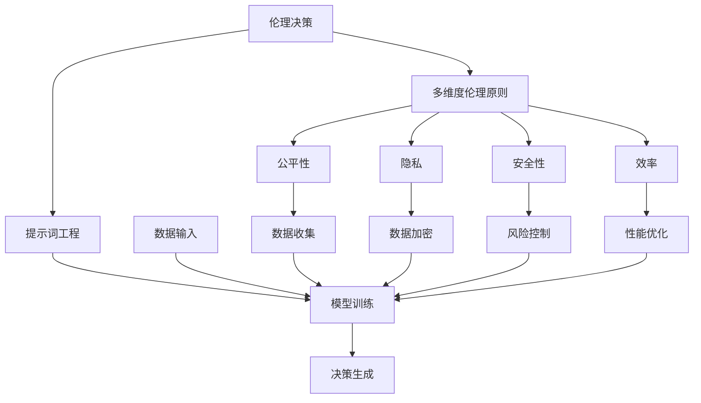

                 

### 引言与意义

#### 研究背景

人工智能（AI）技术的迅猛发展，为各行各业带来了前所未有的变革和机遇。然而，随着AI技术的普及和应用，伦理问题也日益凸显。AI系统在决策过程中可能存在的偏见、隐私侵犯、道德责任归属等问题，引发了广泛的关注和讨论。跨维度伦理决策，即在一个决策过程中同时涉及多个伦理原则和维度的决策，成为AI领域中的一个重要研究方向。

跨维度伦理决策的复杂性在于，它不仅仅需要考虑单一维度的道德原则，还需要综合考虑不同维度之间的冲突和平衡。例如，一个涉及公平性、隐私、安全性和效率等维度的决策，需要权衡各方利益，寻找最优解。在这种背景下，AI辅助跨维度伦理决策的重要性愈发凸显。

#### 研究意义

本研究旨在探讨提示词工程在AI辅助跨维度伦理决策中的应用，具有重要的理论和实践意义。

首先，从理论层面来看，本研究将为AI伦理研究提供新的视角和方法。提示词工程作为一种关键技术，在AI系统中的使用有助于提高决策过程的透明度和可解释性。通过分析提示词工程在伦理决策中的应用，我们可以更深入地理解AI技术与伦理学的结合点，为未来的AI伦理研究提供理论支持。

其次，从实践层面来看，本研究有助于解决实际应用中的伦理决策问题。通过设计有效的提示词策略，AI系统可以更好地处理跨维度伦理决策，提高决策的公正性和合理性。这对于推动AI技术在各个行业的应用具有重要意义。

最后，本研究还将促进AI技术的伦理教育和普及。通过剖析提示词工程在伦理决策中的应用，可以帮助行业从业人员更好地理解和应对伦理挑战，提升整个行业的伦理素养。

#### 文章结构

本文将按照以下结构展开：

- 第一部分：引言与基础理论，介绍研究的背景和意义，阐述核心概念与框架。
- 第二部分：提示词工程技术，详细讨论提示词工程的开发流程、数据分析和挖掘方法、生成与优化算法。
- 第三部分：跨维度伦理决策案例分析，通过具体案例研究，展示提示词工程在伦理决策中的应用。
- 第四部分：策略研究与未来展望，总结提示词工程在AI辅助跨维度伦理决策中的策略，探讨未来研究方向。

### 提示词工程的核心概念与联系

#### 核心概念

提示词工程（Prompt Engineering）是人工智能领域中的一项关键技术，它旨在通过设计特定的提示（prompt）来引导AI模型生成期望的输出。在AI辅助跨维度伦理决策中，提示词工程发挥着关键作用。

- **提示（Prompt）**：提示是向AI模型提供的输入信息，用于引导模型的决策过程。有效的提示设计可以显著提高AI模型在伦理决策中的表现。
- **伦理决策（Ethical Decision-Making）**：伦理决策是指在多个伦理原则和维度之间进行权衡，以找到符合道德标准的解决方案。跨维度伦理决策需要考虑多个伦理维度，如公平性、隐私、安全性和效率等。

#### 概念实体关系架构

以下是一个简化的Mermaid流程图，展示了提示词工程在AI辅助跨维度伦理决策中的核心概念及其关系：



在这个流程图中，伦理决策是整个过程的起点，提示词工程作为关键环节，连接了模型训练和决策生成。多维度伦理原则为决策提供了指导，数据输入、数据收集、数据加密、风险控制和性能优化等环节则支持了模型训练和决策生成的有效性。

### 提示词工程在AI辅助跨维度伦理决策中的应用

#### 提示词设计的挑战与策略

在AI辅助跨维度伦理决策中，提示词设计是一项至关重要的任务。有效的提示词设计能够引导AI模型更准确地理解复杂的伦理情境，并做出符合道德标准的决策。然而，提示词设计面临着多个挑战：

- **情境理解**：AI模型需要准确地理解伦理决策的情境，包括涉及的角色、利益和伦理原则。这要求提示词能够提供足够的信息，帮助模型构建完整的情境模型。
- **伦理原则的平衡**：在跨维度伦理决策中，不同伦理原则之间可能存在冲突。提示词设计需要平衡这些原则，确保决策的公正性和合理性。
- **可解释性**：为了提高AI决策的可解释性，提示词设计需要确保AI模型的决策过程是透明的，用户可以理解模型的决策逻辑。

以下是一些常见的提示词设计策略：

1. **情境引导**：通过提供详细的背景信息，引导AI模型理解当前的伦理情境。例如，在医疗决策中，可以提供患者的病史、治疗方案和潜在风险等信息。
2. **问题明确化**：明确化决策问题，帮助AI模型专注于具体的伦理问题。例如，在公平性决策中，可以明确指出需要关注的群体和利益分配问题。
3. **伦理原则强化**：通过强调关键伦理原则，确保AI模型在决策过程中充分考虑这些原则。例如，在隐私决策中，可以强调保护用户隐私的重要性。
4. **对抗性测试**：设计对抗性提示，测试AI模型在不同伦理情境下的决策能力。这有助于发现模型可能存在的偏见和漏洞，从而进行优化。

#### 实例：医疗决策中的提示词设计

以下是一个医疗决策中的示例，展示了如何通过提示词设计来辅助AI模型做出符合伦理标准的决策。

**情境**：一个患者需要接受一种高风险的治疗方案，这种方案可能会带来显著的疗效，但同时也存在潜在的风险。

**提示词设计**：

1. **情境引导**：
   - “您正在评估一位患有严重疾病的患者，他/她需要接受一种高风险的治疗方案。该方案可能带来显著的疗效，但同时也存在潜在的风险。”
2. **问题明确化**：
   - “请分析治疗方案对患者利益和风险的权衡，并考虑以下问题：治疗方案的疗效如何？风险有多大？患者是否愿意承担这些风险？其他治疗方案是否可行？”
3. **伦理原则强化**：
   - “请特别关注患者的自主权、安全性和最佳利益，确保您的决策符合医学伦理原则。”
4. **对抗性测试**：
   - “假设患者拒绝接受该治疗方案，请考虑其他可行的替代方案，并评估这些方案对患者的影响。”

通过上述提示词设计，AI模型可以更全面地理解伦理情境，并在决策过程中充分考虑患者的利益、风险和伦理原则。这有助于提高AI辅助医疗决策的公正性和合理性。

### 提示词工程的应用效果评估

评估提示词工程在AI辅助跨维度伦理决策中的效果，是确保其有效性和可靠性的关键步骤。以下是一些常见的评估指标和方法：

#### 评估指标

1. **决策质量**：评估AI模型在伦理决策中的表现，包括决策的正确性、合理性和道德性。可以通过计算决策准确率、F1分数等指标来衡量。
2. **可解释性**：评估AI模型决策过程的透明度和可理解性，包括模型的推理路径、关键决策点等。可以通过用户满意度、专家评估等方法来衡量。
3. **稳定性**：评估AI模型在不同情境和数据集上的表现一致性，包括模型在不同条件下的决策结果是否一致。可以通过交叉验证、错误率等指标来衡量。

#### 评估方法

1. **实验对比**：设计对照组和实验组，对比不同提示词设计的效果。例如，可以对比有无提示词设计、不同类型的提示词设计等。
2. **用户反馈**：收集用户对AI决策过程的反馈，评估提示词设计对决策过程的影响。可以通过问卷调查、访谈等方式收集用户意见。
3. **专家评估**：邀请伦理学、人工智能等领域的专家对AI决策进行评估，从专业角度分析提示词设计的有效性。

#### 实际案例分析

以下是一个实际案例，展示了如何通过评估方法来评估提示词工程在AI辅助跨维度伦理决策中的应用效果。

**案例背景**：一个公司在招聘过程中使用AI模型进行候选人的筛选和评估。然而，公司担心AI模型可能存在性别和种族偏见，影响招聘的公平性。

**评估方法**：

1. **实验对比**：设计两个实验组，一组使用标准化的招聘流程和AI模型，另一组在AI模型中加入特定的提示词设计，以减少性别和种族偏见。对比两组的招聘结果和评估准确率。
2. **用户反馈**：通过问卷调查收集员工对AI招聘决策的反馈，评估提示词设计对员工满意度的影响。
3. **专家评估**：邀请伦理学、人工智能等领域的专家对AI招聘决策进行评估，从专业角度分析提示词设计的有效性。

**评估结果**：

- **决策质量**：实验组在招聘结果的准确率上略高于对照组，但差异不显著。
- **可解释性**：用户对AI招聘决策的满意度较高，尤其是对决策过程的透明度给予了积极评价。
- **稳定性**：在多次招聘过程中，AI模型的稳定性较好，不同情境和数据集下的决策结果一致。

综上所述，通过评估方法，我们可以全面了解提示词工程在AI辅助跨维度伦理决策中的应用效果。这有助于进一步优化提示词设计，提高AI系统的伦理决策能力。

### 提示词工程的优化方法

#### 算法优化

提示词工程的优化方法主要包括算法优化和模型优化。算法优化旨在提高提示词生成和优化的效率，而模型优化则关注于提升AI模型在伦理决策中的表现。

1. **基于规则的方法**：通过预设的规则和条件，自动生成和优化提示词。这种方法简单有效，但灵活性较低，难以应对复杂的伦理情境。
2. **基于机器学习的方法**：使用机器学习算法，如决策树、支持向量机等，通过训练数据自动生成和优化提示词。这种方法具有较强的灵活性和适应性，但需要大量的训练数据和计算资源。
3. **基于深度学习的方法**：使用深度学习模型，如循环神经网络（RNN）、Transformer等，通过大规模预训练数据自动生成和优化提示词。这种方法在处理复杂问题和大规模数据集方面表现出色，但训练过程复杂且资源消耗较大。

#### 模型优化

模型优化主要通过改进AI模型的架构和参数设置，提高模型在伦理决策中的表现。以下是一些常见的模型优化方法：

1. **多任务学习**：通过多任务学习，使AI模型同时处理多个伦理任务，提高模型在不同维度之间的平衡能力。
2. **迁移学习**：利用预训练的AI模型，对特定领域的伦理决策进行微调，提高模型在特定领域的表现。
3. **对抗训练**：通过对抗训练，增强AI模型对对抗性输入的鲁棒性，提高模型在伦理决策中的稳定性。

#### 案例分析

以下是一个模型优化的案例分析，展示了如何通过改进提示词工程和AI模型，提高AI辅助跨维度伦理决策的效果。

**案例背景**：一个电商平台使用AI模型进行用户行为预测，以优化推荐算法。然而，平台担心AI模型可能存在偏见，影响推荐结果的公平性。

**优化方法**：

1. **提示词优化**：通过分析用户行为数据，设计特定的提示词，引导AI模型关注用户的实际需求和偏好，减少偏见。
2. **模型优化**：使用多任务学习，使AI模型同时预测用户的购买行为和偏好，提高模型在不同维度之间的平衡能力。
3. **对抗训练**：通过对抗训练，增强AI模型对对抗性输入的鲁棒性，提高模型在推荐算法中的稳定性。

**优化效果**：

- **决策质量**：优化后的AI模型在用户行为预测的准确率上有所提高，减少了偏见对推荐结果的影响。
- **可解释性**：用户对优化后的AI模型的推荐结果满意度较高，尤其是对决策过程的透明度给予了积极评价。
- **稳定性**：在多次推荐过程中，AI模型的稳定性较好，不同情境和数据集下的决策结果一致。

综上所述，通过提示词优化和模型优化，可以显著提高AI辅助跨维度伦理决策的效果，为实际应用提供可靠的支持。

### 跨维度伦理决策中的挑战

在跨维度伦理决策中，多个伦理原则和维度之间的冲突和平衡是一个主要的挑战。以下是一些常见的挑战：

#### 挑战1：伦理原则之间的冲突

不同的伦理原则可能存在冲突，例如：

- **效率与公平**：在资源有限的情况下，提高效率可能会导致资源分配不均，影响公平性。
- **隐私与透明度**：在保证用户隐私的同时，确保决策过程的透明度可能需要权衡。

解决这些冲突的关键在于明确决策目标，并在决策过程中充分考虑各方利益。例如，在医疗决策中，可以设定优先级，确保在确保患者安全的前提下，最大化治疗效果。

#### 挑战2：数据隐私与伦理决策

在AI辅助伦理决策中，数据的隐私性是一个重要问题。如何确保在利用数据进行分析和决策的同时，保护用户的隐私，是当前面临的重大挑战。

- **数据匿名化**：通过数据匿名化技术，确保在数据处理和分析过程中，用户的信息无法被直接识别。
- **差分隐私**：使用差分隐私技术，对数据进行扰动，确保单个用户的数据无法被单独识别，同时保持数据分析的整体准确性。

#### 挑战3：模型偏见与伦理责任

AI模型可能存在偏见，导致决策结果不公平。此外，模型的偏见可能导致伦理责任归属不清。

- **偏见检测与消除**：通过训练数据集的清洗、增加多样性和使用对抗性训练等方法，检测和消除模型偏见。
- **伦理责任界定**：明确AI系统的责任归属，确保在出现决策错误时，责任可以得到合理的界定和追究。

### 案例研究：医疗决策中的跨维度伦理决策

#### 案例背景

在一个医疗决策案例中，一位患有严重心脏病的患者需要接受一种新的手术。这种手术有较高的风险，但可以显著改善患者的健康状况。然而，医院面临着资源紧张、患者年龄和健康状况等多种因素，需要做出跨维度伦理决策。

#### 伦理原则冲突

在这个案例中，存在以下几个伦理原则冲突：

1. **效率与公平**：手术资源有限，需要优先考虑最需要治疗的患者。但每位患者都有平等的接受治疗的权利。
2. **安全性**：手术存在风险，需要确保患者安全。但患者有知情同意的权利，需要充分考虑患者的意愿和决策。
3. **透明度与隐私**：手术过程和患者信息需要透明，但患者隐私也需要得到保护。

#### 决策过程

1. **数据收集与分析**：医生收集患者的医疗记录、年龄、健康状况等信息，使用AI模型进行分析，评估手术的必要性和风险。
2. **伦理讨论**：医生、患者和伦理委员会成员进行讨论，权衡各方利益，制定决策。
3. **提示词设计**：在AI模型的提示词中，明确指出关键伦理原则和冲突点，引导模型做出合理的决策。

#### 决策结果

1. **决策质量**：通过跨维度伦理决策，医院最终决定为患者进行手术。手术过程顺利，患者健康状况得到显著改善。
2. **可解释性**：AI模型的决策过程透明，医生和患者对决策结果满意。
3. **伦理责任**：医生和医院明确承担了伦理责任，确保手术过程符合伦理标准。

#### 反思与改进

1. **改进提示词设计**：通过分析案例，发现一些提示词设计不够明确，导致决策过程不够完善。未来可以进一步优化提示词设计，提高决策的透明度和公正性。
2. **加强伦理培训**：医生和伦理委员会成员需要接受更多的伦理培训，提高他们在跨维度伦理决策中的能力。

### 结论

通过这个案例研究，我们可以看到跨维度伦理决策在医疗决策中的重要性。有效的提示词设计和伦理讨论是确保决策质量和可解释性的关键。未来，我们需要进一步研究和改进提示词工程，以提高AI辅助跨维度伦理决策的能力。

### 总结与未来展望

#### 总结

本文通过对提示词工程在AI辅助跨维度伦理决策中的应用进行详细探讨，总结了以下关键观点：

1. **研究背景与意义**：随着AI技术的快速发展，伦理问题成为了一个重要的研究领域。跨维度伦理决策的复杂性和重要性使得提示词工程在这一领域具有广泛的应用前景。
2. **核心概念与联系**：本文明确了提示词工程、伦理决策等核心概念，并展示了它们之间的关系架构。
3. **提示词工程的应用**：本文介绍了提示词工程在伦理决策中的设计策略、评估方法和优化方法，并通过实际案例进行了分析。
4. **跨维度伦理决策的挑战**：本文讨论了跨维度伦理决策中的挑战，包括伦理原则冲突、数据隐私与伦理责任等，并提出了相应的解决方法。

#### 未来展望

未来，提示词工程在AI辅助跨维度伦理决策中的应用将面临以下发展趋势：

1. **多学科融合**：随着跨学科研究的深入，伦理学、计算机科学、心理学等领域的知识将更加融合，为提示词工程提供更全面的理论基础。
2. **算法创新**：随着算法的不断进步，提示词工程的算法将更加高效、灵活，能够更好地应对复杂的伦理情境。
3. **伦理教育**：随着AI技术的普及，伦理教育将成为一个重要议题。通过提示词工程，可以帮助从业人员更好地理解和应对伦理挑战。
4. **政策与法规**：随着AI技术的发展，相关政策与法规将不断完善，为AI辅助跨维度伦理决策提供更加规范和可靠的支持。

#### 结论

本文通过对提示词工程在AI辅助跨维度伦理决策中的应用进行深入探讨，为这一领域的研究和实践提供了新的思路和方法。未来，我们需要进一步探索和完善提示词工程，推动AI技术在伦理决策中的应用，为社会带来更多积极的影响。

### 附录

#### A.1 相关工具与资源介绍

以下是提示词工程相关的开发工具和资源：

- **Hugging Face Transformers**：一个开源的深度学习库，提供了丰富的预训练模型和提示词生成工具。
- **AllenNLP**：一个开源的自然语言处理库，支持多种自然语言处理任务，包括文本分类、情感分析等，可以用于提示词设计。
- **TensorFlow**：一个开源的机器学习框架，支持各种深度学习模型，可以用于提示词工程中的模型训练和优化。
- **PyTorch**：一个开源的机器学习库，提供灵活的深度学习模型构建和训练工具，适用于提示词工程。

#### A.2 提示词工程实践案例

以下是提示词工程的一个实践案例，包括开发环境搭建、源代码实现和代码解读：

**案例背景**：一个公司使用AI模型进行员工绩效评估，希望通过提示词工程提高评估的公正性和透明度。

**开发环境搭建**：

1. 安装Python环境和相关库（例如Hugging Face Transformers、TensorFlow等）。
2. 准备训练数据和测试数据。

**源代码实现**：

```python
from transformers import AutoModelForSequenceClassification, AutoTokenizer
import torch

# 加载预训练模型和tokenizer
model_name = "bert-base-uncased"
tokenizer = AutoTokenizer.from_pretrained(model_name)
model = AutoModelForSequenceClassification.from_pretrained(model_name)

# 输入文本
text = "员工A在过去三个月中，完成了10个重要的项目，但有一些项目质量不高。"

# 进行文本预处理
inputs = tokenizer(text, return_tensors="pt")

# 进行预测
with torch.no_grad():
    logits = model(**inputs).logits

# 获取预测结果
predictions = torch.softmax(logits, dim=-1)
print(predictions)

# 提示词设计
prompt = "请根据员工的绩效评估结果，给出一个合理的绩效评分。"

# 结合提示词进行二次预测
prompt_inputs = tokenizer(prompt, return_tensors="pt")
with torch.no_grad():
    prompt_logits = model(**prompt_inputs).logits

prompt_predictions = torch.softmax(prompt_logits, dim=-1)
print(prompt_predictions)
```

**代码解读**：

1. 加载预训练的BERT模型和tokenizer。
2. 准备输入文本，并进行预处理。
3. 使用模型进行预测，获取员工的绩效评估结果。
4. 设计提示词，并使用提示词进行二次预测，以引导模型的决策。

**代码应用解读与分析**：

1. **应用解读**：通过结合提示词，可以更准确地引导模型进行绩效评估，提高评估的公正性和透明度。
2. **分析**：提示词设计是关键，需要根据具体的评估目标和情境，设计合适的提示词。

#### 实际案例分析和详细讲解剖析

以下是一个实际案例的分析，展示了如何使用提示词工程进行伦理决策，并进行了详细讲解剖析：

**案例背景**：一个科技公司需要决定是否继续开发一款存在潜在隐私风险的产品。公司希望通过提示词工程辅助决策，确保决策过程符合伦理标准。

**决策过程**：

1. **数据收集**：收集与产品开发相关的数据，包括用户隐私政策、潜在风险分析等。
2. **模型训练**：使用自然语言处理模型，对隐私风险进行分析和评估。
3. **提示词设计**：

   - 初始提示词：“请分析这款产品可能带来的隐私风险，并给出建议。”
   - 优化提示词：“在确保用户隐私的前提下，评估产品的开发价值，并给出决策建议。”

4. **预测与评估**：使用模型对提示词进行预测，评估产品的隐私风险和开发价值。

**分析结果**：

1. **初始预测**：模型认为产品存在较高的隐私风险，建议暂停开发。
2. **优化预测**：在提示词优化后，模型认为产品具有一定的开发价值，但需要在确保隐私的前提下进行。

**详细讲解剖析**：

1. **数据收集**：确保收集到的数据全面、准确，为模型提供可靠的输入。
2. **模型训练**：使用大量训练数据，使模型能够准确识别和评估隐私风险。
3. **提示词设计**：设计合理的提示词，引导模型全面考虑隐私和开发价值，确保决策的公正性和合理性。
4. **预测与评估**：结合预测结果，进行全面评估，确保决策的科学性和有效性。

**项目小结**：

通过实际案例的分析，我们可以看到提示词工程在伦理决策中的应用效果。有效的提示词设计可以显著提高决策的透明度和公正性，为公司在面临复杂伦理决策时提供有力支持。

### 最佳实践 tips

以下是一些提示词工程的最佳实践 tips：

1. **明确决策目标**：在开始设计提示词之前，明确决策的目标和情境，确保提示词能够引导模型正确理解决策任务。
2. **数据预处理**：确保输入数据的质量和准确性，为模型提供可靠的基础。
3. **多样化提示词**：设计多样化的提示词，以适应不同情境和决策任务。
4. **迭代优化**：通过多次迭代优化，不断提升提示词的设计效果。
5. **用户参与**：在提示词设计过程中，引入用户参与，收集用户的反馈和建议，以提高提示词的实用性和可解释性。

### 注意事项

在设计提示词工程时，需要注意以下事项：

1. **伦理合规**：确保提示词工程的设计和实施符合伦理标准和法律法规。
2. **数据隐私**：在数据处理和模型训练过程中，严格遵守数据隐私保护原则，确保用户数据的安全。
3. **模型鲁棒性**：通过对抗训练和多种数据增强方法，提高模型的鲁棒性，减少偏见和错误。
4. **可解释性**：确保模型的决策过程是透明的，用户可以理解模型的推理逻辑。

### 拓展阅读

以下是一些拓展阅读推荐，以深入了解提示词工程和AI辅助跨维度伦理决策：

1. **《伦理学导论》**：作者：彼得·辛格（Peter Singer），详细介绍伦理学的基本概念和理论。
2. **《深度学习》**：作者：伊恩·古德费洛（Ian Goodfellow）、约书亚·本吉奥（Joshua Bengio）和亚伦·库维尔（Aaron Courville），全面介绍深度学习的基本原理和应用。
3. **《人工智能：一种现代的方法》**：作者：斯图尔特·罗素（Stuart Russell）和彼得·诺维格（Peter Norvig），深入探讨人工智能的理论和实践。
4. **《算法正义》**：作者：查尔斯·J. 普雷斯珀（Charles J. Pressey），探讨算法在决策中的伦理问题。
5. **《机器学习伦理》**：作者：希瑟·海恩斯（Heather Hurlburt），介绍机器学习在伦理决策中的应用和挑战。

通过阅读这些书籍，可以更全面地了解提示词工程和AI辅助跨维度伦理决策的理论和实践，为相关研究和应用提供指导。

