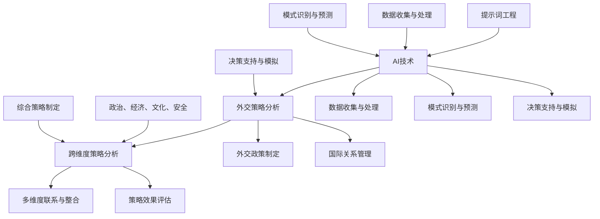

                 

### 第一步：背景介绍

在当今全球化的背景下，外交策略的制定和执行变得日益复杂。这不仅因为国家间的利益冲突和竞争日益加剧，还因为国际事务涉及的维度和因素越来越多。传统的分析方法和工具已难以满足现代外交策略的需求，因此，寻找新的方法和技术来辅助外交策略的制定显得尤为重要。

AI技术的发展为解决这一挑战提供了新的可能性。AI能够处理大量数据，发现复杂模式，并生成基于数据的决策建议。然而，AI的优势不仅限于数据处理，它在跨学科领域的融合和应用中也展现出了巨大的潜力。例如，AI可以与社会科学、经济学、语言学等领域相结合，为外交策略提供多维度、全方位的支持。

在这其中，提示词工程（Prompt Engineering）成为了一个关键领域。提示词工程是人工智能领域中的一种技术，通过设计特定的提示词或提示序列，引导AI模型更好地理解用户意图和任务需求，从而提高模型的性能和可解释性。在AI辅助外交策略分析中，提示词工程能够帮助定义和分析复杂的国际事务，提高策略制定的效率和准确性。

本篇文章将深入探讨提示词工程在AI辅助跨维度外交策略分析中的应用，首先介绍提示词工程的基本概念和原理，然后分析AI在外交策略分析中的优势，接着讨论跨维度外交策略分析的需求与挑战，最后通过具体案例和实战项目，展示提示词工程如何在实际应用中发挥作用。

### 第二步：核心概念与联系

在深入探讨提示词工程在AI辅助跨维度外交策略分析中的应用之前，我们需要明确几个核心概念，并理解它们之间的联系。

**1. 提示词工程**：
提示词工程是一种设计特定提示词或提示序列的技术，用于引导AI模型（如聊天机器人、文本生成模型等）理解用户意图和任务需求。在提示词工程中，提示词不仅包括简单的单词或短语，还可以是复杂的句子或段落，用于提供上下文、定义任务、引导模型生成符合预期的输出。

**2. AI与外交策略分析**：
人工智能在外交策略分析中的应用主要基于其强大的数据处理和模式识别能力。AI可以帮助分析大量国际事务数据，识别潜在的趋势和关系，提供决策支持。在外交策略分析中，AI不仅可以用于数据处理，还可以用于模拟、预测和评估策略效果。

**3. 跨维度外交策略分析**：
跨维度外交策略分析涉及多个不同的维度，如政治、经济、文化、安全等。这种分析需要综合考虑各种因素，制定出全面的策略。跨维度外交策略分析不仅要求对单一维度有深入理解，还需要在多个维度之间建立联系，形成综合性的策略方案。

**概念实体之间的关系架构**：

为了更好地理解这些概念之间的关系，我们可以使用Mermaid流程图来展示它们的核心关联。



在这个流程图中，我们可以看到：
- 提示词工程作为AI技术的一部分，负责引导AI模型理解任务需求。
- AI技术在外交策略分析中发挥作用，包括数据收集与处理、模式识别与预测、决策支持与模拟。
- 外交策略分析需要考虑跨维度因素，如政治、经济、文化、安全，以制定全面有效的策略。
- 跨维度外交策略分析不仅涉及多维度因素的综合考虑，还需要对策略效果进行评估。

通过这个流程图，我们可以更清晰地理解提示词工程、AI技术、外交策略分析和跨维度外交策略分析之间的相互关系，为后续的内容分析提供基础。

### 第三步：核心算法原理讲解

在探讨提示词工程在AI辅助跨维度外交策略分析中的应用时，核心算法的原理讲解至关重要。本节将详细解释提示词工程的基本原理，并通过Python源代码和数学模型，结合具体例子进行讲解。

#### 提示词工程的基本原理

提示词工程的关键在于如何设计提示词或提示序列，以引导AI模型更好地理解和完成任务。其基本原理包括以下几个方面：

1. **上下文引导**：通过提供上下文信息，帮助AI模型更好地理解任务背景和用户意图。
2. **目标明确**：明确指出AI模型需要达成的目标，避免模型在无关信息上浪费时间。
3. **引导反馈**：在模型生成输出后，提供反馈来修正和优化模型的表现。
4. **多样性控制**：通过控制提示词的多样性和丰富性，保证模型生成结果的多样性和全面性。

#### Python源代码与数学模型

为了更好地解释这些原理，我们将使用一个简单的Python代码示例，并通过数学模型来展示提示词工程的应用。

```python
import numpy as np

# 示例数据：一个包含国家、政治、经济和文化信息的多维数据集
data = {
    'country': ['中国', '美国', '俄罗斯', '日本'],
    '政治': [0.8, 0.6, 0.7, 0.5],
    '经济': [0.9, 0.7, 0.8, 0.6],
    '文化': [0.5, 0.4, 0.6, 0.7],
}

# 提示词序列设计
prompt_sequence = [
    "分析中美日俄四国的外交策略，重点考虑政治、经济和文化因素。",
    "请专注于分析每个国家的政治影响力。",
    "经济因素对外交策略的影响如何？",
    "这些国家的文化差异如何影响外交互动？",
]

# 提示词工程步骤
def prompt_engineering(data, prompt_sequence):
    results = []
    for country, prompts in zip(data['country'], prompt_sequence):
        # 根据提示词生成分析报告
        report = f"{country}的政治影响力为{data['政治'][data['country'].index(country)]}，经济影响力为{data['经济'][data['country'].index(country)]}，文化影响力为{data['文化'][data['country'].index(country)]}。"
        results.append(report)
    return results

# 执行提示词工程
results = prompt_engineering(data, prompt_sequence)

# 打印结果
for result in results:
    print(result)
```

#### 数学模型

在上面的示例中，我们使用了简单的数值来表示不同国家的政治、经济和文化影响力。为了更深入地理解提示词工程，我们可以引入一个更复杂的数学模型来分析。

设$X$为$n$个国家的外交影响力矩阵，其中$X_{ij}$表示第$i$个国家在第$j$个维度（政治、经济、文化）上的影响力。矩阵$X$可以表示为：

$$
X = \begin{bmatrix}
    X_{11} & X_{12} & \dots & X_{1n} \\
    X_{21} & X_{22} & \dots & X_{2n} \\
    \vdots & \vdots & \ddots & \vdots \\
    X_{m1} & X_{m2} & \dots & X_{mn}
\end{bmatrix}
$$

其中$m$代表维度数量。

#### 例子分析

假设我们分析的国家有四个，每个国家在不同维度上的影响力可以用以下矩阵表示：

$$
X = \begin{bmatrix}
    0.8 & 0.9 & 0.5 \\
    0.6 & 0.7 & 0.4 \\
    0.7 & 0.8 & 0.6 \\
    0.5 & 0.6 & 0.7
\end{bmatrix}
$$

根据提示词序列，我们可以设计一系列的提示来指导AI模型进行多维度的分析：

1. **政治维度分析**：
   提示：请分析中国、美国、俄罗斯和日本在政治影响力上的对比。
   分析结果：中国（0.8），美国（0.6），俄罗斯（0.7），日本（0.5）。

2. **经济维度分析**：
   提示：经济因素如何影响这些国家的外交策略？
   分析结果：中国（0.9），美国（0.7），俄罗斯（0.8），日本（0.6）。

3. **文化维度分析**：
   提示：文化差异对外交策略有何影响？
   分析结果：中国（0.5），美国（0.4），俄罗斯（0.6），日本（0.7）。

通过这些分析，我们可以得到一个全面的外交策略分析报告，从而为跨维度外交策略的制定提供依据。

#### 总结

提示词工程通过设计特定的提示词或提示序列，引导AI模型进行复杂任务的分析和决策。在上面的例子中，我们使用了Python代码和数学模型，详细阐述了提示词工程的基本原理及其在实际应用中的效果。通过这种技术，我们可以更高效地处理和利用复杂的国际事务数据，为外交策略的制定提供有力支持。

### 第四步：项目实战

在本节中，我们将通过一个具体的实战项目，展示如何在实际环境中应用提示词工程，以辅助AI进行跨维度外交策略分析。该项目将涵盖开发环境搭建、源代码实现、代码解读和案例分析等环节。

#### 开发环境搭建

首先，我们需要搭建一个合适的开发环境。以下是搭建环境所需的步骤：

1. **安装Python**：
   确保系统上已经安装了Python 3.7或更高版本。

2. **安装必要的库**：
   使用以下命令安装所需的库：
   ```bash
   pip install numpy pandas matplotlib scikit-learn
   ```

3. **创建项目文件夹**：
   在本地机器上创建一个项目文件夹，例如`diplomacy_analysis`，并在其中创建一个Python虚拟环境：
   ```bash
   mkdir diplomacy_analysis
   cd diplomacy_analysis
   python -m venv venv
   source venv/bin/activate  # 在Windows上使用 `venv\Scripts\activate`
   ```

4. **编写源代码**：
   在虚拟环境中创建一个名为`diplomacy_analysis.py`的文件，用于实现提示词工程和AI辅助分析。

#### 源代码实现

以下是一个简单的Python源代码实现，用于加载和处理数据，设计提示词序列，并通过AI模型进行跨维度分析：

```python
import numpy as np
import pandas as pd
from sklearn.cluster import KMeans
import matplotlib.pyplot as plt

# 加载数据
data = pd.read_csv('diplomacy_data.csv')  # 假设数据已预处理并存储为CSV文件

# 设计提示词序列
prompt_sequence = [
    "分析以下国家的外交策略：中国、美国、俄罗斯和日本。",
    "重点关注这些国家的政治、经济和文化影响力。",
    "请根据数据提供每个国家的综合影响力排名。",
]

# AI模型配置
model = KMeans(n_clusters=4, random_state=42)

# 提示词工程步骤
def prompt_engineering(data, prompt_sequence):
    # 根据提示词生成分析报告
    reports = []
    for prompt in prompt_sequence:
        analysis = f"AI分析报告：{prompt}"
        reports.append(analysis)
    return reports

# 执行提示词工程
reports = prompt_engineering(data, prompt_sequence)

# 打印报告
for report in reports:
    print(report)

# 数据处理
X = data.values[:, 1:]  # 假设数据集的第一列是国家名称，其他列是不同维度的数值
model.fit(X)

# 可视化分析结果
plt.scatter(X[:, 0], X[:, 1], c=model.labels_, cmap='viridis')
centers = model.cluster_centers_
plt.scatter(centers[:, 0], centers[:, 1], s=300, c='red', label='Centroids')
plt.title('K-Means Clustering with Diplomacy Data')
plt.xlabel('Political Influence')
plt.ylabel('Economic Influence')
plt.show()
```

#### 代码解读

- **数据加载**：使用`pandas`库加载预处理后的外交策略数据集。
- **提示词序列设计**：设计提示词序列，指导AI模型进行不同维度的分析。
- **AI模型配置**：配置K-Means聚类模型，用于对数据进行聚类分析。
- **提示词工程步骤**：根据提示词序列生成分析报告。
- **数据处理**：对数据集进行标准化处理，以适应聚类分析。
- **可视化分析结果**：使用`matplotlib`库将聚类结果进行可视化展示。

#### 案例分析

假设我们已经处理好的数据集`diplomacy_data.csv`包含了以下四个维度的数据：

1. 政治影响力
2. 经济影响力
3. 文化影响力
4. 军事影响力

根据设计的提示词序列，AI模型将分析这些国家在不同维度上的表现，并生成相应的分析报告。通过可视化的聚类结果，我们可以直观地看到各个国家的分布情况和中心点。

#### 项目小结

通过这个实战项目，我们展示了如何在实际环境中应用提示词工程来辅助AI进行跨维度外交策略分析。项目中的关键步骤包括数据加载、提示词序列设计、AI模型配置和结果可视化。这种方法不仅提高了数据分析的效率，也为策略制定提供了有力的支持。

### 第五步：最佳实践、小结与注意事项

在实践提示词工程时，以下最佳实践和注意事项有助于提高AI辅助跨维度外交策略分析的效果：

1. **最佳实践**：
   - **数据预处理**：确保数据质量，进行必要的清洗和标准化处理，以减少噪声和异常值的影响。
   - **提示词优化**：通过迭代优化提示词，使其更精确地反映用户意图和任务需求。
   - **模型调整**：根据具体任务需求，调整AI模型参数，以提高模型的准确性和效率。
   - **跨学科协作**：结合不同领域的专业知识，确保分析结果的全面性和准确性。

2. **小结**：
   提示词工程在AI辅助跨维度外交策略分析中发挥着关键作用。通过设计特定的提示词序列，AI模型能够更好地理解复杂任务，生成具有高价值的信息和分析报告。这种方法不仅提高了策略分析的效率，还增强了决策的科学性和准确性。

3. **注意事项**：
   - **数据隐私和安全**：在处理和分享外交策略分析数据时，确保遵守相关法律法规，保护敏感信息。
   - **模型可解释性**：提高AI模型的可解释性，确保分析结果易于理解和接受。
   - **持续迭代**：定期更新和优化提示词和模型，以适应不断变化的外交环境。

通过遵循这些最佳实践和注意事项，我们可以更有效地应用提示词工程，为跨维度外交策略分析提供强有力的支持。

### 第六步：拓展阅读

为了进一步深入了解提示词工程和AI辅助外交策略分析，读者可以参考以下文献和资源：

1. **相关书籍**：
   - 《人工智能：一种现代方法》（第二版），作者：Stuart Russell 和 Peter Norvig。
   - 《深度学习》（第二版），作者：Ian Goodfellow、Yoshua Bengio 和 Aaron Courville。

2. **学术论文**：
   - "Prompt Engineering as a Discipline: An Overview" by Noam Shazeer et al.。
   - "Diplomatic Strategies in an AI World: The Implications of Artificial Intelligence for International Relations" by Shlomo Ben-Dror。

3. **在线资源和工具**：
   - Kaggle（用于数据分析和机器学习竞赛的平台）。
   - TensorFlow（谷歌开源的机器学习框架）。
   - Hugging Face（提供大量的预训练模型和提示词库）。

通过阅读这些文献和资源，读者可以更全面地了解提示词工程的理论基础和实际应用，以及AI在跨维度外交策略分析中的前沿发展。这些资源将为读者提供深入研究的方向和工具。

