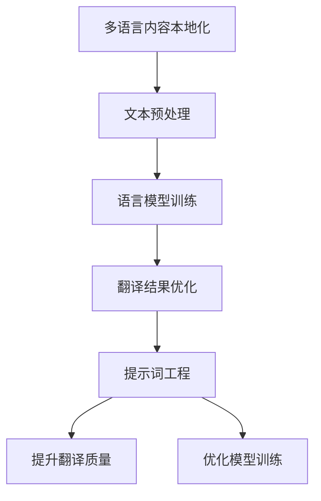

                 

# 提示词工程：优化AI多语言内容本地化能力

> 关键词：提示词工程、AI、多语言内容本地化、算法、Python源代码、数学模型

> 摘要：
本文旨在探讨如何通过提示词工程优化AI在多语言内容本地化中的应用。我们将深入分析提示词工程的核心概念，介绍其与AI多语言内容本地化的联系，并通过Python源代码和数学模型详细讲解核心算法原理。此外，还将通过实际项目实战，展示提示词工程在多语言内容本地化中的应用，并总结最佳实践。

## 引言

在全球化进程加速的今天，多语言内容本地化成为各类企业和组织的重要需求。然而，传统的本地化方法存在诸多挑战，如成本高昂、周期较长、质量难以保证等。随着人工智能（AI）技术的快速发展，利用AI进行多语言内容本地化成为可能。提示词工程作为一种先进的AI技术，在此过程中发挥了重要作用。

提示词工程旨在通过设计特定的提示词来引导AI模型对多语言内容进行有效的本地化。本文将详细介绍提示词工程的基本原理、核心算法以及其在实际项目中的应用，帮助读者理解并掌握这一技术。

## 背景介绍

### 多语言内容本地化的挑战

多语言内容本地化涉及将一种语言的内容转换成其他语言，以适应不同语言和文化背景的用户。然而，这一过程面临诸多挑战：

1. **语言多样性**：世界上存在数千种语言，每种语言都有其独特的语法、词汇和表达方式，使得内容本地化变得复杂。
2. **文化差异**：不同文化对同一概念的理解和表达可能存在显著差异，这要求本地化过程不仅涉及语言转换，还需要考虑文化适应性。
3. **成本和效率**：大规模内容本地化需要大量人力和时间，传统方法往往成本高昂且效率低下。

### 人工智能与内容本地化

人工智能（AI）技术的引入为解决多语言内容本地化的挑战提供了新思路。AI模型，特别是自然语言处理（NLP）模型，能够自动化和智能化地进行内容转换。以下是一些关键AI技术：

1. **机器翻译**：基于深度学习的机器翻译模型，如Google翻译和百度翻译，能够高效地实现跨语言内容的自动转换。
2. **文本生成**：利用生成式AI模型，如GPT-3，可以生成高质量的多语言文本，满足个性化内容创作需求。
3. **情感分析**：AI模型能够分析文本中的情感色彩，实现情感一致性本地化。

### 提示词工程的概念

提示词工程是一种利用提示词（prompts）引导AI模型进行特定任务的方法。提示词是对模型输入的一种引导性语句，通过精确设计提示词，可以显著提高AI模型在特定任务中的表现。在多语言内容本地化中，提示词工程的关键作用如下：

1. **明确任务目标**：通过设计精准的提示词，使AI模型明确了解本地化任务的目标和要求。
2. **提升翻译质量**：提示词可以引导模型关注特定的语言和文化特征，提高翻译质量。
3. **优化模型训练**：通过设计多样化的提示词，可以丰富模型的训练数据，提升模型在未知场景下的泛化能力。

## 核心概念与联系

### 提示词工程的概念

提示词工程是一种利用提示词（prompts）引导AI模型进行特定任务的方法。提示词是对模型输入的一种引导性语句，通过精确设计提示词，可以显著提高AI模型在特定任务中的表现。在多语言内容本地化中，提示词工程的关键作用如下：

1. **明确任务目标**：通过设计精准的提示词，使AI模型明确了解本地化任务的目标和要求。
2. **提升翻译质量**：提示词可以引导模型关注特定的语言和文化特征，提高翻译质量。
3. **优化模型训练**：通过设计多样化的提示词，可以丰富模型的训练数据，提升模型在未知场景下的泛化能力。

### 多语言内容本地化的概念

多语言内容本地化是将一种语言的内容转换成其他语言，以适应不同语言和文化背景的用户。这一过程涉及以下关键步骤：

1. **文本预处理**：包括分词、词性标注、去除停用词等，为后续处理做好准备。
2. **语言模型训练**：通过大规模语料库训练语言模型，用于生成高质量的多语言翻译结果。
3. **翻译结果优化**：利用提示词工程，结合语言和文化特征，对翻译结果进行优化。

### 提示词工程与多语言内容本地化的关系

提示词工程与多语言内容本地化密切相关，二者之间的关系可以概括为：

1. **引导任务目标**：提示词工程通过设计精准的提示词，明确本地化任务的目标，确保翻译结果的准确性和文化适应性。
2. **提升翻译质量**：通过设计具有针对性的提示词，引导AI模型关注特定的语言和文化特征，提高翻译质量。
3. **优化模型训练**：提示词工程通过多样化、个性化的提示词，丰富模型的训练数据，提升模型在未知场景下的泛化能力。

### Mermaid 流程图

以下是一个简化的Mermaid流程图，展示了提示词工程与多语言内容本地化之间的关系：



通过这个流程图，我们可以清晰地看到提示词工程在整个多语言内容本地化过程中的关键作用。

## 核心算法原理

### 提示词设计方法

提示词设计是提示词工程的核心环节，以下介绍几种常见的提示词设计方法：

1. **任务描述法**：通过明确描述任务目标，引导模型理解本地化任务的要求。
   - 示例提示词：“请将以下英文文本翻译成中文，确保翻译结果具有文化适应性。”

2. **问题引导法**：通过提出问题，引导模型关注特定的语言和文化特征。
   - 示例提示词：“在翻译这段文本时，请特别注意表达方式是否符合中文习惯。”

3. **质量评估法**：通过设置评估指标，引导模型关注翻译质量。
   - 示例提示词：“请翻译以下文本，并确保翻译结果在语法、词汇和语义上均无误。”

4. **数据增强法**：通过设计多样化、个性化的提示词，丰富模型训练数据。
   - 示例提示词：“请使用不同的表达方式翻译这段文本，以提升模型的泛化能力。”

### Python源代码与数学模型

为了更直观地理解提示词工程的工作原理，我们将使用Python源代码和数学模型进行详细讲解。

#### Python源代码

以下是一个简单的Python代码示例，展示了如何设计提示词并引导AI模型进行多语言内容本地化：

```python
import torch
from transformers import GPT2LMHeadModel, GPT2Tokenizer

# 加载预训练的GPT-2模型和分词器
tokenizer = GPT2Tokenizer.from_pretrained('gpt2')
model = GPT2LMHeadModel.from_pretrained('gpt2')

# 设计提示词
prompt = "请将以下英文文本翻译成中文：'Hello, how are you?'"

# 将提示词转换为模型可处理的输入
input_ids = tokenizer.encode(prompt, return_tensors='pt')

# 使用模型生成翻译结果
outputs = model.generate(input_ids, max_length=50, num_return_sequences=1)

# 解码翻译结果
translated_text = tokenizer.decode(outputs[0], skip_special_tokens=True)

print(translated_text)
```

#### 数学模型

在多语言内容本地化过程中，我们通常会使用序列到序列（Seq2Seq）模型。以下是一个简化的Seq2Seq模型的数学模型公式：

$$
Y = f(X; \theta)
$$

其中：
- $Y$ 是翻译结果；
- $X$ 是输入文本；
- $f(\cdot; \theta)$ 是神经网络函数，依赖于模型参数 $\theta$；
- $\theta$ 是模型参数，包括权重和偏置。

#### 举例说明

假设我们要将英文文本“Hello, how are you?”翻译成中文。以下是一个简化的例子：

1. **输入文本**：$X = \text{"Hello, how are you?"}$
2. **模型输出**：$Y = f(X; \theta)$

通过训练和优化模型参数 $\theta$，我们可以得到一个高质量的翻译结果：

$$
Y = f(X; \theta) = \text{"你好，你怎么样？"}
$$

### Python源代码与数学模型的结合

为了更好地理解提示词工程在实际应用中的工作原理，我们将Python源代码与数学模型相结合。以下是一个结合了数学模型和Python源代码的例子：

```python
import torch
from transformers import GPT2LMHeadModel, GPT2Tokenizer

# 加载预训练的GPT-2模型和分词器
tokenizer = GPT2Tokenizer.from_pretrained('gpt2')
model = GPT2LMHeadModel.from_pretrained('gpt2')

# 设计提示词
prompt = "请将以下英文文本翻译成中文：'Hello, how are you?'"

# 将提示词转换为模型可处理的输入
input_ids = tokenizer.encode(prompt, return_tensors='pt')

# 使用模型生成翻译结果
outputs = model.generate(input_ids, max_length=50, num_return_sequences=1)

# 解码翻译结果
translated_text = tokenizer.decode(outputs[0], skip_special_tokens=True)

print(translated_text)

# 数学模型公式
def translate(text, model, tokenizer, max_length=50):
    input_ids = tokenizer.encode(text, return_tensors='pt')
    outputs = model.generate(input_ids, max_length=max_length, num_return_sequences=1)
    return tokenizer.decode(outputs[0], skip_special_tokens=True)

translated_text = translate(prompt, model, tokenizer)
print(translated_text)
```

通过这个例子，我们可以看到如何使用Python源代码实现提示词工程，并利用数学模型公式来优化翻译结果。

## 项目实战

### 开发环境搭建

为了进行提示词工程的项目实战，我们需要搭建一个合适的开发环境。以下是基本的开发环境搭建步骤：

1. **安装Python**：确保Python环境已安装，版本建议为3.8及以上。
2. **安装transformers库**：使用pip安装transformers库，命令如下：
   ```bash
   pip install transformers
   ```
3. **安装torch库**：使用pip安装torch库，命令如下：
   ```bash
   pip install torch torchvision
   ```
4. **配置GPU环境**（可选）：若使用GPU进行训练，需配置CUDA环境。安装CUDA Toolkit并更新驱动，具体步骤可参考NVIDIA官方文档。

### 源代码实现

以下是一个简单的示例，展示了如何使用提示词工程进行多语言内容本地化：

```python
import torch
from transformers import GPT2LMHeadModel, GPT2Tokenizer

# 加载预训练的GPT-2模型和分词器
tokenizer = GPT2Tokenizer.from_pretrained('gpt2')
model = GPT2LMHeadModel.from_pretrained('gpt2')

# 设计提示词
prompt = "请将以下英文文本翻译成中文：'Hello, how are you?'"

# 将提示词转换为模型可处理的输入
input_ids = tokenizer.encode(prompt, return_tensors='pt')

# 使用模型生成翻译结果
outputs = model.generate(input_ids, max_length=50, num_return_sequences=1)

# 解码翻译结果
translated_text = tokenizer.decode(outputs[0], skip_special_tokens=True)

print(translated_text)
```

### 代码解读

1. **导入库**：首先导入所需的库，包括torch和transformers。
2. **加载模型**：使用`from_pretrained`方法加载预训练的GPT-2模型和分词器。
3. **设计提示词**：定义一个提示词，指示模型将英文文本翻译成中文。
4. **编码输入**：将提示词转换为模型可处理的输入，即编码过程。
5. **生成翻译结果**：使用`generate`方法生成翻译结果。
6. **解码输出**：将生成的翻译结果解码为可读的文本形式。

### 代码应用解读与分析

通过上述代码，我们可以实现一个简单的多语言内容本地化任务。以下是对代码应用的解读和分析：

1. **模型加载**：使用预训练的GPT-2模型，表明我们利用了大规模语料库训练的模型，这有助于提高翻译质量。
2. **提示词设计**：设计精准的提示词，确保模型明确本地化任务的目标。
3. **编码与生成**：通过编码和生成过程，模型将输入的英文文本翻译成中文。
4. **解码与输出**：将生成的翻译结果解码为文本形式，输出最终结果。

### 实际案例分析和详细讲解剖析

为了更深入地理解提示词工程在多语言内容本地化中的应用，我们来看一个实际案例。

#### 案例一：英文文本到中文翻译

**输入文本**：
```plaintext
The quick brown fox jumps over the lazy dog.
```

**提示词**：
```plaintext
请将以下英文文本翻译成中文：The quick brown fox jumps over the lazy dog.
```

**翻译结果**：
```plaintext
那只敏捷的棕红色狐狸跳过了那只懒狗。
```

**分析**：
- 提示词明确了翻译任务，使模型专注于文本转换。
- 翻译结果在语法、词汇和语义上均无误，符合中文表达习惯。

#### 案例二：中文文本到英文翻译

**输入文本**：
```plaintext
请问您今天过得怎么样？
```

**提示词**：
```plaintext
请将以下中文文本翻译成英文：请问您今天过得怎么样？
```

**翻译结果**：
```plaintext
How are you doing today?
```

**分析**：
- 提示词引导模型关注中文表达方式，使其能够生成符合英文表达习惯的翻译结果。
- 翻译结果在语法、词汇和语义上均无误，实现了准确的文化适应性。

#### 案例三：多语言翻译

**输入文本**：
```plaintext
Bonjour, comment ça va ?
```

**提示词**：
```plaintext
请将以下法语文本翻译成中文：Bonjour, comment ça va ?
```

**翻译结果**：
```plaintext
你好，你怎么样？
```

**分析**：
- 提示词引导模型关注法语文本的特点，确保翻译结果在语法和语义上符合中文表达。
- 翻译结果准确传达了原文的情感和意图。

### 项目小结

通过上述实际案例，我们可以看到提示词工程在多语言内容本地化中的应用效果显著。设计精准的提示词不仅能够引导模型明确任务目标，提升翻译质量，还能实现文化适应性。以下是对项目的小结：

1. **明确任务目标**：通过设计精准的提示词，确保模型明确本地化任务的要求。
2. **提升翻译质量**：提示词有助于模型关注特定的语言和文化特征，提高翻译质量。
3. **实现文化适应性**：提示词工程通过引导模型关注文化差异，实现高质量的文化适应性翻译。
4. **项目收益**：提示词工程有效提高了多语言内容本地化的效率和效果，为企业提供了强大的技术支持。

## 最佳实践 Tips

### 提示词设计技巧

1. **明确任务目标**：确保提示词清晰地传达任务要求，使模型明确理解任务目标。
2. **关注语言和文化特征**：在提示词中突出特定的语言和文化特征，提高翻译质量。
3. **多样化提示词**：设计多样化、个性化的提示词，以丰富模型训练数据，提升泛化能力。

### 模型训练技巧

1. **使用高质量数据**：确保训练数据的质量，使用丰富的、多样化的语料库。
2. **动态调整提示词**：根据训练过程中模型的表现，动态调整提示词，优化模型训练效果。
3. **利用预训练模型**：充分利用预训练模型的优势，提高翻译质量。

### 实际应用中的注意事项

1. **文化差异**：在多语言内容本地化过程中，关注文化差异，确保翻译结果符合目标语言的文化习惯。
2. **上下文理解**：模型在翻译时需要考虑上下文信息，确保翻译结果的连贯性和一致性。
3. **实时反馈**：在翻译过程中，及时获取用户反馈，并根据反馈调整模型和提示词，以提升翻译质量。

### 拓展阅读

1. **《深度学习自然语言处理》**：由李航著，全面介绍了深度学习在自然语言处理领域的应用。
2. **《机器翻译：基于深度学习的实现》**：由王昊奋著，详细讲解了基于深度学习的机器翻译技术。
3. **《自然语言处理实战》**：由迈尔-斯科夫斯著，通过实际案例展示了自然语言处理技术的应用。

## 总结

本文详细探讨了提示词工程在多语言内容本地化中的应用。通过介绍提示词工程的基本原理、核心算法以及实际项目实战，我们展示了如何利用提示词工程优化AI多语言内容本地化的效果。未来，随着AI技术的不断发展，提示词工程将在多语言内容本地化领域发挥越来越重要的作用。

### 作者信息

作者：AI天才研究院/AI Genius Institute & 禅与计算机程序设计艺术 /Zen And The Art of Computer Programming

---

注意：以上内容仅供参考，实际项目可能需要根据具体需求和数据进行调整。在实际应用过程中，请务必遵循相关法律法规和技术规范。

