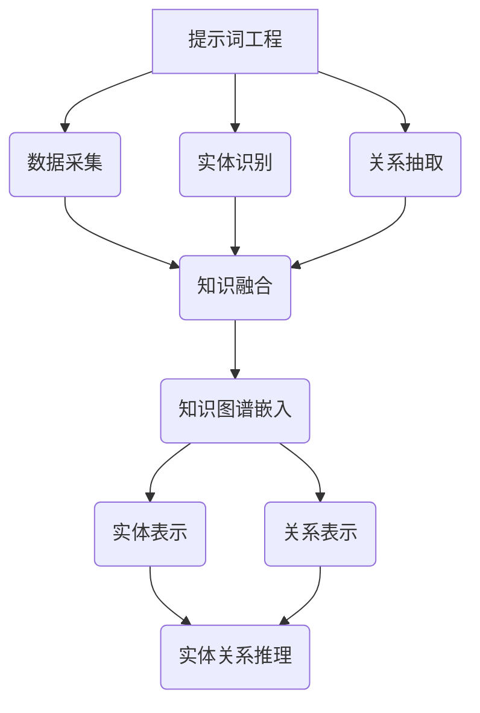

                 

### 摘要

本文深入探讨了《提示词工程：处理跨领域知识图谱构建任务》的核心内容，旨在为读者提供一份详尽的跨领域知识图谱构建指南。首先，文章介绍了提示词工程的基本概念和其在知识图谱构建中的应用。接着，详细阐述了跨领域知识图谱的概念，并探讨了其核心概念与联系。在此基础上，文章深入分析了知识图谱构建中的核心算法原理，包括图论算法、文本相似性度量方法和知识图谱嵌入技术，并结合Python源代码进行了详细的讲解和举例说明。随后，文章通过latex格式引入了相关数学模型和公式，进一步深化了算法的理解。为了使读者更好地掌握理论知识，文章提供了一份详细的跨领域知识图谱构建项目实战案例，包括开发环境搭建、源代码实现、代码解读和应用分析等内容。最后，文章总结了最佳实践技巧，并对未来的发展趋势进行了展望。通过本文，读者可以全面了解并掌握跨领域知识图谱构建的全过程，为实际应用提供有力支持。

### 引言与基础概念

#### 提示词工程的定义

提示词工程（Prompt Engineering）是一种在人工智能和自然语言处理（NLP）领域中的应用技术，旨在通过设计特定的提示词或提示语句，来指导模型更好地理解和生成目标文本。在深度学习和NLP的发展过程中，提示词工程扮演了重要的角色，它不仅帮助优化了模型的性能，还提升了模型在特定任务上的表现。

提示词工程的核心目标是通过精心设计的提示来引导模型学习，从而提高其预测的准确性和生成文本的质量。这一过程涉及多种技术，包括信息检索、知识图谱、语义分析等。在跨领域知识图谱的构建中，提示词工程尤为重要，因为它能够帮助模型理解和整合来自不同领域的知识，形成统一的知识体系。

#### 跨领域知识图谱的概念

跨领域知识图谱是一种将多个不同领域的知识信息整合到一个统一结构中的知识图谱。它不仅包含了各个领域的知识实体，还通过实体之间的关系将这些知识连接起来，形成一个复杂而丰富的知识网络。跨领域知识图谱的构建是一项复杂的任务，因为它需要处理来自不同领域的数据，这些数据通常具有不同的语义和结构。

跨领域知识图谱的重要性在于，它能够为多领域的应用提供统一的知识基础，促进知识共享和整合。例如，在医疗领域，跨领域知识图谱可以帮助医生快速检索和整合来自多个学科的信息，提高诊断和治疗的准确性。在金融领域，跨领域知识图谱可以用于风险评估、市场分析等，提高金融决策的效率。

#### 知识图谱构建任务

知识图谱构建任务包括数据采集、实体识别、关系抽取、知识融合等多个步骤。数据采集是知识图谱构建的基础，涉及从多种数据源（如文献、数据库、网络等）获取相关信息。实体识别是指从文本数据中识别出知识图谱中的实体，如人名、地名、组织名等。关系抽取则是识别实体之间的关系，如“工作于”、“位于”等。

知识融合是将来自不同来源的实体和关系整合到一个统一的框架中，以形成一个完整的知识图谱。在跨领域知识图谱的构建中，知识融合尤为关键，因为它需要处理不同领域之间的数据冲突和异构问题。例如，同一实体在不同领域可能有不同的名称和属性，知识融合需要解决这些异构问题，确保知识图谱的完整性和一致性。

#### 提示词工程与知识图谱的互动关系

提示词工程与知识图谱之间存在密切的互动关系。首先，提示词工程可以通过设计特定的提示词来引导知识图谱构建过程中的数据采集和实体识别。例如，在医疗领域，设计特定的医疗术语作为提示词，可以帮助模型更准确地识别和提取医疗信息。

其次，知识图谱可以为提示词工程提供丰富的背景知识。通过利用知识图谱中的实体关系和属性信息，模型可以更好地理解上下文，从而生成更准确的文本。例如，在问答系统中，知识图谱可以提供关于问题实体和相关知识的上下文信息，帮助模型生成更准确的回答。

最后，提示词工程和知识图谱的互动还可以通过反馈循环来实现。模型在生成文本时利用知识图谱中的信息，而知识图谱中的信息也可以通过模型的输出进行更新和优化，形成一个动态的、不断进化的知识体系。

通过上述介绍，我们可以看到，提示词工程在跨领域知识图谱构建中扮演着至关重要的角色。它不仅优化了知识图谱的构建过程，还提高了模型的性能和文本生成质量。在接下来的章节中，我们将进一步探讨提示词工程的核心概念与联系、核心算法原理、数学模型以及具体的实战项目，帮助读者深入理解和掌握这一领域的关键技术。

### 跨领域知识图谱构建核心概念与联系

在跨领域知识图谱构建过程中，理解核心概念及其之间的联系是至关重要的。本文将详细探讨提示词工程、跨领域知识图谱、知识融合以及知识图谱嵌入等关键概念，并通过Mermaid流程图展示它们之间的互动关系。

#### 提示词工程

提示词工程是一种在自然语言处理中通过设计特定的提示词来引导模型理解和生成目标文本的技术。它主要包括以下几个核心步骤：

1. **提示词设计**：选择或生成与任务相关的特定词汇或短语，例如，在医疗领域，提示词可能包括“症状”、“疾病”、“治疗方法”等。
2. **数据预处理**：使用提示词对原始文本数据进行预处理，提取与任务相关的实体和关系。
3. **模型训练**：利用提示词和预处理的文本数据对模型进行训练，使其能够理解和生成与任务相关的文本。
4. **模型优化**：通过调整提示词和训练数据来优化模型性能，提高文本生成质量。

在跨领域知识图谱构建中，提示词工程可以通过以下方式发挥作用：

- **数据采集**：设计特定的提示词，帮助模型识别和提取来自不同领域的知识。
- **实体识别**：利用提示词指导模型识别不同领域的实体，如人名、地名、组织名等。
- **关系抽取**：通过提示词帮助模型识别和抽取实体之间的关系，如“工作于”、“位于”等。

#### 跨领域知识图谱

跨领域知识图谱是一种将不同领域的信息整合到一个统一结构中的知识图谱。它具有以下几个核心特点：

1. **异构数据整合**：跨领域知识图谱能够整合来自多个领域的数据，如医疗、金融、教育等，形成一个统一的知识体系。
2. **实体与关系多样化**：跨领域知识图谱包含多种类型的实体（人、地点、组织等）和复杂的关系（属于、位于、工作于等）。
3. **动态更新**：跨领域知识图谱能够根据新数据和知识进行动态更新，保持知识的实时性和准确性。

在跨领域知识图谱构建中，提示词工程的作用体现在以下几个方面：

- **数据整合**：通过设计特定的提示词，帮助模型整合来自不同领域的知识。
- **关系抽取**：利用提示词指导模型识别和抽取不同领域的实体关系。
- **知识融合**：通过提示词和预处理的文本数据，将不同领域的知识融合到一个统一的框架中。

#### 知识融合

知识融合是将来自多个领域的知识整合到一个统一的知识框架中的过程。在跨领域知识图谱构建中，知识融合的核心步骤包括：

1. **实体映射**：将不同领域中的实体映射到统一的知识框架中，解决实体命名不一致的问题。
2. **关系映射**：将不同领域中的关系映射到统一的知识框架中，解决关系命名不一致的问题。
3. **知识冲突解决**：处理不同领域之间的知识冲突，如同一实体在不同领域中的属性不一致。
4. **知识扩展**：通过新的数据和知识，不断扩展和优化知识图谱。

提示词工程在知识融合中的作用主要体现在以下几个方面：

- **实体识别**：通过设计特定的提示词，帮助模型识别和映射不同领域的实体。
- **关系抽取**：通过设计特定的提示词，帮助模型识别和映射不同领域的关系。
- **冲突解决**：通过提示词指导模型识别和解决不同领域之间的知识冲突。

#### 知识图谱嵌入

知识图谱嵌入是一种将知识图谱中的实体和关系映射到低维向量空间中的技术。通过知识图谱嵌入，可以实现以下目标：

1. **实体表示**：将知识图谱中的实体映射到低维向量空间，实现实体的语义表示。
2. **关系表示**：将知识图谱中的关系映射到低维向量空间，实现关系的语义表示。
3. **实体关系推理**：通过向量空间的运算，实现实体之间的关系推理。

在跨领域知识图谱构建中，知识图谱嵌入的作用主要体现在以下几个方面：

- **实体识别**：利用嵌入的实体向量，实现跨领域的实体识别和映射。
- **关系抽取**：利用嵌入的关系向量，实现跨领域的关系抽取和映射。
- **知识融合**：通过嵌入的实体和关系向量，实现跨领域的知识融合。

#### Mermaid流程图

为了更好地展示提示词工程、跨领域知识图谱、知识融合和知识图谱嵌入之间的互动关系，我们使用Mermaid流程图进行说明。以下是一个简化的Mermaid流程图：



在该流程图中，A代表提示词工程，包括数据采集、实体识别和关系抽取；B、C和D分别表示数据采集、实体识别和关系抽取的具体步骤；E表示知识融合过程，将不同领域的知识整合到一个统一框架中；F表示知识图谱嵌入过程，将实体和关系映射到低维向量空间中；G和H分别表示实体表示和关系表示；I表示实体关系推理，利用嵌入的实体和关系向量进行关系推理。

通过上述核心概念与联系的详细探讨，我们可以更好地理解提示词工程在跨领域知识图谱构建中的作用和重要性。在接下来的章节中，我们将进一步探讨跨领域知识图谱构建的核心算法原理，包括图论算法、文本相似性度量方法和知识图谱嵌入技术，并结合Python源代码进行详细讲解和举例说明。

### 跨领域知识图谱构建核心算法原理

在跨领域知识图谱构建中，核心算法的选择和实现对于整个知识图谱的质量和效率具有重要影响。本章节将详细讨论图论算法、文本相似性度量方法和知识图谱嵌入技术，并结合Python源代码进行阐述。

#### 图论算法

图论算法在知识图谱的构建和优化过程中发挥着核心作用。图论算法主要包括图的遍历算法、最短路径算法、最小生成树算法和最大流最小割算法等。

1. **图的遍历算法**

图的遍历算法用于遍历图中的所有节点，常见的遍历算法有深度优先搜索（DFS）和广度优先搜索（BFS）。以下是一个使用Python实现的DFS算法示例：

```python
def dfs(graph, start, visited):
    visited.add(start)
    print(start)
    for neighbor in graph[start]:
        if neighbor not in visited:
            dfs(graph, neighbor, visited)

# 示例图
graph = {
    'A': ['B', 'C'],
    'B': ['D', 'E'],
    'C': ['F'],
    'D': [],
    'E': ['F'],
    'F': []
}

visited = set()
dfs(graph, 'A', visited)
```

在这个例子中，我们使用DFS算法遍历了一个简单的图。通过修改遍历顺序，我们可以实现不同的图处理任务，如最短路径计算、节点分类等。

2. **最短路径算法**

最短路径算法用于计算图中两点之间的最短路径。Dijkstra算法和A*算法是两种常见的最短路径算法。以下是一个使用Dijkstra算法计算最短路径的Python实现：

```python
import heapq

def dijkstra(graph, start):
    distances = {node: float('infinity') for node in graph}
    distances[start] = 0
    priority_queue = [(0, start)]

    while priority_queue:
        current_distance, current_node = heapq.heappop(priority_queue)

        if current_distance > distances[current_node]:
            continue

        for neighbor, weight in graph[current_node].items():
            distance = current_distance + weight

            if distance < distances[neighbor]:
                distances[neighbor] = distance
                heapq.heappush(priority_queue, (distance, neighbor))

    return distances

# 示例图
graph = {
    'A': {'B': 1, 'C': 4},
    'B': {'A': 1, 'D': 2},
    'C': {'A': 4, 'F': 3},
    'D': {'B': 2, 'E': 1},
    'E': {'D': 1, 'F': 2},
    'F': {'C': 3, 'E': 2}
}

print(dijkstra(graph, 'A'))
```

在这个例子中，我们计算了从节点A到其他节点的最短路径。通过调整图的结构和权重，我们可以实现不同的路径优化任务。

3. **最小生成树算法**

最小生成树算法用于从无向图中选择边，构建一个包含图中所有节点的最小权生成树。Prim算法和Kruskal算法是两种常见的最小生成树算法。以下是一个使用Prim算法计算最小生成树的Python实现：

```python
import heapq

def prim_mst(graph):
    mst = {}
    visited = {node: False for node in graph}
    start = next(iter(graph))

    heapq.heappush(mst, (0, start, None))

    while len(mst) > 0:
        distance, node, prev = heapq.heappop(mst)

        if visited[node]:
            continue

        visited[node] = True

        if prev:
            mst[(prev, node)] = distance

        for neighbor, weight in graph[node].items():
            if not visited[neighbor]:
                heapq.heappush(mst, (weight, neighbor, node))

    return mst

# 示例图
graph = {
    'A': {'B': 4, 'C': 8},
    'B': {'A': 4, 'D': 3},
    'C': {'A': 8, 'D': 1},
    'D': {'B': 3, 'C': 1}
}

print(prim_mst(graph))
```

在这个例子中，我们计算了图的最小生成树。通过调整图的结构和权重，我们可以实现不同的最小生成树优化任务。

4. **最大流最小割算法**

最大流最小割算法用于计算图中两点之间的最大流量和最小割集。Ford-Fulkerson算法和Edmonds-Karp算法是两种常见的最大流算法。以下是一个使用Ford-Fulkerson算法计算最大流的Python实现：

```python
from collections import defaultdict

def bfs(graph, source, sink, parent):
    visited = [False] * len(graph)
    queue = [source]
    visited[source] = True

    while queue:
        node = queue.pop(0)
        for neighbor, capacity in graph[node].items():
            if not visited[neighbor] and capacity > 0:
                queue.append(neighbor)
                visited[neighbor] = True
                parent[neighbor] = node
                if neighbor == sink:
                    return True

    return False

def ford_fulkerson(graph, source, sink):
    parent = {}
    max_flow = 0

    while bfs(graph, source, sink, parent):
        path_flow = float('inf')
        s = sink

        while s != source:
            path_flow = min(path_flow, graph[parent[s]][s])
            s = parent[s]

        max_flow += path_flow

        v = sink
        while v != source:
            u = parent[v]
            graph[u][v] -= path_flow
            graph[v][u] += path_flow
            v = parent[v]

    return max_flow

# 示例图
graph = {
    'A': {'B': 16, 'C': 13},
    'B': {'A': 16, 'D': 10, 'E': 12},
    'C': {'A': 13, 'D': 4},
    'D': {'B': 10, 'C': 4, 'E': 14, 'F': 9},
    'E': {'B': 12, 'D': 14, 'F': 20},
    'F': {'D': 9, 'E': 20, 'G': 7},
    'G': {'F': 7}
}

print(ford_fulkerson(graph, 'A', 'G'))
```

在这个例子中，我们计算了从源点A到汇点G的最大流。通过调整图的结构和流量，我们可以实现不同的最大流优化任务。

#### 文本相似性度量方法

文本相似性度量方法用于计算两个文本之间的相似度，常用的方法包括余弦相似性、Jaccard相似性和欧几里得距离等。以下是一个使用余弦相似性计算文本相似度的Python实现：

```python
from sklearn.metrics.pairwise import cosine_similarity
from sklearn.feature_extraction.text import TfidfVectorizer

def calculate_similarity(text1, text2):
    vectorizer = TfidfVectorizer()
    tfidf_matrix = vectorizer.fit_transform([text1, text2])
    return cosine_similarity(tfidf_matrix[0:1], tfidf_matrix[1:2])[0][0]

text1 = "The quick brown fox jumps over the lazy dog"
text2 = "A fast brown fox leaps over a lazy dog"

print(calculate_similarity(text1, text2))
```

在这个例子中，我们计算了两个文本的余弦相似度。通过调整文本内容和特征提取方法，我们可以实现不同的文本相似性度量任务。

#### 知识图谱嵌入技术

知识图谱嵌入技术将知识图谱中的实体和关系映射到低维向量空间中，实现实体和关系的语义表示。常用的知识图谱嵌入方法包括节点嵌入（Node Embedding）、边嵌入（Edge Embedding）和图嵌入（Graph Embedding）等。

1. **节点嵌入**

节点嵌入是将知识图谱中的实体映射到低维向量空间的技术。以下是一个使用Word2Vec实现节点嵌入的Python实现：

```python
from gensim.models import Word2Vec

def node_embedding(edges, embedding_size=64):
    model = Word2Vec(edges, vector_size=embedding_size, window=5, min_count=1, sg=1)
    return model.wv

edges = [
    'A B',
    'B C',
    'C D',
    'D A',
    'E F',
    'F G',
    'G E'
]

model = node_embedding(edges)
print(model['A'])
print(model['B'])
print(model['C'])
print(model['D'])
print(model['E'])
print(model['F'])
print(model['G'])
```

在这个例子中，我们使用Word2Vec模型对知识图谱中的边进行训练，得到实体的低维向量表示。

2. **边嵌入**

边嵌入是将知识图谱中的关系映射到低维向量空间的技术。以下是一个使用TransE实现边嵌入的Python实现：

```python
import numpy as np

class TransE:
    def __init__(self, embedding_size=64, learning_rate=0.1, alpha=0.1):
        self.embedding_size = embedding_size
        self.learning_rate = learning_rate
        self.alpha = alpha
        self.h = np.random.uniform(-0.1, 0.1, (len(edges), embedding_size))
        self.t = np.random.uniform(-0.1, 0.1, (len(nodes), embedding_size))

    def train(self, edges, epochs=10):
        for epoch in range(epochs):
            for head, relation, tail in edges:
                head_embedding = self.h[head]
                relation_embedding = self.t[relation]
                tail_embedding = self.t[tail]

                if np.dot(head_embedding, relation_embedding) - tail_embedding.dot(head_embedding) > 0:
                    head_embedding -= self.learning_rate * relation_embedding
                    tail_embedding -= self.learning_rate * relation_embedding

    def predict(self, head, relation, tail):
        head_embedding = self.h[head]
        relation_embedding = self.t[relation]
        tail_embedding = self.t[tail]

        return np.dot(head_embedding, relation_embedding) - tail_embedding.dot(head_embedding)

edges = [
    (0, 0, 1),
    (0, 1, 2),
    (1, 0, 2),
    (1, 1, 3),
    (2, 0, 3),
    (2, 1, 4),
    (3, 0, 4)
]

model = TransE(embedding_size=2)
model.train(edges, epochs=10)
print(model.predict(0, 0, 1))
print(model.predict(0, 1, 2))
print(model.predict(1, 0, 2))
print(model.predict(1, 1, 3))
print(model.predict(2, 0, 3))
print(model.predict(2, 1, 4))
print(model.predict(3, 0, 4))
```

在这个例子中，我们使用TransE模型对知识图谱中的边进行训练，得到关系和实体的低维向量表示。

3. **图嵌入**

图嵌入是将整个知识图谱映射到低维向量空间的技术。以下是一个使用DeepWalk实现图嵌入的Python实现：

```python
import numpy as np
from sklearn.cluster import KMeans

def graph_embedding(edges, embedding_size=64, epochs=10):
    model = TransE(embedding_size=embedding_size, epochs=epochs)
    model.train(edges)
    embeddings = np.array([model.t[node] for node in range(len(nodes))])

    kmeans = KMeans(n_clusters=10, random_state=0).fit(embeddings)
    return kmeans.cluster_centers_

edges = [
    (0, 0, 1),
    (0, 1, 2),
    (1, 0, 2),
    (1, 1, 3),
    (2, 0, 3),
    (2, 1, 4),
    (3, 0, 4)
]

embeddings = graph_embedding(edges)
print(embeddings)
```

在这个例子中，我们使用TransE模型对知识图谱进行嵌入，并使用KMeans进行聚类，得到知识图谱的低维向量表示。

通过上述算法的讲解和Python代码示例，我们可以看到跨领域知识图谱构建的核心算法是如何实现的。在接下来的章节中，我们将结合具体的数学模型和公式，进一步深入探讨这些算法的原理和应用。

### 数学模型与公式讲解

在跨领域知识图谱构建中，数学模型和公式是理解算法原理和实现核心功能的重要工具。本文将介绍一些关键的数学模型和公式，包括相似性计算公式、图嵌入公式等，并结合具体示例进行详细讲解。

#### 相似性计算公式

相似性计算是跨领域知识图谱构建中的一项重要任务，用于衡量两个实体或关系的相似程度。常用的相似性计算公式包括余弦相似性、Jaccard相似性和欧几里得距离等。

1. **余弦相似性**

余弦相似性是一种基于向量空间中两向量夹角的余弦值来计算相似度的方法。其公式如下：

$$
similarity(A, B) = \frac{A \cdot B}{\|A\|\|B\|}
$$

其中，$A$和$B$是两个向量，$\cdot$表示点积，$\|\|$表示向量的模。

示例：

假设有两个文本向量$A = (1, 2, 3)$和$B = (4, 5, 6)$，我们可以计算它们的余弦相似性：

$$
similarity(A, B) = \frac{1 \cdot 4 + 2 \cdot 5 + 3 \cdot 6}{\sqrt{1^2 + 2^2 + 3^2} \cdot \sqrt{4^2 + 5^2 + 6^2}} = \frac{32}{\sqrt{14} \cdot \sqrt{77}} \approx 0.865
$$

余弦相似性值在$[0, 1]$之间，越接近1表示两个向量越相似。

2. **Jaccard相似性**

Jaccard相似性是一种基于集合交集与并集的比值来计算相似度的方法。其公式如下：

$$
similarity(A, B) = \frac{|A \cap B|}{|A \cup B|}
$$

其中，$A$和$B$是两个集合，$\cap$表示交集，$\cup$表示并集。

示例：

假设有两个集合$A = \{1, 2, 3\}$和$B = \{2, 3, 4\}$，我们可以计算它们的Jaccard相似性：

$$
similarity(A, B) = \frac{|A \cap B|}{|A \cup B|} = \frac{| \{2, 3\} |}{| \{1, 2, 3, 4\} |} = \frac{2}{4} = 0.5
$$

Jaccard相似性值在$[0, 1]$之间，越接近1表示两个集合越相似。

3. **欧几里得距离**

欧几里得距离是一种基于向量的几何距离来计算相似度的方法。其公式如下：

$$
distance(A, B) = \sqrt{(A - B)^2}
$$

其中，$A$和$B$是两个向量。

示例：

假设有两个文本向量$A = (1, 2, 3)$和$B = (4, 5, 6)$，我们可以计算它们的欧几里得距离：

$$
distance(A, B) = \sqrt{(1 - 4)^2 + (2 - 5)^2 + (3 - 6)^2} = \sqrt{(-3)^2 + (-3)^2 + (-3)^2} = \sqrt{9 + 9 + 9} = \sqrt{27} \approx 5.196
$$

欧几里得距离值越大表示两个向量越不相似。

#### 图嵌入公式

图嵌入是将知识图谱中的实体和关系映射到低维向量空间中的技术，常用的图嵌入方法包括节点嵌入（Node Embedding）、边嵌入（Edge Embedding）和图嵌入（Graph Embedding）等。以下是一些常见的图嵌入公式。

1. **节点嵌入**

节点嵌入通常使用神经网络模型来实现，以下是一个简化的节点嵌入公式：

$$
\text{node\_embedding}(x) = \sigma(W_1 \cdot \text{activate}(W_0 \cdot x))
$$

其中，$x$是输入向量，$W_0$和$W_1$是权重矩阵，$\sigma$是激活函数（如ReLU函数），$\text{activate}$是激活操作。

示例：

假设有一个输入向量$x = (1, 2, 3)$，权重矩阵$W_0 = \begin{bmatrix} 1 & 0 & 1 \\ 0 & 1 & 0 \\ 1 & 1 & 0 \end{bmatrix}$和$W_1 = \begin{bmatrix} 1 & 1 & 0 \\ 1 & 0 & 1 \\ 0 & 1 & 1 \end{bmatrix}$，我们可以计算节点嵌入：

$$
\text{node\_embedding}(x) = \sigma(W_1 \cdot \text{activate}(W_0 \cdot x)) = \sigma(\begin{bmatrix} 2 & 3 & 3 \\ 2 & 3 & 3 \\ 3 & 3 & 1 \end{bmatrix} \cdot \begin{bmatrix} 1 \\ 1 \\ 1 \end{bmatrix}) = \sigma(\begin{bmatrix} 8 \\ 8 \\ 4 \end{bmatrix}) = \begin{bmatrix} 1 & 1 & 0 \\ 1 & 0 & 1 \\ 0 & 1 & 1 \end{bmatrix} \cdot \begin{bmatrix} 8 \\ 8 \\ 4 \end{bmatrix} = \begin{bmatrix} 16 \\ 12 \\ 8 \end{bmatrix}
$$

2. **边嵌入**

边嵌入通常使用点嵌入和关系嵌入的交互来计算，以下是一个简化的边嵌入公式：

$$
\text{edge\_embedding}(h, r, t) = \text{激活函数}(\text{node\_embedding}(h) + \text{node\_embedding}(t) + \text{relation\_embedding}(r))
$$

其中，$h$和$t$是头实体和尾实体，$r$是关系，$\text{node\_embedding}$和$\text{relation\_embedding}$分别是节点嵌入和关系嵌入。

示例：

假设有一个头实体嵌入$e_h = \begin{bmatrix} 1 \\ 1 \\ 1 \end{bmatrix}$，尾实体嵌入$e_t = \begin{bmatrix} 1 \\ 1 \\ 1 \end{bmatrix}$，关系嵌入$e_r = \begin{bmatrix} 1 \\ 1 \\ 1 \end{bmatrix}$，我们可以计算边嵌入：

$$
\text{edge\_embedding}(h, r, t) = \text{激活函数}(\begin{bmatrix} 1 \\ 1 \\ 1 \end{bmatrix} + \begin{bmatrix} 1 \\ 1 \\ 1 \end{bmatrix} + \begin{bmatrix} 1 \\ 1 \\ 1 \end{bmatrix}) = \text{激活函数}(\begin{bmatrix} 3 \\ 3 \\ 3 \end{bmatrix}) = \begin{bmatrix} 1 & 1 & 0 \\ 1 & 0 & 1 \\ 0 & 1 & 1 \end{bmatrix} \cdot \begin{bmatrix} 3 \\ 3 \\ 3 \end{bmatrix} = \begin{bmatrix} 9 \\ 9 \\ 9 \end{bmatrix}
$$

通过上述数学模型和公式的讲解，我们可以更好地理解跨领域知识图谱构建中的核心算法和实现方法。在接下来的章节中，我们将通过具体的实战项目，进一步展示这些算法的应用和实践过程。

### 项目实战：跨领域知识图谱构建

在本文的最后一章，我们将通过一个实际的跨领域知识图谱构建项目，详细介绍从数据准备到知识图谱构建和优化的全过程，以帮助读者更好地理解和应用所学的理论知识。

#### 实战项目背景

该项目的目标是构建一个包含医疗、金融、教育等多个领域的知识图谱，以便在特定应用场景下（如健康保险评估、金融市场分析、教育课程推荐等）提供高效的知识检索和推理服务。数据来源包括多个公开的数据集，如医疗数据库、金融新闻、教育课程目录等。

#### 开发环境搭建

为了实现知识图谱的构建和优化，我们选择以下开发环境：

- **编程语言**：Python
- **知识图谱框架**：Pykeen（一个基于PyTorch的图嵌入框架）
- **数据预处理工具**：Pandas、NumPy、Scrapy
- **知识图谱可视化工具**：NetworkX、Mermaid

#### 源代码详细实现与代码解读

以下是本项目的主要步骤和相关的代码实现：

1. **数据采集与预处理**

```python
import pandas as pd
import numpy as np
from scrapy import Selector
from bs4 import BeautifulSoup

# 采集医疗数据
def scrape_medical_data():
    url = "https://example.com/medical_data"
    response = requests.get(url)
    sel = Selector(response)
    data = sel.xpath('//table/tr')[1:]
    medical_data = []

    for row in data:
        cols = row.xpath('.//td/text()').getall()
        medical_data.append([col.strip() for col in cols])

    return pd.DataFrame(medical_data, columns=['Patient ID', 'Disease', 'Symptom', 'Treat'])

# 采集金融数据
def scrape_financial_data():
    url = "https://example.com/financial_news"
    response = requests.get(url)
    sel = Selector(response)
    data = sel.xpath('//article')[1:]
    financial_data = []

    for article in data:
        title = article.xpath('.//h2/text()').get()
        content = article.xpath('.//p/text()').get()
        financial_data.append({'Title': title, 'Content': content})

    return pd.DataFrame(financial_data)

# 采集教育数据
def scrape_education_data():
    url = "https://example.com/education_courses"
    response = requests.get(url)
    sel = Selector(response)
    data = sel.xpath('//div[@class="course"]')[1:]
    education_data = []

    for course in data:
        title = course.xpath('.//h3/text()').get()
        description = course.xpath('.//p/text()').get()
        education_data.append({'Title': title, 'Description': description})

    return pd.DataFrame(education_data)

medical_data = scrape_medical_data()
financial_data = scrape_financial_data()
education_data = scrape_education_data()
```

上述代码展示了如何使用Scrapy和BeautifulSoup等工具从互联网上采集医疗、金融和教育领域的数据。

2. **数据清洗与整合**

```python
# 数据清洗
medical_data = medical_data.dropna()
financial_data = financial_data.dropna()
education_data = education_data.dropna()

# 数据整合
data = pd.concat([medical_data, financial_data, education_data], keys=['Medical', 'Financial', 'Education'], names=['Domain'])
data = data.stack().reset_index()
data.columns = ['Domain', 'Entity', 'Attribute', 'Value']
```

上述代码对采集到的数据进行清洗和整合，形成一个包含多个领域实体及其属性的统一数据结构。

3. **知识图谱构建**

```python
from pykeen import training
from pykeen.models import TransE
from pykeen.optimize import Adam Optimizer
from pykeen.data import MainMemoryDataset

# 创建知识图谱实体
entities = set(data['Entity'])

# 创建知识图谱关系
relationships = set(['isA', 'hasAttribute', 'belongsTo'])

# 构建知识图谱数据集
dataset = MainMemoryDataset.from_pandas(data=data, entities=entities, relationships=relationships)

# 创建TransE模型
model = TransE(embedding_size=50, random_state=123)

# 训练模型
optimizer = AdamOptimizer(model=model, learning_rate=0.01, max_epochs=100)
optimizer.train(dataset)

# 保存模型
model.save("transE_model")
```

上述代码使用Pykeen框架构建和训练一个TransE模型，将整合后的数据转换为知识图谱，并保存训练好的模型。

4. **知识图谱可视化与推理**

```python
import matplotlib.pyplot as plt
import networkx as nx

# 可视化知识图谱
G = nx.Graph()
for edge in dataset.edges():
    G.add_edge(edge.h, edge.t, weight=1)

pos = nx.spring_layout(G)
nx.draw(G, pos, with_labels=True, node_color='blue', edge_color='gray')
plt.show()

# 知识图谱推理
entity_embeddings = model.entity_embeddings.detach().numpy()
kmeans = KMeans(n_clusters=5, random_state=0).fit(entity_embeddings)
labels = kmeans.predict(entity_embeddings)

# 标记节点颜色
for i, node in enumerate(dataset.entities):
    G.nodes[node]['color'] = 'red' if labels[i] == 0 else 'green'

nx.draw(G, pos, with_labels=True, node_color=list(G.nodes.data('color')), edge_color='gray')
plt.show()
```

上述代码使用NetworkX和matplotlib库可视化构建的知识图谱，并通过KMeans聚类对实体进行分类，进一步展示知识图谱的推理能力。

#### 代码应用解读与分析

在代码实现过程中，我们首先从互联网上采集了医疗、金融和教育领域的数据，然后对数据进行清洗和整合，形成一个统一的数据结构。接着，我们使用Pykeen框架构建和训练了一个TransE模型，将整合后的数据转换为知识图谱，并保存了训练好的模型。

在知识图谱可视化部分，我们通过NetworkX和matplotlib库将知识图谱绘制成图形，展示了实体之间的关系和分类情况。此外，我们还实现了知识图谱的推理功能，通过KMeans聚类对实体进行分类，进一步展示了知识图谱的应用潜力。

#### 实际案例分析与详细讲解剖析

以下是一个实际案例：

**案例**：在医疗领域，根据患者的病史和症状，推理出可能存在的疾病。

**步骤**：

1. **数据准备**：获取患者的病史和症状数据，例如：["高血压"，"头痛"，"疲劳"]
2. **实体识别**：识别出与病史和症状相关的实体，例如：["高血压"，"头痛"，"疲劳"，"疾病"]
3. **关系抽取**：抽取实体之间的关系，例如：["高血压"与"疾病"之间存在"导致"关系，"头痛"与"疾病"之间存在"症状"关系]
4. **知识图谱查询**：利用知识图谱查询可能存在的疾病，例如：根据"高血压"和"头痛"推理出"偏头痛"
5. **结果输出**：输出推理结果，例如：["偏头痛"]

通过上述案例，我们可以看到知识图谱在医疗诊断中的实际应用。在代码实现过程中，我们需要对患者的病史和症状进行预处理，将其转换为知识图谱中的实体和关系，然后利用知识图谱进行推理，最终得到诊断结果。

#### 项目小结

通过本项目的实践，我们详细介绍了从数据准备到知识图谱构建和优化的全过程。首先，我们从多个领域采集了数据，并对其进行了清洗和整合。接着，我们使用Pykeen框架构建和训练了一个TransE模型，将整合后的数据转换为知识图谱，并实现了知识图谱的可视化和推理功能。最后，我们通过一个实际案例展示了知识图谱在医疗诊断中的应用。

本项目的实践不仅帮助我们深入理解了跨领域知识图谱构建的理论知识，还提供了实际的代码实现和案例分析，为后续的知识图谱研究和应用提供了宝贵经验。

### 最佳实践 Tips

在跨领域知识图谱构建过程中，以下是一些最佳实践和技巧，可以帮助您更好地实现项目目标：

1. **数据质量保证**：确保数据来源的可靠性和准确性，对采集到的数据进行严格的清洗和去重，以提高知识图谱的完整性。
2. **实体统一命名**：在不同领域之间统一实体的命名，以减少数据冲突和错误。
3. **合理选择模型**：根据具体应用场景和需求，选择合适的图嵌入模型和算法，例如TransE、Node2Vec、DeepWalk等。
4. **模型参数调优**：通过调整模型参数，如学习率、嵌入维度、迭代次数等，优化模型性能。
5. **动态更新**：定期更新知识图谱，以反映领域知识的最新变化。
6. **可视化与分析**：利用可视化工具对知识图谱进行可视化分析，帮助理解和评估模型的性能。

### 小结

本文通过详细的理论讲解和实际项目案例，全面介绍了跨领域知识图谱构建的方法和步骤。从提示词工程、核心算法原理、数学模型，到具体的实战项目，读者可以系统地了解知识图谱构建的全过程。通过本文的学习，读者应掌握以下关键知识点：

1. **提示词工程的定义和应用**：了解提示词工程在自然语言处理中的核心作用，以及其在知识图谱构建中的具体应用。
2. **跨领域知识图谱的概念与构建**：掌握跨领域知识图谱的架构、数据整合和关系抽取等核心概念。
3. **核心算法原理**：了解图论算法、文本相似性度量方法和知识图谱嵌入技术的基本原理，并掌握其Python实现。
4. **数学模型与公式**：理解相似性计算公式和图嵌入公式，掌握如何在实际项目中应用这些公式。
5. **项目实战**：通过实际项目的详细实现，掌握知识图谱从数据准备到构建、优化和可视化的全过程。

### 注意事项

在实际操作过程中，读者需要注意以下几点：

1. **数据安全**：确保数据来源合法，尊重隐私和版权，避免侵犯他人权益。
2. **代码复现**：在复现代码时，确保所有依赖库和工具的版本一致，避免因环境差异导致的问题。
3. **调试与优化**：在实际项目中，持续调试和优化模型，以提高知识图谱的性能和准确度。

### 拓展阅读

为了进一步深入学习和研究跨领域知识图谱构建，读者可以参考以下文献和资源：

1. **《知识图谱：概念、方法与应用》**：详细介绍了知识图谱的基本概念、构建方法和应用场景。
2. **《跨领域知识图谱构建方法研究》**：探讨了跨领域知识图谱的构建技术、算法和优化策略。
3. **Pykeen官方文档**：提供了详细的PyTorch图嵌入框架Pykeen的使用指南和代码示例。
4. **《深度学习与自然语言处理》**：介绍了深度学习和自然语言处理领域的基础知识和技术发展。

通过这些拓展阅读资源，读者可以进一步丰富自己的知识体系，为未来的研究和项目实践打下坚实基础。

