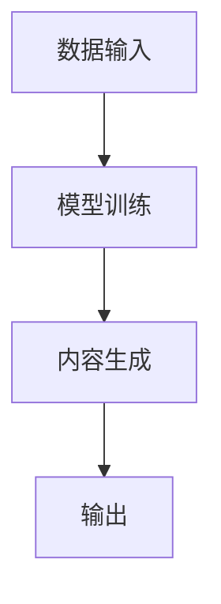

                 

### 《提示词工程：构建下一代AIGC系统的基石》

---

#### 关键词：提示词工程、AIGC系统、算法、数学模型、应用实践、未来趋势

---

**摘要**：随着人工智能技术的飞速发展，AIGC（AI-Generated Content）系统逐渐成为构建下一代智能系统的基石。本文将深入探讨提示词工程在这一领域中的关键作用，从核心概念、算法原理、数学模型到实际应用，全面解析提示词工程如何引领AIGC系统的革新。

## 引言

### 1.1 提示词工程的定义

提示词工程是指利用人工智能技术，对提示词进行处理、生成和优化的工程实践。提示词是AIGC系统的核心输入，通过这些输入，系统能够生成高质量的内容。提示词工程涉及到的技术包括自然语言处理、机器学习和深度学习等。

### 1.2 提示词工程的重要性

提示词工程在AIGC系统中扮演着至关重要的角色。首先，高质量的提示词能够提高AIGC系统的生成效率和准确性。其次，通过优化提示词，可以显著提升生成内容的多样性和创造力。因此，提示词工程成为构建下一代AIGC系统的关键。

## AIGC系统概述

### 2.1 AIGC系统的基础概念

AIGC系统是一种基于人工智能技术生成内容的方法，它结合了自动写作、自动绘画和自动编程等应用。AIGC系统主要由数据输入、模型训练、内容生成和输出四个部分组成。

### 2.2 AIGC系统的架构

下面是AIGC系统的核心架构，使用Mermaid流程图进行展示：



## 提示词工程的核心算法

### 3.1 提示词生成算法

提示词生成算法是提示词工程的核心。以下是一个简单的提示词生成算法的伪代码：

```python
def generate_prompt(input_data):
    # 对输入数据进行处理
    processed_data = process_data(input_data)
    # 利用模型生成提示词
    prompt = model.generate(processed_data)
    return prompt
```

### 3.2 提示词优化算法

提示词优化算法用于提高提示词的质量。以下是一个简单的提示词优化算法的伪代码：

```python
def optimize_prompt(prompt, target_content):
    # 对提示词进行调整
    optimized_prompt = adjust_prompt(prompt, target_content)
    # 评估优化效果
    if is_optimized(optimized_prompt, target_content):
        return optimized_prompt
    else:
        return prompt
```

## 提示词工程的应用实践

### 4.1 提示词工程在文本生成中的应用

提示词工程在文本生成中有着广泛的应用。以下是一个简单的文本生成示例：

```python
input_data = "人工智能技术将如何改变我们的未来？"
prompt = generate_prompt(input_data)
generated_text = model.generate(prompt)
print(generated_text)
```

### 4.2 提示词工程在图像生成中的应用

提示词工程在图像生成中同样发挥着重要作用。以下是一个简单的图像生成示例：

```python
input_data = "一只猫坐在花园里"
prompt = generate_prompt(input_data)
generated_image = model.generate(prompt)
plt.imshow(generated_image)
plt.show()
```

## 提示词工程的数学模型

### 5.1 提示词相关的数学模型

在提示词工程中，常用的数学模型包括概率模型、生成模型和对抗模型等。以下是一个简单的生成模型（Gaussian Mixture Model）的数学模型：

$$
p(x|\mu, \sigma) = \frac{1}{\sqrt{2\pi\sigma^2}} e^{-\frac{(x-\mu)^2}{2\sigma^2}}
$$

### 5.2 数学模型的实际应用

以下是一个生成模型的实际应用示例：

```python
import numpy as np
from scipy.stats import multivariate_normal

# 定义均值和方差
mu = [0, 0]
sigma = [[1, 0], [0, 1]]

# 生成数据
x = np.random.multivariate_normal(mu, sigma, 1000)

# 绘制数据分布
plt.scatter(x[:, 0], x[:, 1])
plt.show()
```

## 提示词工程的开发工具与框架

### 6.1 常用开发工具简介

提示词工程的开发工具包括Python、TensorFlow、PyTorch等。这些工具提供了丰富的API和库，方便开发人员进行提示词工程的研究和应用。

### 6.2 开发框架的比较

以下是对几种常用开发框架的比较：

| 框架        | 特点                                       | 优点                                                         | 缺点                                                         |
|-----------|------------------------------------------|------------------------------------------------------------|------------------------------------------------------------|
| TensorFlow | 适用于大规模分布式计算                   | 提供丰富的API和库，支持多种机器学习算法                 | 需要较高的编程技能，学习曲线较陡峭                         |
| PyTorch    | 灵活易用，支持动态计算图                 | 易于调试，支持Python编程，具有良好的社区支持             | 性能较TensorFlow稍逊一筹，适用于研究而非生产环境           |
| Keras     | 简单易用，基于Theano和TensorFlow构建     | 面向开发者的API，提供了丰富的预训练模型               | 需要依赖于TensorFlow或Theano，灵活性稍逊一筹               |

## 提示词工程的未来发展趋势

### 7.1 提示词工程的发展趋势

随着人工智能技术的不断发展，提示词工程将在以下方面取得重大进展：

1. 更高效的算法和模型
2. 更丰富的应用场景
3. 更强的生成能力和创造力
4. 更强的跨模态生成能力

### 7.2 对下一代AIGC系统的影响

提示词工程的进步将对下一代AIGC系统产生深远的影响，包括：

1. 提高生成效率和准确性
2. 扩大应用范围，从文本生成扩展到图像、视频、音频等多种形式
3. 增强生成内容的多样性和创造力
4. 促进跨学科的研究和应用

### 结论

提示词工程是构建下一代AIGC系统的基石。通过对提示词工程的深入研究，我们将能够构建更加智能、高效、多样的AIGC系统，为人类社会带来更多的创新和进步。

---

**作者**：AI天才研究院/AI Genius Institute & 禅与计算机程序设计艺术 /Zen And The Art of Computer Programming

---

本文以逻辑清晰、结构紧凑、简单易懂的专业的技术语言，深入剖析了提示词工程在构建下一代AIGC系统中的重要性。通过详细的算法讲解、数学模型展示和应用实践，读者可以全面了解提示词工程的原理和实际应用，为未来的技术研究提供有价值的参考。希望本文能够激发读者对提示词工程的兴趣，推动该领域的研究和发展。

