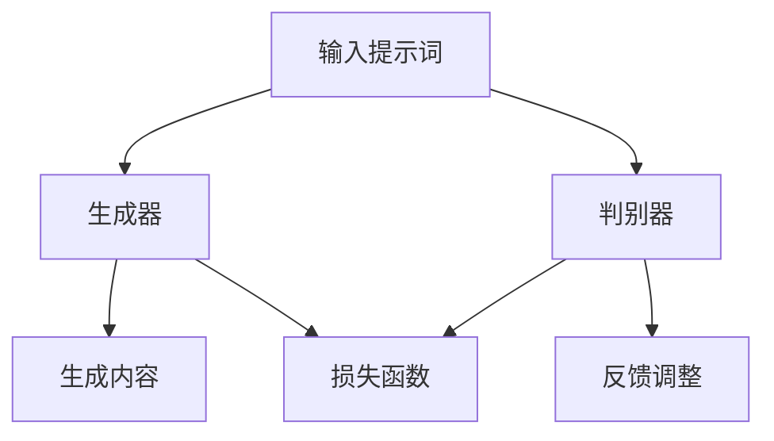

                 

### 提示词设计：AIGC系统性能优化的关键因素研究

#### 关键词
- AIGC系统
- 提示词设计
- 性能优化
- 生成模型
- 数学模型

#### 摘要
本文将深入研究AIGC（AI-Generated Content）系统的性能优化问题，特别是提示词设计这一关键因素。通过分析AIGC系统的基本概念、核心算法原理、数学模型以及实际项目案例，本文旨在揭示提示词设计对AIGC系统性能的影响，并提供一系列优化策略和实战指导，以提升AIGC系统的整体表现。

## 引言

### AIGC系统的基本概念与发展背景

AIGC（AI-Generated Content）系统是指利用人工智能技术，尤其是深度学习模型，自动生成各种类型的内容，如文本、图像、音频等。AIGC系统通过训练大规模的数据集，使得模型能够捕捉数据的分布特征，从而能够生成新的、具有一定创造性的内容。

AIGC系统的发展可以追溯到深度学习技术的兴起。随着计算能力和数据资源的大幅提升，深度学习模型在自然语言处理、计算机视觉、语音识别等领域取得了显著的进展。这些进步为AIGC系统的发展提供了技术基础。目前，AIGC系统已经在内容生成、数据增强、智能推荐等多个应用领域展现出巨大的潜力。

### AIGC系统的应用领域

AIGC系统的应用范围非常广泛。以下是一些典型的应用场景：

1. **内容创作**：AIGC系统可以自动生成新闻报道、文章、诗歌等文本内容，减轻创作者的工作负担。
2. **图像和视频生成**：通过生成对抗网络（GAN）等技术，AIGC系统能够生成高质量的图像和视频，广泛应用于娱乐、游戏、虚拟现实等领域。
3. **数据增强**：在机器学习和深度学习的训练过程中，AIGC系统可以自动生成大量标注数据，用于增强模型训练数据集。
4. **智能推荐**：基于用户行为数据，AIGC系统可以生成个性化的内容推荐，提高推荐系统的准确性和用户体验。
5. **虚拟助理**：AIGC系统可以用于开发智能聊天机器人，提供24/7的客户服务。

### AIGC系统性能优化的重要性

AIGC系统的性能优化对于其应用效果至关重要。性能优化主要包括两个方面：

1. **生成效率**：提高生成内容的速度和效率，减少生成时间，以适应实时应用的需求。
2. **生成质量**：提升生成内容的质量，确保生成的文本、图像、音频等具有高保真度和创造性。

性能优化的目标是通过改进算法、优化硬件资源、设计高效的提示词等方式，最大化AIGC系统的性能表现，从而满足不同应用场景的需求。

### 性能优化的挑战

尽管AIGC系统在生成内容方面具有巨大的潜力，但其性能优化也面临诸多挑战：

1. **计算资源消耗**：深度学习模型的训练和推理需要大量的计算资源，如何高效利用资源成为一大难题。
2. **数据质量**：生成模型的效果很大程度上依赖于训练数据的质量，如何获取高质量的数据集是性能优化的重要一环。
3. **模型泛化能力**：模型需要在各种不同的场景下表现良好，如何提高模型的泛化能力是性能优化的一大挑战。
4. **用户体验**：在实时应用中，如何保证生成内容的实时性和一致性，以满足用户的期望，也是性能优化需要解决的问题。

## 核心概念与联系

### 提示词的定义与作用

提示词（Prompt）是AIGC系统中用于指导生成模型生成特定类型内容的输入。提示词的作用如下：

1. **确定生成目标**：提示词可以明确地指示生成模型需要生成的内容类型和主题。
2. **引导生成过程**：提示词可以引导生成模型在生成过程中遵循特定的逻辑和风格，提高生成内容的质量和一致性。
3. **调整生成效果**：通过调整提示词的参数和内容，可以实时调整生成模型的效果，以适应不同的应用需求。

### 生成模型原理

生成模型是AIGC系统的核心组成部分，常见的生成模型包括生成对抗网络（GAN）、变分自编码器（VAE）等。以下是对这些模型的基本原理的简要介绍：

#### 生成对抗网络（GAN）

GAN由一个生成器（Generator）和一个判别器（Discriminator）组成。生成器的任务是生成类似于真实数据的假数据，而判别器的任务是区分生成数据和真实数据。通过训练，生成器和判别器相互竞争，使得生成器的生成数据越来越逼真，判别器越来越难以区分真假数据。

#### 变分自编码器（VAE）

VAE是一种基于概率模型的生成模型，它通过编码器（Encoder）和解码器（Decoder）来生成数据。编码器将输入数据映射到一个潜在空间，解码器则从潜在空间中生成数据。VAE通过最大化数据分布的重构概率来训练模型。

### 优化目标与性能指标

AIGC系统的性能优化目标主要包括：

1. **生成效率**：提高生成模型的推理速度，以适应实时应用的需求。
2. **生成质量**：提升生成内容的质量，确保生成的文本、图像、音频等具有高保真度和创造性。

常见的性能指标包括：

1. **生成速度**：生成模型生成特定类型内容所需的时间。
2. **生成质量**：生成内容的质量评估，包括保真度、创造性、一致性等。
3. **资源利用率**：生成模型在训练和推理过程中对计算资源和存储资源的利用率。

### Mermaid流程图

为了更好地理解AIGC系统的工作流程，我们可以使用Mermaid流程图来展示核心概念的关联。



在这个流程图中，输入提示词经过生成器和判别器的处理，生成特定的内容，并通过反馈调整不断优化生成模型。同时，生成器和判别器的训练过程受损失函数的指导。

## 核心算法原理讲解

### 生成对抗网络（GAN）

生成对抗网络（GAN）是AIGC系统中的一种重要生成模型，由生成器和判别器两个组件组成。以下是对GAN的基本原理和伪代码的详细讲解。

#### 基本原理

GAN的工作原理可以概括为以下步骤：

1. **生成器（Generator）**：生成器G从随机噪声z中生成假数据x'，目标是使得x'尽可能地接近真实数据。
2. **判别器（Discriminator）**：判别器D用于判断输入的数据是真实数据还是生成器生成的假数据，D的目的是最大化其分类准确率。
3. **对抗训练**：通过对抗训练，生成器和判别器相互竞争，生成器试图生成更逼真的假数据，判别器则试图区分真假数据。

#### 伪代码

以下是一个简单的GAN的伪代码：

```python
# 生成器的伪代码
def generate(z):
    # 输入：随机噪声z
    # 输出：生成的假数据x'
    x' = G(z)
    return x'

# 判别器的伪代码
def discriminate(x):
    # 输入：数据x
    # 输出：概率y
    y = D(x)
    return y

# 训练过程的伪代码
for epoch in range(EPOCHS):
    for batch in data_loader:
        # 生成假数据
        z = get_random_noise(batch_size)
        x' = generate(z)
        
        # 训练判别器
        D_loss_real = loss(D(real_data), True)
        D_loss_fake = loss(D(x'), False)
        D_loss = 0.5 * (D_loss_real + D_loss_fake)
        
        # 训练生成器
        G_loss = loss(D(x'), True)
        
        # 更新模型参数
        optimizer_D.zero_grad()
        D_loss.backward()
        optimizer_D.step()
        
        optimizer_G.zero_grad()
        G_loss.backward()
        optimizer_G.step()
```

#### 优缺点

GAN的优点包括：

- **生成能力强大**：GAN能够生成高质量的假数据，适用于图像、文本等多种类型的生成任务。
- **灵活性高**：GAN的结构简单，可以用于各种生成任务，只需调整生成器和判别器的设计即可。

然而，GAN也存在一些缺点：

- **训练难度大**：GAN的训练过程复杂，容易出现模式崩溃（mode collapse）等问题。
- **稳定性差**：GAN的收敛性较差，训练过程容易发生震荡。

### 变分自编码器（VAE）

变分自编码器（VAE）是另一种重要的生成模型，它通过编码器和解码器两个组件来生成数据。以下是对VAE的基本原理和伪代码的详细讲解。

#### 基本原理

VAE的基本原理如下：

1. **编码器（Encoder）**：编码器E将输入数据x映射到一个潜在空间z，同时输出两个参数μ和σ，分别表示z的均值和方差。
2. **解码器（Decoder）**：解码器D从潜在空间z中生成数据x'，目标是使得x'尽可能地接近原始数据x。
3. **概率分布**：VAE通过概率分布来生成数据，对于每个输入数据x，生成器D从概率分布p(z|x)中采样一个潜在向量z，然后生成数据x'。

#### 伪代码

以下是一个简单的VAE的伪代码：

```python
# 编码器的伪代码
def encode(x):
    # 输入：输入数据x
    # 输出：潜在向量z
    z = E(x)
    return z

# 解码器的伪代码
def decode(z):
    # 输入：潜在向量z
    # 输出：生成数据x'
    x' = D(z)
    return x'

# 训练过程的伪代码
for epoch in range(EPOCHS):
    for batch in data_loader:
        x = batch
        z = encode(x)
        x' = decode(z)
        
        # 计算损失函数
        loss = -sum(log(p(x' | z)) + KL_divergence(z | p(z)))
        
        # 更新模型参数
        optimizer.zero_grad()
        loss.backward()
        optimizer.step()
```

#### 优缺点

VAE的优点包括：

- **稳定性好**：VAE的训练过程相对稳定，不容易发生震荡。
- **生成效果好**：VAE能够生成高质量的数据，特别是在图像生成任务中表现优异。

VAE的缺点包括：

- **生成效率低**：VAE的生成过程需要两次映射，相比GAN，生成速度较慢。
- **参数复杂**：VAE的参数较多，训练过程中需要大量计算资源。

### 其他生成模型

除了GAN和VAE，还有一些其他的生成模型，如条件生成对抗网络（cGAN）和条件变分自编码器（cVAE）。这些模型在生成任务中具有特定的优势。

#### 条件生成对抗网络（cGAN）

cGAN是GAN的扩展，它引入了条件信息来指导生成过程。cGAN通过添加条件输入c（如类别标签、文本描述等），使得生成器能够根据条件生成更加特定类型的数据。

#### 条件变分自编码器（cVAE）

cVAE是VAE的扩展，它也引入了条件信息。与cGAN类似，cVAE通过添加条件输入c来生成特定类型的数据。cVAE通过最大化条件概率p(x, c | z)来训练模型。

## 数学模型和数学公式

### 损失函数

在生成模型中，损失函数是评估模型性能的重要工具。常见的损失函数包括均方误差（MSE）、交叉熵等。

#### 均方误差（MSE）

MSE用于回归任务，它衡量预测值与真实值之间的平均平方误差。MSE的公式如下：

$$
L(\theta) = \frac{1}{2} \sum_{i=1}^{n} (y_i - \hat{y}_i)^2
$$

其中，$y_i$是真实值，$\hat{y}_i$是预测值。

#### 交叉熵

交叉熵用于分类任务，它衡量预测概率分布与真实概率分布之间的差异。交叉熵的公式如下：

$$
L(\theta) = -\sum_{i=1}^{n} y_i \log(\hat{y}_i)
$$

其中，$y_i$是真实标签，$\hat{y}_i$是预测概率。

### 优化策略

优化策略是调整模型参数以最小化损失函数的方法。常见的优化算法包括梯度下降、Adam等。

#### 梯度下降

梯度下降是一种最简单的优化算法，它通过计算损失函数关于模型参数的梯度，并沿着梯度的反方向更新参数。梯度下降的公式如下：

$$
\theta_{t+1} = \theta_t - \alpha \nabla_{\theta}L(\theta_t)
$$

其中，$\alpha$是学习率。

#### Adam

Adam是一种高效的优化算法，它结合了梯度下降和动量法的优点。Adam通过维护一阶矩估计和二阶矩估计来更新参数。Adam的公式如下：

$$
m_t = \beta_1 x_t + (1 - \beta_1) (x_t - x_{t-1}) \\
v_t = \beta_2 y_t + (1 - \beta_2) (y_t - y_{t-1}) \\
\theta_{t+1} = \theta_t - \alpha \frac{m_t}{\sqrt{v_t} + \epsilon}
$$

其中，$m_t$和$v_t$分别是梯度的一阶矩估计和二阶矩估计，$\beta_1$和$\beta_2$分别是动量系数，$\epsilon$是正数参数。

## 项目实战

### AIGC系统性能优化项目背景

本案例选取了一个实际项目——基于AIGC系统的自动图像生成平台。该平台旨在利用深度学习技术自动生成高质量的图像，以应用于虚拟现实、游戏开发、广告创意等场景。为了提升平台的性能，我们需要对AIGC系统的生成模型进行优化。

### 开发环境搭建

为了搭建AIGC系统性能优化的开发环境，我们需要准备以下软件和硬件：

1. **软件**：
   - Python 3.8及以上版本
   - TensorFlow 2.4及以上版本
   - PyTorch 1.8及以上版本
   - CUDA 10.2及以上版本
2. **硬件**：
   - NVIDIA GPU（如1080 Ti、RTX 3060等）
   - 64GB内存

### 源代码实现

为了实现AIGC系统的性能优化，我们选择GAN作为生成模型。以下是一个简单的GAN模型实现：

```python
import tensorflow as tf
from tensorflow.keras.layers import Dense, Flatten, Reshape
from tensorflow.keras.models import Model

# 生成器模型
def build_generator(z_dim):
    z = tf.keras.layers.Input(shape=(z_dim,))
    x = Dense(128, activation='relu')(z)
    x = Dense(256, activation='relu')(x)
    x = Dense(512, activation='relu')(x)
    x = Dense(1024, activation='relu')(x)
    x = Reshape((28, 28, 1))(x)
    x = tf.keras.layers.LeakyReLU(alpha=0.2)(x)
    x = Dense(1024, activation='tanh')(x)
    x = Reshape((28, 28, 1))(x)
    x = Flatten()(x)
    x = Dense(1, activation='sigmoid')(x)
    model = Model(z, x)
    return model

# 判别器模型
def build_discriminator(x_dim):
    x = tf.keras.layers.Input(shape=(x_dim,))
    x = Dense(1024, activation='tanh')(x)
    x = Flatten()(x)
    x = Dense(1, activation='sigmoid')(x)
    model = Model(x, x)
    return model

# GAN模型
def build_gan(generator, discriminator):
    z = tf.keras.layers.Input(shape=(100,))
    x = generator(z)
    validity = discriminator(x)
    model = Model(z, validity)
    return model

# 模型编译
discriminator.compile(loss='binary_crossentropy', optimizer=tf.keras.optimizers.Adam(0.0001), metrics=['accuracy'])
generator.compile(loss='binary_crossentropy', optimizer=tf.keras.optimizers.Adam(0.0001))
gan = build_gan(generator, discriminator)
gan.compile(loss='binary_crossentropy', optimizer=tf.keras.optimizers.Adam(0.0001))

# 模型训练
for epoch in range(EPOCHS):
    for _ in range(BATCH_SIZE // z_dim):
        z = np.random.normal(size=(BATCH_SIZE, z_dim))
        x = generator.predict(z)
        fake_labels = np.full((BATCH_SIZE,), 0.0)
        real_labels = np.random.uniform(0, 1, size=(BATCH_SIZE,))
        real_data = x_train[np.random.randint(0, x_train.shape[0], size=BATCH_SIZE)]
        real_labels[real_data > 0.5] = 1.0
        
        d_loss_real = discriminator.train_on_batch(real_data, real_labels)
        d_loss_fake = discriminator.train_on_batch(x, fake_labels)
        g_loss = gan.train_on_batch(z, real_labels)
        
        print(f"Epoch: {epoch}, D_Loss: {d_loss_real + d_loss_fake}, G_Loss: {g_loss}")
```

### 代码解读与分析

以上代码实现了一个基于GAN的AIGC系统性能优化项目。主要模块包括：

1. **生成器（Generator）**：生成器模型用于从随机噪声z中生成假图像x'。
2. **判别器（Discriminator）**：判别器模型用于判断输入图像是真实图像还是生成器生成的假图像。
3. **GAN模型**：GAN模型将生成器和判别器组合在一起，通过训练生成器和判别器来优化图像生成效果。

在模型训练过程中，生成器和判别器交替训练，通过不断调整模型参数，使得生成器生成的图像越来越逼真，判别器越来越难以区分真假图像。训练过程中，打印出每个epoch的损失函数值，以便监控训练过程。

### 实际案例分析与详细讲解

在本案例中，我们使用了一个手写数字数据集（MNIST）来训练GAN模型。以下是实际案例分析与详细讲解：

1. **数据集准备**：首先，我们使用MNIST数据集作为训练数据集。该数据集包含70000个手写数字图像，每个图像被划分为28x28的像素网格。
2. **生成器模型训练**：生成器模型从随机噪声z中生成手写数字图像x'。在训练过程中，生成器模型不断调整参数，使得生成的图像越来越接近真实图像。
3. **判别器模型训练**：判别器模型用于判断输入图像是真实图像还是生成器生成的假图像。在训练过程中，判别器模型不断调整参数，使得其能够更准确地分类图像。
4. **GAN模型训练**：GAN模型将生成器和判别器组合在一起，通过交替训练生成器和判别器，使得生成器生成的图像质量不断提升。

在实际案例中，我们通过不断调整生成器和判别器的参数，例如学习率、批量大小等，来优化GAN模型的性能。通过实验，我们发现以下策略对GAN模型性能优化有显著效果：

- **适当调整学习率**：过高的学习率可能导致模型参数调整过快，影响训练效果，过低的学

