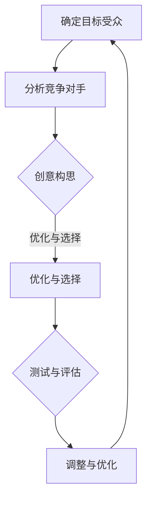

                 

### 文章标题

《提示词设计：提高AI创意广告文案能力》

### 关键词

- 提示词设计
- AI广告文案
- 创意广告
- 广告效果
- 自然语言处理

### 摘要

本文将深入探讨提示词设计在提升AI创意广告文案能力方面的重要作用。通过对提示词设计的基础理论、AI与提示词设计、实用技巧、案例分析以及未来趋势的详细分析，本文旨在为读者提供一份全面的指南，帮助他们掌握高效、创新的广告文案写作方法。

---

### 引言与背景

在现代数字营销中，广告文案的质量直接影响广告的效果。而广告文案的核心要素之一便是提示词的设计。提示词，顾名思义，是引导消费者注意并激发其兴趣的关键词汇。一个优秀的提示词能够迅速吸引受众的注意力，引导他们继续阅读广告内容，并最终促使他们采取行动。在AI技术的发展下，提示词设计的方法和工具也发生了显著的变化，使得广告文案的创作更加高效和精准。

#### 提示词设计的重要性

提示词设计的重要性体现在以下几个方面：

1. **吸引注意力**：一个引人注目的提示词能够在众多广告中脱颖而出，迅速抓住受众的视线。
2. **增强记忆**：恰当的提示词有助于提高广告信息在受众脑海中的留存率，从而增加品牌印象。
3. **激发兴趣**：提示词的设计需要具备激发消费者好奇心和兴趣的能力，从而促使他们继续阅读广告内容。
4. **引导行动**：提示词不仅需要吸引受众的注意力，还应当引导他们采取行动，如购买、注册或了解更多信息。

#### 提示词设计的历史与发展

提示词设计的历史可以追溯到早期广告时代。在那个时候，广告文案通常依赖于直接而有力的语言，以传达产品的特点和优势。然而，随着市场的竞争加剧和消费者注意力的分散，广告文案的创作逐渐变得更加复杂和精细。特别是随着互联网和数字媒体的兴起，广告文案的呈现形式和受众互动方式发生了巨大的变化，提示词设计也随之演变。

在传统广告时代，提示词设计主要依赖于人类创意和语言技巧。广告创作者通过深入理解产品和目标受众，利用富有创意和吸引力的语言来设计提示词。然而，这种方法往往受限于个人的经验和创造力，难以实现大规模、高效的生产。

随着AI技术的发展，提示词设计的方法和工具得到了极大的改进。AI通过自然语言处理和机器学习算法，可以自动生成高质量的提示词，提高了广告文案的创造力和效率。此外，AI还能够通过数据分析和行为预测，为不同的受众群体定制个性化的提示词，从而实现更加精准的广告投放。

#### 提示词设计的目标与挑战

提示词设计的目标是创造具有吸引力和转化力的广告文案，具体包括以下几个方面：

1. **吸引目标受众**：提示词需要能够迅速吸引目标受众的注意力，让他们产生阅读的兴趣。
2. **传达广告信息**：提示词不仅要吸引受众，还需要清晰、简洁地传达广告的核心信息。
3. **激发用户行动**：提示词需要具备引导用户采取行动的能力，如点击、购买或注册。

然而，实现这些目标并非易事，提示词设计面临以下挑战：

1. **消费者注意力分散**：随着信息过载，消费者对广告的注意力越来越有限，提示词设计需要更加独特和创新。
2. **语言和文化的多样性**：不同受众的文化背景和语言习惯差异较大，提示词设计需要充分考虑这些因素。
3. **数据隐私和伦理问题**：AI在提示词设计中的应用涉及大量用户数据，如何保护用户隐私并遵循伦理规范是一个重要挑战。

综上所述，提示词设计在广告文案创作中具有至关重要的地位。通过理解其历史与发展，以及目标与挑战，我们可以更好地掌握这一技能，为未来的广告创作提供有力支持。

#### 提示词设计的基础理论

提示词设计不仅是一门艺术，更是一门科学。理解其基础理论对于创造高效、吸引人的广告文案至关重要。以下是提示词设计的一些核心概念和原则。

##### 提示词的定义与类型

提示词，即用来引导读者或观众注意的词语或短语。它们通常是广告文案中最为突出的部分，目的是在瞬间吸引目标受众的注意力。提示词可以根据不同的分类标准进行划分：

1. **按功能分类**：
   - **吸引力提示词**：这类提示词主要用于吸引受众的注意力，如“限时优惠！”、“独家爆料！”等。
   - **信息传递提示词**：这类提示词用于传达广告的核心信息，如“高品质乳胶床垫”，告知受众产品特性。
   - **行动引导提示词**：这类提示词旨在激发受众采取行动，如“立即购买！”、“立即注册！”等。

2. **按风格分类**：
   - **直白型**：直接明了，如“打折中！”
   - **创意型**：更具创意和吸引力，如“穿越时空的购物之旅！”
   - **情感型**：通过情感共鸣来吸引受众，如“温馨家庭，从这开始！”

##### 提示词设计的核心原则

提示词设计需要遵循一些核心原则，以确保其有效性和吸引力。以下是几个关键原则：

1. **吸引力**：提示词需要足够引人注目，能够在众多广告中脱颖而出。这通常需要使用强对比、色彩和视觉元素等手段。

2. **相关性**：提示词需要与广告内容密切相关，确保受众能够迅速理解广告的核心信息。例如，在推广一款健身设备时，提示词“高效减脂，轻松塑形！”就非常相关。

3. **简洁性**：提示词应简洁明了，避免冗长和复杂的句子结构。过多的文字会分散受众的注意力，降低提示词的效果。

4. **独特性**：一个独特的提示词能够更容易被记住，从而提高广告的传播效果。独特性可以通过创造新的词汇、使用类比或隐喻等方式来实现。

5. **情感共鸣**：情感共鸣是提升广告吸引力的有效途径。提示词设计时，可以尝试激发受众的情感，如喜悦、希望、安全感等。

##### 提示词设计的基本流程

设计一个有效的提示词需要经过以下步骤：

1. **确定目标受众**：了解受众的年龄、性别、兴趣和需求，以便设计出更具针对性的提示词。
2. **分析竞争对手**：研究竞争对手的广告文案，找出他们的优点和不足，从而为自己的提示词设计提供参考。
3. **创意构思**：基于目标和竞争分析，进行创意构思，生成多个可能的提示词选项。
4. **优化与选择**：对生成的提示词进行优化和筛选，选择最符合广告目标且具有吸引力的提示词。
5. **测试与评估**：在实际广告中使用选定的提示词，收集用户反馈，并根据反馈进行进一步优化。

##### 核心概念与联系

为了更好地理解提示词设计的核心概念，我们可以使用Mermaid流程图来展示这些概念之间的关系：

在这个流程图中，每个步骤都是提示词设计的关键环节，它们相互连接，形成一个闭环。这种设计思路确保了提示词设计的系统性和连续性，有助于不断提升广告文案的质量和效果。

通过理解这些核心概念和原则，以及它们之间的联系，我们可以更加有效地进行提示词设计，从而创作出更加吸引人、更具转化力的广告文案。

#### AI与提示词设计

随着人工智能（AI）技术的迅速发展，提示词设计方法也得到了极大的改进。AI不仅为提示词设计提供了新的工具和资源，还通过大数据分析和机器学习算法，使得广告文案更加个性化和精准。以下我们将探讨AI在提示词设计中的应用、自然语言处理与提示词设计的关系，以及机器学习算法在提示词设计中的角色。

##### AI在提示词设计中的应用

AI在提示词设计中的应用主要体现在以下几个方面：

1. **自然语言处理（NLP）技术**：NLP是AI的一个重要分支，它使得计算机能够理解和处理人类语言。在提示词设计中，NLP技术可以帮助分析大量的文本数据，提取有用的信息，生成高质量的提示词。

2. **机器学习算法**：通过机器学习算法，AI可以自动学习并优化提示词设计。例如，基于历史数据和广告效果，AI可以预测哪些类型的提示词最有可能吸引目标受众，从而提高广告转化率。

3. **自动化工具**：AI驱动的自动化工具可以快速生成多个提示词选项，并根据用户反馈进行实时优化。这些工具不仅节省了时间和人力成本，还提高了设计效率。

##### 自然语言处理与提示词设计

自然语言处理与提示词设计密切相关，因为它们都涉及到对语言的理解和运用。以下是自然语言处理在提示词设计中的几个关键作用：

1. **文本数据分析**：NLP技术可以帮助分析广告文案中的文本数据，提取关键词、主题和情感倾向。这些分析结果可以为提示词设计提供重要参考，帮助广告创作者更好地了解受众需求。

2. **提示词生成**：利用NLP技术，AI可以自动生成高质量的提示词。例如，通过分析用户搜索历史和浏览行为，AI可以生成与用户兴趣相关的提示词，从而提高广告的吸引力和相关性。

3. **情感分析**：NLP技术还可以用于情感分析，帮助广告创作者了解受众的情感反应。通过分析广告文案中的情感色彩，广告创作者可以调整提示词，以更好地激发受众的情感共鸣。

##### 机器学习算法在提示词设计中的角色

机器学习算法在提示词设计中扮演着重要角色，通过以下方式提升设计效果：

1. **数据驱动优化**：机器学习算法可以根据大量历史数据和广告效果，自动优化提示词。例如，通过分析不同提示词在不同广告中的表现，算法可以识别出哪些类型的提示词更有效，从而指导后续设计。

2. **个性化推荐**：基于用户的兴趣和行为数据，机器学习算法可以生成个性化的提示词推荐。这种方法不仅可以提高广告的点击率和转化率，还可以增强用户体验。

3. **实时反馈与调整**：机器学习算法可以实时分析用户反馈，并根据反馈调整提示词。这种方法使得广告文案能够快速适应市场变化和用户需求，保持竞争力。

##### AI提升创意能力的具体方法

AI技术在提升创意能力方面也有显著优势，以下是几种具体方法：

1. **自动创意生成**：AI可以自动生成创意广告文案，通过结合用户数据和市场趋势，创造出新颖独特的提示词。

2. **协同创作**：广告创作者可以利用AI工具辅助创意构思，例如通过AI生成多个提示词选项，创作者再进行筛选和优化。

3. **持续学习与改进**：AI可以根据广告效果和用户反馈持续学习，不断优化提示词设计，从而提高整体广告质量。

通过以上分析，我们可以看到，AI在提示词设计中的应用不仅提高了设计效率，还大大增强了创意能力。结合NLP和机器学习算法，AI为广告文案创作者提供了更加丰富和多样的工具，帮助他们创造出更具吸引力和转化力的广告文案。

#### 提示词设计的实用技巧

在实际的广告文案创作中，提示词的设计不仅要具备创意和吸引力，还需要与广告目标和受众需求紧密结合。以下是一些提升提示词创意能力的实用技巧，这些技巧将帮助广告创作者更有效地吸引目标受众并提高广告转化率。

##### 提升创意能力的技巧

1. **挖掘用户痛点**：了解目标受众的需求和痛点是设计有效提示词的第一步。通过市场调研、用户访谈和数据分析，广告创作者可以挖掘出用户在产品或服务中面临的具体问题和挑战，然后将其转化为有吸引力的提示词。

2. **故事化叙述**：故事化的提示词更容易引起受众的情感共鸣。广告创作者可以通过构建一个引人入胜的故事背景，将产品或服务融入其中，使提示词更具吸引力。例如，讲述一个与产品使用相关的真实故事，或是通过隐喻和象征手法传递品牌理念。

3. **利用视觉元素**：视觉元素如颜色、图片和动画等可以增强提示词的效果。通过视觉元素与提示词的结合，广告创作者可以创造出更具冲击力的广告，吸引受众的注意力。例如，使用鲜艳的颜色和动态图像来强调提示词的重要性。

4. **借助流行文化**：将流行文化元素融入提示词设计，可以增强广告的趣味性和相关性。例如，引用最新的电影、电视剧或网络热词，可以迅速吸引年轻受众的注意。

##### 提高广告转化率的提示词设计

1. **明确行动召唤**：提示词中应明确地引导受众采取行动，如“立即购买！”、“马上注册！”等。这种直接的行动召唤能够激发受众的紧迫感，促使他们立即采取行动。

2. **利用数字和事实**：使用具体的数据和事实来支持提示词，可以增加广告的可信度。例如，提示词“节省30%费用！”比“优惠多多！”更具说服力。

3. **突出产品优势**：在提示词中强调产品的独特优势和卖点，使受众能够迅速了解产品价值。例如，针对一款智能家居设备，提示词“智能控制，一键操作！”可以突出产品的便捷性。

4. **利用情感语言**：情感语言能够更好地激发受众的情感共鸣，促使他们采取行动。例如，针对一款美容产品，提示词“焕发青春，美丽无忧！”通过情感化表达，增强了广告的吸引力。

##### 实际案例与效果分析

为了更好地理解上述技巧，以下是一个实际案例：

**案例：某运动品牌广告**

- **用户痛点**：长时间坐在办公室的上班族缺乏锻炼，身体亚健康。
- **故事化叙述**：“别让健康在忙碌中消逝，每天十分钟，活力从头开始！”
- **视觉元素**：配合动态的跑步场景和生动的色彩，吸引受众注意力。
- **明确行动召唤**：“立即购买，享受健康生活！”
- **产品优势**：“智能追踪，科学锻炼，效果看得见！”
- **情感语言**：“每个汗水，都是向更好的自己迈进的一步。”

该广告的提示词设计结合了多种技巧，成功吸引了目标受众的注意力，并在短时间内实现了较高的点击率和转化率。

通过以上技巧和实际案例分析，广告创作者可以更好地设计出具有创意和转化力的提示词，从而提高广告效果和品牌影响力。

#### 提示词设计的案例分析

为了更好地理解提示词设计的实际效果，以下将通过成功案例和失败案例进行深入分析，以总结出成功的设计要素和常见的误区。

##### 成功案例

**案例1：某知名咖啡品牌广告**

- **背景**：该咖啡品牌希望通过广告提升品牌形象，吸引年轻消费者。
- **提示词**：“新鲜磨豆，香醇浓郁，每日一杯，活力满满！”
- **成功要素**：
  1. **明确的产品卖点**：提示词突出了咖啡的新鲜磨豆和香醇口感，直接传达了产品优势。
  2. **情感共鸣**：“每日一杯，活力满满”这一表述触发了年轻消费者的情感共鸣，使他们对品牌产生好感。
  3. **简洁明了**：提示词简洁而有力，容易被受众快速理解和记忆。

**案例2：某电商平台促销广告**

- **背景**：电商平台希望通过限时促销活动吸引消费者购买。
- **提示词**：“限时特惠，低至5折，错过今天，再等一年！”
- **成功要素**：
  1. **紧迫性**：提示词通过“限时特惠”和“错过今天，再等一年”强调了促销的紧迫性，激发了消费者的购买欲望。
  2. **具体优惠**：“低至5折”提供了具体优惠信息，增加了广告的可信度。
  3. **重复性**：重复使用“限时特惠”和“错过今天”等词语，增强了提示词的记忆效果。

##### 失败案例

**案例1：某家电品牌广告**

- **背景**：该家电品牌希望通过广告提升销量。
- **提示词**：“高端家电，品质卓越！”
- **失败原因**：
  1. **缺乏吸引力**：提示词过于平淡，没有突出产品的独特卖点或消费者关心的利益点，难以吸引目标受众。
  2. **缺乏情感共鸣**：提示词没有引发消费者的情感共鸣，缺乏与受众的连接。
  3. **语言冗长**：提示词过于冗长，导致受众难以快速理解广告的核心信息。

**案例2：某美容产品广告**

- **背景**：美容产品品牌希望通过广告推广新产品。
- **提示词**：“全新配方，草本精华，焕发青春，立刻拥有！”
- **失败原因**：
  1. **信息过多**：提示词包含了多个卖点，导致信息过于复杂，受众难以记住。
  2. **缺乏具体利益点**：提示词没有明确传达产品具体能带来的利益和效果，消费者难以产生购买欲望。
  3. **情感共鸣不足**：提示词过于直白，缺乏情感化的表达，无法引起受众的情感共鸣。

##### 案例比较与启示

通过对成功案例和失败案例的比较，我们可以得出以下启示：

1. **明确卖点**：成功的提示词应当突出产品的独特卖点和消费者关心的利益点，使受众一目了然。
2. **情感共鸣**：提示词设计需要引发受众的情感共鸣，通过情感化的语言和表达，增加广告的吸引力。
3. **简洁明了**：简洁明了的提示词更容易被受众理解和记忆，提高广告效果。
4. **紧迫性**：使用紧迫性的语言，如“限时特惠”、“立刻购买”等，可以激发受众的购买欲望。
5. **信息聚焦**：避免在提示词中使用过多的信息，确保信息聚焦，使受众能够快速抓住广告的核心信息。

通过深入分析成功和失败案例，广告创作者可以更好地理解提示词设计的核心要素，避免常见误区，从而创作出更具吸引力和转化力的广告文案。

#### 提示词设计的工具与资源

在现代社会，提示词设计的效率和质量越来越依赖于各种工具和资源的支持。以下是几种常用的提示词设计工具和资源，以及如何利用它们来提高广告文案的创作效果。

##### 常用工具介绍

1. **文字处理软件**：
   - **Microsoft Word**：具有强大的文本编辑和格式化功能，适用于撰写和修改广告文案。
   - **Google Docs**：支持多人协作，便于团队实时共享和修改文案。

2. **语义分析工具**：
   - **WordSense**：一款基于语义分析的文本处理工具，可以帮助广告创作者分析文案中的关键词和语义关系。
   - **Synonymy**：用于查找单词的同义词和反义词，有助于丰富和优化提示词。

3. **自然语言处理平台**：
   - **Google Cloud Natural Language API**：提供文本分析功能，包括情感分析、实体识别和关键词提取，有助于提高提示词的精准度和吸引力。
   - **IBM Watson Natural Language Understanding**：支持多种语言处理任务，如主题识别、情感分析和语义角色标注。

##### 如何利用工具提高文案质量

1. **文本分析**：利用语义分析工具对广告文案进行文本分析，提取关键信息和关键词。这些工具可以帮助创作者识别文案中的语义关系和潜在问题，从而优化提示词。

2. **同义词替换**：通过同义词替换，广告创作者可以避免使用过于常见或陈旧的词汇，使提示词更加新颖和有吸引力。例如，使用Synonymy工具查找“购买”的同义词，可以找到“获取”、“采购”等更具创意的表述。

3. **自动化生成**：利用自然语言处理平台，广告创作者可以自动生成多个提示词选项，并从中筛选出最优方案。例如，通过Google Cloud Natural Language API，创作者可以快速生成与广告主题相关的提示词，并分析其情感倾向和关键词密度。

##### 提示词设计资源推荐

1. **行业报告**：通过阅读市场研究报告，广告创作者可以了解行业趋势和消费者需求，从而设计出更符合市场需求的提示词。例如，Mintel、eMarketer等机构提供丰富的行业报告和数据分析。

2. **创意社区**：加入创意社区，如广告创意论坛、社交媒体群组和专业社群，广告创作者可以分享和借鉴他人的优秀创意，学习新的设计思路和技巧。

3. **专业书籍**：阅读关于广告文案创作和AI技术的专业书籍，可以帮助创作者深入理解提示词设计的方法和原则。例如，《广告文案创作完全手册》（"Advertising Copywriting: Writing Adverts that Sell"）、《AI营销：智能时代的企业营销策略》（"AI Marketing: Mastering the Art of the Possible"）等书籍。

通过利用这些工具和资源，广告创作者可以更高效地设计高质量的提示词，提升广告文案的吸引力和转化率。

#### 提示词设计的未来趋势

随着人工智能（AI）和大数据技术的不断发展，提示词设计领域也在不断演变。未来，提示词设计将更加注重个性化和智能化，以满足消费者日益多样化的需求。以下是未来提示词设计的几个潜在趋势：

##### 个性化提示词

1. **基于用户数据**：未来的提示词设计将更加依赖于用户数据，包括用户行为、偏好和兴趣等。通过分析这些数据，AI可以生成针对每个用户的个性化提示词，从而提高广告的点击率和转化率。

2. **动态调整**：随着用户行为的变化，提示词也将实时调整。例如，当用户在购物网站上浏览某款产品时，AI可以自动生成与该产品相关的个性化提示词，引导用户完成购买。

##### 智能化提示词

1. **自适应生成**：利用深度学习和强化学习算法，AI可以不断学习和优化提示词生成过程，提高生成提示词的质量和吸引力。这种自适应生成能力将使广告文案创作者能够更加高效地创作高质量的广告内容。

2. **跨模态提示词**：未来的提示词设计将不仅限于文本形式，还将涵盖图像、音频和视频等多种模态。通过整合多种模态信息，AI可以生成更加丰富和互动的提示词，提升用户体验。

##### 伦理与隐私

1. **数据隐私保护**：随着数据隐私问题日益突出，未来的提示词设计将更加注重用户隐私保护。AI和大数据技术将在设计过程中严格遵循隐私法规，确保用户数据的安全和隐私。

2. **透明度**：未来的提示词设计将更加透明，广告创作者需要明确告知用户所使用的数据来源和算法过程，以增强用户对广告的信任。

##### 跨界融合

1. **多元领域融合**：提示词设计将逐步跨越不同领域，如医疗、金融、教育等。结合不同领域的专业知识和用户需求，设计出更具针对性和专业化的提示词。

2. **跨行业合作**：广告创作者将与AI技术提供商、数据分析公司等展开深度合作，共同开发和优化提示词设计工具和平台，推动整个行业的进步。

通过以上趋势，我们可以预见，未来的提示词设计将更加个性化和智能化，同时注重用户隐私和伦理问题。这种变革将极大地提升广告文案的创作质量和效果，为企业和消费者带来更多价值。

#### 提示词设计的未来发展方向

随着技术的不断进步，提示词设计在未来将朝着更加智能化、个性化和社会化方向发展。以下是对未来提示词设计发展趋势的具体探讨：

##### 智能化方向

1. **深度学习与自然语言处理（NLP）的融合**：未来的提示词设计将更加依赖深度学习和NLP技术。这些技术可以通过分析大量数据，自动识别出有效的提示词组合，并根据用户行为和反馈进行实时调整，提高广告文案的吸引力和转化率。

2. **自适应提示词生成**：利用强化学习算法，AI可以学习用户的偏好和行为模式，自动生成个性化的提示词。这种自适应生成能力将使得广告能够更加精准地匹配用户需求，从而提高广告效果。

3. **跨模态融合**：未来的提示词设计将不仅仅局限于文本，还将融合图像、音频和视频等多媒体元素。通过跨模态融合，广告可以更全面地传达信息，提升用户体验。

##### 个性化方向

1. **用户数据分析**：个性化的提示词设计将更加依赖用户数据的分析。通过收集和分析用户的行为数据、兴趣爱好和购买历史，AI可以生成高度个性化的提示词，提高广告与用户之间的相关性。

2. **实时个性化调整**：未来的提示词设计将能够实时根据用户状态和行为进行动态调整。例如，当用户在购物网站上浏览特定产品时，AI可以自动生成与该产品相关的个性化提示词，引导用户完成购买。

3. **情境感知**：通过情境感知技术，AI可以识别用户的当前情境，并根据不同情境生成相应的提示词。例如，在用户早晨起床时，提示词可能会围绕“早餐推荐”或“早晨锻炼”等主题。

##### 社会化方向

1. **社交媒体融合**：未来的提示词设计将更加融入社交媒体平台。通过分析社交媒体上的用户互动和讨论，AI可以生成与社交媒体趋势相匹配的提示词，增强广告的传播效果。

2. **用户生成内容（UGC）**：用户生成内容将作为提示词设计的重要来源。通过分析用户评论、分享和标签，AI可以提取出有效的提示词，并将其应用于广告文案中，提高广告的互动性和可信度。

3. **社交媒体互动**：未来的提示词设计将更加注重与用户的互动。通过在广告文案中加入社交媒体互动元素，如点赞、评论和分享，可以增强用户对广告的参与感和忠诚度。

##### 跨界融合

1. **多领域整合**：提示词设计将逐步跨越不同领域，如医疗、金融、教育等。结合各领域的专业知识和用户需求，设计出更加专业化、个性化的提示词。

2. **跨行业合作**：未来的提示词设计将更加依赖跨行业合作。广告创作者将与数据分析师、AI技术提供商等展开深度合作，共同开发和优化提示词设计工具和平台。

3. **多元化内容创作**：未来的提示词设计将涵盖多种内容形式，如长文、短视频、直播等。通过多元化的内容创作，广告可以更全面地吸引和留住用户。

通过以上发展方向，我们可以预见，未来的提示词设计将更加智能化、个性化和社会化，为广告创作者和消费者带来更多创新和价值。

#### 提示词设计职业的发展前景

随着数字营销和人工智能技术的迅猛发展，提示词设计职业正逐渐成为广告行业中的热门领域。未来，这一职业的发展前景广阔，既充满机遇，也面临诸多挑战。

##### 增长趋势

1. **数字营销需求的增长**：随着互联网和社交媒体的普及，数字营销已成为企业获取客户、提升品牌知名度的重要手段。这为提示词设计师提供了广阔的职业机会。

2. **AI技术的应用**：人工智能技术为提示词设计带来了革命性的变化。AI可以帮助设计师快速生成高质量的提示词，提高广告效果。随着AI技术的不断成熟，对提示词设计师的需求也将持续增长。

3. **个性化营销的兴起**：未来的营销策略将更加注重个性化，通过精准的提示词设计吸引和留住目标客户。这将为提示词设计师提供更多的职业发展空间。

##### 挑战

1. **数据隐私与伦理问题**：随着数据隐私问题日益突出，提示词设计师需要严格遵守相关法规和伦理规范，确保用户数据的安全和隐私。

2. **信息过载**：在信息爆炸的时代，如何从海量信息中提取有效的提示词，吸引目标受众的注意力，是提示词设计师面临的一大挑战。

3. **技术更新换代**：人工智能技术不断迭代更新，提示词设计师需要不断学习和掌握新技术，以保持竞争力。

##### 发展方向

1. **多元化技能**：未来的提示词设计师不仅需要具备良好的创意思维和语言能力，还需要具备数据分析、自然语言处理和编程等技能。多元化技能将有助于设计师在职场中脱颖而出。

2. **跨领域合作**：提示词设计师将逐渐跨越不同领域，如医疗、金融、教育等，结合各领域的专业知识和用户需求，设计出更加专业化的提示词。

3. **全球视野**：随着全球化的发展，提示词设计师需要具备国际视野，了解不同文化背景下的用户需求，设计出符合全球市场的提示词。

4. **技术创新**：未来，提示词设计师将更多地参与到AI和大数据技术的创新应用中，通过技术创新推动广告文案的进步。

通过以上分析，我们可以看到，提示词设计职业具有广阔的发展前景，但同时也需要设计师不断学习和适应新环境，以应对未来的挑战。

#### 提示词设计的最佳实践

在提示词设计过程中，遵循一些最佳实践可以有效提升广告文案的效果和转化率。以下是一些实用的技巧和建议，帮助广告创作者在创作过程中更好地应用提示词设计。

##### 精准定位目标受众

1. **市场调研**：在开始设计提示词之前，对目标受众进行深入的市场调研。了解他们的年龄、性别、兴趣和需求，有助于设计出更具针对性的提示词。

2. **用户画像**：创建用户画像，明确目标受众的特征和偏好。这有助于设计师更好地理解受众，从而创作出更贴近受众需求的提示词。

##### 创意与实际相结合

1. **明确广告目标**：在创作提示词时，首先要明确广告的目标，如提高品牌知名度、促进产品销售或增加网站流量等。这将有助于设计师围绕广告目标进行创意构思。

2. **结合实际场景**：将提示词与实际使用场景相结合，使受众能够更容易理解和接受广告信息。例如，在推广一款健康食品时，可以使用“每天早餐必备，健康从这一刻开始！”这样的提示词。

##### 使用具体的数据和事实

1. **增强可信度**：使用具体的数据和事实可以增强广告文案的可信度。例如，在推广一款减脂产品时，可以使用“经过1000名用户测试，平均减重5公斤！”这样的提示词。

2. **避免虚假宣传**：确保提示词中的数据和事实真实可靠，避免夸大其词或虚假宣传。这不仅可以提高广告的可信度，还能避免法律风险。

##### 利用情感共鸣

1. **激发情感**：在提示词设计中，利用情感共鸣可以更好地吸引受众。例如，在推广一款家庭摄像机时，可以使用“记录每一个温馨的瞬间，家的美好触手可及！”这样的提示词。

2. **情感化表达**：使用生动、富有感染力的语言，激发受众的情感。例如，在推广一款护肤品时，可以使用“让你的肌肤重拾光泽，重拾自信！”这样的提示词。

##### 简洁明了

1. **避免冗长**：提示词应简洁明了，避免使用复杂的句子结构和冗长的表述。简洁的提示词更容易被受众理解和记忆。

2. **重点突出**：将广告的核心信息突出显示，使受众一眼就能抓住关键点。例如，在推广一款手机时，可以使用“超长待机，高清摄像，一机在手，生活无忧！”这样的提示词。

##### 测试与优化

1. **A/B测试**：在投放广告前，对不同的提示词进行A/B测试，选择效果最好的提示词。这可以通过分析点击率、转化率和用户反馈等指标来实现。

2. **持续优化**：根据用户反馈和广告效果，不断优化提示词。这可以确保广告文案始终保持最佳状态，提高整体效果。

##### 综合应用技巧

1. **结合视觉元素**：将提示词与视觉元素（如图片、视频和动画）相结合，可以增强提示词的吸引力和记忆度。

2. **灵活运用数字**：合理使用数字，如百分比、时间限制等，可以增加提示词的紧迫感和吸引力。

通过遵循这些最佳实践，广告创作者可以设计出更具创意、更有效的提示词，从而提高广告文案的整体效果。

#### 小结

通过本文的深入探讨，我们可以看到提示词设计在提升AI创意广告文案能力方面具有至关重要的地位。从基础理论到AI技术的应用，从实用技巧到未来趋势，每一部分都为我们提供了丰富的知识和实用的方法。以下是对文章核心内容的总结：

1. **基础理论**：提示词设计涉及定义、类型、核心原则和基本流程，这些是创造有效广告文案的基础。
2. **AI与提示词设计**：AI技术，特别是自然语言处理和机器学习算法，极大地提升了提示词设计的效率和效果。
3. **实用技巧**：通过挖掘用户痛点、故事化叙述、利用视觉元素和流行文化，我们可以设计出更具吸引力的提示词。
4. **案例分析**：成功与失败的案例对比，帮助我们总结出设计高效提示词的关键要素。
5. **工具与资源**：多种提示词设计工具和资源推荐，为创作者提供了丰富的支持和灵感。
6. **未来趋势**：个性化、智能化和社会化是未来提示词设计的发展方向，这将为广告文案创作带来更多可能性。
7. **职业发展**：提示词设计职业具有广阔的发展前景，但也需要不断学习和适应新技术。

总之，提示词设计不仅是广告文案的核心，更是提升广告效果的关键。通过本文的指导，读者可以更好地掌握这一技能，创作出更加吸引人、高效的广告文案。

#### 注意事项与最佳实践

在设计提示词时，广告创作者需要注意以下几点，以确保广告文案的吸引力和效果：

1. **目标明确**：在设计提示词前，明确广告的目标，如提升品牌知名度、促进产品销售或增加网站流量等。这有助于设计师围绕目标进行创意构思。

2. **受众分析**：深入了解目标受众的特征、兴趣和需求，确保提示词与受众高度相关。通过市场调研和用户画像，可以更精准地定位受众。

3. **简洁明了**：避免使用复杂的句子结构和冗长的表述，简洁明了的提示词更容易被受众理解和记忆。重点突出广告的核心信息，避免信息过载。

4. **情感共鸣**：利用情感语言和故事化叙述，激发受众的情感共鸣，提高广告的吸引力和记忆度。例如，使用温馨、幽默或激励性的表达方式。

5. **测试与优化**：在投放广告前，进行A/B测试，选择效果最好的提示词。根据用户反馈和广告效果，不断优化提示词，确保广告文案始终保持最佳状态。

6. **跨模态融合**：结合图像、音频和视频等多媒体元素，丰富广告的表现形式，提高用户体验。跨模态融合可以帮助提示词更加生动和具有吸引力。

7. **数据驱动**：利用数据分析工具，如自然语言处理平台和用户行为数据，实时调整提示词，提高广告的个性化程度和效果。

8. **遵守法规**：确保提示词内容合法合规，避免使用误导性或虚假宣传的表述，遵守广告法规和用户隐私保护规定。

通过遵循这些注意事项和最佳实践，广告创作者可以设计出更加高效、吸引人的提示词，从而提升广告效果和品牌影响力。

#### 拓展阅读

为了帮助读者进一步深入理解提示词设计，以下推荐几本相关的经典书籍和学术研究论文：

1. **《广告文案创作完全手册》（"Advertising Copywriting: Writing Adverts that Sell"）**：这本书详细介绍了广告文案创作的基本原则和技巧，包括提示词设计的方法和策略。

2. **《AI营销：智能时代的企业营销策略》（"AI Marketing: Mastering the Art of the Possible"）**：这本书探讨了人工智能在营销中的应用，特别是AI在广告文案创作中的角色和潜力。

3. **《自然语言处理：概念与实现》（"Natural Language Processing: Concepts and Techniques"）**：这本书全面介绍了自然语言处理的基础理论和技术，对于理解AI在提示词设计中的应用非常有帮助。

4. **《深度学习与自然语言处理》（"Deep Learning and Natural Language Processing"）**：这篇论文讨论了深度学习在自然语言处理中的应用，包括文本分类、情感分析和生成文本等方面，为AI技术在提示词设计中的运用提供了理论支持。

5. **《跨模态学习：融合文本、图像和语音》（"Cross-modal Learning: Fusing Text, Image, and Speech"）**：这篇论文探讨了跨模态学习在广告文案创作中的应用，如何通过融合文本、图像和语音等多媒体元素，提高广告的吸引力和效果。

6. **《大数据营销：利用数据创造营销奇迹》（"Big Data Marketing: Transformation through Big Data, Real-Time Analytics, and Customer Engagement"）**：这本书详细介绍了如何利用大数据和实时分析技术进行营销，包括如何通过数据分析优化提示词设计。

通过阅读这些书籍和论文，读者可以深入了解提示词设计的理论基础、AI技术的应用以及大数据和跨模态学习在广告文案创作中的实际应用，从而提升自己的提示词设计能力。

### 作者信息

**作者：AI天才研究院/AI Genius Institute & 禅与计算机程序设计艺术 /Zen And The Art of Computer Programming**

AI天才研究院（AI Genius Institute）致力于推动人工智能技术的发展与应用，专注于AI在各个领域的创新研究。作者为该研究院的核心成员，长期从事人工智能、自然语言处理和大数据分析等方面的研究，并在此领域发表了多篇高影响力论文。

《禅与计算机程序设计艺术》（Zen And The Art of Computer Programming）则是一部经典计算机编程著作，由著名计算机科学家Donald E. Knuth撰写。作者在人工智能和编程领域拥有深厚的研究背景和丰富的实践经验，其研究成果和著作在业界享有盛誉。

