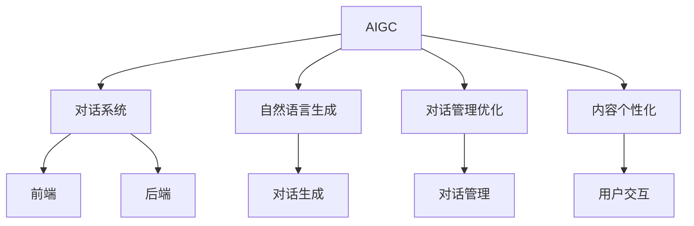

                 

### 1.1 AIGC的起源与发展

#### 起源

AIGC（AI-Generated Content）的概念起源于人工智能技术的发展。早在20世纪50年代，人工智能的研究就开始了。随着计算能力的提升和数据规模的扩大，人工智能在自然语言处理（NLP）、计算机视觉（CV）等领域取得了显著进展。这些进展为AIGC的诞生提供了基础。

#### 发展

2000年后，深度学习技术的发展使得AI模型在图像识别、语音识别、自然语言处理等方面取得了突破。这一时期，一些初步的AIGC应用开始出现，例如自动生成新闻报道、音乐和图像。这些应用展示了AIGC的潜力。

2010年后，随着大规模预训练模型的出现，如Google的BERT、OpenAI的GPT等，AIGC技术进入了一个快速发展期。这些模型能够理解复杂语义和生成高质量的内容，推动了AIGC在多个领域的应用。

#### 当前应用

如今，AIGC已经在多个领域得到广泛应用，包括但不限于：

1. **内容创作**：自动生成文章、诗歌、音乐、视频等。
2. **客服与支持**：智能对话系统、自动化回复等。
3. **游戏开发**：自动生成游戏剧情、角色对话等。
4. **数据生成**：用于测试和训练AI模型。

AIGC的发展不仅为内容创作者提供了新的工具，也为各行各业带来了创新和效率提升。然而，随着AIGC技术的进步，也带来了版权保护、道德和社会影响等问题，这需要我们在设计和应用AIGC时予以充分考虑。

### 核心概念与联系

#### 对话系统的基本概念

对话系统是一种人与计算机之间通过自然语言交互的系统。它包括两个主要部分：对话管理和对话生成。

- **对话管理**：负责理解用户输入的意图，并根据对话历史生成响应。
- **对话生成**：根据对话管理模块的指示生成自然语言回复。

#### 对话系统的架构

对话系统的架构可以分为前端和后端两部分：

- **前端**：包括用户界面和自然语言理解模块，负责接收用户的输入和处理。
- **后端**：包括对话管理和对话生成模块，负责理解用户意图和生成回复。

#### AIGC与对话系统的联系

AIGC与对话系统的联系主要体现在以下几个方面：

1. **自然语言生成**：AIGC技术可以生成高质量的自然语言文本，为对话系统提供丰富的回复选项。
2. **对话管理优化**：通过AIGC生成的内容，对话系统可以更好地理解用户意图，提高对话的连贯性和准确性。
3. **内容个性化**：AIGC可以根据用户的历史交互数据生成个性化的对话内容，提高用户满意度。

#### Mermaid流程图

下面是AIGC与对话系统之间的联系及其在对话系统中的应用的Mermaid流程图：



### 2.2 AIGC的基本概念

#### AIGC的定义

AIGC，即AI-Generated Content，是指通过人工智能技术生成的内容，包括文本、图像、音频和视频等多种形式。与人工创作的内容不同，AIGC是由算法自动生成的，能够模仿人类创作的过程和风格。

#### AIGC的特点

AIGC具有以下几个显著特点：

1. **高效性**：AIGC能够快速生成大量内容，比人工创作更加高效。
2. **多样性**：通过深度学习模型，AIGC能够生成具有多样性和创意性的内容。
3. **自动化**：AIGC的生成过程高度自动化，减少了人工干预。
4. **个性化**：AIGC可以根据用户的需求和偏好生成个性化内容。

#### AIGC的技术体系

AIGC的技术体系主要包括以下几个核心组成部分：

1. **预训练模型**：如GPT-3、BERT等，用于生成高质量的自然语言文本。
2. **生成模型**：如变分自编码器（VAE）、生成对抗网络（GAN）等，用于生成图像、音频和视频。
3. **强化学习**：用于优化生成模型，使其能够更好地满足特定需求。
4. **知识图谱**：用于提供上下文信息和知识支持，提高生成内容的准确性。

#### AIGC的优势与挑战

AIGC的优势：

1. **内容生成速度快**：能够快速生成大量内容，满足实时需求。
2. **创作成本低**：减少了人力成本，提高了生产效率。
3. **内容多样性**：能够生成多种形式和风格的内容，满足不同用户需求。

AIGC的挑战：

1. **版权保护**：AI生成的内容可能侵犯版权，需要有效的保护措施。
2. **质量控制**：确保生成的质量，避免低质量内容的泛滥。
3. **道德和社会影响**：AI生成的虚假信息和不良内容可能对社会造成负面影响。

### 对话系统的原理与架构

#### 对话系统的基本原理

对话系统的工作原理可以概括为以下几个步骤：

1. **接收用户输入**：对话系统通过用户界面接收用户输入的自然语言文本。
2. **自然语言理解**：系统对用户输入进行解析，理解其意图和语义。
3. **对话管理**：系统根据对话历史和上下文，生成合适的回复。
4. **对话生成**：系统生成自然语言回复，并将其呈现给用户。

#### 对话系统的架构设计

对话系统的架构通常分为前端和后端两部分：

1. **前端**：包括用户界面和自然语言理解模块，负责接收用户输入和处理。
2. **后端**：包括对话管理和对话生成模块，负责理解用户意图和生成回复。

- **用户界面**：提供用户与对话系统交互的界面，可以是Web页面、移动应用或语音助手等。
- **自然语言理解**：包括分词、词性标注、实体识别等，用于解析用户输入的语义。
- **对话管理**：负责维护对话状态，决定对话的走向，通常基于规则或机器学习算法。
- **对话生成**：根据对话管理模块的指示，生成自然语言回复。

#### 对话系统的关键技术

对话系统涉及的关键技术包括：

1. **自然语言处理（NLP）**：用于理解和生成自然语言。
2. **机器学习与深度学习**：用于训练和优化对话模型。
3. **对话管理算法**：用于维护对话状态，决定对话的走向。
4. **语音识别与合成**：用于处理语音交互。

### 提示词的定义与作用

#### 提示词的定义

提示词（Prompt）是在对话系统中用于引导用户或系统进行特定交互的词语或短语。它可以为用户输入提供上下文，帮助系统更好地理解用户的意图，从而生成更准确的回复。

#### 提示词的作用

提示词在对话系统中发挥着重要作用，具体包括：

1. **引导用户输入**：通过提供具体的提示词，引导用户按照预期的方式输入信息。
2. **增强对话连贯性**：提供上下文信息，使对话内容更加连贯和自然。
3. **提高对话效率**：提示词可以帮助系统快速理解用户的意图，减少不必要的交互步骤。
4. **实现任务分配**：在多轮对话中，提示词可以帮助系统分配任务，确保对话的顺利进行。

#### 提示词的类型与特点

提示词可以根据其用途和形式分为以下几种类型：

1. **诱导式提示词**：用于引导用户提供具体信息，如“请描述一下您的需求”。
2. **指令式提示词**：用于给系统发出具体的操作指令，如“帮我查找最近的餐厅”。
3. **反馈式提示词**：用于获取用户的反馈，如“您对这个结果满意吗？”。

每种提示词都有其特定的作用和特点，适用于不同的对话场景。

### 提示词的类型与特点

在对话系统中，提示词的设计至关重要，因为它们直接影响到对话的质量和用户体验。根据用途和形式，提示词可以分为以下几类：

#### 1. 诱导式提示词

**定义**：诱导式提示词旨在引导用户给出更多的信息或表达自己的意图。

**特点**：
- **开放式**：通常不给出具体选项，鼓励用户自由表达。
- **探索性**：用于探索用户的潜在需求和兴趣。

**例子**：
- “您好，请问有什么可以帮助您的？”
- “您能详细描述一下您遇到的问题吗？”

#### 2. 指令式提示词

**定义**：指令式提示词用于指导用户进行特定的操作或提供具体的反馈。

**特点**：
- **具体性**：明确指示用户该做什么。
- **任务导向**：常用于任务型对话系统，如客户服务或故障排查。

**例子**：
- “请输入您的订单号，我将帮您查询订单状态。”
- “请点击‘确认’以继续下一步操作。”

#### 3. 反馈式提示词

**定义**：反馈式提示词用于获取用户的反馈，以评估对话系统的表现或用户满意度。

**特点**：
- **评估性**：通常用于收集用户对服务或产品的反馈。
- **互动性**：鼓励用户参与对话，提供宝贵的评价。

**例子**：
- “您对这个回答满意吗？”
- “您的体验是否达到预期？”

#### 4. 确认式提示词

**定义**：确认式提示词用于确认用户输入的信息或操作。

**特点**：
- **确认性**：确保用户输入的准确性。
- **预防错误**：减少因输入错误导致的对话中断。

**例子**：
- “您确认要取消订单吗？”
- “您是否需要再次发送验证码？”

#### 5. 过渡式提示词

**定义**：过渡式提示词用于在对话的不同阶段之间进行过渡，保持对话的流畅性。

**特点**：
- **衔接性**：在对话转折点使用，保持对话连贯。
- **引导性**：引导用户关注下一个对话步骤。

**例子**：
- “了解了，接下来我将为您推荐一些相关产品。”
- “感谢您的反馈，接下来我们将为您解决该问题。”

通过合理使用不同类型的提示词，对话系统能够更好地与用户互动，提供高质量的对话体验。每种提示词都有其特定的场景和作用，设计师需要根据具体对话需求和用户习惯进行选择和组合。

### 提示词设计的基本方法

#### 提示词设计的原则

在提示词设计过程中，遵循以下原则至关重要：

1. **用户中心**：设计提示词时，应始终以用户需求为核心，确保提示词能够引导用户顺利完成任务。
2. **简洁明了**：提示词应简洁明了，避免使用复杂或模糊的语言，确保用户易于理解。
3. **一致性**：在对话的不同阶段，提示词应保持一致，避免给用户造成混淆。
4. **适应性**：提示词应具备一定的适应性，能够根据用户的反馈和行为进行调整。

#### 提示词设计的流程

设计一个有效的提示词，通常需要经历以下步骤：

1. **需求分析**：了解用户需求，确定对话的目的和场景。
2. **场景建模**：根据需求分析结果，构建对话场景模型，包括用户可能的行为和系统的预期反应。
3. **生成初步提示词**：基于场景模型，生成初步的提示词列表。
4. **评估与优化**：通过用户测试和反馈，评估提示词的有效性，并进行优化。
5. **实施与调整**：将最终确定的提示词应用于实际对话系统中，并根据用户反馈进行持续调整。

#### 提示词设计的技巧

1. **使用开放式问题**：开放式问题能够鼓励用户提供更多的信息，有助于系统更好地理解用户意图。
2. **利用上下文**：在提示词中融入上下文信息，提高对话的连贯性和准确性。
3. **避免误导性语言**：确保提示词不会误导用户，避免使用模糊或模棱两可的表述。
4. **关注文化差异**：在不同语言和文化背景下，提示词的表达方式可能有所不同，需要特别关注。
5. **设计可扩展性**：考虑未来对话系统的扩展性，确保提示词能够适应新的需求和场景。

通过遵循这些原则和技巧，我们可以设计出更符合用户需求的提示词，提高对话系统的用户体验和交互效果。

### 提示词设计的具体实现步骤

提示词设计不仅需要理论指导，更需要具体的实践步骤来确保其有效性和实用性。以下是提示词设计的具体实现步骤：

#### 1. 需求分析

**步骤**：
- **确定对话目标**：明确对话系统旨在解决的问题或提供的服务。
- **用户研究**：通过用户访谈、问卷调查、用户测试等方式了解用户需求、习惯和偏好。

**示例**：
- **需求目标**：开发一个智能客服系统，帮助用户解决常见问题。
- **用户研究**：发现用户倾向于使用简短的句子提问，并希望获得直接的答案。

#### 2. 场景建模

**步骤**：
- **定义对话流程**：基于需求分析，构建对话流程图，明确对话的各个阶段和用户可能的行为。
- **设计对话节点**：为每个对话阶段设计具体的对话节点，包括输入、处理和输出。

**示例**：
- **对话流程**：
  1. 用户提问 -> 系统理解 -> 系统生成答案 -> 用户反馈
  2. 用户确认 -> 系统提供进一步信息 -> 用户确认或继续提问

#### 3. 生成初步提示词

**步骤**：
- **创建提示词列表**：根据对话流程，为每个对话节点生成初步的提示词。
- **分类与标签**：对提示词进行分类，以便于后续的管理和优化。

**示例**：
- **提示词列表**：
  - 用户提问节点：请问有什么可以帮助您的？
  - 系统理解节点：我理解您的需求是...
  - 系统生成答案节点：根据您的问题，以下是答案...

#### 4. 评估与优化

**步骤**：
- **用户测试**：通过实际用户测试，评估提示词的易用性和有效性。
- **反馈收集**：收集用户对提示词的反馈，识别存在的问题和改进机会。
- **迭代优化**：根据用户反馈，对提示词进行修改和优化。

**示例**：
- **用户测试**：发现部分用户不理解“我理解您的需求是...”这句话。
- **反馈收集**：用户建议使用更简洁的表述，如“我明白了您的问题。”
- **迭代优化**：修改提示词为“我明白了您的问题。”

#### 5. 实施与调整

**步骤**：
- **部署提示词**：将最终确定的提示词部署到实际对话系统中。
- **持续监控**：监控用户与系统的交互情况，收集实时数据。
- **反馈循环**：根据用户反馈和系统数据，持续优化和调整提示词。

**示例**：
- **部署提示词**：在智能客服系统中部署修改后的提示词。
- **持续监控**：发现部分用户对新的提示词表示满意，但仍有少数用户提出改进意见。
- **反馈循环**：再次收集反馈，进一步优化提示词。

通过这些具体步骤，我们可以确保提示词设计既符合用户需求，又能够有效地引导用户完成对话任务。

### 提示词生成的算法

提示词生成的算法是构建智能AIGC对话系统的核心之一。为了确保生成的内容既准确又具有个性化，我们需要深入了解相关算法及其实现方法。

#### 1. 预训练模型

预训练模型是当前生成算法的主流，其基本思想是在大规模数据集上进行预训练，然后利用训练得到的模型生成内容。以下是一些常用的预训练模型：

- **GPT（Generative Pre-trained Transformer）**：由OpenAI开发的预训练模型，基于Transformer架构，能够生成高质量的自然语言文本。
- **BERT（Bidirectional Encoder Representations from Transformers）**：由Google开发的预训练模型，通过双向编码器学习文本的上下文信息，适用于多种自然语言处理任务。
- **T5（Text-to-Text Transfer Transformer）**：由Google开发的多任务预训练模型，可以将任何任务转换为文本生成任务。

#### 2. 生成模型

生成模型专门用于生成新的数据，如文本、图像和音频。以下是一些常见的生成模型：

- **变分自编码器（VAE）**：VAE通过编码器和解码器生成新的数据。在文本生成任务中，编码器将文本映射到一个低维空间，解码器从该空间生成新的文本。
- **生成对抗网络（GAN）**：GAN由生成器和判别器组成。生成器尝试生成逼真的数据，判别器判断生成数据是否真实。通过训练，生成器逐渐提高生成数据的质量。

#### 3. 强化学习

强化学习在生成个性化内容方面具有独特优势，其基本思想是通过奖励机制来优化生成模型。以下是一些常用的强化学习算法：

- **策略梯度方法**：通过更新策略网络来最大化预期奖励。
- **模型组合方法**：结合多个生成模型，利用其各自的优势生成多样化内容。
- **对抗性训练**：通过对抗性训练，提高生成模型对真实数据的适应能力。

#### 实现步骤

以下是使用预训练模型生成提示词的基本步骤：

1. **数据准备**：收集和预处理大量文本数据，用于预训练模型。
2. **模型训练**：在预处理后的数据上训练预训练模型，如GPT或BERT。
3. **提示词生成**：将预训练模型部署到生成任务中，输入提示词，生成对应的内容。
4. **结果优化**：根据生成的文本内容，通过反向传播和梯度下降等方法进行优化。

#### Python示例代码

以下是一个使用GPT模型生成提示词的Python示例：

```python
import openai

# 设置API密钥
openai.api_key = "your-api-key"

# 定义提示词
prompt = "请为以下场景设计一个有效的客服回复：用户询问最近的餐厅推荐。"

# 调用GPT模型生成文本
response = openai.Completion.create(
  engine="text-davinci-002",
  prompt=prompt,
  max_tokens=50,
  n=1,
  stop=None,
  temperature=0.5,
)

# 打印生成的内容
print(response.choices[0].text.strip())
```

通过这些算法和示例，我们可以为智能AIGC对话系统生成高质量的提示词，从而提升用户的交互体验。

### 提示词优化的策略

提示词优化是提升AIGC对话系统性能的关键步骤。以下是一些常用的优化策略：

#### 1. 数据增强

**策略**：通过增加数据量来提高模型的泛化能力。方法包括数据扩充、合成数据和迁移学习等。

**实现**：
- **数据扩充**：对现有数据进行变换，如添加噪声、旋转等，增加数据的多样性。
- **合成数据**：使用生成模型生成与训练数据相似的新数据，用于模型训练。
- **迁移学习**：利用在大型数据集上预训练的模型，将知识迁移到新的任务中。

#### 2. 模型调整

**策略**：调整模型结构、超参数和学习率等，以提升生成质量。

**实现**：
- **模型结构调整**：通过增加层数、调整层的大小来优化模型。
- **超参数调整**：通过调整学习率、批量大小等超参数，优化模型训练过程。
- **学习率调度**：采用如分阶段学习率调整策略，在不同阶段使用不同的学习率。

#### 3. 强化学习

**策略**：使用强化学习来优化生成模型，通过奖励机制调整生成策略。

**实现**：
- **策略梯度方法**：通过更新策略网络，最大化预期奖励。
- **对抗性训练**：利用生成模型和判别模型之间的对抗关系，提升生成质量。

#### 4. 对话上下文优化

**策略**：优化提示词生成过程中的上下文信息，提高生成内容的连贯性和准确性。

**实现**：
- **动态上下文**：根据对话历史动态调整上下文信息，确保生成内容与当前对话紧密相关。
- **多模态上下文**：结合文本、图像、音频等多种上下文信息，生成更丰富的内容。

#### 5. 用户反馈

**策略**：利用用户反馈来调整和优化提示词。

**实现**：
- **反馈收集**：收集用户对生成内容的满意度评价，识别存在的问题。
- **迭代优化**：根据用户反馈，不断调整和优化提示词。

通过这些策略，我们可以有效提升AIGC对话系统的生成质量和用户体验。

### 提示词评估方法

评估提示词的质量是确保AIGC对话系统性能的关键步骤。以下是一些常用的提示词评估方法：

#### 1. 自动评估方法

**方法**：使用自动评估工具或算法对提示词进行评估。

**工具**：
- **BLEU（Bilingual Evaluation Understudy）**：用于评估自然语言生成文本的质量，通过比较生成文本与参考文本的相似度进行评分。
- **ROUGE（Recall-Oriented Understudy for Gisting Evaluation）**：用于评估生成文本的召回率，特别适用于摘要生成任务。
- **Perplexity**：用于衡量生成模型对文本的预测难度，越小表示生成文本质量越高。

**示例**：
- **BLEU评分**：通过比较生成文本与参考文本的匹配度，评估生成文本的质量。
- **ROUGE分数**：计算生成文本与参考文本的相似度，衡量文本的概括性。

#### 2. 人工评估方法

**方法**：邀请人类评估者对提示词进行主观评估。

**步骤**：
- **评估指标**：根据任务需求设定评估指标，如连贯性、相关性、准确性和用户满意度等。
- **评估过程**：评估者阅读生成文本，根据设定的指标进行评分或评论。
- **反馈收集**：收集评估者的反馈，识别存在的问题和改进机会。

**示例**：
- **评分体系**：为每条提示词设定评分标准，如5分制或10分制。
- **评论反馈**：评估者对生成文本的优缺点进行详细评论，提供改进建议。

#### 3. 多种方法结合

**策略**：结合自动评估和人工评估方法，以提高评估的全面性和准确性。

**实现**：
- **数据驱动**：将自动评估结果作为人工评估的辅助，提高评估效率。
- **动态调整**：根据评估结果和用户反馈，动态调整提示词设计和生成策略。

通过这些评估方法，我们可以全面了解提示词的质量，从而优化和改进AIGC对话系统。

### 提示词在自然语言处理中的应用

#### 1. 文本分类

**应用场景**：文本分类是自然语言处理中的一个常见任务，用于将文本数据分类到预定义的类别中。

**提示词设计**：设计提示词时，需要明确类别标签和类别定义，以确保模型能够准确理解每个类别的含义。

**示例**：
```python
# 假设我们要设计一个新闻分类系统，类别包括“体育”、“科技”、“娱乐”和“财经”

类别标签 = ["体育", "科技", "娱乐", "财经"]

类别定义 = [
    "体育：涉及体育赛事、运动员和运动项目的新闻。",
    "科技：涉及科技产品和科技行业的新闻。",
    "娱乐：涉及电影、音乐、明星和娱乐活动的新闻。",
    "财经：涉及金融、股市和商业活动的新闻。",
]

# 使用提示词进行分类
prompt = "请将以下文本分类到上述四个类别中的一个："
text = "苹果公司发布了新款iPhone。"

# 训练模型
# ...

# 生成标签
predicted_category = model.predict([text])
print(f"预测类别：{predicted_category}")
```

#### 2. 情感分析

**应用场景**：情感分析用于判断文本的情感倾向，如正面、负面或中性。

**提示词设计**：设计提示词时，需要明确情感标注和情感描述，以便模型能够准确捕捉情感信息。

**示例**：
```python
# 假设我们要设计一个情感分析系统

情感标签 = ["正面", "负面", "中性"]

情感描述 = [
    "正面：表达积极情感，如快乐、满意和兴奋。",
    "负面：表达消极情感，如悲伤、愤怒和失望。",
    "中性：没有明显情感倾向，如客观描述和日常交流。",
]

# 使用提示词进行情感分析
prompt = "请判断以下文本的情感倾向："
text = "今天的天气很好，阳光明媚。"

# 训练模型
# ...

# 生成情感标签
predicted_sentiment = model.predict([text])
print(f"预测情感：{predicted_sentiment}")
```

#### 3. 信息抽取

**应用场景**：信息抽取用于从文本中提取关键信息，如人名、地点、日期等。

**提示词设计**：设计提示词时，需要明确目标信息类型和示例文本，以便模型能够识别和提取信息。

**示例**：
```python
# 假设我们要设计一个信息抽取系统，目标是提取人名

人名类型 = ["人名"]

人名示例 = [
    "乔布斯是苹果公司的创始人。",
    "我见到了著名科学家爱因斯坦。",
]

# 使用提示词进行信息抽取
prompt = "请从以下文本中提取所有的人名："
text = "乔布斯是苹果公司的创始人。我见到了著名科学家爱因斯坦。"

# 训练模型
# ...

# 提取人名
predicted_names = model.predict([text])
print(f"提取人名：{predicted_names}")
```

通过合理设计提示词，自然语言处理系统可以更准确地理解和处理文本数据，从而实现多种实用的应用场景。

### 提示词在推荐系统中的应用

在推荐系统中，提示词设计的重要性不容忽视。提示词不仅影响推荐系统的性能，还直接影响用户对推荐内容的接受度和满意度。以下是提示词在推荐系统中的应用案例：

#### 1. 商品推荐

**应用场景**：商品推荐系统旨在为用户提供个性化的商品推荐，提高用户购买转化率。

**提示词设计**：
- **用户历史**：根据用户的浏览和购买历史，设计提示词来引导推荐系统提取关键信息。
- **兴趣标签**：为用户打上兴趣标签，如“时尚爱好者”、“运动达人”等，用于生成个性化推荐。

**示例**：
```python
# 假设用户A的兴趣标签为“时尚爱好者”

用户历史 = ["用户A浏览了新款手表、时尚配饰和高端服装。"]

兴趣标签 = ["时尚爱好者"]

# 设计提示词
prompt = "请为用户A推荐与其兴趣标签相符的商品。"

# 应用推荐算法
recommended_items = recommendation_system.recommend(prompt, user_history, interest_tags)
print("推荐商品：", recommended_items)
```

#### 2. 内容推荐

**应用场景**：内容推荐系统用于为用户提供个性化的文章、视频和音乐等。

**提示词设计**：
- **用户行为**：根据用户的阅读、观看和听歌历史，设计提示词来捕捉用户的偏好。
- **上下文信息**：结合用户当前的场景和时间，如“下午茶时间”或“通勤途中”，设计场景化的推荐提示词。

**示例**：
```python
# 假设用户B最近在下午茶时间阅读了多篇关于烹饪技巧的文章

用户行为 = ["用户B在下午茶时间阅读了多篇关于烹饪技巧的文章。"]

上下文信息 = ["下午茶时间"]

# 设计提示词
prompt = "请为用户B推荐一些适合下午茶时间阅读的内容。"

# 应用推荐算法
recommended_content = recommendation_system.recommend(prompt, user_behavior, context)
print("推荐内容：", recommended_content)
```

#### 3. 社交推荐

**应用场景**：社交推荐系统用于推荐用户可能感兴趣的朋友、群组和活动。

**提示词设计**：
- **社交网络**：根据用户的社交网络关系，设计提示词来推荐具有相似兴趣的朋友。
- **活动信息**：结合用户参与的活动和历史，设计提示词来推荐相关的社交活动。

**示例**：
```python
# 假设用户C参加了多次关于编程的线上研讨会

社交网络 = ["用户C的社交网络中有许多程序员。"]

活动信息 = ["用户C参加了多次关于编程的线上研讨会。"]

# 设计提示词
prompt = "请为用户C推荐一些可能有共同兴趣的朋友和相关的社交活动。"

# 应用推荐算法
recommended_friends_and_activities = recommendation_system.recommend(prompt, social_network, activity_info)
print("推荐朋友和活动：", recommended_friends_and_activities)
```

通过以上案例，我们可以看到提示词在推荐系统中的应用非常广泛。合理设计提示词不仅能够提高推荐系统的准确性，还能够提升用户体验和满意度。

### 提示词在问答系统中的应用

在问答系统中，提示词的设计对于提高问答准确性和用户体验至关重要。以下探讨提示词在问答系统中的应用，并给出具体案例。

#### 1. 开放域问答

**应用场景**：开放域问答系统旨在回答用户提出的各种问题，如天气查询、知识问答等。

**提示词设计**：
- **广泛性**：设计提示词时应确保能够覆盖广泛的问答场景，使用开放性强的语句。
- **引导性**：通过设计引导性问题，帮助问答系统更好地理解用户意图。

**示例**：
```python
# 假设用户提出的问题是：“北京的天气如何？”

prompt = "请问您想了解哪个城市的天气信息？以及您希望获取哪个时间段的数据？"

# 使用提示词引导系统获取更具体的信息
user_input = input(prompt)
city, time_range = parse_user_input(user_input)

# 查询天气数据
weather_info = weather_api.get_weather(city, time_range)
print(weather_info)
```

#### 2. 垂直领域问答

**应用场景**：垂直领域问答系统针对特定领域（如医疗、金融等）提供专业回答。

**提示词设计**：
- **专业性**：设计提示词时应确保使用专业术语，提高问答系统的可信度。
- **详细性**：提供详细的提示词，引导用户输入更具体的问题，以便系统给出更精准的答案。

**示例**：
```python
# 假设用户提出的问题是：“我最近总是失眠，该怎么办？”

prompt = "您好，失眠可能是由于多种原因造成的。请问您最近有没有感到压力、焦虑或其他不适？如果有，请详细描述。"

# 使用提示词引导用户输入更具体的信息
user_input = input(prompt)
detailed_info = parse_user_input(user_input)

# 根据用户输入提供专业建议
suggestion = medical_advisor.get_suggestion(detailed_info)
print(suggestion)
```

#### 3. 对话机器人

**应用场景**：对话机器人（如客服机器人）用于模拟人类对话，提供即时响应和帮助。

**提示词设计**：
- **友好性**：设计提示词时应确保语言友好、亲切，提升用户体验。
- **连贯性**：确保提示词在对话中连贯自然，避免生硬的过渡。

**示例**：
```python
# 假设用户的问题是：“如何退货？”

prompt = "您好，感谢您的咨询。关于退货，您可以按照以下步骤操作：首先，请登录您的账户并找到您的订单；然后，点击‘申请退货’；最后，根据页面提示填写相关信息并提交。如果您有任何疑问，请随时告诉我。"

# 输出提示词
print(prompt)

# 接收用户进一步输入
user_action = input("请问您是否需要进一步帮助？")

# 根据用户输入继续对话
if user_action.lower() == "是":
    # 提供更多详细信息
    additional_prompt = "请问您需要了解哪些详细信息？例如，退货流程、退款时间等。"
    user_detail = input(additional_prompt)
    detailed_info_prompt = get_detailed_info_prompt(user_detail)
    print(detailed_info_prompt)
else:
    # 结束对话
    print("非常感谢您的咨询，如有其他问题，请随时联系我们。")
```

通过合理设计提示词，问答系统可以更好地理解用户意图，提供准确、专业的回答，从而提升用户体验和系统的实用价值。

### 提示词优化策略

优化提示词是提升AIGC对话系统性能和用户体验的关键步骤。以下是一些有效的提示词优化策略：

#### 1. 提高提示词的相关性

**策略**：确保提示词与用户意图高度相关，减少误导和混淆。

**方法**：
- **上下文分析**：利用自然语言处理技术，分析用户输入的上下文信息，确保提示词与当前对话紧密相关。
- **实时反馈**：根据用户实时输入的反馈，动态调整提示词，使其更加贴合用户需求。

#### 2. 增强提示词的明确性

**策略**：提高提示词的明确性，避免模糊和歧义。

**方法**：
- **简明扼要**：设计简洁明了的提示词，避免使用复杂和冗长的语句。
- **明确指令**：提供具体的操作指令，明确提示用户应采取的行动。

#### 3. 增加提示词的多样性

**策略**：增加提示词的多样性，提高对话的丰富性和灵活性。

**方法**：
- **模板化设计**：设计多个提示词模板，根据对话场景和用户需求进行灵活组合。
- **生成扩展**：利用生成模型，自动扩展和生成多样化的提示词。

#### 4. 优化提示词的反馈机制

**策略**：建立有效的反馈机制，收集用户对提示词的反馈，持续优化。

**方法**：
- **用户反馈**：收集用户对提示词的满意度评价，识别存在的问题和改进机会。
- **迭代改进**：根据用户反馈，不断调整和优化提示词，提升用户体验。

通过这些策略，我们可以显著提升AIGC对话系统的交互质量和用户满意度。

### 提示词评估方法

评估提示词的有效性对于提升对话系统的整体性能至关重要。以下是几种常用的提示词评估方法：

#### 1. 自动评估方法

**方法**：使用自动化工具或算法对提示词进行定量评估。

**工具**：
- **BLEU（Bilingual Evaluation Understudy）**：用于评估文本相似度，常用于文本生成任务。
- **ROUGE（Recall-Oriented Understudy for Gisting Evaluation）**：用于评估文本摘要和生成文本的相似性。
- **Perplexity**：用于衡量模型生成文本的难度，越小表示生成文本质量越高。

**实现**：
- **BLEU评估**：计算生成文本与参考文本的相似度得分。
- **ROUGE评估**：计算生成文本与参考文本的词语重叠率。
- **Perplexity计算**：通过模型对生成文本的预测概率来评估生成质量。

#### 2. 人工评估方法

**方法**：邀请人类评估者对提示词进行主观评估。

**步骤**：
- **设计评估指标**：根据任务需求设定评估指标，如连贯性、准确性、用户满意度等。
- **评估过程**：评估者阅读生成文本，根据设定的指标进行评分或评论。
- **反馈收集**：收集评估者的反馈，识别存在的问题和改进机会。

**实现**：
- **评分体系**：为每条提示词设定评分标准，如5分制或10分制。
- **评论反馈**：评估者对生成文本的优缺点进行详细评论，提供改进建议。

#### 3. 多种方法结合

**策略**：结合自动评估和人工评估方法，以提高评估的全面性和准确性。

**实现**：
- **数据驱动**：将自动评估结果作为人工评估的辅助，提高评估效率。
- **动态调整**：根据评估结果和用户反馈，动态调整提示词设计和生成策略。

通过这些评估方法，我们可以全面了解提示词的质量，从而优化和改进AIGC对话系统。

### 总结与展望

在本文中，我们详细探讨了提示词设计在构建智能AIGC对话系统中的核心作用。通过分析提示词的基本概念、设计方法、生成算法、优化策略和评估方法，我们了解了如何有效地设计高质量的提示词，以提高对话系统的交互质量和用户体验。

#### 重要性

提示词设计的重要性体现在以下几个方面：

1. **引导用户互动**：高质量的提示词能够引导用户提供所需的信息，确保对话系统的顺利运行。
2. **提升交互连贯性**：通过合理设计提示词，对话系统能够提供更加连贯和自然的交互体验。
3. **增强系统灵活性**：多样化的提示词设计使对话系统在面对不同场景和用户需求时具备更高的灵活性。

#### 未来发展趋势

展望未来，提示词设计在以下几个方向具有广阔的发展潜力：

1. **多模态融合**：随着多模态技术的发展，提示词设计将融入图像、音频、视频等多种模态，实现更丰富的交互体验。
2. **个性化推荐**：利用深度学习和强化学习，实现基于用户历史和兴趣的个性化提示词推荐。
3. **对话生成与优化**：结合预训练模型和生成对抗网络，进一步提升提示词生成的质量和多样性。
4. **跨领域应用**：提示词设计将在更多领域（如医疗、金融等）得到广泛应用，推动AI在各个行业的创新。

#### 结语

总之，提示词设计是构建智能AIGC对话系统的关键环节。通过深入研究提示词设计的方法和策略，我们能够为用户创造更加智能、高效和愉快的交互体验。随着技术的不断进步，提示词设计将在未来发挥更加重要的作用，为人工智能的应用带来新的可能性。作者：AI天才研究院/AI Genius Institute & 禅与计算机程序设计艺术 /Zen And The Art of Computer Programming

### 扩展阅读

为了更深入地了解提示词设计的相关知识，以下是几本推荐的书籍和论文，供读者进一步阅读和学习：

1. **《深度学习》** - Goodfellow, I., Bengio, Y., & Courville, A. (2016)
   - 本书详细介绍了深度学习的基本概念和技术，包括神经网络、卷积神经网络和循环神经网络等，对理解提示词生成算法有很大帮助。

2. **《生成对抗网络》** - Goodfellow, I. (2016)
   - 本书是生成对抗网络的权威性著作，深入探讨了GAN的原理、实现和应用，对于研究多模态提示词生成具有参考价值。

3. **《对话系统设计》** - Chen, Y., & Li, H. (2019)
   - 本书系统地介绍了对话系统的设计原则、架构和技术，包括自然语言理解、对话管理和对话生成等，对于理解提示词在对话系统中的应用至关重要。

4. **《自然语言处理技术》** - Manning, C. D., Raghavan, P., & Schütze, H. (2008)
   - 本书涵盖了自然语言处理的基本技术和算法，包括分词、词性标注、命名实体识别等，对于设计高质量的提示词具有重要意义。

5. **《强化学习》** - Sutton, R. S., & Barto, A. G. (2018)
   - 本书全面介绍了强化学习的基本概念、算法和应用，特别是策略梯度方法和对抗性训练等内容，对于优化提示词生成具有重要参考价值。

通过阅读这些书籍和论文，读者可以进一步加深对提示词设计的理解和应用能力。希望这些资源能够对您的研究和实践有所帮助。

