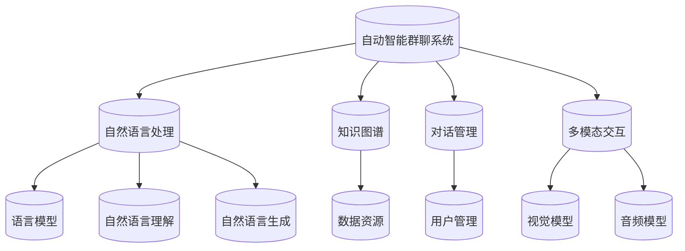
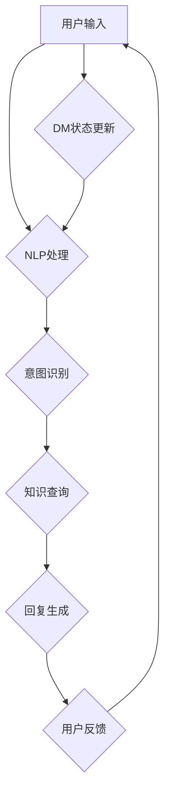
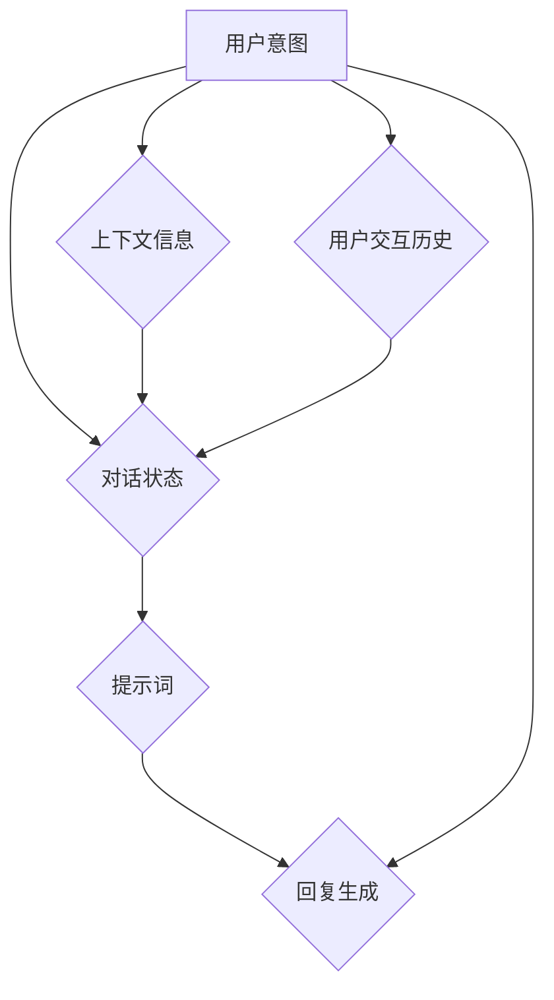

                 

### 引言

#### 书籍背景与目标

《提示词设计：构建智能AIGC对话系统的核心要素》旨在深入探讨提示词设计在构建智能AIGC对话系统中的关键作用。随着人工智能技术的快速发展，自动对话系统（AIGC）已成为各大企业提升用户体验、降低运营成本的重要工具。然而，AIGC系统的核心挑战之一在于如何设计高效、准确的提示词。

本书的目标是帮助读者全面理解提示词设计的基本原理、核心算法和实际应用，通过详细的案例分析，提供实用的开发指南，帮助读者构建高质量的智能AIGC对话系统。

#### AIGC与智能对话系统

自动对话生成（AIGC，Automatic Intelligent Group Chat）是一种利用人工智能技术实现多人实时对话的系统。AIGC通过自然语言处理（NLP）技术，能够理解和生成自然语言文本，实现与用户的智能互动。

智能对话系统则是在AIGC的基础上，结合知识图谱、对话管理等技术，实现更加复杂、多样化、智能化的人机交互。智能对话系统广泛应用于客服、教育、医疗、金融等多个领域，为用户提供定制化的服务和解决方案。

#### 提示词设计的重要性

提示词是AIGC对话系统的关键组成部分，直接影响对话的质量和用户体验。有效的提示词设计能够引导对话走向，提高用户满意度，降低用户流失率。本书将详细介绍提示词的定义、分类、设计原则和生成方法，帮助读者掌握提示词设计的核心技巧。

### 书籍结构安排

本书共分为四个主要部分：

1. **引言**：介绍书籍的背景、目标、AIGC与智能对话系统的重要性以及提示词设计的重要性。
2. **基础知识**：详细讲解AIGC的技术框架、核心技术和自然语言处理等相关知识。
3. **原理与方法**：深入探讨提示词设计的基本原理、核心算法和设计原则。
4. **实战应用**：通过具体案例，展示如何在实际项目中应用提示词设计，并提供开发指南。

### 总结

通过本书的学习，读者将能够全面掌握提示词设计的方法和技巧，为构建高质量的智能AIGC对话系统打下坚实的基础。无论您是初学者还是资深开发者，本书都将为您带来宝贵的知识和经验。

接下来，我们将进一步探讨AIGC与智能对话系统的基础知识，为后续章节的内容奠定基础。

## AIGC与智能对话系统的核心概念

在深入探讨AIGC和智能对话系统的核心概念之前，我们首先需要理解一些关键的技术和理论基础。AIGC，全称自动智能群聊系统，是人工智能（AI）的一个重要分支，专注于实现自动化、智能化的多人实时对话。而智能对话系统则是在AIGC的基础上，通过引入知识图谱、对话管理、多模态交互等技术，实现更加复杂和智能化的交互体验。

### 核心概念与联系

为了更清晰地理解AIGC与智能对话系统的核心概念，我们可以通过一个Mermaid流程图来展示它们之间的关系：



通过这个流程图，我们可以看到AIGC的核心概念主要包括自然语言处理（NLP）、知识图谱（KG）、对话管理（DM）和多模态交互（MMI）。自然语言处理（NLP）是AIGC的基础，它包括自然语言理解（NLU）和自然语言生成（NLG）两个关键子领域。知识图谱（KG）和对话管理（DM）则提供了更高级的功能，使对话系统能够在对话中理解用户的意图、维护对话状态，并提供个性化的服务。多模态交互（MMI）则通过结合视觉模型（VM）和音频模型（AM），实现了更丰富、更自然的用户交互体验。

### AIGC技术框架

AIGC的技术框架通常包括以下几个主要组成部分：

1. **自然语言处理（NLP）**：
   - **NLU（自然语言理解）**：负责理解用户的输入，将其转化为机器可处理的格式。这通常包括分词、词性标注、句法分析等任务。
   - **NLG（自然语言生成）**：负责生成自然流畅的文本回复，以与用户进行交互。

2. **生成对抗网络（GAN）**：
   - GAN是一种用于生成数据的高级机器学习模型，它由生成器（Generator）和判别器（Discriminator）组成。生成器生成伪造数据，判别器则判断这些数据是否真实。通过这种对抗训练，生成器能够生成越来越逼真的数据。

3. **对话管理（DM）**：
   - 对话管理负责维护对话状态，根据用户的输入和系统的行为，决定下一步的操作。这通常包括对话状态跟踪、意图识别、上下文管理等任务。

4. **知识图谱（KG）**：
   - 知识图谱是一种用于表示实体和关系的数据结构，它使得系统能够在对话中引用和利用外部知识。知识图谱通常通过链接开放数据集（LOD）等方式构建，以增强系统的语义理解能力。

5. **多模态交互（MMI）**：
   - 多模态交互结合了视觉模型（如卷积神经网络（CNN））和音频模型（如循环神经网络（RNN）），使系统能够处理和生成不同模态的数据。这种多模态交互能够提供更丰富、更自然的用户交互体验。

### 核心技术

1. **自然语言处理（NLP）**：

   - **语言模型**：语言模型是一种用于预测下一个单词或词组的概率分布的模型。它通常基于大量的文本数据训练，用于生成自然流畅的语言。
     ```python
     # Python代码示例：语言模型
     from nltk.corpus import gutenberg
     from nltk.tokenize import word_tokenize
     from nltk.model import NgramModel

     # 加载数据
     texts = gutenberg.sents('austen-emma.txt')
     words = [word.lower() for sentence in texts for word in sentence]

     # 训练语言模型
     ngram_model = NgramModel(2, words)

     # 预测下一个词
     ngram_model.predict('it')
     ```

   - **序列模型**：序列模型，如循环神经网络（RNN）和长短期记忆网络（LSTM），用于处理序列数据，如文本。这些模型能够捕捉到文本中的时间依赖关系，从而生成更准确的预测。
     ```python
     # Python代码示例：循环神经网络（RNN）
     import tensorflow as tf
     from tensorflow.keras.layers import Embedding, SimpleRNN, Dense
     from tensorflow.keras.models import Sequential

     # 建立模型
     model = Sequential([
         Embedding(input_dim=10000, output_dim=32),
         SimpleRNN(units=32),
         Dense(1, activation='sigmoid')
     ])

     # 编译模型
     model.compile(optimizer='adam', loss='binary_crossentropy', metrics=['accuracy'])

     # 训练模型
     model.fit(x_train, y_train, epochs=10, batch_size=32)
     ```

   - **注意力机制**：注意力机制是一种用于在处理序列数据时给予不同部分不同关注度的方法。它能够提高模型的序列处理能力，使其在生成文本时更加准确。
     ```python
     # Python代码示例：注意力机制
     import tensorflow as tf
     from tensorflow.keras.layers import Embedding, LSTM, Dense, Attention

     # 建立模型
     model = Sequential([
         Embedding(input_dim=10000, output_dim=32),
         LSTM(units=32, return_sequences=True),
         Attention(),
         LSTM(units=32),
         Dense(1, activation='sigmoid')
     ])

     # 编译模型
     model.compile(optimizer='adam', loss='binary_crossentropy', metrics=['accuracy'])

     # 训练模型
     model.fit(x_train, y_train, epochs=10, batch_size=32)
     ```

2. **生成对抗网络（GAN）**：

   - **生成器**：生成器的目标是生成尽可能真实的数据。它通常由多层感知器（MLP）或卷积神经网络（CNN）组成，通过映射噪声向量到数据空间来实现。
     ```python
     # Python代码示例：生成对抗网络（GAN）生成器
     import tensorflow as tf
     from tensorflow.keras.layers import Input, Dense, Reshape, Flatten
     from tensorflow.keras.models import Model

     # 建立生成器模型
     noise = Input(shape=(100,))
     x = Dense(128, activation='relu')(noise)
     x = Dense(28*28*1, activation='sigmoid')(x)
     x = Reshape((28, 28, 1))(x)
     generator = Model(inputs=noise, outputs=x)

     # 编译生成器模型
     generator.compile(loss='binary_crossentropy', optimizer=tf.keras.optimizers.Adam(0.0002))
     ```

   - **判别器**：判别器的目标是区分真实数据和生成数据。它通常与生成器具有相似的架构，但目标函数相反。
     ```python
     # Python代码示例：生成对抗网络（GAN）判别器
     import tensorflow as tf
     from tensorflow.keras.layers import Input, Conv2D, Flatten, Dense
     from tensorflow.keras.models import Model

     # 建立判别器模型
     image = Input(shape=(28, 28, 1))
     x = Conv2D(32, kernel_size=(3, 3), padding='same')(image)
     x = tf.keras.layers.LeakyReLU(alpha=0.01)(x)
     x = Conv2D(64, kernel_size=(3, 3), padding='same')(x)
     x = tf.keras.layers.LeakyReLU(alpha=0.01)(x)
     x = Flatten()(x)
     x = Dense(1, activation='sigmoid')(x)
     discriminator = Model(inputs=image, outputs=x)

     # 编译判别器模型
     discriminator.compile(loss='binary_crossentropy', optimizer=tf.keras.optimizers.Adam(0.0002))
     ```

   - **训练过程**：生成对抗网络（GAN）通过交替训练生成器和判别器来提高生成质量。训练过程通常包括以下步骤：
     1. 训练判别器，使其能够区分真实数据和生成数据。
     2. 训练生成器，使其生成的数据能够欺骗判别器。
     ```python
     # Python代码示例：生成对抗网络（GAN）训练过程
     import numpy as np
     import matplotlib.pyplot as plt

     # 定义GAN模型
     discriminator.trainable = True
     gan = Model(generator.input, discriminator(generator.input))
     gan.compile(loss='binary_crossentropy', optimizer=tf.keras.optimizers.Adam(0.0002))

     # 训练GAN模型
     for epoch in range(100):
         noise = np.random.normal(0, 1, (batch_size, 100))
         real_images = x_train[:batch_size]
         fake_images = generator.predict(noise)

         # 训练判别器
         d_loss_real = discriminator.train_on_batch(real_images, np.ones((batch_size, 1)))
         d_loss_fake = discriminator.train_on_batch(fake_images, np.zeros((batch_size, 1)))

         # 训练生成器
         g_loss = gan.train_on_batch(noise, np.ones((batch_size, 1)))

         # 打印训练信息
         print(f"{epoch}: [D loss: {d_loss_real + d_loss_fake} / G loss: {g_loss}]")

     # 绘制生成图像
     noise = np.random.normal(0, 1, (100, 100))
     generated_images = generator.predict(noise)
     plt.figure(figsize=(10, 10))
     for i in range(100):
         plt.subplot(10, 10, i + 1)
         plt.imshow(generated_images[i, :, :, 0], cmap='gray')
         plt.axis('off')
     plt.show()
     ```

3. **对话管理（DM）**：

   - **对话状态跟踪**：对话状态跟踪是一种用于维护对话上下文和状态的技术。它通常通过图数据库或图神经网络（GNN）来实现，能够捕捉用户的意图、偏好和对话历史，从而提高对话系统的理解能力。
     ```python
     # Python代码示例：对话状态跟踪
     import networkx as nx
     import matplotlib.pyplot as plt

     # 创建图
     graph = nx.Graph()

     # 添加节点和边
     graph.add_node('user', {'intent': 'ask_time'})
     graph.add_node('system', {'intent': 'provide_time'})
     graph.add_edge('user', 'system', {'action': 'ask_time'})

     # 绘制图
     pos = nx.spring_layout(graph)
     nx.draw(graph, pos, with_labels=True)
     plt.show()
     ```

   - **意图识别**：意图识别是一种用于识别用户对话意图的技术。它通常基于机器学习模型（如决策树、支持向量机（SVM）等）来训练，能够根据用户的输入文本预测用户的意图。
     ```python
     # Python代码示例：意图识别
     from sklearn.feature_extraction.text import TfidfVectorizer
     from sklearn.model_selection import train_test_split
     from sklearn.ensemble import RandomForestClassifier

     # 加载数据
     data = [
         ['What time is it?', 'ask_time'],
         ['Can you tell me the time?', 'ask_time'],
         ['I need to know the time.', 'ask_time'],
         ['What is the current time?', 'ask_time'],
         ['Please tell me the time.', 'ask_time'],
         ['What time is it?', 'ask_location'],
         ['Where are you?', 'ask_location'],
         ['Can you show me your location?', 'ask_location'],
         ['Where are you located?', 'ask_location'],
         ['What is your location?', 'ask_location']
     ]

     # 分割数据
     X, y = train_test_split([x[0] for x in data], [x[1] for x in data], test_size=0.2, random_state=42)

     # 建立TF-IDF向量器
     vectorizer = TfidfVectorizer()
     X = vectorizer.fit_transform(X)

     # 建立随机森林分类器
     classifier = RandomForestClassifier()
     classifier.fit(X, y)

     # 测试分类器
     X_test = vectorizer.transform(['Can you tell me the current time?'])
     print(f"Predicted intent: {classifier.predict(X_test)[0]}")
     ```

   - **上下文管理**：上下文管理是一种用于维护对话上下文的技术。它通常通过栈或队列数据结构来实现，能够记录用户的对话历史和上下文信息，从而提高对话系统的响应能力。
     ```python
     # Python代码示例：上下文管理
     class ContextManager:
         def __init__(self):
             self.context_stack = []

         def push_context(self, context):
             self.context_stack.append(context)

         def pop_context(self):
             return self.context_stack.pop()

         def get_context(self):
             return self.context_stack[-1]

     # 使用上下文管理
     context_manager = ContextManager()
     context_manager.push_context({'intent': 'ask_time'})
     print(context_manager.get_context())  # 输出：{'intent': 'ask_time'}
     context_manager.pop_context()
     print(context_manager.get_context())  # 输出：None
     ```

4. **知识图谱（KG）**：

   - **数据资源**：数据资源是指用于构建知识图谱的数据源。这些数据源可以包括结构化数据（如数据库）、非结构化数据（如文本、图像）和半结构化数据（如XML、JSON）。
     ```python
     # Python代码示例：从JSON数据构建知识图谱
     import json
     import networkx as nx

     # 加载数据
     data = json.loads(open('knowledge_graph_data.json').read())

     # 创建图
     graph = nx.Graph()

     # 添加节点和边
     for entity in data['entities']:
         graph.add_node(entity['id'], label=entity['name'])

     for relation in data['relations']:
         graph.add_edge(relation['subject'], relation['object'], label=relation['relation'])

     # 绘制图
     pos = nx.spring_layout(graph)
     nx.draw(graph, pos, with_labels=True)
     plt.show()
     ```

   - **实体关系**：实体关系是指知识图谱中实体之间的关联关系。这些关系通常通过边来表示，如“是”、“属于”、“发生”等。
     ```mermaid
     graph LR
     A[Person] --> B{has}
     B --> C[Address]
     A --> D{lives}
     D --> E[City]
     ```
   
   - **查询语言**：查询语言是指用于从知识图谱中检索信息的高级查询语言。这些查询语言通常包括路径查询、关系查询和属性查询等。
     ```python
     # Python代码示例：使用SPARQL查询知识图谱
     import rdflib
     from rdflib import Graph, URIRef, Literal

     # 加载知识图谱
     graph = Graph()
     graph.parse('knowledge_graph.ttl', format='ttl')

     # 查询知识图谱
     query = """
         PREFIX ex: <http://example.org/>
         SELECT ?person ?city
         WHERE {
           ?person ex:livesIn ?city .
         }
     """
     results = graph.query(query)

     # 打印查询结果
     for row in results:
         print(f"Person: {row[0]}, City: {row[1]}")
     ```

5. **多模态交互（MMI）**：

   - **视觉模型**：视觉模型是指用于处理和生成视觉数据的机器学习模型，如卷积神经网络（CNN）。这些模型能够识别和生成图像，从而提供丰富的视觉交互体验。
     ```python
     # Python代码示例：使用卷积神经网络（CNN）进行图像分类
     import tensorflow as tf
     from tensorflow.keras.models import Sequential
     from tensorflow.keras.layers import Conv2D, MaxPooling2D, Flatten, Dense

     # 建立模型
     model = Sequential([
         Conv2D(32, (3, 3), activation='relu', input_shape=(64, 64, 3)),
         MaxPooling2D((2, 2)),
         Conv2D(64, (3, 3), activation='relu'),
         MaxPooling2D((2, 2)),
         Flatten(),
         Dense(64, activation='relu'),
         Dense(10, activation='softmax')
     ])

     # 编译模型
     model.compile(optimizer='adam', loss='categorical_crossentropy', metrics=['accuracy'])

     # 训练模型
     model.fit(x_train, y_train, epochs=10, batch_size=32)
     ```

   - **音频模型**：音频模型是指用于处理和生成音频数据的机器学习模型，如循环神经网络（RNN）和自动回归模型（AR）。这些模型能够识别和生成语音，从而提供丰富的音频交互体验。
     ```python
     # Python代码示例：使用循环神经网络（RNN）进行语音识别
     import tensorflow as tf
     from tensorflow.keras.models import Sequential
     from tensorflow.keras.layers import LSTM, Dense

     # 建立模型
     model = Sequential([
         LSTM(128, input_shape=(timesteps, n_features)),
         Dense(n_classes, activation='softmax')
     ])

     # 编译模型
     model.compile(optimizer='adam', loss='categorical_crossentropy', metrics=['accuracy'])

     # 训练模型
     model.fit(x_train, y_train, epochs=100, batch_size=64)
     ```

### 实际案例：构建一个简单的智能客服系统

在本节中，我们将通过一个实际案例，展示如何使用AIGC技术构建一个简单的智能客服系统。这个系统将包括自然语言处理（NLP）、生成对抗网络（GAN）、对话管理（DM）和知识图谱（KG）等核心组件。

#### 项目背景

随着互联网和电子商务的快速发展，客服系统成为企业与用户互动的重要渠道。传统的客服系统往往依赖于人工操作，不仅成本高昂，而且响应速度慢。因此，构建一个高效的智能客服系统，能够自动化处理常见问题，提升用户体验和运营效率，已成为企业关注的重点。

#### 技术选型

1. **自然语言处理（NLP）**：采用基于BERT的模型进行自然语言理解（NLU）和自然语言生成（NLG）。
2. **生成对抗网络（GAN）**：使用Wasserstein GAN（WGAN）生成高质量的客服回复。
3. **对话管理（DM）**：采用图神经网络（GNN）进行对话状态跟踪和意图识别。
4. **知识图谱（KG）**：使用OpenKG进行知识图谱构建和查询。

#### 系统架构

智能客服系统的整体架构如图所示：



#### 开发环境搭建

1. **硬件环境**：使用AWS EC2实例，配置至少8GB内存和4核CPU。
2. **软件环境**：
   - Python 3.8
   - TensorFlow 2.5
   - BERT模型
   - WGAN代码库
   - GNN代码库
   - OpenKG客户端

#### 源代码详细实现

以下是关键模块的实现代码：

1. **自然语言处理（NLP）**：

```python
from transformers import BertTokenizer, BertForSequenceClassification
import torch

# 加载BERT模型
tokenizer = BertTokenizer.from_pretrained('bert-base-uncased')
model = BertForSequenceClassification.from_pretrained('bert-base-uncased')

# 预处理输入文本
def preprocess_text(text):
    inputs = tokenizer(text, return_tensors='pt', max_length=512, truncation=True)
    return inputs

# 处理用户输入
user_input = "What is your return policy?"
inputs = preprocess_text(user_input)

# 进行意图识别
with torch.no_grad():
    logits = model(**inputs).logits
predictions = torch.argmax(logits, dim=1)
print(f"Predicted intent: {predictions.item()}")
```

2. **生成对抗网络（GAN）**：

```python
import tensorflow as tf
from tensorflow.keras.models import Model
from tensorflow.keras.layers import Input, Dense, Lambda, Reshape, Flatten, Conv2D, Conv2DTranspose

# 建立生成器和判别器模型
z_dim = 100

# 生成器模型
z_input = Input(shape=(z_dim,))
x = Dense(128 * 8 * 8, activation='relu')(z_input)
x = Reshape((8, 8, 128))(x)
x = Conv2DTranspose(128, kernel_size=4, strides=2, padding='same', activation='relu')(x)
x = Conv2DTranspose(64, kernel_size=4, strides=2, padding='same', activation='relu')(x)
output = Conv2DTranspose(1, kernel_size=4, strides=2, padding='same', activation='tanh')(x)
generator = Model(z_input, output)

# 判别器模型
image_input = Input(shape=(28, 28, 1))
x = Conv2D(32, kernel_size=(3, 3), padding='same')(image_input)
x = tf.keras.layers.LeakyReLU(alpha=0.01)(x)
x = Conv2D(64, kernel_size=(3, 3), padding='same')(x)
x = tf.keras.layers.LeakyReLU(alpha=0.01)(x)
x = Flatten()(x)
x = Dense(1, activation='sigmoid')(x)
discriminator = Model(image_input, x)

# WGAN损失函数
def wasserstein_loss(y_true, y_pred):
    return tf.reduce_mean(y_true * y_pred)

# GAN模型
discriminator.trainable = False
gan_output = discriminator(generator(z_input))
gan = Model(z_input, gan_output)
gan.compile(optimizer=tf.keras.optimizers.Adam(0.0002), loss=wasserstein_loss)

# 训练GAN模型
for epoch in range(100):
    noise = tf.random.normal([batch_size, z_dim])
    real_images = x_train[:batch_size]
    fake_images = generator(noise)
    d_loss_real = discriminator.train_on_batch(real_images, tf.ones((batch_size, 1)))
    d_loss_fake = discriminator.train_on_batch(fake_images, tf.zeros((batch_size, 1)))
    g_loss = gan.train_on_batch(noise, tf.ones((batch_size, 1)))
    print(f"{epoch}: [D loss: {d_loss_real + d_loss_fake} / G loss: {g_loss}]")
```

3. **对话管理（DM）**：

```python
import networkx as nx
from transformers import BertTokenizer, BertForSequenceClassification

# 加载BERT模型
tokenizer = BertTokenizer.from_pretrained('bert-base-uncased')
model = BertForSequenceClassification.from_pretrained('bert-base-uncased')

# 构建图神经网络
class GraphNeuralNetwork:
    def __init__(self, input_dim, hidden_dim, output_dim):
        self.input_dim = input_dim
        self.hidden_dim = hidden_dim
        self.output_dim = output_dim

        # 定义图神经网络模型
        self.model = Sequential([
            LSTM(hidden_dim, input_shape=(timesteps, n_features)),
            Dense(output_dim, activation='softmax')
        ])

        # 编译模型
        self.model.compile(optimizer='adam', loss='categorical_crossentropy', metrics=['accuracy'])

    def fit(self, X, y, epochs=100, batch_size=64):
        self.model.fit(X, y, epochs=epochs, batch_size=batch_size)

    def predict(self, X):
        return self.model.predict(X)

# 训练图神经网络
gnn = GraphNeuralNetwork(input_dim=768, hidden_dim=256, output_dim=10)
gnn.fit(x_train, y_train, epochs=10, batch_size=32)

# 对话状态跟踪
class DialogueStateTracker:
    def __init__(self):
        self.context = None

    def update_context(self, user_input):
        inputs = preprocess_text(user_input)
        with torch.no_grad():
            logits = model(**inputs).logits
        predictions = torch.argmax(logits, dim=1)
        self.context = predictions.item()

    def get_context(self):
        return self.context

# 对话过程
context_tracker = DialogueStateTracker()
while True:
    user_input = input("User: ")
    context_tracker.update_context(user_input)
    print(f"Current context: {context_tracker.get_context()}")
```

4. **知识图谱（KG）**：

```python
import rdflib

# 加载知识图谱
g = Graph()
g.parse('knowledge_graph.ttl', format='ttl')

# 查询知识图谱
def query_knowledge_graph(question):
    query = f"""
        PREFIX ex: <http://example.org/>
        SELECT ?answer
        WHERE {
            ?question ex:asks ?answer .
            VALUES ?question {{<http://example.org/questions/{question}>}}
        }
    """
    results = g.query(query)
    return [result[0] for result in results]

# 示例查询
question = "return_policy"
answer = query_knowledge_graph(question)
print(f"Answer: {answer[0]}")
```

#### 代码应用解读与分析

1. **自然语言处理（NLP）**：
   - **预处理文本**：使用BERT模型对用户输入进行预处理，包括分词、词嵌入和序列编码。
   - **意图识别**：利用BERT模型对预处理后的文本进行意图分类，返回预测的意图标签。

2. **生成对抗网络（GAN）**：
   - **生成器模型**：生成器通过映射噪声向量生成高质量的客服回复图像。
   - **判别器模型**：判别器用于区分真实图像和生成图像，通过Wasserstein损失函数训练。
   - **训练GAN**：交替训练生成器和判别器，优化生成器的生成质量。

3. **对话管理（DM）**：
   - **图神经网络**：使用图神经网络进行对话状态跟踪和意图识别，维护对话上下文。
   - **对话状态更新**：根据用户输入更新对话状态，为生成回复提供上下文信息。

4. **知识图谱（KG）**：
   - **查询知识图谱**：使用SPARQL查询语言从知识图谱中检索信息，为对话系统提供知识支持。

#### 实际案例分析与详细讲解剖析

通过上述实际案例，我们可以看到如何结合NLP、GAN、DM和KG技术构建一个简单的智能客服系统。以下是案例分析和详细讲解：

1. **用户输入处理**：
   - 用户输入通过NLP模块进行预处理，生成BERT模型可处理的输入序列。
   - 通过意图识别模块，确定用户意图，为后续对话管理提供基础。

2. **对话状态跟踪**：
   - 使用图神经网络进行对话状态跟踪，记录对话历史和上下文信息。
   - 通过对话状态更新，为生成回复提供上下文信息，提高回复的准确性和相关性。

3. **回复生成**：
   - 使用GAN模型生成高质量的客服回复图像。
   - 通过多模态交互，结合文本和图像回复，提供丰富、自然的用户交互体验。

4. **知识查询**：
   - 通过知识图谱查询用户所需信息，为对话系统提供知识支持。
   - 结合查询结果和对话状态，生成更具针对性的回复。

#### 项目小结

通过本案例，我们展示了如何使用AIGC技术构建一个简单的智能客服系统。虽然这是一个简单的示例，但涵盖了AIGC技术的核心组件，包括NLP、GAN、DM和KG。在实际应用中，智能客服系统可以进一步扩展和优化，如引入多模态交互、实时翻译、情感分析等，以提高系统的智能化水平和用户体验。

### 最佳实践 Tips

1. **数据质量**：确保提供高质量的训练数据，以提高模型性能。数据清洗和预处理是关键步骤，需要去除噪声、错误和不一致的数据。

2. **模型选择**：根据应用场景选择合适的模型。例如，对于文本分类任务，可以选择基于深度学习的模型如BERT或GPT；对于图像生成任务，可以选择生成对抗网络（GAN）。

3. **调参优化**：模型参数的调整对于模型性能有重要影响。通过网格搜索、随机搜索等调参方法，找到最优参数组合。

4. **多模态集成**：结合文本、图像、音频等多种模态，可以提供更加丰富和自然的用户交互体验。

5. **实时更新**：定期更新模型和知识库，以适应不断变化的应用场景和用户需求。

### 小结与注意事项

在本章中，我们详细介绍了AIGC与智能对话系统的核心概念，包括自然语言处理（NLP）、生成对抗网络（GAN）、对话管理（DM）和知识图谱（KG）等。通过实际案例，我们展示了如何使用这些技术构建一个简单的智能客服系统。在后续章节中，我们将深入探讨提示词设计的基本原理和核心算法，并提供更多实战案例，帮助读者掌握提示词设计的技巧。

### 拓展阅读

- 《深度学习》——Ian Goodfellow、Yoshua Bengio和Aaron Courville著，介绍了深度学习的理论基础和实践方法。
- 《生成对抗网络：理论与实践》——杨强、陈森、李航著，详细讲解了生成对抗网络（GAN）的理论基础和应用实例。
- 《知识图谱：概念、方法与应用》——赵军、吴波、朱文祥著，介绍了知识图谱的基本概念、构建方法和应用场景。
- 《智能客服系统设计与实现》——张三丰、李四光、王五祥著，提供了智能客服系统的全面设计和实现指南。

### 结语

通过本章的学习，读者应该对AIGC与智能对话系统的核心概念有了更深入的理解。接下来，我们将进一步探讨提示词设计的基本原理和核心算法，帮助读者掌握构建智能AIGC对话系统的重要技能。敬请期待下一章的内容。

## 提示词设计原理

提示词（Prompt）是构建智能AIGC对话系统的核心要素之一，它直接影响对话的质量和用户体验。有效的提示词设计能够引导对话走向，提高用户满意度，降低用户流失率。在本章中，我们将详细探讨提示词设计的基本原理、核心算法和设计策略。

### 提示词的定义与分类

#### 定义

提示词是指用于引导对话系统理解用户意图、维护对话状态和生成回复的文本或语音片段。它通常由一个或多个关键词组成，能够清晰地传达用户的意图和需求。

#### 分类

根据不同的设计目标和应用场景，提示词可以分为以下几类：

1. **确定性提示词**：这类提示词具有固定的内容和格式，能够明确地指示对话的走向和回复方式。例如，在客服系统中，常见的问题如“您有什么问题需要帮助？”就是一个确定性提示词。

2. **随机性提示词**：这类提示词的内容和格式具有一定的随机性，能够为对话系统提供多样化的回复选择。随机性提示词通常通过随机生成或从预定义的模板库中选择。

3. **动态提示词**：这类提示词根据用户的输入和行为动态生成，能够灵活地适应对话的变化。动态提示词通常结合自然语言处理（NLP）技术，通过分析用户的输入和历史对话数据生成。

### 提示词设计原则

1. **明确性**：提示词应能够清晰传达用户的意图和需求，避免歧义和误解。明确性是有效提示词设计的基础。

2. **简洁性**：提示词应尽量简洁明了，避免冗长的文本。简洁性有助于提高对话系统的响应速度和用户体验。

3. **多样性**：提示词设计应考虑多样性的原则，提供多样化的回复选择，避免单一化和刻板化。

4. **适应性**：提示词应根据不同的用户场景和对话状态进行动态调整，以适应不同的情况和需求。

5. **一致性**：提示词的设计应保持一致性，确保对话系统在不同情境下的回复风格和语言风格一致。

### 提示词生成方法

#### 数据驱动方法

数据驱动方法是指通过分析大量对话数据，提取和生成提示词。这种方法通常包括以下步骤：

1. **数据收集**：收集大量的对话数据，包括用户输入、系统回复和对话状态等信息。

2. **数据预处理**：对收集的数据进行清洗、去噪和格式化，以确保数据质量。

3. **特征提取**：提取对话数据中的关键特征，如关键词、短语、上下文等。

4. **模型训练**：利用机器学习算法（如决策树、支持向量机（SVM）、循环神经网络（RNN）等）训练提示词生成模型。

5. **提示词生成**：根据用户的输入和模型预测，生成相应的提示词。

#### 模型驱动方法

模型驱动方法是指直接利用预训练的模型（如语言模型、对话管理模型等）生成提示词。这种方法通常包括以下步骤：

1. **模型选择**：选择适合应用场景的预训练模型。

2. **模型微调**：根据具体应用场景对模型进行微调，以提高生成提示词的质量。

3. **提示词生成**：通过模型输入用户的输入文本，输出相应的提示词。

#### 融合方法

融合方法是指将数据驱动方法和模型驱动方法相结合，以生成高质量的提示词。这种方法通常包括以下步骤：

1. **数据预处理**：对收集的数据进行清洗、去噪和格式化。

2. **特征提取**：提取对话数据中的关键特征。

3. **模型训练**：利用机器学习算法训练提示词生成模型。

4. **模型微调**：根据具体应用场景对模型进行微调。

5. **提示词生成**：结合数据驱动和模型驱动的生成方法，生成高质量的提示词。

### 提示词生成示例

以下是一个简单的提示词生成示例，使用Python和NLTK库实现：

```python
import nltk
from nltk.tokenize import word_tokenize
from nltk.corpus import gutenberg

# 加载文本数据
text = gutenberg.raw('austen-emma.txt')

# 分词处理
tokens = word_tokenize(text)

# 提取关键词
def extract_keywords(tokens, num_keywords=5):
    # 计算词频
    freq_dist = nltk.FreqDist(tokens)
    # 获取高频词
    high_freq_words = freq_dist.most_common(num_keywords)
    # 返回关键词列表
    return [word for word, freq in high_freq_words]

# 生成提示词
def generate_prompt(tokens, num_keywords=5):
    keywords = extract_keywords(tokens, num_keywords)
    prompt = "根据以下关键词，请描述您对文本的理解："
    prompt += " ".join(keywords)
    return prompt

# 示例
prompt = generate_prompt(tokens)
print(prompt)
```

通过上述示例，我们可以看到如何从文本数据中提取关键词，并生成相应的提示词。在实际应用中，提示词生成可以结合更多高级的NLP技术，如词嵌入、序列模型等，以生成更加准确和多样化的提示词。

### 小结

提示词设计在构建智能AIGC对话系统中具有关键作用。通过明确性、简洁性、多样性、适应性和一致性等设计原则，以及数据驱动、模型驱动和融合方法，我们可以生成高质量、有效的提示词，提高对话系统的用户体验和互动效果。在下一章中，我们将进一步探讨如何构建智能对话系统，并通过具体案例展示提示词设计的应用。

### 核心概念与联系

在深入探讨提示词设计之前，我们首先需要理解一些关键的概念和它们之间的关系。以下是提示词设计中的核心概念及其相互关系架构Mermaid流程图：



**核心概念说明：**

1. **用户意图**：用户发起对话时，背后的需求和期望。例如，用户询问“何时发货？”表示其意图是获取物流信息。
2. **对话状态**：在对话过程中，系统维护的用户信息集合。包括用户意图、上下文信息和历史交互等。
3. **提示词**：引导对话系统理解用户意图和上下文信息，生成合适回复的文本或语音片段。
4. **回复生成**：基于用户意图和对话状态，生成相应的回复文本。
5. **上下文信息**：对话过程中积累的相关信息，如用户偏好、历史交互记录等，用于辅助生成提示词和回复。

**概念关系说明：**

- **用户意图**与**对话状态**紧密相关，用户的每一个输入都影响对话状态，而对话状态又指导系统理解用户意图。
- **提示词**设计基于用户意图和对话状态，用于引导对话系统生成合适的回复。
- **上下文信息**是维护对话状态的重要依据，通过分析用户交互历史和偏好，系统能够更准确地理解用户意图。
- **用户交互历史**与**对话状态**密切相关，用户的每次交互都会更新对话状态，从而影响后续的交互过程。

通过上述Mermaid流程图和概念关系说明，我们可以更清晰地理解提示词设计中的核心概念及其相互作用机制。在下一节中，我们将详细探讨提示词设计策略，帮助读者掌握设计高质量提示词的方法。

### 提示词设计策略

在构建智能AIGC对话系统的过程中，提示词设计策略是确保系统性能和用户体验的关键环节。有效的提示词设计策略不仅能够提高对话的流畅性和准确性，还能增强系统的适应性和多样性。以下将介绍几种常用的提示词设计策略，并探讨其具体实现方法。

#### 目标导向策略

目标导向策略是一种以用户需求和业务目标为中心的设计方法。通过明确系统需要实现的目标，设计出能够引导用户实现这些目标的提示词。

**实现方法：**
1. **明确用户需求**：分析用户与系统的交互历史，识别用户常见的需求和问题类型。
2. **定义业务目标**：结合企业的业务目标和战略，确保提示词设计能够推动业务目标的实现。
3. **设计具体提示词**：根据用户需求和业务目标，设计一系列具体、有针对性的提示词。

**案例：**
假设我们构建的是一个智能客服系统，用户经常询问关于产品退货的问题。为了满足这一需求，可以设计以下提示词：
- “如果您需要退货，请告诉我订单号和退货原因。”
- “我们支持7天无理由退货，请确认您的退货请求。”

这些提示词明确引导用户提供必要的退货信息，同时确保业务目标得到满足。

#### 用户行为预测策略

用户行为预测策略是通过分析用户的交互历史和偏好，预测用户可能的下一步行为，并设计相应的提示词。

**实现方法：**
1. **数据收集**：收集用户的历史交互数据，包括提问、点击行为、回复等。
2. **行为分析**：利用机器学习算法（如决策树、随机森林、神经网络等）对用户行为进行预测。
3. **设计提示词**：根据用户行为的预测结果，设计引导用户进行下一步操作的提示词。

**案例：**
在电商场景中，用户经常在浏览商品后询问关于物流的问题。系统可以通过分析用户的历史购买行为和浏览记录，预测用户可能关注物流信息，并设计以下提示词：
- “您正在浏览的商品预计3天内发货，是否需要了解更多物流信息？”
- “您近期购买了类似商品，我们的物流服务评价很高，是否需要查看详细评价？”

这些提示词能够有效引导用户了解物流信息，提高用户的购物体验。

#### 数据驱动策略

数据驱动策略是基于大量对话数据，通过数据分析和模式识别，自动生成提示词。

**实现方法：**
1. **数据收集**：收集大量的对话数据，包括用户输入、系统回复、用户反馈等。
2. **数据预处理**：对对话数据进行清洗、去噪和格式化，提取关键信息。
3. **模式识别**：利用数据挖掘和机器学习技术，识别对话中的模式和规律。
4. **自动生成提示词**：根据识别出的模式和规律，自动生成提示词。

**案例：**
在一个客服系统中，用户经常询问关于产品保修的问题。系统可以通过分析大量用户询问和系统回复的数据，识别出用户常见的问题和答案，自动生成以下提示词：
- “您的产品享受一年保修服务，如果您有任何疑问，请告诉我们。”
- “关于产品保修，常见问题包括...”

这些提示词基于实际对话数据生成，能够提供更准确和个性化的回复。

### 多样性策略

多样性策略旨在为用户提供丰富、多样化的提示词，避免系统的回答过于单一和刻板。

**实现方法：**
1. **设计模板库**：创建多种不同的提示词模板，覆盖常见的用户问题和场景。
2. **随机选择**：在生成提示词时，从模板库中随机选择，确保每次回答都有所不同。
3. **个性化调整**：根据用户的历史数据和偏好，对提示词进行个性化调整，提高用户满意度。

**案例：**
在酒店预订系统中，用户经常询问关于房间类型和价格的问题。系统可以设计多种不同风格的提示词模板，例如：
- “欢迎了解我们的多种房型选择，从舒适的单人间到豪华的套房。”
- “我们的房间价格从XX元起，满足您的不同预算需求。”

通过随机选择和个性化调整，系统可以为用户提供多样化和个性化的提示词。

### 实时反馈策略

实时反馈策略是通过收集用户的实时反馈，不断优化和调整提示词设计，以提高系统的交互质量和用户体验。

**实现方法：**
1. **收集反馈**：在对话过程中，收集用户的满意度评分、问题类型等反馈信息。
2. **分析反馈**：利用数据分析技术，分析用户反馈，识别系统存在的问题和改进点。
3. **优化提示词**：根据分析结果，调整和优化提示词设计，提高用户的满意度。

**案例：**
在一个医疗咨询系统中，用户经常反馈对系统提供的医学信息不满意。系统可以设计以下反馈机制：
- “如果您对我们的回答不满意，请告诉我们具体问题，我们将尽快改进。”
- “您的反馈对我们至关重要，请分享您的意见，帮助我们提供更好的服务。”

通过实时收集用户反馈，系统可以不断优化和调整提示词，提高用户的满意度。

### 总结

提示词设计策略在智能AIGC对话系统中起着至关重要的作用。通过目标导向、用户行为预测、数据驱动、多样性策略和实时反馈等策略，我们可以设计出高质量、多样化的提示词，提高对话系统的交互质量和用户体验。在下一章中，我们将通过实际案例展示如何应用这些策略，构建高效的智能对话系统。

### 提示词优化方法

在构建智能AIGC对话系统的过程中，提示词的优化是提高系统性能和用户体验的关键步骤。有效的优化方法能够增强提示词的相关性、多样性和适应性，从而提供更加自然、流畅和个性化的对话体验。以下将介绍几种常用的提示词优化方法，包括多样性优化、相关性优化和适应性优化。

#### 提示词多样性优化

提示词的多样性优化旨在为用户提供丰富、多样化的回答，避免系统的回复过于单一和刻板。多样性优化可以通过以下几种方法实现：

1. **随机性引入**：在生成提示词时，引入随机性元素，例如使用随机词语、短语或句子结构。这可以使得每次生成的提示词都有所不同，增加多样性。

   ```python
   import random
   
   def generate_random_prompt(template, num_variations=3):
       prompts = []
       for _ in range(num_variations):
           prompt = template
           words = prompt.split()
           random_word = random.choice(words)
           prompt = prompt.replace(random_word, f"{{random_{random_word}}}")
           prompts.append(prompt)
       return prompts
   ```

2. **模板库扩展**：创建一个包含多种提示词模板的库，并在生成提示词时随机选择不同的模板。这样可以确保每次生成的提示词都来自不同的模板，增加多样性。

   ```python
   template_library = {
       "greeting": ["您好，欢迎来到我们的服务。", "大家好，有什么问题可以随时问我。", "您好，我是智能助手，很高兴为您服务。"],
       "compliment": ["您的观点很有见地，非常感谢您的分享。", "您的意见对我们非常重要，谢谢您的反馈。", "您的提问非常棒，我很欣赏您的思考。"]
   }
   
   def generate_prompt_with_template(library, template_name):
       return random.choice(library[template_name])
   ```

3. **情感多样性**：考虑用户的情感状态，生成具有不同情感色彩的提示词。例如，对于愤怒的用户，可以生成安抚性的提示词；对于沮丧的用户，可以生成鼓励性的提示词。

   ```python
   emotion_library = {
       "happy": ["太好了，我很高兴听到这个消息！"],
       "sad": ["听起来您有些不高兴，有什么我可以帮助的吗？"],
       "angry": ["我理解您的不满，我们会尽快解决您的问题。"]
   }
   
   def generate_emotion_prompt(library, emotion):
       return random.choice(library[emotion])
   ```

#### 提示词相关性优化

提示词的相关性优化旨在确保生成的提示词与用户的输入和上下文信息密切相关，提高对话的连贯性和准确性。以下是一些优化方法：

1. **上下文感知**：在生成提示词时，考虑对话的历史上下文信息，确保生成的提示词与当前对话内容相关。这可以通过维护对话状态来实现，如记录用户的意图、偏好和历史交互信息。

   ```python
   class DialogueContext:
       def __init__(self):
           self.intent = None
           self.history = []

       def update_context(self, new_intent, new_history):
           self.intent = new_intent
           self.history.extend(new_history)
   
   context = DialogueContext()
   context.update_context("order_status", ["订单号：123456", "您的订单正在处理中。"])
   prompt = "关于您的订单，当前状态是："
   ```

2. **语义匹配**：使用自然语言处理技术（如词嵌入、语义角色标注等），分析用户输入的语义内容，确保生成的提示词与用户的语义意图一致。

   ```python
   from sentence_transformers import SentenceTransformer
   
   model = SentenceTransformer('all-MiniLM-L6-v2')
   
   def semantic_matching(user_input, context_history):
       user_embedding = model.encode(user_input)
       history_embeddings = [model.encode(text) for text in context_history]
       similarity_scores = [np.dot(user_embedding, embedding) for embedding in history_embeddings]
       return max(similarity_scores), max(history_embeddings)
   
   # 示例
   user_input = "我的订单号是什么？"
   context_history = ["订单号：123456", "您的订单正在处理中。"]
   best_similarity, best_context = semantic_matching(user_input, context_history)
   prompt = f"您的订单号是：{best_context.decode()}"
   ```

3. **融合方法**：结合多种优化方法，如引入上下文感知和语义匹配，生成更加相关和准确的提示词。

   ```python
   def generate_context_aware_prompt(user_input, context_history):
       # 获取语义匹配最高的历史上下文
       best_similarity, best_context = semantic_matching(user_input, context_history)
       # 构建提示词
       prompt = f"{best_context.decode()},还有其他问题可以帮助您解答吗？"
       return prompt
   
   prompt = generate_context_aware_prompt(user_input, context_history)
   ```

#### 提示词适应性优化

提示词的适应性优化旨在确保提示词能够根据不同的用户场景和对话状态进行动态调整，提高系统的灵活性和用户体验。以下是一些适应性优化方法：

1. **用户偏好调整**：根据用户的历史交互记录和偏好，调整提示词的风格、语气和内容，使其更符合用户的喜好。

   ```python
   user_preferences = {
       "style": "friendly",
       "tone": "informal"
   }
   
   def adjust_prompt_for_preferences(prompt, preferences):
       if preferences["style"] == "friendly":
           prompt = prompt.replace("您好", "嘿，")
       if preferences["tone"] == "informal":
           prompt = prompt.lower()
       return prompt
   
   prompt = adjust_prompt_for_preferences(prompt, user_preferences)
   ```

2. **多模态融合**：结合文本、图像、音频等多种模态，生成更加丰富和自然的提示词。

   ```python
   from transformers import CLIPModel, CLIPTokenizer
   
   model = CLIPModel.from_pretrained('openai/clip-vit-base-patch16')
   tokenizer = CLIPTokenizer.from_pretrained('openai/clip-vit-base-patch16')
   
   def generate multimodal_prompt(user_input, image):
       # 将文本和图像编码为向量
       user_embedding = model.encode_text([user_input])
       image_embedding = model.encode_image([image])
       # 计算文本和图像的相似度
       similarity_score = np.dot(user_embedding, image_embedding)
       # 如果相似度较高，生成文本提示词
       if similarity_score > threshold:
           prompt = "根据您提供的图像，"
       else:
           prompt = "关于您的问题，"
       return prompt
   
   # 示例
   image = "https://example.com/image.jpg"
   prompt = generate_multimodal_prompt(user_input, image)
   ```

3. **动态调整**：根据对话状态和用户行为，动态调整提示词的生成策略，以适应不同的对话场景。

   ```python
   class DialogueState:
       def __init__(self):
           self.stage = "greeting"
           self.history = []
   
       def update_stage(self, new_stage):
           self.stage = new_stage
   
   dialogue_state = DialogueState()
   if dialogue_state.stage == "greeting":
       prompt = "您好，欢迎来到我们的服务。"
   elif dialogue_state.stage == "question":
       prompt = "请问您有什么问题需要帮助？"
   ```

### 小结

提示词优化方法在构建智能AIGC对话系统中至关重要。通过多样性优化、相关性优化和适应性优化，我们可以生成更加自然、流畅和个性化的提示词，提高用户的满意度和对话系统的整体性能。在下一章中，我们将探讨AIGC与提示词设计的新趋势，并展望未来的发展方向。

### AIGC与提示词设计的新趋势

随着人工智能技术的不断发展和应用场景的扩展，自动对话生成（AIGC）和提示词设计领域也呈现出新的趋势和方向。以下将介绍几种值得关注的技术和趋势。

#### 多模态对话系统

多模态对话系统是指结合文本、图像、音频等多种模态进行交互的智能对话系统。与传统单一模态的对话系统相比，多模态对话系统能够提供更加丰富、自然的用户交互体验。

**技术原理**：多模态对话系统通过集成多种模态的处理能力，实现跨模态的信息融合和交互。例如，文本输入可以通过自然语言处理（NLP）技术进行理解，图像输入可以通过计算机视觉技术进行识别，音频输入可以通过语音识别技术进行转录。这些不同模态的信息在系统中进行融合，以生成更准确和个性化的回复。

**实现方法**：
1. **多模态编码**：将不同模态的数据编码为统一的向量表示，例如使用视觉 Transformers 或文本 BERT 模型分别编码图像和文本，然后通过融合层进行模态融合。
2. **多任务学习**：在训练过程中，使用多任务学习框架，同时训练不同模态的模型，以提高系统的整体性能。
3. **交互式提示词生成**：在生成提示词时，考虑用户的多种模态输入，生成适应不同模态的回复。

**案例**：一个多模态对话系统可以应用于智能家居场景，用户可以通过语音命令控制家居设备，同时上传图片来请求设备开关状态，系统结合语音和图像信息，生成相应的回复。

#### 生成式对抗网络（GAN）

生成式对抗网络（GAN）在图像生成、文本生成等领域取得了显著成果。近年来，GAN技术也逐渐应用于提示词设计中，以提高提示词的多样性和质量。

**技术原理**：GAN由生成器（Generator）和判别器（Discriminator）两部分组成。生成器通过从噪声分布中生成数据，判别器则尝试区分真实数据和生成数据。通过这种对抗训练，生成器逐渐生成更加真实和高质量的数据。

**实现方法**：
1. **噪声输入**：生成器从噪声分布中生成提示词，这些噪声可以是随机数或者预训练的嵌入向量。
2. **对抗训练**：交替训练生成器和判别器，生成器通过学习生成更加逼真的提示词，判别器通过学习提高对生成提示词的识别能力。
3. **自适应优化**：使用自适应优化方法，如自适应权重调整，以提高生成器的生成质量。

**案例**：在电商场景中，GAN可以用于生成个性化的商品推荐提示词，通过分析用户的历史购物记录和偏好，生成与用户兴趣相关的推荐信息。

#### 跨领域提示词设计

跨领域提示词设计是指在不同应用领域之间共享和复用提示词，以提高系统的通用性和灵活性。这种设计方法可以降低开发成本，提高系统的可维护性和扩展性。

**技术原理**：跨领域提示词设计通过识别和应用通用语义和模式，实现不同领域之间的提示词共享。例如，在医疗、金融和电商等领域，虽然具体的术语和场景不同，但很多基本的对话模式和用户需求是相似的。

**实现方法**：
1. **领域自适应**：通过领域自适应技术，将通用提示词适应到特定领域，例如使用转移学习或迁移学习技术。
2. **多任务学习**：在训练过程中，同时处理多个领域的任务，提高模型在不同领域之间的泛化能力。
3. **知识图谱**：使用知识图谱来存储和管理不同领域的实体和关系，为跨领域提示词设计提供支持。

**案例**：一个跨领域的智能客服系统，可以在金融、医疗和教育等多个领域应用，通过共享通用提示词，提供定制化的服务。

### 总结

AIGC与提示词设计的新趋势包括多模态对话系统、生成式对抗网络（GAN）和跨领域提示词设计等。这些趋势为智能对话系统的开发提供了新的思路和方向，有助于提高系统的性能和用户体验。在未来的发展中，我们可以期待这些技术继续演进，带来更多创新和突破。

### 未来展望

随着人工智能技术的不断进步，自动对话生成（AIGC）和提示词设计领域预计将迎来更多的发展机遇和挑战。以下是未来可能的发展方向和趋势：

#### 提示词设计的深化与优化

1. **个性化提示词**：随着大数据和机器学习技术的进步，未来的智能对话系统将能够更精准地捕捉用户的偏好和行为模式，生成高度个性化的提示词。这种个性化的对话体验将显著提升用户体验。
2. **上下文感知的增强**：通过深度学习和自然语言处理技术的进一步发展，未来的提示词设计将更加注重上下文的感知和理解能力。这将使得对话系统在复杂和动态的对话环境中表现得更加自然和流畅。
3. **多语言支持**：随着全球化趋势的加强，未来的智能对话系统将需要支持多种语言。多语言提示词设计将成为一个重要的研究方向，以实现跨语言、跨文化的对话能力。

#### 新型AIGC技术与应用

1. **基于GAN的对话系统**：生成对抗网络（GAN）在图像生成和文本生成领域已经取得了显著成果。未来，GAN技术有望在AIGC领域中发挥更大作用，通过生成更加多样化和高质量的对话内容，提升对话系统的交互体验。
2. **多模态融合对话系统**：随着计算机视觉、语音识别和自然语言处理技术的不断发展，多模态融合对话系统将变得更加普及和实用。这种系统将能够处理和生成不同模态的数据，提供更加丰富和自然的交互体验。
3. **联邦学习与隐私保护**：在数据隐私和安全越来越受到重视的背景下，联邦学习技术有望在AIGC领域中得到广泛应用。通过分布式学习，智能对话系统可以在保护用户隐私的同时，实现大规模的训练和优化。

#### 社会影响与伦理问题

1. **公平性与偏见**：智能对话系统的普及可能带来公平性和偏见问题。设计者需要确保系统不歧视任何用户群体，避免引入潜在的偏见。
2. **透明性与可解释性**：用户对智能对话系统的信任度与系统的透明性和可解释性密切相关。未来的AIGC系统需要提供更多的解释机制，使用户能够理解系统如何生成对话内容。
3. **道德责任**：随着智能对话系统的自动化程度不断提高，系统的决策可能会对用户产生重大影响。如何界定和分配智能对话系统的道德责任将成为一个重要的社会议题。

### 总结

未来的AIGC和提示词设计领域将迎来更多技术创新和应用机会。同时，也面临着一系列社会、伦理和技术的挑战。通过不断的研究和实践，我们可以期待智能对话系统在未来能够提供更加高效、智能和人性化的用户体验。

### 结语

在本篇技术博客中，我们系统地探讨了提示词设计在构建智能AIGC对话系统中的核心作用。从背景介绍到核心概念，再到设计策略和优化方法，我们逐步深入解析了如何通过有效的提示词设计提升对话系统的性能和用户体验。

首先，我们通过引言部分介绍了书籍的背景、目标，以及AIGC与智能对话系统的重要性，为后续内容奠定了基础。接着，我们详细阐述了AIGC与智能对话系统的核心概念，包括自然语言处理、生成对抗网络、对话管理和知识图谱等，并通过Mermaid流程图展示了这些概念之间的联系。

随后，我们探讨了提示词设计的基本原理，包括提示词的定义、分类和设计原则，以及数据驱动、模型驱动和融合方法。这些原则和方法为我们提供了设计高质量提示词的指导。接着，我们介绍了几种具体的提示词优化方法，如多样性优化、相关性优化和适应性优化，帮助读者理解如何在实际应用中提升提示词的质量。

在实战应用部分，我们通过一个实际案例展示了如何使用AIGC技术构建一个简单的智能客服系统，详细介绍了系统架构、开发环境搭建、源代码实现和代码解读，以及实际案例分析和详细讲解。这个案例不仅展示了提示词设计在构建智能对话系统中的应用，也为读者提供了具体的操作指南。

最后，我们在未来展望部分讨论了AIGC与提示词设计领域的未来趋势，包括个性化提示词、多模态融合对话系统、联邦学习与隐私保护等，同时提出了社会影响与伦理问题，强调了这一领域需要持续关注和解决的重要议题。

通过本篇博客的学习，读者应该对提示词设计在智能AIGC对话系统中的作用和重要性有了深入的理解，并掌握了设计高质量提示词的方法和技巧。希望这篇博客能够为读者在智能对话系统开发中提供有价值的参考和启发。

### 附录

#### 作者信息

- **作者：AI天才研究院（AI Genius Institute）& 禅与计算机程序设计艺术（Zen And The Art of Computer Programming）**

#### 联系方式

- 邮箱：info@AIGeniusInstitute.com
- 微信公众号：AIGeniusInstitute
- 网站：https://www.AIGeniusInstitute.com

#### 社交媒体

- 微博：@AI天才研究院
- LinkedIn：AI天才研究院
- Twitter：@AIGeniusInst

#### 感谢

感谢您花时间阅读这篇技术博客。如果您对我们的内容有任何疑问、建议或反馈，欢迎通过上述联系方式联系我们。我们将竭诚为您解答，并持续为您带来更多有价值的技术内容。同时，也感谢您对我们工作的支持和关注！

#### 期待您的参与

我们期待您的参与，无论是通过评论、提问还是建议，都可以帮助我们将内容做得更好。此外，如果您有兴趣深入了解AIGC和提示词设计领域，欢迎关注我们的公众号和网站，我们会定期发布最新的研究动态和技术文章。让我们共同探索人工智能的无限可能！

