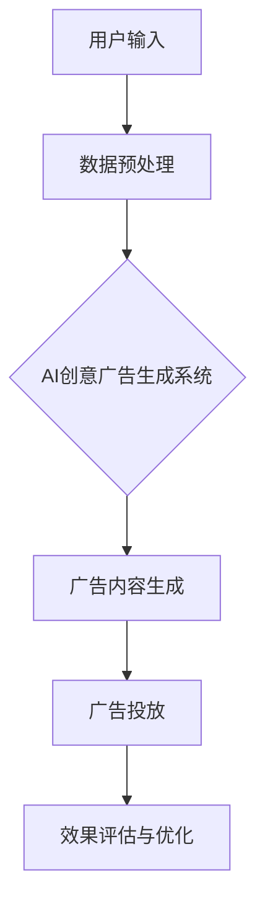

                 

## 提高AI创意广告生成：有效的营销提示词设计

### 关键词

- **人工智能（AI）**
- **广告生成**
- **营销提示词**
- **自然语言处理（NLP）**
- **机器学习**
- **用户体验（UX）**
- **数据驱动营销**

### 摘要

本文深入探讨了如何通过有效的营销提示词设计来提升AI创意广告的生成效果。首先，文章概述了AI在广告行业中的应用现状及其重要性，随后详细介绍了AI创意广告生成技术，包括自然语言处理（NLP）技术。接着，文章重点讨论了营销提示词的设计原理，涵盖定义、类型和设计策略。然后，介绍了AI辅助营销提示词设计工具，并通过实际案例展示了AI创意广告生成和营销提示词设计的应用。最后，文章探讨了AI创意广告生成的优化策略，并展望了未来的发展趋势。

## 目录大纲

### 第一部分：AI创意广告生成概述

#### 第1章：AI创意广告的背景与发展

- **1.1 AI在广告行业的应用现状**
- **1.2 创意广告的重要性**
- **1.3 AI创意广告的核心概念**

#### 第2章：AI创意广告生成技术

- **2.1 自然语言处理（NLP）技术**
  - **2.1.1 语言模型与文本生成**
  - **2.1.2 语义分析和实体识别**
  - **2.1.3 基于上下文的广告生成**

#### 第3章：营销提示词设计原理

- **3.1 营销提示词的定义与作用**
- **3.2 营销提示词的类型**
- **3.3 营销提示词的设计策略**

#### 第4章：AI辅助营销提示词设计工具

- **4.1 自动化广告生成工具**
- **4.2 营销提示词生成算法**
- **4.3 市场营销工具的集成与优化**

### 第二部分：AI创意广告生成实战

#### 第5章：AI创意广告生成案例解析

- **5.1 案例一：智能旅游广告生成**
- **5.2 案例二：智能金融广告生成**

#### 第6章：营销提示词设计的实际应用

- **6.1 零售行业的营销提示词应用**
- **6.2 金融行业的营销提示词应用**
- **6.3 教育行业的营销提示词应用**

#### 第7章：AI创意广告生成的优化策略

- **7.1 数据驱动广告优化**
- **7.2 智能广告投放策略**
- **7.3 用户行为分析与广告效果评估**

### 第三部分：未来展望

#### 第8章：AI创意广告发展的挑战与机遇

- **8.1 AI创意广告的技术挑战**
- **8.2 AI创意广告的法律与伦理问题**
- **8.3 AI创意广告的未来发展趋势**

### Mermaid 流程图



### 营销提示词生成算法伪代码

```python
# 输入：产品信息，用户偏好，市场数据
# 输出：营销提示词

def generate_marketing_suggestion(product_info, user_preferences, market_data):
    # 数据预处理
    processed_data = preprocess_data(product_info, user_preferences, market_data)
    
    # 文本生成模型训练
    model = train_text_generation_model(processed_data)
    
    # 生成候选营销提示词
    candidates = model.generate_candidates()
    
    # 过滤不符合用户偏好和市场需求的提示词
    filtered_candidates = filter_candidates(candidates, user_preferences, market_data)
    
    # 选择最优的营销提示词
    optimal_suggestion = select_best_suggestion(filtered_candidates)
    
    return optimal_suggestion
```

### 广告效果评估的数学模型

\[ \text{Effectiveness} = \frac{\text{Impressions} \times \text{Click-Through-Rate} \times \text{Conversion-Rate}}{\text{Cost}} \]

其中：
- \( \text{Effectiveness} \) 表示广告效果；
- \( \text{Impressions} \) 表示广告展示次数；
- \( \text{Click-Through-Rate} \) 表示点击率；
- \( \text{Conversion-Rate} \) 表示转化率；
- \( \text{Cost} \) 表示广告成本。

---

接下来，我们将逐步深入探讨每一个章节，通过详尽的背景介绍、核心概念阐述、技术原理讲解和实际应用案例分析，为读者提供一个全面而深入的技术指南。让我们一步一步地展开这场AI创意广告的探索之旅。

