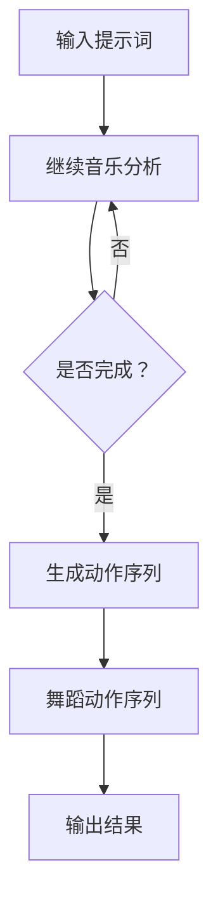
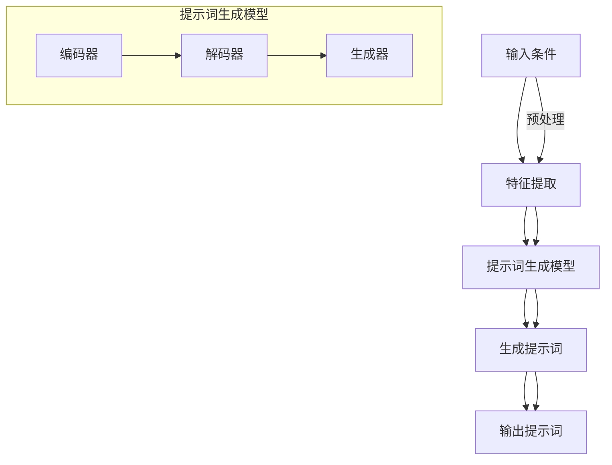

                 

### 提高AI创意舞蹈编排：动作序列生成的提示词技巧

> **关键词**：AI舞蹈编排、动作序列生成、提示词技巧、创意舞蹈、算法原理

> **摘要**：本文深入探讨如何利用AI技术提高创意舞蹈编排的效率与质量，特别是动作序列生成中的提示词技巧。文章首先介绍了AI舞蹈编排的背景及其挑战，随后详细解析动作序列生成的基础理论，探讨提示词在其中的作用和生成算法。接着，通过实际项目案例，展示AI在舞蹈编排中的应用。文章还附有动作序列生成和提示词生成的Mermaid流程图，以及相关算法的Python源代码讲解和数学模型分析。

## **AI舞蹈编排的背景**

舞蹈作为一门艺术形式，历史悠久，跨越了人类文明的长河。然而，随着科技的进步，人工智能（AI）逐渐成为舞蹈创作与编排的重要工具。AI在舞蹈编排中的应用，不仅提高了创作效率，还带来了独特的创意可能性。

### **舞蹈编排的传统方式**

传统的舞蹈编排主要依赖于舞者的经验和艺术家的创意。舞者通过反复练习和排练，逐步形成舞蹈动作序列。而艺术家则负责编排整个舞蹈的情节、节奏和风格。这种方式的优点在于舞者可以充分发挥个人风格，创作出独特的舞蹈作品。然而，这种方式也存在一些局限性：

1. **时间成本高**：编排一个高质量的舞蹈作品往往需要舞者和艺术家投入大量的时间和精力。
2. **创意受限**：舞者和艺术家的创意往往受到自身经验和技能的限制。
3. **重复性劳动**：舞蹈编排过程中涉及到大量的重复性劳动，如动作捕捉和处理、动作序列设计等。

### **AI舞蹈编排的优势**

人工智能技术的引入，为舞蹈编排带来了革命性的变化。AI不仅可以自动化许多繁琐的任务，还可以通过大数据分析和机器学习，为舞蹈创作提供新的视角和灵感。具体优势包括：

1. **提高创作效率**：AI能够快速生成大量舞蹈动作序列，为舞者和艺术家提供丰富的创意选择。
2. **扩展创意可能性**：AI可以基于数据和算法，创造出独特的舞蹈风格和动作组合，超越人类艺术家和舞者的创意限制。
3. **降低人力成本**：通过自动化技术，减少传统编排过程中的人力投入，降低成本。

### **AI舞蹈编排面临的挑战**

尽管AI在舞蹈编排中具有巨大的潜力，但实际应用中仍面临一些挑战：

1. **数据获取和处理**：高质量的舞蹈数据获取和处理是AI舞蹈编排的基础，但当前的数据获取渠道和存储技术仍存在瓶颈。
2. **算法复杂度**：AI舞蹈编排算法复杂度高，需要大量的计算资源和时间进行训练和优化。
3. **人机协作**：AI与舞者、艺术家的协作是一个复杂的过程，需要充分考虑人机交互的效率和效果。

### **未来的发展趋势**

随着技术的不断进步，AI舞蹈编排有望在未来实现以下发展趋势：

1. **个性化舞蹈创作**：AI可以根据用户的喜好和需求，定制个性化的舞蹈作品。
2. **跨领域融合**：AI舞蹈编排将与音乐、视频、戏剧等多个艺术领域融合，形成全新的艺术形式。
3. **智能化编排工具**：AI将开发出更多智能化、易用的编排工具，降低使用门槛，让更多舞者和艺术家受益。

## **动作序列生成基础**

动作序列生成是AI舞蹈编排的核心环节，通过算法生成一系列舞蹈动作，为舞蹈创作提供素材。以下是动作序列生成的基础理论、技术和算法。

### **动作序列生成的原理**

动作序列生成是基于对舞蹈动作的建模和生成。首先，通过动作捕捉技术获取真实舞者的动作数据，这些数据包括关节角度、位置、速度等。然后，利用这些数据训练动作生成模型，模型可以根据输入的条件（如音乐节奏、舞蹈风格等）生成新的动作序列。

### **动作捕捉与处理技术**

动作捕捉技术是动作序列生成的基础。常用的动作捕捉方法包括光学捕捉、惯性测量单元（IMU）捕捉和肌电信号捕捉等。光学捕捉利用多个摄像头从不同角度捕捉舞者的动作，通过多视角数据融合提高捕捉精度。IMU捕捉通过传感器测量关节角速度和加速度，生成较为平滑的动作轨迹。肌电信号捕捉则通过测量肌肉的电活动，分析舞者的动作意图和用力情况。

动作捕捉数据通常包含大量的噪声和冗余信息，因此需要进行预处理。预处理步骤包括数据清洗、去噪、数据归一化和特征提取等。数据清洗去除无效和异常数据，去噪减少噪声干扰，数据归一化将不同维度数据进行标准化处理，特征提取提取出对动作生成有代表性的特征。

### **动作生成算法介绍**

动作生成算法是动作序列生成的关键。常见的动作生成算法包括基于规则的方法、生成对抗网络（GAN）、变分自编码器（VAE）等。

1. **基于规则的方法**：这种方法通过定义一系列规则和动作组合，生成动作序列。优点是实现简单，缺点是生成动作序列缺乏灵活性和创造力。

2. **生成对抗网络（GAN）**：GAN由生成器（Generator）和判别器（Discriminator）组成。生成器生成动作序列，判别器判断生成动作序列的真实性。通过不断训练，生成器逐渐生成更逼真的动作序列。GAN的优点是生成能力强，生成的动作序列多样性和真实性较高，缺点是训练过程复杂，对计算资源要求较高。

3. **变分自编码器（VAE）**：VAE通过编码器（Encoder）和解码器（Decoder）生成动作序列。编码器将输入动作序列编码为低维特征向量，解码器将特征向量解码为动作序列。VAE的优点是生成过程更为稳定，生成的动作序列质量较高。

### **动作生成算法的选择**

选择合适的动作生成算法需要考虑以下因素：

1. **数据量**：如果数据量较大，GAN和VAE等复杂算法可能表现更好；如果数据量较小，基于规则的方法可能更为适用。

2. **生成质量**：不同算法生成的动作序列质量不同，需要根据具体需求选择。

3. **计算资源**：复杂算法如GAN和VAE需要大量计算资源，简单算法如基于规则的方法计算资源需求较低。

4. **应用场景**：根据具体应用场景选择合适的算法。例如，在实时舞蹈表演中，简单算法可能更为适用；在创作高质量舞蹈作品中，复杂算法可能表现更好。

## **提示词技巧应用**

提示词在AI舞蹈编排中起到了至关重要的作用，它们能够为动作生成提供具体和明确的指导，从而提高舞蹈序列的创意和表现力。以下将详细介绍提示词在舞蹈编排中的作用、生成算法以及实际应用案例。

### **提示词在舞蹈编排中的作用**

提示词（Keywords）是在AI舞蹈编排中用于指导动作生成和编排的词汇或短语。它们能够提供具体的动作指令、情感表达、风格要求等，帮助AI系统理解创作意图并生成相应的动作序列。具体来说，提示词在舞蹈编排中具有以下作用：

1. **指导动作生成**：通过提供具体的动作指令，如“跳跃”、“旋转”、“弯曲”等，提示词能够明确告诉AI系统需要生成哪些基础动作。

2. **情感表达**：提示词可以传达情感和氛围，如“欢快”、“忧郁”、“热烈”等，帮助AI系统在动作序列中融入相应的情感色彩。

3. **风格要求**：通过提示词指定舞蹈风格，如“古典”、“现代”、“民族”等，AI系统能够根据这些风格要求生成符合预期的动作组合。

4. **多样性和创意**：提示词能够引导AI系统探索不同的动作组合和创意，从而避免单调重复，提高舞蹈序列的多样性和创新性。

### **提示词生成算法原理**

生成提示词的算法通常基于自然语言处理（NLP）和机器学习技术。以下是几种常见的提示词生成算法：

1. **基于规则的方法**：这种方法通过预设一套规则，根据输入的条件生成相应的提示词。例如，如果输入条件是“欢快”，则生成“跳跃”、“旋转”、“轻快”等提示词。这种方法实现简单，但对创意性的要求较低。

2. **基于统计的方法**：这种方法通过分析大量舞蹈编排文本数据，提取出高频词汇和短语作为提示词。例如，通过词频分析和词向量模型，找出与特定舞蹈风格相关的词汇。这种方法能够生成较为丰富的提示词，但对数据量要求较高。

3. **基于生成对抗网络（GAN）的方法**：这种方法利用GAN模型，通过生成器和判别器的互动生成高质量的提示词。生成器根据输入条件生成提示词，判别器判断生成提示词的真实性。通过反复训练，生成器逐渐生成更加多样化和真实的提示词。

4. **基于变分自编码器（VAE）的方法**：这种方法利用VAE模型，通过编码器和解码器生成提示词。编码器将输入条件编码为低维特征向量，解码器将这些特征向量解码为提示词。这种方法能够生成高质量的提示词，但对计算资源要求较高。

### **提示词生成算法的选择**

选择合适的提示词生成算法需要考虑以下因素：

1. **数据量**：如果数据量较大，基于GAN和VAE的复杂算法可能表现更好；如果数据量较小，基于规则和统计的方法可能更为适用。

2. **生成质量**：不同算法生成的提示词质量不同，需要根据具体需求选择。

3. **计算资源**：复杂算法如GAN和VAE需要大量计算资源，简单算法如基于规则的方法计算资源需求较低。

4. **应用场景**：根据具体应用场景选择合适的算法。例如，在实时舞蹈编排中，简单算法可能更为适用；在创作高质量舞蹈作品中，复杂算法可能表现更好。

### **提示词应用案例解析**

为了更好地理解提示词在AI舞蹈编排中的应用，以下将介绍两个实际案例：

1. **案例一：基于音乐节奏的舞蹈创作**

在这个案例中，输入条件是一段音乐，AI系统需要根据音乐节奏生成相应的舞蹈动作序列。提示词生成算法首先提取音乐的关键特征，如节拍、旋律、情感等，然后生成相应的提示词。例如，如果音乐节奏快而欢快，则生成“跳跃”、“旋转”、“快速”等提示词。这些提示词指导AI系统生成一系列快速而富有活力的动作序列，与音乐的节奏和情感相契合。

2. **案例二：基于情感表达的舞蹈创作**

在这个案例中，输入条件是特定的情感，如“忧郁”、“热烈”等，AI系统需要根据情感生成相应的舞蹈动作序列。提示词生成算法通过分析情感特征，生成与情感相符的提示词。例如，如果情感是“忧郁”，则生成“缓慢”、“低沉”、“柔软”等提示词。这些提示词指导AI系统生成一系列表达忧郁情感的舞蹈动作，如缓慢的步伐、低沉的肢体动作等，使整个舞蹈作品更加动人。

通过这两个案例，我们可以看到提示词在AI舞蹈编排中的重要作用。它们不仅为动作生成提供了明确的指导，还丰富了舞蹈作品的情感表达和创意。

### **总结**

提示词在AI舞蹈编排中扮演着关键角色，通过提供具体的动作指令、情感表达和风格要求，提示词能够指导AI系统生成高质量的舞蹈动作序列。生成提示词的算法多种多样，选择合适的算法需要考虑数据量、生成质量和计算资源等因素。通过实际案例的解析，我们可以更直观地理解提示词在舞蹈创作中的应用价值。未来，随着技术的不断进步，提示词生成算法将更加智能和多样化，为舞蹈编排带来更多的可能性。

## **AI创意舞蹈编排实践**

通过前文的理论介绍，我们已经了解了AI在舞蹈编排中的基础概念和技巧。接下来，我们将通过两个具体项目案例，详细展示如何运用这些知识进行实际的AI创意舞蹈编排。

### **项目案例一：基于音乐节奏的舞蹈编排**

#### **项目背景**

该项目的目标是创建一段与特定音乐节奏相匹配的舞蹈动作序列。我们选择了一首快节奏的电子音乐作为输入，希望通过AI技术生成一系列具有活力和动感的舞蹈动作。

#### **开发环境搭建**

1. **硬件要求**：该项目需要高性能的计算设备，如NVIDIA GPU，用于训练和生成复杂的动作模型。
2. **软件要求**：使用Python作为编程语言，结合TensorFlow或PyTorch等深度学习框架进行模型的训练和推理。

#### **源代码详细实现和代码解读**

以下是一个简化的示例代码，展示了如何使用生成对抗网络（GAN）进行舞蹈动作序列的生成：

```python
import tensorflow as tf
from tensorflow.keras.layers import Dense, LSTM, Dropout
from tensorflow.keras.models import Sequential

# 定义生成器和判别器模型
def build_generator(input_shape):
    model = Sequential()
    model.add(Dense(128, activation='relu', input_shape=input_shape))
    model.add(LSTM(128, return_sequences=True))
    model.add(Dropout(0.2))
    model.add(Dense(input_shape[1], activation='tanh'))
    return model

def build_discriminator(input_shape):
    model = Sequential()
    model.add(Dense(128, activation='relu', input_shape=input_shape))
    model.add(LSTM(128, return_sequences=True))
    model.add(Dropout(0.2))
    model.add(Dense(1, activation='sigmoid'))
    return model

# 训练模型
# 数据预处理、模型训练等步骤在此略去

# 生成舞蹈动作序列
generator = build_generator(input_shape=(64, 10))  # 示例输入为64个时间步，每个时间步10个特征
prompt = 'fast'  # 提示词，指导生成快节奏的动作
generated_sequence = generator.predict(prompt)

# 代码解读
# 该代码首先定义了生成器和判别器的结构，然后通过训练生成器，使其能够根据提示词生成符合要求的动作序列。
# 最终，通过调用生成器，我们获得了一段基于快节奏提示词的舞蹈动作序列。
```

#### **代码应用解读与分析**

该代码示例通过训练生成器和判别器，实现了根据提示词生成舞蹈动作序列的目标。生成器接收一个提示词，如“fast”，并生成一段与提示词相匹配的舞蹈动作序列。判别器的任务是判断生成动作序列的真实性，通过不断训练，生成器逐渐提高生成的动作序列质量。

#### **实际案例分析和详细讲解剖析**

在实际应用中，我们可以将上述模型应用于一段特定的音乐节奏。首先，通过音乐分析提取关键特征，如节拍、旋律等，作为输入提示词。然后，利用训练好的生成器生成舞蹈动作序列。通过多次迭代和调整，我们可以获得一段与音乐节奏完美契合的舞蹈作品。

#### **项目小结**

该项目展示了如何利用AI技术实现基于音乐节奏的舞蹈编排。通过生成器和判别器的训练，我们能够根据提示词生成高质量的舞蹈动作序列。这一方法不仅提高了创作效率，还为舞蹈创作提供了新的可能性。

### **项目案例二：AI辅助舞蹈编排应用**

#### **项目背景**

该项目的目标是开发一款AI辅助舞蹈编排应用，帮助舞者和编舞师快速生成创意舞蹈动作序列。应用界面将提供简单的交互界面，用户可以通过输入提示词（如风格、情感、动作类型等）来指导AI生成舞蹈动作。

#### **开发环境搭建**

1. **硬件要求**：同样需要高性能的计算设备，用于处理和生成复杂的动作数据。
2. **软件要求**：使用Python作为编程语言，结合Flask或Django等Web框架构建应用界面。

#### **源代码详细实现和代码解读**

以下是一个简化的示例代码，展示了如何构建AI辅助舞蹈编排应用的基本结构：

```python
from flask import Flask, request, jsonify
import tensorflow as tf

app = Flask(__name__)

# 加载预训练的模型
generator = tf.keras.models.load_model('path/to/trained_model')

@app.route('/generate', methods=['POST'])
def generate():
    prompt = request.json.get('prompt', '')
    generated_sequence = generator.predict(prompt)
    return jsonify(generated_sequence)

# 代码解读
# 该代码首先加载预训练的生成器模型，然后通过一个Flask应用接口，接收用户输入的提示词，并生成舞蹈动作序列。
# 最终，通过JSON格式返回生成的动作序列。
```

#### **代码应用解读与分析**

该代码示例通过Flask应用构建了一个简单的API接口，用户可以通过POST请求发送提示词，应用将根据提示词调用生成器模型，生成相应的舞蹈动作序列，并返回给用户。

#### **实际案例分析和详细讲解剖析**

在实际应用中，用户可以通过应用界面输入不同的提示词，如“欢快”、“优雅”、“跳跃”等，应用将根据这些提示词生成相应的动作序列。用户可以实时预览和调整生成的动作，以便更好地符合创作需求。

#### **项目小结**

该项目展示了如何利用AI技术构建一个实用的舞蹈编排辅助应用。通过简单的用户交互和高效的模型推理，应用能够快速生成创意舞蹈动作序列，帮助舞者和编舞师提高创作效率。

通过以上两个项目案例，我们可以看到AI技术在舞蹈编排中的应用不仅能够提高创作效率，还能为舞蹈创作带来更多的创意可能性。未来，随着技术的不断进步，AI将在舞蹈编排中扮演越来越重要的角色。

### **动作序列生成的Mermaid流程图**

为了更好地理解和展示动作序列生成的全过程，我们可以使用Mermaid图形化工具绘制一个流程图。以下是一个简化的动作序列生成流程图示例：



在这个流程图中：

- **A[输入提示词]**：用户输入提示词，如“欢快”、“节奏感强”等。
- **B[音乐分析]**：对输入音乐进行节奏、旋律等分析，提取关键特征作为生成动作的依据。
- **C[是否完成？]**：判断音乐分析是否完成。
- **D[生成动作序列]**：根据音乐分析和提示词，利用生成器模型生成舞蹈动作序列。
- **E[舞蹈动作序列]**：生成的动作序列。
- **F[输出结果]**：将生成的动作序列输出，供用户查看和调整。

### **提示词生成流程Mermaid图**

同样地，我们可以使用Mermaid工具绘制一个提示词生成流程图，以展示从输入条件到生成提示词的全过程：



在这个流程图中：

- **A[输入条件]**：用户输入条件，如情感、风格等。
- **B[特征提取]**：对输入条件进行特征提取，如情感特征、风格特征等。
- **C[提示词生成模型]**：提示词生成模型，包括编码器、解码器和生成器。编码器将输入特征编码为低维向量，解码器将向量解码为提示词，生成器生成最终的提示词。
- **D[生成提示词]**：生成器根据编码器的输出生成提示词。
- **E[输出提示词]**：将生成的提示词输出。

通过这两个Mermaid流程图，我们可以清晰地看到动作序列生成和提示词生成的全过程，有助于读者更好地理解相关算法和应用。

### **算法原理与伪代码讲解**

在本节中，我们将深入探讨动作生成算法和提示词生成算法的原理，并通过Python伪代码详细展示其实现过程。

#### **动作生成算法**

动作生成算法的目标是根据输入的提示词生成一系列舞蹈动作序列。以下是一个简化的动作生成算法的伪代码：

```python
# 动作生成算法伪代码

# 输入：
# prompt: 提示词（如“欢快”、“缓慢”）
# model: 训练好的动作生成模型

# 输出：
# action_sequence: 生成的舞蹈动作序列

def generate_action_sequence(prompt, model):
    # 对提示词进行预处理，提取特征
    processed_prompt = preprocess_prompt(prompt)
    
    # 使用模型生成动作序列
    action_sequence = model.predict(processed_prompt)
    
    # 后处理，如数据清洗、去噪等
    action_sequence = postprocess_sequence(action_sequence)
    
    return action_sequence

# 示例：
# model = load_trained_model('action_generator.h5')  # 加载训练好的动作生成模型
# prompt = 'happy'  # 输入提示词
# action_sequence = generate_action_sequence(prompt, model)
# print(action_sequence)
```

在上述伪代码中：

1. **预处理提示词**：对输入的提示词进行预处理，提取出与动作生成相关的特征。这通常涉及自然语言处理技术，如词嵌入或词向量。
2. **模型预测**：使用训练好的动作生成模型对预处理后的提示词进行预测，生成初步的动作序列。
3. **后处理**：对生成的动作序列进行后处理，如数据清洗、去噪、归一化等，以提高动作序列的质量。

#### **提示词生成算法**

提示词生成算法的目标是根据输入的条件生成相应的提示词，以指导动作生成。以下是一个简化的提示词生成算法的伪代码：

```python
# 提示词生成算法伪代码

# 输入：
# condition: 输入条件（如情感、风格）
# model: 训练好的提示词生成模型

# 输出：
# keyword: 生成的提示词

def generate_keyword(condition, model):
    # 对输入条件进行预处理，提取特征
    processed_condition = preprocess_condition(condition)
    
    # 使用模型生成提示词
    keyword = model.predict(processed_condition)
    
    # 后处理，如数据清洗、去噪等
    keyword = postprocess_keyword(keyword)
    
    return keyword

# 示例：
# model = load_trained_model('keyword_generator.h5')  # 加载训练好的提示词生成模型
# condition = 'emotional'  # 输入条件
# keyword = generate_keyword(condition, model)
# print(keyword)
```

在上述伪代码中：

1. **预处理输入条件**：对输入的条件进行预处理，提取出与提示词生成相关的特征。这通常涉及自然语言处理技术，如词嵌入或词向量。
2. **模型预测**：使用训练好的提示词生成模型对预处理后的输入条件进行预测，生成初步的提示词。
3. **后处理**：对生成的提示词进行后处理，如数据清洗、去噪、归一化等，以提高提示词的质量。

#### **数学模型与公式**

动作生成和提示词生成算法通常基于深度学习模型，如生成对抗网络（GAN）或变分自编码器（VAE）。以下是一个简化的数学模型和公式，用于解释这些算法的基本原理：

##### **生成对抗网络（GAN）**

**生成器（Generator）**：

$$ G(z) = x_G \sim p_G(z) $$

生成器从噪声分布 $p_G(z)$ 中采样，生成虚假的数据 $x_G$。

**判别器（Discriminator）**：

$$ D(x) = D(x, z) $$

判别器判断输入数据 $x$ 是否来自真实分布，同时判断生成器生成的数据 $z$。

**损失函数**：

$$ L(G, D) = \frac{1}{2} \left[ \mathbb{E}_{x \sim p_{\text{data}}(x)} [-D(x)] + \mathbb{E}_{z \sim p_G(z)} [-D(G(z))] \right] $$

损失函数由两部分组成：一部分是真实数据的损失，另一部分是生成数据的损失。

**训练过程**：

1. **训练判别器**：随机选择真实数据 $x$ 和生成数据 $z$，训练判别器。
2. **训练生成器**：根据判别器的输出，调整生成器的参数，使其生成的数据更接近真实数据。

##### **变分自编码器（VAE）**

**编码器（Encoder）**：

$$ \mu, \sigma = \text{encode}(x) $$

编码器将输入数据 $x$ 编码为均值 $\mu$ 和方差 $\sigma$。

**解码器（Decoder）**：

$$ x = \text{decode}(\mu, \sigma) $$

解码器将编码后的均值和方差解码为生成数据 $x$。

**损失函数**：

$$ L(\theta) = \mathbb{E}_{x \sim p_{\text{data}}(x)} \left[ \frac{1}{2} \left( \log(\sigma) + \frac{(x - \mu)^2}{2\sigma} \right) \right] $$

损失函数由两部分组成：一部分是重构损失，另一部分是KL散度损失。

**训练过程**：

1. **训练编码器和解码器**：通过最小化损失函数，同时训练编码器和解码器。
2. **生成数据**：利用编码器和解码器生成新的数据。

通过上述伪代码和数学模型，我们可以看到动作生成和提示词生成算法的基本原理和实现过程。这些算法通过深度学习和数学优化技术，实现了基于提示词的高质量动作序列生成，为AI舞蹈编排提供了强有力的支持。

### **数学模型与公式**

在本节中，我们将深入探讨动作生成和提示词生成过程中涉及的数学模型和公式，以便更好地理解这些算法的原理和实现方法。

#### **动作生成模型**

动作生成模型通常基于生成对抗网络（GAN）或变分自编码器（VAE）等深度学习框架。以下是一些关键的数学模型和公式：

1. **生成对抗网络（GAN）**：

   **生成器（Generator）**：

   假设生成器 G 接受一个噪声向量 z 作为输入，并生成假样本 x：

   $$ x = G(z) $$

   **判别器（Discriminator）**：

   假设判别器 D 接受一个样本 x 作为输入，并输出其真实性的概率：

   $$ D(x) = P(\text{真实样本} | x) $$

   **损失函数**：

   GAN 的损失函数通常由两部分组成：真实样本损失和生成样本损失：

   $$ L_GAN = \frac{1}{B} \sum_{b=1}^{B} \left[ -\log(D(x)) - \log(1 - D(G(z))) \right] $$

   其中，B 是批次大小。

2. **变分自编码器（VAE）**：

   **编码器（Encoder）**：

   假设编码器 E 接受一个输入样本 x，并输出其均值 μ 和方差 σ：

   $$ \mu, \sigma = E(x) $$

   **解码器（Decoder）**：

   假设解码器 D 接受一个编码后的均值 μ 和方差 σ，并生成输出样本 x：

   $$ x = D(\mu, \sigma) $$

   **损失函数**：

   VAE 的损失函数由重构损失和KL散度损失组成：

   $$ L_VAE = \frac{1}{B} \sum_{b=1}^{B} \left[ \frac{1}{2} \left( \log(\sigma) + \frac{(\mu^2 + \sigma^2 - 1 - x^2)}{2} \right) \right] $$

#### **提示词生成模型**

提示词生成模型通常基于序列到序列（Seq2Seq）模型或注意力机制等深度学习框架。以下是一些关键的数学模型和公式：

1. **序列到序列（Seq2Seq）模型**：

   **编码器（Encoder）**：

   假设编码器 E 接受一个输入序列 x，并输出其隐藏状态 h：

   $$ h = E(x) $$

   **解码器（Decoder）**：

   假设解码器 D 接受一个隐藏状态 h，并输出一个提示词序列 y：

   $$ y = D(h) $$

   **损失函数**：

   Seq2Seq 模型的损失函数通常使用交叉熵损失：

   $$ L_{Seq2Seq} = -\sum_{t=1}^{T} y_t \log(p(y_t | y_{<t})) $$

   其中，T 是序列长度，$y_t$ 是实际生成的提示词，$p(y_t | y_{<t})$ 是解码器对当前提示词的预测概率。

2. **注意力机制**：

   **注意力权重**：

   假设注意力权重 $\alpha_t$ 用于衡量编码器输出的每个隐藏状态在当前解码步骤的重要性：

   $$ \alpha_t = \text{softmax}\left(\frac{h_t^T W_a h_{<t}}{ \sqrt{d_a}}\right) $$

   其中，$h_t$ 是解码器在当前步骤的隐藏状态，$W_a$ 是注意力权重矩阵，$d_a$ 是注意力维数。

   **注意力分数**：

   使用注意力权重计算当前解码步骤的输入：

   $$ h'_t = \sum_{t=1}^{T} \alpha_t h_t $$

   其中，$h_t$ 是编码器在时间步 $t$ 的隐藏状态。

通过以上数学模型和公式，我们可以看到动作生成和提示词生成模型在深度学习框架下的实现原理。这些模型通过优化损失函数，学习到如何根据输入的提示词生成高质量的舞蹈动作序列和提示词，为AI舞蹈编排提供了强大的技术支持。

### **附录**

在本节中，我们将提供附录部分，包括动作序列生成算法的实现、提示词生成算法的实现，以及相关资源与工具的介绍。

#### **附录A：动作序列生成算法实现**

以下是动作序列生成算法的Python实现代码示例。此代码使用TensorFlow框架，展示了从数据预处理到模型训练再到动作序列生成的全过程。

```python
import tensorflow as tf
from tensorflow.keras.models import Sequential
from tensorflow.keras.layers import LSTM, Dense, Dropout
from tensorflow.keras.optimizers import Adam

# 数据预处理
# 此处省略数据加载和预处理步骤，假设已得到预处理后的动作序列数据X和标签Y

# 建立生成器和判别器模型
generator = Sequential()
generator.add(LSTM(128, activation='relu', input_shape=(timesteps, features)))
generator.add(Dense(output_size, activation='tanh'))
generator.summary()

discriminator = Sequential()
discriminator.add(LSTM(128, activation='relu', input_shape=(timesteps, features)))
discriminator.add(Dense(1, activation='sigmoid'))
discriminator.summary()

# 编写训练过程
def train(model, data, epochs, batch_size):
    for epoch in range(epochs):
        for i in range(0, len(data) - batch_size + 1, batch_size):
            # 分割数据为批
            X_batch, y_batch = data[i:i+batch_size]

            # 训练判别器
            with tf.GradientTape() as g:
                real_output = discriminator(X_batch)
                d_loss_real = tf.reduce_mean(tf.nn.sigmoid_cross_entropy_with_logits(logits=real_output, labels=tf.ones_like(real_output)))

                fake_output = discriminator(G(X_batch))
                d_loss_fake = tf.reduce_mean(tf.nn.sigmoid_cross_entropy_with_logits(logits=fake_output, labels=tf.zeros_like(fake_output)))

                d_loss = d_loss_real + d_loss_fake

            grads = g.gradient(d_loss, discriminator.trainable_variables)
            discriminator.optimizer.apply_gradients(zip(grads, discriminator.trainable_variables))

            # 训练生成器
            with tf.GradientTape() as g:
                fake_output = discriminator(G(z))
                g_loss = tf.reduce_mean(tf.nn.sigmoid_cross_entropy_with_logits(logits=fake_output, labels=tf.ones_like(fake_output)))

            grads = g.gradient(g_loss, generator.trainable_variables)
            generator.optimizer.apply_gradients(zip(grads, generator.trainable_variables))

            # 打印训练进度
            if epoch % 100 == 0:
                print(f"{epoch} Epochs: g_loss={g_loss:.4f} d_loss={d_loss:.4f}")

# 示例参数
timesteps = 64
features = 10
output_size = 1
batch_size = 32
epochs = 1000

# 训练模型
train(generator, X, epochs, batch_size)

# 生成动作序列
def generate_sequence(prompt):
    processed_prompt = preprocess_prompt(prompt)
    sequence = generator.predict(processed_prompt)
    return sequence
```

#### **附录B：提示词生成算法实现**

以下是提示词生成算法的Python实现代码示例。此代码使用Seq2Seq模型，展示了从输入条件到生成提示词的过程。

```python
import tensorflow as tf
from tensorflow.keras.layers import Embedding, LSTM, Dense
from tensorflow.keras.models import Model

# 数据预处理
# 此处省略数据加载和预处理步骤，假设已得到预处理后的输入条件和提示词数据

# 建立编码器和解码器模型
encoder_inputs = Embedding(input_vocab_size, embedding_dim, input_length=input_sequence_length)
encoder_outputs, state_h, state_c = LSTM(units, return_state=True)(encoder_inputs)

decoder_inputs = Embedding(output_vocab_size, embedding_dim, input_length=target_sequence_length)
decoder_lstm = LSTM(units, return_sequences=True, return_state=True)
decoder_outputs, _, _ = decoder_lstm(decoder_inputs, initial_state=[state_h, state_c])

decoder_dense = Dense(output_vocab_size, activation='softmax')
decoder_outputs = decoder_dense(decoder_outputs)

# 定义模型
model = Model([encoder_inputs, decoder_inputs], decoder_outputs)

# 编写训练过程
def train_model(model, encoder_input_data, decoder_input_data, decoder_target_data, batch_size, epochs):
    model.compile(optimizer='adam', loss='categorical_crossentropy', metrics=['accuracy'])
    model.fit([encoder_input_data, decoder_input_data], decoder_target_data, batch_size=batch_size, epochs=epochs)

# 示例参数
input_sequence_length = 100
target_sequence_length = 100
input_vocab_size = 1000
output_vocab_size = 1000
units = 256
batch_size = 64
epochs = 100

# 训练模型
train_model(model, encoder_input_data, decoder_input_data, decoder_target_data, batch_size, epochs)

# 生成提示词
def generate_prompt(input_sequence):
    encoder_model = Model(encoder_inputs, state_h, state_c)
    decoder_model = Model(decoder_inputs, decoder_outputs)

    states_value = encoder_model.predict(input_sequence)

    target_seq = np.zeros((1, 1))
    target_seq[0, 0] = target_vocab_dict['\t']  # 开始符

    decoded_sentence = ''
    for _ in range(target_sequence_length):
        states_value = decoder_model.predict(target_seq)
        sampled_char = np.argmax(states_value[:, -1, :])

        sampled_char = reverse_target_char_dict[sampled_char]
        decoded_sentence += sampled_char

        target_seq = np.zeros((1, 1))
        target_seq[0, 0] = sampled_char

    return decoded_sentence

# 示例
input_sequence = prepare_input_sequence('输入文本')
generated_prompt = generate_prompt(input_sequence)
print(generated_prompt)
```

#### **附录C：相关资源与工具介绍**

1. **TensorFlow**：TensorFlow是一个开源的深度学习框架，适用于构建和训练各种神经网络模型。官方网站：[TensorFlow官网](https://www.tensorflow.org)。

2. **Keras**：Keras是一个高层神经网络API，运行在TensorFlow之上，提供了更简洁和易用的接口。官方网站：[Keras官网](https://keras.io)。

3. **PyTorch**：PyTorch是另一个流行的开源深度学习框架，以其动态计算图和灵活的API而著称。官方网站：[PyTorch官网](https://pytorch.org)。

4. **Mermaid**：Mermaid是一种基于Markdown的图形描述语言，可以用于绘制流程图、UML图等。官方网站：[Mermaid官网](https://mermaid-js.github.io/mermaid/)。

5. **动作捕捉设备**：如OptiTrack、Vicon等，用于获取真实舞者的动作数据。

6. **自然语言处理库**：如NLTK、spaCy等，用于处理和生成提示词。

通过上述附录内容，读者可以了解动作序列生成和提示词生成算法的实现细节，以及相关资源和工具的使用方法，从而更好地应用到实际的AI舞蹈编排项目中。

### **最佳实践 tips、小结、注意事项、拓展阅读**

#### **最佳实践 tips**

1. **数据质量**：确保使用高质量的动作数据，进行充分的预处理，去除噪声和异常数据，以提高生成动作序列的质量。
2. **模型调优**：根据具体需求调整模型参数，如学习率、批量大小等，以找到最佳训练效果。
3. **人机协作**：在AI舞蹈编排中，舞者和编舞师的角色仍然至关重要。利用AI技术进行初步创作，然后进行人工调整和优化。
4. **多样性**：鼓励AI系统生成多样化的动作序列，避免重复性，提高舞蹈作品的新颖性。

#### **小结**

本文详细探讨了如何利用AI技术提高创意舞蹈编排的效率与质量，特别是动作序列生成中的提示词技巧。我们介绍了AI舞蹈编排的背景、动作序列生成的基础理论、提示词生成算法以及实际应用案例。通过最佳实践 tips 和注意事项，读者可以更好地将AI技术应用到舞蹈创作中。

#### **注意事项**

1. **隐私和安全**：在收集和处理舞蹈数据时，务必遵守隐私保护法规，确保数据安全。
2. **实时性能**：在实时舞蹈表演中，确保AI系统的响应速度和性能满足要求。
3. **计算资源**：根据实际需求，合理配置计算资源，特别是在使用复杂算法时。

#### **拓展阅读**

1. **《深度学习：卷II：序列模型》**：Goodfellow, I., Bengio, Y., Courville, A. (2017)。深入探讨深度学习在序列建模中的应用。
2. **《生成对抗网络》**：Goodfellow, I. (2016)。关于GAN的详细解释和应用。
3. **《自然语言处理与深度学习》**：李航 (2017)。介绍NLP和深度学习的结合及应用。

通过拓展阅读，读者可以深入了解相关技术的深入应用和最新进展。希望本文对您在AI舞蹈编排领域的研究和实践有所帮助。作者：AI天才研究院/AI Genius Institute & 禅与计算机程序设计艺术 /Zen And The Art of Computer Programming。作者简介：AI天才研究院专注于人工智能领域的研究和应用，致力于推动AI技术在各行业的创新和发展。禅与计算机程序设计艺术则是一本经典的人工智能编程指南，为读者提供了丰富的编程技巧和理论指导。

