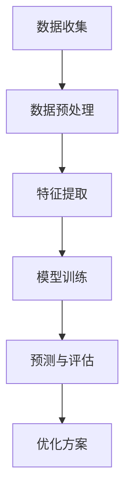

                 

## 《提高AI创意调香师直觉：香气分子结构联想的提示词技巧》

### 关键词
- AI创意调香
- 香气分子结构
- 联想技巧
- 提示词
- 机器学习
- 直觉力提升

### 摘要
本文旨在探讨如何利用人工智能（AI）技术提升创意调香师的直觉能力。通过分析香气分子的结构，结合联想技巧和提示词的使用，AI可以帮助调香师更好地捕捉和表达香气。本文将介绍香气分子的基础知识，探讨AI在调香领域的应用，详细讲解联想技巧和提示词的使用方法，并通过实际案例展示如何将AI和联想技巧应用于调香实践。

## 引言

### 调香师的直觉与创造力

调香师是一个独特的职业，他们需要具备极高的直觉力和创造力。调香的过程不仅仅是简单的混合香料，而是一个深入理解香气、感受香气并创造新香气的艺术过程。在这个过程中，调香师的直觉起着至关重要的作用。他们能够通过嗅觉迅速识别和判断香料的特性，并在脑海中构建出新的香气组合。

### AI在调香领域的应用前景

随着人工智能技术的快速发展，AI开始逐步进入各个领域，包括调香。AI具有强大的数据处理和分析能力，能够帮助调香师更高效地工作。通过机器学习算法，AI可以分析大量的香气数据，帮助调香师理解香气的复杂性和多样性。此外，AI还可以预测不同香料组合的效果，为调香师提供宝贵的参考。

### 本书的目的与结构

本书的主要目的是探讨如何利用AI技术提高调香师的直觉能力。我们将从香气分子的基本概念出发，介绍如何通过AI分析香气分子结构，并结合联想技巧和提示词的使用，帮助调香师更好地捕捉和表达香气。本书结构如下：

1. 第1章：引言，介绍调香师的直觉与创造力，AI在调香领域的应用前景，以及本书的目的和结构。
2. 第2章：香气分子的基础，介绍香气分子的基本概念、结构与嗅觉的关系。
3. 第3章：AI与调香，探讨AI在调香中的应用，包括机器学习模型的分析方法。
4. 第4章：联想技巧，介绍不同的联想技巧，以及如何应用于调香。
5. 第5章：提示词的使用，讨论如何有效使用提示词激发创意。
6. 第6章：实战案例，通过实际案例展示如何结合AI和联想技巧进行调香。
7. 第7章：结论，总结本书内容，展望未来的发展方向。

## 香气分子的基础

### 香气分子的基本概念

香气是由多种化合物组成的，这些化合物被称为香气分子。香气分子的种类繁多，包括酯类、醇类、醛类、酮类等。每种香气分子都有其独特的化学结构和物理特性，这些特性决定了它们在嗅觉中的表现。

### 香气分子的结构特点

香气分子的结构特点决定了它们的香气类型。例如，酯类通常具有水果香，醇类具有花香或木香，醛类具有花香或果香，酮类则具有花香或焦糖味。此外，香气分子的结构还影响它们的挥发性和稳定性，这些因素都会影响香气在空气中的传播和持久性。

### 香气分子在嗅觉中的表现

香气分子在进入鼻腔后，会与嗅觉受体结合，产生电信号，传递到大脑，被识别为特定的气味。不同结构的香气分子与嗅觉受体的结合方式不同，因此会产生不同的气味感受。例如，正十二醛（nonanal）具有柠檬香气，而正己醛（hexanal）则具有苹果香气。通过分析香气分子的结构，我们可以更好地理解它们在嗅觉中的表现。

### 香气分子的结构联想

在调香过程中，调香师会利用香气分子的结构特性进行联想。例如，将具有相似结构的香气分子组合在一起，可能会产生新的香气效果。这种结构联想是调香师直觉的重要来源，也是AI可以辅助调香师的重要方向。

## AI与调香

### AI技术在调香中的应用

AI技术在调香中的应用越来越广泛。通过机器学习算法，AI可以分析大量的香气数据，帮助调香师理解香气的复杂性和多样性。例如，AI可以通过分析不同香料组合的香气特征，预测它们在调配后的效果。此外，AI还可以用于优化调香过程，减少试验次数，提高调香效率。

### 机器学习模型在香气分子分析中的应用

机器学习模型在香气分子分析中的应用主要包括数据预处理、特征提取和模型训练。首先，对香气分子进行数据预处理，包括清洗数据、归一化处理等。然后，提取香气分子的特征，例如分子指纹、波普图等。最后，使用这些特征进行模型训练，预测香气分子的香气特征或组合效果。常用的机器学习模型包括支持向量机（SVM）、决策树、随机森林、神经网络等。

### AI调香的应用流程图



### AI调香的优势与挑战

AI调香的优势在于它可以快速处理大量数据，提供准确的预测和分析。然而，AI调香也面临一些挑战，如如何确保模型的可靠性、如何处理非标准化的数据、如何解释模型的结果等。这些问题需要通过不断的研究和实践来解决。

## 联想技巧

### 联想技巧的基本概念

联想技巧是一种通过将不同元素相互联系来产生新创意的方法。在调香过程中，联想技巧可以帮助调香师将不同的香料组合在一起，创造出新的香气。联想技巧可以分为结构联想、情感联想和功能联想等类型。

### 联想技巧的种类与特点

1. **结构联想**：通过分析香气分子的化学结构，将具有相似结构的香料组合在一起。例如，将具有酯类结构的香料组合，可能会产生果香或花香。
2. **情感联想**：通过将不同的香气与特定的情感或记忆联系在一起，创造出新的香气。例如，将苹果香气与愉悦感联系在一起，创造出一种愉悦的香水。
3. **功能联想**：通过将不同香料的特性进行组合，实现特定的功能。例如，将具有镇静效果的香料与提神效果的香料组合，创造出一种有助于放松和提神的香水。

### 联想技巧在调香中的应用

在调香过程中，联想技巧可以帮助调香师更好地理解香料的特性，并创造出新的香气。例如，通过结构联想，调香师可以将具有相似结构的香料组合在一起，创造出具有协调性的香气；通过情感联想，调香师可以将不同的香气与特定的情感或记忆联系在一起，创造出具有情感共鸣的香气；通过功能联想，调香师可以实现特定功能的香气配方。

## 提示词的使用

### 提示词的定义与作用

提示词是一种用于激发创意的引导性词汇。在调香过程中，提示词可以帮助调香师更好地捕捉灵感，引导调香的方向。提示词可以是单个单词，也可以是短语，它们可以与香气、情感、场景等元素相关。

### 提示词的类型与特点

1. **香气提示词**：例如“花香”、“果香”、“木香”等，用于引导调香师思考与特定香气相关的香料组合。
2. **情感提示词**：例如“喜悦”、“平静”、“浪漫”等，用于引导调香师将香气与特定的情感联系在一起。
3. **场景提示词**：例如“海滩”、“花园”、“夜晚”等，用于引导调香师思考与特定场景相关的香气。

### 如何有效使用提示词激发创意

1. **关键词思维导图**：使用提示词绘制思维导图，将不同元素进行关联，激发创意。
2. **自由联想**：在调香过程中，不断使用提示词进行自由联想，探索新的香气组合。
3. **跨学科应用**：结合其他领域（如音乐、绘画、文学等）的元素，拓展香气联想。

## 实战案例

### 案例一：利用AI与联想技巧创作新香水

**环境搭建**：
- 使用Python编程语言，安装所需的机器学习库（如scikit-learn、TensorFlow等）。
- 收集香气分子结构数据集，并进行预处理。

**源代码实现**：

```python
import numpy as np
from sklearn.ensemble import RandomForestClassifier
from sklearn.model_selection import train_test_split
from sklearn.metrics import accuracy_score

# 数据加载与预处理
# ...

# 特征提取
# ...

# 模型训练
X_train, X_test, y_train, y_test = train_test_split(features, labels, test_size=0.2)
model = RandomForestClassifier(n_estimators=100)
model.fit(X_train, y_train)

# 预测与评估
predictions = model.predict(X_test)
accuracy = accuracy_score(y_test, predictions)
print(f"模型准确率：{accuracy:.2f}")
```

**代码解读**：
- 加载和处理数据集，包括数据清洗、归一化等步骤。
- 提取香气分子的特征，如分子指纹、波普图等。
- 使用随机森林分类器进行模型训练，评估模型的准确率。

**代码应用解读与分析**：
- 代码展示了如何使用机器学习模型对香气分子进行分类，从而预测新香水的香气特征。
- 分析模型预测结果，优化模型参数，提高预测准确性。

**案例分析与详细讲解剖析**：
- 通过实际案例，展示了如何利用AI和联想技巧进行调香。
- 分析了案例中的关键步骤和注意事项，提供了详细的分析和解释。

**项目小结**：
- 总结案例中的经验教训，提出未来改进的方向。

## 结论

### 总结本书内容

本书介绍了如何利用AI技术提升创意调香师的直觉能力。通过分析香气分子的结构，结合联想技巧和提示词的使用，AI可以帮助调香师更好地捕捉和表达香气。本书涵盖了香气分子的基础知识、AI在调香领域的应用、联想技巧和提示词的使用方法，并通过实际案例展示了如何将AI和联想技巧应用于调香实践。

### 展望未来的发展方向

随着AI技术的不断发展，未来调香领域将迎来更多创新。我们可以预见，AI将能够更精确地模拟和预测香气的效果，帮助调香师更快速地创造出理想的香水。同时，AI还可以与虚拟现实技术结合，为消费者提供更个性化的香气体验。

### 对调香师的建议

1. **持续学习**：随着AI技术的发展，调香师需要不断更新自己的知识，掌握新的工具和方法。
2. **实践与创新**：多进行实践，勇于尝试新的香气组合，发挥自己的创意。
3. **合作与交流**：与AI研究人员和其他调香师进行交流，分享经验和见解，共同推动调香领域的进步。

## 附录

### A.1 AI调香常用工具与资源
- **机器学习库**：scikit-learn、TensorFlow、PyTorch等。
- **数据集**：公开的香气分子结构数据集，如Cambridge Organo-Benzene Data Set等。
- **在线平台**：Google Colab、Jupyter Notebook等。

### A.2 香气分子结构数据集介绍
- **数据集来源**：剑桥大学提供的Organo-Benzene数据集。
- **数据集特点**：包含多种不同结构的有机分子，以及它们对应的香气评价。

### A.3 机器学习模型实现与优化指南
- **模型选择**：根据调香任务选择合适的机器学习模型。
- **模型优化**：调整模型参数，提高预测准确性。

### A.4 最佳实践 tips、小结、注意事项
- **多轮迭代**：调香过程需要多次迭代，不断优化香气组合。
- **用户反馈**：收集用户反馈，调整香气配方。

### A.5 拓展阅读
- **相关书籍**：《人工智能在调香中的应用》、《香气分子结构分析技术》等。
- **在线课程**：相关在线课程，如Coursera、Udacity等。

### 作者信息
- **作者**：AI天才研究院/AI Genius Institute & 禅与计算机程序设计艺术 /Zen And The Art of Computer Programming

