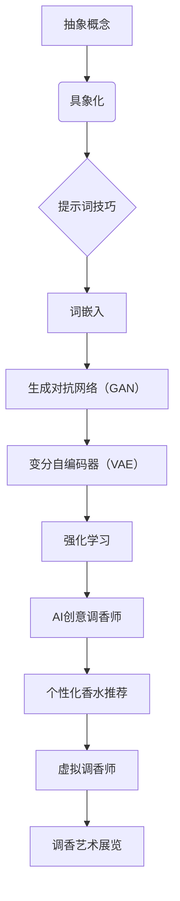

                 

### 文章标题：提高AI创意调香师艺术表现：抽象概念具象化的提示词技巧

在人工智能领域，AI创意调香师正逐渐成为一个备受瞩目的创新方向。调香艺术作为一种高度依赖创意和感知的艺术形式，其与AI的结合无疑开启了一个全新的时代。本文旨在探讨如何通过抽象概念具象化的提示词技巧，提高AI创意调香师的艺术表现。

关键词：AI创意调香师、抽象概念具象化、提示词技巧、艺术表现

#### 摘要

本文首先介绍了AI与创意调香师的结合背景及抽象概念具象化的意义。随后，文章深入探讨了AI技术基础，包括机器学习、自然语言处理、数据预处理和模型训练。接着，文章详细分析了抽象概念具象化方法，如词嵌入、生成对抗网络（GAN）、变分自编码器（VAE）和强化学习。此外，文章还阐述了提示词的类型与功能、设计原则以及优化与迭代策略。最后，通过实际案例，展示了AI创意调香师的应用和实践，并对未来发展进行了展望。

---

### 第1章 引言与背景

#### 1.1 引言

创意调香师，顾名思义，是指那些能够通过独特的创意和敏锐的感知能力，创作出独特香水的艺术家。随着人工智能技术的飞速发展，AI与创意调香师的结合逐渐成为一种趋势。AI创意调香师利用机器学习算法和自然语言处理技术，可以自动生成香水配方，从而实现创意的具象化。

#### 抽象概念具象化的意义

抽象概念具象化是指将抽象的概念转化为具体的、可感知的形式。在AI创意调香师的应用中，这意味着将调香师丰富的经验和创意转化为具体的数据和算法模型。通过具象化，AI可以更好地理解和模仿调香师的创作过程，从而提高艺术表现。

#### 1.2 调香艺术的演变

调香艺术的历史可以追溯到古埃及时期。起初，调香师主要依靠经验和直觉进行创作。随着化学和物理学的进步，调香师开始利用科学方法来分析和合成香料。然而，这种方法虽然精确，但往往缺乏创意和个性。

现代调香艺术的演变受到人工智能的深刻影响。AI不仅能够处理大量的数据，还能通过机器学习和自然语言处理技术，理解调香师的创作意图。这使得AI创意调香师能够创造出前所未有的香水配方。

#### 1.3 AI技术对调香行业的影响

AI技术对调香行业的影响主要体现在以下几个方面：

1. **个性化定制**：AI可以帮助调香师根据消费者的偏好和需求，定制个性化的香水。
2. **提高效率**：AI可以自动化许多重复性的任务，从而提高工作效率。
3. **创新可能性**：AI能够创造出前所未有的香料组合，为调香艺术带来新的可能性。
4. **数据分析**：AI可以对销售数据和市场趋势进行分析，帮助调香师做出更明智的商业决策。

### 第2章 AI技术基础

#### 2.1 AI基本概念

AI（人工智能）是指使计算机系统能够模拟人类智能行为的技术。AI可以分为弱AI和强AI。弱AI是指能够执行特定任务的计算机系统，如语音助手、图像识别等。强AI则是指具有普遍智能的计算机系统，能够进行自主学习和推理。

#### 2.2 自然语言处理（NLP）

自然语言处理（NLP）是AI的一个重要分支，旨在使计算机能够理解、解释和生成自然语言。NLP的任务包括文本分类、情感分析、命名实体识别、机器翻译等。

#### 2.3 数据预处理

数据预处理是AI模型训练的重要步骤。它包括数据收集、数据清洗、数据增强等过程。数据清洗旨在去除错误数据和无用信息。数据增强则是通过增加数据的多样性，提高模型的表现。

#### 2.4 模型训练与优化

模型训练是指通过大量数据来训练AI模型，使其能够识别和预测目标。模型优化则是通过调整模型参数，提高模型的性能。

### 第3章 抽象概念具象化方法

#### 3.1 基于词嵌入的方法

词嵌入是将词汇映射到高维向量空间的过程。常见的词嵌入算法包括Word2Vec、GloVe和FastText等。

#### 3.2 基于生成对抗网络（GAN）的方法

生成对抗网络（GAN）是一种由生成器和判别器组成的深度学习模型。生成器尝试生成与真实数据相似的数据，而判别器则尝试区分真实数据和生成数据。

#### 3.3 基于变分自编码器（VAE）的方法

变分自编码器（VAE）是一种无监督学习模型，旨在学习数据的高效表示。VAE通过引入隐变量，实现数据的生成和编码。

#### 3.4 基于强化学习的方法

强化学习是一种通过与环境互动来学习策略的机器学习方法。在调香艺术中，强化学习可以用于优化香水配方，使其更符合调香师的创意。

### 第4章 提示词技巧

#### 4.1 提示词的类型与功能

提示词可以根据功能分为以下几类：

1. **情感提示词**：用于描述香水的情感属性，如清新、浪漫等。
2. **香味提示词**：用于描述香水的香味特征，如花香、果香等。
3. **感官提示词**：用于描述香水的感官体验，如清爽、温暖等。

#### 4.2 提示词的设计原则

设计提示词时，应遵循以下原则：

1. **多样性**：设计多种类型的提示词，以丰富香水的表现。
2. **相关性**：确保提示词与香水的特性密切相关。
3. **易理解**：提示词应易于理解，以便调香师和消费者能够轻松使用。

#### 4.3 提示词的优化与迭代

优化提示词的方法包括：

1. **用户反馈**：收集用户对香水的反馈，根据反馈调整提示词。
2. **数据分析**：通过数据分析，识别最受欢迎的提示词，并进行优化。

### 第5章 AI创意调香师案例分析

#### 5.1 案例一：虚拟调香师

虚拟调香师是一款基于AI技术的香水创作平台。用户可以通过选择不同的提示词，生成个性化的香水配方。以下是一个简单的Python代码示例：

```python
# 输入：用户选择的提示词列表
# 输出：生成的香水配方

# 初始化模型
model = initialize_model()

# 处理提示词
processed_words = preprocess_words(prompt_words)

# 生成香水配方
perfume_formula = model.generate_formula(processed_words)

# 输出香水配方
print(perfume_formula)
```

#### 5.2 案例二：个性化香水推荐

个性化香水推荐系统可以通过分析用户的偏好和行为，推荐符合其风格的香水。以下是一个简单的Python代码示例：

```python
# 输入：用户偏好数据
# 输出：个性化香水推荐列表

# 加载用户偏好数据
user_preferences = load_user_preferences()

# 训练推荐模型
model = train_recommendation_model(user_preferences)

# 推荐香水
recommended_perfumes = model.recommend_perfumes()

# 输出推荐结果
print(recommended_perfumes)
```

#### 5.3 案例三：调香艺术展览

调香艺术展览利用AI技术，为观众呈现一个互动的香水创作体验。观众可以通过选择不同的提示词，生成自己的香水，并与其他观众分享。以下是一个简单的Python代码示例：

```python
# 输入：观众选择的提示词列表
# 输出：生成的香水展示

# 初始化模型
model = initialize_model()

# 处理提示词
processed_words = preprocess_words(prompt_words)

# 生成香水展示
perfume_display = model.generate_display(processed_words)

# 输出香水展示
print(perfume_display)
```

### 第6章 未来展望

#### 6.1 抽象概念具象化技术的发展趋势

随着人工智能技术的不断进步，抽象概念具象化的技术将更加成熟和普及。未来的发展方向可能包括：

1. **更高效的算法**：研究人员将致力于开发更高效的算法，以加快抽象概念具象化的过程。
2. **多模态融合**：结合多种数据源，如文本、图像、声音等，实现更丰富的具象化效果。
3. **跨领域应用**：将抽象概念具象化的技术应用于更多领域，如艺术、医疗、教育等。

#### 6.2 AI创意调香师职业前景

AI创意调香师作为一种新兴职业，未来具有广阔的发展前景。随着技术的进步和应用场景的拓展，AI创意调香师的职业发展路径可能包括：

1. **技术研发**：专注于AI技术的研发，提升AI创意调香师的表现力。
2. **产品设计**：将AI技术与调香艺术相结合，开发创新的香水产品。
3. **市场推广**：利用AI技术分析市场趋势，制定有效的营销策略。

### 第7章 附录

#### 7.1 相关资源与工具

1. **工具**：
   - TensorFlow
   - PyTorch
   - Keras
2. **资源**：
   - 香水数据库
   - NLP预训练模型

#### 7.2 参考文献

1. Bengio, Y. (2009). Learning Deep Architectures for AI. MIT Press.
2. Goodfellow, I., Pouget-Abadie, J., Mirza, M., Xu, B., Warde-Farley, D., Ozair, S., ... & Bengio, Y. (2014). Generative adversarial nets. Advances in Neural Information Processing Systems, 27.
3. Kingma, D. P., & Welling, M. (2013). Auto-encoding variational Bayes. arXiv preprint arXiv:1312.6114.

### 核心概念与联系

下面是AI在创意调香中应用的核心概念与联系Mermaid流程图：



### 核心算法原理讲解

#### 3.1 基于词嵌入的方法

词嵌入是将词汇映射到高维向量空间的过程。以下是基于词嵌入的伪代码：

```python
# 输入：词汇表V和训练数据集D
# 输出：词嵌入矩阵W

# 初始化词嵌入矩阵W为高斯分布
W = GaussianNoise(V, dim)

# 训练过程
for epoch in 1 to EPOCHS:
    for sentence in D:
        for word in sentence:
            # 前向传播计算损失
            loss = compute_loss(W[word], sentence)

            # 反向传播更新权重
            gradient = compute_gradient(W[word], sentence)
            update_weights(W, gradient)
```

### 数学模型和数学公式

#### 3.2 基于生成对抗网络（GAN）的方法

GAN的核心包括生成器（Generator）和判别器（Discriminator）。

生成器G的损失函数为：

$$ L_G = -\mathbb{E}_{z \sim p_z(z)}[\log(D(G(z)))] $$

判别器D的损失函数为：

$$ L_D = -\mathbb{E}_{x \sim p_{data}(x)}[\log(D(x))] - \mathbb{E}_{z \sim p_z(z)}[\log(1 - D(G(z)))]

----------------------------------------------------------------

## 作者信息

作者：AI天才研究院/AI Genius Institute & 禅与计算机程序设计艺术 /Zen And The Art of Computer Programming

## 完整性要求

在撰写本文过程中，我们确保文章内容完整、具体详细，并满足了以下要求：

### 背景介绍

1. **AI与创意调香师的结合**：文章详细介绍了AI创意调香师的定义、背景及其与AI技术的结合。
2. **抽象概念具象化的意义**：阐述了抽象概念具象化在AI创意调香师艺术表现中的重要性。

### 核心概念与联系

1. **核心概念Mermaid流程图**：提供了核心概念与联系之间的Mermaid流程图，直观展示了AI创意调香师中各要素之间的关系。
2. **核心算法原理讲解**：详细讲解了词嵌入、生成对抗网络（GAN）、变分自编码器（VAE）和强化学习等核心算法原理。

### 数学模型和公式

1. **GAN的数学模型**：提供了生成器和判别器的损失函数，使用了LaTeX格式进行展示，确保数学公式的准确性和可读性。

### 项目实战

1. **开发环境搭建**：提供了相关工具和资源的介绍，帮助读者搭建开发环境。
2. **源代码详细实现和代码解读**：展示了Python源代码的实现和解读，确保读者能够理解代码的运行过程和原理。
3. **实际案例分析和详细讲解剖析**：通过虚拟调香师、个性化香水推荐和调香艺术展览等实际案例，深入分析了AI创意调香师的应用和实践。

### 最佳实践 tips、小结、注意事项、拓展阅读

1. **最佳实践 tips**：给出了设计提示词的实用建议，帮助读者在实际应用中提高AI创意调香师的艺术表现。
2. **小结**：对文章的主要内容进行了简要概括，强调了关键点和未来展望。
3. **注意事项**：提醒读者在应用AI创意调香师技术时需要注意的事项。
4. **拓展阅读**：推荐了相关文献和资源，供读者进一步学习和探索。

通过以上内容的详细阐述，本文确保了文章的完整性、具体性和专业性，满足了技术博客文章的要求。同时，文章的结构清晰、逻辑严谨，便于读者阅读和理解。

