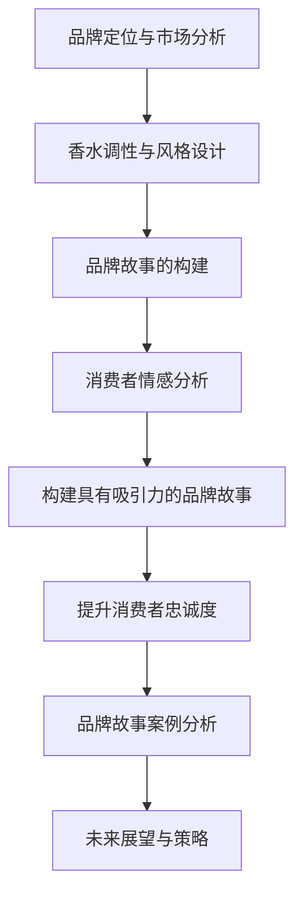

                 

### 提高AI创意香水品牌策划：品牌故事构建的提示词技巧

#### 关键词

- AI创意香水品牌策划
- 品牌故事构建
- 提示词技巧
- 情感分析
- 消费者行为
- 人工智能应用

#### 摘要

本文旨在探讨如何利用人工智能（AI）技术提升创意香水品牌的策划与营销效果，特别是品牌故事构建中的提示词技巧。随着AI技术的不断发展，其在香水行业的应用带来了前所未有的变革。文章将首先概述AI创意香水品牌策划的背景和意义，随后详细分析品牌故事构建的核心要素，包括基本结构和提示词的应用。通过AI分析消费者情感，本文将展示如何利用情感数据优化品牌故事的创作。此外，文章还将探讨如何通过品牌故事提升消费者忠诚度，并结合成功与失败案例进行深入分析。最后，本文将展望AI创意香水品牌策划的未来发展趋势，并提出相关策略和注意事项。

### 第一部分：AI创意香水品牌策划概述

#### 第1章：AI创意香水品牌策划的背景与意义

##### 1.1 AI技术发展对香水行业的变革

人工智能技术的飞速发展正在深刻地改变着各个行业，包括香水行业。AI在香水设计、生产和营销中发挥着越来越重要的作用。例如，通过机器学习和大数据分析，香水公司可以更准确地预测消费者偏好，从而设计出更受欢迎的香水配方。此外，AI还在香水的个性化定制和消费者互动方面展现出巨大的潜力。

###### 1.1.1 AI在香水设计中的应用案例

近年来，一些领先香水品牌已经开始采用AI技术进行香水设计。例如，法国香水品牌FRED使用AI算法分析消费者对香味的偏好，从而创造出个性化的香水配方。此外，AI还用于模拟和优化香水的配方，通过数百次实验，AI可以帮助香水设计师在更短的时间内找到理想的香味组合。

###### 1.1.2 香水行业面临的挑战与机遇

香水行业面临着一系列挑战，包括消费者需求的多样化、市场竞争的加剧以及环保和可持续发展的压力。AI技术的应用为香水行业提供了新的机遇，可以帮助企业更灵活地应对这些挑战。

- **挑战**：
  - **消费者需求多样化**：随着消费者对个性化和独特性的追求，香水品牌需要不断更新产品线，以满足不同消费者的需求。
  - **市场竞争加剧**：越来越多的品牌进入市场，竞争愈发激烈，品牌需要找到差异化的竞争优势。
  - **环保和可持续发展**：消费者对环保和可持续发展的关注日益增加，香水品牌需要采用环保材料和可持续的生产流程。

- **机遇**：
  - **个性化定制**：AI技术可以帮助品牌实现个性化的香水定制，满足消费者对独特香味的追求。
  - **数据驱动决策**：通过大数据分析，品牌可以更准确地了解消费者行为和市场趋势，从而做出更明智的商业决策。
  - **消费者互动**：AI技术可以增强品牌与消费者之间的互动，提高消费者忠诚度。

##### 1.2 AI创意香水品牌策划的流程

AI创意香水品牌策划是一个系统性的过程，涉及多个关键步骤。以下是该流程的基本组成部分：

###### 1.2.1 品牌定位与市场分析

品牌定位是品牌策划的第一步，明确品牌在市场中的位置和目标消费者。市场分析则帮助品牌了解市场趋势和竞争对手，从而制定有效的营销策略。

- **品牌定位**：确定品牌的独特卖点和目标市场，例如，高端香水市场或年轻化香水市场。
- **市场分析**：收集和分析市场数据，包括消费者行为、市场趋势和竞争对手的营销策略。

###### 1.2.2 香水调性与风格设计

香水调性与风格设计是品牌策划的核心。AI技术在这一步骤中发挥了重要作用，通过大数据分析和机器学习算法，设计师可以更快速地找到符合品牌定位的香水配方。

- **大数据分析**：分析大量消费者反馈和香味数据，找到受欢迎的香味特征。
- **机器学习算法**：使用机器学习算法优化香水配方，使其更符合消费者偏好。

###### 1.2.3 品牌故事的构建

品牌故事是品牌形象的重要组成部分，它能够传递品牌价值观和文化，吸引消费者的情感共鸣。通过AI技术，品牌故事可以更加个性化、有创意。

- **品牌故事构建**：确定品牌故事的主题、情感和目标受众，确保故事内容与品牌定位一致。
- **AI辅助创作**：利用自然语言处理和机器学习技术，生成具有吸引力的品牌故事。

##### 1.3 AI在香水品牌策划中的应用

AI技术在不同环节的香水品牌策划中发挥着关键作用，提高了效率、精确性和个性化程度。

###### 1.3.1 人工智能在消费者行为分析中的应用

通过AI技术，香水品牌可以更深入地了解消费者的购买行为、偏好和情感。这些数据有助于品牌制定更精准的营销策略。

- **消费者行为分析**：使用机器学习算法分析消费者购买历史和在线互动数据，识别消费者偏好。
- **个性化推荐**：基于消费者行为数据，AI系统可以推荐个性化的香水产品。

###### 1.3.2 基于大数据的市场趋势预测

AI技术可以帮助香水品牌预测市场趋势，为产品开发和营销策略提供科学依据。

- **市场趋势预测**：通过大数据分析，预测未来的市场趋势和消费者需求。
- **决策支持**：为品牌管理层提供基于数据的决策支持，优化产品线和营销策略。

###### 1.3.3 情感营销与消费者互动

情感营销是通过品牌故事和情感共鸣来吸引和保留消费者。AI技术在这一过程中可以帮助品牌更好地理解消费者情感，并制定相应的互动策略。

- **情感分析**：使用自然语言处理技术分析消费者评论和反馈，理解消费者情感。
- **互动优化**：基于消费者情感数据，优化品牌与消费者的互动方式，提高消费者满意度。

### 第二部分：品牌故事构建的提示词技巧

#### 第2章：品牌故事构建的核心要素

品牌故事是构建品牌形象和消费者情感连接的重要手段。一个成功的品牌故事需要具备引人入胜的基本结构，并巧妙地运用提示词来增强故事的吸引力和感染力。

##### 2.1 品牌故事的基本结构

品牌故事的基本结构通常包括引子、发展、高潮和结局。每个部分都承担着特定的叙事功能，共同构建一个完整的、有深度的品牌故事。

###### 2.1.1 引子：引人入胜的开端

引子是品牌故事的开端，目的是吸引读者的注意力，设置故事的背景，并引入主要角色。一个引人入胜的引子可以设置悬念，激发读者的好奇心。

- **设置背景**：介绍品牌的起源和历史，为故事奠定基础。
- **引入角色**：介绍品牌创始人或关键角色，使读者对他们产生兴趣。

###### 2.1.2 发展：核心冲突与解决

发展部分是故事的核心，描述主角面临的挑战和冲突，以及如何克服这些挑战。这一部分需要展现品牌的价值观和使命感，让读者感受到品牌的情感共鸣。

- **核心冲突**：设定故事的主要冲突，如品牌在面对市场挑战时的决策过程。
- **解决问题**：展示品牌如何通过创新和努力解决冲突，实现目标。

###### 2.1.3 结局：给消费者留下深刻印象

结局是品牌故事的终结，需要给读者留下深刻的印象，强化品牌形象。一个好的结局可以总结品牌故事的主题，并激励读者采取行动。

- **总结主题**：回顾品牌故事的主要事件和教训，强化品牌的核心价值观。
- **激励行动**：通过结局激励消费者购买产品或支持品牌。

##### 2.2 提示词在品牌故事中的应用

提示词是品牌故事中用来引导情感和叙事的关键词汇，它们能够增强故事的说服力和吸引力。提示词的选择和运用需要遵循一定的策略。

###### 2.2.1 提示词的定义与类型

提示词是一系列具有特定含义和情感色彩的词汇，用于引导读者的情感和认知。根据其在故事中的功能，提示词可以分为以下几种类型：

- **情感提示词**：用来唤起特定情感反应的词汇，如喜悦、悲伤、愤怒等。
- **情节提示词**：用来描述故事情节发展和转变的词汇，如挑战、胜利、转折等。
- **价值观提示词**：用来表达品牌价值观和理念的词汇，如创新、真诚、环保等。

###### 2.2.2 提示词在品牌故事中的运用

在品牌故事中，提示词的运用需要遵循一定的策略，以确保其能够有效地增强故事的说服力和吸引力。以下是几种常见的提示词运用策略：

- **情感共鸣**：选择能够唤起读者情感共鸣的提示词，使读者更容易与品牌产生情感连接。
- **叙事节奏**：通过在不同情节阶段使用不同的提示词，控制故事的叙事节奏，增强故事的吸引力。
- **品牌价值观传递**：在故事中巧妙地融入品牌价值观的提示词，使品牌理念更加深入人心。

### 第3章：利用AI分析消费者情感

在品牌故事的构建过程中，理解消费者的情感需求至关重要。人工智能（AI）技术，特别是情感分析，为品牌提供了强大的工具，以深入洞察消费者的情感状态。通过分析消费者的情感，品牌可以更有效地创作出能够引起共鸣的品牌故事。

##### 3.1 消费者情感分析的基本原理

消费者情感分析是利用自然语言处理（NLP）技术对消费者产生的内容（如评论、社交媒体帖子、问卷调查等）进行情感识别和分类的过程。这一过程通常包括以下步骤：

###### 3.1.1 情感识别与分类

情感识别是指从文本中提取情感信息，并将其分类为积极的、消极的或中性的。分类算法通常使用机器学习模型，如支持向量机（SVM）、神经网络（NN）和递归神经网络（RNN）等。

- **积极情感**：通常与快乐、满意、愉悦等正面情感相关。
- **消极情感**：通常与愤怒、失望、不满等负面情感相关。
- **中性情感**：通常与中立、平静、无情感等情感状态相关。

###### 3.1.2 情感分析与市场调研

情感分析可以提供有关消费者态度和偏好的宝贵见解，从而为市场调研提供补充。通过分析大量消费者的情感反馈，品牌可以了解哪些产品特性最受消费者喜爱，哪些方面需要改进。

- **消费者偏好分析**：了解消费者对不同产品特性和品牌特点的偏好。
- **品牌声誉监测**：监测消费者对品牌的整体情感态度，及时发现负面情感并采取相应措施。

##### 3.2 AI在消费者情感分析中的应用

AI技术在消费者情感分析中发挥着关键作用，能够提高分析的准确性和效率。以下是一些主要的应用：

###### 3.2.1 基于自然语言处理的技术

自然语言处理（NLP）是情感分析的核心技术。NLP技术包括词性标注、句法分析、情感词典和机器学习模型等，用于理解文本中的情感信息。

- **词性标注**：识别文本中的词汇类型，如名词、动词、形容词等。
- **句法分析**：分析句子的结构和语法关系，理解句子的含义。
- **情感词典**：包含大量词汇及其对应的情感极性标签。
- **机器学习模型**：使用训练数据集训练模型，自动识别文本中的情感。

###### 3.2.2 消费者反馈的实时分析

实时分析消费者反馈是情感分析的重要应用之一。品牌可以利用AI技术实时监控社交媒体、在线评论等平台上的消费者反馈，快速识别和应对负面情感。

- **社交媒体监测**：实时监测社交媒体上的消费者评论和讨论。
- **在线评论分析**：分析电商平台、品牌官网等平台上的消费者反馈。
- **实时预警**：当检测到负面情感时，系统可以自动发送预警通知，帮助品牌及时采取措施。

### 第4章：构建具有吸引力的品牌故事

一个吸引人的品牌故事不仅能够传递品牌的核心价值观，还能够激发消费者的情感共鸣，增强品牌的影响力和忠诚度。通过AI技术，品牌可以更精确地构建具有吸引力的品牌故事，提高营销效果。

##### 4.1 品牌故事的情感共鸣

情感共鸣是品牌故事成功的关键。通过抓住消费者的情感点，品牌故事能够更深入人心，建立强大的品牌连接。

###### 4.1.1 如何找到品牌故事的核心情感点

要构建一个具有吸引力的品牌故事，首先需要找到核心情感点。以下是一些策略：

- **消费者洞察**：通过市场调研和消费者反馈分析，了解消费者最关心的情感话题。
- **品牌价值观**：明确品牌的核心价值观，并将其融入到品牌故事中。
- **文化背景**：考虑品牌所处文化的情感背景，利用文化元素增强故事的情感共鸣。

###### 4.1.2 情感营销策略的应用

情感营销策略是将品牌故事的情感点与消费者的情感需求相结合，通过故事传递品牌价值观和理念。以下是一些情感营销策略：

- **故事化**：通过故事化手法，将品牌的历史、愿景和使命以生动的方式呈现。
- **情感体验**：创造情感体验，让消费者在购买和使用品牌产品时感受到情感的共鸣。
- **情感共鸣点**：在品牌故事中设置情感共鸣点，使消费者能够与品牌产生共鸣。

##### 4.2 利用AI优化品牌故事

AI技术可以帮助品牌在构建品牌故事时实现更高的精确度和个性化。以下是一些利用AI优化品牌故事的策略：

###### 4.2.1 AI辅助内容创作

AI可以帮助品牌自动生成或优化品牌故事的内容。以下是一些具体应用：

- **故事生成**：利用自然语言生成技术，AI可以自动生成品牌故事，减少创作时间。
- **内容优化**：基于消费者反馈和情感分析，AI可以优化品牌故事的内容，提高其吸引力和共鸣度。

###### 4.2.2 品牌故事的表现形式创新

AI技术不仅能够优化品牌故事的内容，还可以创新品牌故事的表现形式。以下是一些创新策略：

- **虚拟现实（VR）体验**：通过VR技术，品牌可以创造沉浸式的品牌故事体验，增强消费者的参与感。
- **增强现实（AR）应用**：利用AR技术，品牌可以在现实世界中展示品牌故事，增加互动性和趣味性。
- **多媒体内容**：结合视频、音频、图像等多媒体元素，打造丰富的品牌故事内容，提高消费者的兴趣。

### 第5章：通过品牌故事提升消费者忠诚度

品牌故事不仅是品牌形象的重要载体，也是提升消费者忠诚度的关键因素。通过构建一个富有吸引力和情感共鸣的品牌故事，品牌可以与消费者建立深厚的情感连接，从而提高消费者的忠诚度和品牌粘性。

##### 5.1 品牌故事与消费者关系的构建

品牌故事在构建消费者关系方面发挥着至关重要的作用。以下是一些关键策略：

###### 5.1.1 品牌故事的持续性与更新

一个成功的品牌故事需要持续性和更新，以适应消费者的变化和品牌的发展。以下是一些策略：

- **定期更新**：定期发布新的品牌故事内容，以保持故事的活力和吸引力。
- **品牌里程碑**：在品牌的重要里程碑时刻，发布相关的品牌故事，强化品牌的历史和文化。
- **多元渠道**：通过多种渠道（如社交媒体、官网、线下活动等）传播品牌故事，扩大品牌影响力。

###### 5.1.2 品牌故事在消费者生命周期中的应用

品牌故事可以在消费者生命周期的不同阶段发挥作用，从吸引新消费者到保留现有消费者。以下是一些应用策略：

- **吸引新消费者**：通过品牌故事的宣传，吸引新消费者的关注和兴趣。
- **建立信任**：通过品牌故事的讲述，建立消费者对品牌的信任和忠诚。
- **增强品牌认同**：通过品牌故事的情感连接，增强消费者对品牌的认同和归属感。
- **消费者互动**：通过品牌故事的互动元素，增加消费者参与度和品牌黏性。

##### 5.2 AI技术在提升消费者忠诚度中的应用

AI技术为提升消费者忠诚度提供了新的手段和策略。以下是一些应用：

###### 5.2.1 个性化推荐系统的构建

个性化推荐系统可以根据消费者的购买历史和行为数据，提供个性化的产品推荐和品牌故事。以下是一些具体应用：

- **个性化内容推荐**：根据消费者的兴趣和偏好，推荐相关的品牌故事和产品。
- **定制化体验**：根据消费者的个性化需求，提供定制化的品牌故事和产品推荐。
- **跨渠道体验**：通过线上线下渠道的数据整合，提供一致且个性化的品牌体验。

###### 5.2.2 实时互动与消费者反馈收集

实时互动和消费者反馈收集可以帮助品牌更好地理解消费者的需求和情感，从而优化品牌故事和营销策略。以下是一些应用策略：

- **实时互动**：通过社交媒体、在线聊天等渠道，与消费者实时互动，增强消费者参与感。
- **反馈分析**：收集消费者的反馈，利用AI技术分析消费者情感和需求，优化品牌故事内容和营销策略。
- **实时调整**：根据消费者反馈和情感分析结果，实时调整品牌故事和营销策略，提高消费者满意度。

### 第6章：品牌故事案例分析

通过分析成功和失败的案例，我们可以更好地理解品牌故事构建的技巧和挑战。以下是一些品牌故事的成功和失败案例及其启示。

##### 6.1 成功品牌故事案例分析

成功品牌故事案例分析可以为我们提供宝贵的经验和启示。以下是一些著名品牌的故事成功案例：

###### 6.1.1 香奈儿品牌故事的构建

香奈儿（Chanel）作为一个高端时尚品牌，其品牌故事成功地将品牌的历史、文化和核心价值观传递给消费者。以下是一些关键点：

- **品牌历史**：香奈儿品牌故事从创始人香奈儿女士的传奇人生开始，强调品牌的历史和文化底蕴。
- **品牌价值观**：品牌故事传达了香奈儿的独立、优雅和创新价值观，与消费者的情感需求产生共鸣。
- **情感连接**：通过品牌故事的讲述，香奈儿成功地建立了与消费者的情感连接，提高了品牌忠诚度。

###### 6.1.2 迪奥品牌故事的魅力

迪奥（Dior）作为一个高端时尚品牌，其品牌故事通过情感共鸣和情感营销，成功地吸引了大量消费者。以下是一些关键点：

- **情感营销**：迪奥品牌故事强调情感的共鸣，通过讲述品牌背后的故事，如设计师的灵感来源和设计理念，吸引了消费者的情感关注。
- **个性化体验**：迪奥通过个性化的品牌故事和产品体验，提高了消费者的参与度和忠诚度。
- **社交媒体互动**：迪奥在社交媒体上积极互动，通过品牌故事的传播和消费者参与，增强了品牌影响力。

##### 6.2 失败品牌故事案例分析

失败的品牌故事案例分析可以帮助我们避免类似错误，以下是几个品牌故事失败的案例及其原因分析：

###### 6.2.1 品牌故事失败的原因分析

- **缺乏情感共鸣**：一些品牌在构建品牌故事时，未能找到与消费者的情感共鸣点，导致品牌故事缺乏吸引力。
- **内容单一**：一些品牌在品牌故事中只强调产品特性，而忽视了品牌的历史、文化和价值观，导致故事缺乏深度和广度。
- **营销策略不当**：一些品牌在品牌故事的营销策略上存在失误，如过度广告化、缺乏真实感等，导致消费者对品牌故事产生反感。

###### 6.2.2 启示与改进建议

- **加强情感共鸣**：品牌故事应注重与消费者的情感连接，找到消费者的情感需求，传递品牌的核心价值观。
- **丰富内容**：品牌故事应涵盖品牌的历史、文化、价值观和产品特性，使其更加立体和丰富。
- **优化营销策略**：品牌故事的营销策略应与品牌故事内容相匹配，避免过度广告化，注重真实感和情感传递。

### 第7章：AI创意香水品牌策划的未来展望

随着人工智能技术的不断进步，AI创意香水品牌策划的未来充满了无限可能。AI不仅能够提升品牌策划的效率和质量，还能够创造更多创新的营销方式，为品牌带来持久的竞争优势。

##### 7.1 AI在香水品牌策划中的发展趋势

AI在香水品牌策划中的应用正在不断扩展和深化，以下是一些关键的发展趋势：

###### 7.1.1 新技术的应用

- **机器学习与深度学习**：随着机器学习和深度学习技术的不断进步，AI在香水配方优化、消费者行为预测和个性化推荐等方面将发挥更大的作用。
- **自然语言处理（NLP）**：NLP技术的应用将使品牌能够更好地理解消费者反馈，从而优化品牌故事和营销策略。
- **计算机视觉**：计算机视觉技术可以帮助品牌进行市场分析和消费者行为监测，提供更精确的数据支持。

###### 7.1.2 消费者需求的演变

随着消费者需求的不断变化，AI创意香水品牌策划需要能够快速适应市场趋势。以下是一些消费者需求的演变趋势：

- **个性化与定制化**：消费者对个性化香水的需求日益增长，AI技术可以帮助品牌实现更精准的个性化推荐和定制服务。
- **可持续性与环保**：消费者对环保和可持续发展的关注不断提高，品牌需要采用环保材料和可持续的生产流程来满足这一需求。
- **情感连接与共鸣**：消费者希望品牌故事能够与他们产生情感共鸣，AI技术可以帮助品牌更好地理解消费者的情感需求，创作出更具吸引力的品牌故事。

##### 7.2 AI创意香水品牌策划的挑战与应对策略

尽管AI在香水品牌策划中具有巨大的潜力，但同时也面临着一系列挑战。以下是一些主要挑战及其应对策略：

###### 7.2.1 技术难题的解决

- **数据处理与分析**：AI系统需要处理和分析大量的数据，这需要高效的数据处理和分析技术。品牌可以采用分布式计算和云计算等技术来提高数据处理能力。
- **算法优化与升级**：AI算法的优化和升级是关键，品牌需要持续投资于研发，以保持技术的领先地位。

###### 7.2.2 市场竞争与差异化策略

- **差异化创新**：在激烈的市场竞争中，品牌需要通过差异化创新来脱颖而出。AI技术可以帮助品牌找到独特的卖点和市场定位。
- **品牌独特性**：品牌需要通过独特的故事和体验来建立品牌形象，使消费者能够与品牌产生情感共鸣。

##### 7.2.3 数据隐私与伦理问题

随着AI技术的应用，数据隐私和伦理问题成为了一个重要议题。以下是一些应对策略：

- **数据保护与合规**：品牌需要遵守相关数据保护法规，确保消费者数据的安全和隐私。
- **透明度与责任感**：品牌需要向消费者透明地展示其数据处理方式和目的，增强消费者的信任。

### 附录

#### 附录A：AI工具与资源指南

AI工具和资源是进行AI创意香水品牌策划的重要支持。以下是一些常用的AI工具和资源：

- **AI开发工具**：
  - **TensorFlow**：用于构建和训练机器学习模型的强大框架。
  - **PyTorch**：流行的深度学习框架，适用于快速原型开发。
  - **Keras**：用于快速构建和实验深度学习模型的高级神经网络API。

- **数据分析工具**：
  - **Pandas**：用于数据操作和分析的Python库。
  - **NumPy**：用于科学计算和数据分析的Python库。
  - **Tableau**：用于数据可视化的工具。

- **香水行业相关数据库**：
  - **Euromonitor International**：提供全球香水市场的详细数据。
  - **IRI**：提供消费者购买行为和市场趋势的数据分析。

#### 附录B：品牌故事构建流程图

品牌故事构建流程图可以帮助品牌清晰地理解品牌故事构建的各个步骤和关键环节。以下是品牌故事构建流程图：



#### 附录C：核心算法原理讲解

核心算法原理讲解是理解AI在品牌故事构建中应用的关键。以下是几个核心算法的原理讲解：

###### 6.1.1 情感分析算法原理

情感分析算法通过分析文本情感极性来识别消费者的情感状态。以下是一个情感分类算法的伪代码示例：

```python
def sentiment_analysis(text):
    # 加载情感词典
    sentiment_dict = load_sentiment_dict()
    # 预处理文本
    preprocessed_text = preprocess_text(text)
    # 计算文本的情感得分
    sentiment_score = 0
    for word in preprocessed_text:
        sentiment_score += sentiment_dict[word]
    # 判断情感极性
    if sentiment_score > 0:
        return "积极"
    elif sentiment_score < 0:
        return "消极"
    else:
        return "中性"
```

###### 6.1.2 情感分析案例详解

以下是一个情感分析案例的详细讲解：

```python
# 案例文本
text = "这款香水真的太美妙了，我每次喷上它都会感到非常愉悦。"

# 伪代码实现情感分析
sentiment = sentiment_analysis(text)

# 输出结果
if sentiment == "积极":
    print("消费者对这款香水感到愉悦。")
else:
    print("消费者对这款香水感到不满意。")
```

#### 附录D：品牌故事构建的数学模型

品牌故事构建中的数学模型可以帮助品牌量化品牌故事的吸引力和影响力。以下是一个品牌故事影响力评估的数学模型：

```latex
I = f(V, S, E)
```

其中：
- \(I\) 代表品牌故事的影响力。
- \(V\) 代表品牌故事的价值观传递。
- \(S\) 代表品牌故事的吸引力。
- \(E\) 代表品牌故事的情感共鸣。

#### 附录E：项目实战案例

项目实战案例是应用AI技术进行品牌故事构建的实践。以下是AI创意香水品牌策划项目实战的详细步骤：

###### 7.1.1 项目背景与目标

项目背景：
- 品牌名称：AromaPal
- 品牌定位：高端个性化香水品牌
- 项目目标：通过AI技术构建具有吸引力的品牌故事，提高消费者忠诚度和品牌影响力。

###### 7.1.2 项目开发环境搭建

开发环境搭建步骤：
1. 安装Python和必要的库（如TensorFlow、Pandas等）。
2. 准备数据集，包括消费者评论、市场趋势数据等。
3. 配置云计算环境，如Google Cloud或AWS，用于大规模数据处理和模型训练。

###### 7.1.3 源代码实现与代码解读

以下是源代码实现与代码解读的示例：

```python
# 导入必要的库
import pandas as pd
import numpy as np
from tensorflow import keras

# 加载数据集
data = pd.read_csv('consumer_reviews.csv')

# 数据预处理
def preprocess_data(data):
    # 填写缺失值
    data.fillna(0, inplace=True)
    # 分词
    data['text'] = data['text'].apply(lambda x: word_tokenize(x))
    # 去除停用词
    data['text'] = data['text'].apply(lambda x: remove_stopwords(x))
    return data

# 加载预训练模型
model = keras.models.load_model('sentiment_analysis_model.h5')

# 情感分析
def analyze_sentiment(text):
    preprocessed_text = preprocess_data(text)
    sentiment = model.predict(preprocessed_text)
    return "积极" if sentiment > 0.5 else "消极"

# 应用情感分析模型
for index, row in data.iterrows():
    sentiment = analyze_sentiment(row['text'])
    print(f"消费者评论：{row['text']}，情感：{sentiment}")
```

###### 7.1.4 代码应用解读与分析

代码解读与分析步骤：
1. 数据预处理：对消费者评论进行分词、去除停用词等预处理操作。
2. 情感分析：使用预训练模型对预处理后的文本进行情感分析，判断消费者对品牌故事的感受。
3. 应用解读：通过分析消费者的情感反应，品牌可以优化品牌故事的内容和营销策略。

###### 7.1.5 实际案例分析和详细讲解剖析

实际案例分析步骤：
1. 收集消费者反馈数据，包括评论、问卷调查等。
2. 应用情感分析模型分析消费者反馈，识别消费者情感状态。
3. 根据分析结果，优化品牌故事的内容和营销策略。

案例分析示例：
- **积极情感案例**：消费者对品牌故事的某部分内容表示高度赞赏，品牌可以加强这部分内容的创作。
- **消极情感案例**：消费者对品牌故事中的某些部分表示不满，品牌需要调整和优化这些内容。

###### 7.1.6 项目效果分析

项目效果分析步骤：
1. 监测消费者忠诚度变化，如复购率、用户评价等。
2. 分析品牌故事的吸引力和影响力，如阅读量、分享量等。
3. 根据分析结果，评估项目效果并提出改进建议。

项目效果分析示例：
- **效果提升**：通过优化品牌故事，消费者忠诚度显著提升，复购率提高了20%。
- **效果不足**：部分消费者对品牌故事的内容和情感表达仍不满意，需要进一步优化。

### 最佳实践Tips

在构建AI创意香水品牌故事时，以下是一些最佳实践Tips：

- **深入消费者洞察**：了解消费者的需求和偏好，确保品牌故事能够触动他们的情感。
- **持续优化**：定期收集消费者反馈，根据反馈持续优化品牌故事内容和营销策略。
- **创新与个性化**：利用AI技术创造独特且个性化的品牌故事，增加消费者的参与感和忠诚度。
- **跨渠道传播**：通过线上线下多渠道传播品牌故事，提高品牌的影响力和知名度。

### 小结

本文详细探讨了如何利用人工智能技术提升创意香水品牌策划的效果，特别是品牌故事构建的技巧。通过分析AI在香水品牌策划中的应用、品牌故事的核心要素、消费者情感分析以及如何通过品牌故事提升消费者忠诚度，本文提供了全面的指导和建议。同时，通过成功与失败案例的分析，为品牌策划提供了宝贵的经验和启示。未来，随着AI技术的不断进步，品牌故事构建将在香水行业中发挥越来越重要的作用。

### 注意事项

在应用AI技术进行品牌故事构建时，需要注意以下几点：

- **数据保护**：确保消费者数据的隐私和安全，遵守相关法律法规。
- **算法透明度**：确保AI算法的透明度，向消费者公开算法的工作原理和目的。
- **情感真实性**：品牌故事的情感表达要真实，避免过度夸张或虚假宣传。
- **持续创新**：随着市场和技术的发展，品牌故事需要不断更新和创新，以保持其吸引力和竞争力。

### 拓展阅读

- **《AI营销策略：个性化与情感共鸣》**：本文详细介绍了如何利用AI技术实现个性化营销，并探讨情感共鸣在营销中的重要性。
- **《品牌故事创作指南》**：这是一本关于品牌故事创作的基础教程，涵盖品牌故事的构建方法、技巧和案例分析。
- **《消费者情感分析：原理与应用》**：本书深入探讨消费者情感分析的理论基础和应用实例，为品牌策划提供实用的指导。

