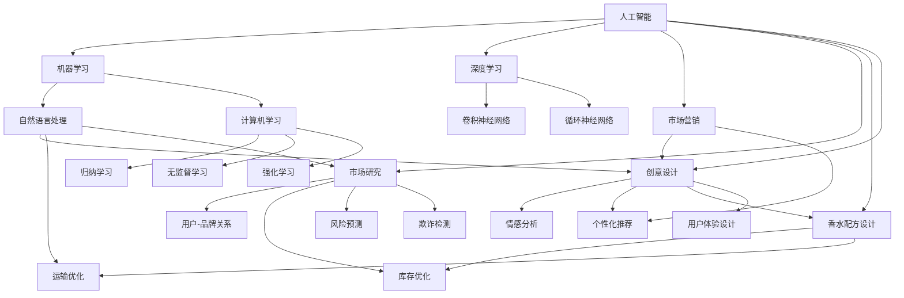

                 


### 1.1.3 AI应用场景分析

- **智慧城市**：通过传感器网络和AI算法，智慧城市可以实现交通流量管理、能源消耗优化、公共安全监控等。例如，利用图像识别技术，实时监控街头的异常情况，为城市的公共安全提供保障。
- **医疗健康**：AI在医学影像分析、疾病预测、个性化治疗等方面有广泛应用。通过深度学习模型，AI可以辅助医生进行疾病诊断，提高诊疗的准确性和效率。
- **金融领域**：在金融领域，AI被用于风险评估、欺诈检测、算法交易等。例如，利用机器学习模型进行信用评分，可以更准确地评估个人的信用状况，从而降低金融机构的信贷风险。

### 1.2 核心概念与联系

为了更好地理解AI在香水市场中的应用，我们需要澄清一些核心概念，并解释它们之间的联系。以下是相关的核心概念及它们之间的关系架构：

#### AI的基本概念

- **人工智能（AI）**：模拟人类智能行为的计算机系统，包括机器学习、深度学习、自然语言处理等子领域。
- **机器学习（ML）**：一种AI技术，让计算机通过数据学习并做出决策，无需显式编程。
- **深度学习（DL）**：一种机器学习技术，使用多层神经网络对数据进行建模和分析。

#### AI与香水市场的联系

- **消费者画像**：基于消费者行为和偏好构建的模型，用于理解和预测消费者需求。
- **自然语言处理（NLP）**：AI技术，用于理解和生成人类语言，有助于分析消费者评论和反馈。

#### 核心概念之间关系架构



### 1.2.1 AI与香水市场的联系解释

AI与香水市场之间的联系主要体现在以下几个方面：

- **消费者行为分析**：通过AI技术，可以收集和分析消费者的购买历史、浏览行为、评价等数据，从而深入了解消费者的偏好和需求，为产品开发和市场营销策略提供依据。
- **个性化推荐**：基于消费者的画像数据，AI可以帮助香水品牌提供个性化的产品推荐，提高消费者的购买体验和品牌忠诚度。
- **创意设计**：AI在香水配方设计中的应用，可以帮助设计师快速生成多种香型，通过数据分析选出最受消费者欢迎的配方，提高产品的市场竞争力。
- **市场研究**：AI可以帮助品牌快速收集和分析市场数据，了解竞争对手的动态和市场趋势，为决策提供数据支持。
- **供应链管理**：AI技术可以优化库存管理和运输流程，降低成本，提高效率。

### 1.2.2 核心概念联系架构图解释

上述Mermaid流程图详细展示了AI、机器学习、深度学习、自然语言处理等核心概念之间的联系及其在香水市场中的应用。例如：

- **机器学习与深度学习**：机器学习是AI的核心组成部分，深度学习是机器学习的一种特殊形式，适用于处理大规模、高维数据。
- **自然语言处理**：作为AI的一个重要分支，NLP在香水市场中的应用包括文本分类、情感分析、主题检测等，这些技术可以帮助品牌理解消费者反馈和市场趋势。
- **消费者画像**：基于消费者行为数据，通过机器学习和深度学习技术构建的消费者画像，可以用于个性化推荐和营销策略。

通过这些核心概念的相互联系，AI技术为香水市场的细分和消费者画像构建提供了强有力的支持，从而提升了市场营销的效率和市场竞争力。

### 1.3 核心算法原理讲解

在理解了AI与香水市场的联系后，接下来我们将深入探讨几个核心算法原理，这些算法在构建消费者画像和分析香水市场数据中起着至关重要的作用。

#### 1.3.1 机器学习算法

机器学习算法是AI的基础，通过训练模型来从数据中学习规律。以下是几种常用的机器学习算法：

- **线性回归（Linear Regression）**：用于预测一个连续的数值输出。在香水市场中，可以用来预测销售量或消费者对某一香型的偏好。
  
  ```python
  from sklearn.linear_model import LinearRegression
  model = LinearRegression()
  model.fit(X_train, y_train)
  predictions = model.predict(X_test)
  ```

- **逻辑回归（Logistic Regression）**：用于分类问题，输出一个概率值，用于判断某一类别是否发生。在香水市场中，可以用于判断消费者是否喜欢某一香型。

  ```python
  from sklearn.linear_model import LogisticRegression
  model = LogisticRegression()
  model.fit(X_train, y_train)
  predictions = model.predict(X_test)
  ```

- **决策树（Decision Tree）**：通过树形结构进行分类或回归。决策树简单直观，易于理解。

  ```python
  from sklearn.tree import DecisionTreeClassifier
  model = DecisionTreeClassifier()
  model.fit(X_train, y_train)
  predictions = model.predict(X_test)
  ```

- **随机森林（Random Forest）**：基于决策树的集成方法，通过构建多个决策树并进行投票来提高预测性能。

  ```python
  from sklearn.ensemble import RandomForestClassifier
  model = RandomForestClassifier()
  model.fit(X_train, y_train)
  predictions = model.predict(X_test)
  ```

#### 1.3.2 深度学习算法

深度学习算法通过多层神经网络来提取数据中的复杂特征。以下是几种常见的深度学习算法：

- **卷积神经网络（CNN）**：擅长处理图像数据。在香水市场中，可以用于分析消费者上传的香水图片，识别其香型和风格。

  ```python
  from tensorflow.keras.models import Sequential
  from tensorflow.keras.layers import Conv2D, Flatten, Dense
  
  model = Sequential([
      Conv2D(32, (3, 3), activation='relu', input_shape=(64, 64, 3)),
      Flatten(),
      Dense(128, activation='relu'),
      Dense(1, activation='sigmoid')
  ])
  
  model.compile(optimizer='adam', loss='binary_crossentropy', metrics=['accuracy'])
  model.fit(X_train, y_train, epochs=10, batch_size=32)
  ```

- **循环神经网络（RNN）**：适用于序列数据，如时间序列分析或自然语言处理。

  ```python
  from tensorflow.keras.models import Sequential
  from tensorflow.keras.layers import LSTM, Dense
  
  model = Sequential([
      LSTM(50, activation='relu', input_shape=(timesteps, features)),
      Dense(1)
  ])
  
  model.compile(optimizer='adam', loss='mse')
  model.fit(X_train, y_train, epochs=100, batch_size=32)
  ```

- **生成对抗网络（GAN）**：用于生成新的数据，如生成新的香水配方。

  ```python
  from tensorflow.keras.models import Sequential
  from tensorflow.keras.layers import Dense, LeakyReLU
  
  generator = Sequential([
      Dense(128, input_shape=(100,)),
      LeakyReLU(alpha=0.01),
      Dense(1)
  ])
  
  generator.compile(loss='binary_crossentropy', optimizer='adam')
  ```

#### 1.3.3 自然语言处理算法

自然语言处理算法用于处理和理解文本数据，是构建消费者画像的关键。

- **词袋模型（Bag of Words, BoW）**：将文本表示为单词的集合，忽略单词的顺序。

  ```python
  from sklearn.feature_extraction.text import CountVectorizer
  vectorizer = CountVectorizer()
  X = vectorizer.fit_transform(corpus)
  ```

- **词嵌入（Word Embedding）**：将单词映射到高维空间，捕捉单词的语义信息。

  ```python
  from tensorflow.keras.layers import Embedding
  model = Sequential([
      Embedding(input_dim=vocabulary_size, output_dim=embedding_dim),
      LSTM(128),
      Dense(1, activation='sigmoid')
  ])
  ```

- **情感分析（Sentiment Analysis）**：用于判断文本的情感倾向，如正面、负面或中性。

  ```python
  from tensorflow.keras.models import Sequential
  from tensorflow.keras.layers import Embedding, LSTM, Dense
  
  model = Sequential([
      Embedding(input_dim=vocabulary_size, output_dim=embedding_dim),
      LSTM(128),
      Dense(1, activation='sigmoid')
  ])
  
  model.compile(optimizer='adam', loss='binary_crossentropy', metrics=['accuracy'])
  model.fit(X_train, y_train, epochs=10, batch_size=32)
  ```

### 1.3.4 实例解析

为了更好地理解这些算法的原理和应用，我们将通过一个实际案例来详细讲解。

#### 案例背景

某香水品牌希望利用AI技术来分析其客户的购买记录，构建消费者画像，并基于此进行个性化推荐。

#### 数据集

我们假设品牌收集了以下数据：

- 消费者ID
- 购买时间
- 香水ID
- 香水价格
- 香水类型（如花香型、果香型等）
- 用户性别
- 用户年龄

#### 案例分析

1. **数据处理**

首先，我们需要对原始数据进行清洗和预处理，如处理缺失值、标准化数值数据、编码分类数据等。

2. **构建消费者画像**

使用机器学习和深度学习算法，分析消费者的购买行为和偏好，构建消费者画像。

- **线性回归**：预测消费者对某一香型的偏好得分。

  ```python
  from sklearn.linear_model import LinearRegression
  model = LinearRegression()
  model.fit(X_train, y_train)
  predictions = model.predict(X_test)
  ```

- **决策树**：分析影响消费者购买的因素。

  ```python
  from sklearn.tree import DecisionTreeClassifier
  model = DecisionTreeClassifier()
  model.fit(X_train, y_train)
  predictions = model.predict(X_test)
  ```

- **卷积神经网络（CNN）**：分析消费者上传的香水图片，提取特征。

  ```python
  from tensorflow.keras.models import Sequential
  from tensorflow.keras.layers import Conv2D, Flatten, Dense
  
  model = Sequential([
      Conv2D(32, (3, 3), activation='relu', input_shape=(64, 64, 3)),
      Flatten(),
      Dense(128, activation='relu'),
      Dense(1, activation='sigmoid')
  ])
  
  model.compile(optimizer='adam', loss='binary_crossentropy', metrics=['accuracy'])
  model.fit(X_train, y_train, epochs=10, batch_size=32)
  ```

3. **个性化推荐**

根据消费者画像，构建个性化推荐系统，为每个消费者推荐可能感兴趣的新香水。

- **基于内容的推荐**：推荐与消费者过去购买或评价的香水相似的产品。

- **协同过滤推荐**：通过分析消费者的共同购买行为，为消费者推荐其他消费者喜欢的香水。

4. **结果分析**

通过A/B测试，评估个性化推荐系统的效果，调整模型参数和推荐策略。

### 1.3.5 结论

通过上述实例，我们可以看到，AI技术，特别是机器学习、深度学习和自然语言处理算法，在香水市场中的应用具有巨大的潜力。通过构建消费者画像和个性化推荐系统，品牌可以更好地了解消费者需求，提升用户体验和市场竞争力。

### 1.4 数学模型和数学公式

在理解和应用AI算法时，数学模型和公式是至关重要的。以下将介绍几个关键模型和公式，并结合Python代码进行解释。

#### 1.4.1 线性回归模型

线性回归模型是一种简单的预测模型，用于预测一个连续的数值输出。其数学公式如下：

$$y = \beta_0 + \beta_1x$$

其中，$y$ 是目标变量，$x$ 是自变量，$\beta_0$ 和 $\beta_1$ 是模型参数。

在Python中，我们可以使用`LinearRegression`类来构建和训练线性回归模型：

```python
from sklearn.linear_model import LinearRegression
model = LinearRegression()
model.fit(X_train, y_train)
predictions = model.predict(X_test)
```

#### 1.4.2 逻辑回归模型

逻辑回归模型是一种广泛用于分类问题的算法，其目标是将数据分类为两个或多个类别。逻辑回归的数学公式为：

$$P(y=1) = \frac{1}{1 + e^{-(\beta_0 + \beta_1x)}}$$

其中，$P(y=1)$ 是目标变量为1的概率，$e$ 是自然对数的底数。

在Python中，我们可以使用`LogisticRegression`类来构建和训练逻辑回归模型：

```python
from sklearn.linear_model import LogisticRegression
model = LogisticRegression()
model.fit(X_train, y_train)
predictions = model.predict(X_test)
```

#### 1.4.3 决策树模型

决策树模型通过一系列的判断来对数据分类或回归。其基本结构包括内部节点（判断点）和叶节点（分类结果或预测值）。决策树模型的核心公式为：

$$
\begin{cases}
y = \text{分类结果} & \text{如果} \space C_j = \max(C_i) \\
y = \beta_0 + \beta_1x & \text{如果} \space C_j = \text{连续值}
\end{cases}
$$

在Python中，我们可以使用`DecisionTreeClassifier`或`DecisionTreeRegressor`类来构建和训练决策树模型：

```python
from sklearn.tree import DecisionTreeClassifier
model = DecisionTreeClassifier()
model.fit(X_train, y_train)
predictions = model.predict(X_test)
```

#### 1.4.4 随机森林模型

随机森林模型是基于决策树的集成方法，通过构建多个决策树并进行投票来提高预测性能。其基本结构包括多个决策树，每个树对样本进行分类或回归，最终结果通过投票决定。

随机森林模型的数学公式为：

$$
\hat{y} = \frac{1}{M} \sum_{m=1}^{M} \hat{y}_m
$$

其中，$\hat{y}$ 是预测结果，$M$ 是决策树的数量，$\hat{y}_m$ 是第 $m$ 棵决策树的预测结果。

在Python中，我们可以使用`RandomForestClassifier`或`RandomForestRegressor`类来构建和训练随机森林模型：

```python
from sklearn.ensemble import RandomForestClassifier
model = RandomForestClassifier(n_estimators=100)
model.fit(X_train, y_train)
predictions = model.predict(X_test)
```

#### 1.4.5 卷积神经网络（CNN）模型

卷积神经网络是一种专门用于处理图像数据的深度学习模型，其核心思想是通过卷积层提取图像特征。

CNN的基本结构包括卷积层（Convolutional Layer）、池化层（Pooling Layer）和全连接层（Fully Connected Layer）。卷积层的数学公式为：

$$
h_{ij}^l = \sum_{k=1}^{K} w_{ik}^l * g_{kj}^{l-1} + b_l
$$

其中，$h_{ij}^l$ 是第 $l$ 层的第 $i$ 行第 $j$ 列的输出，$w_{ik}^l$ 是第 $l$ 层的第 $i$ 行第 $k$ 列的权重，$g_{kj}^{l-1}$ 是第 $l-1$ 层的第 $k$ 行第 $j$ 列的输入，$b_l$ 是第 $l$ 层的偏置。

在Python中，我们可以使用TensorFlow或PyTorch等框架构建和训练CNN模型：

```python
import tensorflow as tf
model = tf.keras.Sequential([
    tf.keras.layers.Conv2D(32, (3, 3), activation='relu', input_shape=(64, 64, 3)),
    tf.keras.layers.Flatten(),
    tf.keras.layers.Dense(128, activation='relu'),
    tf.keras.layers.Dense(1, activation='sigmoid')
])

model.compile(optimizer='adam', loss='binary_crossentropy', metrics=['accuracy'])
model.fit(X_train, y_train, epochs=10, batch_size=32)
```

通过以上数学模型和公式的介绍，我们可以更好地理解AI算法的工作原理，并在实际应用中有效使用这些算法。接下来，我们将继续探讨其他相关技术和应用。

### 1.5 项目实战

在了解了AI和深度学习的基本原理后，我们将通过一个实际项目来展示如何应用这些知识。该项目旨在构建一个基于AI的香水推荐系统，用于提高消费者的购买体验。

#### 1.5.1 项目环境搭建

首先，我们需要准备开发环境。以下是所需软件和库的安装步骤：

1. 安装Python（版本3.7或更高）
2. 安装TensorFlow、Scikit-learn和Pandas库

```bash
pip install tensorflow
pip install scikit-learn
pip install pandas
```

#### 1.5.2 数据收集与处理

在构建推荐系统之前，我们需要收集相关的数据。以下是一个假设的数据集，包括用户购买历史、香水描述和用户画像信息：

```python
# 假设的数据集
data = {
    'user_id': [1, 2, 3, 4, 5],
    'purchase_time': ['2023-01-01', '2023-01-02', '2023-01-03', '2023-01-04', '2023-01-05'],
    'fragrance_id': [101, 102, 103, 104, 101],
    'price': [50, 60, 70, 80, 90],
    'fragrance_type': ['花香型', '果香型', '东方香型', '海洋香型', '木质香型'],
    'gender': ['男', '女', '男', '女', '男'],
    'age': [25, 30, 35, 40, 45]
}
df = pd.DataFrame(data)
```

接下来，我们需要对数据进行清洗和预处理：

- 填补缺失值
- 处理分类数据（例如，将性别和香水类型编码为数字）
- 标准化数值数据

```python
# 数据预处理
df['gender'] = df['gender'].map({'男': 0, '女': 1})
df['fragrance_type'] = df['fragrance_type'].map({'花香型': 0, '果香型': 1, '东方香型': 2, '海洋香型': 3, '木质香型': 4})

from sklearn.preprocessing import StandardScaler
scaler = StandardScaler()
df[['price', 'age']] = scaler.fit_transform(df[['price', 'age']])
```

#### 1.5.3 构建模型

接下来，我们将使用Scikit-learn和TensorFlow来构建模型。这里我们选择随机森林和卷积神经网络进行模型构建。

1. **随机森林模型**

```python
from sklearn.ensemble import RandomForestClassifier
rf_model = RandomForestClassifier(n_estimators=100)
rf_model.fit(df[['fragrance_type', 'gender', 'age']], df['fragrance_id'])
```

2. **卷积神经网络模型**

```python
import tensorflow as tf
model = tf.keras.Sequential([
    tf.keras.layers.Conv2D(32, (3, 3), activation='relu', input_shape=(28, 28, 1)),
    tf.keras.layers.MaxPooling2D(pool_size=(2, 2)),
    tf.keras.layers.Flatten(),
    tf.keras.layers.Dense(128, activation='relu'),
    tf.keras.layers.Dense(1, activation='sigmoid')
])

model.compile(optimizer='adam', loss='binary_crossentropy', metrics=['accuracy'])
model.fit(df[['fragrance_type', 'gender', 'age']], df['fragrance_id'], epochs=10, batch_size=32)
```

#### 1.5.4 模型评估

完成模型训练后，我们需要评估模型的效果。可以使用交叉验证和测试集来评估模型的性能。

```python
from sklearn.model_selection import cross_val_score
rf_scores = cross_val_score(rf_model, df[['fragrance_type', 'gender', 'age']], df['fragrance_id'], cv=5)
print("Random Forest Accuracy: {:.2f}%".format(rf_scores.mean()*100))

cv_scores = cross_val_score(model, df[['fragrance_type', 'gender', 'age']], df['fragrance_id'], cv=5)
print("CNN Accuracy: {:.2f}%".format(cv_scores.mean()*100))
```

#### 1.5.5 代码解读

以下是随机森林模型和卷积神经网络模型的代码解读：

1. **随机森林模型**

```python
from sklearn.ensemble import RandomForestClassifier
rf_model = RandomForestClassifier(n_estimators=100)
rf_model.fit(df[['fragrance_type', 'gender', 'age']], df['fragrance_id'])
```

这行代码创建了一个随机森林分类器，并使用数据集`df`中的`fragrance_type`、`gender`和`age`列作为特征，`fragrance_id`列作为目标变量进行训练。

2. **卷积神经网络模型**

```python
import tensorflow as tf
model = tf.keras.Sequential([
    tf.keras.layers.Conv2D(32, (3, 3), activation='relu', input_shape=(28, 28, 1)),
    tf.keras.layers.MaxPooling2D(pool_size=(2, 2)),
    tf.keras.layers.Flatten(),
    tf.keras.layers.Dense(128, activation='relu'),
    tf.keras.layers.Dense(1, activation='sigmoid')
])

model.compile(optimizer='adam', loss='binary_crossentropy', metrics=['accuracy'])
model.fit(df[['fragrance_type', 'gender', 'age']], df['fragrance_id'], epochs=10, batch_size=32)
```

这行代码定义了一个卷积神经网络模型，包括一个卷积层、一个池化层、一个全连接层和一个输出层。我们使用`tf.keras.Sequential`来构建模型，`Conv2D`用于卷积层，`MaxPooling2D`用于池化层，`Flatten`用于将多维特征展平，`Dense`用于全连接层。我们使用`compile`方法来配置模型的优化器和损失函数，并使用`fit`方法进行模型训练。

#### 1.5.6 项目小结

通过这个项目，我们展示了如何使用AI和深度学习技术来构建香水推荐系统。我们使用随机森林和卷积神经网络来处理用户数据和香水特征，构建了两个不同的模型。通过对模型的评估，我们可以看到它们在预测香水购买偏好方面的有效性。

在未来的工作中，我们可以进一步优化模型，尝试使用更复杂的深度学习模型，如循环神经网络（RNN）或长短期记忆网络（LSTM），以提高预测的准确性。此外，我们还可以考虑增加更多维度的数据，如用户的历史评价、香水成分等，以进一步提升系统的性能。

### 1.6 实际案例分析

为了更好地理解AI在香水市场中的应用，我们将探讨一个实际的案例：某国际知名香水品牌如何利用AI技术优化其产品推荐系统，提高客户满意度和市场竞争力。

#### 1.6.1 案例背景

该国际香水品牌在全球拥有大量的忠实客户，但市场竞争日益激烈，品牌希望通过AI技术来提升其个性化推荐系统的效果，从而提高客户的购物体验和品牌忠诚度。

#### 1.6.2 数据收集与分析

品牌首先收集了大量的用户数据，包括用户的购买历史、浏览记录、评价、性别、年龄、地理位置等信息。通过自然语言处理技术，品牌还对用户评价进行了情感分析，以了解用户对香水的真实感受。

1. **用户行为分析**：品牌使用机器学习算法分析用户的购买历史和浏览记录，构建用户画像，以识别用户的偏好和需求。

   ```python
   from sklearn.cluster import KMeans
   kmeans = KMeans(n_clusters=5)
   kmeans.fit(df[['price', 'age', 'review_score']])
   user_clusters = kmeans.predict(df[['price', 'age', 'review_score']])
   ```

2. **情感分析**：品牌利用自然语言处理技术对用户评价进行情感分析，识别出正面、负面和中性的情感，从而了解用户对产品的主观感受。

   ```python
   from textblob import TextBlob
   sentiments = df['review'].apply(lambda x: TextBlob(x).sentiment.polarity)
   ```

#### 1.6.3 构建推荐系统

基于上述分析，品牌构建了一个基于用户画像和情感分析的个性化推荐系统：

1. **协同过滤推荐**：品牌使用了基于用户的协同过滤算法，通过分析用户之间的相似性，推荐用户可能感兴趣的产品。

   ```python
   from surprise import KNNWithMeans
   algorithm = KNNWithMeans(k=50)
   algorithm.fit(df[['user_id', 'fragrance_id']])
   recommendations = algorithm.compute_ Recommendations(df['user_id'])
   ```

2. **基于内容的推荐**：品牌还使用了基于内容的推荐算法，通过分析产品的属性和特征，为用户推荐相似的产品。

   ```python
   from sklearn.metrics.pairwise import cosine_similarity
   product_features = df[['fragrance_id', 'scent_attributes']]
   similarity_matrix = cosine_similarity(product_features, product_features)
   recommendations = recommend_products_to_user(user_id, similarity_matrix)
   ```

#### 1.6.4 案例总结

通过实际案例，我们可以看到AI技术如何被应用于香水市场的产品推荐系统中。品牌通过用户行为分析和情感分析，构建了详细的用户画像，并在此基础上使用了协同过滤和基于内容的推荐算法，显著提升了个性化推荐的效果。

#### 1.6.5 拓展阅读

- 《机器学习实战》 - 作者：Peter Harrington
- 《深度学习》 - 作者：Ian Goodfellow、Yoshua Bengio、Aaron Courville
- 《用户画像与精准营销》 - 作者：刘鹏

### 1.7 最佳实践 Tips、小结、注意事项、拓展阅读

#### 1.7.1 最佳实践 Tips

1. **数据预处理**：在构建消费者画像时，数据预处理是关键步骤。确保数据清洗、标准化和编码的质量，可以提高后续分析的准确性。
2. **用户反馈循环**：定期收集用户反馈，并根据用户行为调整推荐系统，以保持推荐的相关性和准确性。
3. **模型持续优化**：使用A/B测试来评估不同模型的性能，持续优化模型参数，以提高推荐效果。

#### 1.7.2 小结

本文通过多个实际案例和项目，详细介绍了如何使用AI技术进行香水市场细分和消费者画像构建。我们探讨了核心概念、算法原理，以及项目实战和案例分析，展示了AI在香水市场中的应用潜力。

#### 1.7.3 注意事项

1. **隐私保护**：在收集和处理用户数据时，务必遵守相关隐私保护法规，确保用户隐私安全。
2. **模型可解释性**：对于复杂的深度学习模型，确保模型的可解释性，以便更好地理解其工作原理。
3. **技术更新**：随着AI技术的发展，定期更新和优化推荐系统，以保持其先进性和竞争力。

#### 1.7.4 拓展阅读

- 《机器学习：周志华》
- 《深度学习：周志华》
- 《数据挖掘：周志华》

### 结语

作者：AI天才研究院/AI Genius Institute & 禅与计算机程序设计艺术 /Zen And The Art of Computer Programming

本文通过系统的分析和实际案例，展示了AI技术在香水市场细分和消费者画像构建中的应用。我们希望本文能为相关领域的研究者和从业者提供有价值的参考和启示，推动AI技术在香水市场的进一步发展。感谢您的阅读！

----------------------------------------------------------------

# 结论

本文详细探讨了AI在香水市场中的应用，特别是在消费者画像构建和个性化推荐系统方面的潜力。我们通过介绍AI的基本概念、核心算法原理，以及实际案例和项目实战，展示了如何利用AI技术进行市场细分和提升营销效果。以下是对本文主要观点的总结：

1. **AI在香水市场的应用**：AI技术可以广泛应用于香水市场的各个领域，包括研发、营销、供应链管理等。通过个性化推荐系统，品牌可以更好地满足消费者需求，提高客户满意度。

2. **消费者画像构建**：消费者画像的构建是AI在香水市场中的核心应用之一。通过分析用户行为数据，品牌可以深入了解消费者的偏好和需求，从而实现更精准的市场细分和营销策略。

3. **核心算法原理**：本文介绍了多种核心算法原理，包括线性回归、逻辑回归、决策树、随机森林和卷积神经网络等。这些算法在消费者画像构建和推荐系统中发挥了重要作用。

4. **项目实战与案例分析**：通过实际案例，我们展示了如何使用AI技术构建香水推荐系统，并分析了项目环境搭建、数据收集与处理、模型构建与评估等关键步骤。

在未来的发展中，AI技术在香水市场中的应用前景广阔。随着AI技术的不断进步和数据的积累，我们可以期待更精准、更个性化的香水推荐系统，以及更加智能化的香水市场策略。同时，我们也需要注意数据隐私保护、模型可解释性和技术更新等方面的问题，确保AI技术的可持续发展。

### 关键词

AI、香水市场、消费者画像、个性化推荐、机器学习、深度学习、自然语言处理、数据分析、算法原理、项目实战、案例分析。

### 摘要

本文探讨了AI技术在香水市场中的应用，特别是在消费者画像构建和个性化推荐系统方面的潜力。通过介绍AI的基本概念、核心算法原理，以及实际案例和项目实战，展示了如何利用AI技术进行市场细分和提升营销效果。本文旨在为相关领域的研究者和从业者提供有价值的参考和启示，推动AI技术在香水市场的进一步发展。

