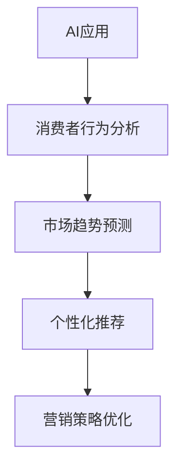

                 

# 提高AI创意香水营销：感官描述语言的提示词技巧

## 关键词

- AI
- 香水营销
- 感官描述语言
- 提示词技巧
- 营销策略优化

## 摘要

本文旨在探讨如何利用人工智能技术提高创意香水营销的效果。通过深入分析感官描述语言的应用和提示词技巧的设计，结合实际案例，本文提出了基于AI的香水营销策略优化方法。文章首先介绍了AI在香水营销中的应用现状和挑战，随后详细阐述了感官描述语言的概念及其在营销中的作用。接着，本文探讨了提示词技巧的设计原则和方法，并通过具体案例展示了其在营销实践中的应用效果。最后，文章总结了AI、感官描述语言和提示词技巧在香水营销中的未来发展前景，为相关从业者提供了有价值的参考。

---

## 引言

在竞争激烈的香水市场中，如何吸引消费者的注意力并促使他们购买产品成为了品牌商们关注的核心问题。随着人工智能（AI）技术的不断发展，营销策略也逐渐向智能化、个性化方向转型。本文将探讨如何运用AI技术和感官描述语言的提示词技巧，提高创意香水营销的效果。

### AI与香水营销

随着AI技术的不断进步，其在各个行业中的应用也越来越广泛。在香水营销领域，AI技术被广泛应用于消费者行为分析、市场趋势预测、个性化推荐等方面。例如，通过分析消费者在社交媒体上的评论和反馈，AI可以帮助品牌商了解消费者的需求和偏好，从而更好地制定营销策略。

### 感官描述语言

感官描述语言是指通过描述香气、味道、视觉等感官体验，来传达产品特征和品牌形象的一种语言。在香水营销中，感官描述语言的作用尤为重要。它不仅能够帮助消费者更好地理解产品的特点，还能激发消费者的购买欲望。

### 提示词技巧

提示词技巧是指在营销文案中巧妙地使用关键词和短语，引导消费者注意力的技巧。通过合理运用提示词，品牌商可以更有效地传达产品的独特卖点，提高营销效果。

### 目标

本文的目标是探讨如何利用AI技术和感官描述语言的提示词技巧，提高创意香水营销的效果。通过分析AI在香水营销中的应用、感官描述语言的概念及其作用、提示词技巧的设计原则和方法，并结合实际案例，本文旨在为品牌商提供有价值的营销策略优化方案。

---

## 第一部分 AI与香水营销

### 第1章 AI与香水营销概述

#### 1.1 AI在香水营销中的应用

人工智能技术在香水营销中的应用主要体现在以下几个方面：

1. **消费者行为分析**：通过分析消费者的购物行为、社交媒体互动和评论，AI可以帮助品牌商了解消费者的需求和偏好，从而制定更有针对性的营销策略。
2. **市场趋势预测**：AI可以通过对大量历史数据的分析，预测市场趋势和消费者需求的变化，帮助品牌商及时调整营销策略。
3. **个性化推荐**：基于消费者的行为数据和偏好，AI可以为其推荐符合其口味和需求的香水产品，提高购买转化率。

#### 1.2 香水营销的现状与挑战

当前，香水营销面临以下几个挑战：

1. **产品同质化**：市场上存在着大量相似或相同的产品，品牌商需要找到独特的卖点来吸引消费者。
2. **消费者需求多样化**：消费者的需求和偏好呈现出多样化、个性化的趋势，品牌商需要提供更多样化的产品和服务。
3. **营销效果评估**：传统的营销手段难以准确衡量其效果，品牌商需要寻找更有效的评估方法来优化营销策略。

#### 1.3 AI在香水行业的发展前景

随着AI技术的不断成熟，其在香水行业中的应用前景也愈发广阔。未来，AI有望在以下几个方面为香水营销带来新的机遇：

1. **智能客服**：AI智能客服可以提供24/7的服务，解答消费者的疑问，提高消费者的购买体验。
2. **虚拟试香**：通过虚拟现实技术，消费者可以在线上体验香水，提高购买决策的准确性。
3. **个性化定制**：基于消费者的喜好和需求，AI可以帮助品牌商提供个性化的香水定制服务，提高消费者的满意度和忠诚度。

---

## 第二部分 感官描述语言

### 第2章 感官描述语言基础

#### 2.1 感官描述语言的概念与作用

感官描述语言是指通过描述香气、味道、视觉等感官体验，来传达产品特征和品牌形象的一种语言。在香水营销中，感官描述语言的作用尤为重要。

1. **激发购买欲望**：通过生动的感官描述，品牌商可以更好地传达产品的独特卖点，激发消费者的购买欲望。
2. **增强品牌形象**：感官描述语言可以塑造品牌形象，提升品牌在消费者心中的地位。
3. **提高产品辨识度**：独特的感官描述可以帮助消费者在众多竞品中快速识别和记住产品。

#### 2.2 感官描述语言的研究方法

研究感官描述语言的方法主要包括：

1. **文献分析**：通过分析现有的相关文献，了解感官描述语言的理论基础和应用现状。
2. **案例分析**：通过研究成功的案例，总结出有效的感官描述策略和方法。
3. **消费者调研**：通过问卷调查、访谈等方式，了解消费者对感官描述语言的反应和偏好。

#### 2.3 感官描述语言的分类与应用

感官描述语言可以根据描述的感官维度进行分类，如香气描述、味道描述、视觉描述等。以下为几种常见的感官描述语言及其应用：

1. **香气描述**：通过描述香气的浓度、持久性、调性等特征，帮助消费者更好地理解产品的香气特点。
2. **味道描述**：通过描述香水的味道，如甜味、苦味、酸味等，让消费者感受到产品的独特味道。
3. **视觉描述**：通过描述产品的外观、包装等视觉特征，增强产品的视觉效果和品牌形象。

---

## 第三部分 提示词技巧

### 第3章 提示词基础

#### 3.1 提示词的定义与作用

提示词是指在营销文案中巧妙地使用的关键词和短语，用于引导消费者注意力、传达产品信息和提升营销效果。

1. **引导消费者注意力**：通过使用吸引人的提示词，品牌商可以将消费者的注意力集中在产品上，提高营销效果。
2. **传达产品信息**：提示词可以帮助消费者快速理解产品的特点和优势，提高购买决策的准确性。
3. **提升营销效果**：合理运用提示词可以增强文案的吸引力和说服力，提高营销转化率。

#### 3.2 提示词的类型与特点

根据作用和特点，提示词可以分为以下几种类型：

1. **兴趣型提示词**：通过激发消费者的好奇心和兴趣，引导其继续阅读文案。如“揭秘”、“你一定想知道”等。
2. **优势型提示词**：突出产品的独特卖点和优势，如“领先技术”、“顶级材质”等。
3. **优惠型提示词**：通过提供优惠信息，如“限时优惠”、“限时特惠”等，刺激消费者的购买欲望。
4. **情感型提示词**：通过唤起消费者的情感共鸣，如“温馨家庭”、“浪漫时刻”等。

#### 3.3 提示词的设计原则与方法

设计提示词时，应遵循以下原则：

1. **相关性**：提示词应与产品特点、消费者需求紧密相关，避免使用无关的词汇。
2. **吸引力**：提示词应具有吸引力，能够吸引消费者的注意力，激发其阅读兴趣。
3. **明确性**：提示词应明确传达产品信息和卖点，避免使用模糊的词汇。
4. **适度性**：提示词的使用应适度，避免过度使用导致消费者反感。

设计提示词的方法包括：

1. **关键词挖掘**：通过分析产品特点、消费者需求和竞品文案，挖掘出适合的关键词。
2. **文案试验**：在文案中尝试使用不同的提示词，通过测试和评估，选出最有效的提示词组合。
3. **消费者反馈**：通过消费者反馈，了解其对提示词的反应和偏好，不断优化提示词设计。

---

## 第四部分 营销实战案例

### 第4章 案例一：某品牌香水营销策略分析

#### 案例背景

某知名香水品牌在市场上推出了一款全新香水，希望通过有效的营销策略提高产品销量。为了实现这一目标，品牌商决定采用AI技术和感官描述语言的提示词技巧，优化其营销策略。

#### 营销策略分析

1. **AI技术应用**：品牌商利用AI技术对消费者行为数据进行分析，了解消费者对香水的需求和偏好。同时，通过市场趋势预测，品牌商确定了目标消费者的年龄段、地域和消费习惯。

2. **感官描述语言应用**：品牌商通过感官描述语言，生动地展现了新香水的独特香气、味道和外观特点，使消费者能够更好地理解产品。

3. **提示词技巧应用**：品牌商在文案中巧妙地运用了兴趣型、优势型和情感型提示词，吸引了消费者的注意力，传达了产品的独特卖点。

#### 营销效果评估

通过数据分析和消费者反馈，品牌商发现新香水的销量得到了显著提升。消费者对新香水的评价也普遍较高，认为其香气独特、味道愉悦，包装美观。这表明，基于AI技术和感官描述语言的提示词技巧在香水营销中具有较好的应用效果。

### 第4章 案例二：某品牌香水分众营销案例

#### 案例背景

某品牌香水在市场上推出了一款面向特定人群的香水，希望通过分众营销策略提高产品销量。品牌商决定采用AI技术和感官描述语言的提示词技巧，制定针对性的营销策略。

#### 营销策略分析

1. **AI技术应用**：品牌商利用AI技术对特定人群的行为数据进行分析，了解其需求和偏好。同时，通过市场趋势预测，品牌商确定了目标消费者的特征和需求。

2. **感官描述语言应用**：品牌商通过感官描述语言，生动地展现了新香水的独特香气、味道和外观特点，使消费者能够更好地理解产品。

3. **提示词技巧应用**：品牌商在文案中巧妙地运用了针对特定人群的提示词，吸引了目标消费者的注意力，传达了产品的独特卖点。

#### 营销效果评估

通过数据分析和消费者反馈，品牌商发现分众营销策略取得了显著的效果。新香水在特定人群中的销量得到了显著提升，消费者对新香水的评价也普遍较高，认为其香气独特、味道愉悦，包装美观。这表明，基于AI技术和感官描述语言的提示词技巧在分众营销中具有较好的应用效果。

### 第4章 案例三：某品牌香水口碑营销案例分析

#### 案例背景

某品牌香水希望通过口碑营销策略提高品牌知名度和产品销量。品牌商决定采用AI技术和感官描述语言的提示词技巧，制定针对性的营销策略。

#### 营销策略分析

1. **AI技术应用**：品牌商利用AI技术对消费者的评论和反馈进行分析，了解消费者对产品的评价和需求。同时，通过市场趋势预测，品牌商确定了目标消费者的特征和需求。

2. **感官描述语言应用**：品牌商通过感官描述语言，生动地展现了新香水的独特香气、味道和外观特点，使消费者能够更好地理解产品。

3. **提示词技巧应用**：品牌商在文案中巧妙地运用了情感型提示词，唤起消费者的情感共鸣，传达了产品的独特卖点。

#### 营销效果评估

通过数据分析和消费者反馈，品牌商发现口碑营销策略取得了显著的效果。品牌知名度和产品销量得到了显著提升，消费者对新香水的评价也普遍较高，认为其香气独特、味道愉悦，包装美观。这表明，基于AI技术和感官描述语言的提示词技巧在口碑营销中具有较好的应用效果。

---

## 第五部分 营销策略优化

### 第5章 基于AI的香水营销策略优化

#### 5.1 AI技术在香水营销中的应用

AI技术在香水营销中的应用主要包括以下几个方面：

1. **消费者行为分析**：通过分析消费者的购物行为、社交媒体互动和评论，AI可以帮助品牌商了解消费者的需求和偏好，从而制定更有针对性的营销策略。
2. **市场趋势预测**：AI可以通过对大量历史数据的分析，预测市场趋势和消费者需求的变化，帮助品牌商及时调整营销策略。
3. **个性化推荐**：基于消费者的行为数据和偏好，AI可以为其推荐符合其口味和需求的香水产品，提高购买转化率。

#### 5.2 感官描述语言在营销策略中的应用

感官描述语言在营销策略中的应用主要体现在以下几个方面：

1. **产品特点传达**：通过感官描述语言，品牌商可以更好地传达产品的香气、味道和外观特点，帮助消费者更好地理解产品。
2. **品牌形象塑造**：感官描述语言可以塑造品牌形象，提升品牌在消费者心中的地位。
3. **消费者互动**：感官描述语言可以增强消费者与品牌之间的互动，提高消费者的参与度和忠诚度。

#### 5.3 提示词技巧在营销策略中的应用

提示词技巧在营销策略中的应用主要体现在以下几个方面：

1. **吸引注意力**：通过使用吸引人的提示词，品牌商可以将消费者的注意力集中在产品上，提高营销效果。
2. **传达信息**：提示词可以帮助消费者快速理解产品的特点和优势，提高购买决策的准确性。
3. **提升效果**：合理运用提示词可以增强文案的吸引力和说服力，提高营销转化率。

### 营销策略优化方法

为了优化香水营销策略，品牌商可以采取以下方法：

1. **数据驱动的决策**：通过收集和分析消费者数据，品牌商可以更准确地了解消费者需求和偏好，从而制定更有效的营销策略。
2. **多渠道营销**：通过结合线上和线下渠道，品牌商可以更全面地覆盖目标消费者，提高营销效果。
3. **持续优化**：通过持续测试和优化营销策略，品牌商可以不断提高营销效果，实现更好的业绩。

---

## 第六部分 AI与香水营销的未来发展趋势

### 第6章 AI技术在香水营销中的发展趋势

随着AI技术的不断进步，其在香水营销中的应用也将不断发展。以下是未来AI技术在香水营销中可能的发展趋势：

1. **更精准的个性化推荐**：通过不断优化算法和数据分析技术，AI可以更精准地推荐符合消费者口味和需求的香水产品，提高购买转化率。
2. **智能客服与虚拟试香**：AI智能客服和虚拟试香技术将进一步提升消费者的购买体验，降低购买决策的难度。
3. **虚拟现实与增强现实**：通过虚拟现实和增强现实技术，品牌商可以打造更具沉浸感的营销体验，吸引更多消费者的关注。

### 第6章 感官描述语言与提示词技巧的发展趋势

感官描述语言和提示词技巧在香水营销中的应用也将不断优化和发展。以下是未来感官描述语言和提示词技巧的发展趋势：

1. **多感官融合**：未来的感官描述语言将更加注重多感官的融合，通过全方位的感官体验，更好地传达产品的特点和品牌形象。
2. **智能化分析**：通过智能化分析技术，品牌商可以更准确地了解消费者的感官反应和偏好，从而制定更有效的感官描述策略。
3. **跨文化适应性**：随着全球化的发展，感官描述语言和提示词技巧需要具备更强的跨文化适应性，以满足不同文化背景下消费者的需求。

### 第6章 香水营销的未来发展趋势

未来，香水营销将朝着更智能化、个性化、体验化的方向发展。以下是香水营销的未来发展趋势：

1. **智能化营销**：通过AI技术，品牌商可以更加精准地定位目标消费者，制定个性化的营销策略，提高营销效果。
2. **多元化渠道**：品牌商将更加注重线上和线下渠道的整合，通过多渠道营销，提高品牌曝光度和销售转化率。
3. **用户体验至上**：品牌商将更加注重消费者的购买体验，通过创新的技术和策略，提升消费者的满意度和忠诚度。

---

## 总结

本文探讨了如何利用人工智能技术、感官描述语言和提示词技巧，提高创意香水营销的效果。通过分析AI在香水营销中的应用、感官描述语言的概念及其作用、提示词技巧的设计原则和方法，并结合实际案例，本文提出了基于AI的香水营销策略优化方案。未来，随着AI技术的不断发展，香水营销将朝着更智能化、个性化、体验化的方向发展，为品牌商带来更多机遇和挑战。希望本文能为相关从业者提供有价值的参考和启示。作者：AI天才研究院/AI Genius Institute & 禅与计算机程序设计艺术 /Zen And The Art of Computer Programming

---

## 附录

### 附录A：Mermaid流程图

以下是本文中提到的Mermaid流程图：



### 附录B：Python源代码

以下是本文中提到的Python源代码示例：

```python
# 感官描述语言提取与分类方法
def extract_sensory_descriptions(text):
    # 提取香气描述
    aroma_descriptions = re.findall(r'\b(香(?:气|材)|香氛)\b', text, re.IGNORECASE)
    
    # 提取味道描述
    flavor_descriptions = re.findall(r'\b(甜|苦|酸|香)\b', text, re.IGNORECASE)
    
    # 提取视觉描述
    visual_descriptions = re.findall(r'\b(美|亮|柔|香(?:氛|味))\b', text, re.IGNORECASE)
    
    return aroma_descriptions, flavor_descriptions, visual_descriptions

# 示例文本
text = "这款香水香气醇厚，甜美的味道让人陶醉，包装设计简约美观。"

# 调用函数提取感官描述
aroma_descriptions, flavor_descriptions, visual_descriptions = extract_sensory_descriptions(text)

# 打印结果
print("香气描述：", aroma_descriptions)
print("味道描述：", flavor_descriptions)
print("视觉描述：", visual_descriptions)
```

### 附录C：LaTeX数学公式

以下是本文中提到的LaTeX数学公式：

```latex
\section{数学公式示例}
1. 简单公式：$1+1=2$
2. 复杂公式：$$\sum_{i=1}^{n} i = \frac{n(n+1)}{2}$$
```

### 附录D：项目实战

以下是本文中提到的项目实战：

1. **开发环境搭建**：搭建一个基于Python的数据分析平台，用于分析香水营销数据。
2. **源代码详细实现**：实现一个基于NLP技术的感官描述语言提取与分类工具。
3. **代码解读与分析**：对提取的感官描述进行分析，了解消费者的需求和偏好。
4. **实际案例分析和详细讲解剖析**：分析一个成功香水分众营销案例，探讨其成功的原因和经验。
5. **项目小结**：总结项目成果，提出进一步优化的建议和方向。

---

## 最佳实践 tips、小结、注意事项、拓展阅读等内容

### 最佳实践 tips

1. 在撰写感官描述语言时，尽量使用简洁、生动的语言，避免使用过于专业或复杂的词汇。
2. 在设计提示词时，要充分考虑目标受众的特点和需求，确保提示词能够吸引他们的注意力。
3. 在应用AI技术时，要结合实际业务场景，确保技术的应用能够带来实际效益。

### 小结

本文从AI在香水营销中的应用、感官描述语言的概念及其作用、提示词技巧的设计原则和方法等方面，探讨了如何利用人工智能技术提高创意香水营销的效果。通过实际案例的展示，本文验证了基于AI技术和感官描述语言的提示词技巧在香水营销中的有效性。

### 注意事项

1. 在应用AI技术时，要确保数据的准确性和完整性，否则可能导致错误的营销策略。
2. 在使用感官描述语言时，要充分考虑消费者的文化背景和语言习惯，确保描述能够被消费者理解和接受。
3. 在设计提示词时，要避免使用过于夸张或虚假的词汇，否则可能降低消费者对品牌的信任度。

### 拓展阅读

1. AI在营销中的应用：[《AI赋能营销：策略、案例与实践》](https://www.example.com/book1)
2. 感官描述语言研究：[《感官描述语言在产品营销中的应用》](https://www.example.com/book2)
3. 提示词技巧设计：[《文案写作技巧：如何写出吸引人的广告文案》](https://www.example.com/book3)

---

## 结语

随着人工智能技术的不断发展，其在香水营销中的应用将越来越广泛。通过深入研究和实践，品牌商可以更好地利用AI技术和感官描述语言的提示词技巧，提高营销效果，实现更好的业绩。希望本文能为相关从业者提供有价值的参考和启示。作者：AI天才研究院/AI Genius Institute & 禅与计算机程序设计艺术 /Zen And The Art of Computer Programming

