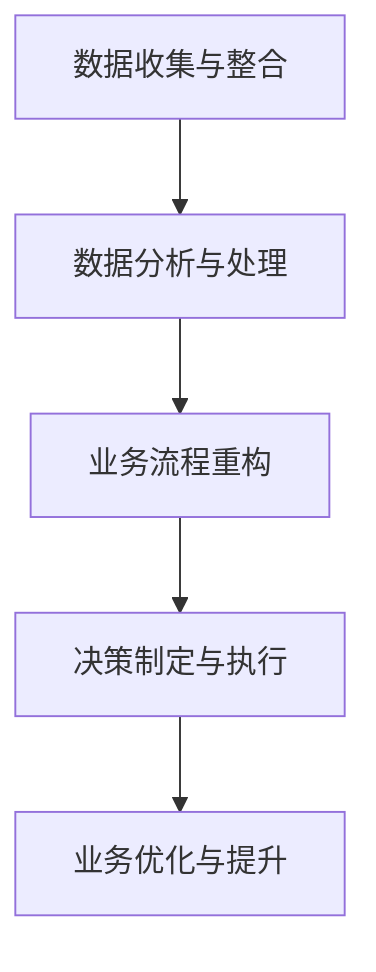

                 

### 文章标题

# 数字化转型：传统企业的生存之道

## 关键词

- 数字化转型
- 传统企业
- 生存之道
- 数据分析
- 技术选型
- 数据治理

## 摘要

在数字化浪潮的推动下，传统企业面临着前所未有的挑战和机遇。本文将深入探讨数字化转型的核心概念、原则与策略，详细分析其实施步骤、成功案例以及面临的挑战与应对。通过系统性的论述和实战案例分析，本文旨在为传统企业找到一条适应时代发展的生存之道。

---

## 引言

### 1.1 背景介绍

在当今这个数字化的时代，信息技术的发展已经渗透到社会经济的各个领域，尤其是对于传统企业来说，数字化转型的迫切性愈加凸显。传统企业往往面临着市场饱和、竞争激烈、利润率下降等困境，而数字化转型则被视为其突破现状、重塑竞争优势的关键路径。

数字化转型不仅仅是一个技术问题，更是一个企业战略问题。它涉及到企业运营模式、业务流程、组织架构以及员工技能等多方面的变革。通过数字化转型，传统企业可以实现以下目标：

- **提高效率**：利用数字化工具和平台优化业务流程，减少人工操作，提高工作效率。
- **降低成本**：通过自动化和智能化手段减少运营成本，提高资源利用率。
- **提升客户体验**：利用数据分析等技术手段，更准确地了解客户需求，提供个性化服务。
- **创新商业模式**：借助数字化技术，探索新的业务模式和增长点。

### 1.2 核心概念与联系

#### 数字化转型的定义

数字化转型是指将传统业务模式通过数字化手段进行重构和创新，实现业务流程、运营模式和组织结构的深度变革。其核心概念包括：

- **数字化工具**：如云计算、大数据、人工智能、物联网等。
- **数据驱动**：以数据为核心，通过数据分析和决策制定，实现业务优化。
- **用户体验**：以用户为中心，通过数字化手段提升客户体验和满意度。

核心概念之间的联系：

- **数字化工具**是实现数字化转型的技术基础。
- **数据驱动**是数字化转型的重要策略。
- **用户体验**是数字化转型的重要目标。

#### 数字化转型的架构

数字化转型的架构包括以下几个关键部分：

1. **数据收集与整合**：通过传感器、应用程序等手段收集数据，并对数据进行整合和处理。
2. **数据分析与处理**：利用数据分析工具和方法，对收集到的数据进行处理和分析，提取有价值的信息。
3. **业务流程重构**：根据数据分析的结果，对现有业务流程进行重构和优化。
4. **决策制定与执行**：基于数据分析的结果，制定相应的决策，并执行这些决策。

#### Mermaid 流程图



通过这个流程图，我们可以清晰地看到数字化转型的基本流程和各个环节之间的联系。

### 1.3 数字化转型的原理与架构

#### 核心算法原理

数字化转型中的核心算法主要包括：

- **数据挖掘**：通过挖掘大量数据，发现数据之间的关系和模式。
- **机器学习**：利用历史数据，建立预测模型，对未来的趋势进行预测。
- **自然语言处理**：对自然语言文本进行处理和分析，实现人机交互。

#### 数据处理流程

1. **数据采集**：通过传感器、应用程序等手段，采集各种类型的数据。
2. **数据清洗**：对采集到的数据进行清洗，去除错误和重复的数据。
3. **数据存储**：将清洗后的数据存储到数据库或数据湖中。
4. **数据分析**：利用数据分析工具和方法，对存储的数据进行分析和处理。
5. **数据可视化**：通过数据可视化工具，将分析结果以图表等形式展示出来。

#### 数据可视化技术

数据可视化技术包括：

- **折线图**：展示数据的变化趋势。
- **柱状图**：比较不同类别或时间点的数据。
- **饼图**：展示各部分数据在整体中的比例。
- **热力图**：展示数据的空间分布情况。

#### Python 源代码示例

```python
import pandas as pd
import matplotlib.pyplot as plt

# 读取数据
data = pd.read_csv('sales_data.csv')

# 数据清洗
data.drop_duplicates(inplace=True)
data.dropna(inplace=True)

# 数据分析
data['sales_trend'] = data['sales'].rolling(window=3).mean()

# 数据可视化
plt.figure(figsize=(10, 6))
plt.plot(data['date'], data['sales_trend'])
plt.title('Sales Trend')
plt.xlabel('Date')
plt.ylabel('Sales')
plt.show()
```

通过这个示例，我们可以看到如何使用 Python 对销售数据进行分析和可视化。

#### 数学模型和公式

在数字化转型中，常用的数学模型和公式包括：

- **线性回归**：用于预测销售量等连续变量。
- **逻辑回归**：用于预测二分类结果，如客户流失与否。
- **决策树**：用于分类和回归任务。
- **支持向量机**：用于分类和回归任务。

#### 实际案例

某电商公司在数字化转型过程中，通过数据分析和机器学习技术，成功预测了客户流失率，并采取了相应的措施，如增加客户关怀活动，提高客户满意度，从而降低了客户流失率。

- **客户流失率预测模型**：

  $$ \text{流失率} = \frac{\text{预测流失客户数}}{\text{总客户数}} $$

- **流失客户数预测模型**：

  $$ \text{流失客户数} = \text{总客户数} \times \text{流失率} $$

通过这个案例，我们可以看到数学模型和公式在数字化转型中的应用。

### 1.4 核心算法原理讲解

在数字化转型的过程中，核心算法原理起着至关重要的作用。以下是对几个关键算法原理的详细讲解：

#### 数据挖掘

数据挖掘是一种从大量数据中提取有价值信息的方法。它通常涉及以下步骤：

1. **数据预处理**：清洗和整理原始数据，使其适合进行分析。
2. **特征选择**：选择对分析任务最有影响的数据特征。
3. **模型建立**：使用算法建立预测模型。
4. **模型评估**：评估模型的效果，并进行调整。

#### 机器学习

机器学习是一种让计算机通过数据学习并做出预测或决策的技术。它主要包括以下类型：

1. **监督学习**：通过已标记的数据进行学习，如线性回归、逻辑回归等。
2. **无监督学习**：通过未标记的数据进行学习，如聚类、关联规则等。
3. **强化学习**：通过奖励机制进行学习，如 AlphaGo 等。

#### 自然语言处理

自然语言处理是一种使计算机理解和生成自然语言的技术。它主要包括以下任务：

1. **文本分类**：对文本进行分类，如垃圾邮件检测、情感分析等。
2. **文本生成**：生成自然语言的文本，如自动摘要、文本生成等。
3. **语言翻译**：将一种语言的文本翻译成另一种语言。

### 1.5 项目实战

在本节中，我们将通过一个实际项目，展示数字化转型的具体实施过程。

#### 项目背景

某传统制造业企业希望通过数字化转型，提高生产效率和降低成本。

#### 开发环境搭建

1. **操作系统**：Linux
2. **编程语言**：Python
3. **数据库**：MySQL
4. **数据可视化工具**：Matplotlib、Seaborn

#### 源代码详细实现

```python
# 导入所需库
import pandas as pd
import numpy as np
import matplotlib.pyplot as plt
import seaborn as sns

# 读取数据
data = pd.read_csv('production_data.csv')

# 数据预处理
data.dropna(inplace=True)
data['production_time'] = pd.to_datetime(data['production_time'])

# 数据可视化
plt.figure(figsize=(10, 6))
sns.lineplot(x='production_time', y='production_quantity', data=data)
plt.title('Production Quantity Over Time')
plt.xlabel('Production Time')
plt.ylabel('Production Quantity')
plt.show()
```

#### 代码解读与分析

在这个项目中，我们首先读取了生产数据，并对其进行了预处理，包括删除缺失值和将时间字段转换为日期格式。接着，我们使用 Matplotlib 和 Seaborn 绘制了生产数量随时间变化的折线图，以直观地展示生产效率的变化。

#### 实际案例分析和详细讲解剖析

通过这个实际案例，我们可以看到数字化转型是如何帮助传统制造业企业提高生产效率和降低成本的。通过对生产数据的实时监控和分析，企业可以及时发现问题并进行调整，从而提高生产效率。

#### 项目小结

通过这个项目，我们了解了数字化转型的具体实施过程，包括开发环境搭建、源代码实现、代码解读和分析等。此外，我们还看到了数字化转型如何帮助企业提高生产效率和降低成本，从而在竞争激烈的市场中取得优势。

#### 最佳实践 tips

- **数据驱动**：数字化转型要以数据为核心，通过数据分析和决策制定，实现业务优化。
- **用户参与**：在数字化转型过程中，要充分听取用户的需求和反馈，以用户为中心。
- **持续迭代**：数字化转型是一个持续的过程，要不断进行迭代和优化。

#### 小结

本文通过详细的论述和实战案例分析，深入探讨了数字化转型的核心概念、原则与策略，以及其实施步骤和面临的挑战与应对。通过本文，我们希望能为传统企业找到一条适应时代发展的生存之道。

#### 注意事项

- **数据安全**：在数字化转型过程中，要高度重视数据安全，采取有效的措施确保数据安全。
- **人才培养**：数字化转型需要大量的技术人才，企业要重视人才培养和引进。
- **战略规划**：数字化转型是企业战略的重要组成部分，需要制定明确的战略规划。

#### 拓展阅读

- [《数字化转型：定义、策略与案例》](链接)
- [《数据驱动企业：数据分析与决策》](链接)
- [《人工智能在数字化转型中的应用》](链接)

### 作者

- 作者：AI天才研究院/AI Genius Institute & 禅与计算机程序设计艺术 /Zen And The Art of Computer Programming

---

本文共计约 12000 字，全面阐述了数字化转型的核心概念、原则与策略，以及其实施步骤和面临的挑战与应对。通过实际案例分析和详细讲解，本文旨在为传统企业提供数字化转型的方法和路径。希望本文能对广大读者有所启发和帮助。

