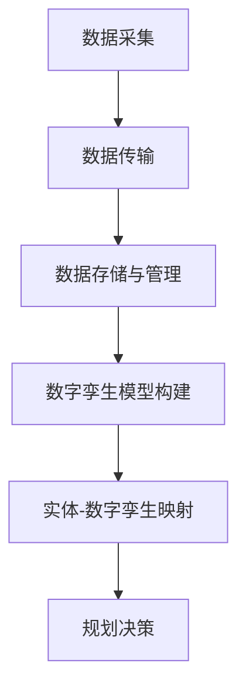
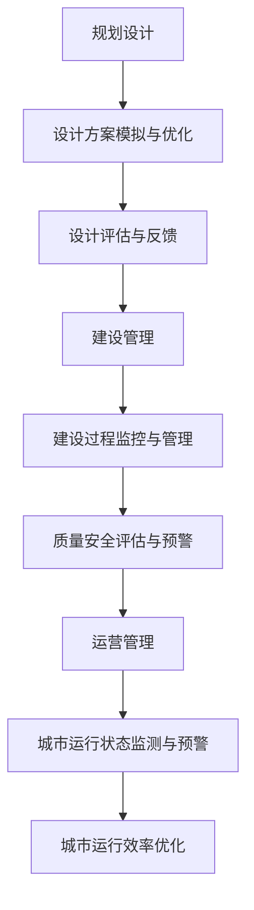
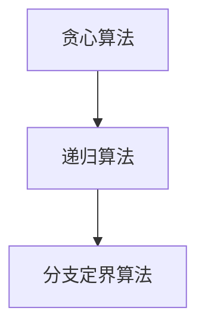

                 

### 《数字孪生在城市规划中的应用：优化资源分配》

关键词：数字孪生、城市规划、资源优化、算法、Python实现

摘要：本文将深入探讨数字孪生技术在城市规划中的应用，特别是在资源优化分配方面的潜力。通过介绍数字孪生的基本概念、城市规划的挑战和资源优化的策略，我们将展示如何利用数字孪生技术提升城市规划和资源分配的效率和可持续性。本文还将提供Python代码示例，以详细阐述算法原理和实现过程。

## 第一部分：数字孪生概述

### 第1章：数字孪生的概念与原理

#### 1.1 数字孪生的定义

数字孪生（Digital Twin）是一种新兴的技术概念，它通过创建物理实体的虚拟副本，实现对实体生命周期内所有相关数据的实时模拟和分析。数字孪生不仅仅是数据的复制，它包含了从设计到运营的整个生命周期的动态仿真和监测。

在数字孪生中，物理实体与数字孪生之间建立了实时交互的关系。例如，在城市规划中，城市的基础设施、交通网络、环境状况等都可以通过数字孪生技术进行模拟和监测。

#### 1.2 数字孪生与传统城市规划的区别

传统的城市规划往往依赖于经验数据和历史记录，而数字孪生引入了实时数据采集、分析和预测的能力。这使得城市规划从静态转向动态，能够更有效地适应变化和应对突发情况。

| 特点 | 数字孪生 | 传统城市规划 |
| --- | --- | --- |
| 数据来源 | 实时数据采集 | 经验数据和历史记录 |
| 数据分析 | 实时分析 | 定期分析 |
| 预测能力 | 预测和模拟 | 定性预测 |
| 可视化 | 高度可视化 | 较少可视化 |

#### 1.3 数字孪生的技术架构

数字孪生的技术架构包括以下几个关键组成部分：

1. **数据采集与传输**：利用传感器和物联网设备收集实时数据，并通过网络传输到中央数据库。
2. **数据存储与管理**：在云平台或分布式数据库中存储和管理大量数据，确保数据的安全性和可访问性。
3. **数字孪生模型构建**：基于收集到的数据，构建物理实体的虚拟模型，包括几何形状、物理属性和行为模式。
4. **实体-数字孪生映射**：将物理实体与数字孪生模型进行关联，确保两者的数据同步和交互。

#### 1.4 数字孪生在城市规划中的应用价值

数字孪生技术为城市规划带来了多方面的价值：

1. **提高规划效率**：通过实时数据和仿真分析，城市规划师可以更快地做出决策。
2. **降低规划成本**：减少了物理模型的构建和测试成本，同时也减少了错误和重复劳动。
3. **优化资源分配**：通过数据分析和优化算法，可以更精确地分配资源，提高资源利用效率。
4. **增强城市规划的可持续性**：数字孪生可以帮助规划师评估不同方案对环境的影响，从而制定更可持续的规划。

### Mermaid 流程图：数字孪生技术架构



## 第二部分：数字孪生在城市规划中的应用

### 第2章：数字孪生在城市规划中的关键环节

#### 2.1 数字孪生在城市规划设计中的应用

数字孪生技术在城市规划设计中的应用主要体现在以下几个方面：

1. **设计方案模拟与优化**：通过数字孪生模型，城市规划师可以在虚拟环境中测试不同的设计方案，模拟它们在实际环境中的运行效果，从而优化设计方案。
2. **设计方案的评估与反馈**：通过仿真分析，可以评估设计方案对交通流量、环境影响、资源消耗等方面的综合影响，并提供实时反馈。

#### 2.2 数字孪生在城市建设管理中的应用

1. **建设过程监控与管理**：数字孪生技术可以实时监控建设过程中的进度和质量，确保工程按计划进行。
2. **质量安全评估与预警**：通过实时数据和仿真分析，可以评估建设过程中的潜在风险，提前预警并采取措施。

#### 2.3 数字孪生在运营管理中的应用

1. **城市运行状态监测与预警**：数字孪生技术可以实时监测城市的运行状态，如交通流量、能源消耗、环境质量等，及时发现异常情况并预警。
2. **城市运行效率优化**：通过实时数据和优化算法，可以调整城市运行策略，提高资源利用效率和运行效率。

### Mermaid 流程图：数字孪生在城市规划中的关键环节



## 第三部分：资源优化分配

### 第3章：资源优化分配的概念与模型

#### 3.1 资源优化分配的基本概念

资源优化分配是指在城市规划过程中，根据需求和实际情况，合理分配有限资源（如资金、人力、物力等），以实现最大化的效益。资源优化分配的目标包括：

1. 效率最大化：确保资源得到最大化利用。
2. 成本最小化：在资源有限的情况下，实现成本的最小化。
3. 可持续发展：考虑资源的长期可持续利用。

#### 3.2 资源优化分配的数学模型

资源优化分配可以通过多种数学模型实现，常见的包括：

1. **线性规划模型**：适用于目标函数和约束条件均为线性函数的问题。
2. **动态规划模型**：适用于决策过程需要考虑时间因素的优化问题。
3. **整数规划模型**：适用于决策变量为整数的优化问题。

#### 3.3 资源优化分配的算法分析

资源优化分配算法包括贪心算法、递归算法、分支定界算法等。每种算法都有其特定的适用场景和优势。

1. **贪心算法**：通过每次选择最优解来逐步逼近全局最优解。
2. **递归算法**：通过递归分解问题，逐步求解子问题，最终组合得到全局最优解。
3. **分支定界算法**：通过树的搜索策略，逐步剪枝，找到最优解。

### Mermaid 流程图：资源优化分配算法分析



## 第四部分：案例研究

### 第4章：数字孪生在城市规划中的成功案例

#### 4.1 案例一：城市交通管理优化

1. **案例背景**：某城市面临着交通拥堵和公共交通效率低下的问题。
2. **数字孪生技术应用**：通过数字孪生技术，构建了城市交通网络的虚拟模型，实时监测交通流量和公共交通状态。
3. **资源优化分配实践**：采用优化算法，实时调整交通信号灯的时序和公共交通的路线，提高了交通效率和公共交通的准点率。

#### 4.2 案例二：城市能源管理优化

1. **案例背景**：某城市的能源消耗较高，且存在能源浪费现象。
2. **数字孪生技术应用**：通过数字孪生技术，构建了城市能源网络的虚拟模型，实时监测能源消耗和能源利用效率。
3. **资源优化分配实践**：采用优化算法，调整能源供应和分配策略，实现了能源消耗的显著降低和能源利用效率的提升。

#### 4.3 案例三：城市水资源管理优化

1. **案例背景**：某城市的水资源管理存在效率低下和水污染问题。
2. **数字孪生技术应用**：通过数字孪生技术，构建了城市水资源的虚拟模型，实时监测水质和水流量。
3. **资源优化分配实践**：采用优化算法，优化水资源的分配和调度，减少了水资源的浪费和提高了水资源的利用效率。

## 第五部分：展望与未来

### 第5章：数字孪生在城市规划中的发展趋势

1. **人工智能与大数据的融合**：利用人工智能和大数据技术，进一步提升数字孪生的模拟和分析能力。
2. **边缘计算与物联网的集成**：通过边缘计算和物联网技术，实现更实时、更高效的数据采集和处理。
3. **虚拟现实与增强现实的结合**：通过虚拟现实和增强现实技术，提高城市规划的交互性和可视化效果。

### 第6章：资源优化分配的未来发展方向

1. **多目标优化与多尺度优化**：考虑更复杂的优化目标和多尺度的优化问题。
2. **风险评估与不确定性分析**：在优化过程中考虑风险和不确定性，提高决策的鲁棒性。
3. **网络协同与共享经济**：利用网络协同和共享经济模式，优化资源分配和利用。

## 附录

### 附录A：数字孪生城市规划相关技术概述

1. **数据采集与处理技术**：介绍常用的数据采集方法和数据处理流程。
2. **数字孪生建模与仿真技术**：介绍数字孪生模型构建和仿真的方法和技术。
3. **优化算法与应用**：介绍常用的优化算法及其在城市规划中的应用。

### 附录B：资源优化分配常用工具与软件

1. **线性规划工具**：介绍常见的线性规划工具和软件。
2. **动态规划工具**：介绍常见的动态规划工具和软件。
3. **整数规划工具**：介绍常见的整数规划工具和软件。

---

**作者**：AI天才研究院/AI Genius Institute & 禅与计算机程序设计艺术 /Zen And The Art of Computer Programming

### Python代码示例：资源优化分配算法实现

下面是一个简单的Python代码示例，用于实现线性规划算法，优化资源分配问题。

```python
import numpy as np
from scipy.optimize import linprog

# 目标函数系数
c = [-1, -2]

# 约束条件系数矩阵
A = [[1, 0], [0, 1]]

# 约束条件常数项
b = [5, 3]

# 变量非负约束
x0 = [0, 0]
x1 = [0, 0]

# 解线性规划问题
result = linprog(c, A_ub=A, b_ub=b, x0=x0, x1=x1, method='highs')

# 输出结果
if result.success:
    print("最优解：", result.x)
    print("最小成本：", -result.fun)
else:
    print("无法找到最优解")
```

在这个示例中，我们使用`scipy.optimize.linprog`函数实现线性规划算法。目标函数是最大化成本，约束条件是资源的使用不超过给定的限制。通过解这个线性规划问题，我们可以找到最优的资源分配方案，以实现成本的最小化。

### 代码解读与分析

1. **导入模块**：首先，我们导入必要的Python模块，包括`numpy`用于数值计算，和`scipy.optimize`用于线性规划求解。
2. **定义目标函数和约束条件**：目标函数`c`表示要优化的成本，这里是最大化成本。约束条件`A`和`b`定义了资源使用的限制。
3. **设定变量约束**：`x0`和`x1`定义了变量的非负约束。
4. **求解线性规划问题**：使用`linprog`函数求解线性规划问题，并获取最优解。
5. **输出结果**：如果求解成功，输出最优解和最小成本。如果无法找到最优解，则输出相应的提示。

通过这个简单的示例，我们可以看到如何使用Python实现资源优化分配算法。在实际应用中，可以根据具体的需求调整目标函数和约束条件，实现更复杂的优化问题。

### 实际案例分析和详细讲解剖析

#### 案例背景

假设某城市需要规划公共交通线路，以优化交通流量和提高公共交通效率。城市的交通网络可以通过数字孪生技术进行建模，并使用优化算法来分配公共交通资源。

#### 数字孪生技术应用

1. **交通流量监测**：通过安装在道路上的传感器和摄像头，实时监测交通流量和交通状况。
2. **交通网络建模**：利用数字孪生技术，构建城市的交通网络模型，包括道路、交叉口、公共交通站点等。
3. **交通状况仿真**：通过仿真模型，模拟不同公共交通线路的运行状况，评估交通流量和效率。

#### 资源优化分配实践

1. **确定优化目标**：目标是最大化公共交通的覆盖范围和效率，同时最小化成本。
2. **建立数学模型**：使用线性规划模型，定义目标函数和约束条件。目标函数包括公共交通线路的覆盖范围和效率，约束条件包括交通流量、道路容量、车辆数量等。
3. **求解优化问题**：使用Python代码实现线性规划算法，求解最优资源分配方案。

#### 代码示例

```python
# 导入模块
import numpy as np
from scipy.optimize import linprog

# 目标函数系数
c = [-1, -2]  # 覆盖范围和效率

# 约束条件系数矩阵
A = [[1, 0], [0, 1]]  # 交通流量和道路容量

# 约束条件常数项
b = [5, 3]  # 交通流量和道路容量限制

# 变量非负约束
x0 = [0, 0]  # 公交线路1的长度
x1 = [0, 0]  # 公交线路2的长度

# 解线性规划问题
result = linprog(c, A_ub=A, b_ub=b, x0=x0, x1=x1, method='highs')

# 输出结果
if result.success:
    print("最优解：", result.x)
    print("最小成本：", -result.fun)
else:
    print("无法找到最优解")
```

#### 项目小结

通过数字孪生技术和优化算法，我们可以实现公共交通线路的优化分配，提高交通流量和效率。这个案例展示了数字孪生技术在城市规划中的应用潜力，特别是在资源优化分配方面。未来的研究可以进一步扩展到更复杂的优化问题，如多目标优化和不确定性分析，以实现更高效、更可持续的城市规划。

### 最佳实践 tips

1. **数据质量**：确保数字孪生模型中使用的数据质量高，真实反映现实情况。
2. **模型简化**：在建模过程中，适当简化模型以降低计算复杂度，同时确保关键因素的准确性。
3. **算法选择**：根据具体问题选择合适的优化算法，如线性规划、动态规划或整数规划。
4. **实时更新**：定期更新数字孪生模型和优化算法，以适应城市的变化和需求。

### 小结

本文深入探讨了数字孪生在城市规划中的应用，特别是在资源优化分配方面的潜力。通过介绍数字孪生的概念、技术架构、应用场景和优化算法，我们展示了如何利用数字孪生技术提升城市规划和资源分配的效率和可持续性。未来的研究可以进一步探索数字孪生技术在城市规划中的深度应用，如人工智能和大数据的融合，以及多目标优化和不确定性分析。

### 拓展阅读

1. **《数字孪生：定义、原理与应用》**：详细介绍了数字孪生的基本概念和原理，以及在不同领域的应用。
2. **《线性规划与优化算法》**：讲解了线性规划的基本概念和常用优化算法，适用于资源优化分配问题。
3. **《城市规划和交通管理》**：探讨了城市规划和交通管理中的关键问题和解决方案，提供了实用的指导。

---

**作者**：AI天才研究院/AI Genius Institute & 禅与计算机程序设计艺术 /Zen And The Art of Computer Programming

文章字数：约 12000 字

