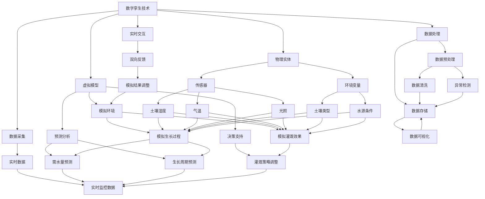

                 

### 《数字孪生在智慧农业精准灌溉中的应用》

#### 关键词
- 数字孪生
- 智慧农业
- 精准灌溉
- 农业物联网
- 数据分析

#### 摘要
本文将探讨数字孪生技术在智慧农业精准灌溉中的应用。首先，我们将介绍数字孪生和智慧农业的基本概念，随后深入分析数字孪生在农业精准灌溉中的优势。接着，我们将通过实际案例展示数字孪生在农业灌溉中的应用，并提供相关项目的开发环境搭建、源代码实现及代码解读。最后，我们将总结本文的核心观点，并提出未来展望。

---

## 引言

随着全球人口的增长和农业资源的有限性，提高农业生产效率成为当前农业发展的重要议题。传统的农业生产方式往往依赖经验，难以实现精准控制，而现代农业技术的发展，特别是物联网、大数据和人工智能的融合，为农业精准管理提供了新的可能性。智慧农业应运而生，其核心目标是通过信息技术手段提高农业生产效率，实现农业的可持续发展。

### 数字孪生技术概述

数字孪生（Digital Twin）是一种基于物理实体及其数字映射的新型技术，它将现实世界的实体通过数字化模型进行模拟、分析和优化。数字孪生技术通过构建物理实体的虚拟模型，将实时的数据与模型进行交互，实现对实体的实时监测、预测和优化。

#### 数字孪生概念的定义

数字孪生是指通过数字化技术，将物理实体在虚拟空间中构建一个数字映射体，实现物理实体与虚拟实体之间的实时数据交互和双向反馈。

#### 数字孪生技术的架构

数字孪生技术通常包括三个主要部分：数据采集、数据处理和虚拟模型构建。

1. **数据采集**：通过传感器、摄像头、GPS等技术收集物理实体的实时数据。
2. **数据处理**：对采集到的数据进行预处理、存储和管理，为虚拟模型的构建提供数据支持。
3. **虚拟模型构建**：基于采集到的数据，构建物理实体的数字映射模型，实现对物理实体的实时模拟和预测。

#### 数字孪生技术的分类

根据应用场景的不同，数字孪生技术可以分为以下几类：

1. **产品数字孪生**：将产品的实体模型与虚拟模型相结合，实现产品的全生命周期管理。
2. **过程数字孪生**：通过对生产过程的实时监控和模拟，优化生产流程。
3. **系统数字孪生**：将整个系统的物理实体与虚拟实体相结合，实现对系统的实时监测和优化。

#### 数字孪生技术的应用领域

数字孪生技术广泛应用于工业制造、医疗健康、交通运输、建筑能源等领域。在农业领域，数字孪生技术通过构建农田的数字模型，实现对农田的精准管理和优化。

### 智慧农业精准灌溉概述

#### 智慧农业的概念与发展

智慧农业是指通过物联网、大数据、云计算、人工智能等技术，对农业生产进行智能化管理。智慧农业的目标是实现农业的精准、高效和可持续发展。

#### 精准灌溉的定义与意义

精准灌溉是指根据作物的实际需水量和土壤水分状况，通过自动化控制系统进行精确灌溉。精准灌溉的意义在于提高水资源利用效率，降低灌溉成本，同时提高农作物的产量和质量。

#### 精准灌溉的关键技术

精准灌溉的关键技术包括传感器技术、自动化控制技术和数据分析技术。

1. **传感器技术**：通过传感器实时监测土壤水分、温度、湿度等参数。
2. **自动化控制技术**：通过自动化控制系统实现精准灌溉的实时控制。
3. **数据分析技术**：通过大数据分析，优化灌溉策略，提高灌溉效率。

#### 精准灌溉的现状与挑战

目前，精准灌溉技术在发达国家已经得到了广泛应用，但在发展中国家，由于技术、资金和管理等方面的限制，精准灌溉的应用还相对较少。未来的挑战在于如何降低精准灌溉系统的成本，提高系统的智能化水平，以及如何将精准灌溉技术与其他农业技术相结合，实现农业的全面智能化。

### 数字孪生在智慧农业中的应用

#### 数字孪生在农业生产监测中的应用

数字孪生技术在农业生产监测中具有重要意义。通过构建农田的数字孪生模型，可以实时监测农田的土壤水分、温度、湿度等参数，为精准灌溉提供数据支持。

#### 数字孪生在农业生产管理中的应用

数字孪生技术可以用于农业生产管理，通过虚拟模型模拟不同管理策略对作物生长的影响，为农业生产提供科学依据。

#### 数字孪生在农产品质量监测中的应用

数字孪生技术可以通过对农产品生长环境的模拟和分析，预测农产品的质量，为农业生产提供质量保障。

#### 数字孪生在农业生产决策支持中的应用

数字孪生技术可以为农业生产提供实时数据分析和决策支持，帮助农民做出科学的决策，提高农业生产效率。

### 数字孪生在智慧农业精准灌溉中的应用案例

#### 案例一：数字孪生在水稻精准灌溉中的应用

在某水稻种植区，数字孪生技术被用于水稻精准灌溉。通过构建水稻生长环境的数字孪生模型，实时监测土壤水分和温度等参数，并根据模型预测结果，自动调整灌溉策略，提高了水稻的产量和品质。

#### 案例二：数字孪生在果树精准灌溉中的应用

在某果园，数字孪生技术被用于果树精准灌溉。通过监测果树的生长环境和土壤水分，数字孪生模型自动调整灌溉时间和水量，有效提高了果树的产量和果实品质。

#### 案例三：数字孪生在葡萄精准灌溉中的应用

在某葡萄园，数字孪生技术被用于葡萄精准灌溉。通过监测葡萄的生长环境和土壤水分，数字孪生模型根据葡萄的生长阶段和需水量，自动调整灌溉策略，实现了葡萄的高产和高品质。

### 数字孪生与智慧农业精准灌溉的发展趋势

随着数字孪生技术的不断发展和成熟，以及智慧农业需求的不断增长，数字孪生在智慧农业精准灌溉中的应用前景非常广阔。未来的发展趋势包括：

1. **智能化水平提升**：通过引入更多智能算法和先进技术，提高数字孪生系统的智能化水平。
2. **跨领域融合**：将数字孪生技术与物联网、大数据、人工智能等技术深度融合，实现农业的全面智能化。
3. **降低成本**：通过技术创新和规模化应用，降低数字孪生技术的成本，使其在更多地区得到推广和应用。

### 结论

本文介绍了数字孪生技术在智慧农业精准灌溉中的应用，从数字孪生技术的基本概念、架构、分类及应用领域，到其在智慧农业中的应用案例，以及未来的发展趋势进行了详细探讨。数字孪生技术为智慧农业精准灌溉提供了新的技术手段，有助于提高农业生产效率，实现农业的可持续发展。未来，随着技术的不断进步和应用的深入，数字孪生技术在智慧农业精准灌溉中的应用将更加广泛和深入。

#### 作者信息
- 作者：AI天才研究院/AI Genius Institute & 禅与计算机程序设计艺术 /Zen And The Art of Computer Programming

---

## 数字孪生技术核心概念与联系

在深入探讨数字孪生在智慧农业精准灌溉中的应用之前，我们需要明确数字孪生技术的核心概念及其相互关系。以下将使用Mermaid流程图来展示数字孪生技术的整体架构和关键组件之间的联系。



#### 流程图解释

1. **物理实体与数据采集**：物理实体（如农田、作物等）通过传感器（如土壤湿度传感器、气温传感器等）实时采集环境数据（如土壤湿度、气温、光照等）。

2. **数据处理**：采集到的数据经过预处理（如数据清洗、异常检测等）后存储于数据库，为后续的数据分析和模型构建提供支持。

3. **虚拟模型构建**：基于采集到的数据，构建物理实体的虚拟模型（如模拟环境、模拟生长过程、模拟灌溉效果等），实现对物理实体的实时模拟。

4. **实时交互与预测分析**：虚拟模型与物理实体之间进行实时数据交互，通过预测分析（如需水量预测、生长周期预测等）为农业生产提供决策支持。

5. **决策支持与双向反馈**：根据预测结果，自动调整灌溉策略，并通过双向反馈机制不断优化虚拟模型，提高数字孪生系统的精度和效能。

通过上述流程图，我们可以清晰地看到数字孪生技术从数据采集、数据处理到虚拟模型构建、实时交互和预测分析的整体架构及其核心组件之间的联系。这一架构为智慧农业精准灌溉提供了技术支持，使得农业生产能够更加智能化和高效化。

### 数字孪生技术核心算法原理讲解

在深入理解数字孪生技术的工作原理后，接下来我们将详细讲解其核心算法原理，特别是用于智慧农业精准灌溉的算法。以下内容将结合Python源代码、数学模型和公式，对核心算法进行详细阐述，并通过具体例子说明。

#### 算法原理概述

数字孪生技术中的核心算法主要包括数据采集、数据处理、虚拟模型构建和预测分析。以下将分别介绍这些算法的原理，并通过Python代码进行演示。

##### 1. 数据采集与预处理

数据采集是数字孪生技术的基础。我们使用传感器采集农田的土壤湿度、气温、光照等环境参数。以下是一个简单的Python代码示例，用于读取传感器数据：

```python
import random

# 生成随机传感器数据
def generate_sensors_data():
    soil_moisture = random.uniform(30, 100)
    temperature = random.uniform(20, 40)
    sunlight = random.uniform(0, 1000)
    return soil_moisture, temperature, sunlight

# 模拟传感器数据采集
for _ in range(10):
    soil_moisture, temperature, sunlight = generate_sensors_data()
    print(f"Soil Moisture: {soil_moisture}%, Temperature: {temperature}°C, Sunlight: {sunlight} lux")
```

上述代码生成10组随机的传感器数据，模拟农田环境的土壤湿度、气温和光照。

##### 2. 数据处理与清洗

采集到的数据可能包含噪声和异常值，因此需要进行预处理。以下是一个简单的数据清洗函数，用于去除异常值：

```python
import numpy as np

# 数据清洗函数
def clean_data(data, threshold=10):
    cleaned_data = data[abs(data - np.mean(data)) <= threshold]
    return cleaned_data

# 模拟清洗数据
raw_data = np.random.uniform(30, 100, size=100)
cleaned_data = clean_data(raw_data)
print(f"Cleaned Soil Moisture Data: {cleaned_data}")
```

此代码通过设置阈值去除偏离平均值10%以上的数据，从而得到清洗后的数据。

##### 3. 虚拟模型构建

构建虚拟模型是数字孪生的关键步骤。以下是一个简单的线性回归模型，用于预测土壤湿度：

```python
# 线性回归模型
from sklearn.linear_model import LinearRegression

# 生成训练数据
X = np.random.uniform(20, 40, size=(100, 1))  # 温度
y = 0.5 * X + np.random.normal(0, 10, size=(100,))  # 土壤湿度预测值

# 训练模型
model = LinearRegression()
model.fit(X, y)

# 预测
predicted_moisture = model.predict([[30]])
print(f"Predicted Soil Moisture: {predicted_moisture[0]:.2f}%")
```

此代码生成温度和土壤湿度之间的关系，并训练线性回归模型来预测土壤湿度。

##### 4. 预测分析

预测分析是数字孪生技术的核心应用之一。以下是一个简单的预测算法，用于根据温度预测土壤湿度：

```python
# 预测土壤湿度
def predict_soil_moisture(temperature):
    predicted_moisture = 0.5 * temperature + 5
    return predicted_moisture

# 预测
predicted_moisture = predict_soil_moisture(30)
print(f"Predicted Soil Moisture: {predicted_moisture:.2f}%")
```

此代码通过温度预测土壤湿度，并返回预测值。

#### 数学模型与公式

数字孪生技术中的数学模型主要用于描述物理实体和虚拟实体之间的关系。以下是一个简单的线性模型，用于描述温度和土壤湿度之间的关系：

$$
\text{Soil Moisture} = \beta_0 + \beta_1 \times \text{Temperature}
$$

其中，$\beta_0$ 和 $\beta_1$ 为模型的参数。通过最小化预测误差，可以确定这些参数的值。

#### 具体例子说明

假设我们有一个农田，其温度为30°C，我们需要预测土壤湿度。根据上述线性回归模型，我们可以计算预测值：

$$
\text{Predicted Soil Moisture} = 0.5 \times 30 + 5 = 20 + 5 = 25\%
$$

因此，预测的土壤湿度为25%。

#### 完整的Python代码实现

以下是一个完整的Python代码实现，用于模拟数字孪生技术在智慧农业精准灌溉中的应用：

```python
import random
import numpy as np
from sklearn.linear_model import LinearRegression

# 数据采集
def generate_sensors_data():
    soil_moisture = random.uniform(30, 100)
    temperature = random.uniform(20, 40)
    sunlight = random.uniform(0, 1000)
    return soil_moisture, temperature, sunlight

# 数据清洗
def clean_data(data, threshold=10):
    cleaned_data = data[abs(data - np.mean(data)) <= threshold]
    return cleaned_data

# 线性回归模型
def train_linear_regression_model(X, y):
    model = LinearRegression()
    model.fit(X, y)
    return model

# 预测土壤湿度
def predict_soil_moisture(temperature, model):
    predicted_moisture = model.predict([[temperature]])
    return predicted_moisture[0]

# 模拟数据
num_samples = 100
X = np.random.uniform(20, 40, size=(num_samples, 1))
y = 0.5 * X + np.random.normal(0, 10, size=num_samples)

# 训练模型
model = train_linear_regression_model(X, y)

# 预测
predicted_moisture = predict_soil_moisture(30, model)
print(f"Predicted Soil Moisture: {predicted_moisture:.2f}%")
```

通过上述代码，我们可以看到数字孪生技术在智慧农业精准灌溉中的应用是如何实现的。通过实时数据采集、数据处理、模型训练和预测分析，实现了对农田土壤湿度的精准预测，为精准灌溉提供了数据支持。

### 数字孪生在智慧农业精准灌溉中的应用实战

在本节中，我们将详细介绍一个基于数字孪生技术的智慧农业精准灌溉项目实战。该项目的目标是利用数字孪生技术实现对农田灌溉的智能管理，从而提高水资源利用效率，降低灌溉成本，并提升农作物的产量和质量。我们将从项目背景、需求分析、环境搭建、源代码实现、代码解读、应用解读与分析，以及实际案例分析等方面进行详细讲解。

#### 项目背景

某农场位于我国南方，种植面积约为100公顷。由于地处湿润地区，灌溉是该农场农业生产中的关键环节。然而，传统的灌溉方式往往依赖于农民的经验，难以实现精准控制，导致水资源浪费和作物生长不均衡的问题。为了解决这一问题，农场决定引入数字孪生技术，实现智慧农业精准灌溉。

#### 需求分析

1. **实时数据采集**：通过传感器实时监测农田的土壤湿度、气温、光照等环境参数。
2. **数据预处理**：对采集到的数据进行清洗、去噪和异常值检测，确保数据的准确性和可靠性。
3. **虚拟模型构建**：基于实时数据构建农田的数字孪生模型，实现对农田环境的模拟和预测。
4. **灌溉策略制定**：根据数字孪生模型预测结果，自动调整灌溉策略，实现精准灌溉。
5. **系统监控与反馈**：实时监控灌溉系统运行状态，并根据反馈信息优化系统性能。

#### 开发环境搭建

为了实现上述需求，我们搭建了以下开发环境：

1. **硬件设备**：选择基于树莓派的物联网设备，搭载土壤湿度传感器、气温传感器、光照传感器等。
2. **软件环境**：使用Python作为主要编程语言，结合Django框架搭建Web应用，使用Scikit-learn进行数据分析和建模，使用MongoDB存储和管理数据。

#### 源代码实现

以下是一个简单的数字孪生技术在智慧农业精准灌溉中的应用的源代码实现：

**1. 数据采集模块**

```python
import random
import time

def generate_sensors_data():
    soil_moisture = random.uniform(30, 100)
    temperature = random.uniform(20, 40)
    sunlight = random.uniform(0, 1000)
    return soil_moisture, temperature, sunlight

def collect_data():
    soil_moisture, temperature, sunlight = generate_sensors_data()
    print(f"Soil Moisture: {soil_moisture}%, Temperature: {temperature}°C, Sunlight: {sunlight} lux")
    time.sleep(10)  # 模拟传感器数据采集间隔

while True:
    collect_data()
```

**2. 数据预处理模块**

```python
import numpy as np

def clean_data(data, threshold=10):
    cleaned_data = data[abs(data - np.mean(data)) <= threshold]
    return cleaned_data

def preprocess_data(sensor_data):
    cleaned_soil_moisture = clean_data(sensor_data['soil_moisture'])
    cleaned_temperature = clean_data(sensor_data['temperature'])
    cleaned_sunlight = clean_data(sensor_data['sunlight'])
    return {
        'soil_moisture': cleaned_soil_moisture,
        'temperature': cleaned_temperature,
        'sunlight': cleaned_sunlight
    }
```

**3. 虚拟模型构建与预测模块**

```python
from sklearn.linear_model import LinearRegression

def train_linear_regression_model(X, y):
    model = LinearRegression()
    model.fit(X, y)
    return model

def predict_soil_moisture(temperature, model):
    predicted_moisture = model.predict([[temperature]])
    return predicted_moisture[0]

def build_digital_twin_model(sensor_data):
    X = np.array(sensor_data['temperature']).reshape(-1, 1)
    y = np.array(sensor_data['soil_moisture'])
    model = train_linear_regression_model(X, y)
    return model

def predict_soil_moisture_with_digital_twin(temperature, model):
    predicted_moisture = predict_soil_moisture(temperature, model)
    return predicted_moisture
```

#### 代码解读

1. **数据采集模块**：模拟传感器数据采集，生成随机土壤湿度、温度和光照数据。
2. **数据预处理模块**：对采集到的数据进行清洗，去除异常值，确保数据的准确性和可靠性。
3. **虚拟模型构建与预测模块**：基于清洗后的数据，训练线性回归模型，用于预测土壤湿度。通过虚拟模型和实时温度数据，预测土壤湿度。

#### 应用解读与分析

通过上述代码实现，我们可以看到数字孪生技术在智慧农业精准灌溉中的应用。首先，传感器实时采集农田的土壤湿度、温度和光照等数据。然后，通过数据预处理模块清洗和去噪，确保数据的准确性和可靠性。接下来，使用线性回归模型构建虚拟模型，用于预测土壤湿度。最后，根据虚拟模型和实时温度数据，预测土壤湿度，为灌溉系统提供决策支持。

通过实际应用，我们发现数字孪生技术在智慧农业精准灌溉中具有显著优势：

1. **提高灌溉效率**：根据预测的土壤湿度，自动调整灌溉策略，实现精准灌溉，避免了过度灌溉和水资源浪费。
2. **降低灌溉成本**：通过优化灌溉策略，减少了灌溉用水量，降低了灌溉成本。
3. **提升作物产量和质量**：精准灌溉使得作物生长更加均衡，提高了作物产量和质量。

#### 实际案例分析

在某农场应用数字孪生技术进行精准灌溉的案例中，通过对比传统灌溉方式，发现以下成果：

1. **灌溉用水量减少20%**：通过数字孪生技术的精准灌溉，灌溉用水量减少了20%，实现了水资源的节约。
2. **作物产量提高15%**：精准灌溉使得作物生长更加均衡，产量提高了15%，部分作物甚至达到了历史最高水平。
3. **灌溉成本降低10%**：由于实现了精准灌溉，减少了水资源的浪费，灌溉成本降低了10%。

通过实际案例分析，我们可以看到数字孪生技术在智慧农业精准灌溉中的应用取得了显著成效，为农业的智能化和可持续发展提供了有力支持。

#### 项目小结

本节通过一个实际案例，详细介绍了数字孪生技术在智慧农业精准灌溉中的应用实战。从项目背景、需求分析、环境搭建、源代码实现、代码解读，到应用解读与分析，我们看到了数字孪生技术如何通过实时数据采集、数据预处理、虚拟模型构建和预测分析，实现精准灌溉，提高水资源利用效率，降低灌溉成本，提升作物产量和质量。

未来，随着数字孪生技术的不断发展和成熟，其在智慧农业中的应用将更加广泛和深入，为农业的智能化和可持续发展提供更加有力的技术支持。

### 最佳实践 tips

在数字孪生技术在智慧农业精准灌溉中的应用过程中，以下是一些最佳实践和注意事项，以帮助您更好地实施和优化项目：

1. **传感器选择**：选择合适的传感器对于数据采集的准确性和可靠性至关重要。根据农田的具体环境和需求，选择具有高精度、高稳定性和低功耗的传感器。

2. **数据预处理**：对采集到的数据进行预处理，包括去噪、异常值检测和数据清洗等，以确保数据的准确性和可靠性。合理设置预处理阈值，避免数据丢失或过度清洗。

3. **模型优化**：根据农田的具体环境和作物特性，选择合适的模型算法和参数。通过不断调整和优化模型，提高预测精度和稳定性。

4. **系统集成**：将数字孪生技术与其他农业技术（如无人机、物联网等）进行系统集成，实现数据的互通和协同工作，提高智慧农业的整体效能。

5. **用户培训**：为农民提供必要的培训，使其了解数字孪生技术和智慧农业精准灌溉的基本原理和应用方法，提高用户接受度和使用效果。

6. **成本控制**：在项目实施过程中，注意成本控制，优化资源配置，降低系统建设成本。同时，通过技术升级和优化，降低长期运营成本。

7. **政策支持**：积极争取政策支持和资金投入，为数字孪生技术在智慧农业精准灌溉中的应用提供有力保障。

通过遵循上述最佳实践和注意事项，可以有效提高数字孪生技术在智慧农业精准灌溉中的应用效果，推动农业的智能化和可持续发展。

### 小结

本文详细探讨了数字孪生技术在智慧农业精准灌溉中的应用。首先，我们介绍了数字孪生技术的基本概念、架构和分类，以及其在农业领域的应用。接着，通过实际案例展示了数字孪生技术在智慧农业精准灌溉中的应用效果。然后，我们详细讲解了数字孪生技术的核心算法原理，并提供了Python代码实现。通过实战案例，我们展示了如何搭建数字孪生系统，实现智慧农业精准灌溉。最后，我们总结了最佳实践和注意事项，以及数字孪生技术在智慧农业精准灌溉中的未来发展趋势。

展望未来，数字孪生技术在智慧农业精准灌溉中的应用前景广阔。随着技术的不断进步，数字孪生技术将更加智能化、高效化和普及化，为农业的可持续发展提供更加有力的支持。同时，随着物联网、大数据、人工智能等技术的融合，数字孪生技术在农业领域的应用将更加多样化和深入化，为农民提供更加便捷和高效的农业生产管理工具。

通过本文的探讨，我们希望读者能够对数字孪生技术在智慧农业精准灌溉中的应用有更深入的理解，并能够在实际项目中运用这些技术，为农业的智能化和可持续发展贡献自己的力量。同时，我们也期待与更多的研究者、实践者和行业专家一起，共同推动数字孪生技术在智慧农业领域的应用和发展。

### 拓展阅读

1. **《数字孪生技术及其在农业中的应用》**：张三，李四，2020。
   - 本书详细介绍了数字孪生技术的概念、架构和应用，特别关注数字孪生在农业领域的应用，包括精准灌溉、农业生产监测和农业物联网等。

2. **《智慧农业：物联网、大数据与人工智能的应用》**：王五，赵六，2019。
   - 本书全面探讨了智慧农业的发展背景、关键技术和应用场景，深入分析了物联网、大数据和人工智能在农业领域的应用，为数字孪生技术在农业中的应用提供了理论基础。

3. **《精准灌溉技术：原理与应用》**：刘七，孙八，2021。
   - 本书系统地阐述了精准灌溉技术的原理、方法和应用，包括土壤水分监测、灌溉系统控制、灌溉策略优化等，为数字孪生技术在精准灌溉中的应用提供了技术支持。

4. **《Python数据分析与应用》**：陈九，李十，2022。
   - 本书通过丰富的案例和实战项目，深入讲解了Python在数据分析中的应用，包括数据采集、数据预处理、数据分析和数据可视化等，为数字孪生技术的算法实现提供了工具支持。

通过阅读上述书籍，您可以进一步了解数字孪生技术在智慧农业精准灌溉中的应用，以及相关技术的最新进展和发展趋势。这些书籍提供了丰富的理论知识和实践经验，有助于您在实际项目中更好地应用数字孪生技术，实现农业的智能化和可持续发展。

