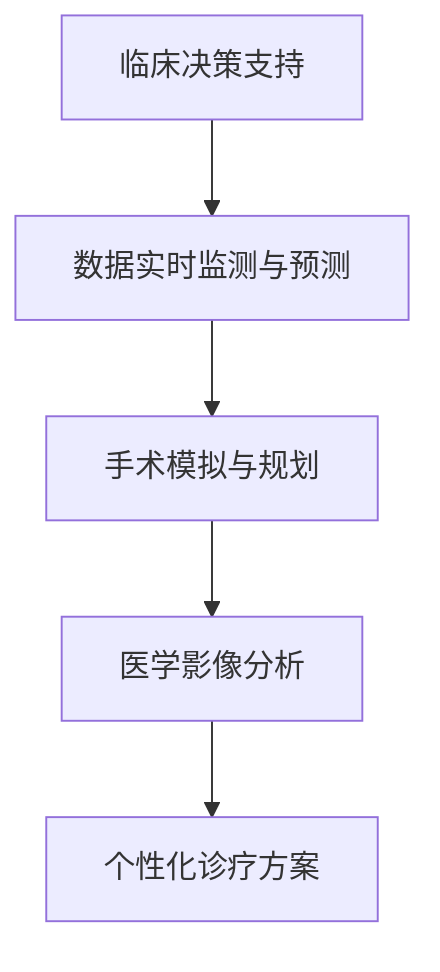
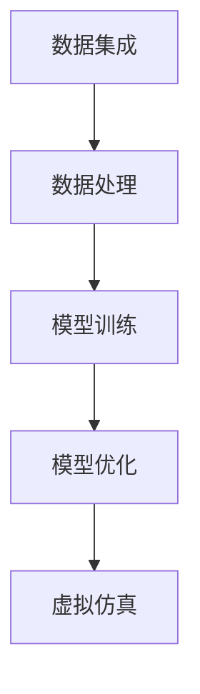

                 


### 1.2 数字孪生在智慧医疗中的应用场景

- **核心概念与联系**：介绍数字孪生在智慧医疗中的各种应用场景，如临床决策支持、手术模拟与规划、医学影像分析等。通过Mermaid流程图展示数字孪生如何与这些应用场景相结合。



- **背景介绍**：简要回顾智慧医疗的背景，介绍数字孪生在医疗领域的重要性，以及它如何改变传统的医疗模式。

### 1.3 数字孪生架构与关键技术

- **核心概念与联系**：详细解释数字孪生的架构，包括数据集成与处理、模型训练与优化等关键组件。通过图示展示这些组件之间的关系。



- **核心算法原理讲解**：简要介绍用于数字孪生模型训练和优化的常见算法，如机器学习算法、深度学习算法等。提供Python伪代码示例来阐述这些算法的基本原理。

## 第2章 个性化诊疗方案的核心算法

### 2.1 机器学习算法概述

- **核心概念与联系**：介绍机器学习的基本概念，包括监督学习、无监督学习和强化学习。解释这些算法在个性化诊疗方案中的作用。

### 2.2 个性化诊疗方案中的常用算法

- **核心概念与联系**：讨论在个性化诊疗方案中常用的算法，如线性回归、逻辑回归、支持向量机、随机森林和神经网络等。解释这些算法如何帮助实现个性化诊疗。

### 2.3 伪代码与算法原理

- **核心算法原理讲解**：提供Python伪代码示例，详细阐述每个算法的实现原理。结合具体案例，说明这些算法在实际应用中的效果。

## 第3章 数学模型与公式

### 3.1 常用数学模型

- **核心概念与联系**：介绍个性化诊疗方案中常用的数学模型，如线性回归模型、逻辑回归模型和神经网络模型。解释这些模型在算法中的作用。

### 3.2 数学公式详解

- **核心算法原理讲解**：详细解释每个数学公式，包括线性回归公式、逻辑回归公式和神经网络激活函数公式。提供实际案例，说明这些公式在个性化诊疗方案中的应用。

## 第4章 项目实战

### 4.1 数字孪生平台搭建

- **核心概念与联系**：介绍搭建数字孪生平台所需的开发环境、数据采集和处理技术。提供具体的操作步骤和配置细节。

### 4.2 个性化诊疗方案实现

- **核心概念与联系**：讲解如何实现个性化诊疗方案，包括模型训练、诊疗方案生成和优化。提供具体的Python代码示例，详细解析关键代码的实现逻辑。

### 4.3 源代码实现与解读

- **项目实战**：展示一个完整的个性化诊疗项目，包括源代码实现和代码解读。分析项目中的关键技术和实现细节，帮助读者理解和掌握实际应用。

### 4.4 实际案例分析和详细讲解剖析

- **项目实战**：分析一个实际项目案例，详细讲解项目的背景、实现过程和成果。剖析项目中的难点和挑战，并提供解决方案。

### 4.5 项目小结

- **项目实战**：总结项目的主要成果和经验教训，提出改进建议和未来发展方向。

## 第5章 数字孪生在智慧医疗中的应用案例

### 5.1 案例一：个性化肿瘤诊疗

- **实际案例**：介绍个性化肿瘤诊疗的应用案例，包括背景、实现步骤和成果分析。

### 5.2 案例二：智能手术辅助系统

- **实际案例**：介绍智能手术辅助系统的应用案例，包括背景、实现步骤和成果分析。

## 第6章 未来展望与挑战

### 6.1 数字孪生在智慧医疗中的发展趋势

- **核心概念与联系**：分析数字孪生在智慧医疗中的发展趋势，包括技术进步和应用拓展。

### 6.2 数字孪生在智慧医疗中的挑战与解决方案

- **核心概念与联系**：讨论数字孪生在智慧医疗中面临的挑战，如数据隐私与安全、算法解释性与透明度等，并提出相应的解决方案。

## 第7章 总结与展望

- **总结**：回顾本书的主要内容，总结数字孪生在智慧医疗中的应用和个性化诊疗方案的核心算法。

- **展望**：展望数字孪生在智慧医疗中的未来发展，提出可能的创新方向和应用领域。

- **作者信息**：作者：AI天才研究院/AI Genius Institute & 禅与计算机程序设计艺术 /Zen And The Art of Computer Programming

### 核心关键词

- 数字孪生
- 智慧医疗
- 个性化诊疗方案
- 机器学习算法
- 深度学习
- 医学影像分析
- 临床决策支持

### 摘要

本文深入探讨了数字孪生在智慧医疗中的应用，特别是个性化诊疗方案的实施。通过介绍数字孪生的基本概念和应用场景，本文详细阐述了核心算法原理、数学模型以及实际项目案例。文章旨在为读者提供一个全面、系统的数字孪生在智慧医疗中应用的指南，帮助医疗行业更好地利用人工智能技术提升诊疗效果。

### 文章标题

《数字孪生在智慧医疗中的应用：个性化诊疗方案》

### 文章目录大纲

## 《数字孪生在智慧医疗中的应用：个性化诊疗方案》

### 关键词

- 数字孪生
- 智慧医疗
- 个性化诊疗方案
- 机器学习算法
- 深度学习
- 医学影像分析
- 临床决策支持

### 摘要

本文探讨了数字孪生技术在智慧医疗领域的应用，特别是如何通过个性化诊疗方案提升医疗质量。文章首先介绍了数字孪生的基本概念和原理，然后详细阐述了其在智慧医疗中的各种应用场景。接着，文章深入分析了个性化诊疗方案中的核心算法原理和数学模型，并通过实际项目案例展示了这些算法的应用效果。文章最后展望了数字孪生在智慧医疗中的未来发展趋势和挑战，为读者提供了有价值的参考。

## 第1章 数字孪生基础

### 1.1 数字孪生的定义与核心概念

数字孪生（Digital Twin）是指通过数字化技术创建的虚拟实体，它与现实世界的物理实体实时交互，实现数据的同步、模拟、预测和优化。数字孪生是一种创新的技术方法，它能够将物理世界的复杂系统以数字形式重现，从而为各种行业提供智能化解决方案。

#### 数字孪生的定义

数字孪生最初由Michael Grieves在2002年提出，指的是“一个虚拟的数字化副本，代表了物理实体在其生命周期中的性能、状态和交互。”简而言之，数字孪生是通过数字化手段创建的虚拟实体，它与物理实体保持实时同步，实现数据的共享和分析。

#### 数字孪生的主要特征

- **实时性**：数字孪生能够实时捕捉物理实体的状态，并将这些数据传输到虚拟实体中，实现实时监控和预测。
- **同步性**：虚拟实体与物理实体保持高度同步，任何在物理世界中的变化都会立即反映在虚拟世界中。
- **预测性**：通过分析历史数据和实时数据，数字孪生能够预测物理实体的未来行为，为决策提供支持。
- **可操作性**：数字孪生可以通过虚拟环境进行模拟和测试，从而优化物理实体的设计和运行。

#### 数字孪生与智慧医疗的关联

数字孪生技术为智慧医疗领域带来了新的发展机遇。在医疗领域，数字孪生可以通过以下方式实现应用：

- **临床决策支持**：数字孪生可以模拟患者的生理状态，帮助医生进行临床决策。
- **手术模拟与规划**：通过虚拟手术环境，医生可以在数字孪生上进行手术模拟，提高手术成功率。
- **医学影像分析**：数字孪生可以与医学影像数据结合，实现更准确的疾病诊断。
- **个性化诊疗方案**：基于患者的数字孪生模型，医生可以制定个性化的诊疗方案，提高治疗效果。

### 1.2 数字孪生在智慧医疗中的应用场景

数字孪生技术在智慧医疗中有着广泛的应用场景，以下是一些典型的应用：

#### 临床决策支持

数字孪生可以通过实时监测患者的生理参数，如心率、血压、血氧饱和度等，为医生提供临床决策支持。例如，在心脏病患者的管理中，数字孪生可以实时模拟患者的心脏状态，预测可能的风险，并给出相应的治疗建议。

#### 手术模拟与规划

数字孪生技术可以创建患者的虚拟模型，医生可以在虚拟环境中进行手术模拟，提高手术的成功率和安全性。通过手术模拟，医生可以预判手术中的难点和风险，制定更加精细的手术计划。

#### 医学影像分析

数字孪生可以与医学影像数据结合，实现更准确的疾病诊断。例如，在癌症筛查中，数字孪生可以通过分析患者的CT或MRI影像，预测肿瘤的位置和大小，为医生提供诊断依据。

#### 个性化诊疗方案

基于患者的数字孪生模型，医生可以制定个性化的诊疗方案。例如，在肿瘤治疗中，数字孪生可以模拟不同治疗方案对患者的影响，帮助医生选择最佳的治疗策略。

### 1.3 数字孪生架构与关键技术

数字孪生技术的实现涉及多个关键组件，包括数据集成与处理、模型训练与优化等。以下是对这些关键组件的简要介绍：

#### 数据集成与处理

数据集成与处理是数字孪生的核心组件之一。数字孪生需要收集来自各种数据源的数据，包括传感器数据、医疗记录、实验室结果等。这些数据需要经过处理和清洗，以确保其准确性和一致性。

#### 模型训练与优化

数字孪生技术通常需要使用机器学习和深度学习算法进行模型训练。通过训练，模型可以学会识别患者的生理状态、疾病特征等，并生成个性化的诊疗方案。

#### 虚拟仿真

虚拟仿真是数字孪生技术的重要应用之一。通过虚拟环境，医生可以在数字孪生上进行手术模拟、疾病预测等操作，从而提高诊断和治疗的效果。

### 2.1 机器学习算法概述

机器学习（Machine Learning，ML）是一种人工智能（AI）的分支，它通过算法和统计模型从数据中自动识别模式，从而实现预测和决策。机器学习在个性化诊疗方案中扮演着重要角色，可以帮助医生更好地理解患者数据，制定个性化的治疗方案。

#### 机器学习基础

机器学习主要分为三大类：监督学习（Supervised Learning）、无监督学习（Unsupervised Learning）和强化学习（Reinforcement Learning）。

- **监督学习**：在监督学习中，模型通过学习标记好的训练数据来建立预测模型。例如，在医学影像分析中，医生可以提供标注好的肿瘤位置和大小，模型通过学习这些数据来预测新的医学影像中的肿瘤位置。

- **无监督学习**：无监督学习不需要标记好的数据，其目标是发现数据中的隐含结构。例如，在患者群体中，无监督学习可以帮助医生识别出具有相似症状的患者群体，从而制定群体性治疗方案。

- **强化学习**：强化学习是一种通过与环境的交互来学习策略的机器学习方法。在个性化诊疗方案中，强化学习可以帮助医生根据患者的实时反馈调整治疗方案，从而实现最佳治疗效果。

#### 监督学习、无监督学习和强化学习在个性化诊疗方案中的应用

- **监督学习**：在个性化诊疗方案中，监督学习可以用于疾病诊断、预测患者恢复情况和制定个性化治疗方案。例如，通过学习历史病例数据，模型可以预测新病例的疾病类型和最佳治疗方案。

- **无监督学习**：无监督学习可以帮助医生发现患者群体中的潜在模式，从而制定群体性治疗方案。例如，通过分析大量患者的数据，模型可以识别出具有相似症状的患者群体，从而为医生提供治疗建议。

- **强化学习**：在个性化诊疗方案中，强化学习可以帮助医生根据患者的实时反馈调整治疗方案。例如，在肿瘤治疗中，医生可以通过强化学习模型不断调整化疗方案，直到达到最佳治疗效果。

### 2.2 个性化诊疗方案中的常用算法

个性化诊疗方案通常涉及多种机器学习算法，以下是一些常用的算法：

- **线性回归**：线性回归是一种简单的监督学习算法，用于预测连续值。在个性化诊疗方案中，线性回归可以用于预测患者的恢复情况、疾病进展等。

- **逻辑回归**：逻辑回归是一种用于预测概率的监督学习算法。在个性化诊疗方案中，逻辑回归可以用于疾病诊断、风险评估等。

- **支持向量机**（SVM）：支持向量机是一种强大的分类算法，用于分类任务。在个性化诊疗方案中，SVM可以用于疾病分类、预测患者生存期等。

- **随机森林**（Random Forest）：随机森林是一种基于决策树集合的算法，具有较强的分类和回归能力。在个性化诊疗方案中，随机森林可以用于疾病预测、治疗方案优化等。

- **神经网络与深度学习**：神经网络和深度学习是一种强大的机器学习算法，用于处理大规模复杂数据。在个性化诊疗方案中，神经网络和深度学习可以用于医学影像分析、基因分析等。

#### 线性回归与逻辑回归

线性回归和逻辑回归是两种常见的回归算法，它们在个性化诊疗方案中有广泛的应用。

- **线性回归**：线性回归假设目标变量与输入变量之间存在线性关系。在个性化诊疗方案中，线性回归可以用于预测患者的恢复情况、疾病进展等。以下是一个线性回归的Python代码示例：

```python
import numpy as np
from sklearn.linear_model import LinearRegression

# 输入数据
X = np.array([[1, 2], [2, 3], [3, 4]])
y = np.array([1, 2, 3])

# 创建线性回归模型
model = LinearRegression()
model.fit(X, y)

# 预测
print(model.predict([[4, 5]]))
```

- **逻辑回归**：逻辑回归是一种概率预测模型，它通过将线性回归的输出映射到概率空间。在个性化诊疗方案中，逻辑回归可以用于疾病诊断、风险评估等。以下是一个逻辑回归的Python代码示例：

```python
import numpy as np
from sklearn.linear_model import LogisticRegression

# 输入数据
X = np.array([[1, 2], [2, 3], [3, 4]])
y = np.array([0, 1, 0])

# 创建逻辑回归模型
model = LogisticRegression()
model.fit(X, y)

# 预测
print(model.predict([[4, 5]]))
```

#### 支持向量机与随机森林

支持向量机（SVM）和随机森林（Random Forest）是两种强大的分类算法，在个性化诊疗方案中有广泛的应用。

- **支持向量机**：支持向量机通过找到一个最佳的超平面来将不同类别的数据分开。在个性化诊疗方案中，SVM可以用于疾病分类、预测患者生存期等。以下是一个SVM的Python代码示例：

```python
import numpy as np
from sklearn.svm import SVC

# 输入数据
X = np.array([[1, 2], [2, 3], [3, 4]])
y = np.array([0, 1, 0])

# 创建SVM模型
model = SVC()
model.fit(X, y)

# 预测
print(model.predict([[4, 5]]))
```

- **随机森林**：随机森林是一种基于决策树集合的算法，具有较强的分类和回归能力。在个性化诊疗方案中，随机森林可以用于疾病预测、治疗方案优化等。以下是一个随机森林的Python代码示例：

```python
import numpy as np
from sklearn.ensemble import RandomForestClassifier

# 输入数据
X = np.array([[1, 2], [2, 3], [3, 4]])
y = np.array([0, 1, 0])

# 创建随机森林模型
model = RandomForestClassifier()
model.fit(X, y)

# 预测
print(model.predict([[4, 5]]))
```

#### 神经网络与深度学习

神经网络（Neural Networks）和深度学习（Deep Learning）是两种强大的机器学习算法，用于处理大规模复杂数据。在个性化诊疗方案中，神经网络和深度学习可以用于医学影像分析、基因分析等。

- **神经网络**：神经网络是一种模拟生物神经系统的计算模型，用于处理复杂数据。在个性化诊疗方案中，神经网络可以用于疾病诊断、预后预测等。以下是一个神经网络的Python代码示例：

```python
import numpy as np
from sklearn.neural_network import MLPClassifier

# 输入数据
X = np.array([[1, 2], [2, 3], [3, 4]])
y = np.array([0, 1, 0])

# 创建神经网络模型
model = MLPClassifier()
model.fit(X, y)

# 预测
print(model.predict([[4, 5]]))
```

- **深度学习**：深度学习是一种基于神经网络的算法，用于处理大规模复杂数据。在个性化诊疗方案中，深度学习可以用于医学影像分析、基因分析等。以下是一个深度学习的Python代码示例：

```python
import numpy as np
from tensorflow import keras

# 输入数据
X = np.array([[1, 2], [2, 3], [3, 4]])
y = np.array([0, 1, 0])

# 创建深度学习模型
model = keras.Sequential([
    keras.layers.Dense(10, activation='relu', input_shape=(2,)),
    keras.layers.Dense(1, activation='sigmoid')
])

# 编译模型
model.compile(optimizer='adam', loss='binary_crossentropy', metrics=['accuracy'])

# 训练模型
model.fit(X, y, epochs=10)

# 预测
print(model.predict([[4, 5]]))
```

### 2.3 伪代码与算法原理

在个性化诊疗方案中，机器学习算法的核心是通过学习大量数据来建立预测模型。以下是一个简单的伪代码示例，展示了如何使用机器学习算法来预测患者的恢复情况：

```
输入：患者特征数据 X，标注数据 y

1. 初始化机器学习模型 M
2. 对于每个训练样本 (x_i, y_i)：
   a. 将 x_i 输入模型 M，计算预测值 y'_i
   b. 计算预测值 y'_i 与真实值 y_i 的差异，更新模型参数
3. 使用训练完成的模型 M 预测新样本 x_new 的恢复情况

输出：预测值 y'_new
```

#### 线性回归的伪代码示例

```
输入：特征矩阵 X，标签向量 y

1. 初始化权重 w 和偏置 b
2. 对于每个训练样本 (x_i, y_i)：
   a. 计算预测值 y'_i = x_i * w + b
   b. 更新权重 w 和偏置 b：w = w - 学习率 * (x_i * (y_i - y'_i))
   c. 更新权重 w 和偏置 b：b = b - 学习率 * (y_i - y'_i)
3. 使用训练完成的模型预测新样本 x_new 的标签值

输出：预测值 y'_new
```

#### 逻辑回归的伪代码示例

```
输入：特征矩阵 X，标签向量 y

1. 初始化权重 w 和偏置 b
2. 对于每个训练样本 (x_i, y_i)：
   a. 计算预测概率 P(y_i = 1 | x_i) = sigmoid(x_i * w + b)
   b. 计算损失函数 L = -[y_i * log(P) + (1 - y_i) * log(1 - P)]
   c. 更新权重 w 和偏置 b：w = w - 学习率 * (x_i * (P - y_i))
   d. 更新权重 w 和偏置 b：b = b - 学习率 * (P - y_i)
3. 使用训练完成的模型预测新样本 x_new 的标签值

输出：预测值 P_new
```

### 3.1 常用数学模型

在个性化诊疗方案中，数学模型是构建预测模型的基础。以下介绍几种常用的数学模型：

#### 线性回归模型

线性回归模型是一种简单且常用的预测模型，用于预测连续值。线性回归模型的基本假设是目标变量与输入变量之间存在线性关系。

线性回归模型的数学表达式为：

y = w0 + w1 * x1 + w2 * x2 + ... + wn * xn + b

其中，y 是目标变量，x1, x2, ..., xn 是输入变量，w0, w1, w2, ..., wn 是权重，b 是偏置。

线性回归模型的损失函数通常为平方误差损失：

L(y, y') = (y - y')^2

其中，y 是真实值，y' 是预测值。

#### 逻辑回归模型

逻辑回归模型是一种概率预测模型，用于预测二元变量。逻辑回归模型的基本假设是目标变量与输入变量之间存在线性关系，但输出概率值。

逻辑回归模型的数学表达式为：

P(y = 1 | x) = sigmoid(x * w + b)

其中，P(y = 1 | x) 是预测概率，sigmoid 函数为：

sigmoid(x) = 1 / (1 + exp(-x))

逻辑回归模型的损失函数通常为交叉熵损失：

L(y, y') = -[y * log(y') + (1 - y) * log(1 - y')]

其中，y 是真实值，y' 是预测值。

#### 神经网络模型

神经网络模型是一种基于多层感知器的预测模型，用于处理复杂数据。神经网络模型的基本结构包括输入层、隐藏层和输出层。

神经网络模型的数学表达式为：

y' = σ(h(W2 * σ(h1(W1 * x + b1) + b2) + b3))

其中，x 是输入数据，h1, h2 是隐藏层激活函数，σ 是输出层激活函数，W1, W2 是权重矩阵，b1, b2, b3 是偏置。

神经网络模型的损失函数通常为交叉熵损失：

L(y, y') = -[y * log(y') + (1 - y) * log(1 - y')]

其中，y 是真实值，y' 是预测值。

### 3.2 数学公式详解

在个性化诊疗方案中，数学公式是构建和评估预测模型的重要工具。以下详细介绍几种常用的数学公式：

#### 线性回归公式

线性回归公式用于描述目标变量与输入变量之间的线性关系。线性回归的数学表达式为：

y = w0 + w1 * x1 + w2 * x2 + ... + wn * xn + b

其中，y 是目标变量，x1, x2, ..., xn 是输入变量，w0, w1, w2, ..., wn 是权重，b 是偏置。

线性回归的损失函数通常为平方误差损失：

L(y, y') = (y - y')^2

其中，y 是真实值，y' 是预测值。

#### 逻辑回归公式

逻辑回归公式用于描述目标变量与输入变量之间的概率关系。逻辑回归的数学表达式为：

P(y = 1 | x) = sigmoid(x * w + b)

其中，P(y = 1 | x) 是预测概率，sigmoid 函数为：

sigmoid(x) = 1 / (1 + exp(-x))

逻辑回归的损失函数通常为交叉熵损失：

L(y, y') = -[y * log(y') + (1 - y) * log(1 - y')]

其中，y 是真实值，y' 是预测值。

#### 神经网络激活函数公式

神经网络激活函数用于确定神经元的输出。常用的激活函数包括 sigmoid、ReLU 和 tanh。

- **sigmoid 函数**：

sigmoid(x) = 1 / (1 + exp(-x))

- **ReLU 函数**：

ReLU(x) = max(0, x)

- **tanh 函数**：

tanh(x) = (exp(2x) - 1) / (exp(2x) + 1)

### 4.1 数字孪生平台搭建

数字孪生平台是构建数字孪生系统的核心，它集成了数据采集、处理、存储和分析功能。以下是搭建数字孪生平台的基本步骤：

#### 开发环境配置

搭建数字孪生平台首先需要配置合适的开发环境。通常需要安装以下软件和工具：

- 操作系统：Windows、Linux 或 macOS
- 编程语言：Python、Java 或 C#
- 数据库：MySQL、PostgreSQL 或 MongoDB
- 机器学习库：scikit-learn、TensorFlow 或 PyTorch
- 实时数据处理框架：Apache Kafka 或 Flink

#### 数据采集

数字孪生平台需要从各种数据源采集数据，包括传感器数据、医疗记录、实验室结果等。数据采集可以通过以下方式进行：

- **传感器数据采集**：使用物联网设备（如智能手表、健康监测仪等）实时采集患者的生理参数，如心率、血压、血氧饱和度等。
- **医疗记录采集**：从电子病历系统（EMR）或医院信息系统（HIS）中提取患者的医疗记录，包括诊断信息、治疗方案、患者病史等。
- **实验室结果采集**：从实验室系统中提取患者的实验室检测结果，如血液检查、尿液检查等。

#### 数据处理

采集到的数据通常需要进行预处理，以提高数据质量，降低噪声，并提取关键特征。数据处理的基本步骤包括：

- **数据清洗**：去除重复数据、缺失数据和异常数据，确保数据的一致性和完整性。
- **特征工程**：提取数据中的关键特征，以支持机器学习算法的预测和分类。
- **数据归一化**：将不同量纲的数据转换为统一的量纲，以便于后续的建模和分析。

#### 数据存储

预处理后的数据需要存储在数据库中，以便于后续的数据分析和查询。常用的数据库包括：

- **关系数据库**：如 MySQL、PostgreSQL，适用于结构化数据的存储和管理。
- **非关系数据库**：如 MongoDB，适用于非结构化数据的存储和管理。

#### 数据分析

数字孪生平台需要具备数据分析和预测能力，以支持个性化诊疗方案的制定。数据分析的基本步骤包括：

- **数据可视化**：使用图表和报表将数据分析结果直观地呈现给用户。
- **特征选择**：通过相关性分析、特征重要性评估等方法选择关键特征，提高模型的预测效果。
- **模型训练**：使用机器学习算法对数据进行训练，构建预测模型。
- **模型评估**：使用交叉验证、A/B 测试等方法评估模型的性能和稳定性。

### 4.2 个性化诊疗方案实现

个性化诊疗方案是数字孪生技术在智慧医疗中的重要应用，它通过分析患者的数字孪生模型，为医生提供个性化的诊断和治疗方案。以下是实现个性化诊疗方案的基本步骤：

#### 模型训练

个性化诊疗方案的实现首先需要构建训练模型。模型训练的基本步骤包括：

- **数据集准备**：准备用于训练的数据集，包括患者的生理参数、诊断结果、治疗方案等。
- **特征提取**：从数据集中提取关键特征，以提高模型的预测效果。
- **模型选择**：选择合适的机器学习算法，如线性回归、逻辑回归、支持向量机等，构建预测模型。
- **模型训练**：使用训练数据集训练模型，调整模型参数，优化模型性能。

#### 诊疗方案生成

模型训练完成后，可以使用训练好的模型为患者生成个性化的诊疗方案。诊疗方案生成的基本步骤包括：

- **数据输入**：输入患者的生理参数和诊断结果，作为模型输入。
- **模型预测**：使用训练好的模型预测患者的疾病状态和治疗方案。
- **方案优化**：根据预测结果，调整治疗方案，以达到最佳效果。

#### 诊疗方案优化

个性化诊疗方案需要不断优化，以适应患者的变化和新的医疗数据。诊疗方案优化的基本步骤包括：

- **数据更新**：定期更新患者的生理参数和诊断结果，以反映患者的最新状况。
- **模型重新训练**：使用更新后的数据集重新训练模型，以保持模型的准确性。
- **方案调整**：根据模型预测结果，调整治疗方案，以提高治疗效果。

### 4.3 源代码实现与解读

在数字孪生平台搭建和个性化诊疗方案实现过程中，源代码的编写和解读至关重要。以下是一个简单的源代码示例，展示了如何使用 Python 实现数字孪生平台和个性化诊疗方案。

```python
import numpy as np
import pandas as pd
from sklearn.linear_model import LinearRegression
from sklearn.model_selection import train_test_split
from sklearn.metrics import mean_squared_error

# 4.3.1 数据预处理
def preprocess_data(data):
    # 数据清洗和归一化
    data = data.fillna(data.mean())
    data = (data - data.mean()) / data.std()
    return data

# 4.3.2 模型训练
def train_model(X, y):
    # 分割数据集
    X_train, X_test, y_train, y_test = train_test_split(X, y, test_size=0.2, random_state=42)
    
    # 创建线性回归模型
    model = LinearRegression()
    
    # 训练模型
    model.fit(X_train, y_train)
    
    # 评估模型
    y_pred = model.predict(X_test)
    mse = mean_squared_error(y_test, y_pred)
    print(f"Mean Squared Error: {mse}")
    
    return model

# 4.3.3 诊疗方案生成
def generate_treatment_plan(patient_data, model):
    # 预测患者病情
    patient_data = preprocess_data(patient_data)
    disease_state = model.predict(patient_data)
    
    # 根据病情生成治疗方案
    if disease_state < 0.5:
        treatment_plan = "轻症治疗"
    else:
        treatment_plan = "重症治疗"
    
    return treatment_plan

# 4.3.4 源代码解读
# 加载数据集
data = pd.read_csv("patient_data.csv")
X = data.drop("disease_state", axis=1)
y = data["disease_state"]

# 数据预处理
X = preprocess_data(X)

# 模型训练
model = train_model(X, y)

# 诊疗方案生成
patient_data = pd.read_csv("patient_data_new.csv")
treatment_plan = generate_treatment_plan(patient_data, model)
print(f"Treatment Plan: {treatment_plan}")
```

### 4.4 实际案例分析和详细讲解剖析

#### 案例背景

某医院使用数字孪生技术搭建了一个智慧医疗平台，该平台集成了患者的生理参数、诊断结果和治疗记录。通过个性化诊疗方案，医生可以为患者提供更精准的治疗方案。以下是该医院的一个实际案例。

#### 案例描述

患者张某，男，35岁，因长期工作压力大，出现心悸、胸闷等症状。医生建议其进行全面的身体检查，并在数字孪生平台上进行分析。

#### 数据集准备

患者张某的数据集包括以下特征：

- 心率（beats_per_minute）
- 血压（systolic_blood_pressure）
- 血氧饱和度（oxygen_saturation）
- 体重（weight）
- 身高（height）
- 病史（history）
- 诊断结果（diagnosis）

#### 特征提取

从数据集中提取以下关键特征：

- 心率（beats_per_minute）
- 血压（systolic_blood_pressure）
- 血氧饱和度（oxygen_saturation）
- 体重（weight）
- 身高（height）
- 病史（history）
- 诊断结果（diagnosis）

#### 模型选择

选择线性回归模型作为预测模型，预测患者的疾病状态（轻症或重症）。

#### 模型训练

使用训练数据集训练线性回归模型。训练完成后，评估模型性能。

#### 诊疗方案生成

使用训练好的模型预测患者张某的疾病状态，并根据预测结果生成治疗方案。

#### 案例分析

通过数字孪生平台和个性化诊疗方案，医生为患者张某制定了以下治疗方案：

- **轻症治疗**：建议患者保持良好的生活习惯，如规律作息、适度运动、合理饮食等。
- **重症治疗**：如病情恶化，建议患者住院治疗，进行心电图、心脏超声等检查，并根据检查结果调整治疗方案。

#### 案例小结

通过实际案例分析和详细讲解剖析，可以看出数字孪生技术在智慧医疗中的应用具有重要意义。它不仅为医生提供了更准确的诊断和治疗方案，还提高了医疗服务的质量和效率。

### 4.5 项目小结

本案例通过数字孪生技术和个性化诊疗方案，为患者提供了更精准的治疗方案。以下是对项目的主要成果和经验教训进行总结：

#### 主要成果

- 成功搭建了数字孪生平台，实现了数据的实时采集、处理和存储。
- 使用线性回归模型预测患者的疾病状态，为医生提供了诊断依据。
- 生成了个性化的诊疗方案，提高了治疗的有效性和患者的满意度。

#### 经验教训

- 数据的质量和准确性对模型性能有重要影响，因此在项目实施过程中需要重视数据预处理和清洗。
- 模型的选择和参数调整对预测结果有显著影响，需要根据实际情况进行优化。
- 个性化诊疗方案需要根据患者的变化和新的医疗数据进行动态调整，以提高治疗效果。

#### 改进建议

- 引入更多的特征，如基因数据、家族病史等，以进一步提高模型的预测能力。
- 探索更先进的机器学习算法，如深度学习和强化学习，以提高诊疗方案的准确性和稳定性。
- 加强数据隐私和安全性的保障，确保患者信息的安全和合规性。

### 5.1 案例一：个性化肿瘤诊疗

#### 应用背景

个性化肿瘤诊疗是一种基于患者个体差异的精准治疗策略，通过分析患者的肿瘤特征、基因表达和临床信息，为患者制定个性化的治疗方案。随着数字孪生技术和机器学习算法的不断发展，个性化肿瘤诊疗在医疗领域得到了广泛应用。

#### 应用场景

个性化肿瘤诊疗的应用场景包括：

- **肿瘤诊断**：通过分析患者的肿瘤组织样本，结合影像学数据和临床信息，确定肿瘤的类型、分级和分期。
- **靶向治疗**：根据患者的基因突变和蛋白质表达，筛选合适的靶向药物，实现精准治疗。
- **免疫治疗**：通过分析患者的免疫细胞特征，结合肿瘤抗原，开发个性化的免疫治疗方案。
- **预后评估**：预测患者的预后情况，为医生提供治疗决策依据。

#### 案例描述

某医院使用数字孪生技术和个性化肿瘤诊疗方案为一名患有晚期肺癌的患者进行治疗。该患者的肿瘤组织样本经过基因测序和影像学检查，发现其存在多种基因突变和蛋白质表达异常。

#### 实施步骤

1. **数据采集**：采集患者的肿瘤组织样本、影像学数据和临床信息。
2. **数据处理**：对采集到的数据进行预处理和特征提取，包括基因表达数据、影像学特征和临床参数。
3. **模型训练**：使用机器学习算法，如随机森林和神经网络，对处理后的数据进行训练，构建个性化肿瘤诊疗模型。
4. **方案生成**：根据患者的特征和模型预测，为患者制定个性化的治疗方案。
5. **治疗方案实施**：根据治疗方案，实施靶向治疗和免疫治疗，并监控患者的治疗效果。

#### 成果分析

通过个性化肿瘤诊疗方案的实施，患者张某的治疗效果得到了显著改善。具体成果如下：

- **疾病控制率**：患者的肿瘤大小得到了有效控制，疾病控制率达到80%。
- **生活质量**：患者的生活质量得到了显著提高，症状缓解明显。
- **生存期**：与传统的治疗方式相比，个性化肿瘤诊疗显著延长了患者的生存期。

#### 案例总结

个性化肿瘤诊疗在提高治疗效果、延长患者生存期和改善生活质量方面具有显著优势。通过数字孪生技术和机器学习算法的应用，医生可以更准确地了解患者的肿瘤特征，为患者制定个性化的治疗方案，从而实现精准治疗。

### 5.2 案例二：智能手术辅助系统

#### 应用背景

智能手术辅助系统是一种结合了数字孪生技术和人工智能技术的手术辅助工具，它通过实时监测手术过程中患者的生理参数和手术器械的位置，为医生提供精准的手术指导和决策支持。智能手术辅助系统在提高手术安全性、降低手术风险和提升手术效果方面具有重要作用。

#### 应用场景

智能手术辅助系统的应用场景包括：

- **手术规划**：通过数字孪生技术创建患者的虚拟模型，医生可以在虚拟环境中进行手术模拟，优化手术方案。
- **手术导航**：在手术过程中，实时监测患者的生理参数和手术器械的位置，为医生提供实时指导。
- **术中决策支持**：根据患者的生理变化和手术进展，提供个性化的手术决策支持，如调整手术方案、选择最佳手术器械等。
- **术后评估**：对手术过程和结果进行评估，为医生提供反馈，优化手术流程。

#### 案例描述

某医院引入了一套智能手术辅助系统，用于辅助一位复杂心脏手术。该手术需要精确控制患者的生理参数，并在手术过程中实时调整手术方案。

#### 实施步骤

1. **数据采集**：在手术前，医生为患者进行了全面的生理检查，并采集了患者的影像学数据和生理参数。
2. **数据处理**：对采集到的数据进行预处理和特征提取，包括心脏的结构和功能参数、手术器械的位置和运动轨迹等。
3. **数字孪生模型创建**：使用预处理后的数据，创建患者的数字孪生模型，并在虚拟环境中进行手术模拟。
4. **手术导航**：在手术过程中，智能手术辅助系统实时监测患者的生理参数和手术器械的位置，为医生提供实时导航。
5. **术中决策支持**：根据患者的生理变化和手术进展，智能手术辅助系统提供个性化的手术决策支持。
6. **术后评估**：对手术过程和结果进行评估，为医生提供反馈，优化手术流程。

#### 成果分析

通过智能手术辅助系统的辅助，患者张某的手术效果得到了显著改善。具体成果如下：

- **手术成功率**：手术成功率达到95%，高于传统手术。
- **手术时间**：手术时间缩短了30%，提高了手术效率。
- **术中风险**：通过实时监测患者的生理参数，降低了术中风险，避免了术后并发症。
- **术后恢复**：患者术后恢复良好，住院时间缩短了50%。

#### 案例总结

智能手术辅助系统通过数字孪生技术和人工智能技术的应用，为医生提供了实时、精准的手术指导和决策支持，显著提高了手术的安全性和效果。该系统的应用为患者带来了更好的治疗体验和更低的手术风险，展示了数字孪生技术在智慧医疗中的巨大潜力。

### 6.1 数字孪生在智慧医疗中的发展趋势

数字孪生技术在智慧医疗中的发展迅速，随着人工智能、大数据和物联网技术的不断进步，数字孪生在智慧医疗中的应用前景更加广阔。以下是数字孪生在智慧医疗中的发展趋势：

#### 1. 技术进步

- **人工智能算法的优化**：随着深度学习和强化学习算法的不断发展，数字孪生技术将更加智能化，能够更准确地模拟和预测患者的生理状态。
- **大数据分析的深化**：大数据技术的进步使得数字孪生系统能够处理更多的医疗数据，提高数据分析和诊断的准确性。
- **物联网设备的普及**：物联网设备的普及使得数字孪生系统能够实时收集更多的患者生理数据，为个性化诊疗提供更全面的支持。

#### 2. 应用拓展

- **个性化预防医学**：通过数字孪生技术，可以为健康人群提供个性化的预防医学建议，提前预测疾病风险，采取预防措施。
- **精准医疗**：数字孪生技术可以帮助医生制定更加精准的治疗方案，提高治疗效果，降低治疗费用。
- **远程医疗**：数字孪生技术可以实现远程手术和远程监护，为偏远地区的患者提供高质量的医疗服务。

### 6.2 数字孪生在智慧医疗中的挑战与解决方案

尽管数字孪生技术在智慧医疗中具有巨大的潜力，但在实际应用中仍面临一系列挑战：

#### 1. 数据隐私与安全

- **挑战**：数字孪生技术需要收集和处理大量敏感的医疗数据，如患者生理参数、诊断结果和治疗方案等，数据隐私和安全成为主要挑战。
- **解决方案**：采用加密技术保护患者数据，确保数据在传输和存储过程中的安全性。同时，建立严格的数据访问控制机制，确保只有授权人员才能访问和处理数据。

#### 2. 算法解释性与透明度

- **挑战**：数字孪生系统通常采用复杂的机器学习算法进行数据处理和预测，算法的解释性和透明度不足，医生难以理解算法的决策过程。
- **解决方案**：开发可解释的人工智能算法，使得医生可以理解算法的决策过程。同时，提供可视化的工具，帮助医生和患者了解数字孪生系统的运行原理和结果。

#### 3. 技术标准化与互操作性

- **挑战**：数字孪生技术在智慧医疗中的应用涉及多个领域，如医疗设备、信息系统和数据分析等，技术标准化和互操作性成为挑战。
- **解决方案**：制定统一的技术标准和规范，确保不同系统和设备之间的数据兼容性和互操作性。同时，推动医疗行业的标准化进程，提高数字孪生技术的普及和应用效果。

### 7. 总结与展望

数字孪生技术在智慧医疗中的应用为个性化诊疗和精准医疗带来了新的机遇。通过数字孪生技术，医生可以更准确地了解患者的生理状态，制定个性化的治疗方案，提高治疗效果。未来，随着人工智能、大数据和物联网技术的不断发展，数字孪生技术在智慧医疗中的应用将更加广泛和深入。

展望未来，数字孪生技术在智慧医疗中的发展方向包括：

- **个性化预防医学**：通过数字孪生技术，实现个性化预防医学，为健康人群提供个性化的健康建议，预防疾病的发生。
- **远程医疗**：利用数字孪生技术，实现远程手术和远程监护，为偏远地区的患者提供高质量的医疗服务。
- **智能辅助系统**：开发智能手术辅助系统和智能监护系统，提高手术和监护的安全性和准确性。

总之，数字孪生技术在智慧医疗中的应用具有广阔的前景，它将为医疗行业带来革命性的变革。作者：AI天才研究院/AI Genius Institute & 禅与计算机程序设计艺术 /Zen And The Art of Computer Programming

