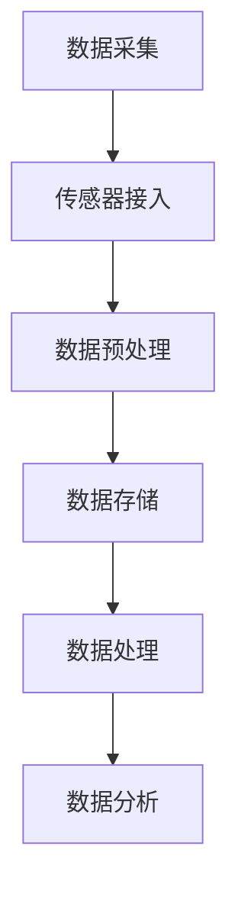

                 

# 数字孪生在智慧医院管理中的应用

## 关键词

- 数字孪生
- 智慧医院
- 医疗管理
- 数字化转型
- 仿真技术

## 摘要

本文深入探讨了数字孪生技术在智慧医院管理中的应用。首先，我们介绍了数字孪生的基本概念和特点，并概述了其在医疗领域的应用前景。接着，我们详细解析了数字孪生技术的核心组成部分，包括数据采集与处理、模型建立与仿真、交互与反馈。在此基础上，文章重点阐述了数字孪生在智慧医院运营管理、患者服务以及设备管理中的具体应用案例。通过实际项目分析，本文揭示了数字孪生在提高医疗服务质量、优化资源调度、提升患者满意度等方面的作用。最后，我们探讨了数字孪生在智慧医院发展中的挑战与机遇，并对未来进行了展望。

## 引言

### 数字孪生的概念与特点

数字孪生（Digital Twin）是一种新兴的数字化技术，通过构建物理实体或系统的虚拟副本，实现对现实世界中的对象进行实时监控、分析和优化。数字孪生的核心在于将物理实体与其数字模型紧密连接，形成一个虚实结合的生态系统。

数字孪生的特点主要体现在以下几个方面：

1. **实时性**：数字孪生能够实时获取物理实体的数据，进行实时监控和分析。
2. **仿真性**：数字孪生可以对物理实体进行仿真，预测其行为和性能。
3. **反馈性**：数字孪生系统能够接收反馈，调整物理实体的状态和行为。
4. **智能性**：通过人工智能和机器学习技术，数字孪生可以自我学习和优化。

### 智慧医院的定义与重要性

智慧医院是指运用现代信息技术，特别是物联网、大数据、人工智能等新兴技术，实现医疗资源的智能化配置、医疗服务的优化和医疗质量的提升。智慧医院的核心目标是通过信息技术手段，提高医疗服务的效率和质量，提升患者满意度。

智慧医院的重要性体现在以下几个方面：

1. **提高医疗效率**：通过自动化和智能化手段，减少医疗工作流程中的冗余环节，提高工作效率。
2. **优化医疗资源**：实现医疗资源的精准调度和优化配置，减少资源浪费。
3. **提升医疗质量**：通过数据分析和智能诊断，提高医疗服务的准确性和安全性。
4. **改善患者体验**：提供便捷、高效、个性化的医疗服务，提升患者满意度。

### 数字孪生在智慧医院中的应用前景

数字孪生在智慧医院中的应用前景广阔，主要表现在以下几个方面：

1. **医疗设备管理**：通过数字孪生技术，实现对医疗设备的实时监控、预测性维护和性能优化。
2. **医院运营管理**：通过数字孪生技术，实现医院资源的高效调度和管理，优化工作流程，提升运营效率。
3. **患者服务**：通过数字孪生技术，提供个性化、智能化的患者服务，提升患者体验。
4. **医疗数据管理**：通过数字孪生技术，实现对海量医疗数据的存储、管理和分析，为临床决策提供支持。

## 第二部分：数字孪生技术基础

### 第2章：数字孪生技术概述

数字孪生技术是构建智慧医院的基础，其核心在于实现物理实体与虚拟模型的深度融合。本章将详细介绍数字孪生的核心技术，包括数据采集与处理、模型建立与仿真、交互与反馈。

#### 2.1.1 数据采集与处理

数据采集是数字孪生的第一步，也是最为关键的一步。以下是一个数据采集与处理的基本流程：



**传感器数据采集**：通过接入各种传感器，如温度传感器、湿度传感器、压力传感器等，实时采集物理实体（如医疗设备）的状态数据。

**数据处理**：包括数据清洗、数据归一化、数据降维等步骤，以提高数据的质量和可用性。

#### 2.1.2 模型建立与仿真

**模型建立**：

```python
# 伪代码：数学模型建立
def create_model(data):
    # 数据预处理
    processed_data = preprocess_data(data)
    
    # 建立数学模型
    model = build_math_model(processed_data)
    
    return model
```

**仿真模型**：

```python
# 伪代码：仿真模型构建
def create_simulation_model(model):
    # 构建仿真模型
    simulation_model = build_simulation_model(model)
    
    # 运行仿真
    simulation_results = run_simulation(simulation_model)
    
    return simulation_results
```

**仿真**：

**物理仿真**：

```python
# 伪代码：物理仿真
def physical_simulation(model):
    # 根据模型进行物理仿真
    simulation_output = model.simulate()
    
    return simulation_output
```

**数字仿真**：

```python
# 伪代码：数字仿真
def digital_simulation(model):
    # 根据模型进行数字仿真
    simulation_output = model.digital_simulate()
    
    return simulation_output
```

#### 2.1.3 交互与反馈

**交互**：

```python
# 伪代码：用户交互
def user_interaction(model):
    # 提供用户界面
    interface = create_user_interface(model)
    
    # 用户与模型交互
    user_input = interface.get_user_input()
    
    # 更新模型状态
    model.update_state(user_input)
```

**反馈**：

```python
# 伪代码：实时反馈
def real_time_feedback(model):
    # 获取模型状态
    current_state = model.get_state()
    
    # 更新用户界面
    interface.update_interface(current_state)
    
    # 提供实时反馈
    feedback_message = interface.get_feedback_message(current_state)
    
    return feedback_message
```

### 第3章：数字孪生在医疗领域的应用

数字孪生技术在医疗领域的应用日益广泛，下面将探讨其在医疗设备管理、医院运营管理和患者服务等方面的应用。

#### 3.1 医疗设备的数字孪生

**3.1.1 医疗设备的数字化建模**

数字化建模是数字孪生的第一步，其目的是建立一个与物理设备对应的虚拟模型。以下是一个数字化建模的示例：

```python
# 伪代码：医疗设备数字化建模
def create_medical_device_model(device):
    # 数据采集
    data = collect_data_from_device(device)
    
    # 数据预处理
    processed_data = preprocess_data(data)
    
    # 建立数学模型
    model = create_math_model(processed_data)
    
    return model
```

**3.1.2 医疗设备的智能仿真**

智能仿真是数字孪生技术的重要组成部分，它能够模拟医疗设备在不同条件下的运行状态。以下是一个智能仿真的示例：

```python
# 伪代码：医疗设备智能仿真
def simulate_medical_device(model, simulation_conditions):
    # 设置仿真条件
    model.set_simulation_conditions(simulation_conditions)
    
    # 运行仿真
    simulation_results = model.run_simulation()
    
    return simulation_results
```

**3.1.3 医疗设备的实时监控与优化**

实时监控与优化是数字孪生技术的核心应用之一，它能够实时监测医疗设备的运行状态，并提供优化建议。以下是一个实时监控与优化的示例：

```python
# 伪代码：实时监控与优化
def monitor_and_optimize_device(model):
    # 获取当前状态
    current_state = model.get_state()
    
    # 进行状态分析
    analysis_results = model.analyze_state(current_state)
    
    # 提供优化建议
    optimization_suggestions = model.get_optimization_suggestions(analysis_results)
    
    return optimization_suggestions
```

### 第4章：智慧医院的管理与运营

智慧医院的管理与运营是数字孪生技术的重要应用领域之一，本章将探讨数字孪生在智慧医院运营管理、患者服务以及设备管理中的具体应用。

#### 4.1 智慧医院的运营管理

**4.1.1 医院资源调度与优化**

医院资源调度与优化是智慧医院运营管理的关键环节，通过数字孪生技术，可以实现资源的高效调度和优化。以下是一个资源调度与优化的示例：

```python
# 伪代码：医院资源调度与优化
def schedule_and_optimize_resources(hospital_model):
    # 分析当前资源状态
    current_state = hospital_model.get_resource_state()
    
    # 调度资源
    scheduled_resources = hospital_model.schedule_resources(current_state)
    
    # 优化资源
    optimized_resources = hospital_model.optimize_resources(scheduled_resources)
    
    return optimized_resources
```

**4.1.2 医院流程管理**

医院流程管理是智慧医院运营管理的另一个关键环节，通过数字孪生技术，可以实现医院工作流程的自动化和优化。以下是一个流程管理的示例：

```python
# 伪代码：医院流程管理
def manage_hospital_processes(hospital_model):
    # 分析当前流程状态
    current_state = hospital_model.get_process_state()
    
    # 自动化流程
    automated_processes = hospital_model.automate_processes(current_state)
    
    # 优化流程
    optimized_processes = hospital_model.optimize_processes(automated_processes)
    
    return optimized_processes
```

**4.1.3 医院服务质量评价**

医院服务质量评价是智慧医院运营管理的重要环节，通过数字孪生技术，可以实时监控和评估医院服务质量。以下是一个服务质量评价的示例：

```python
# 伪代码：医院服务质量评价
def evaluate_hospital_service_quality(hospital_model):
    # 监控服务质量
    service_monitoring_data = hospital_model.monitor_service_quality()
    
    # 评估服务质量
    service_evaluation_results = hospital_model.evaluate_service_quality(service_monitoring_data)
    
    return service_evaluation_results
```

### 4.2 智慧医院的患者服务

**4.2.1 患者预约与管理**

患者预约与管理是智慧医院患者服务的重要环节，通过数字孪生技术，可以实现患者预约的自动化和个性化。以下是一个患者预约与管理的示例：

```python
# 伪代码：患者预约与管理
def manage_patient_appointments(hospital_model):
    # 接收患者预约请求
    appointment_requests = hospital_model.receive_appointment_requests()
    
    # 分配医生和科室
    assigned_appointments = hospital_model.assign_doctors_and_departments(appointment_requests)
    
    # 管理患者预约
    managed_appointments = hospital_model.manage_patient_appointments(assigned_appointments)
    
    return managed_appointments
```

**4.2.2 患者健康数据分析**

患者健康数据分析是智慧医院患者服务的核心，通过数字孪生技术，可以实现对患者健康数据的实时监控和分析。以下是一个患者健康数据分析的示例：

```python
# 伪代码：患者健康数据分析
def analyze_patient_health_data(hospital_model):
    # 收集患者健康数据
    health_data = hospital_model.collect_health_data()
    
    # 分析健康数据
    analysis_results = hospital_model.analyze_health_data(health_data)
    
    # 提供健康建议
    health_advice = hospital_model.provide_health_advice(analysis_results)
    
    return health_advice
```

**4.2.3 患者满意度调查与反馈**

患者满意度调查与反馈是智慧医院患者服务的重要环节，通过数字孪生技术，可以实现对患者满意度的实时监控和分析。以下是一个患者满意度调查与反馈的示例：

```python
# 伪代码：患者满意度调查与反馈
def survey_and_feedback_patient_satisfaction(hospital_model):
    # 进行满意度调查
    satisfaction_survey = hospital_model.survey_patient_satisfaction()
    
    # 收集反馈
    feedback_data = hospital_model.collect_feedback(satisfaction_survey)
    
    # 分析反馈
    feedback_analysis_results = hospital_model.analyze_feedback(feedback_data)
    
    # 提供改进建议
    improvement_suggestions = hospital_model.provide_improvement_suggestions(feedback_analysis_results)
    
    return improvement_suggestions
```

### 第三部分：数字孪生在智慧医院的应用案例

#### 第5章：国内数字孪生智慧医院应用案例

在本章中，我们将深入探讨国内数字孪生智慧医院的实际应用案例，通过具体实例展示数字孪生技术如何在实际医院管理中发挥作用。

### 5.1 案例一：XXX医院数字孪生建设与应用

**5.1.1 案例背景**

XXX医院是一所大型综合性医院，面临着医疗资源紧张、患者满意度不高等问题。为了提升医疗服务质量和管理效率，医院决定引入数字孪生技术，构建智慧医院。

**5.1.2 案例实施过程**

1. **数据采集与处理**：
   - 针对医院的各类医疗设备，安装传感器进行数据采集，包括设备状态、运行参数等。
   - 数据经过预处理，如去噪、归一化等，以提高数据质量。

2. **模型建立与仿真**：
   - 基于采集到的数据，建立医疗设备的数学模型和仿真模型。
   - 利用仿真模型，对设备在不同条件下的运行状态进行预测和优化。

3. **实时监控与优化**：
   - 构建数字孪生系统，实现对医疗设备的实时监控和性能优化。
   - 根据实时数据，提供设备维护和优化建议，提高设备运行效率。

**5.1.3 案例效果分析**

1. **医疗服务质量提升**：
   - 通过数字孪生技术，实现对医疗设备的实时监控和优化，降低了设备故障率，提高了医疗服务的可靠性。
   - 医疗设备的性能得到优化，提升了医疗服务质量。

2. **运营效率提高**：
   - 医疗设备的实时监控和优化，减少了设备维护成本和停机时间，提高了运营效率。
   - 医院资源调度更加精准，减少了资源浪费。

3. **患者满意度提升**：
   - 医疗服务质量的提升和运营效率的提高，使得患者满意度得到显著提升。

### 5.2 案例二：YYY医院数字孪生建设与应用

**5.2.1 案例背景**

YYY医院是一家三级甲等医院，拥有丰富的医疗资源，但在患者预约管理、医院流程管理等方面存在一定问题。为了提升患者体验和管理效率，医院决定引入数字孪生技术。

**5.2.2 案例实施过程**

1. **患者预约与管理**：
   - 通过数字孪生技术，实现患者预约系统的自动化和个性化。
   - 根据患者需求和医院资源情况，自动分配医生和科室。

2. **医院流程管理**：
   - 基于数字孪生技术，优化医院的工作流程，如入院流程、出院流程等。
   - 实现流程的自动化，减少人工干预，提高工作效率。

3. **医疗服务质量评价**：
   - 通过数字孪生技术，实现对医疗服务质量的实时监控和评价。
   - 根据患者的反馈和数据分析，提供改进建议，提升医疗服务质量。

**5.2.3 案例效果分析**

1. **患者满意度提升**：
   - 患者预约系统的自动化和个性化，提高了患者的就医体验，提升了患者满意度。

2. **管理效率提高**：
   - 医院流程的自动化和优化，减少了流程中的冗余环节，提高了管理效率。

3. **医疗服务质量提升**：
   - 实时监控和评价系统，使得医疗服务质量得到持续提升。

### 第四部分：数字孪生在智慧医院的未来发展

#### 第6章：数字孪生在智慧医院的挑战与机遇

随着数字孪生技术的不断发展，其在智慧医院中的应用面临着诸多挑战和机遇。本章将探讨数字孪生在智慧医院发展中的挑战和机遇。

#### 6.1 数字孪生在智慧医院的挑战

1. **技术挑战**：
   - 数据采集与处理的准确性：数字孪生依赖于大量的实时数据，数据的准确性和可靠性是技术挑战的关键。
   - 仿真模型的准确性：仿真模型的准确性直接影响到数字孪生的效果，如何构建高精度的仿真模型是一个挑战。

2. **政策与法规挑战**：
   - 数据隐私与安全：数字孪生涉及到大量患者的敏感数据，如何在保护患者隐私的前提下进行数据处理是一个法规挑战。
   - 标准化与互操作性：不同医院和医疗机构的数字孪生系统如何实现标准化和互操作，以实现资源的高效共享和整合。

3. **数据安全与隐私保护挑战**：
   - 数据泄露风险：数字孪生系统中的数据泄露可能会导致严重的后果，如何确保数据的安全性是一个关键问题。
   - 隐私保护：如何有效保护患者的隐私，防止数据被滥用，是一个亟待解决的问题。

#### 6.2 数字孪生在智慧医院的机遇

1. **提高医疗服务质量**：
   - 数字孪生技术可以通过实时监控和预测，提高医疗设备的性能和可靠性，从而提升医疗服务质量。
   - 通过数据分析和智能诊断，提供个性化的治疗方案，提高诊断和治疗的准确性。

2. **降低医疗成本**：
   - 数字孪生技术可以实现医疗设备的高效管理和维护，减少设备故障和维修成本。
   - 通过优化医院运营管理，减少资源浪费，降低运营成本。

3. **促进医疗产业发展**：
   - 数字孪生技术可以推动医疗设备和医疗服务的智能化发展，促进医疗产业的转型升级。
   - 数字孪生技术的应用将催生新的商业模式和产业链，为医疗产业带来新的发展机遇。

### 第五部分：总结与展望

#### 第7章：数字孪生在智慧医院的应用总结与未来展望

本章将对数字孪生在智慧医院中的应用进行总结，并探讨其未来的发展趋势。

#### 7.1 数字孪生在智慧医院的应用总结

数字孪生技术在智慧医院中的应用取得了显著成果，主要体现在以下几个方面：

1. **提高医疗服务质量**：通过实时监控和预测，数字孪生技术显著提高了医疗设备的性能和可靠性，提升了医疗服务质量。
2. **优化医院运营管理**：通过数据分析和优化，数字孪生技术实现了医院资源的高效调度和管理，提高了运营效率。
3. **提升患者满意度**：数字孪生技术提供了个性化、智能化的患者服务，提升了患者的就医体验和满意度。

#### 7.2 数字孪生在智慧医院的未来展望

数字孪生技术在智慧医院中的应用前景广阔，未来将呈现以下发展趋势：

1. **技术成熟度提升**：随着技术的不断进步，数字孪生技术的成熟度将进一步提高，实现更精确的数据采集和处理，更高精度的仿真模型。
2. **跨领域融合**：数字孪生技术将与其他新兴技术如物联网、大数据、人工智能等深度融合，推动医疗产业向智能化方向发展。
3. **标准化与互操作性**：随着数字孪生技术的广泛应用，标准化和互操作性将成为关键，实现不同系统和平台之间的数据共享和协同。
4. **政策支持与法规完善**：政府政策的支持和法规的完善将有助于数字孪生技术在智慧医院中的应用和发展。

### 结语

数字孪生技术在智慧医院管理中的应用，不仅提高了医疗服务质量，优化了医院运营管理，还提升了患者满意度。随着技术的不断进步和应用场景的拓展，数字孪生技术在智慧医院中的前景将更加广阔。然而，面对技术、政策和法规等多方面的挑战，我们需要持续探索和创新，推动数字孪生技术在智慧医院中的深入应用。

## 作者信息

作者：AI天才研究院/AI Genius Institute & 禅与计算机程序设计艺术 /Zen And The Art of Computer Programming

