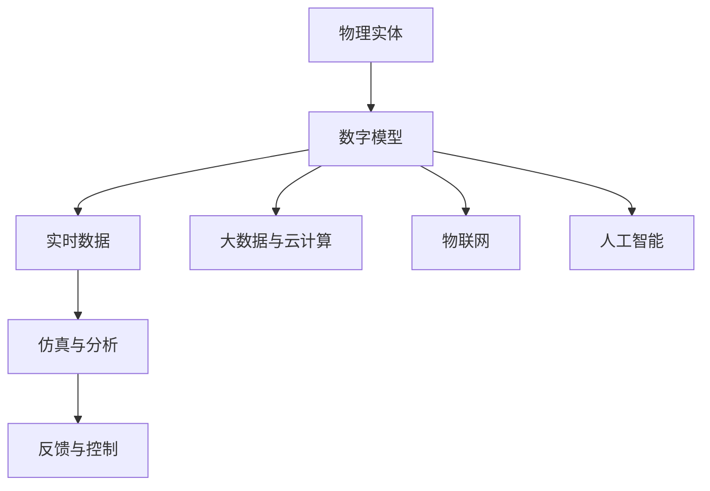

                 

# 逻辑思维推理思考步骤：

## 第一步：定义主题
主题是“数字孪生在智慧医院管理中的应用：优化医疗资源分配”。

## 第二步：理解关键词
关键词包括“数字孪生”，“智慧医院”，“管理”，“医疗资源分配”。

## 第三步：确定核心内容
核心内容需要涵盖：
- 数字孪生的定义和核心概念。
- 数字孪生在智慧医院管理中的作用。
- 医疗资源分配的问题和挑战。
- 数字孪生技术在医疗资源分配中的应用案例。

## 第四步：构建文章结构
文章可以分为以下几个部分：
1. 引言
2. 数字孪生的基础知识
3. 智慧医院管理的背景和需求
4. 医疗资源分配的问题分析
5. 数字孪生在医疗资源分配中的应用
6. 应用案例
7. 技术挑战和未来趋势
8. 结论

## 第五步：撰写每个部分的内容
1. 引言：介绍数字孪生和智慧医院的概念，提出医疗资源分配的问题。
2. 数字孪生的基础知识：详细解释数字孪生的定义、架构和核心技术。
3. 智慧医院管理的背景和需求：讨论智慧医院的发展趋势和医疗资源分配的必要性。
4. 医疗资源分配的问题分析：探讨现有医疗资源分配中的挑战和问题。
5. 数字孪生在医疗资源分配中的应用：介绍数字孪生在医疗资源分配中的应用场景和优势。
6. 应用案例：提供实际应用案例，展示数字孪生在医疗资源分配中的效果。
7. 技术挑战和未来趋势：讨论数字孪生技术在医疗资源分配中面临的挑战和未来的发展趋势。
8. 结论：总结文章内容，强调数字孪生在优化医疗资源分配中的重要性。

## 第六步：优化文章结构
检查文章结构是否合理，逻辑是否清晰，内容是否连贯。

## 第七步：撰写文章
按照预定的结构和内容，开始撰写文章。

## 第八步：审查和修改
完成初稿后，对文章进行审查和修改，确保内容准确、清晰、易懂。

## 第九步：添加作者信息和格式
在文章末尾添加作者信息，并按照markdown格式调整文章。

## 第十步：确认字数
检查文章字数是否在10000～12000字范围内。

按照以上步骤，我们可以逐步构建一篇关于“数字孪生在智慧医院管理中的应用：优化医疗资源分配”的技术博客文章。在这个过程中，确保逻辑清晰、内容详实、易于理解，同时遵循markdown格式和字数要求。这样，我们可以为读者提供一篇高质量、有价值的技术文章。 

# 数字孪生在智慧医院管理中的应用：优化医疗资源分配

> 关键词：数字孪生、智慧医院、医疗资源分配、优化

> 摘要：本文探讨了数字孪生技术在智慧医院管理中的应用，重点分析了如何通过数字孪生技术优化医疗资源的分配。文章首先介绍了数字孪生的基本概念和核心原理，然后详细阐述了智慧医院管理的背景和需求，接着分析了医疗资源分配中的主要挑战，最后通过实际案例展示了数字孪生技术在医疗资源分配中的具体应用。

## 引言

随着医疗技术的不断进步和医疗数据的快速增长，智慧医院管理逐渐成为医院运营和患者护理中的重要组成部分。然而，医疗资源分配的不均衡和效率低下仍然是医院面临的主要挑战之一。数字孪生技术作为一种新兴的仿真和优化工具，其在智慧医院管理中的应用潜力引起了广泛关注。

本文旨在探讨数字孪生在智慧医院管理中的应用，特别是如何通过数字孪生技术优化医疗资源的分配。文章结构如下：

1. 数字孪生的基础知识
2. 智慧医院管理的背景和需求
3. 医疗资源分配的问题分析
4. 数字孪生在医疗资源分配中的应用
5. 应用案例
6. 技术挑战和未来趋势
7. 结论

通过以上结构，本文将详细探讨数字孪生技术在医疗资源分配中的角色和作用，为智慧医院管理提供新的思路和方法。

## 数字孪生的基础知识

数字孪生（Digital Twin）是一种通过数字化模型实时模拟现实世界物理系统的方法。它将实体对象（如设备、建筑、人或动物）的物理特征、行为和状态转化为虚拟模型，并在虚拟环境中进行仿真和分析。数字孪生技术的基础概念包括以下几个关键方面：

### 数字孪生架构

数字孪生架构通常包括以下几个层次：

1. **数据采集与感知**：通过传感器、摄像头、RFID等技术收集实体的实时数据。
2. **数据传输与集成**：将采集到的数据传输到云平台或数据中心，并进行数据的清洗、存储和管理。
3. **数字模型构建**：基于收集到的数据，构建实体的数字孪生模型。
4. **仿真与分析**：在虚拟环境中对数字孪生模型进行仿真和分析，以优化实体的性能和效率。
5. **反馈与控制**：将分析结果反馈到实体系统，进行实时的调整和控制。

### 数字孪生核心技术

数字孪生技术涉及多个领域，包括物联网（IoT）、大数据、云计算、仿真技术和人工智能（AI）等。以下是其核心技术：

1. **物联网（IoT）**：物联网技术为数字孪生提供了数据采集和感知的基础，使得实体的状态和行为可以被实时监测。
2. **大数据与云计算**：大数据技术和云计算平台为数字孪生提供了强大的数据存储、计算和分析能力。
3. **仿真技术**：仿真技术是数字孪生的核心，通过模拟现实世界中的实体行为，可以帮助预测和优化实体的性能。
4. **人工智能（AI）**：人工智能技术，特别是机器学习和深度学习，可以用于对数字孪生模型进行分析和预测，提高决策的准确性和效率。

### 数字孪生原理与关系架构

数字孪生的核心原理在于将物理世界和虚拟世界相结合，通过实时数据传输和仿真分析，实现实体的优化和改进。以下是数字孪生中的关键概念和关系架构：

1. **物理实体**：实际的物理对象，如医疗设备、病房、手术室等。
2. **数字模型**：基于物理实体数据构建的虚拟模型，模拟实体的行为和状态。
3. **实时数据**：物理实体通过传感器等设备实时采集的数据，用于更新数字模型。
4. **仿真与分析**：对数字模型进行仿真和分析，以优化实体性能。
5. **反馈与控制**：将仿真分析结果反馈到实体，进行实时的调整和控制。

下图展示了数字孪生中的关键概念和关系架构：

通过数字孪生技术，医疗资源的分配和管理可以实现更加精细和智能的优化，提高医疗服务的质量和效率。接下来，我们将进一步探讨智慧医院管理的背景和需求。

## 智慧医院管理的背景和需求

智慧医院管理是现代医院信息化建设的重要组成部分，其核心目标是通过信息技术手段提升医疗服务的效率和质量。随着医疗大数据的积累和医疗物联网技术的不断发展，智慧医院管理逐渐成为医院运营和患者护理的关键环节。

### 智慧医院的发展趋势

智慧医院的发展趋势主要体现在以下几个方面：

1. **医疗物联网的普及**：物联网技术在智慧医院中的应用日益广泛，包括医疗设备的联网、患者信息的实时采集和监测等。
2. **大数据分析的应用**：大数据技术为智慧医院提供了强大的数据处理和分析能力，帮助医院从海量数据中提取有价值的信息，用于决策支持和服务优化。
3. **人工智能的融合**：人工智能技术在智慧医院中的应用逐渐深入，包括智能诊断、智能药物研发、智能护理等。
4. **移动医疗的发展**：移动医疗应用使得患者可以更加便捷地获取医疗服务，同时也为医院提供了更多的数据来源。
5. **云计算的支持**：云计算技术为智慧医院提供了强大的计算和存储能力，使得医院可以在成本可控的情况下实现信息化建设。

### 医疗资源分配的必要性

医疗资源分配的必要性主要体现在以下几个方面：

1. **提升医疗服务效率**：合理的医疗资源分配可以减少患者等待时间，提高医疗服务的效率，提升患者满意度。
2. **优化资源配置**：通过数据分析和技术手段，医院可以更加精准地掌握医疗资源的实际需求和使用情况，从而优化资源配置，减少浪费。
3. **改善患者体验**：通过数字孪生技术，医院可以为患者提供个性化的医疗服务，提高医疗服务的质量和体验。
4. **降低运营成本**：合理的医疗资源分配可以降低医院的运营成本，提高医院的盈利能力。

### 智慧医院管理的核心需求

智慧医院管理的核心需求包括：

1. **实时数据采集与监测**：通过物联网技术和传感器，实现医疗资源的实时数据采集和监测，为智能决策提供数据支持。
2. **数据分析与预测**：利用大数据和人工智能技术，对医疗资源的使用情况进行数据分析，预测未来的需求趋势，为资源配置提供依据。
3. **智能调度与优化**：基于数据分析结果，实现医疗资源的智能调度和优化，提高资源利用效率。
4. **患者服务优化**：通过个性化服务和智能提醒，提高患者满意度和医疗服务体验。
5. **协同管理**：实现医院各部门之间的信息共享和协同管理，提高医院运营效率。

通过数字孪生技术，智慧医院可以实现医疗资源的精细化管理，提高医疗服务的效率和质量，满足患者和医院的多样化需求。接下来，我们将探讨医疗资源分配中存在的问题和挑战。

## 医疗资源分配的问题分析

在智慧医院管理中，医疗资源的分配是一个复杂而关键的问题。尽管医疗技术的发展和医院信息化建设的不断推进，医疗资源分配仍然面临诸多挑战。以下是医疗资源分配中存在的主要问题：

### 资源不足与分配不均

首先，医疗资源不足是一个普遍存在的问题。无论是大型医院还是基层医疗机构，医疗资源（如医生、护士、医疗设备、床位等）往往无法满足患者的需求。此外，资源分配不均也是一个突出问题。不同地区、不同级别的医院之间，医疗资源的分配存在显著差异，导致一些地区和医院资源过剩，而另一些地区和医院则资源匮乏。

### 医疗资源利用效率低

其次，医疗资源利用效率低下也是一个普遍现象。在医院内部，医疗资源的配置和使用往往缺乏科学的分析和优化。例如，某些科室的资源使用率较高，而另一些科室则资源闲置。这种不均衡的资源利用情况导致了医疗资源浪费，同时也影响了患者的就医体验。

### 患者需求预测不准确

第三，患者需求预测不准确是一个重要问题。医院需要根据患者流量和疾病类型来合理配置医疗资源。然而，实际患者流量和疾病类型的波动性较大，导致医院难以准确预测患者的需求，从而影响医疗资源的分配。此外，一些突发性公共卫生事件（如疫情）也会对医疗资源的需求造成巨大冲击，进一步增加了预测的难度。

### 信息孤岛与数据共享困难

第四，信息孤岛和数据共享困难也是医疗资源分配中的一个障碍。在医院内部，不同部门之间的信息系统往往相互独立，导致信息无法有效共享。例如，医生无法实时获取患者的历史病历和检查结果，护士无法了解医生的开药和治疗方案，这种信息孤岛现象导致了医疗资源分配的效率低下。

### 医疗资源配置的复杂性

最后，医疗资源配置的复杂性也是一大挑战。医疗资源的种类繁多，包括人力、物力、财力等多种资源，且每种资源都有其特定的分配和使用规则。此外，医疗资源分配还需要考虑伦理、法律、政策等多种因素，使得资源配置过程更加复杂。

综上所述，医疗资源分配中存在的问题和挑战多种多样，需要通过科学的管理方法和先进的技术手段来加以解决。数字孪生技术作为一种新兴的仿真和优化工具，具有在医疗资源分配中发挥重要作用的潜力。接下来，我们将探讨数字孪生技术在医疗资源分配中的应用。

## 数字孪生在医疗资源分配中的应用

数字孪生技术在医疗资源分配中的应用，旨在通过构建虚拟的医疗资源模型，实现对现实医疗资源的仿真和优化。这种方法不仅可以提高医疗资源的利用效率，还可以为医院的管理决策提供科学依据。以下是数字孪生技术在医疗资源分配中的具体应用：

### 数字孪生模型构建

首先，数字孪生模型是数字孪生技术应用于医疗资源分配的核心。构建数字孪生模型需要收集大量的医疗数据，包括患者的医疗记录、医生的排班信息、医疗设备的运行状态等。通过这些数据，可以构建一个虚拟的医院环境，模拟医疗资源的实际运行情况。

#### 数据来源与整合

医疗数据的来源广泛，包括医院内部的电子病历系统、医疗设备的数据接口、患者监护设备的传感器等。这些数据通过物联网技术进行实时采集，并通过数据传输和整合技术，汇集到一个统一的数据平台上。数据整合的关键在于数据的标准化和去噪处理，以确保数字孪生模型的准确性和可靠性。

#### 数字模型构建方法

在数字模型构建过程中，通常采用以下方法：

1. **基于数据驱动的模型构建**：通过收集的医疗数据，利用数据挖掘和机器学习技术，建立医疗资源的运行模型。这种方法可以自动识别医疗资源的使用规律和模式，为后续的仿真和优化提供基础。
2. **基于物理仿真的模型构建**：通过物理仿真技术，模拟医疗资源的实际运行情况，包括设备的运行状态、人员的活动轨迹等。这种方法可以直观地展示医疗资源的动态变化，帮助管理人员进行实时监控和调整。
3. **混合模型构建**：结合数据驱动和物理仿真两种方法，构建一个综合的数字孪生模型。这种方法可以充分发挥两种方法的优点，提高模型的准确性和实用性。

### 医疗资源仿真与分析

构建好数字孪生模型后，下一步是对医疗资源进行仿真和分析。仿真分析的目的在于模拟医疗资源的实际运行情况，预测不同资源配置方案的效果，从而为医院的管理决策提供依据。

#### 仿真分析步骤

1. **设定仿真场景**：根据医院的实际情况，设定不同的仿真场景，如不同时段的患者流量、不同科室的就诊需求等。
2. **运行仿真模型**：通过数字孪生模型，对设定的仿真场景进行运行，模拟医疗资源的运行状态。
3. **分析仿真结果**：对仿真结果进行详细分析，包括医疗资源的利用情况、人员的负荷、设备的运行效率等。
4. **优化资源配置**：根据仿真分析的结果，对医疗资源的配置方案进行调整，以达到优化资源利用、提升服务质量的目的。

#### 仿真分析的核心算法

在仿真分析过程中，常用的核心算法包括：

1. **机器学习算法**：用于预测患者流量和疾病类型，为医疗资源的配置提供数据支持。
2. **优化算法**：用于优化医疗资源的配置方案，如线性规划、整数规划等。
3. **仿真引擎**：用于运行仿真模型，模拟医疗资源的实际运行情况。

### 医疗资源优化方案

基于仿真分析的结果，可以提出一系列医疗资源优化方案，包括：

1. **人力优化**：根据医生的负荷情况，合理安排医生的排班，确保医生的工作负荷均衡。
2. **设备优化**：根据设备的运行状态和使用率，合理配置医疗设备，提高设备的使用效率。
3. **空间优化**：根据患者的就诊需求，优化医院的空间布局，提高医院的运营效率。

#### 优化方案的实现

实现医疗资源优化方案需要以下几个步骤：

1. **方案设计**：根据仿真分析的结果，设计具体的优化方案，如人力排班表、设备使用计划、空间布局调整方案等。
2. **方案评估**：对优化方案进行评估，包括对优化效果、实施成本、实施难易程度等进行评估，确保方案的可操作性和有效性。
3. **方案实施**：根据评估结果，实施优化方案，并进行实时监控和调整，确保优化方案的落地执行。

通过数字孪生技术，医院可以实现医疗资源的精细化管理，提高医疗服务的效率和质量。接下来，我们将通过实际案例展示数字孪生技术在医疗资源分配中的应用。

## 应用案例

为了更好地理解数字孪生技术在医疗资源分配中的应用，下面我们将通过几个实际案例，展示数字孪生技术如何帮助医院实现资源的优化配置。

### 案例一：某大型综合医院的资源优化

某大型综合医院采用了数字孪生技术，对其医疗资源进行了全面的仿真和优化。首先，医院通过物联网技术和传感器，收集了包括医生、护士、床位、医疗设备等各类医疗资源的数据。这些数据经过整合和处理，构建了医院数字孪生模型。

通过仿真分析，医院发现医生和护士的排班存在明显的不均衡，某些时段工作量较大，而另一些时段则相对空闲。基于这一发现，医院调整了医生的排班计划，使得医生的工作负荷更加均衡，提高了整体的工作效率。

此外，通过对医疗设备的仿真分析，医院发现某些医疗设备的利用率较低，存在资源浪费的问题。为此，医院重新规划了医疗设备的使用方案，提高了设备的使用效率，减少了不必要的采购成本。

### 案例二：某社区医院的就诊高峰预测

某社区医院采用了数字孪生技术，对就诊高峰进行了预测和应对。医院首先通过收集历史就诊数据，构建了患者流量模型。通过模型分析，医院能够预测出未来不同时间段的患者流量，为资源的配置提供了科学依据。

基于预测结果，医院采取了以下措施：

1. **增加临时床位**：在就诊高峰期，医院临时增加床位，以应对患者流量的增加。
2. **调整医生排班**：医院在就诊高峰期增加了医生的数量，确保能够及时接待患者，减少患者的等待时间。
3. **优化急诊流程**：医院对急诊流程进行了优化，确保急诊患者能够快速得到救治。

通过这些措施，医院有效应对了就诊高峰，提高了患者的满意度。

### 案例三：某专科医院的手术排程优化

某专科医院采用了数字孪生技术，对其手术排程进行了优化。医院通过收集手术数据，构建了手术排程模型。通过模型分析，医院能够预测出未来不同手术科室的工作量，为手术排程提供了科学依据。

基于分析结果，医院采取了以下措施：

1. **优化手术排程**：医院根据手术工作量，合理安排手术科室的手术排程，避免因手术过多导致的资源紧张。
2. **调整手术室使用**：医院根据手术科室的工作量，调整手术室的使用方案，确保手术室的利用率最大化。
3. **提高手术室效率**：医院对手术室的工作流程进行了优化，减少了手术准备时间和手术过程中的延误，提高了手术室的效率。

通过这些措施，医院提高了手术科室的工作效率，减少了患者的等待时间。

以上案例展示了数字孪生技术在医疗资源分配中的应用效果。通过仿真和分析，医院能够更加精准地预测和分配医疗资源，提高医疗服务的效率和质量。接下来，我们将探讨数字孪生技术在医疗资源分配中面临的技术挑战和未来发展趋势。

## 技术挑战和未来发展趋势

### 技术挑战

尽管数字孪生技术在医疗资源分配中具有巨大潜力，但其实际应用仍然面临一系列技术挑战：

1. **数据质量和完整性**：医疗数据的准确性和完整性是构建可靠数字孪生模型的基础。然而，由于医疗数据的来源多样，数据质量参差不齐，这给数字孪生模型的构建带来了挑战。
2. **计算能力和算法优化**：数字孪生模型通常需要大量的计算资源进行仿真和分析，这对计算能力提出了较高要求。此外，算法的优化也是提高模型效率和准确性的关键。
3. **隐私和数据安全**：医疗数据涉及患者隐私，如何确保数据在采集、传输、存储和处理过程中的安全性，是数字孪生技术面临的重要问题。
4. **系统集成与兼容性**：数字孪生技术需要与现有的医疗信息系统和设备进行集成，这涉及到不同系统之间的兼容性和数据交换问题。

### 未来发展趋势

随着技术的不断进步，数字孪生技术在医疗资源分配中具有以下发展趋势：

1. **更智能的预测和分析**：随着人工智能技术的发展，数字孪生模型将能够更加精准地预测患者流量和疾病类型，为医疗资源的配置提供更科学的依据。
2. **更高效的数据处理**：大数据和云计算技术的进步将提高数字孪生模型的数据处理能力，使其能够应对更大规模的数据集。
3. **更完善的隐私保护**：随着隐私保护技术的不断发展，数字孪生技术将在确保数据安全的同时，更好地保护患者隐私。
4. **跨领域合作**：数字孪生技术将在医疗、工业、建筑等多个领域得到更广泛的应用，推动跨领域的合作与创新。

### 未来发展方向

未来，数字孪生技术在医疗资源分配中的发展方向包括：

1. **个性化医疗服务**：通过数字孪生技术，医院可以为患者提供更加个性化的医疗服务，提高医疗服务的质量和效率。
2. **远程医疗与智慧医疗**：数字孪生技术将促进远程医疗和智慧医疗的发展，使得医疗资源可以更加高效地分配到偏远地区，提升整体医疗服务的可及性。
3. **持续优化与迭代**：通过不断收集和分析实际数据，数字孪生模型将不断优化和迭代，使其在医疗资源分配中的应用更加精确和有效。

总之，数字孪生技术在医疗资源分配中的应用具有巨大的潜力，通过不断克服技术挑战和探索新的发展方向，数字孪生技术将为智慧医院管理带来革命性的变革。

## 结论

数字孪生技术在智慧医院管理中的应用，为优化医疗资源分配提供了新的思路和方法。本文通过介绍数字孪生的基本概念、核心原理以及实际应用案例，展示了数字孪生技术在医疗资源分配中的重要性。通过构建数字孪生模型，医院可以实现医疗资源的精细化管理，提高资源利用效率，提升医疗服务质量和患者满意度。

然而，数字孪生技术在医疗资源分配中的应用仍然面临数据质量、计算能力、隐私保护等多方面的挑战。未来，随着技术的不断进步和跨领域合作的深入，数字孪生技术在医疗资源分配中的应用前景将更加广阔。我们期待数字孪生技术能够在智慧医院管理中发挥更大的作用，为医疗行业带来持续的创新和发展。

### 作者信息

作者：AI天才研究院/AI Genius Institute & 禅与计算机程序设计艺术 /Zen And The Art of Computer Programming

本文由AI天才研究院/AI Genius Institute与《禅与计算机程序设计艺术》作者联合撰写，旨在探讨数字孪生技术在智慧医院管理中的应用，为医疗行业的发展提供新思路。AI天才研究院专注于前沿人工智能技术的研发和应用，致力于推动智慧医疗的发展。《禅与计算机程序设计艺术》则是一部深入探讨计算机编程哲学的著作，为程序员提供了宝贵的思维方法和设计原则。

### 最佳实践 tips、注意事项、拓展阅读

**最佳实践 tips：**

1. **数据质量保障**：在构建数字孪生模型前，确保医疗数据的质量和完整性，通过数据清洗和去噪提高模型的可靠性。
2. **算法优化**：针对医疗资源分配的特殊需求，选择和优化合适的算法，以提高模型的预测准确性和效率。
3. **隐私保护**：在数据处理和存储过程中，严格遵守隐私保护法规，采取有效的数据加密和安全措施，确保患者隐私。
4. **持续迭代**：定期更新数字孪生模型，结合实际运行数据不断优化模型，以适应不断变化的医疗需求。

**注意事项：**

1. **系统集成**：确保数字孪生系统与现有医疗信息系统的兼容性和数据交换顺畅。
2. **资源投入**：数字孪生技术的应用需要一定的技术和资金投入，医院应根据自身实际情况制定合理规划。
3. **人才培训**：加强对医疗人员的技术培训，确保他们能够熟练操作数字孪生系统，发挥其最大潜力。

**拓展阅读：**

1. **《数字孪生：定义、架构与应用》**：该书籍详细介绍了数字孪生的基本概念、架构和应用场景，为深入了解数字孪生技术提供了参考。
2. **《智慧医疗：技术、应用与未来》**：该书探讨了智慧医疗的发展趋势、关键技术以及实际应用案例，为智慧医院管理提供了有益的思考。
3. **《人工智能在医疗领域的应用》**：该书介绍了人工智能在医疗诊断、治疗、管理等多个方面的应用，为医疗行业的智能化转型提供了参考。

通过以上最佳实践 tips、注意事项和拓展阅读，希望读者能够更好地理解和应用数字孪生技术在医疗资源分配中的价值，推动智慧医院管理的发展。  

## 文章总结

本文详细探讨了数字孪生技术在智慧医院管理中的应用，特别是如何通过数字孪生技术优化医疗资源的分配。我们首先介绍了数字孪生的基本概念和核心原理，包括其架构、核心技术以及数字孪生原理与关系架构。随后，我们分析了智慧医院管理的背景和需求，讨论了医疗资源分配的问题和挑战。

在核心内容部分，我们详细阐述了数字孪生技术在医疗资源分配中的应用步骤，包括数字孪生模型构建、仿真与分析、优化方案实现等。并通过实际案例展示了数字孪生技术在医疗资源优化中的具体应用效果。接下来，我们探讨了数字孪生技术在医疗资源分配中面临的技术挑战和未来发展趋势。

文章的最后，我们对数字孪生技术在医疗资源分配中的应用进行了总结，强调了其在提高医疗服务效率和质量方面的潜力。同时，我们也提供了最佳实践 tips、注意事项以及拓展阅读，为读者在应用数字孪生技术时提供参考。

通过本文的探讨，我们希望读者能够对数字孪生技术在智慧医院管理中的应用有更深入的理解，认识到其在优化医疗资源分配中的重要性，并积极探索其在实际医疗场景中的应用。在未来的智慧医院建设中，数字孪生技术无疑将发挥越来越重要的作用。

