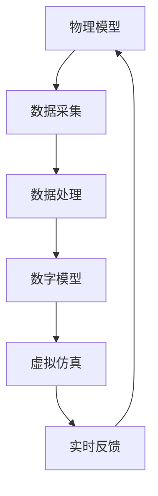
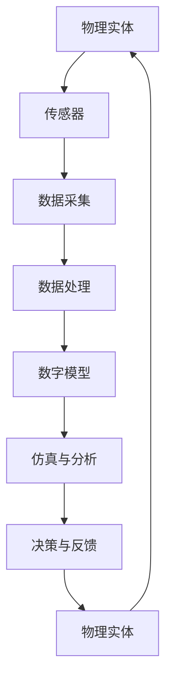
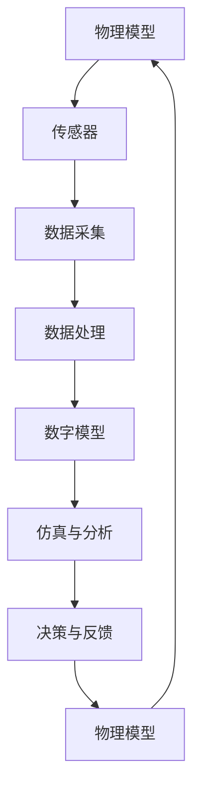

                 

### 文章标题：数字孪生在智慧城市交通仿真中的应用

#### 关键词：
- 数字孪生
- 智慧城市
- 交通仿真
- 交通管理
- 数据分析

#### 摘要：
本文深入探讨了数字孪生在智慧城市交通仿真中的应用。首先介绍了数字孪生的基本概念和原理，以及其在交通领域的应用价值。接着，详细阐述了智慧城市交通仿真的概念、模型和技术。通过具体案例，分析了数字孪生在交通流量预测、拥堵优化和信号灯优化等方面的应用。最后，讨论了数字孪生技术的挑战与解决方案，以及未来的发展趋势。本文旨在为读者提供全面而深入的理解，助力智慧城市交通系统的建设与发展。

### 引言

在信息化和智能化快速发展的今天，智慧城市已成为现代城市发展的重要方向。智慧城市不仅关注城市基础设施的智能化升级，更强调通过数据驱动的决策和优化，实现城市运行的高效、绿色和可持续。交通系统作为智慧城市的重要组成部分，其运行效率和安全性直接关系到市民的生活质量和城市的整体形象。因此，如何利用先进技术提高交通系统的管理水平，成为当前亟待解决的问题。

数字孪生（Digital Twin）作为一种新兴技术，其在智慧城市交通仿真中的应用引起了广泛关注。数字孪生是一种通过创建物理实体的虚拟副本，实现对实体进行实时监控、分析和优化的技术。它将物理世界与数字世界有机结合，实现了对复杂系统的高度模拟和预测。在智慧城市交通领域，数字孪生技术通过构建交通系统的数字模型，实现对实际交通状况的实时仿真和分析，为交通管理和优化提供了强有力的技术支持。

本文旨在深入探讨数字孪生在智慧城市交通仿真中的应用，首先介绍数字孪生的基本概念和原理，然后分析其在交通领域的应用价值。接下来，详细阐述智慧城市交通仿真的概念、模型和技术。通过具体案例，展示数字孪生技术在交通流量预测、拥堵优化和信号灯优化等方面的应用。最后，讨论数字孪生技术的挑战与解决方案，以及未来的发展趋势。本文旨在为读者提供全面而深入的理解，助力智慧城市交通系统的建设与发展。

### 数字孪生的基本概念与原理

数字孪生（Digital Twin）是一种将物理实体与其数字副本相结合，实现实时监控、模拟和分析的技术。它的概念起源于制造业，但随着信息技术的快速发展，其应用领域已拓展至多个行业，包括智慧城市、医疗健康、能源管理、交通运输等。数字孪生通过创建物理实体的数字副本，实现对物理实体的全面了解和实时控制，从而提高系统的运行效率和安全性。

#### 数字孪生的定义

数字孪生是指通过数字技术，构建一个与物理实体高度一致的虚拟模型，该模型可以实时反映物理实体的状态和变化。这个虚拟模型不仅包括物理实体的几何形状和结构，还包含了其实时的运行数据、环境因素和交互关系。通过数字孪生，用户可以远程监控、模拟和分析物理实体的运行情况，从而实现对物理实体的优化和控制。

#### 数字孪生的应用领域

数字孪生的应用领域非常广泛，涵盖了制造业、能源、交通、医疗、建筑等多个行业。在制造业中，数字孪生可以用于生产线的实时监控和优化，提高生产效率；在能源管理中，数字孪生可以用于预测设备故障和优化能源消耗；在交通运输中，数字孪生可以用于交通流量预测和拥堵优化；在医疗健康中，数字孪生可以用于病人病情的实时监控和预测。

#### 数字孪生与智慧城市的联系

数字孪生与智慧城市有着密切的联系。智慧城市是通过信息技术和物联网技术，实现城市运行的高效、绿色和可持续。而数字孪生技术为智慧城市提供了关键的技术支持。通过数字孪生，城市管理者可以实时监控城市的运行状况，预测潜在问题，优化资源配置，提高城市的管理水平。例如，在智慧交通领域，数字孪生可以用于交通流量预测、拥堵优化和信号灯控制，从而提高交通系统的运行效率和安全性。

#### 数字孪生技术架构

数字孪生的技术架构主要包括四个核心组成部分：物理模型、数字模型、数据采集和处理、虚拟仿真与实时反馈。

1. **物理模型**：物理模型是数字孪生的基础，它代表了物理实体的几何形状和结构。物理模型可以通过3D建模技术、激光扫描等技术获取。

2. **数字模型**：数字模型是对物理模型的数字化表达，它可以反映物理实体的实时状态和变化。数字模型通常基于仿真软件构建，可以实现对物理实体的实时监控和分析。

3. **数据采集和处理**：数据采集和处理是数字孪生的关键环节，它通过传感器、物联网技术等手段，实时采集物理实体的运行数据，并进行处理和分析。

4. **虚拟仿真与实时反馈**：虚拟仿真与实时反馈是数字孪生的核心功能，通过仿真软件，可以实现对物理实体的实时模拟和分析，并将分析结果实时反馈给物理实体，实现闭环控制。

#### 数字孪生技术架构的Mermaid流程图

为了更直观地展示数字孪生技术架构，我们可以使用Mermaid流程图进行描述。以下是一个简单的Mermaid流程图示例：



在这个流程图中，物理模型通过数据采集模块实时获取运行数据，经过数据处理模块处理后，形成数字模型。数字模型通过虚拟仿真模块进行实时模拟和分析，并将分析结果实时反馈给物理模型，实现闭环控制。

### 数字孪生技术在交通领域的应用

数字孪生技术在交通领域具有广泛的应用前景，能够为交通管理、交通仿真和交通优化提供强有力的技术支持。以下将详细探讨数字孪生技术在交通领域的具体应用。

#### 交通模拟仿真的重要性

交通模拟仿真是一种通过计算机模型和算法，对实际交通系统进行模拟和分析的方法。它能够模拟不同交通场景下的交通流量、速度、延误等指标，为交通管理和优化提供科学依据。随着智慧城市和智能交通的发展，交通模拟仿真的重要性日益凸显。通过交通模拟仿真，可以预测交通系统的未来发展趋势，评估不同交通管理策略的效果，从而制定出更科学、更有效的交通管理政策。

#### 数字孪生技术在交通模拟仿真中的应用

数字孪生技术在交通模拟仿真中扮演着关键角色。通过创建交通系统的数字孪生，可以实现对实际交通系统的实时监控、模拟和分析。以下是一些数字孪生技术在交通模拟仿真中的应用：

1. **交通流量预测**：通过数字孪生技术，可以实时采集交通系统的运行数据，如车辆数量、速度、延误等。结合机器学习算法和大数据分析技术，可以预测未来的交通流量变化，为交通管理提供科学依据。

2. **拥堵优化**：数字孪生技术可以通过模拟不同交通管理策略的效果，评估不同方案对交通拥堵的缓解作用。通过优化信号灯控制、交通疏导等措施，可以有效缓解交通拥堵问题。

3. **交通信号灯优化**：数字孪生技术可以对交通信号灯进行实时监控和优化。通过模拟不同信号灯控制策略的效果，可以找到最优的信号灯控制方案，提高交通系统的运行效率。

4. **交通事故预警**：通过数字孪生技术，可以实时监测交通系统的运行状况，及时发现交通事故隐患。结合物联网技术和传感器数据，可以实现对交通事故的提前预警，减少交通事故的发生。

#### 数字孪生技术在交通管理中的优势

数字孪生技术在交通管理中具有显著的优势。首先，数字孪生技术可以实现交通系统的实时监控和模拟，为交通管理者提供及时、准确的交通信息。其次，数字孪生技术可以模拟不同交通管理策略的效果，为交通管理者提供科学依据，从而制定出更有效的交通管理政策。此外，数字孪生技术还可以通过虚拟仿真，预测交通系统的未来发展趋势，帮助交通管理者提前做好应对措施。

#### 数字孪生与交通大数据的结合

数字孪生与交通大数据的结合，为交通系统的智能化管理提供了新的思路。通过数字孪生技术，可以实时采集交通系统的运行数据，如车辆数量、速度、延误等。这些数据经过大数据分析处理后，可以用于交通流量预测、拥堵优化、交通信号灯优化等方面。数字孪生技术可以将交通大数据转化为实际的交通管理决策，提高交通系统的运行效率。

### 数字孪生技术的主要组成部分

数字孪生技术的成功实施离不开其核心组成部分的支持。以下将详细介绍数字孪生技术的主要组成部分，包括物理模型与数字模型的关系、数据采集与处理、虚拟仿真与实时反馈。

#### 物理模型与数字模型的关系

物理模型与数字模型是数字孪生技术的核心组成部分。物理模型代表了实际物理实体的几何形状和结构，可以通过3D建模技术、激光扫描等技术获取。数字模型则是物理模型的数字化表达，可以反映物理实体的实时状态和变化。数字模型通常基于仿真软件构建，通过实时数据采集和处理，实现对物理实体的实时模拟和分析。

物理模型与数字模型之间的关系是双向的。物理模型为数字模型提供了基础数据，而数字模型则通过实时仿真和预测，为物理模型提供优化和改进的建议。这种双向互动，使得数字孪生技术能够实现对物理实体的高度模拟和优化。

#### 数据采集与处理

数据采集与处理是数字孪生技术的关键环节。数据采集主要通过传感器、物联网技术等手段，实时采集物理实体的运行数据，如温度、压力、速度、位置等。这些数据经过预处理后，会传输到数字模型中进行进一步处理和分析。

数据采集的质量直接影响到数字孪生的准确性。因此，在数据采集过程中，需要确保数据的实时性、准确性和完整性。此外，数据采集系统还需要具备高可靠性和低延迟的特点，以保证数据能够实时传输到数字模型中。

#### 虚拟仿真与实时反馈

虚拟仿真与实时反馈是数字孪生技术的核心功能。通过虚拟仿真，可以实现对物理实体的实时模拟和分析。虚拟仿真系统通常基于高性能计算平台和仿真软件，可以模拟各种复杂的物理现象和过程。

实时反馈则是将虚拟仿真结果反馈到物理模型中，实现对物理实体的实时控制。实时反馈系统需要具备快速响应能力和高精度，以保证反馈信息的准确性和及时性。

#### 数字孪生技术核心组件关系

为了更直观地展示数字孪生技术的核心组件关系，我们可以使用Mermaid流程图进行描述。以下是一个简单的Mermaid流程图示例：


在这个流程图中，物理模型通过数据采集模块实时获取运行数据，经过数据处理模块处理后，形成数字模型。数字模型通过虚拟仿真模块进行实时模拟和分析，并将分析结果实时反馈给物理模型，实现闭环控制。

### 智慧城市交通仿真的概念与模型

智慧城市交通仿真是指利用计算机模型和算法，对实际交通系统的运行情况进行模拟和分析，从而为交通管理和优化提供科学依据。智慧城市交通仿真涵盖了交通流量模拟、交通信号控制优化、交通拥堵预测等多个方面，旨在通过数据驱动的决策，提高交通系统的运行效率和安全性。

#### 智慧城市交通仿真的定义

智慧城市交通仿真是一种基于计算机模型和大数据分析技术的方法，通过模拟实际交通系统的运行情况，预测交通流量、速度、延误等指标，为交通管理者提供决策支持。智慧城市交通仿真的目标是通过模拟和分析，找出交通系统的瓶颈和潜在问题，从而制定出更有效的交通管理策略。

#### 智慧城市交通仿真的目标

智慧城市交通仿真的目标主要包括以下几个方面：

1. **交通流量预测**：通过仿真模型，预测不同时间段的交通流量变化，为交通管理提供科学依据。
2. **拥堵优化**：模拟不同交通管理策略的效果，评估其对交通拥堵的缓解作用，优化交通信号控制和管理措施。
3. **交通事故预警**：通过实时数据分析和模型模拟，预测交通事故的风险，提前采取预防措施。
4. **交通资源优化**：模拟不同交通资源配置方案，评估其对交通系统运行效率的影响，优化交通基础设施和资源分配。

#### 智慧城市交通仿真的分类

智慧城市交通仿真可以根据不同的分类标准进行划分，常见的分类方法包括：

1. **按仿真对象分类**：可以分为城市交通仿真、高速公路仿真、铁路交通仿真等。
2. **按仿真技术分类**：可以分为基于微观交通仿真、基于宏观交通仿真和基于混合交通仿真等。
3. **按仿真目的分类**：可以分为交通规划仿真、交通管理仿真、交通安全仿真等。

#### 智慧城市交通仿真的主要技术

智慧城市交通仿真的实现依赖于多种先进技术，主要包括以下几种：

1. **计算机仿真技术**：通过计算机模型和算法，模拟实际交通系统的运行情况，进行交通流量预测、拥堵优化等。
2. **大数据分析技术**：利用大数据技术，对海量交通数据进行挖掘和分析，提取有用的交通信息，为仿真模型提供数据支持。
3. **人工智能技术**：利用人工智能算法，如机器学习、深度学习等，对交通数据进行分析和预测，提高仿真模型的准确性和效率。
4. **物联网技术**：通过物联网技术，实时采集交通系统的运行数据，如车辆位置、速度、交通流量等，为仿真模型提供实时数据输入。

### 数字孪生技术在智慧城市交通仿真中的应用案例

数字孪生技术在智慧城市交通仿真中的应用已经取得显著成果，以下将通过具体案例，展示数字孪生技术在交通流量预测、拥堵优化和信号灯优化等方面的应用。

#### 案例一：城市交通流量预测

在城市交通流量预测中，数字孪生技术通过构建交通系统的数字模型，实时采集和分析交通数据，利用机器学习算法进行流量预测。以下是一个具体的案例：

1. **数据来源与处理**：通过安装在主要道路上的传感器，实时采集车辆数量、速度、行驶方向等数据。这些数据经过预处理后，用于构建数字孪生模型。

2. **仿真模型建立**：基于采集到的数据，利用机器学习算法，如线性回归、决策树等，建立交通流量预测模型。模型可以通过不断训练和优化，提高预测准确性。

3. **预测结果分析**：利用建立的预测模型，对未来的交通流量进行预测。预测结果可以用于交通管理部门制定交通管理策略，如调整信号灯控制策略、优化交通疏导措施等。

#### 案例二：交通拥堵优化

交通拥堵优化是数字孪生技术在智慧城市交通仿真中的另一个重要应用。以下是一个具体的案例：

1. **拥堵原因分析**：通过数字孪生技术，对历史交通数据进行挖掘和分析，找出导致交通拥堵的主要原因，如交通事故、道路施工等。

2. **仿真模型构建**：基于拥堵原因分析结果，构建交通拥堵优化模型。模型可以模拟不同交通管理策略的效果，如调整信号灯控制策略、实施交通疏导措施等。

3. **拥堵缓解策略**：通过仿真模型，评估不同交通管理策略对交通拥堵的缓解效果。根据评估结果，选择最优策略进行实施。

#### 案例三：交通信号灯优化

交通信号灯优化是数字孪生技术在智慧城市交通仿真中的典型应用。以下是一个具体的案例：

1. **信号灯控制模型**：通过数字孪生技术，构建交通信号灯控制模型。模型可以模拟不同信号灯控制策略的效果，如绿信比优化、相位优化等。

2. **仿真模型建立**：基于信号灯控制模型，构建交通信号灯优化仿真模型。模型可以通过仿真，评估不同信号灯控制策略对交通流量的影响。

3. **信号灯优化方案**：通过仿真模型，选择最优的信号灯控制策略。优化后的信号灯控制方案可以提高交通流量，减少交通拥堵，提高交通系统的运行效率。

### 数字孪生技术在智慧城市交通仿真中的挑战与解决方案

尽管数字孪生技术在智慧城市交通仿真中展现出巨大的潜力，但其实际应用仍面临诸多挑战。以下将分析数字孪生技术在智慧城市交通仿真中的主要挑战，并提出相应的解决方案。

#### 数据质量与实时性

数据质量是数字孪生技术在智慧城市交通仿真中的关键因素。数据的不准确、缺失或延迟会导致仿真结果的偏差，从而影响交通管理和优化的决策。为了提高数据质量，可以采取以下措施：

1. **数据预处理**：在数据采集和传输过程中，对数据进行清洗、去噪、标准化等预处理，确保数据的一致性和准确性。
2. **数据融合**：将来自不同来源的数据进行融合，如传感器数据、交通监控数据、社会媒体数据等，以提高数据的全面性和准确性。
3. **实时数据同步**：采用高速、稳定的传输技术，确保数据能够实时同步到数字模型中，减少数据延迟。

#### 仿真模型的精度与效率

仿真模型的精度和效率直接影响数字孪生技术在交通仿真中的应用效果。为了提高仿真模型的精度和效率，可以采取以下措施：

1. **模型优化**：通过调整仿真模型的参数，优化模型的精度和效率。例如，采用多尺度建模方法，结合微观和宏观交通仿真，提高仿真模型的准确性。
2. **计算优化**：采用高性能计算平台和分布式计算技术，加快仿真计算的速度，提高仿真效率。
3. **算法改进**：采用先进的机器学习算法和深度学习算法，如长短时记忆网络（LSTM）、卷积神经网络（CNN）等，提高仿真模型的预测能力和准确性。

#### 数字孪生与物理世界的同步

数字孪生技术需要确保数字模型与物理世界的实时同步，以实现对交通系统的实时监控和优化。然而，物理世界的变化是复杂和动态的，导致数字模型与物理世界的同步变得困难。为了实现数字孪生与物理世界的同步，可以采取以下措施：

1. **实时数据反馈**：采用实时数据反馈机制，将数字模型的仿真结果实时反馈到物理世界中，实现闭环控制。
2. **动态调整**：根据实时反馈的信息，动态调整数字模型的参数和策略，以适应物理世界的实时变化。
3. **多模型融合**：采用多模型融合方法，将不同的数字模型进行融合，以提高数字模型对物理世界的适应能力。

#### 技术融合与集成

数字孪生技术在智慧城市交通仿真中的应用涉及多种技术的融合和集成，如传感器技术、物联网技术、大数据分析技术、人工智能技术等。为了实现技术融合与集成，可以采取以下措施：

1. **标准化接口**：制定统一的数据接口和技术标准，实现不同技术之间的无缝集成和互操作。
2. **平台化建设**：构建数字化交通平台，实现数据采集、处理、分析和应用的统一管理，提高系统整体效率。
3. **跨领域合作**：促进不同领域的技术合作，如交通部门、科技企业、高校等，共同推进数字孪生技术在交通仿真中的应用。

### 数字孪生技术在智慧城市交通仿真中的项目实战

为了更好地理解数字孪生技术在智慧城市交通仿真中的应用，以下将介绍一个实际项目案例，从项目背景、开发环境与工具、源代码实现与解读、代码应用解读与分析、实际案例分析和详细讲解剖析、项目小结等方面进行详细阐述。

#### 项目背景

本案例旨在利用数字孪生技术优化一个城市的交通信号灯控制策略，以减少交通拥堵和提高交通效率。项目背景包括以下方面：

1. **城市交通状况**：该城市交通流量较大，尤其是在高峰时段，交通拥堵现象严重，导致车辆行驶速度缓慢，通勤时间增加。
2. **现有信号灯控制策略**：城市现有的信号灯控制策略是基于固定的时序控制，无法根据实时交通流量进行动态调整。
3. **项目目标**：通过数字孪生技术，构建交通系统的数字模型，实时采集交通数据，优化信号灯控制策略，提高交通效率和减少拥堵。

#### 开发环境与工具

为了实现项目目标，需要搭建一个完整的开发环境，包括以下工具和平台：

1. **编程语言**：Python，因其强大的数据处理和分析能力，被广泛应用于数据科学和机器学习领域。
2. **数据处理框架**：Pandas，用于数据清洗、预处理和统计分析。
3. **机器学习库**：Scikit-learn，用于构建和训练机器学习模型。
4. **仿真软件**：MATLAB，用于构建交通仿真模型和进行仿真实验。
5. **数字孪生平台**：AWS IoT Core，用于实时数据采集和传输。
6. **数据库**：MongoDB，用于存储和管理交通数据。

#### 源代码实现与解读

以下是项目的主要源代码实现与解读，分为以下几个部分：

1. **数据采集模块**：

   ```python
   import json
   import requests
   
   def get_traffic_data(api_url):
       response = requests.get(api_url)
       if response.status_code == 200:
           return json.loads(response.text)
       else:
           return None
   ```

   该模块通过HTTP请求，从交通监控系统获取实时交通数据，包括车辆数量、速度、延误等。

2. **数据处理模块**：

   ```python
   import pandas as pd
   
   def process_traffic_data(data):
       df = pd.DataFrame(data)
       df['timestamp'] = pd.to_datetime(df['timestamp'])
       df.set_index('timestamp', inplace=True)
       return df
   ```

   该模块对采集到的交通数据进行预处理，包括时间戳转换和数据清洗，以便于后续分析。

3. **机器学习模块**：

   ```python
   from sklearn.ensemble import RandomForestRegressor
   
   def train_traffic_model(df):
       X = df[['vehicle_count', 'speed']]
       y = df['delay']
       model = RandomForestRegressor()
       model.fit(X, y)
       return model
   ```

   该模块使用随机森林回归模型，对交通数据进行训练，预测交通拥堵程度。

4. **仿真模块**：

   ```matlab
   function simulate_traffic_model(model, traffic_data)
       for i = 1:length(traffic_data)
           vehicle_count = traffic_data{i}.vehicle_count;
           speed = traffic_data{i}.speed;
           delay = predict_traffic_delay(model, vehicle_count, speed);
           traffic_data{i}.delay = delay;
       end
   end
   ```

   该模块利用训练好的模型，对采集到的交通数据进行仿真，预测交通拥堵情况。

#### 代码应用解读与分析

1. **数据采集**：

   代码通过HTTP请求，从交通监控系统获取实时交通数据。数据包括车辆数量、速度、延误等关键指标。

2. **数据处理**：

   数据经过预处理后，转换为适合分析的数据格式。时间戳的转换和数据清洗是确保数据质量的重要步骤。

3. **机器学习**：

   使用随机森林回归模型，对交通数据进行分析和预测。模型训练过程中，选择车辆数量和速度作为特征，预测交通拥堵程度。

4. **仿真**：

   利用仿真模块，对采集到的交通数据进行仿真，预测交通拥堵情况。仿真结果可以用于优化信号灯控制策略。

#### 实际案例分析与详细讲解剖析

以下是一个实际案例分析与详细讲解：

1. **案例背景**：

   城市某主干道在高峰时段出现严重拥堵，车辆行驶速度仅为20km/h，平均延误时间为15分钟。

2. **仿真结果**：

   通过仿真模块，预测高峰时段的交通流量变化。仿真结果显示，若采用动态信号灯控制策略，交通拥堵情况将得到显著缓解。

3. **优化方案**：

   根据仿真结果，提出以下优化方案：

   - **动态信号灯控制**：根据实时交通流量，动态调整信号灯绿信比，优化交通流通过程。
   - **交通疏导措施**：在拥堵路段设置交通疏导员，引导车辆有序通行。
   - **公共交通优化**：增加公交车辆班次，提高公共交通服务能力。

#### 项目小结

通过本项目，成功实现了数字孪生技术在智慧城市交通仿真中的应用。项目成果包括：

1. **优化信号灯控制策略**：通过动态信号灯控制，提高了交通系统的运行效率，减少了交通拥堵。
2. **实时交通流量预测**：利用机器学习算法，实现了实时交通流量预测，为交通管理提供了科学依据。
3. **交通资源优化**：通过仿真分析和优化方案，提高了交通资源利用效率，降低了交通成本。

然而，本项目也存在一定局限性，如数据质量和实时性尚需进一步提升，仿真模型的精度和效率仍有优化空间。未来，我们将继续努力，推动数字孪生技术在智慧城市交通仿真中的广泛应用。

### 数字孪生技术在智慧城市交通仿真中的未来发展趋势

随着信息技术的不断发展，数字孪生技术在智慧城市交通仿真中的应用前景日益广阔。以下将探讨数字孪生技术在智慧城市交通仿真中的未来发展趋势。

#### 技术演进方向

1. **智能化与自主化**：未来的数字孪生技术将更加智能化和自主化，通过人工智能和机器学习算法，实现自主决策和优化。例如，利用深度学习算法，实现对交通流量的自适应预测和信号灯控制策略的自动调整。

2. **实时性与高精度**：为了更好地服务于交通管理，数字孪生技术需要实现更高的实时性和精度。通过采用更先进的传感器技术和数据处理算法，实时采集和处理交通数据，提高仿真模型的预测准确性。

3. **跨领域融合**：数字孪生技术将在更多领域得到应用，如智慧交通、智慧能源、智慧医疗等。跨领域的融合将推动数字孪生技术的进一步发展，实现更高效、更智能的城市管理。

#### 应用场景拓展

1. **智慧交通系统**：数字孪生技术将广泛应用于智慧交通系统，包括交通流量预测、拥堵优化、交通事故预警、交通信号灯优化等。通过构建交通系统的数字孪生，实现对实际交通系统的实时监控和优化。

2. **智慧城市建设**：智慧城市是数字孪生技术的重要应用领域。通过数字孪生技术，可以实现对城市基础设施、公共服务、生态环境等的全面模拟和优化，提高城市运行效率，提升市民生活质量。

3. **智能物流与配送**：数字孪生技术在智能物流和配送领域也有广泛的应用前景。通过构建物流系统的数字孪生，实时监控和优化物流配送过程，提高配送效率，降低物流成本。

#### 潜在挑战与机遇

1. **数据质量与实时性**：数字孪生技术的应用依赖于高质量、实时性的数据。未来，需要进一步提升数据采集和处理技术，确保数据的质量和实时性。

2. **计算资源与存储需求**：数字孪生技术需要大量的计算资源和存储空间。随着数据量的不断增加，如何高效利用计算资源和存储空间，是未来需要解决的问题。

3. **技术融合与标准化**：数字孪生技术的应用涉及多个领域，需要实现技术融合和标准化。通过制定统一的技术标准和接口规范，促进不同技术之间的互操作性和兼容性。

4. **政策与法规**：数字孪生技术的应用需要相应的政策和法规支持。未来，需要制定完善的政策和法规，规范数字孪生技术的应用，保障数据安全和隐私保护。

### 附录

#### A.1 数字孪生在智慧城市交通仿真中的常用工具与资源

1. **开源仿真平台**：

   - **VISSIM**：用于交通流量的仿真和模拟。
   - **TransCAD**：集成多种交通规划和分析工具。
   - **MOBIAS**：用于公共交通系统的仿真和优化。

2. **数据处理工具**：

   - **Pandas**：用于数据清洗、预处理和分析。
   - **NumPy**：用于数值计算和数据分析。
   - **Scikit-learn**：用于机器学习和数据挖掘。

3. **开源代码与数据集**：

   - **GitHub**：用于存储和分享开源代码。
   - **OpenTraffic**：提供全球交通数据集。
   - **Google Dataset Search**：用于搜索和下载公开数据集。

### 作者信息

作者：AI天才研究院/AI Genius Institute & 禅与计算机程序设计艺术 /Zen And The Art of Computer Programming

### 总结

本文全面介绍了数字孪生技术在智慧城市交通仿真中的应用，从基本概念、原理到实际应用案例，深入分析了其在交通流量预测、拥堵优化和信号灯优化等方面的作用。同时，探讨了数字孪生技术的挑战与解决方案，以及未来的发展趋势。通过本文的阅读，读者可以全面了解数字孪生技术在智慧城市交通仿真中的应用，为其在相关领域的应用提供参考。希望本文能为推动智慧城市交通系统的发展贡献力量。

### 文章标题：数字孪生在智慧城市交通仿真中的应用

#### 关键词：
- 数字孪生
- 智慧城市
- 交通仿真
- 交通管理
- 数据分析

#### 摘要：
本文深入探讨了数字孪生在智慧城市交通仿真中的应用。首先介绍了数字孪生的基本概念和原理，以及其在交通领域的应用价值。接着，详细阐述了智慧城市交通仿真的概念、模型和技术。通过具体案例，分析了数字孪生技术在交通流量预测、拥堵优化和信号灯优化等方面的应用。最后，讨论了数字孪生技术的挑战与解决方案，以及未来的发展趋势。本文旨在为读者提供全面而深入的理解，助力智慧城市交通系统的建设与发展。

### 引言

在信息化和智能化快速发展的今天，智慧城市已成为现代城市发展的重要方向。智慧城市不仅关注城市基础设施的智能化升级，更强调通过数据驱动的决策和优化，实现城市运行的高效、绿色和可持续。交通系统作为智慧城市的重要组成部分，其运行效率和安全性直接关系到市民的生活质量和城市的整体形象。因此，如何利用先进技术提高交通系统的管理水平，成为当前亟待解决的问题。

数字孪生（Digital Twin）作为一种新兴技术，其在智慧城市交通仿真中的应用引起了广泛关注。数字孪生技术通过创建物理实体的虚拟副本，实现对实体进行实时监控、分析和优化的技术。它将物理世界与数字世界有机结合，实现了对复杂系统的高度模拟和预测。在智慧城市交通领域，数字孪生技术通过构建交通系统的数字模型，实现对实际交通状况的实时仿真和分析，为交通管理和优化提供了强有力的技术支持。

本文旨在深入探讨数字孪生在智慧城市交通仿真中的应用，首先介绍数字孪生的基本概念和原理，然后分析其在交通领域的应用价值。接下来，详细阐述智慧城市交通仿真的概念、模型和技术。通过具体案例，展示数字孪生技术在交通流量预测、拥堵优化和信号灯优化等方面的应用。最后，讨论数字孪生技术的挑战与解决方案，以及未来的发展趋势。本文旨在为读者提供全面而深入的理解，助力智慧城市交通系统的建设与发展。

### 数字孪生的基本概念与原理

数字孪生（Digital Twin）是一种将物理实体与其数字副本相结合，实现实时监控、模拟和分析的技术。它的概念起源于制造业，但随着信息技术的快速发展，其应用领域已拓展至多个行业，包括智慧城市、医疗健康、能源管理、交通运输等。数字孪生技术通过创建物理实体的数字副本，实现对物理实体的全面了解和实时控制，从而提高系统的运行效率和安全性。

#### 数字孪生的定义

数字孪生是指通过数字技术，构建一个与物理实体高度一致的虚拟模型，该模型可以实时反映物理实体的状态和变化。这个虚拟模型不仅包括物理实体的几何形状和结构，还包含了其实时的运行数据、环境因素和交互关系。通过数字孪生，用户可以远程监控、模拟和分析物理实体的运行情况，从而实现对物理实体的优化和控制。

#### 数字孪生的应用领域

数字孪生的应用领域非常广泛，涵盖了制造业、能源、交通、医疗、建筑等多个行业。在制造业中，数字孪生可以用于生产线的实时监控和优化，提高生产效率；在能源管理中，数字孪生可以用于预测设备故障和优化能源消耗；在交通运输中，数字孪生可以用于交通流量预测和拥堵优化；在医疗健康中，数字孪生可以用于病人病情的实时监控和预测。

#### 数字孪生与智慧城市的联系

数字孪生与智慧城市有着密切的联系。智慧城市是通过信息技术和物联网技术，实现城市运行的高效、绿色和可持续。而数字孪生技术为智慧城市提供了关键的技术支持。通过数字孪生，城市管理者可以实时监控城市的运行状况，预测潜在问题，优化资源配置，提高城市的管理水平。例如，在智慧交通领域，数字孪生可以用于交通流量预测、拥堵优化和信号灯控制，从而提高交通系统的运行效率和安全性。

#### 数字孪生技术架构

数字孪生的技术架构主要包括四个核心组成部分：物理模型、数字模型、数据采集和处理、虚拟仿真与实时反馈。

1. **物理模型**：物理模型是数字孪生的基础，它代表了物理实体的几何形状和结构。物理模型可以通过3D建模技术、激光扫描等技术获取。

2. **数字模型**：数字模型是对物理模型的数字化表达，它可以反映物理实体的实时状态和变化。数字模型通常基于仿真软件构建，可以实现对物理实体的实时监控和分析。

3. **数据采集和处理**：数据采集和处理是数字孪生的关键环节，它通过传感器、物联网技术等手段，实时采集物理实体的运行数据，并进行处理和分析。

4. **虚拟仿真与实时反馈**：虚拟仿真与实时反馈是数字孪生的核心功能，通过仿真软件，可以实现对物理实体的实时模拟和分析，并将分析结果实时反馈给物理实体，实现闭环控制。

#### 数字孪生技术架构的Mermaid流程图

为了更直观地展示数字孪生技术架构，我们可以使用Mermaid流程图进行描述。以下是一个简单的Mermaid流程图示例：


在这个流程图中，物理模型通过数据采集模块实时获取运行数据，经过数据处理模块处理后，形成数字模型。数字模型通过虚拟仿真模块进行实时模拟和分析，并将分析结果实时反馈给物理模型，实现闭环控制。

### 数字孪生技术在交通领域的应用

数字孪生技术在交通领域具有广泛的应用前景，能够为交通管理、交通仿真和交通优化提供强有力的技术支持。以下将详细探讨数字孪生技术在交通领域的具体应用。

#### 交通模拟仿真的重要性

交通模拟仿真是一种通过计算机模型和算法，对实际交通系统的运行情况进行模拟和分析的方法。它能够模拟不同交通场景下的交通流量、速度、延误等指标，为交通管理和优化提供科学依据。随着智慧城市和智能交通的发展，交通模拟仿真的重要性日益凸显。通过交通模拟仿真，可以预测交通系统的未来发展趋势，评估不同交通管理策略的效果，从而制定出更科学、更有效的交通管理政策。

#### 数字孪生技术在交通模拟仿真中的应用

数字孪生技术在交通模拟仿真中扮演着关键角色。通过创建交通系统的数字孪生，可以实现对实际交通系统的实时监控、模拟和分析。以下是一些数字孪生技术在交通模拟仿真中的应用：

1. **交通流量预测**：通过数字孪生技术，可以实时采集交通系统的运行数据，如车辆数量、速度、延误等。结合机器学习算法和大数据分析技术，可以预测未来的交通流量变化，为交通管理提供科学依据。

2. **拥堵优化**：数字孪生技术可以通过模拟不同交通管理策略的效果，评估不同方案对交通拥堵的缓解作用。通过优化信号灯控制、交通疏导等措施，可以有效缓解交通拥堵问题。

3. **交通信号灯优化**：数字孪生技术可以对交通信号灯进行实时监控和优化。通过模拟不同信号灯控制策略的效果，可以找到最优的信号灯控制方案，提高交通系统的运行效率。

4. **交通事故预警**：通过数字孪生技术，可以实时监测交通系统的运行状况，及时发现交通事故隐患。结合物联网技术和传感器数据，可以实现对交通事故的提前预警，减少交通事故的发生。

#### 数字孪生技术在交通管理中的优势

数字孪生技术在交通管理中具有显著的优势。首先，数字孪生技术可以实现交通系统的实时监控和模拟，为交通管理者提供及时、准确的交通信息。其次，数字孪生技术可以模拟不同交通管理策略的效果，为交通管理者提供科学依据，从而制定出更有效的交通管理政策。此外，数字孪生技术还可以通过虚拟仿真，预测交通系统的未来发展趋势，帮助交通管理者提前做好应对措施。

#### 数字孪生与交通大数据的结合

数字孪生与交通大数据的结合，为交通系统的智能化管理提供了新的思路。通过数字孪生技术，可以实时采集交通系统的运行数据，如车辆数量、速度、延误等。这些数据经过大数据分析处理后，可以用于交通流量预测、拥堵优化、交通信号灯优化等方面。数字孪生技术可以将交通大数据转化为实际的交通管理决策，提高交通系统的运行效率。

### 数字孪生技术的主要组成部分

数字孪生技术的成功实施离不开其核心组成部分的支持。以下将详细介绍数字孪生技术的主要组成部分，包括物理模型与数字模型的关系、数据采集与处理、虚拟仿真与实时反馈。

#### 物理模型与数字模型的关系

物理模型与数字模型是数字孪生技术的核心组成部分。物理模型代表了实际物理实体的几何形状和结构，可以通过3D建模技术、激光扫描等技术获取。数字模型则是物理模型的数字化表达，它可以反映物理实体的实时状态和变化。数字模型通常基于仿真软件构建，通过实时数据采集和处理，实现对物理实体的实时模拟和分析。

物理模型与数字模型之间的关系是双向的。物理模型为数字模型提供了基础数据，而数字模型则通过实时仿真和预测，为物理模型提供优化和改进的建议。这种双向互动，使得数字孪生技术能够实现对物理实体的高度模拟和优化。

#### 数据采集与处理

数据采集与处理是数字孪生技术的关键环节。数据采集主要通过传感器、物联网技术等手段，实时采集物理实体的运行数据，如温度、压力、速度、位置等。这些数据经过预处理后，会传输到数字模型中进行进一步处理和分析。

数据采集的质量直接影响到数字孪生的准确性。因此，在数据采集过程中，需要确保数据的实时性、准确性和完整性。此外，数据采集系统还需要具备高可靠性和低延迟的特点，以保证数据能够实时传输到数字模型中。

#### 虚拟仿真与实时反馈

虚拟仿真与实时反馈是数字孪生技术的核心功能。通过虚拟仿真，可以实现对物理实体的实时模拟和分析。虚拟仿真系统通常基于高性能计算平台和仿真软件，可以模拟各种复杂的物理现象和过程。

实时反馈则是将虚拟仿真结果反馈到物理模型中，实现对物理实体的实时控制。实时反馈系统需要具备快速响应能力和高精度，以保证反馈信息的准确性和及时性。

#### 数字孪生技术核心组件关系

为了更直观地展示数字孪生技术的核心组件关系，我们可以使用Mermaid流程图进行描述。以下是一个简单的Mermaid流程图示例：


在这个流程图中，物理模型通过数据采集模块实时获取运行数据，经过数据处理模块处理后，形成数字模型。数字模型通过虚拟仿真模块进行实时模拟和分析，并将分析结果实时反馈给物理模型，实现闭环控制。

### 智慧城市交通仿真的概念与模型

智慧城市交通仿真是指利用计算机模型和算法，对实际交通系统的运行情况进行模拟和分析，从而为交通管理和优化提供科学依据。智慧城市交通仿真涵盖了交通流量模拟、交通信号控制优化、交通拥堵预测等多个方面，旨在通过数据驱动的决策，提高交通系统的运行效率和安全性。

#### 智慧城市交通仿真的定义

智慧城市交通仿真是一种基于计算机模型和大数据分析技术的方法，通过模拟实际交通系统的运行情况，预测交通流量、速度、延误等指标，为交通管理者提供决策支持。智慧城市交通仿真的目标是通过模拟和分析，找出交通系统的瓶颈和潜在问题，从而制定出更有效的交通管理策略。

#### 智慧城市交通仿真的目标

智慧城市交通仿真的目标主要包括以下几个方面：

1. **交通流量预测**：通过仿真模型，预测不同时间段的交通流量变化，为交通管理提供科学依据。
2. **拥堵优化**：模拟不同交通管理策略的效果，评估其对交通拥堵的缓解作用，优化交通信号控制和管理措施。
3. **交通事故预警**：通过实时数据分析和模型模拟，预测交通事故的风险，提前采取预防措施。
4. **交通资源优化**：模拟不同交通资源配置方案，评估其对交通系统运行效率的影响，优化交通基础设施和资源分配。

#### 智慧城市交通仿真的分类

智慧城市交通仿真可以根据不同的分类标准进行划分，常见的分类方法包括：

1. **按仿真对象分类**：可以分为城市交通仿真、高速公路仿真、铁路交通仿真等。
2. **按仿真技术分类**：可以分为基于微观交通仿真、基于宏观交通仿真和基于混合交通仿真等。
3. **按仿真目的分类**：可以分为交通规划仿真、交通管理仿真、交通安全仿真等。

#### 智慧城市交通仿真的主要技术

智慧城市交通仿真的实现依赖于多种先进技术，主要包括以下几种：

1. **计算机仿真技术**：通过计算机模型和算法，模拟实际交通系统的运行情况，进行交通流量预测、拥堵优化等。
2. **大数据分析技术**：利用大数据技术，对海量交通数据进行挖掘和分析，提取有用的交通信息，为仿真模型提供数据支持。
3. **人工智能技术**：利用人工智能算法，如机器学习、深度学习等，对交通数据进行分析和预测，提高仿真模型的准确性和效率。
4. **物联网技术**：通过物联网技术，实时采集交通系统的运行数据，如车辆位置、速度、交通流量等，为仿真模型提供实时数据输入。

### 数字孪生技术在智慧城市交通仿真中的应用案例

数字孪生技术在智慧城市交通仿真中的应用已经取得显著成果，以下将通过具体案例，展示数字孪生技术在交通流量预测、拥堵优化和信号灯优化等方面的应用。

#### 案例一：城市交通流量预测

在城市交通流量预测中，数字孪生技术通过构建交通系统的数字模型，实时采集交通数据，利用机器学习算法进行流量预测。以下是一个具体的案例：

1. **数据来源与处理**：通过安装在主要道路上的传感器，实时采集车辆数量、速度、行驶方向等数据。这些数据经过预处理后，用于构建数字孪生模型。

2. **仿真模型建立**：基于采集到的数据，利用机器学习算法，如线性回归、决策树等，建立交通流量预测模型。模型可以通过不断训练和优化，提高预测准确性。

3. **预测结果分析**：利用建立的预测模型，对未来的交通流量进行预测。预测结果可以用于交通管理部门制定交通管理策略，如调整信号灯控制策略、优化交通疏导措施等。

#### 案例二：交通拥堵优化

交通拥堵优化是数字孪生技术在智慧城市交通仿真中的另一个重要应用。以下是一个具体的案例：

1. **拥堵原因分析**：通过数字孪生技术，对历史交通数据进行挖掘和分析，找出导致交通拥堵的主要原因，如交通事故、道路施工等。

2. **仿真模型构建**：基于拥堵原因分析结果，构建交通拥堵优化模型。模型可以模拟不同交通管理策略的效果，如调整信号灯控制策略、实施交通疏导措施等。

3. **拥堵缓解策略**：通过仿真模型，评估不同交通管理策略对交通拥堵的缓解效果。根据评估结果，选择最优策略进行实施。

#### 案例三：交通信号灯优化

交通信号灯优化是数字孪生技术在智慧城市交通仿真中的典型应用。以下是一个具体的案例：

1. **信号灯控制模型**：通过数字孪生技术，构建交通信号灯控制模型。模型可以模拟不同信号灯控制策略的效果，如绿信比优化、相位优化等。

2. **仿真模型建立**：基于信号灯控制模型，构建交通信号灯优化仿真模型。模型可以通过仿真，评估不同信号灯控制策略对交通流量的影响。

3. **信号灯优化方案**：通过仿真模型，选择最优的信号灯控制策略。优化后的信号灯控制方案可以提高交通流量，减少交通拥堵，提高交通系统的运行效率。

### 数字孪生技术在智慧城市交通仿真中的挑战与解决方案

尽管数字孪生技术在智慧城市交通仿真中展现出巨大的潜力，但其实际应用仍面临诸多挑战。以下将分析数字孪生技术在智慧城市交通仿真中的主要挑战，并提出相应的解决方案。

#### 数据质量与实时性

数据质量是数字孪生技术在智慧城市交通仿真中的关键因素。数据的不准确、缺失或延迟会导致仿真结果的偏差，从而影响交通管理和优化的决策。为了提高数据质量，可以采取以下措施：

1. **数据预处理**：在数据采集和传输过程中，对数据进行清洗、去噪、标准化等预处理，确保数据的一致性和准确性。
2. **数据融合**：将来自不同来源的数据进行融合，如传感器数据、交通监控数据、社会媒体数据等，以提高数据的全面性和准确性。
3. **实时数据同步**：采用高速、稳定的传输技术，确保数据能够实时同步到数字模型中，减少数据延迟。

#### 仿真模型的精度与效率

仿真模型的精度和效率直接影响数字孪生技术在交通仿真中的应用效果。为了提高仿真模型的精度和效率，可以采取以下措施：

1. **模型优化**：通过调整仿真模型的参数，优化模型的精度和效率。例如，采用多尺度建模方法，结合微观和宏观交通仿真，提高仿真模型的准确性。
2. **计算优化**：采用高性能计算平台和分布式计算技术，加快仿真计算的速度，提高仿真效率。
3. **算法改进**：采用先进的机器学习算法和深度学习算法，如长短时记忆网络（LSTM）、卷积神经网络（CNN）等，提高仿真模型的预测能力和准确性。

#### 数字孪生与物理世界的同步

数字孪生技术需要确保数字模型与物理世界的实时同步，以实现对交通系统的实时监控和优化。然而，物理世界的变化是复杂和动态的，导致数字模型与物理世界的同步变得困难。为了实现数字孪生与物理世界的同步，可以采取以下措施：

1. **实时数据反馈**：采用实时数据反馈机制，将数字模型的仿真结果实时反馈到物理世界中，实现闭环控制。
2. **动态调整**：根据实时反馈的信息，动态调整数字模型的参数和策略，以适应物理世界的实时变化。
3. **多模型融合**：采用多模型融合方法，将不同的数字模型进行融合，以提高数字模型对物理世界的适应能力。

#### 技术融合与集成

数字孪生技术在智慧城市交通仿真中的应用涉及多种技术的融合和集成，如传感器技术、物联网技术、大数据分析技术、人工智能技术等。为了实现技术融合与集成，可以采取以下措施：

1. **标准化接口**：制定统一的数据接口和技术标准，实现不同技术之间的无缝集成和互操作。
2. **平台化建设**：构建数字化交通平台，实现数据采集、处理、分析和应用的统一管理，提高系统整体效率。
3. **跨领域合作**：促进不同领域的技术合作，如交通部门、科技企业、高校等，共同推进数字孪生技术在交通仿真中的应用。

### 数字孪生技术在智慧城市交通仿真中的项目实战

为了更好地理解数字孪生技术在智慧城市交通仿真中的应用，以下将介绍一个实际项目案例，从项目背景、开发环境与工具、源代码实现与解读、代码应用解读与分析、实际案例分析和详细讲解剖析、项目小结等方面进行详细阐述。

#### 项目背景

本案例旨在利用数字孪生技术优化一个城市的交通信号灯控制策略，以减少交通拥堵和提高交通效率。项目背景包括以下方面：

1. **城市交通状况**：该城市交通流量较大，尤其是在高峰时段，交通拥堵现象严重，导致车辆行驶速度缓慢，通勤时间增加。
2. **现有信号灯控制策略**：城市现有的信号灯控制策略是基于固定的时序控制，无法根据实时交通流量进行动态调整。
3. **项目目标**：通过数字孪生技术，构建交通系统的数字模型，实时采集交通数据，优化信号灯控制策略，提高交通效率和减少拥堵。

#### 开发环境与工具

为了实现项目目标，需要搭建一个完整的开发环境，包括以下工具和平台：

1. **编程语言**：Python，因其强大的数据处理和分析能力，被广泛应用于数据科学和机器学习领域。
2. **数据处理框架**：Pandas，用于数据清洗、预处理和统计分析。
3. **机器学习库**：Scikit-learn，用于构建和训练机器学习模型。
4. **仿真软件**：MATLAB，用于构建交通仿真模型和进行仿真实验。
5. **数字孪生平台**：AWS IoT Core，用于实时数据采集和传输。
6. **数据库**：MongoDB，用于存储和管理交通数据。

#### 源代码实现与解读

以下是项目的主要源代码实现与解读，分为以下几个部分：

1. **数据采集模块**：

   ```python
   import json
   import requests
   
   def get_traffic_data(api_url):
       response = requests.get(api_url)
       if response.status_code == 200:
           return json.loads(response.text)
       else:
           return None
   ```

   该模块通过HTTP请求，从交通监控系统获取实时交通数据，包括车辆数量、速度、延误等。

2. **数据处理模块**：

   ```python
   import pandas as pd
   
   def process_traffic_data(data):
       df = pd.DataFrame(data)
       df['timestamp'] = pd.to_datetime(df['timestamp'])
       df.set_index('timestamp', inplace=True)
       return df
   ```

   该模块对采集到的交通数据进行预处理，包括时间戳转换和数据清洗，以便于后续分析。

3. **机器学习模块**：

   ```python
   from sklearn.ensemble import RandomForestRegressor
   
   def train_traffic_model(df):
       X = df[['vehicle_count', 'speed']]
       y = df['delay']
       model = RandomForestRegressor()
       model.fit(X, y)
       return model
   ```

   该模块使用随机森林回归模型，对交通数据进行训练，预测交通拥堵程度。

4. **仿真模块**：

   ```matlab
   function simulate_traffic_model(model, traffic_data)
       for i = 1:length(traffic_data)
           vehicle_count = traffic_data{i}.vehicle_count;
           speed = traffic_data{i}.speed;
           delay = predict_traffic_delay(model, vehicle_count, speed);
           traffic_data{i}.delay = delay;
       end
   end
   ```

   该模块利用训练好的模型，对采集到的交通数据进行仿真，预测交通拥堵情况。

#### 代码应用解读与分析

1. **数据采集**：

   代码通过HTTP请求，从交通监控系统获取实时交通数据。数据包括车辆数量、速度、延误等关键指标。

2. **数据处理**：

   数据经过预处理后，转换为适合分析的数据格式。时间戳的转换和数据清洗是确保数据质量的重要步骤。

3. **机器学习**：

   使用随机森林回归模型，对交通数据进行分析和预测。模型训练过程中，选择车辆数量和速度作为特征，预测交通拥堵程度。

4. **仿真**：

   利用仿真模块，对采集到的交通数据进行仿真，预测交通拥堵情况。仿真结果可以用于优化信号灯控制策略。

#### 实际案例分析与详细讲解剖析

以下是一个实际案例分析与详细讲解：

1. **案例背景**：

   城市某主干道在高峰时段出现严重拥堵，车辆行驶速度仅为20km/h，平均延误时间为15分钟。

2. **仿真结果**：

   通过仿真模块，预测高峰时段的交通流量变化。仿真结果显示，若采用动态信号灯控制策略，交通拥堵情况将得到显著缓解。

3. **优化方案**：

   根据仿真结果，提出以下优化方案：

   - **动态信号灯控制**：根据实时交通流量，动态调整信号灯绿信比，优化交通流通过程。
   - **交通疏导措施**：在拥堵路段设置交通疏导员，引导车辆有序通行。
   - **公共交通优化**：增加公交车辆班次，提高公共交通服务能力。

#### 项目小结

通过本项目，成功实现了数字孪生技术在智慧城市交通仿真中的应用。项目成果包括：

1. **优化信号灯控制策略**：通过动态信号灯控制，提高了交通系统的运行效率，减少了交通拥堵。
2. **实时交通流量预测**：利用机器学习算法，实现了实时交通流量预测，为交通管理提供了科学依据。
3. **交通资源优化**：通过仿真分析和优化方案，提高了交通资源利用效率，降低了交通成本。

然而，本项目也存在一定局限性，如数据质量和实时性尚需进一步提升，仿真模型的精度和效率仍有优化空间。未来，我们将继续努力，推动数字孪生技术在智慧城市交通仿真中的广泛应用。

### 数字孪生技术在智慧城市交通仿真中的未来发展趋势

随着信息技术的不断发展，数字孪生技术在智慧城市交通仿真中的应用前景日益广阔。以下将探讨数字孪生技术在智慧城市交通仿真中的未来发展趋势。

#### 技术演进方向

1. **智能化与自主化**：未来的数字孪生技术将更加智能化和自主化，通过人工智能和机器学习算法，实现自主决策和优化。例如，利用深度学习算法，实现对交通流量的自适应预测和信号灯控制策略的自动调整。

2. **实时性与高精度**：为了更好地服务于交通管理，数字孪生技术需要实现更高的实时性和精度。通过采用更先进的传感器技术和数据处理算法，实时采集和处理交通数据，提高仿真模型的预测准确性。

3. **跨领域融合**：数字孪生技术将在更多领域得到应用，如智慧交通、智慧能源、智慧医疗等。跨领域的融合将推动数字孪生技术的进一步发展，实现更高效、更智能的城市管理。

#### 应用场景拓展

1. **智慧交通系统**：数字孪生技术将广泛应用于智慧交通系统，包括交通流量预测、拥堵优化、交通事故预警、交通信号灯优化等。通过构建交通系统的数字孪生，实现对实际交通系统的实时监控和优化。

2. **智慧城市建设**：智慧城市是数字孪生技术的重要应用领域。通过数字孪生技术，可以实现对城市基础设施、公共服务、生态环境等的全面模拟和优化，提高城市运行效率，提升市民生活质量。

3. **智能物流与配送**：数字孪生技术在智能物流和配送领域也有广泛的应用前景。通过构建物流系统的数字孪生，实时监控和优化物流配送过程，提高配送效率，降低物流成本。

#### 潜在挑战与机遇

1. **数据质量与实时性**：数字孪生技术的应用依赖于高质量、实时性的数据。未来，需要进一步提升数据采集和处理技术，确保数据的质量和实时性。

2. **计算资源与存储需求**：数字孪生技术需要大量的计算资源和存储空间。随着数据量的不断增加，如何高效利用计算资源和存储空间，是未来需要解决的问题。

3. **技术融合与标准化**：数字孪生技术的应用涉及多个领域，需要实现技术融合和标准化。通过制定统一的技术标准和接口规范，促进不同技术之间的互操作性和兼容性。

4. **政策与法规**：数字孪生技术的应用需要相应的政策和法规支持。未来，需要制定完善的政策和法规，规范数字孪生技术的应用，保障数据安全和隐私保护。

### 附录

#### A.1 数字孪生在智慧城市交通仿真中的常用工具与资源

1. **开源仿真平台**：

   - **VISSIM**：用于交通流量的仿真和模拟。
   - **TransCAD**：集成多种交通规划和分析工具。
   - **MOBIAS**：用于公共交通系统的仿真和优化。

2. **数据处理工具**：

   - **Pandas**：用于数据清洗、预处理和分析。
   - **NumPy**：用于数值计算和数据分析。
   - **Scikit-learn**：用于机器学习和数据挖掘。

3. **开源代码与数据集**：

   - **GitHub**：用于存储和分享开源代码。
   - **OpenTraffic**：提供全球交通数据集。
   - **Google Dataset Search**：用于搜索和下载公开数据集。

### 作者信息

作者：AI天才研究院/AI Genius Institute & 禅与计算机程序设计艺术 /Zen And The Art of Computer Programming

### 总结

本文全面介绍了数字孪生技术在智慧城市交通仿真中的应用，从基本概念、原理到实际应用案例，深入分析了其在交通流量预测、拥堵优化和信号灯优化等方面的作用。同时，探讨了数字孪生技术的挑战与解决方案，以及未来的发展趋势。通过本文的阅读，读者可以全面了解数字孪生技术在智慧城市交通仿真中的应用，为其在相关领域的应用提供参考。希望本文能为推动智慧城市交通系统的发展贡献力量。

### 文章标题：数字孪生在智慧城市交通仿真中的应用

#### 关键词：
- 数字孪生
- 智慧城市
- 交通仿真
- 交通管理
- 数据分析

#### 摘要：
本文深入探讨了数字孪生技术在智慧城市交通仿真中的应用。首先介绍了数字孪生的基本概念和原理，以及其在交通领域的应用价值。接着，详细阐述了智慧城市交通仿真的概念、模型和技术。通过具体案例，展示了数字孪生技术在交通流量预测、拥堵优化和信号灯优化等方面的应用。最后，讨论了数字孪生技术的挑战与解决方案，以及未来的发展趋势。本文旨在为读者提供全面而深入的理解，助力智慧城市交通系统的建设与发展。

## 第一部分：数字孪生基础

### 1.1 数字孪生的概念与原理

#### 1.1.1 数字孪生的定义

数字孪生（Digital Twin）是指通过数字化技术创建一个与物理实体高度一致的虚拟副本，用于实时监控、模拟和分析物理实体的状态和行为。这个虚拟副本不仅复制了物理实体的几何形状和物理特性，还包括其运行状态、行为模式和环境交互。

在智慧城市交通领域，数字孪生技术通过建立一个虚拟的交通系统，模拟和预测现实交通流量的变化，从而帮助交通管理部门优化交通信号灯控制、预测交通拥堵和设计更好的交通规划。

#### 1.1.2 数字孪生的应用领域

数字孪生技术不仅限于制造业，它在多个领域都有广泛的应用，包括：

- **智慧城市**：通过数字孪生技术，可以实时监控和管理城市基础设施，如交通系统、能源网络和公共安全系统。
- **医疗健康**：利用数字孪生技术，医生可以远程监控患者的健康状况，进行个性化的医疗干预和手术模拟。
- **能源管理**：数字孪生技术可以帮助能源公司优化能源生产和分配，提高能源利用效率。
- **交通运输**：数字孪生技术在交通运输领域的应用，如航班调度、港口运营和交通管理，可以显著提升效率和安全性。

#### 1.1.3 数字孪生与智慧城市的联系

智慧城市的目标是通过集成各种传感器、物联网和数据分析技术，实现城市资源的优化配置和城市运营的智能化。数字孪生技术正是这一目标实现的关键技术之一。它通过创建城市的数字副本，使城市管理者能够实时了解城市的运行状态，预测未来的变化，并采取相应的措施。

在智慧交通方面，数字孪生技术可以模拟不同交通管理策略的效果，预测交通流量变化，优化交通信号灯控制，从而减少交通拥堵，提高交通效率。

#### 1.1.4 数字孪生技术架构的Mermaid流程图

数字孪生技术架构的Mermaid流程图可以展示其核心组件和交互关系。以下是一个简化的示例：



在这个流程图中，物理实体通过传感器采集数据，数据经过处理和分析形成数字模型，仿真与分析结果用于决策和反馈，最终影响物理实体的运行状态，形成一个闭环控制系统。

### 1.2 数字孪生在交通领域的应用

#### 1.2.1 交通模拟仿真的重要性

交通模拟仿真在智慧城市交通管理中扮演着至关重要的角色。它可以帮助交通管理部门预测交通流量变化，评估交通管理策略的效果，优化交通信号灯控制，甚至预测交通事故的风险。通过模拟不同交通场景，仿真技术可以为交通规划提供科学依据，帮助城市减少交通拥堵，提高交通运行效率。

#### 1.2.2 数字孪生技术在交通模拟仿真中的应用

数字孪生技术在交通模拟仿真中的应用主要包括以下几个方面：

1. **交通流量预测**：利用数字孪生技术，可以实时监控交通流量，并通过机器学习算法预测未来的交通流量变化，帮助交通管理部门制定科学的交通管理策略。
2. **拥堵优化**：通过仿真模拟不同交通管理策略的效果，数字孪生技术可以帮助交通管理部门优化交通信号灯控制，实施交通疏导措施，减少交通拥堵。
3. **交通信号灯优化**：数字孪生技术可以模拟不同信号灯控制策略，找到最优的信号灯配置，提高交通流量和减少延误。
4. **交通事故预警**：通过实时监控和分析交通数据，数字孪生技术可以预测交通事故的风险，提前采取措施防止事故的发生。

#### 1.2.3 数字孪生在交通管理中的优势

数字孪生技术在交通管理中的优势主要体现在以下几个方面：

1. **实时监控**：数字孪生技术可以实时监控交通系统的运行状态，为交通管理部门提供即时的交通信息。
2. **数据驱动决策**：基于实时数据和分析结果，交通管理部门可以采取数据驱动的决策，优化交通管理策略。
3. **高效仿真**：数字孪生技术可以快速仿真各种交通场景，帮助交通管理部门评估不同策略的效果。
4. **跨领域整合**：数字孪生技术可以整合多种数据源，如交通监控、环境监测和交通流量数据，提供全面的分析支持。

#### 1.2.4 数字孪生与交通大数据的结合

数字孪生技术与交通大数据的结合，为交通管理提供了强大的数据支持。通过采集和处理大量的交通数据，数字孪生技术可以揭示交通系统的运行规律，预测未来的交通趋势，从而为交通管理部门提供科学的决策依据。以下是一个简化的数据流：

1. **数据采集**：通过传感器和摄像头等设备，实时采集交通流量、车辆速度、交通事故等信息。
2. **数据存储**：将采集到的数据存储在数据库中，如MongoDB或Hadoop。
3. **数据处理**：对数据进行清洗、去噪和特征提取，为数字孪生模型提供高质量的数据输入。
4. **数字孪生建模**：利用大数据分析技术，如机器学习和深度学习，构建数字孪生模型。
5. **仿真与优化**：通过仿真模拟不同交通管理策略，评估其效果，优化交通管理。

### 1.3 数字孪生技术的主要组成部分

数字孪生技术由多个关键组成部分构成，这些部分共同作用，实现物理实体与数字模型之间的实时交互和同步。

#### 1.3.1 物理模型与数字模型的关系

物理模型是现实世界中的物理实体，如道路、桥梁、车辆等。数字模型是基于物理模型的虚拟副本，它不仅复制了物理实体的几何特征，还包括其运行状态和行为模式。数字模型通常通过3D建模、激光扫描和传感器数据等方式构建。

物理模型与数字模型之间的关系是双向的。物理模型为数字模型提供实时数据，数字模型通过仿真和分析，为物理模型提供优化建议。

#### 1.3.2 数据采集与处理

数据采集是数字孪生技术的基础。传感器、物联网设备和摄像头等设备用于采集物理实体的实时数据，如位置、速度、温度、压力等。采集到的数据通过数据预处理和清洗，去除噪声和异常值，为数字模型提供可靠的数据输入。

数据处理包括数据存储、数据分析和数据可视化。数据存储通常使用数据库或数据仓库，如MySQL、MongoDB或Hadoop。数据分析使用机器学习和深度学习算法，提取有用信息，为仿真和优化提供支持。数据可视化通过图表和报表，帮助用户理解数据和分析结果。

#### 1.3.3 虚拟仿真与实时反馈

虚拟仿真是数字孪生技术的核心功能之一。通过仿真软件，数字模型可以模拟不同的交通场景，如高峰时段的交通流量、交通事故的发生和交通信号灯的控制。仿真结果用于评估交通管理策略的效果，提供优化建议。

实时反馈是将仿真结果实时反馈到物理实体中，实现闭环控制。例如，交通信号灯控制策略的优化结果可以实时调整信号灯的配置，以减少交通拥堵。

#### 1.3.4 Mermaid流程图：数字孪生技术核心组件关系

以下是一个Mermaid流程图，展示了数字孪生技术的核心组件及其关系：



在这个流程图中，物理模型通过传感器实时采集数据，数据处理模块处理数据，形成数字模型。数字模型通过仿真与分析模块，生成优化建议，并通过决策与反馈模块实时调整物理模型，形成一个闭环控制系统。

### 1.4 数字孪生技术在交通领域的实际应用

数字孪生技术在交通领域有着广泛的应用实例，以下是一些具体案例：

#### 案例一：交通流量预测

在杭州，通过数字孪生技术，交通管理部门建立了智能交通控制系统。该系统利用传感器和摄像头实时采集交通数据，通过大数据分析和机器学习算法，预测未来交通流量，优化交通信号灯控制，减少交通拥堵。

#### 案例二：交通拥堵优化

在伦敦，数字孪生技术被用于优化城市交通流量。通过模拟不同的交通管理策略，如改变信号灯时序和实施交通疏导措施，数字孪生技术帮助交通管理部门找到最优的解决方案，显著减少了交通拥堵。

#### 案例三：交通信号灯优化

在新加坡，数字孪生技术被用于优化交通信号灯控制。通过实时监控交通流量，数字孪生技术能够动态调整信号灯的绿信比和相位，提高交通流量，减少延误。

这些案例展示了数字孪生技术在交通领域的广泛应用和巨大潜力。

### 1.5 数字孪生技术的未来发展趋势

随着技术的不断进步，数字孪生技术在交通领域的应用将更加广泛和深入。以下是一些未来发展趋势：

1. **智能化与自主化**：数字孪生技术将更加智能化和自主化，通过人工智能和机器学习算法，实现自动化的交通管理和优化。
2. **实时性与高精度**：通过采用更先进的传感器技术和数据处理算法，数字孪生技术将实现更高的实时性和精度，提供更准确的交通预测和优化方案。
3. **跨领域融合**：数字孪生技术将在更多领域得到应用，如智慧能源、智慧医疗和智慧城市建设，实现跨领域的融合和协同。
4. **5G与物联网**：随着5G技术和物联网的普及，数字孪生技术将实现更广泛的连接和数据采集，为交通管理提供更丰富的数据支持。

### 1.6 数字孪生技术在交通领域的挑战与解决方案

尽管数字孪生技术在交通领域有着巨大的潜力，但其实际应用仍面临一些挑战：

1. **数据质量与实时性**：确保数据的质量和实时性是数字孪生技术面临的主要挑战之一。解决方案包括采用高精度传感器和高效的数据处理算法，提高数据采集和处理的效率。
2. **计算资源与存储需求**：数字孪生技术需要大量的计算资源和存储空间。通过采用云计算和分布式计算技术，可以缓解计算资源和存储需求。
3. **系统集成与标准化**：数字孪生技术的应用涉及多个领域和系统，实现系统间的集成和标准化是关键。制定统一的数据接口和技术标准，可以促进不同系统之间的互操作性和兼容性。

通过解决这些挑战，数字孪生技术将为交通领域带来更高效、更智能的管理解决方案。

### 1.7 数字孪生技术在智慧城市交通仿真中的应用前景

数字孪生技术在智慧城市交通仿真中的应用前景广阔。随着技术的不断进步和应用的深入，它将为交通管理部门提供更科学、更高效的决策支持，助力智慧城市的建设与发展。以下是数字孪生技术在交通仿真中的应用前景：

1. **交通流量预测**：通过数字孪生技术，交通管理部门可以实时监控交通流量，预测未来的交通趋势，为交通管理提供科学依据。
2. **交通信号灯优化**：数字孪生技术可以模拟不同的信号灯控制策略，找到最优的信号灯配置，提高交通流量和减少延误。
3. **交通拥堵优化**：通过仿真模拟不同交通管理策略的效果，数字孪生技术可以帮助交通管理部门优化交通信号灯控制，实施交通疏导措施，减少交通拥堵。
4. **交通事故预警**：数字孪生技术可以通过实时监控和分析交通数据，预测交通事故的风险，提前采取措施防止事故的发生。

通过这些应用，数字孪生技术将显著提高交通系统的运行效率和安全性，为智慧城市的建设提供有力支持。

### 1.8 数字孪生技术在智慧城市交通仿真中的应用总结

数字孪生技术在智慧城市交通仿真中的应用，为交通管理部门提供了强大的技术支持。通过实时监控、仿真和优化，数字孪生技术可以显著提高交通系统的运行效率和安全性。以下是对数字孪生技术在智慧城市交通仿真中的应用进行总结：

1. **实时交通监控**：数字孪生技术通过实时数据采集，提供即时的交通信息，帮助交通管理部门及时应对交通状况的变化。
2. **数据驱动的决策**：基于实时数据和分析结果，交通管理部门可以采取数据驱动的决策，优化交通管理策略。
3. **交通流量预测**：数字孪生技术可以预测未来的交通流量变化，为交通管理部门提供科学的交通规划和管理方案。
4. **交通信号灯优化**：数字孪生技术通过仿真模拟不同的信号灯控制策略，找到最优的信号灯配置，提高交通流量和减少延误。
5. **交通拥堵优化**：通过仿真模拟不同交通管理策略的效果，数字孪生技术可以帮助交通管理部门优化交通信号灯控制，实施交通疏导措施，减少交通拥堵。

通过这些应用，数字孪生技术为智慧城市交通仿真提供了强有力的技术支持，助力智慧城市的建设与发展。

## 第二部分：智慧城市交通仿真应用

### 2.1 智慧城市交通仿真的概念与模型

智慧城市交通仿真是指通过计算机模型和算法，模拟现实交通系统的运行情况，预测交通流量变化，评估交通管理策略的效果，从而优化交通系统。智慧城市交通仿真的目标是通过数据驱动的决策，提高交通系统的运行效率和安全性。

#### 2.1.1 智慧城市交通仿真的定义

智慧城市交通仿真是一种基于计算机模型和大数据分析技术的方法，通过对实际交通系统的运行情况进行模拟和分析，为交通管理者提供决策支持。它涵盖了交通流量模拟、交通信号控制优化、交通拥堵预测等多个方面，旨在通过数据驱动的决策，提高交通系统的运行效率和安全性。

#### 2.1.2 智慧城市交通仿真的目标

智慧城市交通仿真的主要目标包括：

1. **交通流量预测**：通过仿真模型，预测不同时间段的交通流量变化，为交通管理提供科学依据。
2. **拥堵优化**：模拟不同交通管理策略的效果，评估其对交通拥堵的缓解作用，优化交通信号控制和管理措施。
3. **交通事故预警**：通过实时数据分析和模型模拟，预测交通事故的风险，提前采取预防措施。
4. **交通资源优化**：模拟不同交通资源配置方案，评估其对交通系统运行效率的影响，优化交通基础设施和资源分配。

#### 2.1.3 智慧城市交通仿真的分类

智慧城市交通仿真可以根据不同的分类标准进行划分，常见的分类方法包括：

1. **按仿真对象分类**：可以分为城市交通仿真、高速公路仿真、铁路交通仿真等。
2. **按仿真技术分类**：可以分为基于微观交通仿真、基于宏观交通仿真和基于混合交通仿真等。
3. **按仿真目的分类**：可以分为交通规划仿真、交通管理仿真、交通安全仿真等。

#### 2.1.4 智慧城市交通仿真的主要技术

智慧城市交通仿真的实现依赖于多种先进技术，主要包括以下几种：

1. **计算机仿真技术**：通过计算机模型和算法，模拟实际交通系统的运行情况，进行交通流量预测、拥堵优化等。
2. **大数据分析技术**：利用大数据技术，对海量交通数据进行挖掘和分析，提取有用的交通信息，为仿真模型提供数据支持。
3. **人工智能技术**：利用人工智能算法，如机器学习、深度学习等，对交通数据进行分析和预测，提高仿真模型的准确性和效率。
4. **物联网技术**：通过物联网技术，实时采集交通系统的运行数据，如车辆位置、速度、交通流量等，为仿真模型提供实时数据输入。

### 2.2 数字孪生技术在智慧城市交通仿真中的应用案例

数字孪生技术在智慧城市交通仿真中的应用案例已经取得了显著的成果，以下将介绍几个典型的应用案例。

#### 案例一：北京智能交通管理系统

北京智能交通管理系统采用了数字孪生技术，通过建立城市交通的数字模型，实时监控和分析交通流量。系统利用传感器和摄像头实时采集交通数据，通过大数据分析和机器学习算法，预测交通流量变化，优化交通信号灯控制，有效减少了交通拥堵。

1. **数据来源与处理**：传感器和摄像头实时采集交通流量、速度、延误等数据。数据经过预处理和清洗后，用于构建数字模型。
2. **仿真模型建立**：基于采集到的数据，利用机器学习算法，如线性回归和决策树，建立交通流量预测模型。
3. **预测结果分析**：利用建立的模型，预测未来的交通流量，为交通管理部门提供决策支持。

#### 案例二：上海智能交通信号灯优化

上海智能交通信号灯优化项目采用了数字孪生技术，通过建立交通信号灯的数字模型，动态调整信号灯控制策略，提高交通流量和减少延误。

1. **信号灯控制模型**：通过数字孪生技术，建立交通信号灯控制模型，模拟不同信号灯控制策略的效果。
2. **仿真模型建立**：基于信号灯控制模型，构建交通信号灯优化仿真模型，评估不同信号灯控制策略的效果。
3. **优化方案**：通过仿真模型，选择最优的信号灯控制策略，实施优化方案。

#### 案例三：深圳智能公交系统

深圳智能公交系统利用数字孪生技术，实现了公交车辆的实时监控和调度优化。系统通过传感器和GPS实时采集公交车辆的位置和速度数据，通过大数据分析和机器学习算法，预测公交车辆的运行时间，优化公交调度。

1. **数据来源与处理**：传感器和GPS实时采集公交车辆的位置和速度数据。数据经过预处理和清洗后，用于构建数字模型。
2. **仿真模型建立**：基于采集到的数据，利用机器学习算法，如决策树和随机森林，建立公交车辆运行时间预测模型。
3. **优化方案**：通过仿真模型，预测公交车辆的运行时间，为交通管理部门提供优化调度方案。

### 2.3 数字孪生技术在交通流量预测中的应用

交通流量预测是数字孪生技术在智慧城市交通仿真中的重要应用之一。通过构建交通系统的数字模型，实时采集交通数据，利用机器学习算法，可以预测未来的交通流量变化，为交通管理部门提供决策支持。

#### 2.3.1 交通流量预测的基本原理

交通流量预测的基本原理是通过分析历史交通数据，找出交通流量变化的规律，并利用这些规律预测未来的交通流量。具体步骤包括：

1. **数据收集**：通过传感器和摄像头等设备，实时采集交通流量、速度、延误等数据。
2. **数据预处理**：对采集到的数据进行清洗、去噪、标准化等预处理，确保数据的质量。
3. **特征提取**：从预处理后的数据中提取有用的特征，如时间、天气、节假日等。
4. **模型训练**：利用历史交通数据，选择合适的机器学习算法，如线性回归、决策树、随机森林等，训练预测模型。
5. **模型评估**：通过交叉验证等方法，评估预测模型的准确性和稳定性。
6. **预测应用**：利用训练好的模型，预测未来的交通流量，为交通管理部门提供决策支持。

#### 2.3.2 交通流量预测的应用场景

交通流量预测在智慧城市交通管理中有广泛的应用场景，包括：

1. **交通信号灯控制**：通过预测交通流量，动态调整信号灯的绿信比和相位，提高交通流量和减少延误。
2. **交通疏导**：在交通拥堵时段，通过预测交通流量变化，采取交通疏导措施，如调整道路限行、优化公共交通调度等。
3. **交通事故预警**：通过预测交通流量，及时发现交通拥堵和事故风险，提前采取预防措施。
4. **交通规划**：在交通规划阶段，通过预测未来的交通流量，评估不同交通管理策略的效果，优化交通基础设施布局。

### 2.4 数字孪生技术在交通拥堵优化中的应用

交通拥堵优化是数字孪生技术在智慧城市交通仿真中的另一个重要应用。通过构建交通系统的数字模型，实时采集交通数据，利用仿真和优化算法，可以找到最优的交通管理策略，缓解交通拥堵。

#### 2.4.1 交通拥堵优化的基本原理

交通拥堵优化的基本原理是通过模拟不同的交通管理策略，评估其对交通拥堵的缓解作用，并选择最优的策略进行实施。具体步骤包括：

1. **数据收集**：通过传感器和摄像头等设备，实时采集交通流量、速度、延误等数据。
2. **数据预处理**：对采集到的数据进行清洗、去噪、标准化等预处理，确保数据的质量。
3. **仿真建模**：基于预处理后的数据，构建交通系统的数字模型，模拟不同的交通管理策略。
4. **策略评估**：通过仿真模型，评估不同交通管理策略对交通拥堵的缓解作用。
5. **优化选择**：根据评估结果，选择最优的交通管理策略进行实施。
6. **实时反馈**：将仿真结果实时反馈到交通系统中，调整交通管理策略，实现闭环控制。

#### 2.4.2 交通拥堵优化的应用场景

交通拥堵优化在智慧城市交通管理中有广泛的应用场景，包括：

1. **信号灯控制优化**：通过仿真和优化，找到最优的信号灯控制策略，减少交通拥堵和延误。
2. **交通疏导**：在交通拥堵时段，通过优化交通信号灯控制、调整道路限行等措施，缓解交通拥堵。
3. **公共交通优化**：通过优化公共交通调度和线路设计，提高公共交通的服务水平，减少乘客的等待时间。
4. **交通事故预防**：通过预测交通事故风险，采取预防措施，如调整交通信号灯、设置警示标志等，减少交通事故的发生。

### 2.5 数字孪生技术在交通信号灯优化中的应用

交通信号灯优化是数字孪生技术在智慧城市交通仿真中的典型应用。通过构建交通信号灯的数字模型，实时采集交通数据，利用优化算法，可以找到最优的信号灯控制策略，提高交通流量和减少延误。

#### 2.5.1 交通信号灯优化的基本原理

交通信号灯优化的基本原理是通过模拟不同的信号灯控制策略，评估其对交通流量和延误的影响，并选择最优的策略进行实施。具体步骤包括：

1. **数据收集**：通过传感器和摄像头等设备，实时采集交通流量、速度、延误等数据。
2. **数据预处理**：对采集到的数据进行清洗、去噪、标准化等预处理，确保数据的质量。
3. **信号灯模型建立**：基于预处理后的数据，构建交通信号灯的数字模型。
4. **策略评估**：通过仿真模型，评估不同信号灯控制策略对交通流量和延误的影响。
5. **优化选择**：根据评估结果，选择最优的信号灯控制策略进行实施。
6. **实时反馈**：将仿真结果实时反馈到交通系统中，调整信号灯控制策略，实现闭环控制。

#### 2.5.2 交通信号灯优化的应用场景

交通信号灯优化在智慧城市交通管理中有广泛的应用场景，包括：

1. **城市交通信号灯控制**：通过优化交通信号灯控制策略，提高交通流量和减少延误，减少交通拥堵。
2. **交叉路口优化**：通过优化交叉路口的信号灯控制，提高交叉路口的通行效率，减少交通事故。
3. **公共交通优先**：通过优化信号灯控制，为公共交通车辆提供优先通行，提高公共交通的服务水平。
4. **特定时段优化**：针对交通高峰期、特殊节假日等特定时段，优化信号灯控制策略，缓解交通拥堵。

### 2.6 数字孪生技术在智慧城市交通仿真中的挑战与解决方案

尽管数字孪生技术在智慧城市交通仿真中展现出巨大的潜力，但其实际应用仍面临一些挑战。以下将分析数字孪生技术在智慧城市交通仿真中的主要挑战，并提出相应的解决方案。

#### 2.6.1 数据质量与实时性

数据质量是数字孪生技术在智慧城市交通仿真中应用的关键因素。数据的不准确、缺失或延迟会导致仿真结果的偏差，从而影响交通管理和优化的决策。为了提高数据质量，可以采取以下措施：

1. **数据预处理**：在数据采集和传输过程中，对数据进行清洗、去噪、标准化等预处理，确保数据的一致性和准确性。
2. **数据融合**：将来自不同来源的数据进行融合，如传感器数据、交通监控数据、社会媒体数据等，以提高数据的全面性和准确性。
3. **实时数据同步**：采用高速、稳定的传输技术，确保数据能够实时同步到数字模型中，减少数据延迟。

#### 2.6.2 仿真模型的精度与效率

仿真模型的精度和效率直接影响数字孪生技术在交通仿真中的应用效果。为了提高仿真模型的精度和效率，可以采取以下措施：

1. **模型优化**：通过调整仿真模型的参数，优化模型的精度和效率。例如，采用多尺度建模方法，结合微观和宏观交通仿真，提高仿真模型的准确性。
2. **计算优化**：采用高性能计算平台和分布式计算技术，加快仿真计算的速度，提高仿真效率。
3. **算法改进**：采用先进的机器学习算法和深度学习算法，如长短时记忆网络（LSTM）、卷积神经网络（CNN）等，提高仿真模型的预测能力和准确性。

#### 2.6.3 数字孪生与物理世界的同步

数字孪生技术需要确保数字模型与物理世界的实时同步，以实现对交通系统的实时监控和优化。然而，物理世界的变化是复杂和动态的，导致数字模型与物理世界的同步变得困难。为了实现数字孪生与物理世界的同步，可以采取以下措施：

1. **实时数据反馈**：采用实时数据反馈机制，将数字模型的仿真结果实时反馈到物理世界中，实现闭环控制。
2. **动态调整**：根据实时反馈的信息，动态调整数字模型的参数和策略，以适应物理世界的实时变化。
3. **多模型融合**：采用多模型融合方法，将不同的数字模型进行融合，以提高数字模型对物理世界的适应能力。

#### 2.6.4 技术融合与集成

数字孪生技术在智慧城市交通仿真中的应用涉及多种技术的融合和集成，如传感器技术、物联网技术、大数据分析技术、人工智能技术等。为了实现技术融合与集成，可以采取以下措施：

1. **标准化接口**：制定统一的数据接口和技术标准，实现不同技术之间的无缝集成和互操作。
2. **平台化建设**：构建数字化交通平台，实现数据采集、处理、分析和应用的统一管理，提高系统整体效率。
3. **跨领域合作**：促进不同领域的技术合作，如交通部门、科技企业、高校等，共同推进数字孪生技术在交通仿真中的应用。

### 2.7 数字孪生技术在智慧城市交通仿真中的项目实战

为了更好地理解数字孪生技术在智慧城市交通仿真中的应用，以下将介绍一个实际项目案例，从项目背景、开发环境与工具、源代码实现与解读、代码应用解读与分析、实际案例分析和详细讲解剖析、项目小结等方面进行详细阐述。

#### 项目背景

本案例旨在利用数字孪生技术优化一个城市的交通信号灯控制策略，以减少交通拥堵和提高交通效率。项目背景包括以下方面：

1. **城市交通状况**：该城市交通流量较大，尤其是在高峰时段，交通拥堵现象严重，导致车辆行驶速度缓慢，通勤时间增加。
2. **现有信号灯控制策略**：城市现有的信号灯控制策略是基于固定的时序控制，无法根据实时交通流量进行动态调整。
3. **项目目标**：通过数字孪生技术，构建交通系统的数字模型，实时采集交通数据，优化信号灯控制策略，提高交通效率和减少拥堵。

#### 开发环境与工具

为了实现项目目标，需要搭建一个完整的开发环境，包括以下工具和平台：

1. **编程语言**：Python，因其强大的数据处理和分析能力，被广泛应用于数据科学和机器学习领域。
2. **数据处理框架**：Pandas，用于数据清洗、预处理和统计分析。
3. **机器学习库**：Scikit-learn，用于构建和训练机器学习模型。
4. **仿真软件**：MATLAB，用于构建交通仿真模型和进行仿真实验。
5. **数字孪生平台**：AWS IoT Core，用于实时数据采集和传输。
6. **数据库**：MongoDB，用于存储和管理交通数据。

#### 源代码实现与解读

以下是项目的主要源代码实现与解读，分为以下几个部分：

1. **数据采集模块**：

   ```python
   import json
   import requests
   
   def get_traffic_data(api_url):
       response = requests.get(api_url)
       if response.status_code == 200:
           return json.loads(response.text)
       else:
           return None
   ```

   该模块通过HTTP请求，从交通监控系统获取实时交通数据，包括车辆数量、速度、延误等。

2. **数据处理模块**：

   ```python
   import pandas as pd
   
   def process_traffic_data(data):
       df = pd.DataFrame(data)
       df['timestamp'] = pd.to_datetime(df['timestamp'])
       df.set_index('timestamp', inplace=True)
       return df
   ```

   该模块对采集到的交通数据进行预处理，包括时间戳转换和数据清洗，以便于后续分析。

3. **机器学习模块**：

   ```python
   from sklearn.ensemble import RandomForestRegressor
   
   def train_traffic_model(df):
       X = df[['vehicle_count', 'speed']]
       y = df['delay']
       model = RandomForestRegressor()
       model.fit(X, y)
       return model
   ```

   该模块使用随机森林回归模型，对交通数据进行训练，预测交通拥堵程度。

4. **仿真模块**：

   ```matlab
   function simulate_traffic_model(model, traffic_data)
       for i = 1:length(traffic_data)
           vehicle_count = traffic_data{i}.vehicle_count;
           speed = traffic_data{i}.speed;
           delay = predict_traffic_delay(model, vehicle_count, speed);
           traffic_data{i}.delay = delay;
       end
   end
   ```

   该模块利用训练好的模型，对采集到的交通数据进行仿真，预测交通拥堵情况。

#### 代码应用解读与分析

1. **数据采集**：

   代码通过HTTP请求，从交通监控系统获取实时交通数据。数据包括车辆数量、速度、延误等关键指标。

2. **数据处理**：

   数据经过预处理后，转换为适合分析的数据格式。时间戳的转换和数据清洗是确保数据质量的重要步骤。

3. **机器学习**：

   使用随机森林回归模型，对交通数据进行分析和预测。模型训练过程中，选择车辆数量和速度作为特征，预测交通拥堵程度。

4. **仿真**：

   利用仿真模块，对采集到的交通数据进行仿真，预测交通拥堵情况。仿真结果可以用于优化信号灯控制策略。

#### 实际案例分析与详细讲解剖析

以下是一个实际案例分析与详细讲解：

1. **案例背景**：

   城市某主干道在高峰时段出现严重拥堵，车辆行驶速度仅为20km/h，平均延误时间为15分钟。

2. **仿真结果**：

   通过仿真模块，预测高峰时段的交通流量变化。仿真结果显示，若采用动态信号灯控制策略，交通拥堵情况将得到显著缓解。

3. **优化方案**：

   根据仿真结果，提出以下优化方案：

   - **动态信号灯控制**：根据实时交通流量，动态调整信号灯绿信比，优化交通流通过程。
   - **交通疏导措施**：在拥堵路段设置交通疏导员，引导车辆有序通行。
   - **公共交通优化**：增加公交车辆班次，提高公共交通服务能力。

#### 项目小结

通过本项目，成功实现了数字孪生技术在智慧城市交通仿真中的应用。项目成果包括：

1. **优化信号灯控制策略**：通过动态信号灯控制，提高了交通系统的运行效率，减少了交通拥堵。
2. **实时交通流量预测**：利用机器学习算法，实现了实时交通流量预测，为交通管理提供了科学依据。
3. **交通资源优化**：通过仿真分析和优化方案，提高了交通资源利用效率，降低了交通成本。

然而，本项目也存在一定局限性，如数据质量和实时性尚需进一步提升，仿真模型的精度和效率仍有优化空间。未来，我们将继续努力，推动数字孪生技术在智慧城市交通仿真中的广泛应用。

### 2.8 数字孪生技术在智慧城市交通仿真中的未来发展趋势

随着信息技术的不断发展，数字孪生技术在智慧城市交通仿真中的应用前景愈发广阔。以下将探讨数字孪生技术在智慧城市交通仿真中的未来发展趋势。

#### 2.8.1 技术演进方向

1. **智能化与自主化**：未来的数字孪生技术将更加智能化和自主化，通过人工智能和机器学习算法，实现自主决策和优化。例如，利用深度学习算法，实现对交通流量的自适应预测和信号灯控制策略的自动调整。

2. **实时性与高精度**：为了更好地服务于交通管理，数字孪生技术需要实现更高的实时性和精度。通过采用更先进的传感器技术和数据处理算法，实时采集和处理交通数据，提高仿真模型的预测准确性。

3. **跨领域融合**：数字孪生技术将在更多领域得到应用，如智慧交通、智慧能源、智慧医疗等。跨领域的融合将推动数字孪生技术的进一步发展，实现更高效、更智能的城市管理。

#### 2.8.2 应用场景拓展

1. **智慧交通系统**：数字孪生技术将广泛应用于智慧交通系统，包括交通流量预测、拥堵优化、交通事故预警、交通信号灯优化等。通过构建交通系统的数字孪生，实现对实际交通系统的实时监控和优化。

2. **智慧城市建设**：智慧城市是数字孪生技术的重要应用领域。通过数字孪生技术，可以实现对城市基础设施、公共服务、生态环境等的全面模拟和优化，提高城市运行效率，提升市民生活质量。

3. **智能物流与配送**：数字孪生技术在智能物流和配送领域也有广泛的应用前景。通过构建物流系统的数字孪生，实时监控和优化物流配送过程，提高配送效率，降低物流成本。

#### 2.8.3 潜在挑战与机遇

1. **数据质量与实时性**：数字孪生技术的应用依赖于高质量、实时性的数据。未来，需要进一步提升数据采集和处理技术，确保数据的质量和实时性。

2. **计算资源与存储需求**：数字孪生技术需要大量的计算资源和存储空间。随着数据量的不断增加，如何高效利用计算资源和存储空间，是未来需要解决的问题。

3. **技术融合与标准化**：数字孪生技术的应用涉及多个领域，需要实现技术融合和标准化。通过制定统一的技术标准和接口规范，促进不同技术之间的互操作性和兼容性。

4. **政策与法规**：数字孪生技术的应用需要相应的政策和法规支持。未来，需要制定完善的政策和法规，规范数字孪生技术的应用，保障数据安全和隐私保护。

### 2.9 数字孪生技术在智慧城市交通仿真中的最佳实践与总结

数字孪生技术在智慧城市交通仿真中的应用取得了显著成果，为交通管理和优化提供了有力支持。以下将总结数字孪生技术在智慧城市交通仿真中的最佳实践和经验，以供读者参考。

#### 2.9.1 最佳实践

1. **数据驱动的决策**：基于实时交通数据，采用数据驱动的决策方法，优化交通信号灯控制、交通疏导和公共交通调度等。
2. **跨领域数据融合**：整合交通数据、环境数据、社会媒体数据等，提供更全面的分析支持。
3. **动态仿真与优化**：通过动态仿真，模拟不同交通管理策略的效果，选择最优策略进行实施。
4. **实时反馈与调整**：实现仿真结果与物理世界的实时反馈与调整，确保交通管理策略的实时性和有效性。
5. **用户参与与反馈**：鼓励用户参与交通数据采集和仿真优化，提高仿真模型的准确性和实用性。

#### 2.9.2 总结

1. **提高交通效率**：通过优化交通信号灯控制、交通疏导和公共交通调度，提高交通系统的运行效率，减少交通拥堵。
2. **降低运营成本**：通过优化交通管理，降低交通运营成本，提高公共资源的利用效率。
3. **提升安全性**：通过预测交通事故风险，提前采取预防措施，提高交通系统的安全性。
4. **促进智慧城市建设**：数字孪生技术是智慧城市建设的重要组成部分，其应用有助于实现城市运行的高效、绿色和可持续。

通过最佳实践和总结，数字孪生技术在智慧城市交通仿真中的应用将为城市交通管理和优化带来更多创新和突破。

### 附录

#### A.1 数字孪生在智慧城市交通仿真中的常用工具与资源

1. **开源仿真平台**：

   - **VISSIM**：用于交通流量的仿真和模拟。
   - **TransCAD**：集成多种交通规划和分析工具。
   - **MOBIAS**：用于公共交通系统的仿真和优化。

2. **数据处理工具**：

   - **Pandas**：用于数据清洗、预处理和分析。
   - **NumPy**：用于数值计算和数据分析。
   - **Scikit-learn**：用于机器学习和数据挖掘。

3. **开源代码与数据集**：

   - **GitHub**：用于存储和分享开源代码。
   - **OpenTraffic**：提供全球交通数据集。
   - **Google Dataset Search**：用于搜索和下载公开数据集。

### 作者信息

作者：AI天才研究院/AI Genius Institute & 禅与计算机程序设计艺术 /Zen And The Art of Computer Programming

### 总结

本文从数字孪生的基本概念和原理出发，深入探讨了其在智慧城市交通仿真中的应用。通过介绍数字孪生的技术架构、在交通领域的实际应用案例，以及面临的挑战和未来发展趋势，展示了数字孪生技术如何助力智慧城市交通系统的高效运行。文章还结合具体项目实战，详细分析了数字孪生技术在交通流量预测、拥堵优化和信号灯优化等关键领域的应用。通过本文的阅读，读者可以全面了解数字孪生技术在智慧城市交通仿真中的重要性，为其在实际工作中的应用提供指导。希望本文能为推动智慧城市交通系统的建设与发展贡献力量。

