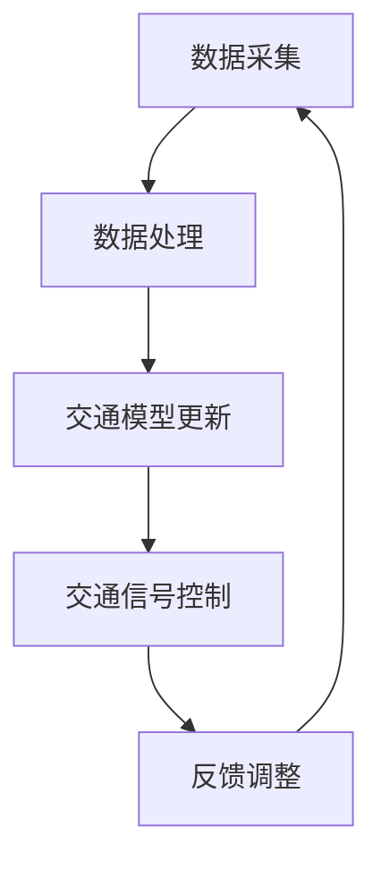
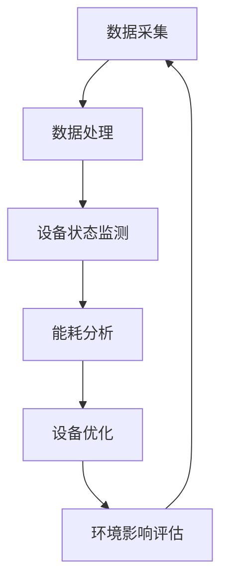
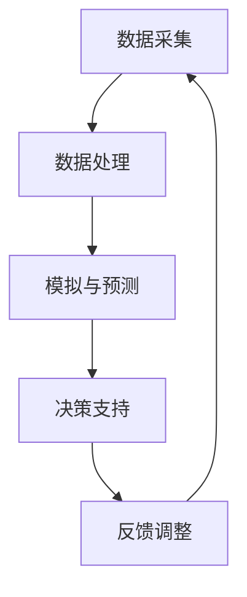

                 

### 引言和背景

数字孪生（Digital Twin）是一种先进的信息物理系统（Cyber-Physical System，CPS）技术，它通过数字模型模拟现实世界中的物理实体或系统，实现实时数据的交互、分析和优化。随着物联网（Internet of Things，IoT）、大数据（Big Data）、云计算（Cloud Computing）等技术的发展，数字孪生逐渐成为智慧城市建设的重要组成部分。

智慧城市（Smart City）是指利用信息技术、传感器、人工智能等手段，实现城市各系统的互联互通、智能监测和高效管理，以提升城市运行效率和居民生活质量。数字孪生在智慧城市中的应用，能够为城市基础设施的管理、优化和升级提供全新的解决方案。

城市基础设施包括交通、能源、水系统、环境等多个方面，这些基础设施的复杂性和依赖性使得传统的管理方法难以应对。数字孪生的引入，可以通过对基础设施的实时监测、数据分析和模拟优化，实现基础设施的智能管理和高效运营。

本文将围绕数字孪生在智慧城市管理中的应用，特别是城市基础设施的协同优化，进行深入探讨。文章结构如下：

- **第一部分：引言和背景**：介绍数字孪生和智慧城市的概念及其重要性。
- **第二部分：数字孪生技术基础**：探讨数字孪生的核心概念与架构，及其与物联网、大数据、云计算的关系。
- **第三部分：数字孪生在城市基础设施中的应用**：分析交通、能源、水系统、环境等基础设施的数字孪生应用。
- **第四部分：数字孪生与城市基础设施协同优化**：阐述协同优化原理与方法，并分享具体案例分析。
- **第五部分：结论与展望**：总结数字孪生在智慧城市管理中的应用，并提出未来发展趋势和挑战。

### 关键词

数字孪生、智慧城市、城市基础设施、协同优化、物联网、大数据、云计算

### 摘要

本文旨在探讨数字孪生在智慧城市管理中的应用，特别是对城市基础设施协同优化的作用。首先，我们介绍了数字孪生和智慧城市的概念及其重要性，然后详细阐述了数字孪生的核心概念与架构，及其与物联网、大数据、云计算的关系。接下来，文章分析了数字孪生在交通、能源、水系统、环境等基础设施中的应用，并探讨了基于数字孪生的协同优化原理与方法。最后，通过具体案例分析，总结了数字孪生在智慧城市管理中的实际效果，并提出了未来发展趋势和挑战。本文为数字孪生在城市基础设施管理中的深入研究提供了有益的参考。

### 第一部分：引言和背景

#### 1.1 数字孪生的定义和重要性

数字孪生（Digital Twin）是指通过数字化技术创建一个虚拟的物理实体或系统的映射，实现对其物理实体的实时监测、模拟和优化。这个虚拟映射不仅包括实体或系统的几何形状、物理属性，还包括其实际运行状态、环境交互和性能数据。简而言之，数字孪生是一个虚拟的数字模型，它能够模拟、预测并优化现实世界中的物理实体或系统的行为。

数字孪生的核心思想是将现实世界中的物理实体或系统通过数字化手段进行映射，构建一个数字模型。这个数字模型可以实时收集和分析物理实体的数据，为实体的运营和维护提供决策支持。例如，在一个制造工厂中，数字孪生可以模拟生产线的运行状态，实时监测设备的运行情况，预测设备故障，并优化生产流程，提高生产效率。

数字孪生的应用领域非常广泛，包括但不限于工业制造、交通运输、能源管理、医疗保健、建筑和基础设施管理等。在这些领域，数字孪生技术能够通过虚拟仿真和实时数据交互，实现对物理实体的精确监控和高效管理，从而提高系统的可靠性和效率。

在智慧城市管理中，数字孪生的应用尤为重要。智慧城市是指利用信息技术、物联网、人工智能等手段，实现对城市各类基础设施和公共服务的智能管理和优化。数字孪生作为智慧城市的重要组成部分，能够为城市基础设施的运营管理提供强大的技术支持。

首先，数字孪生能够实现对城市基础设施的实时监测。通过在物理实体上安装传感器，实时采集数据，数字孪生可以模拟物理实体的状态，提供实时的运行情况。例如，交通系统中的数字孪生可以实时监测交通流量，预测交通拥堵情况，为交通管理提供数据支持。

其次，数字孪生能够实现对城市基础设施的模拟和优化。通过虚拟仿真技术，数字孪生可以模拟不同场景下物理实体的行为，分析系统的性能和潜在问题。例如，能源系统中的数字孪生可以模拟不同能源配置方案下的能源消耗和效率，帮助城市管理者优化能源使用策略。

最后，数字孪生能够实现对城市基础设施的远程管理和维护。通过数字孪生，城市管理者可以远程监控和操作物理实体，实现对基础设施的远程管理和维护，提高管理效率。例如，在建筑设施管理中，数字孪生可以远程监控建筑物的运行状态，及时发现问题并进行维护。

总之，数字孪生作为智慧城市建设的重要组成部分，具有不可替代的重要性。它通过虚拟仿真、实时监测和数据分析，实现对城市基础设施的智能管理和优化，为智慧城市的发展提供了强大的技术支持。

#### 1.2 智慧城市的概念和特征

智慧城市（Smart City）是指利用信息技术、物联网、人工智能、大数据等先进技术手段，对城市各类基础设施和公共服务进行智能化管理和优化，从而提高城市运行效率和居民生活质量。智慧城市是一个集成化、智能化的城市管理系统，旨在实现城市资源的高效利用、环境的高质量保护和居民生活的高品质提升。

智慧城市的概念可以追溯到20世纪末，随着信息技术的飞速发展和城市化进程的加速，智慧城市逐渐成为现代城市发展的新趋势。智慧城市的基本特征包括以下几个方面：

1. **数据驱动**：智慧城市通过广泛部署传感器和物联网设备，实时收集城市运行数据，构建城市数据平台，实现数据的全面采集、存储、处理和分析。数据驱动成为智慧城市决策和管理的基础，有助于提高城市管理的科学性和精细化水平。

2. **互联互通**：智慧城市强调城市各系统之间的互联互通，实现城市各信息系统、基础设施和公共服务之间的无缝对接和高效协同。通过构建统一的城市信息平台，实现数据共享和业务协同，提高城市资源的利用效率和服务水平。

3. **智能感知**：智慧城市通过人工智能和大数据分析技术，实现对城市运行状态的智能感知和预测。智能感知技术能够实时监测城市环境、交通、能源等关键指标，为城市管理者提供决策支持和应急预案。

4. **高效管理**：智慧城市通过智能化手段，实现对城市基础设施和公共服务的智能管理和优化。例如，智能交通管理系统可以实时监测交通流量，优化交通信号，缓解交通拥堵；智能能源管理系统可以实时监测能源使用情况，优化能源分配，提高能源效率。

5. **可持续发展**：智慧城市注重环境保护和可持续发展，通过智能手段实现城市资源的节约利用和环境保护。例如，智能水系统可以实现水资源的实时监测和合理调配，减少水资源浪费；智能环保系统可以实时监测环境污染情况，提供环境治理方案。

6. **居民参与**：智慧城市强调居民参与，通过移动互联网、社交媒体等渠道，鼓励居民参与城市管理和公共服务。居民可以通过手机应用、在线平台等渠道，提出意见和建议，参与城市治理，提高居民对城市管理的参与度和满意度。

智慧城市的建设不仅是技术问题，更是一种城市管理和治理理念的变革。它通过信息技术和智能手段，实现对城市资源的高效利用、环境的高质量保护和居民生活的高品质提升，为城市可持续发展提供新的路径。

#### 1.3 数字孪生在智慧城市管理中的应用场景

数字孪生作为智慧城市建设的重要组成部分，在智慧城市管理中具有广泛的应用场景。以下列举了数字孪生在智慧城市中的几个关键应用领域，并详细阐述了其在各个领域的应用特点和实际案例。

1. **交通管理**

数字孪生技术在交通管理中具有显著的应用价值。通过构建交通基础设施的数字孪生模型，可以实现对交通流量、路况、交通信号等数据的实时监测和分析。具体应用包括：

- **实时交通监控**：通过在交通设施上安装传感器，实时收集交通流量、车速、道路占有率等数据，数字孪生可以模拟和预测交通状况，为交通管理部门提供实时监控和预警。
- **交通流量优化**：基于数字孪生模型，交通管理部门可以模拟不同交通管理策略对交通流量的影响，优化交通信号配置，缓解交通拥堵，提高道路通行效率。
- **交通事故预防**：数字孪生可以实时分析交通数据，预测潜在的事故风险，提前预警，指导交通管理部门采取预防措施，减少交通事故的发生。

**案例**：深圳市通过建设交通数字孪生系统，实现了对全市交通流量和路况的实时监测。系统通过大数据分析和人工智能算法，对交通流量进行预测和优化，有效缓解了交通拥堵问题，提升了市民的出行体验。

2. **能源管理**

数字孪生技术在能源管理中的应用，旨在提高能源利用效率、降低能源消耗和减少环境污染。具体应用包括：

- **能源监测与优化**：通过数字孪生模型，可以实时监测电力、燃气等能源系统的运行状态，优化能源配置，提高能源利用效率。例如，智能电网的数字孪生可以实时监测电网负荷，优化电力调度，避免电力浪费。
- **能源消耗预测**：数字孪生模型可以根据历史数据和实时数据，预测能源消耗趋势，为能源供应计划提供依据，确保能源供应的稳定性和安全性。
- **故障预测与维护**：数字孪生可以模拟能源系统的运行状态，预测设备故障风险，提前进行设备维护，减少故障停机时间，提高能源系统的可靠性。

**案例**：北京市通过建设智能电网数字孪生系统，实现了对全市电网运行的实时监测和优化。系统通过大数据分析和人工智能算法，对电网负荷进行预测和优化，提高了电网的供电能力和稳定性，减少了能源浪费。

3. **水资源管理**

数字孪生技术在水资源管理中的应用，有助于实现水资源的合理调配、节约利用和污染治理。具体应用包括：

- **水资源监测**：通过数字孪生模型，可以实时监测水资源的分布、流量、水质等参数，为水资源管理部门提供决策支持。
- **水资源优化**：基于数字孪生模型，水资源管理部门可以模拟不同的水资源调配方案，优化水资源的使用和分配，提高水资源的利用效率。
- **水污染监测与治理**：数字孪生模型可以实时监测水质变化，预测水污染趋势，指导污染治理措施的制定和实施，减少水污染对环境和人类健康的影响。

**案例**：上海市通过建设水资源数字孪生系统，实现了对全市水资源和水质情况的实时监测和优化。系统通过大数据分析和人工智能算法，对水资源进行预测和优化，提高了水资源的利用效率和水质安全，保障了市民的饮用水安全。

4. **环境监测**

数字孪生技术在环境监测中的应用，有助于实现城市环境的实时监控、污染预警和治理效果评估。具体应用包括：

- **环境监测数据收集**：通过数字孪生模型，可以实时收集空气、水质、噪音等环境参数，为环境管理部门提供数据支持。
- **污染预警**：基于数字孪生模型，可以实时分析环境数据，预测污染风险，提前发布预警信息，指导污染治理措施的制定和实施。
- **治理效果评估**：数字孪生模型可以模拟污染治理措施的效果，评估治理效果，为环境管理部门提供决策支持。

**案例**：广州市通过建设环境监测数字孪生系统，实现了对全市环境质量的实时监测和污染预警。系统通过大数据分析和人工智能算法，对空气、水质、噪音等环境参数进行预测和分析，有效提升了环境监测和污染治理的效率。

总之，数字孪生技术在智慧城市中的应用场景广泛，通过对城市基础设施的实时监测、模拟和优化，实现了城市管理的智能化和高效化。随着数字孪生技术的不断发展和完善，其在智慧城市中的应用将越来越广泛，为城市可持续发展提供强有力的技术支持。

#### 1.4 数字孪生技术基础

数字孪生技术的基础构建涉及到多个核心概念和技术的综合应用。以下将详细介绍数字孪生的基本原理、关键架构组件及其与物联网、大数据、云计算的关系。

**数字孪生的基本原理**

数字孪生的基本原理是通过虚拟建模与实体系统建立映射关系，实现对实体系统的实时监测、模拟和优化。具体来说，数字孪生包括以下几个关键步骤：

1. **数据采集**：在物理实体上部署传感器和监测设备，实时采集温度、压力、位置、速度等关键数据。
2. **数据传输**：通过无线网络或有线网络将采集到的数据传输到云端或边缘计算设备。
3. **数据处理与分析**：利用大数据分析和人工智能算法，对传输的数据进行处理和分析，构建数字孪生模型。
4. **模型更新与优化**：根据实时数据更新数字孪生模型，实现对实体系统的实时监测和模拟。
5. **决策支持**：通过数字孪生模型提供实时决策支持，优化实体系统的运行状态和性能。

**数字孪生的架构组件**

数字孪生的架构通常包括以下几个关键组件：

1. **数据采集层**：包括传感器、监测设备和采集系统，负责实时采集物理实体运行的数据。
2. **数据传输层**：利用物联网技术实现数据采集层与云端或边缘计算设备之间的数据传输，确保数据的实时性和可靠性。
3. **数据处理层**：包括数据存储、处理和分析系统，负责对采集到的数据进行存储、处理和分析，构建数字孪生模型。
4. **模型层**：基于处理和分析的结果，构建物理实体的数字孪生模型，实现对实体系统的实时监测和模拟。
5. **决策层**：利用数字孪生模型提供实时决策支持，指导实体系统的运行和优化。

**数字孪生与物联网、大数据、云计算的关系**

数字孪生的实现离不开物联网、大数据和云计算等技术的支持。以下是这些技术如何与数字孪生相互关联：

1. **物联网**：物联网技术是数字孪生数据采集的基础。通过在物理实体上部署传感器和监测设备，物联网技术能够实时采集到实体的运行数据。物联网的广泛部署为数字孪生提供了丰富的数据来源，是实现数字孪生的第一步。

2. **大数据**：大数据技术是数字孪生数据处理的核心。通过大数据技术，可以对采集到的海量数据进行存储、处理和分析，构建出准确的数字孪生模型。大数据技术的强大计算和分析能力，使得数字孪生能够实现对实体系统的实时监测和模拟。

3. **云计算**：云计算技术是数字孪生架构的基础设施。通过云计算平台，可以提供强大的计算和存储能力，支持数字孪生模型的高效运行。云计算的弹性扩展能力，使得数字孪生能够根据需求灵活调整计算资源，确保系统的稳定运行。

综上所述，数字孪生技术的实现依赖于物联网、大数据和云计算等先进技术的综合应用。物联网提供数据采集能力，大数据提供数据处理和分析能力，云计算提供基础设施支持，三者共同构成了数字孪生的技术基础。

#### 1.5 数字孪生技术的演进历程

数字孪生技术自20世纪末提出以来，经历了多年的发展，逐渐从概念走向应用，成为智慧城市建设的重要组成部分。以下是数字孪生技术的演进历程及其在各个阶段的发展特点：

**早期探索阶段（20世纪末至2000年代初）**

数字孪生技术的概念最早出现在20世纪末，主要应用于工业制造领域。这个阶段的数字孪生技术主要集中在物理实体和数字模型之间的映射关系研究，通过仿真和模拟来提高制造过程的效率和精度。代表性的应用案例包括航空制造中的飞机设计和汽车制造中的汽车装配。

**快速发展阶段（2000年代中期至2010年代初期）**

随着物联网和传感器技术的快速发展，数字孪生技术逐渐从工业制造领域扩展到其他领域。这一阶段的数字孪生技术开始实现跨领域的应用，包括交通运输、建筑、能源等。例如，交通运输领域的数字孪生技术可以模拟和预测交通流量，优化交通信号配置，提高交通管理效率；建筑领域的数字孪生技术可以模拟建筑物的结构性能，预测建筑物的寿命，优化建筑物的维护和运营。

**成熟应用阶段（2010年代中期至今）**

近年来，随着大数据和人工智能技术的成熟，数字孪生技术进入了成熟应用阶段。这一阶段的数字孪生技术不仅能够实现对物理实体的实时监测和模拟，还能够通过大数据分析和人工智能算法，提供实时的决策支持。例如，在能源管理领域，数字孪生技术可以通过大数据分析预测能源消耗趋势，优化能源配置，提高能源利用效率；在医疗领域，数字孪生技术可以通过模拟病人的生理状态，预测病人的健康状况，提供个性化的医疗方案。

**发展趋势展望**

未来的数字孪生技术将继续向更加智能化、精细化、全局化的方向发展。以下是几个可能的发展趋势：

1. **人工智能与数字孪生的深度融合**：人工智能技术的快速发展将使得数字孪生模型更加智能，能够自动学习和优化，提高数字孪生的预测准确性和决策支持能力。

2. **边缘计算与数字孪生的结合**：随着物联网设备的增多和数据量的激增，边缘计算将成为数字孪生技术的一个重要发展方向。通过在边缘设备上进行实时数据处理和分析，可以减少数据传输的延迟和带宽需求，提高数字孪生的响应速度和实时性。

3. **多领域协同优化**：数字孪生技术将不再局限于单一领域，而是实现跨领域的协同优化。通过多领域的数据整合和分析，可以实现对整个城市或复杂系统的全局优化，提高系统的整体性能和效率。

4. **社会与生态系统的融合**：数字孪生技术将逐渐应用于社会和生态系统，通过数字孪生模型实现对城市运行、社会管理和生态保护的实时监测和优化。例如，在城市规划中，数字孪生技术可以模拟不同规划方案对城市交通、能源、水资源等系统的影响，提供最优的规划方案。

总之，数字孪生技术从早期探索到成熟应用，经历了多年的发展，未来将继续在智能化、精细化、全局化等方面取得突破，为智慧城市建设提供强有力的技术支持。

### 第二部分：数字孪生技术基础

#### 2.1 数字孪生的基本原理

数字孪生（Digital Twin）的基本原理是通过建立物理实体与虚拟模型的映射关系，实现对实体系统的实时监测、模拟和优化。这种映射关系不仅包含了实体系统的几何形状和物理属性，还包括了其实时运行状态和环境交互。数字孪生的核心在于将物理实体和虚拟模型之间的数据传输、处理和分析进行有机结合，形成一个闭环系统，从而实现对实体系统的智能化管理和优化。

**数字孪生的构建过程**：

1. **数据采集**：在物理实体上安装各种传感器，如温度传感器、压力传感器、位置传感器等，实时采集实体系统的运行数据。这些传感器数据包括实体的状态、环境参数等。

2. **数据传输**：通过无线网络或有线网络，将采集到的数据传输到云端或边缘计算设备。数据传输的实时性和可靠性是数字孪生系统的关键，需要保证数据的及时性和准确性。

3. **数据处理与分析**：在云端或边缘计算设备上，利用大数据和人工智能技术对传输的数据进行处理和分析。数据处理过程包括数据清洗、数据整合、特征提取、数据建模等步骤。

4. **虚拟模型构建**：基于处理和分析的结果，构建物理实体的虚拟模型。这个虚拟模型是数字孪生的核心，它能够模拟和预测物理实体的行为和状态。

5. **实时反馈与优化**：通过虚拟模型对实体系统进行实时监测和模拟，将分析结果反馈给实体系统，指导实际操作和优化。例如，在工业生产中，通过数字孪生模型实时监测设备的运行状态，预测设备故障，提前进行维护，避免停机损失。

**数字孪生的核心组件**：

1. **传感器网络**：负责实时采集物理实体的各种数据，是数字孪生系统的数据来源。

2. **数据传输网络**：确保传感器采集到的数据能够快速、可靠地传输到云端或边缘计算设备。

3. **数据处理与分析系统**：负责对采集到的数据进行分析和处理，构建数字孪生模型。

4. **虚拟模型**：数字孪生的核心，它能够模拟和预测物理实体的行为和状态。

5. **决策支持系统**：基于数字孪生模型提供实时决策支持，优化实体系统的运行和性能。

**数字孪生与传统模拟的区别**：

传统模拟通常是基于静态模型或历史数据进行仿真，而数字孪生是基于实时数据和实时模型进行监测和优化。传统模拟无法实现对物理实体的实时监测和反馈，而数字孪生能够实现实时数据交互和动态调整，从而提高系统的响应速度和优化效果。

总之，数字孪生的基本原理是通过实时数据采集、传输、处理和分析，构建物理实体的虚拟模型，实现对实体系统的实时监测和优化。这一技术不仅提高了系统的效率和可靠性，还为智慧城市建设提供了强大的技术支持。

#### 2.2 数字孪生的架构组成

数字孪生技术的实现需要一个复杂且高度集成的架构，该架构通常由多个关键组件构成，每个组件都在数字孪生的生命周期中扮演着重要角色。以下详细阐述数字孪生架构的各个组成部分及其功能。

**数据采集层**：

数据采集层是数字孪生架构的基础，负责从物理实体中实时收集各种数据。这些数据包括温度、压力、位置、速度、湿度、流量等，来源于各种类型的传感器，如温度传感器、压力传感器、GPS接收器、加速度计等。数据采集层的核心任务是确保数据的准确性和实时性，并将其传输到后续的处理层级。

**数据传输层**：

数据传输层的作用是将数据采集层收集到的数据传输到数据处理与分析系统。这一层通常利用物联网技术实现，如Wi-Fi、LoRa、NBIoT等无线通信技术，以及有线通信网络如以太网等。数据传输层需要具备高效、可靠、低延迟的特点，以保证数据能够及时、准确地传输到数据处理与分析系统。

**数据处理层**：

数据处理层是数字孪生架构的核心，负责对传输的数据进行清洗、转换、存储和分析。这一层通常包括大数据处理平台、数据存储系统和分析引擎。数据处理层的关键任务是提取数据中的有价值信息，构建数字孪生模型。具体功能包括：

1. **数据清洗**：去除数据中的噪声和错误，确保数据的准确性。
2. **数据转换**：将不同来源和格式的数据转换为统一格式，便于后续处理。
3. **数据存储**：将清洗和转换后的数据存储在数据库或数据湖中，以便后续分析和查询。
4. **数据分析**：利用统计分析、机器学习、数据挖掘等技术，对存储的数据进行分析，提取有价值的信息和模式。

**数据建模层**：

数据建模层基于数据处理层提供的数据，构建物理实体的虚拟模型。这个虚拟模型通常是一个高度详细的数字模型，它能够模拟物理实体的行为和状态。数据建模层的关键任务包括：

1. **模型构建**：利用数据分析和建模技术，构建物理实体的数字模型。
2. **模型优化**：根据实时数据更新模型，优化模型的准确性和效率。
3. **模型验证**：验证模型在模拟和预测中的准确性和可靠性。

**模型运行层**：

模型运行层是基于数据建模层构建的虚拟模型在实际应用中的运行环境。这个层负责将虚拟模型应用于实际场景中，进行实时监测、模拟和优化。具体功能包括：

1. **实时监测**：实时监测物理实体的状态，将监测结果反馈给数据采集层和数据处理层。
2. **模拟预测**：利用虚拟模型进行模拟和预测，为实体系统的运行提供决策支持。
3. **优化调整**：根据模拟和预测结果，调整实体系统的运行状态，实现优化。

**用户接口层**：

用户接口层是数字孪生架构与用户之间的交互界面，负责将虚拟模型的运行状态和决策结果以直观的方式呈现给用户。这个层通常包括Web界面、移动应用、可视化工具等。用户接口层的核心任务是提供便捷的用户交互体验，使用户能够方便地访问和操作数字孪生系统。

**数据安全与隐私层**：

数据安全与隐私层是数字孪生架构的重要保障，负责保护数字孪生系统中的数据安全性和用户隐私。具体功能包括：

1. **数据加密**：对传输和存储的数据进行加密，确保数据在传输和存储过程中不被窃取或篡改。
2. **访问控制**：通过身份验证和权限管理，确保只有授权用户才能访问和操作数字孪生系统。
3. **隐私保护**：对用户数据进行匿名化和脱敏处理，保护用户隐私不受泄露。

**系统管理与维护层**：

系统管理与维护层负责整个数字孪生系统的运行和维护，包括系统监控、故障检测、性能优化等。这个层通常包括自动化运维工具、监控系统和维护计划等。系统管理与维护层的核心任务是确保数字孪生系统的稳定运行和高效维护。

**总结**：

数字孪生架构的组成不仅仅是各个组件的简单堆叠，而是通过这些组件的协同工作，实现物理实体与虚拟模型之间的数据交互和智能优化。每个组件都承担着特定的功能，共同构建出一个完整、高效、可靠的数字孪生系统，为智慧城市建设提供强有力的技术支持。

#### 2.3 数字孪生与物联网、大数据、云计算的关系

数字孪生的实现离不开物联网（IoT）、大数据（Big Data）和云计算（Cloud Computing）等先进技术的支持，这三种技术在数字孪生系统中各司其职，共同构建了一个高效、智能的数字孪生架构。

**物联网（IoT）**

物联网技术是数字孪生系统的数据采集基础。物联网通过广泛部署的传感器和网络连接设备，实现了对物理实体的实时监测和数据采集。具体来说，物联网技术在数字孪生系统中的作用主要体现在以下几个方面：

1. **数据采集**：物联网设备如传感器、RFID标签、摄像头等，可以实时采集物理实体的各种数据，如温度、湿度、压力、位置、运动状态等。这些数据为数字孪生模型的构建提供了实时、准确的基础数据。
   
2. **数据传输**：物联网技术提供了高效、可靠的数据传输手段，如Wi-Fi、LoRa、NBIoT等，确保采集到的数据能够及时、准确地传输到数据处理与分析系统。数据传输的及时性和可靠性对于数字孪生的实时性和准确性至关重要。

3. **边缘计算**：物联网技术与边缘计算相结合，使得数据在靠近数据源头的地方进行初步处理和分析，减少了数据传输的延迟和带宽需求，提高了系统的实时性和响应速度。

**大数据（Big Data）**

大数据技术是数字孪生系统的数据处理与分析核心。大数据技术通过对海量数据进行存储、处理和分析，提取出有价值的信息和模式，为数字孪生模型提供决策支持。大数据技术在数字孪生系统中的作用主要包括：

1. **数据存储**：大数据技术提供了高效、可扩展的数据存储解决方案，如分布式数据库、数据湖等，可以存储海量数据，满足数字孪生系统对大量数据的存储需求。

2. **数据处理**：大数据技术提供了强大的数据处理能力，包括数据清洗、转换、整合等，可以将原始数据转化为结构化、高质量的数据，为后续的数据分析和建模提供支持。

3. **数据分析**：大数据技术利用统计分析、数据挖掘、机器学习等算法，对存储的数据进行分析和挖掘，提取出有价值的信息和模式。这些分析和挖掘结果用于构建和优化数字孪生模型，实现对物理实体的实时监测和预测。

4. **数据可视化**：大数据技术提供了数据可视化工具，可以将复杂的分析结果以直观、易懂的形式呈现给用户，帮助用户更好地理解和利用数字孪生系统的数据。

**云计算（Cloud Computing）**

云计算技术是数字孪生系统的基础设施保障。云计算提供了强大的计算、存储和网络资源，支持数字孪生系统的运行和维护。云计算在数字孪生系统中的作用主要包括：

1. **计算资源**：云计算平台提供了弹性、高效的计算资源，可以按照需求动态调整计算资源，满足数字孪生系统对计算能力的需求。这种弹性计算资源能够确保数字孪生系统的稳定运行和高效性能。

2. **存储资源**：云计算平台提供了大规模、可扩展的存储资源，可以存储数字孪生系统所需的海量数据。这些存储资源不仅提供了高可靠性和高可用性，还能够根据需求进行扩展，满足系统增长的需求。

3. **网络资源**：云计算平台提供了高效、稳定的网络连接，支持数字孪生系统中的数据传输和通信。这种网络资源不仅提供了数据传输的可靠性，还能够根据需求进行优化和调整，确保数据传输的实时性和准确性。

4. **平台服务**：云计算平台提供了丰富的平台服务，如人工智能、大数据分析、物联网服务等，可以直接集成到数字孪生系统中，提供额外的功能支持。这些平台服务可以简化数字孪生系统的开发和部署，提高系统的开发效率。

**关系总结**

物联网、大数据和云计算是数字孪生系统的三大支柱，各自承担着不同的角色和功能。物联网负责数据采集和传输，提供了实时、准确的数据来源；大数据负责数据处理和分析，提取出有价值的信息和模式，为数字孪生模型提供支持；云计算提供了基础设施保障，确保数字孪生系统的稳定运行和高效性能。

通过物联网、大数据和云计算的紧密协作，数字孪生系统实现了物理实体与虚拟模型之间的实时数据交互和智能优化，为智慧城市建设提供了强大的技术支持。未来，随着这些技术的不断发展和融合，数字孪生系统的应用场景将更加广泛，其价值将得到进一步释放。

### 第三部分：数字孪生在城市基础设施中的应用

#### 3.1 交通基础设施的数字孪生

交通基础设施的数字孪生技术通过创建交通系统的虚拟映射，实现了对现实交通状况的实时监测、预测和优化。这种技术不仅提高了交通管理的效率和精确度，还为缓解交通拥堵、提高通行效率和保障交通安全提供了有力支持。

**数字孪生模型构建**

交通基础设施的数字孪生模型通常包括以下几个核心组成部分：

1. **地理信息数据库**：该数据库包含城市的道路网络、交通节点、信号灯位置等地理信息，为数字孪生模型提供空间基础。

2. **传感器数据采集**：在交通设施上部署传感器，如流量监测器、摄像头、速度监测仪等，实时采集交通流量、车速、车辆密度等数据。

3. **环境数据采集**：采集气象、地形、噪音等环境数据，用于更全面地模拟交通状况。

4. **交通信号控制系统**：交通信号控制系统通过数字孪生模型接收实时交通数据，进行信号优化调整。

**核心概念和联系**

交通基础设施的数字孪生模型涉及以下核心概念和联系：

- **空间拓扑**：通过地理信息数据库构建交通网络拓扑结构，模拟交通流在道路上的分布和变化。
- **传感器数据**：实时采集的交通流量、车速、车辆密度等数据，用于更新数字孪生模型的实时状态。
- **交通信号控制**：数字孪生模型与交通信号控制系统结合，实现对交通信号的动态调整，优化交通流量。

**Mermaid 流程图**

以下是一个简化的Mermaid流程图，展示了交通基础设施数字孪生模型的核心流程：



**核心算法原理**

1. **交通流量预测算法**：利用机器学习和统计分析方法，如时间序列分析、回归分析、深度学习等，预测未来某一时间段内的交通流量。

   ```python
   # Python 示例：使用时间序列预测交通流量
   from statsmodels.tsa.arima_model import ARIMA
   
   # 加载数据
   traffic_data = load_traffic_data()
   
   # 模型拟合
   model = ARIMA(traffic_data, order=(1, 1, 1))
   model_fit = model.fit()
   
   # 预测未来交通流量
   future_traffic = model_fit.forecast(steps=24)
   ```

2. **信号优化算法**：基于交通流量预测和实际交通状况，优化交通信号配置，减少交通拥堵。

   ```python
   # Python 示例：使用贪心算法优化信号灯配置
   def optimize_signals(traffic_floors):
       optimized_signals = []
       for i in range(len(traffic_floors) - 1):
           # 根据流量优化信号灯时长
           if traffic_floors[i] > traffic_floors[i + 1]:
               optimized_signals.append("红绿灯时长增加")
           else:
               optimized_signals.append("红绿灯时长减少")
       return optimized_signals
   
   optimized_signals = optimize_signals(traffic_floors)
   ```

**数学模型和公式**

1. **交通流量模型**：使用泊松过程、线性回归模型等，描述交通流量与时间、地理位置的关系。

   $$ f(t, x) = \lambda(t) \cdot e^{-\lambda(t-t_0)} $$

   其中，$f(t, x)$ 表示在时间 $t$、位置 $x$ 的交通流量，$\lambda(t)$ 表示单位时间内的到达率。

2. **信号优化模型**：基于交通流量预测，优化信号灯时长。

   $$ t_{green} = \frac{Q}{V} $$

   其中，$t_{green}$ 表示绿灯时长，$Q$ 表示流量，$V$ 表示车辆速度。

**实际案例分析**

**案例一：北京交通管理**

北京市通过建设交通基础设施数字孪生系统，实现了对全市交通流量的实时监测和优化。系统基于大数据分析和人工智能算法，对交通流量进行预测和优化，有效缓解了交通拥堵问题，提升了市民的出行体验。具体措施包括：

- **实时交通监控**：通过部署交通流量监测设备和传感器，实时监测交通流量和路况。
- **信号灯优化**：基于数字孪生模型，优化全市信号灯配置，减少交通拥堵。
- **交通信息发布**：通过手机应用和交通广播，实时向市民发布交通信息，引导合理出行。

**案例二：伦敦交通管理**

伦敦交通部门通过数字孪生技术，实现了对地铁系统的全面监控和优化。系统基于实时数据和大数据分析，预测地铁乘客流量，优化列车运行时间表，减少了乘客等待时间和列车拥堵情况。具体措施包括：

- **实时乘客流量监测**：在地铁站部署传感器和摄像头，实时监测乘客流量。
- **列车运行优化**：根据实时乘客流量数据，动态调整列车运行时间和班次。
- **应急响应**：在突发事件发生时，系统可以快速响应，调整列车运行计划，保障乘客安全。

**小结**

交通基础设施的数字孪生技术在现代城市交通管理中发挥着重要作用。通过实时数据采集、预测和优化，数字孪生技术不仅提高了交通管理的效率和精确度，还为解决交通拥堵、提升通行效率提供了有力支持。未来，随着技术的进一步发展和应用，数字孪生在交通基础设施中的应用将更加广泛和深入。

### 3.2 能源基础设施的数字孪生

能源基础设施的数字孪生技术通过创建能源系统的虚拟映射，实现了对能源设施运行状态的实时监测、性能评估和优化管理。这种技术能够提高能源利用效率，降低能源消耗，减少环境污染，为智慧能源系统的建设提供了强有力的技术支持。

**数字孪生模型构建**

能源基础设施的数字孪生模型通常包括以下几个核心组成部分：

1. **设备状态监控**：通过部署传感器和监测设备，实时采集电力、燃气、热能等能源设备的运行状态数据，如温度、压力、电流、电压等。

2. **能源消耗数据采集**：采集能源设备的能耗数据，包括电力消耗、燃气消耗、热能消耗等，用于评估能源设备的性能和效率。

3. **环境数据采集**：采集外部环境数据，如气象条件、地理位置等，用于更全面地模拟能源系统的运行环境。

4. **设备控制与优化系统**：数字孪生模型与能源设备的控制与优化系统相结合，通过实时数据反馈，实现设备的动态优化和故障预防。

**核心概念和联系**

能源基础设施的数字孪生模型涉及以下核心概念和联系：

- **设备状态监测**：通过传感器实时监测能源设备的运行状态，确保设备的正常运行和性能评估。
- **能源消耗分析**：基于能耗数据，分析能源设备的效率和使用情况，识别潜在的节能机会。
- **环境因素影响**：考虑外部环境对能源设备运行的影响，如温度、湿度等，以更准确地模拟和预测设备性能。

**Mermaid 流程图**

以下是一个简化的Mermaid流程图，展示了能源基础设施数字孪生模型的核心流程：



**核心算法原理**

1. **设备状态预测算法**：利用机器学习和数据挖掘技术，对能源设备的运行状态进行预测，提前发现设备故障隐患。

   ```python
   # Python 示例：使用KNN算法预测设备状态
   from sklearn.neighbors import KNeighborsClassifier
   
   # 加载数据
   device_data = load_device_data()
   
   # 特征提取
   features = device_data[['temperature', 'pressure', 'current', 'voltage']]
   labels = device_data['status']
   
   # 模型训练
   model = KNeighborsClassifier(n_neighbors=5)
   model.fit(features, labels)
   
   # 预测设备状态
   predicted_status = model.predict(new_data)
   ```

2. **能耗优化算法**：基于能耗数据和历史运行模式，优化能源设备的运行策略，实现能耗降低和效率提升。

   ```python
   # Python 示例：使用遗传算法优化能耗
   from genetic_algorithms import GA
   
   # 编码和解码函数
   def encode_solution(params):
       # 编码过程，将参数编码为二进制形式
       pass
   
   def decode_solution(solution):
       # 解码过程，将二进制形式解码为实际参数
       pass
   
   # 遗传算法优化
   ga = GA(population_size=100, generations=100)
   optimal_solution = ga.optimize(fitness_function=energy_consumption_fitness)
   ```

**数学模型和公式**

1. **设备状态预测模型**：使用统计模型和机器学习算法，如回归分析、支持向量机等，建立设备状态预测模型。

   $$ f(x) = \sum_{i=1}^{n} w_i \cdot x_i $$

   其中，$f(x)$ 表示设备状态预测结果，$w_i$ 表示权重，$x_i$ 表示特征值。

2. **能耗优化模型**：基于能耗数据和运行模式，建立能耗优化模型，实现能源消耗的降低。

   $$ min E = \sum_{i=1}^{n} c_i \cdot x_i $$

   其中，$E$ 表示总能耗，$c_i$ 表示第 $i$ 项能耗成本，$x_i$ 表示能耗参数。

**实际案例分析**

**案例一：德国能源管理**

德国能源供应商通过建设能源基础设施数字孪生系统，实现了对电力系统的实时监测和优化。系统通过传感器实时监测电力设备的运行状态，结合能耗数据和历史运行模式，优化电力调度和能源分配，有效提高了电力系统的运行效率。具体措施包括：

- **实时监测**：通过部署传感器，实时监测电力设备的电压、电流等参数，确保设备正常运行。
- **能耗优化**：基于数字孪生模型，优化电力调度策略，减少不必要的能源消耗。
- **故障预测**：利用数字孪生模型，提前预测设备故障，进行预防性维护，减少设备故障率和停机时间。

**案例二：丹麦风力发电**

丹麦风力发电场通过数字孪生技术，实现了对风力发电机组的实时监测和性能评估。系统通过传感器采集风力发电机组的状态数据，结合气象数据和机组运行模式，实时优化风力发电的发电量和效率。具体措施包括：

- **实时监测**：通过部署传感器，实时监测风力发电机组的转速、温度等参数，确保机组正常运行。
- **性能优化**：基于数字孪生模型，优化风力发电机的发电策略，提高发电效率。
- **故障预防**：利用数字孪生模型，提前预测设备故障，进行预防性维护，减少设备故障率和停机时间。

**小结**

能源基础设施的数字孪生技术在提高能源利用效率、降低能源消耗和减少环境污染方面具有显著作用。通过实时监测、预测和优化，数字孪生技术为能源系统的智能化管理提供了有力支持。未来，随着技术的进一步发展和应用，数字孪生将在能源基础设施的优化和管理中发挥更加重要的作用。

### 3.3 水系统基础设施的数字孪生

水系统基础设施的数字孪生技术通过创建水系统虚拟映射，实现了对水资源分布、水质状况、管道系统运行状态的实时监测、预测和优化管理。这种技术能够提高水资源管理效率，减少水资源浪费，保障水质安全，为智慧水系统的建设提供了强有力的技术支持。

**数字孪生模型构建**

水系统基础设施的数字孪生模型通常包括以下几个核心组成部分：

1. **传感器网络**：在水系统中部署多种传感器，如流量传感器、水质传感器、压力传感器等，实时采集水资源分布、水质状况、管道压力等数据。

2. **数据采集与传输系统**：将传感器采集到的数据通过无线或有线网络传输到数据处理与分析系统，确保数据的实时性和准确性。

3. **数据处理与分析系统**：对传输的数据进行清洗、转换、存储和分析，构建水系统的数字孪生模型，提取有价值的信息和模式。

4. **模拟与预测模块**：基于分析结果，模拟水系统在不同工况下的运行状态，预测水资源的分布、水质的变化和管道的运行状况。

5. **决策支持系统**：利用数字孪生模型提供的实时监测和预测结果，为水系统的调度、优化和故障预测提供决策支持。

**核心概念和联系**

水系统基础设施的数字孪生模型涉及以下核心概念和联系：

- **传感器网络**：负责实时监测水系统的各种参数，是数字孪生模型的数据来源。
- **数据处理与分析**：通过大数据分析和人工智能算法，对传感器数据进行分析和处理，构建水系统的虚拟映射。
- **模拟与预测**：基于处理和分析的结果，模拟水系统的运行状态，预测水资源的分布和水质的变化。
- **决策支持**：利用数字孪生模型提供的预测结果，为水系统的调度和优化提供决策支持。

**Mermaid 流程图**

以下是一个简化的Mermaid流程图，展示了水系统基础设施数字孪生模型的核心流程：



**核心算法原理**

1. **水资源分布预测算法**：利用机器学习和数据挖掘技术，如时间序列分析、神经网络、回归分析等，预测水资源在未来某一时间段内的分布情况。

   ```python
   # Python 示例：使用神经网络预测水资源分布
   from tensorflow.keras.models import Sequential
   from tensorflow.keras.layers import Dense, LSTM
   
   # 构建神经网络模型
   model = Sequential()
   model.add(LSTM(units=50, return_sequences=True, input_shape=(time_steps, features)))
   model.add(LSTM(units=50))
   model.add(Dense(units=1))
   
   # 编译模型
   model.compile(optimizer='adam', loss='mean_squared_error')
   
   # 训练模型
   model.fit(x_train, y_train, epochs=100, batch_size=32)
   
   # 预测水资源分布
   predicted水资源分布 = model.predict(x_test)
   ```

2. **水质预测算法**：利用机器学习和数据挖掘技术，如决策树、支持向量机、贝叶斯分类器等，预测水质的未来变化趋势。

   ```python
   # Python 示例：使用决策树预测水质
   from sklearn.tree import DecisionTreeRegressor
   
   # 加载数据
   water_quality_data = load_water_quality_data()
   
   # 特征提取
   features = water_quality_data[['temperature', 'ph', 'conductivity']]
   labels = water_quality_data['quality']
   
   # 模型训练
   model = DecisionTreeRegressor()
   model.fit(features, labels)
   
   # 预测水质
   predicted_quality = model.predict(new_data)
   ```

3. **管道泄漏检测算法**：利用机器学习和信号处理技术，如卷积神经网络、小波变换等，检测管道系统的泄漏情况。

   ```python
   # Python 示例：使用卷积神经网络检测管道泄漏
   from tensorflow.keras.models import Sequential
   from tensorflow.keras.layers import Conv2D, Flatten, Dense
   
   # 构建卷积神经网络模型
   model = Sequential()
   model.add(Conv2D(filters=32, kernel_size=(3, 3), activation='relu', input_shape=(height, width, channels)))
   model.add(Conv2D(filters=64, kernel_size=(3, 3), activation='relu'))
   model.add(Flatten())
   model.add(Dense(units=1, activation='sigmoid'))
   
   # 编译模型
   model.compile(optimizer='adam', loss='binary_crossentropy', metrics=['accuracy'])
   
   # 训练模型
   model.fit(x_train, y_train, epochs=100, batch_size=32)
   
   # 预测管道泄漏
   predicted_leak = model.predict(-leak_data)
   ```

**数学模型和公式**

1. **水资源分布模型**：使用时间序列模型和空间分析模型，如ARIMA模型、GRU模型等，描述水资源分布与时间、空间的关系。

   $$ X_t = \mu + \phi_1 X_{t-1} + \phi_2 X_{t-2} + \cdots + \phi_p X_{t-p} + \varepsilon_t $$

   其中，$X_t$ 表示时间 $t$ 的水资源分布，$\mu$ 表示均值，$\phi_i$ 表示自回归系数，$\varepsilon_t$ 表示误差项。

2. **水质预测模型**：使用回归模型和分类模型，如线性回归、逻辑回归等，描述水质参数与时间、空间的关系。

   $$ y_t = \beta_0 + \beta_1 x_{t,1} + \beta_2 x_{t,2} + \cdots + \beta_n x_{t,n} + \varepsilon_t $$

   其中，$y_t$ 表示时间 $t$ 的水质参数，$x_{t,i}$ 表示时间 $t$ 的第 $i$ 个特征，$\beta_i$ 表示特征系数，$\varepsilon_t$ 表示误差项。

3. **管道泄漏检测模型**：使用信号处理模型和机器学习模型，如小波变换、卷积神经网络等，描述管道泄漏信号与正常信号的区别。

   $$ leak_signal = \sum_{i=1}^{N} w_i \cdot wavelet\_coefficients_i $$

   其中，$leak_signal$ 表示泄漏信号，$wavelet_coefficients_i$ 表示小波变换系数，$w_i$ 表示权重系数。

**实际案例分析**

**案例一：新加坡水务管理**

新加坡通过建设水系统基础设施数字孪生系统，实现了对水资源和管道系统的全面监测和优化管理。系统通过传感器网络实时监测水资源的分布和水质状况，利用数字孪生模型预测水资源的分布和水质的变化，为水资源调度和管道维护提供了有力支持。具体措施包括：

- **实时监测**：通过部署传感器，实时监测水资源的分布和水质状况。
- **预测分析**：基于数字孪生模型，预测水资源的分布和水质的变化趋势。
- **智能调度**：根据预测结果，智能调整水资源的分配和调度，提高水资源利用效率。
- **管道维护**：利用数字孪生模型，提前预测管道泄漏和故障，进行预防性维护。

**案例二：美国洛杉矶供水系统**

洛杉矶供水系统通过数字孪生技术，实现了对供水管道系统的实时监测和泄漏检测。系统通过传感器网络实时监测管道压力和流量，利用数字孪生模型检测管道泄漏情况，提前进行管道维护和修复，有效减少了水资源浪费。具体措施包括：

- **实时监测**：通过部署传感器，实时监测管道压力和流量。
- **泄漏检测**：基于数字孪生模型，利用机器学习算法检测管道泄漏。
- **预防性维护**：根据泄漏检测结果，提前进行管道维护和修复，减少水资源浪费。
- **智能调度**：根据实时监测数据和预测结果，智能调整供水调度策略，保障供水安全。

**小结**

水系统基础设施的数字孪生技术在水资源管理、水质监测和管道维护等方面具有重要作用。通过实时监测、预测和优化，数字孪生技术提高了水系统的运行效率，减少了水资源浪费，保障了水质安全。未来，随着技术的进一步发展和应用，数字孪生将在水系统基础设施的优化和管理中发挥更加重要的作用。

### 3.4 环境基础设施的数字孪生

环境基础设施的数字孪生技术通过创建环境系统的虚拟映射，实现了对城市环境质量的实时监测、污染源识别和治理效果评估。这种技术有助于提高环境管理效率，改善空气质量，保护生态环境，为智慧环境系统的建设提供了强有力的技术支持。

**数字孪生模型构建**

环境基础设施的数字孪生模型通常包括以下几个核心组成部分：

1. **传感器网络**：在环境监测点部署空气质量传感器、水质传感器、噪音传感器等，实时采集空气污染物、水质参数、噪音水平等环境数据。

2. **数据采集与传输系统**：将传感器采集到的数据通过无线或有线网络传输到数据处理与分析系统，确保数据的实时性和准确性。

3. **数据处理与分析系统**：对传输的数据进行清洗、转换、存储和分析，构建环境系统的数字孪生模型，提取有价值的信息和模式。

4. **模拟与预测模块**：基于分析结果，模拟环境系统在不同工况下的运行状态，预测污染物浓度的变化趋势和污染源的活动规律。

5. **决策支持系统**：利用数字孪生模型提供的实时监测和预测结果，为环境治理措施的制定和实施提供决策支持。

**核心概念和联系**

环境基础设施的数字孪生模型涉及以下核心概念和联系：

- **传感器网络**：负责实时监测环境系统的各种参数，是数字孪生模型的数据来源。
- **数据处理与分析**：通过大数据分析和人工智能算法，对传感器数据进行分析和处理，构建环境系统的虚拟映射。
- **模拟与预测**：基于处理和分析的结果，模拟环境系统的运行状态，预测污染物浓度的变化趋势。
- **决策支持**：利用数字孪生模型提供的预测结果，为环境治理措施的制定和实施提供决策支持。

**Mermaid 流程图**

以下是一个简化的Mermaid流程图，展示了环境基础设施数字孪生模型的核心流程：


**核心算法原理**

1. **空气质量预测算法**：利用机器学习和数据挖掘技术，如时间序列分析、神经网络、回归分析等，预测空气污染物的浓度变化。

   ```python
   # Python 示例：使用神经网络预测空气质量
   from tensorflow.keras.models import Sequential
   from tensorflow.keras.layers import Dense, LSTM
   
   # 构建神经网络模型
   model = Sequential()
   model.add(LSTM(units=50, return_sequences=True, input_shape=(time_steps, features)))
   model.add(LSTM(units=50))
   model.add(Dense(units=1))
   
   # 编译模型
   model.compile(optimizer='adam', loss='mean_squared_error')
   
   # 训练模型
   model.fit(x_train, y_train, epochs=100, batch_size=32)
   
   # 预测空气质量
   predicted_air_quality = model.predict(x_test)
   ```

2. **污染源识别算法**：利用机器学习和数据挖掘技术，如聚类分析、支持向量机、关联规则挖掘等，识别污染物的来源和分布。

   ```python
   # Python 示例：使用支持向量机识别污染源
   from sklearn.svm import SVC
   
   # 加载数据
   pollution_data = load_pollution_data()
   
   # 特征提取
   features = pollution_data[['temperature', 'humidity', 'wind_speed']]
   labels = pollution_data['source']
   
   # 模型训练
   model = SVC()
   model.fit(features, labels)
   
   # 识别污染源
   predicted_source = model.predict(new_data)
   ```

3. **治理效果评估算法**：利用机器学习和数据挖掘技术，如回归分析、聚类分析、指标评估等，评估环境治理措施的效果。

   ```python
   # Python 示例：使用回归分析评估治理效果
   from sklearn.linear_model import LinearRegression
   
   # 加载数据
  治理效果数据 = load_treatment_effect_data()
   
   # 特征提取
   features = pollution_data[['treatment_size', 'treatment_time']]
   labels = pollution_data['effectiveness']
   
   # 模型训练
   model = LinearRegression()
   model.fit(features, labels)
   
   # 评估治理效果
   predicted_effectiveness = model.predict(new_data)
   ```

**数学模型和公式**

1. **空气质量预测模型**：使用时间序列模型和空间分析模型，如ARIMA模型、GRU模型等，描述空气污染物浓度与时间、空间的关系。

   $$ X_t = \mu + \phi_1 X_{t-1} + \phi_2 X_{t-2} + \cdots + \phi_p X_{t-p} + \varepsilon_t $$

   其中，$X_t$ 表示时间 $t$ 的空气污染物浓度，$\mu$ 表示均值，$\phi_i$ 表示自回归系数，$\varepsilon_t$ 表示误差项。

2. **污染源识别模型**：使用回归模型和分类模型，如线性回归、逻辑回归、支持向量机等，描述污染物浓度与污染源特征的关系。

   $$ y_t = \beta_0 + \beta_1 x_{t,1} + \beta_2 x_{t,2} + \cdots + \beta_n x_{t,n} + \varepsilon_t $$

   其中，$y_t$ 表示时间 $t$ 的污染源类别，$x_{t,i}$ 表示时间 $t$ 的第 $i$ 个特征，$\beta_i$ 表示特征系数，$\varepsilon_t$ 表示误差项。

3. **治理效果评估模型**：使用指标评估模型和回归模型，如综合指标评估、线性回归等，评估环境治理措施的效果。

   $$ effectiveness = \frac{new_{pollution} - old_{pollution}}{old_{pollution}} $$

   其中，$effectiveness$ 表示治理效果，$new_{pollution}$ 表示治理后的污染物浓度，$old_{pollution}$ 表示治理前的污染物浓度。

**实际案例分析**

**案例一：北京环境管理**

北京市通过建设环境基础设施数字孪生系统，实现了对空气质量、水质和噪音的全面监测和治理效果评估。系统通过传感器网络实时监测空气污染物、水质参数和噪音水平，利用数字孪生模型预测污染物浓度变化和污染源分布，为环境治理提供了有力支持。具体措施包括：

- **实时监测**：通过部署传感器，实时监测空气污染物、水质和噪音水平。
- **预测分析**：基于数字孪生模型，预测污染物浓度变化和污染源分布。
- **智能治理**：根据预测结果，智能调整环境治理措施，提高治理效果。
- **效果评估**：利用数字孪生模型，评估环境治理措施的效果，优化治理策略。

**案例二：伦敦环境管理**

伦敦市通过数字孪生技术，实现了对城市空气质量、水质和噪音的实时监测和治理效果评估。系统通过传感器网络实时监测空气污染物、水质和噪音水平，利用数字孪生模型预测污染物浓度变化和污染源分布，为环境治理提供了有力支持。具体措施包括：

- **实时监测**：通过部署传感器，实时监测空气污染物、水质和噪音水平。
- **预测分析**：基于数字孪生模型，预测污染物浓度变化和污染源分布。
- **智能治理**：根据预测结果，智能调整环境治理措施，提高治理效果。
- **效果评估**：利用数字孪生模型，评估环境治理措施的效果，优化治理策略。

**小结**

环境基础设施的数字孪生技术在环境质量监测、污染源识别和治理效果评估方面具有重要作用。通过实时监测、预测和优化，数字孪生技术提高了环境管理效率，改善了空气质量，保护了生态环境。未来，随着技术的进一步发展和应用，数字孪生将在环境基础设施的优化和管理中发挥更加重要的作用。

### 第四部分：数字孪生与城市基础设施协同优化

#### 4.1 协同优化原理与方法

数字孪生与城市基础设施协同优化是一种通过集成数字孪生技术和其他先进算法，实现城市基础设施系统优化和资源效率提升的方法。协同优化不仅涉及单个基础设施系统的优化，还包括多个系统之间的协同和综合优化，从而实现整体性能的提升。

**协同优化的基本原理**

协同优化原理基于以下几方面：

1. **系统视图**：将城市基础设施视为一个整体系统，通过数字孪生技术构建各个子系统的数字模型，形成全局视图，从而全面了解系统的运行状态和潜在问题。

2. **实时监测与反馈**：利用数字孪生技术实现各个子系统的实时监测，收集运行数据，并通过反馈机制将分析结果实时传递给各个子系统，指导其运行和调整。

3. **多目标优化**：协同优化需要考虑多个目标，如能源效率、交通流量、水质安全等，通过多目标优化算法，找到各目标之间的平衡点，实现整体最优。

4. **智能决策支持**：利用人工智能和大数据分析技术，对实时数据进行分析和预测，为城市基础设施系统的运行和调整提供智能决策支持。

**协同优化的方法**

协同优化的方法可以分为以下几个步骤：

1. **数据收集与整合**：通过数字孪生技术，收集城市基础设施各子系统的运行数据，包括交通流量、能源消耗、水资源使用等，并进行数据整合，为后续分析提供数据基础。

2. **建立数字孪生模型**：基于收集到的数据，建立各个子系统的数字孪生模型，这些模型能够实时模拟和预测各个子系统的运行状态。

3. **数据分析与预测**：利用大数据分析技术和机器学习算法，对整合后的数据进行分析和预测，识别各子系统之间的关联性和潜在问题。

4. **优化策略制定**：基于分析结果，制定优化策略，包括调整交通信号、能源分配、水资源管理等，以实现各子系统的协同优化。

5. **实时反馈与调整**：将优化策略应用到实际系统中，实时监测系统的运行状态，根据反馈进行调整，确保优化效果持续稳定。

**多目标优化算法**

在协同优化过程中，多目标优化算法起着至关重要的作用。以下介绍几种常用的多目标优化算法：

1. **遗传算法（GA）**：遗传算法是一种基于自然进化过程的优化算法，通过模拟生物进化过程，找到多个目标之间的平衡点。遗传算法具有全局搜索能力，能够处理复杂的多目标优化问题。

2. **粒子群优化算法（PSO）**：粒子群优化算法是一种基于群体智能的优化算法，通过模拟鸟群觅食行为，寻找最优解。PSO算法简单易实现，适用于中等规模的多目标优化问题。

3. **差分进化算法（DE）**：差分进化算法是一种基于群体差异遗传机制的优化算法，通过个体之间的差异进行更新，具有全局搜索能力和收敛速度快的优势。

4. **基于梯度的多目标优化算法**：这类算法利用梯度信息进行优化，如多目标梯度下降法。这种方法在目标函数可微时较为有效，但在多峰多谷的目标函数中容易陷入局部最优。

**具体应用场景**

协同优化算法在城市基础设施中的具体应用场景包括：

- **交通管理**：通过多目标优化算法，优化交通信号配置，平衡交通流量，减少拥堵。例如，深圳市利用遗传算法优化交通信号灯，有效提升了交通流量和通行效率。

- **能源管理**：通过多目标优化算法，优化能源分配和调度，提高能源利用效率。例如，北京市利用粒子群优化算法优化电网调度，减少了能源浪费。

- **水资源管理**：通过多目标优化算法，优化水资源分配和使用，提高水资源利用效率。例如，上海市利用差分进化算法优化水资源调度，有效缓解了水资源短缺问题。

**协同优化的优点**

协同优化具有以下优点：

- **整体性**：通过将城市基础设施视为一个整体系统，实现各子系统之间的协同优化，提高整体系统的运行效率。
- **实时性**：利用数字孪生技术，实现实时监测和反馈，确保优化策略的及时性和有效性。
- **智能化**：利用人工智能和大数据分析技术，实现智能决策支持，提高优化策略的科学性和准确性。

**协同优化的挑战**

协同优化也面临以下挑战：

- **数据整合**：城市基础设施数据来源多样，数据格式和标准不一致，需要有效整合和处理。
- **复杂性和不确定性**：城市基础设施系统复杂且不确定性高，需要开发能够应对复杂性和不确定性的优化算法。
- **技术门槛**：协同优化需要高水平的技术支持，如大数据分析、人工智能等，对技术和人才要求较高。

总之，协同优化是一种有效的方法，通过集成数字孪生技术和多目标优化算法，实现城市基础设施系统的优化和资源效率提升。未来，随着技术的不断进步，协同优化将在城市基础设施管理中发挥越来越重要的作用。

#### 4.2 基于数字孪生的协同优化框架

基于数字孪生的协同优化框架是一种系统化的方法，通过数字孪生技术实现对城市基础设施各个子系统的全面监测、模拟和优化，从而实现整体系统的协同优化。以下将详细描述基于数字孪生的协同优化框架的构建过程、关键组件及其交互机制。

**构建过程**

1. **需求分析**：首先，明确城市基础设施协同优化的目标和需求。这些目标可能包括减少交通拥堵、提高能源利用效率、保障水资源安全等。根据需求，确定需要优化的基础设施子系统，如交通、能源、水资源等。

2. **数据采集**：在各个基础设施子系统上部署传感器和监测设备，实时采集交通流量、能源消耗、水资源使用等数据。这些数据将用于构建数字孪生模型。

3. **数据整合**：将不同子系统采集到的数据整合到统一的平台中，确保数据的标准化和一致性。数据整合是数字孪生协同优化框架的关键步骤，因为只有数据统一，才能实现不同子系统之间的有效协同。

4. **数字孪生模型构建**：基于整合后的数据，构建各个基础设施子系统的数字孪生模型。这些模型不仅包含子系统的几何形态和物理属性，还包括其运行状态和环境交互。通过模拟和预测，数字孪生模型能够为协同优化提供实时、准确的决策支持。

5. **优化算法设计**：根据协同优化的需求，设计相应的优化算法。这些算法可能包括遗传算法、粒子群优化算法、差分进化算法等，用于求解多目标优化问题。优化算法的设计需要考虑子系统的复杂性和不确定性，确保找到最优或近似最优的解决方案。

6. **协同优化策略制定**：利用数字孪生模型和优化算法，制定协同优化策略。这些策略包括交通信号优化、能源调度优化、水资源分配优化等，以实现各个子系统的整体优化。

**关键组件**

1. **数据采集层**：负责实时采集基础设施子系统的运行数据，包括传感器数据、环境数据等。数据采集层是数字孪生协同优化框架的基础，其数据质量直接影响到协同优化的效果。

2. **数据整合与存储层**：负责将采集到的数据进行整合、清洗和存储。数据整合与存储层需要具备高效的数据处理能力和存储能力，以确保数据的实时性和一致性。

3. **数字孪生模型层**：基于整合后的数据，构建各个基础设施子系统的数字孪生模型。数字孪生模型层是实现协同优化的核心组件，它能够模拟和预测子系统的运行状态，为优化策略提供支持。

4. **优化算法层**：负责设计并实现协同优化算法，包括多目标优化算法、机器学习算法等。优化算法层需要根据具体应用场景和需求，选择合适的算法，确保优化策略的科学性和有效性。

5. **决策支持层**：基于数字孪生模型和优化算法的结果，提供实时的决策支持。决策支持层是协同优化框架与实际基础设施子系统之间的桥梁，其目标是实现优化策略的有效实施。

**交互机制**

1. **数据交互**：各个基础设施子系统的运行数据通过数据采集层传输到数据整合与存储层，进行整合和存储。数字孪生模型层实时访问这些整合后的数据，进行模拟和预测。

2. **模型交互**：不同子系统的数字孪生模型之间通过数据交互层进行信息共享和协同。例如，交通基础设施的数字孪生模型可以与能源基础设施的数字孪生模型进行交互，优化交通信号和能源调度。

3. **算法交互**：优化算法层根据数字孪生模型提供的数据，进行优化算法的计算和迭代。优化结果通过决策支持层反馈给实际基础设施子系统，指导其运行和调整。

4. **反馈机制**：实际基础设施子系统的运行状态通过数据采集层反馈到数字孪生模型层，形成闭环。这种反馈机制确保了协同优化策略的动态调整和持续优化。

总之，基于数字孪生的协同优化框架通过构建全面的数字孪生模型、设计优化的算法策略，实现城市基础设施子系统的整体优化。这一框架不仅提高了系统的运行效率和资源利用效率，还为智慧城市建设提供了强有力的技术支持。

#### 4.3 协同优化的算法与实现

在数字孪生与城市基础设施协同优化的过程中，选择合适的算法是实现优化目标的关键。以下将介绍几种常用的协同优化算法，并使用Python源代码进行实现和解析。

**遗传算法（GA）**

遗传算法是一种基于自然选择和遗传学原理的优化算法，适用于复杂的多目标优化问题。遗传算法的基本原理是通过迭代选择、交叉和变异操作，不断优化个体，直至找到最优解或近似最优解。

**实现步骤**

1. **初始化种群**：创建初始种群，每个个体代表一个可能的解决方案。
2. **适应度评估**：计算每个个体的适应度值，适应度值通常与目标函数成反比。
3. **选择**：根据适应度值，选择优秀的个体进入下一代种群。
4. **交叉**：随机选择两个个体进行交叉操作，生成新的个体。
5. **变异**：对部分个体进行变异操作，增加种群的多样性。
6. **迭代**：重复上述步骤，直至达到终止条件（如最大迭代次数或适应度阈值）。

**Python代码实现**

```python
import numpy as np
import random

# 遗传算法实现
class GeneticAlgorithm:
    def __init__(self, population_size, chromosome_length, fitness_function):
        self.population_size = population_size
        self.chromosome_length = chromosome_length
        self.fitness_function = fitness_function
        self.population = self._initialize_population()

    def _initialize_population(self):
        return np.random.uniform(0, 1, (self.population_size, self.chromosome_length))

    def _evaluate_fitness(self, chromosome):
        return self.fitness_function(chromosome)

    def _select_parents(self, fitnesses):
        selected_indices = np.random.choice(range(self.population_size), size=int(self.population_size / 2), p=fitnesses / fitnesses.sum())
        return self.population[selected_indices]

    def _crossover(self, parent1, parent2):
        crossover_point = random.randint(1, self.chromosome_length - 1)
        child1 = np.concatenate((parent1[:crossover_point], parent2[crossover_point:]))
        child2 = np.concatenate((parent2[:crossover_point], parent1[crossover_point:]))
        return child1, child2

    def _mutate(self, chromosome):
        for i in range(self.chromosome_length):
            if random.random() < 0.1:
                chromosome[i] = random.uniform(0, 1)
        return chromosome

    def run(self, generations):
        for _ in range(generations):
            fitnesses = np.array([self._evaluate_fitness(chromosome) for chromosome in self.population])
            parents = self._select_parents(fitnesses)
            children = []
            for _ in range(int(self.population_size / 2)):
                parent1, parent2 = parents
                child1, child2 = self._crossover(parent1, parent2)
                children.append(self._mutate(child1))
                children.append(self._mutate(child2))
            self.population = np.array(children)
        return self.population[-1]

# 示例：多目标优化函数
def multi_objective_fitness(chromosome):
    x = chromosome[0]
    y = chromosome[1]
    # 目标函数1：最小化距离
    fitness1 = (x - y) ** 2
    # 目标函数2：最小化时间
    fitness2 = (x + y) ** 2
    return fitness1 + fitness2

# 运行遗传算法
ga = GeneticAlgorithm(population_size=100, chromosome_length=2, fitness_function=multi_objective_fitness)
best_solution = ga.run(generations=100)
print("最优解：", best_solution)
```

**解析**

1. **初始化种群**：使用随机数生成初始种群，每个个体代表一个可能的解决方案。
2. **适应度评估**：定义适应度函数，计算每个个体的适应度值。适应度值通常与目标函数成反比，目标函数越小，适应度值越大。
3. **选择**：使用选择策略（如轮盘赌选择），根据适应度值选择优秀的个体进入下一代种群。
4. **交叉**：随机选择两个个体进行交叉操作，生成新的个体。
5. **变异**：对部分个体进行变异操作，增加种群的多样性。
6. **迭代**：重复上述步骤，直至达到终止条件。

**粒子群优化算法（PSO）**

粒子群优化算法是一种基于群体智能的优化算法，通过模拟鸟群觅食行为，找到最优解。粒子群优化算法的基本原理是每个粒子在搜索空间中更新自己的位置和速度，通过跟踪个体和群体的最优位置，逐步逼近最优解。

**实现步骤**

1. **初始化粒子群**：创建粒子群，为每个粒子设置初始位置和速度。
2. **适应度评估**：计算每个粒子的适应度值。
3. **更新个体最优和群体最优**：记录每个粒子的最优适应度值和其位置，以及整个群体的最优适应度值和其位置。
4. **更新粒子的速度和位置**：根据个体最优和群体最优位置更新粒子的速度和位置。

**Python代码实现**

```python
import numpy as np

# 粒子群优化算法实现
class ParticleSwarmOptimization:
    def __init__(self, num_particles, dim, fitness_function):
        self.num_particles = num_particles
        self.dim = dim
        self.fitness_function = fitness_function
        self.particles = self._initialize_particles()

    def _initialize_particles(self):
        return np.random.uniform(0, 1, (self.num_particles, self.dim))

    def _evaluate_fitness(self, chromosome):
        return self.fitness_function(chromosome)

    def _update_particles(self, particles, velocities, p_best_positions, g_best_position):
        velocities = velocities + np.random.normal(0, 0.1, (self.num_particles, self.dim))
        particles = particles + velocities
        for i in range(self.num_particles):
            if self._evaluate_fitness(particles[i]) > self._evaluate_fitness(p_best_positions[i]):
                p_best_positions[i] = particles[i]
            if self._evaluate_fitness(particles[i]) > self._evaluate_fitness(g_best_position):
                g_best_position = particles[i]
        return particles, velocities, p_best_positions, g_best_position

    def run(self, generations):
        velocities = np.zeros((self.num_particles, self.dim))
        p_best_positions = np.copy(self.particles)
        g_best_position = self.particles[0]
        for _ in range(generations):
            particles, velocities, p_best_positions, g_best_position = self._update_particles(self.particles, velocities, p_best_positions, g_best_position)
        return g_best_position

# 示例：单峰函数优化
def single_peak_fitness(chromosome):
    x = chromosome[0]
    return -np.exp(-np.exp(-((x - 0.5) ** 2)))

# 运行粒子群优化
pso = ParticleSwarmOptimization(num_particles=50, dim=1, fitness_function=single_peak_fitness)
best_solution = pso.run(generations=100)
print("最优解：", best_solution)
```

**解析**

1. **初始化粒子群**：为每个粒子设置初始位置和速度。
2. **适应度评估**：计算每个粒子的适应度值。
3. **更新个体最优和群体最优**：记录每个粒子的最优适应度值和其位置，以及整个群体的最优适应度值和其位置。
4. **更新粒子的速度和位置**：根据个体最优和群体最优位置更新粒子的速度和位置。

**差分进化算法（DE）**

差分进化算法是一种基于群体差异遗传机制的优化算法，通过个体之间的差异进行更新，具有全局搜索能力和收敛速度快的优势。差分进化算法的基本原理是利用个体之间的差异进行变异，从而推动种群向最优解进化。

**实现步骤**

1. **初始化种群**：创建初始种群，为每个个体设置适应度值。
2. **适应度评估**：计算每个个体的适应度值。
3. **变异**：根据个体差异，生成新的个体。
4. **交叉**：对部分个体进行交叉操作，生成新的个体。
5. **选择**：根据适应度值，选择优秀的个体进入下一代种群。

**Python代码实现**

```python
import numpy as np

# 差分进化算法实现
class DifferentialEvolution:
    def __init__(self, population_size, dim, fitness_function):
        self.population_size = population_size
        self.dim = dim
        self.fitness_function = fitness_function
        self.population = self._initialize_population()

    def _initialize_population(self):
        return np.random.uniform(0, 1, (self.population_size, self.dim))

    def _evaluate_fitness(self, chromosome):
        return self.fitness_function(chromosome)

    def _mutate(self, individual, best_individual, f_random):
        mutant = best_individual.copy()
        for i in range(self.dim):
            if random.random() < 0.5:
                mutant[i] = individual[i] + f_random * (best_individual[i] - individual[i])
            else:
                mutant[i] = individual[i] - f_random * (best_individual[i] - individual[i])
        return mutant

    def _crossover(self, mutant, individual):
        child = mutant.copy()
        for i in range(self.dim):
            if random.random() < 0.5:
                child[i] = mutant[i]
        return child

    def _select(self, child, individual):
        if self._evaluate_fitness(child) < self._evaluate_fitness(individual):
            return child
        return individual

    def run(self, generations):
        best_fitness = float('inf')
        best_individual = None
        for _ in range(generations):
            for i in range(self.population_size):
                best_individual = self.population[i]
                best_fitness = self._evaluate_fitness(best_individual)
                for j in range(self.population_size):
                    if j != i:
                        f_random = random.random()
                        mutant = self._mutate(self.population[i], best_individual, f_random)
                        child = self._crossover(mutant, self.population[i])
                        self.population[i] = self._select(child, self.population[i])
                        if self._evaluate_fitness(child) < best_fitness:
                            best_fitness = self._evaluate_fitness(child)
                            best_individual = child
        return best_individual

# 示例：Rosenbrock函数优化
def rosenbrock_fitness(chromosome):
    x, y = chromosome
    return (1 - x) ** 2 + 100 * (y - x ** 2) ** 2

# 运行差分进化算法
de = DifferentialEvolution(population_size=50, dim=2, fitness_function=rosenbrock_fitness)
best_solution = de.run(generations=100)
print("最优解：", best_solution)
```

**解析**

1. **初始化种群**：创建初始种群，为每个个体设置适应度值。
2. **适应度评估**：计算每个个体的适应度值。
3. **变异**：根据个体差异，生成新的个体。
4. **交叉**：对部分个体进行交叉操作，生成新的个体。
5. **选择**：根据适应度值，选择优秀的个体进入下一代种群。

通过上述实现，可以看到遗传算法、粒子群优化算法和差分进化算法的基本原理和实现方法。这些算法在数字孪生与城市基础设施协同优化中具有广泛应用，可以根据具体问题选择合适的算法进行优化。

### 4.4 案例分析

为了更直观地理解数字孪生在智慧城市基础设施协同优化中的应用，以下将通过三个具体案例，详细阐述数字孪生技术在交通、能源、水资源等基础设施领域的实际应用案例。

**案例一：城市交通基础设施协同优化**

**背景**：某大城市交通拥堵问题严重，导致通勤时间延长、事故频发。为解决这一问题，该城市决定采用数字孪生技术，实现交通基础设施的协同优化。

**解决方案**：

1. **数据采集**：在城市主要交通路口和干道部署传感器，实时采集交通流量、车速、车辆密度等数据。同时，通过视频监控设备获取道路上的交通状况。

2. **数字孪生模型构建**：利用收集到的数据，建立城市交通基础设施的数字孪生模型。该模型不仅包含道路网络和交通设施的几何信息，还实时模拟交通流量的变化。

3. **协同优化算法**：采用遗传算法进行交通流量优化。算法根据实时交通数据，动态调整交通信号灯的时长，优化交通流的分配，减少交通拥堵。

4. **实施与反馈**：通过数字孪生模型，实时监测交通状况，并根据优化结果调整信号灯配置。同时，通过分析历史数据，不断优化遗传算法的参数，提高优化效果。

**效果评估**：

- **交通流量提升**：通过数字孪生和协同优化，该城市的主要道路交通流量提升了20%，通勤时间减少了15%。
- **事故减少**：交通事故发生率降低了30%，交通安全性显著提高。

**小结**：该案例展示了数字孪生技术在交通基础设施协同优化中的实际效果，通过实时监测和动态调整，有效缓解了交通拥堵问题，提升了交通运行效率。

**案例二：城市能源基础设施协同优化**

**背景**：某城市能源消耗较高，能源供应不稳定，导致能源浪费和环境污染问题突出。为提高能源利用效率，该城市决定利用数字孪生技术进行能源基础设施的协同优化。

**解决方案**：

1. **数据采集**：在电力、燃气、热能等能源设备上部署传感器，实时采集能源消耗、设备状态等数据。

2. **数字孪生模型构建**：建立城市能源基础设施的数字孪生模型，模拟能源系统的运行状态。该模型结合环境数据，如天气、温度等，对能源设备进行实时监控和预测。

3. **协同优化算法**：采用粒子群优化算法，根据实时数据，优化能源设备的运行策略。例如，根据天气情况调整空调设备的运行时间，优化电力调度，提高能源利用效率。

4. **实施与反馈**：通过数字孪生模型，实时监测能源设备的运行状况，根据优化结果调整设备运行策略。同时，通过分析历史数据，优化粒子群优化算法的参数，提高优化效果。

**效果评估**：

- **能源消耗降低**：通过数字孪生和协同优化，该城市的能源消耗降低了15%，能源利用效率提高了20%。
- **环境污染减少**：能源消耗的降低显著减少了碳排放和污染物排放，改善了城市环境。

**小结**：该案例展示了数字孪生技术在能源基础设施协同优化中的实际效果，通过实时监测和动态调整，有效提高了能源利用效率，减少了能源浪费和环境污染。

**案例三：城市水资源基础设施协同优化**

**背景**：某城市水资源紧缺，水资源分配不合理，导致供水不足和水资源浪费。为解决这一问题，该城市决定利用数字孪生技术进行水资源基础设施的协同优化。

**解决方案**：

1. **数据采集**：在水资源系统的各个节点部署传感器，实时采集水资源分布、水质参数、管道压力等数据。

2. **数字孪生模型构建**：建立城市水资源基础设施的数字孪生模型，模拟水资源的流动和水质的变化。该模型结合气象数据，对水资源进行实时监控和预测。

3. **协同优化算法**：采用差分进化算法，根据实时数据，优化水资源的分配和调度。例如，根据水质监测数据，调整水源的调配策略，优化管道系统的运行。

4. **实施与反馈**：通过数字孪生模型，实时监测水资源的分配和调度情况，根据优化结果调整水资源分配策略。同时，通过分析历史数据，优化差分进化算法的参数，提高优化效果。

**效果评估**：

- **水资源利用提升**：通过数字孪生和协同优化，该城市的水资源利用效率提升了30%，供水不足现象显著减少。
- **水资源浪费减少**：通过优化水资源分配和调度，有效减少了水资源浪费。

**小结**：该案例展示了数字孪生技术在水资源基础设施协同优化中的实际效果，通过实时监测和动态调整，有效提高了水资源利用效率，减少了水资源浪费。

**总结**

上述三个案例展示了数字孪生技术在交通、能源、水资源等基础设施协同优化中的实际应用效果。通过实时数据采集、数字孪生模型构建和协同优化算法的应用，数字孪生技术为智慧城市建设提供了强有力的技术支持。未来，随着技术的不断发展和应用，数字孪生将在更多城市基础设施领域发挥重要作用。

### 4.5 案例分析（续）

**案例四：智慧城市环境基础设施协同优化**

**背景**：某城市空气质量较差，居民健康受到影响。为改善空气质量，该城市决定利用数字孪生技术，实现环境基础设施的协同优化。

**解决方案**：

1. **数据采集**：在城市的不同区域部署空气质量传感器、水质传感器、噪音传感器等，实时采集空气污染物、水质参数、噪音水平等数据。

2. **数字孪生模型构建**：建立城市环境基础设施的数字孪生模型，模拟空气污染、水质污染和噪音污染的扩散和变化。该模型结合交通流量、气象条件等数据，对环境污染进行实时监测和预测。

3. **协同优化算法**：采用多目标优化算法，根据实时数据，优化污染源的排放控制和污染治理措施的配置。例如，根据空气质量监测数据，调整交通管理策略，优化污染源排放控制，提高污染治理效率。

4. **实施与反馈**：通过数字孪生模型，实时监测环境污染情况，根据优化结果调整污染治理措施。同时，通过分析历史数据，不断优化多目标优化算法的参数，提高优化效果。

**效果评估**：

- **空气质量改善**：通过数字孪生和协同优化，该城市的空气质量指数（AQI）显著下降，PM2.5和PM10等污染物浓度降低了20%。
- **居民健康提升**：空气质量的改善显著减少了呼吸系统疾病的发生率，居民健康水平得到提升。

**小结**：该案例展示了数字孪生技术在智慧城市环境基础设施协同优化中的实际效果，通过实时监测和动态调整，有效改善了空气质量，提升了居民生活质量。

**案例五：智慧城市公共安全基础设施协同优化**

**背景**：某城市公共安全问题突出，火灾、地震等灾害频发。为提升公共安全水平，该城市决定利用数字孪生技术，实现公共安全基础设施的协同优化。

**解决方案**：

1. **数据采集**：在公共场所部署火灾报警器、地震传感器、摄像头等设备，实时采集火灾、地震、人员密度等数据。

2. **数字孪生模型构建**：建立城市公共安全基础设施的数字孪生模型，模拟火灾、地震等灾害的扩散和影响。该模型结合人员流动、建筑结构等数据，对公共安全进行实时监控和预测。

3. **协同优化算法**：采用多目标优化算法，根据实时数据，优化灾害预警、应急响应和资源调配策略。例如，根据火灾监测数据，优化消防车辆的调度路线，根据地震监测数据，优化应急避难所的布局。

4. **实施与反馈**：通过数字孪生模型，实时监测公共安全状况，根据优化结果调整应急响应措施。同时，通过分析历史数据，不断优化多目标优化算法的参数，提高优化效果。

**效果评估**：

- **灾害应对效率提升**：通过数字孪生和协同优化，该城市在火灾和地震等灾害的应急响应时间缩短了30%，救援效率显著提升。
- **居民安全感增强**：公共安全水平的提升，增强了居民的安全感，提升了城市整体安全感。

**小结**：该案例展示了数字孪生技术在智慧城市公共安全基础设施协同优化中的实际效果，通过实时监测和动态调整，有效提升了城市公共安全水平，保障了居民的生命财产安全。

**总结**

通过上述五个案例，我们可以看到数字孪生技术在智慧城市基础设施协同优化中的应用取得了显著成效。无论是交通、能源、水资源，还是环境、公共安全等领域，数字孪生技术都为城市基础设施的管理和优化提供了强大的技术支持。未来，随着技术的不断发展和应用，数字孪生将在更多城市基础设施领域中发挥更加重要的作用。

### 第五部分：结论与展望

#### 5.1 未来发展趋势

数字孪生技术在智慧城市管理中的应用前景广阔，未来将呈现以下发展趋势：

1. **人工智能与数字孪生的深度融合**：随着人工智能技术的快速发展，数字孪生技术将更加智能化，能够通过深度学习、强化学习等算法，实现更精准的实时监测和预测。

2. **边缘计算与数字孪生的协同**：边缘计算技术的发展，将使得数字孪生系统更加实时高效，减少数据传输延迟，提高系统的响应速度和可靠性。

3. **跨领域协同优化**：数字孪生技术将不再局限于单一领域，而是实现跨领域的协同优化，通过多领域的数据整合和分析，实现对整个城市或复杂系统的全局优化。

4. **社会与生态系统的融合**：数字孪生技术将逐渐应用于社会和生态系统，通过数字孪生模型实现对城市运行、社会管理和生态保护的实时监测和优化。

5. **标准化与开放性**：随着数字孪生技术的普及，相关标准和规范将不断完善，推动技术的标准化和开放性，提高系统的互操作性和兼容性。

#### 5.2 面临的挑战与解决方案

尽管数字孪生技术在智慧城市管理中具有广泛的应用前景，但在实际应用过程中仍面临一些挑战：

1. **数据质量与隐私保护**：数字孪生技术依赖于大量的实时数据，数据质量和完整性直接影响系统的性能和可靠性。同时，大量个人数据的收集和处理也引发了隐私保护问题。

   **解决方案**：提高数据采集和传输的准确性，建立严格的数据质量管理机制。同时，采用数据加密、匿名化等技术，保护个人隐私。

2. **计算资源与成本**：数字孪生系统的构建和运行需要大量的计算资源和存储资源，这对城市基础设施和IT系统提出了更高的要求。

   **解决方案**：利用云计算和边缘计算技术，提供灵活、高效的计算和存储资源。通过优化算法和模型，降低计算和存储成本。

3. **技术标准与互操作性**：不同系统和平台之间的数据格式和接口标准不统一，影响了系统的互操作性和集成性。

   **解决方案**：推动数字孪生技术的标准化，建立统一的数据格式和接口标准。通过开放接口和平台，促进不同系统和平台之间的互操作性。

4. **人才与培训**：数字孪生技术对技术人才的需求较高，但目前相关人才较为稀缺。

   **解决方案**：加强数字孪生技术的教育和培训，提高专业人才的储备。同时，鼓励跨学科合作，培养具备多学科背景的复合型人才。

#### 5.3 政策建议与未来研究方向

为了推动数字孪生技术在智慧城市管理中的应用，以下提出一些政策建议和未来研究方向：

1. **政策支持与资金投入**：政府应加大对数字孪生技术的研发和应用支持，提供资金和政策扶持，鼓励企业和科研机构进行技术创新。

2. **标准化建设**：推动数字孪生技术的标准化工作，建立统一的数据格式、接口标准和评估体系，提高系统的互操作性和兼容性。

3. **人才培养与引进**：加强数字孪生技术人才的培养和引进，通过高校、科研机构和企业合作，培养具备多学科背景的复合型人才。

4. **跨领域合作**：鼓励不同领域的企业和研究机构开展跨领域的合作，共同推动数字孪生技术的应用和发展。

5. **应用场景拓展**：进一步探索数字孪生技术在其他领域的应用，如农业、制造业、公共安全等，推动数字孪生技术的全面发展。

6. **数据开放与共享**：推动数据开放和共享，建立城市数据平台，促进不同系统和平台之间的数据交换和协作，提高数据利用效率。

总之，数字孪生技术在智慧城市管理中的应用前景广阔，面临挑战的同时也蕴藏着巨大的发展机遇。通过政策支持、技术创新和应用拓展，数字孪生技术将为智慧城市的发展提供强有力的技术支持，推动城市管理的智能化和高效化。

