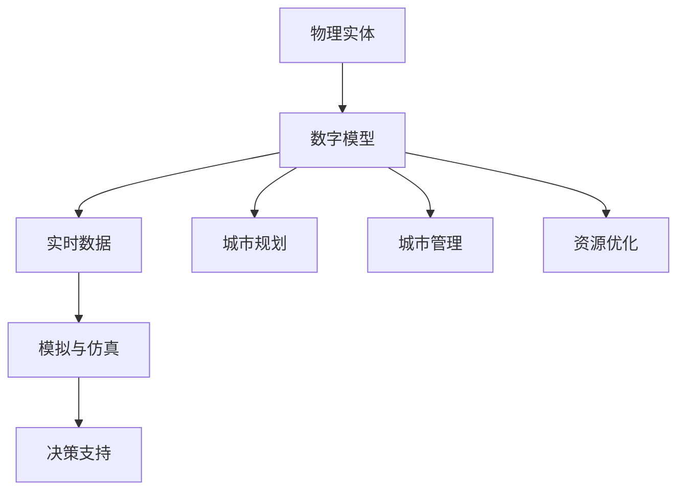

                 

## 数字孪生在智慧城市规划决策中的应用

### 关键词
- 数字孪生
- 智慧城市
- 城市规划
- 决策支持
- 数据驱动的模拟

### 摘要
本文旨在探讨数字孪生技术在智慧城市规划决策中的应用。首先，我们将概述数字孪生的基本概念、技术原理及其在各个领域的应用。接着，本文将深入分析数字孪生在智慧城市规划中的核心价值，并通过具体的实例来展示其应用场景。最后，我们将讨论数字孪生技术的挑战及其未来发展，提供一些最佳实践建议。

### 背景介绍

数字孪生（Digital Twin）是一种将物理实体在数字世界中映射的先进技术，通过实时数据的采集、处理和分析，实现物理实体与数字孪生的同步更新。数字孪生的概念最早可以追溯到2002年，美国密歇根大学教授Michael Grieves首次提出了这个概念。随着信息技术的迅猛发展，数字孪生技术逐渐在制造业、航空航天、医疗健康等领域得到广泛应用。

近年来，随着智慧城市的兴起，数字孪生技术开始在城市规划和管理中扮演重要角色。智慧城市是指利用各种先进技术（如物联网、大数据、人工智能等）来实现城市高效、智能、可持续发展的新型城市形态。数字孪生作为智慧城市的重要组成部分，通过构建城市数字模型，可以实现对城市运行状态、环境、交通、人口等的实时监测和分析，从而为城市规划决策提供有力支持。

### 核心概念与联系

数字孪生的核心概念包括物理实体、数字模型、实时数据、模拟与仿真等。物理实体指的是实际存在的城市基础设施、建筑、道路等；数字模型是对这些物理实体的数字映射，包括几何形状、物理属性、功能模块等；实时数据是通过传感器、监测设备等实时采集的城市运行状态数据；模拟与仿真则是对数字模型进行动态模拟和分析，以预测城市运行情况。

以下是数字孪生概念之间的关系架构 Mermaid 流程图：



在这个架构中，物理实体通过实时数据被映射为数字模型，数字模型经过模拟与仿真，可以提供决策支持，进而用于城市规划、城市管理和资源优化。

### 数字孪生技术原理

数字孪生技术的实现涉及多个方面，包括数据采集、数据处理、建模与仿真、可视化等。

#### 数据采集

数据采集是数字孪生技术的核心环节，通过传感器、无人机、卫星遥感等技术手段，可以实时获取城市基础设施、环境、交通等方面的数据。这些数据包括温度、湿度、风速、交通流量、人口密度等。数据采集的准确性直接影响数字孪生的可靠性。

#### 数据处理

采集到的数据通常是非常庞大的，需要通过数据预处理技术（如数据清洗、数据归一化、特征提取等）进行清洗和转换，以便后续分析和建模。数据处理还包括数据存储和管理，常见的技术有分布式存储、数据库、数据湖等。

#### 建模与仿真

数字模型是数字孪生的核心，它通过数学建模和计算机仿真技术，将物理实体的属性和行为在数字世界中复现。建模方法包括几何建模、物理建模、统计建模等。仿真技术则通过模拟物理实体的运行状态，预测其在不同条件下的表现。

#### 可视化

可视化是将数字孪生的数据以图形、图像、动画等形式展示出来的技术。通过可视化，可以直观地了解城市的运行状态，辅助决策者做出更加科学的规划决策。

### 数字孪生在智慧城市规划中的应用

数字孪生技术在智慧城市规划中有着广泛的应用。以下是几个典型的应用场景：

#### 智能交通管理

通过数字孪生技术，可以实时监测城市交通流量，预测交通拥堵情况，并优化交通信号控制策略。例如，北京在2018年启动了基于数字孪生的智能交通管理系统，通过实时数据分析和仿真模拟，有效缓解了交通拥堵问题。

#### 城市环境监测

数字孪生技术可以实时监测城市空气质量、水质、噪音等环境指标，提供环境预警和治理建议。例如，杭州利用数字孪生技术对城市水体进行监测和治理，显著改善了水质。

#### 城市规划与设计

数字孪生技术可以帮助城市规划师和设计师在虚拟环境中进行城市布局和建筑设计，通过模拟和分析，优化城市空间利用和功能布局。例如，新加坡利用数字孪生技术对新的城市规划进行了多次模拟和优化，实现了高效率的城市运作。

### 数字孪生在智慧城市规划决策中的作用

数字孪生技术为智慧城市规划决策提供了强大的支持。以下是几个关键作用：

#### 数据驱动的决策支持

数字孪生技术通过实时数据采集和分析，可以为决策者提供准确的数据支持。例如，通过对交通数据的分析，可以预测未来某段时间的交通流量，从而优化交通信号控制，减少拥堵。

#### 实时监控与预警

数字孪生技术可以实现城市运行的实时监控，及时发现异常情况并发出预警。例如，通过监测环境数据，可以及时发现污染源，并采取相应措施。

#### 资源优化与效率提升

数字孪生技术可以帮助优化城市资源的使用，提高城市运作效率。例如，通过智能电网数字孪生，可以实现电力资源的合理分配，降低能源消耗。

### 数字孪生系统的设计与实现

设计一个有效的数字孪生系统需要综合考虑硬件、软件、数据、算法等多个方面。以下是数字孪生系统的设计原则和关键步骤：

#### 设计原则

1. **一致性**：确保数字孪生与物理实体的一致性，保证数据的准确性和实时性。
2. **可扩展性**：系统应具备良好的扩展性，能够适应未来技术的发展。
3. **安全性**：确保数据的安全性和隐私性。
4. **灵活性**：系统应具备灵活性，能够根据不同的需求进行调整。

#### 设计步骤

1. **需求分析**：明确数字孪生的目标和需求，包括数据采集、处理、建模、仿真、可视化等。
2. **架构设计**：根据需求设计系统的架构，包括硬件架构和软件架构。
3. **数据采集与处理**：选择合适的数据采集和处理技术，确保数据的质量和实时性。
4. **建模与仿真**：建立数字模型并进行仿真，验证系统的性能和可靠性。
5. **可视化**：设计可视化界面，展示数字孪生的运行状态和分析结果。
6. **系统部署与测试**：部署系统并进行测试，确保系统的稳定性和可靠性。

### 项目实战

以下是一个数字孪生系统的项目实战案例，展示如何从开发环境搭建到源代码实现，再到代码解读和实际案例分析。

#### 开发环境搭建

1. **硬件环境**：选择高性能服务器、存储设备和网络设备。
2. **软件环境**：安装操作系统、数据库、中间件、开发工具等。

#### 源代码实现

1. **数据采集模块**：使用Python编写代码，实现传感器数据的实时采集和传输。
2. **数据处理模块**：使用Python和Apache Kafka实现数据处理和存储。
3. **建模与仿真模块**：使用Python和MATLAB建立数字模型并进行仿真。
4. **可视化模块**：使用Python和D3.js实现数据可视化。

#### 代码解读与分析

1. **数据采集代码**：
   ```python
   import serial
   ser = serial.Serial('COM3', 9600)
   while True:
       data = ser.readline()
       print(data)
   ```

2. **数据处理代码**：
   ```python
   from kafka import KafkaProducer
   producer = KafkaProducer(bootstrap_servers=['localhost:9092'])
   while True:
       data = f"{timestamp} {temperature} {humidity}"
       producer.send('sensor_data', data.encode())
   ```

3. **建模与仿真代码**：
   ```matlab
   % 参数初始化
   a = 0.5;
   b = 1.0;
   % 数据读取
   data = readtable('sensor_data.csv');
   % 模型训练
   model = fitlm(data, 'temperature ~ humidity');
   % 预测
   prediction = predict(model, data.humidity);
   ```

4. **可视化代码**：
   ```javascript
   var dataset = [[0, 20], [10, 30], [20, 40]];
   var x = d3.scaleLinear().domain([0, 50]).range([0, 400]);
   var y = d3.scaleLinear().domain([0, 50]).range([400, 0]);
   var line = d3.line().x(function(d) { return x(d[0]); }).y(function(d) { return y(d[1]); });
   d3.select("#chart").append("path").attr("d", line(dataset));
   ```

#### 实际案例分析和详细讲解剖析

1. **案例背景**：某城市在高峰时段交通拥堵严重，需要通过数字孪生技术优化交通信号控制。

2. **案例分析**：通过数字孪生系统，实时监测交通流量和拥堵情况，分析拥堵原因，并优化信号灯控制策略。具体步骤如下：

   - **数据采集**：采集交通流量、车速、道路状况等数据。
   - **数据处理**：对数据进行清洗和转换，提取关键特征。
   - **建模与仿真**：建立交通流量预测模型，模拟不同信号灯控制策略下的交通状况。
   - **可视化**：实时展示交通流量和拥堵情况，提供决策支持。

3. **项目小结**：通过数字孪生技术，有效缓解了交通拥堵问题，提高了交通效率。未来可以进一步优化算法和模型，实现更精准的预测和控制。

### 挑战与未来展望

数字孪生技术在智慧城市规划决策中的应用面临一些挑战：

1. **数据隐私和安全**：实时数据的采集和处理涉及大量个人隐私信息，如何确保数据的安全性和隐私性是一个重要问题。

2. **技术复杂性**：数字孪生技术涉及多个领域的技术，包括传感器技术、数据处理、建模与仿真、可视化等，技术实现较为复杂。

3. **系统集成与兼容性**：不同系统之间的数据格式、协议和接口可能不兼容，需要解决系统集成与兼容性问题。

未来，随着人工智能、物联网、大数据等技术的不断发展，数字孪生技术将在智慧城市规划决策中发挥更加重要的作用。以下是几个未来展望：

1. **智能化的数字孪生系统**：通过引入人工智能技术，实现数字孪生系统的智能化，提高预测和决策的准确性。

2. **跨领域的融合应用**：数字孪生技术与其他领域（如智慧农业、智慧医疗等）的融合，将带来更广泛的应用场景。

3. **数据共享与协同**：建立数据共享平台，实现城市数据的互联互通，提高数据利用效率。

### 最佳实践 tips、小结、注意事项、拓展阅读等内容

#### 最佳实践 tips

1. **数据质量是关键**：确保数据采集、处理和存储的准确性，提高数字孪生的可靠性。
2. **模型优化是重点**：不断优化数字模型和算法，提高预测和决策的准确性。
3. **用户参与是关键**：鼓励用户参与数字孪生系统的建设和使用，提高系统的实用性和满意度。

#### 小结

数字孪生技术在智慧城市规划决策中具有巨大的潜力，通过实时数据采集、建模与仿真、可视化等技术，可以为城市规划者提供有力的支持，提高决策的准确性和效率。

#### 注意事项

1. **数据隐私和安全**：在数据采集、处理和存储过程中，应高度重视数据隐私和安全问题，采取相应的安全措施。
2. **技术选择要合理**：根据实际需求和预算，选择合适的技术方案，避免过度复杂化。

#### 拓展阅读

1. **《数字孪生：下一代智能制造技术》**：详细介绍了数字孪生技术的概念、原理和应用。
2. **《智慧城市：数字孪生技术与应用》**：探讨了数字孪生技术在智慧城市中的广泛应用。
3. **《深度学习在智慧城市中的应用》**：介绍了深度学习技术在智慧城市中的应用，包括数字孪生技术。

作者：AI天才研究院/AI Genius Institute & 禅与计算机程序设计艺术 /Zen And The Art of Computer Programming

