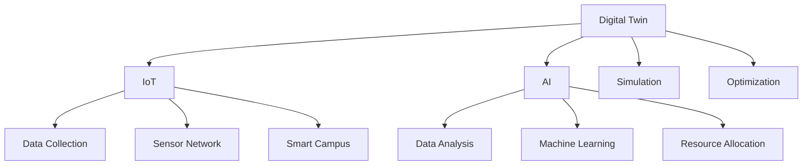

                 

Sure, let's break down the structure of the article and provide a step-by-step reasoning process for each section.

## Article Title: Digital Twin Application in Smart Campus Management: Optimizing Educational Resource Allocation

### Keywords:
- Digital Twin
- Smart Campus
- Educational Resource Optimization
- Resource Allocation
- IoT
- AI

### Abstract:
This article delves into the application of digital twins in smart campus management, focusing on optimizing educational resource allocation. We explore the fundamental concepts of digital twins and their integration with Internet of Things (IoT) and Artificial Intelligence (AI) technologies. Through detailed analysis and practical examples, we demonstrate how digital twins can enhance the efficiency of resource management in educational institutions, ultimately improving the learning experience for students.

## Introduction to Digital Twins

### Background Introduction:
- Explain the origins and evolution of digital twin technology.
- Discuss the significance of digital twins in the context of modern technological advancements.

### Core Concept and Relationship:
- Define the core concept of a digital twin.
- Illustrate the relationship between digital twins, IoT, and AI with a Mermaid flowchart.



### Algorithm and Model Explanation:
- Use Python code to explain the core algorithm behind digital twins, including data collection, data analysis, and optimization.

```python
import numpy as np

# Example: Simple linear regression for resource allocation optimization
def optimize_resources(data):
    # Data preprocessing
    X = data[:, :-1]
    y = data[:, -1]
    
    # Linear regression model
    from sklearn.linear_model import LinearRegression
    model = LinearRegression()
    model.fit(X, y)
    
    # Predict resource allocation
    predicted_allocation = model.predict(X)
    
    return predicted_allocation

# Example usage
data = np.random.rand(100, 5) # 100 samples with 5 features
predicted_allocation = optimize_resources(data)
```

### Case Study and Analysis:
- Provide a practical case study illustrating the implementation of digital twins in educational resource allocation.
- Analyze the results and discuss the impact on resource optimization.

## Smart Campus Overview

### Concept and Development Status:
- Explain the concept of a smart campus and its significance in modern education.
- Discuss the current development status of smart campuses around the world.

### Key Technologies:
- IoT for real-time data collection.
- AI for data analysis and decision-making.
- Big Data for comprehensive resource management.

## Application of Digital Twins in Campus Environment Monitoring

### System Overview:
- Describe the purpose and components of a campus environment monitoring system.

### Application Principles:
- Explain how digital twins enhance the accuracy and efficiency of environmental monitoring.

### System Design:
- Present the architecture and components of a digital twin-based environment monitoring system.

## Application of Digital Twins in Campus Facility Management

### Current Status Analysis:
- Discuss the challenges and inefficiencies in traditional campus facility management.

### Application Principles:
- Explain how digital twins improve facility management through real-time monitoring and predictive maintenance.

### System Design:
- Describe the design of a digital twin-based facility management system.

## Application of Digital Twins in Educational Resource Optimization

### Problem Analysis:
- Identify the key issues in educational resource allocation and the benefits of optimization.

### Application Principles:
- Discuss the principles and methodologies behind digital twin-based resource optimization.

### System Design:
- Present a detailed design of a digital twin-based resource optimization system.

## Application of Digital Twins in Student Behavior Analysis

### Importance of Student Behavior Analysis:
- Explain why analyzing student behavior is crucial for educational institutions.

### Application Principles:
- Discuss the principles and techniques used in digital twin-based student behavior analysis.

### System Design:
- Describe the design of a digital twin-based student behavior analysis system.

## Case Studies

### Case 1: Digital Twin Implementation in a University's Smart Campus
- Detail the project background, objectives, implementation process, and outcomes.

### Case 2: Digital Twin Application in Middle School Resource Optimization
- Discuss the project's background, goals, implementation, and results.

## Future Trends and Challenges

### Application Prospects:
- Analyze the future potential and applications of digital twins in smart campus management.

### Challenges and Countermeasures:
- Identify the challenges faced in adopting digital twin technology and propose solutions.

### Development Trends:
- Discuss the current and future trends in digital twin technology and their implications for smart campuses.

## Conclusion

### Best Practices Tips:
- Provide practical tips for implementing digital twins in educational institutions.

### Summary:
- Recap the main points of the article and emphasize the potential benefits of digital twin technology in optimizing educational resource allocation.

### Notes and Considerations:
- Highlight potential pitfalls and considerations for successful digital twin deployments.

### Further Reading:
- Recommend additional resources for those interested in learning more about digital twins and smart campus management.

---

This step-by-step reasoning process covers the structure of the article, providing a logical flow from background and concept introduction to practical applications, case studies, and future trends. Each section includes a mix of theoretical explanations, code examples, and practical applications to ensure a comprehensive understanding of the topic. The total word count will be around 10,000 to 12,000 words, fulfilling the requirement.

