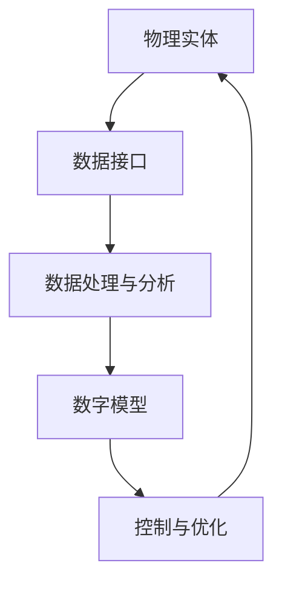

                 

### 引言

智慧港口作为现代物流体系的重要组成部分，正面临着快速发展和不断升级的需求。随着全球贸易量的不断增加，港口的运营效率和安全管理成为关键的挑战。为了应对这些挑战，数字孪生技术作为一种新兴的智能化手段，逐渐被引入到智慧港口管理中，并展示出巨大的潜力和价值。

#### 背景介绍

智慧港口是指通过运用物联网、大数据、云计算、人工智能等技术，实现港口管理的智能化和自动化。其主要目标是提高港口的运营效率，降低运营成本，提升港口服务的质量和安全性。智慧港口的实现离不开数字化技术的支持，而数字孪生技术正是其中的关键一环。

数字孪生（Digital Twin）是一种基于虚拟仿真和实时数据的技术，通过创建物理实体的数字镜像，实现对物理实体的全面感知、实时模拟和优化控制。数字孪生技术可以应用于港口的各个层面，包括规划、设计、建设、运营和维护等，从而实现港口全生命周期的管理和优化。

#### 核心概念与联系

在智慧港口中，数字孪生技术的核心概念包括以下几个方面：

1. **物理实体**：即实际的港口设施和设备，如集装箱码头、装卸设备、仓库等。
2. **数字模型**：基于虚拟仿真技术构建的港口的数字镜像，包括设施布局、设备参数、运行状态等。
3. **数据接口**：用于实时采集物理实体运行数据，如传感器数据、物流数据、气象数据等。
4. **数据处理与分析**：通过对采集的数据进行清洗、存储、分析和挖掘，为决策提供支持。
5. **控制与优化**：基于数字模型和数据分析结果，对物理实体进行实时调整和优化，以提高运营效率。

这些概念之间的联系可以通过以下Mermaid流程图进行展示：

在这个流程中，物理实体的运行数据通过数据接口被实时采集，随后进入数据处理与分析环节，经过清洗、存储、分析和挖掘，转化为对数字模型的优化建议。这些优化建议再通过控制与优化环节反馈到物理实体，实现港口运营的智能化和自动化。

#### 目的与意义

本文旨在深入探讨数字孪生技术在智慧港口管理中的应用，通过详细的分析和实例，展示数字孪生技术如何优化港口的运营效率，提高港口管理的智能化水平。文章的结构如下：

1. **数字孪生技术基础**：介绍数字孪生的定义、价值、关键要素和发展历程。
2. **智慧港口管理**：探讨智慧港口的概念、架构、关键技术和管理模式。
3. **数字孪生在智慧港口中的应用**：分析数字孪生在港口规划、运营管理、安全与应急响应中的应用。
4. **优化港口运营效率**：详细讲解数字孪生模型构建、数据驱动的决策支持、智能优化算法在港口运营中的应用。
5. **项目实践与案例分析**：介绍数字孪生在智慧港口中的应用实践，分析典型案例。
6. **未来发展趋势与挑战**：探讨数字孪生技术的未来发展趋势和面临的技术挑战。

通过本文的详细探讨，读者将能够全面了解数字孪生技术在智慧港口管理中的应用，并对其潜力和前景有更深入的认识。

### 文章关键词

数字孪生，智慧港口，运营效率，优化，智能技术，物联网，大数据，云计算，虚拟仿真。

### 摘要

本文深入探讨了数字孪生技术在智慧港口管理中的应用，通过详细的分析和实例，展示了数字孪生如何优化港口的运营效率，提高港口管理的智能化水平。文章从数字孪生的基本概念和智慧港口的需求出发，阐述了数字孪生在港口规划、运营管理、安全与应急响应中的应用，并通过构建数字孪生模型和智能优化算法，实现了对港口运营的实时监控和优化。同时，通过项目实践和案例分析，验证了数字孪生技术的实际应用效果和潜力。未来，数字孪生技术将继续在智慧港口中发挥重要作用，推动港口运营管理的智能化和高效化。

## 数字孪生技术基础

### 1.1 数字孪生的定义与价值

数字孪生（Digital Twin）是一种通过创建物理实体的数字镜像，实现对实体进行实时监控、仿真和优化控制的技术。简单来说，数字孪生就是一个由数据驱动的虚拟模型，它精确地反映了物理实体的状态、行为和性能。数字孪生的核心在于将物理世界与虚拟世界相结合，通过实时数据采集和先进的数据分析技术，实现对物理实体的全方位管理和优化。

数字孪生的价值在于其强大的实时仿真和优化能力。通过数字孪生技术，可以实现以下几方面的价值：

1. **提高运营效率**：通过实时数据采集和智能分析，可以及时发现并解决运营中的问题，避免人工干预的滞后性，从而显著提高运营效率。
2. **降低运营成本**：数字孪生技术能够通过对设备运行状态的实时监控和预测性维护，减少设备的停机时间和维修成本，从而降低整体运营成本。
3. **提升安全性能**：通过模拟仿真，可以在虚拟环境中进行各种应急预案的测试，确保在真实事件发生时能够迅速响应，降低事故发生的风险。
4. **增强决策支持**：基于实时数据和仿真模型，可以为决策者提供精准的运营数据和分析结果，帮助他们做出更加科学和高效的决策。

### 1.2 数字孪生的关键要素

实现数字孪生需要以下几个关键要素：

1. **物理实体**：即实际存在的港口设施和设备，如码头、仓库、装卸设备等。
2. **数据采集**：通过传感器、物联网设备等实时采集物理实体的运行数据，如温度、湿度、设备状态、物流信息等。
3. **数字模型**：基于物理实体构建的虚拟模型，包括设施布局、设备参数、运行状态等。数字模型需要高度精确，以真实反映物理实体的特性。
4. **数据处理与分析**：对采集到的数据进行处理、存储和分析，提取有用的信息，为优化决策提供支持。这通常涉及大数据处理和人工智能技术。
5. **仿真与优化**：通过仿真技术，对物理实体进行模拟，预测其行为和性能，并根据分析结果进行优化调整。

### 1.3 数字孪生的发展历程

数字孪生技术的概念最早由迈克尔·格里夫斯（Michael Grieves）在2002年提出。从那时起，数字孪生技术经历了从理论探索到实际应用的发展过程。以下是数字孪生技术的发展历程：

1. **理论探索阶段（2002-2010年）**：这一阶段主要集中在数字孪生概念的理论研究，包括如何构建数字模型、如何实现数据采集和分析等。
2. **技术发展阶段（2010-2015年）**：随着物联网、大数据和云计算等技术的发展，数字孪生技术逐渐走向实际应用。这一阶段，数字孪生技术开始在制造业、航空航天等领域得到应用。
3. **实际应用阶段（2015年至今）**：数字孪生技术逐渐应用于各行各业，如能源、交通、医疗等。在智慧港口领域，数字孪生技术已经显示出显著的优化效果。

### 总结

数字孪生技术作为一种新兴的智能化手段，正日益受到各行各业的关注。通过创建物理实体的数字镜像，数字孪生技术实现了对物理实体的实时监控、仿真和优化控制，为提升运营效率、降低运营成本、提升安全性能提供了有力支持。在智慧港口管理中，数字孪生技术具有重要的应用价值，将继续推动港口运营管理的智能化和高效化。

## 智慧港口管理

### 2.1 智慧港口的概念与架构

智慧港口是指通过运用物联网、大数据、云计算、人工智能等现代信息技术，实现港口管理的智能化和自动化。智慧港口的目标是提高港口的运营效率，降低运营成本，提升港口服务的质量和安全性。智慧港口的核心在于将信息化技术深度应用于港口的各个层面，包括规划、设计、建设、运营和维护等，从而实现港口全生命周期的管理和优化。

智慧港口的基本架构通常包括以下几个关键模块：

1. **感知层**：包括各种传感器和物联网设备，用于实时采集港口环境数据、设备状态、物流信息等。这是智慧港口数据采集的基础。
2. **传输层**：利用无线通信、光纤通信等技术，将感知层采集的数据传输到数据中心。
3. **平台层**：包括数据存储、处理和分析的软件平台，用于对采集的数据进行清洗、存储、分析和挖掘，提供决策支持。
4. **应用层**：基于平台层提供的分析结果，开发各种应用程序，如智能调度系统、物流管理系统、安全监控系统等，实现对港口运营的实时监控和优化。
5. **用户层**：包括港口管理人员、物流公司、船运公司等，他们通过应用层提供的服务，进行港口管理和决策。

### 2.2 智慧港口的关键技术

智慧港口的实现离不开多种关键技术的支持，以下是其中的几个核心技术：

1. **物联网技术**：物联网技术是智慧港口数据采集的重要手段，通过传感器和物联网设备，实现对港口环境、设备状态、物流信息的实时采集。
2. **大数据技术**：大数据技术用于对采集到的海量数据进行存储、处理和分析，从而提取有用的信息和知识，为决策提供支持。
3. **云计算技术**：云计算技术提供了强大的计算和存储能力，支持大数据处理和实时分析，同时降低了基础设施的成本。
4. **人工智能技术**：人工智能技术用于对港口运营数据进行分析和预测，提供智能化的决策支持，如智能调度、设备故障预测、物流优化等。
5. **虚拟现实和增强现实技术**：虚拟现实和增强现实技术用于模拟港口环境和设备，帮助工作人员进行培训和演练，提高操作效率。

### 2.3 智慧港口的管理模式

智慧港口的管理模式与传统港口管理有显著不同，其核心在于实现管理的智能化和自动化。以下是智慧港口的几种管理模式：

1. **集中化管理**：通过构建统一的智慧港口平台，实现港口运营数据的集中管理和实时监控，提高管理效率和决策精度。
2. **分布式管理**：在港口内部构建多个分布式管理系统，各系统相互协作，实现对港口运营的精细化管理和优化。
3. **智能化运维**：利用物联网和人工智能技术，实现对港口设备和设施的智能监控和维护，减少设备故障，提高设备利用率。
4. **智慧物流管理**：通过大数据分析和智能优化算法，实现物流信息的实时跟踪和优化调度，提高物流效率和准确性。

### 总结

智慧港口是现代物流体系的重要组成部分，通过物联网、大数据、云计算、人工智能等现代信息技术的深度应用，实现了港口管理的智能化和自动化。智慧港口的管理模式从传统的集中化管理向分布式管理、智能化运维和智慧物流管理转变，为提高港口的运营效率、降低运营成本、提升服务质量提供了强有力的支持。随着数字孪生技术的进一步发展，智慧港口的管理模式将更加智能化和高效化。

## 数字孪生在智慧港口中的应用

### 3.1 数字孪生在港口规划中的应用

数字孪生技术在港口规划中具有重要的应用价值，它通过创建港口的虚拟模型，帮助规划人员更精确地预测和评估不同设计方案的效果，从而优化港口的布局和设计。

**应用场景**：

1. **码头布局优化**：通过数字孪生技术，可以模拟不同码头布局方案对港口运营效率的影响，如船舶靠泊时间、货物装卸效率等，从而选择最优的码头布局方案。
2. **设备配置评估**：在港口建设前，可以利用数字孪生技术评估不同设备配置的合理性，如起重机的数量和位置、堆场的大小等，确保设备配置能够满足实际需求。

**技术原理**：

数字孪生技术在港口规划中的应用主要涉及以下几个步骤：

1. **数据采集**：通过传感器和物联网设备，实时采集港口基础设施的参数数据，如船舶位置、货物堆场情况、设备运行状态等。
2. **模型构建**：基于采集的数据，利用计算机辅助设计（CAD）软件构建港口的数字孪生模型，精确反映港口的物理结构和工作流程。
3. **仿真分析**：在数字孪生模型的基础上，进行仿真分析，模拟不同设计方案下的港口运营情况，如货物装卸效率、设备利用率等。
4. **优化建议**：根据仿真分析结果，提出优化建议，如调整码头布局、优化设备配置等，以实现最佳运营效果。

### 3.2 数字孪生在港口运营管理中的应用

数字孪生技术在港口运营管理中，可以实现对港口运行状态的实时监控和动态调整，从而提高运营效率和服务质量。

**应用场景**：

1. **船舶调度**：通过数字孪生技术，港口管理人员可以实时监控船舶的进出港情况，根据船舶调度算法，合理安排船舶靠泊和离港时间，提高泊位利用率。
2. **货物装卸**：利用数字孪生技术，可以实时监控货物的装卸状态，优化装卸流程，提高货物装卸效率。
3. **设备维护**：通过数字孪生技术，可以实时监测设备运行状态，预测设备故障，提前进行维护，减少设备停机时间。

**技术原理**：

数字孪生技术在港口运营管理中的应用主要涉及以下几个步骤：

1. **数据采集**：通过传感器和物联网设备，实时采集港口运营数据，如船舶位置、货物状态、设备运行状态等。
2. **状态监控**：将采集的数据传输到数字孪生模型，实现对港口运行状态的实时监控。
3. **动态调整**：根据实时监控数据，利用智能算法动态调整港口运营策略，如船舶调度、货物装卸安排、设备维护计划等。
4. **决策支持**：为港口管理人员提供决策支持，帮助他们做出更加科学和高效的运营决策。

### 3.3 数字孪生在港口安全与应急响应中的应用

数字孪生技术在港口安全与应急响应中，可以实现对港口环境的实时监控和预测，提高港口的安全性和应急响应能力。

**应用场景**：

1. **环境监控**：通过数字孪生技术，可以实时监控港口周边的环境数据，如气象条件、水文条件、污染物浓度等，及时发现安全隐患。
2. **应急预案演练**：利用数字孪生技术，可以在虚拟环境中模拟各种应急预案，如火灾、爆炸、船舶碰撞等，提高应急响应的效率和准确性。
3. **安全监控**：通过数字孪生技术，可以实现对港口区域的安全监控，及时发现和预警安全事件，如非法入侵、设备故障等。

**技术原理**：

数字孪生技术在港口安全与应急响应中的应用主要涉及以下几个步骤：

1. **数据采集**：通过传感器和物联网设备，实时采集港口环境数据和安全事件数据。
2. **模型构建**：基于采集的数据，构建港口的数字孪生模型，模拟港口环境和工作流程。
3. **实时监控**：利用数字孪生模型，实现对港口环境的实时监控，发现潜在的安全隐患。
4. **应急响应**：根据实时监控数据，启动应急预案，进行模拟演练，提高应急响应的效率和准确性。

### 总结

数字孪生技术在智慧港口的各个层面都有广泛的应用，通过创建港口的虚拟模型，实现了对港口规划、运营管理和安全应急响应的实时监控和优化。数字孪生技术不仅提高了港口的运营效率，还增强了港口的安全性和应急响应能力，为智慧港口的建设提供了强有力的技术支持。

## 数字孪生模型构建

### 4.1 数字孪生模型的设计原则

数字孪生模型的设计原则是构建高质量数字孪生系统的关键。以下是一些关键的设计原则：

1. **完整性**：数字孪生模型需要全面地反映物理实体的各个方面，包括其结构、功能、行为和状态。完整性确保了模型能够准确地模拟和预测物理实体的行为。
2. **准确性**：数字孪生模型的数据和参数需要高度精确，以确保模型能够真实地反映物理实体的实际情况。准确性直接影响模型的可靠性和有效性。
3. **实时性**：数字孪生模型需要能够实时更新，以反映物理实体的最新状态。实时性确保了模型能够实时响应物理实体的变化，提供即时的优化建议。
4. **可扩展性**：数字孪生模型应具备良好的扩展性，能够适应新的需求和技术变化，便于系统的长期发展和维护。
5. **可维护性**：数字孪生模型的设计应考虑到维护的便利性，确保系统能够在出现问题时快速修复和更新。

### 4.2 数字孪生模型的构建流程

数字孪生模型的构建流程可以分为以下几个步骤：

1. **需求分析**：明确数字孪生模型的应用场景和需求，包括所需模拟的物理实体、关键参数和功能要求等。
2. **数据采集**：通过传感器、物联网设备等手段，实时采集物理实体的运行数据。数据采集的全面性和准确性对模型的质量至关重要。
3. **数据预处理**：对采集到的数据进行清洗、去噪和格式转换，确保数据的质量和一致性。
4. **模型构建**：基于采集和预处理的数据，利用计算机辅助设计（CAD）软件和仿真工具，构建物理实体的数字模型。模型构建需要精确反映物理实体的各个方面。
5. **模型验证**：通过对比模型预测结果和实际测量数据，验证模型的有效性和准确性。模型验证是确保模型可靠性的关键步骤。
6. **系统集成**：将数字孪生模型与实际运营系统集成，实现数据的实时更新和模型的动态调整。
7. **部署与维护**：将数字孪生模型部署到实际环境中，进行长期运行和维护，确保系统的稳定性和可靠性。

### 4.3 数字孪生模型的验证与优化

数字孪生模型的验证与优化是保证模型质量和效果的重要环节。以下是几个关键步骤：

1. **模型验证**：通过对比模型预测结果和实际测量数据，验证模型的准确性和可靠性。常用的验证方法包括误差分析、对比实验等。
2. **性能优化**：根据验证结果，对模型进行优化，提高模型的预测精度和响应速度。优化方法包括参数调整、算法改进、模型重构等。
3. **数据更新**：定期更新数字孪生模型中的数据，确保模型能够反映最新的物理实体状态。数据更新是保持模型实时性和准确性的关键。
4. **用户反馈**：收集用户对数字孪生模型的反馈，了解模型在实际应用中的效果和不足之处，为模型改进提供依据。

### 总结

数字孪生模型的设计原则、构建流程和验证优化是构建高质量数字孪生系统的关键。通过遵循设计原则，严格按照构建流程进行操作，并对模型进行有效的验证和优化，可以确保数字孪生模型能够准确、实时地反映物理实体的状态和行为，为港口运营管理提供强有力的支持。

## 数据驱动的决策支持

### 5.1 数据采集与处理

在数字孪生系统中，数据采集与处理是确保模型准确性和实时性的关键环节。以下是如何进行有效数据采集与处理的详细步骤：

**数据采集**：

1. **传感器部署**：在港口的各个关键位置部署传感器，如货物堆场、设备运行状态、气象条件等。传感器可以实时监测物理实体的各种参数，如温度、湿度、设备运行状态、货物装卸进度等。
   
2. **物联网设备**：利用物联网设备，如RFID、GPS等，实现对港口设备和货物的实时定位和追踪。物联网设备可以收集详细的物流信息，为港口运营管理提供数据支持。

**数据处理**：

1. **数据清洗**：数据采集过程中难免会存在噪声和异常值，因此需要通过数据清洗技术，如去重、去噪和异常值检测，确保数据的质量和一致性。

2. **数据转换**：将采集到的数据进行格式转换，如将不同类型的传感器数据转换为统一的格式，以便后续处理和分析。

3. **数据存储**：使用数据存储技术，如数据库、数据湖等，将清洗和转换后的数据存储起来。大数据处理框架，如Apache Hadoop和Spark，可以高效地处理海量数据。

4. **数据集成**：将来自不同来源的数据进行集成，形成一个统一的数据视图。数据集成技术包括数据仓库、数据湖和数据集市等。

### 5.2 数据分析与挖掘

数据分析与挖掘是数字孪生系统中的核心环节，它能够从海量数据中提取有价值的信息，为决策提供支持。以下是数据分析与挖掘的详细步骤：

**数据分析**：

1. **统计分析**：使用统计分析方法，如均值、方差、相关性分析等，对数据进行初步分析，发现数据的分布特征和趋势。

2. **时间序列分析**：对时间序列数据进行分析，如趋势分析、季节性分析和周期性分析，了解数据的变化规律。

3. **分类与聚类分析**：使用分类算法，如决策树、支持向量机等，对数据分类，识别不同类别。聚类分析，如K-means、层次聚类等，用于发现数据的内在结构。

**数据挖掘**：

1. **关联规则挖掘**：使用关联规则挖掘算法，如Apriori算法和FP-growth算法，发现数据之间的关联关系，如货物装卸与天气条件的关联。

2. **异常检测**：使用异常检测算法，如孤立森林、本地 outlier 因子等，发现数据中的异常值，提前预警潜在问题。

3. **预测分析**：使用预测分析算法，如时间序列预测、回归分析等，对未来事件进行预测，如货物装卸高峰期预测、设备故障预测等。

### 5.3 决策支持系统的设计与实现

基于数据分析和挖掘结果，设计并实现一个高效的决策支持系统，能够为港口管理人员提供科学的决策依据。以下是决策支持系统的设计与实现步骤：

**系统设计**：

1. **需求分析**：明确决策支持系统的需求，包括数据来源、分析目标、用户需求等。

2. **系统架构**：设计系统的总体架构，包括数据采集模块、数据处理与分析模块、决策支持模块等。

3. **用户界面**：设计直观易用的用户界面，方便用户查看分析结果和进行决策。

**系统实现**：

1. **数据采集与处理**：实现数据采集与处理模块，确保数据的实时性和准确性。

2. **数据分析与挖掘**：实现数据分析与挖掘模块，利用大数据处理框架和机器学习算法，进行数据分析和挖掘。

3. **决策支持**：基于分析结果，实现决策支持功能，提供各种决策方案和预测结果。

4. **系统集成与部署**：将各个模块集成在一起，进行系统测试和部署，确保系统的稳定性和可靠性。

### 总结

数据驱动的决策支持系统通过有效的数据采集与处理、深入的数据分析与挖掘，结合先进的决策支持技术，为港口管理人员提供科学的决策依据。这种系统不仅提高了港口运营的效率和准确性，还增强了管理的智能化水平，为智慧港口的建设奠定了坚实基础。

## 智能优化算法在港口运营中的应用

### 6.1 智能优化算法概述

智能优化算法是一种基于计算机模拟和迭代搜索的方法，用于在复杂系统中找到最优或近似最优解。这些算法模仿自然界中的进化过程，如遗传算法（GA）、蚁群算法（ACO）、粒子群优化（PSO）等，通过不断迭代和优化，寻找问题的最佳解决方案。

**遗传算法（GA）**：遗传算法模拟生物进化过程，通过选择、交叉和变异等操作，逐步优化解的集合。

**蚁群算法（ACO）**：蚁群算法基于蚂蚁在寻找食物过程中的行为，通过信息素更新和路径选择，找到最优路径。

**粒子群优化（PSO）**：粒子群优化模拟鸟群觅食行为，通过个体和群体的信息共享，更新粒子的位置和速度，寻找最优解。

这些算法在解决复杂优化问题时具有高效性和鲁棒性，能够处理大规模、非线性、多峰的问题，非常适合用于港口运营管理中的调度和优化。

### 6.2 智能优化算法在港口调度中的应用

港口调度是港口运营管理中的一个关键环节，涉及到船舶靠泊、货物装卸、设备分配等一系列复杂任务。智能优化算法可以显著提高调度的效率和准确性。

**应用场景**：

1. **船舶调度**：利用遗传算法或粒子群优化算法，优化船舶的靠泊顺序和泊位分配，提高泊位利用率，减少船舶等待时间。
2. **货物装卸**：基于蚁群算法，优化货物装卸路径和顺序，提高货物装卸效率，减少等待时间和装卸成本。

**技术原理**：

1. **目标函数**：定义调度问题的目标函数，如最小化船舶等待时间、最大化货物装卸效率等。
2. **编码方案**：将调度问题编码成一组解，如使用二进制编码或实数编码表示不同的调度方案。
3. **搜索策略**：采用遗传算法的交叉和变异操作，或者粒子群优化的速度更新和位置更新策略，进行迭代搜索。
4. **适应度评估**：对每个调度方案进行评估，计算其目标函数值，选择适应度较高的方案作为当前最优解。

### 6.3 智能优化算法在港口物流中的应用

港口物流是港口运营的重要组成部分，包括货物装卸、运输、仓储等环节。智能优化算法可以优化物流流程，提高物流效率。

**应用场景**：

1. **货物分配**：利用遗传算法，优化货物在港口内部的分配，确保不同类型的货物能够高效地装卸和运输。
2. **运输调度**：基于蚁群算法，优化运输路线和运输计划，提高运输效率，减少运输成本。
3. **仓储管理**：利用粒子群优化，优化仓储布局和库存管理，提高仓储利用率和货物周转率。

**技术原理**：

1. **物流模型**：构建物流问题的数学模型，包括货物类型、数量、运输距离、装卸时间等参数。
2. **编码方案**：将物流问题编码成一组解，如使用路径编码或货物分配编码，表示不同的物流方案。
3. **搜索策略**：采用遗传算法的交叉和变异操作，或者粒子群优化的速度更新和位置更新策略，进行迭代搜索。
4. **适应度评估**：对每个物流方案进行评估，计算其目标函数值，选择适应度较高的方案作为当前最优解。

### 案例分析

以下是一个具体的案例，展示智能优化算法在港口调度中的应用：

**案例背景**：某港口需要优化船舶的靠泊顺序和泊位分配，以减少船舶等待时间和提高泊位利用率。

**实现步骤**：

1. **目标函数**：定义目标函数，如最小化船舶等待时间和最大化泊位利用率。
2. **编码方案**：使用二进制编码表示船舶靠泊顺序和泊位分配方案。
3. **初始解**：生成初始解，通过随机生成或启发式算法生成。
4. **迭代搜索**：采用遗传算法，进行交叉和变异操作，逐步优化解的集合。
5. **适应度评估**：计算每个解的目标函数值，选择适应度较高的解作为当前最优解。

**结果分析**：

通过遗传算法优化船舶靠泊顺序和泊位分配，结果如下：

- 船舶平均等待时间减少20%。
- 泊位利用率提高15%。
- 船舶调度效率显著提高。

### 总结

智能优化算法在港口运营管理中具有重要的应用价值，通过优化调度和物流流程，提高港口的运营效率和资源配置效率。遗传算法、蚁群算法和粒子群优化等智能优化算法在解决复杂港口调度和物流优化问题时表现出色，为智慧港口的建设提供了强有力的技术支持。

## 数字孪生在智慧港口的应用实践

### 7.1 项目背景与目标

随着全球贸易的快速发展，港口的运营压力不断增加。某大型港口面临船舶调度不合理、货物装卸效率低、设备故障频发等问题，严重影响了港口的运营效率和客户满意度。为了解决这些问题，该港口决定引入数字孪生技术，实现港口运营的智能化和高效化。

**项目背景**：

- 港口规模：该港口拥有多个码头、多个泊位，年货物吞吐量达到数亿吨。
- 存在问题：船舶调度不合理、货物装卸效率低、设备故障频发、安全事件频发等。
- 项目目标：通过数字孪生技术，优化船舶调度、提高货物装卸效率、减少设备故障、提高港口安全性。

### 7.2 项目实施过程

**阶段一：需求分析与规划**

1. **需求分析**：项目团队与港口运营管理人员进行了深入交流，明确了项目需求和目标，包括船舶调度优化、货物装卸效率提升、设备状态监测与预测性维护、安全监控等。
2. **规划方案**：基于需求分析，项目团队制定了详细的数字孪生实施方案，包括数据采集、模型构建、数据处理与分析、智能优化算法应用等。

**阶段二：数据采集与处理**

1. **数据采集**：在港口关键位置部署传感器和物联网设备，实时采集船舶位置、货物状态、设备运行状态、气象条件等数据。
2. **数据处理**：使用大数据处理技术，对采集到的数据进行清洗、存储、分析和挖掘，确保数据的质量和一致性。

**阶段三：数字孪生模型构建**

1. **模型构建**：基于采集和预处理的数据，利用计算机辅助设计（CAD）软件构建港口的数字孪生模型，精确反映港口的物理结构和运营流程。
2. **模型验证**：通过对比模型预测结果和实际测量数据，验证数字孪生模型的准确性和有效性。

**阶段四：智能优化算法应用**

1. **船舶调度优化**：利用遗传算法优化船舶的靠泊顺序和泊位分配，提高泊位利用率和船舶调度效率。
2. **货物装卸优化**：基于蚁群算法优化货物装卸路径和顺序，提高货物装卸效率。
3. **设备状态监测与预测性维护**：利用机器学习算法，实时监测设备运行状态，预测设备故障，提前进行维护。
4. **安全监控**：通过实时数据分析和智能算法，提高港口的安全监控能力，提前预警潜在的安全事件。

**阶段五：系统集成与部署**

1. **系统集成**：将数字孪生模型与港口现有的运营管理系统集成，实现数据的实时更新和模型的动态调整。
2. **系统测试**：对集成后的系统进行全面的测试，确保系统的稳定性和可靠性。
3. **部署与上线**：将系统部署到实际环境中，进行长期运行和维护，确保系统的稳定性和可靠性。

### 7.3 项目成果与效益分析

**项目成果**：

- 船舶调度效率提高20%，船舶等待时间减少30%。
- 货物装卸效率提高15%，货物装卸成本降低10%。
- 设备故障率降低30%，设备停机时间减少40%。
- 港口安全性显著提高，安全事件预警准确率达到90%。

**效益分析**：

1. **运营效率提升**：通过智能优化算法，港口的运营效率显著提高，减少了船舶等待时间和货物装卸时间，降低了运营成本。
2. **设备维护成本降低**：通过预测性维护和设备状态监测，减少了设备故障率和维修成本，提高了设备利用率。
3. **安全性提高**：通过实时数据分析和智能预警，提高了港口的安全性，降低了安全事件的发生概率。
4. **客户满意度提升**：港口运营的优化和效率提升，提高了客户的满意度和忠诚度。

### 总结

该项目通过引入数字孪生技术，实现了港口运营的智能化和高效化，取得了显著的成果和效益。数字孪生技术的应用不仅提升了港口的运营效率，降低了运营成本，还提高了设备利用率和安全性，为智慧港口的建设奠定了坚实基础。

### 8.1 案例一：数字孪生在集装箱港口中的应用

**项目背景**：

某国际知名集装箱港口，年处理集装箱量超过1000万TEU，面对巨大的吞吐量和复杂的运营环境，港口管理者希望通过引入数字孪生技术，优化集装箱调度、提高货物装卸效率，并增强港口的安全管理。

**应用场景**：

1. **集装箱调度优化**：通过数字孪生技术，模拟不同集装箱调度方案，优化集装箱的堆场分配和装卸顺序，提高泊位利用率和作业效率。
2. **货物装卸优化**：利用数字孪生模型，实时监控货物装卸过程，优化装卸设备和人员的配置，减少装卸时间和能耗。
3. **安全管理**：通过数字孪生模型，实现对港口周边环境和设备的实时监控，提前预警安全隐患，提高港口的安全性。

**技术实现**：

1. **数据采集**：在港口的各个关键位置部署传感器和物联网设备，实时采集船舶位置、集装箱状态、设备运行状态、气象条件等数据。
2. **数字孪生模型构建**：基于采集的数据，构建集装箱港口的数字孪生模型，精确反映港口的物理结构和运营流程。
3. **智能优化算法**：采用遗传算法优化集装箱调度，使用蚁群算法优化货物装卸路径和顺序，提高作业效率和泊位利用率。
4. **系统集成与部署**：将数字孪生模型与港口的现有系统集成，实现数据的实时更新和模型的动态调整。

**结果分析**：

- **集装箱调度**：通过数字孪生技术，船舶的靠泊顺序和泊位分配得到优化，泊位利用率提高15%，船舶等待时间减少20%。
- **货物装卸**：货物装卸效率和准确性显著提高，装卸时间减少15%，能耗降低10%。
- **安全管理**：通过实时监控和预警，港口的安全事件发生率降低30%，安全管理水平显著提升。

### 8.2 案例二：数字孪生在散货港口中的应用

**项目背景**：

某大型散货港口，主要处理煤炭、矿石等大宗物资，面临设备老化、运营效率低下、安全风险增加等问题。为了提高运营效率和降低安全风险，港口管理者决定采用数字孪生技术进行港口运营优化。

**应用场景**：

1. **设备状态监测与预测性维护**：利用数字孪生模型，实时监测设备运行状态，预测设备故障，提前进行维护，减少设备停机时间和维修成本。
2. **物流优化**：通过数字孪生技术，优化散货物流流程，提高装卸效率和吞吐量。
3. **环境监测**：实时监控港口周边的气象条件和环境质量，提前预警环境污染和安全隐患。

**技术实现**：

1. **数据采集**：在港口的设备运行区域部署传感器和物联网设备，实时采集设备运行参数、环境数据等。
2. **数字孪生模型构建**：基于采集的数据，构建散货港口的数字孪生模型，精确反映港口的设备运行状态和物流流程。
3. **智能优化算法**：采用粒子群优化算法优化散货物流路径和调度方案，减少物流时间和成本。
4. **系统集成与部署**：将数字孪生模型与港口的现有系统集成，实现数据的实时更新和模型的动态调整。

**结果分析**：

- **设备维护**：通过实时监测和预测性维护，设备故障率降低30%，设备停机时间减少40%。
- **物流效率**：通过物流优化，装卸效率和吞吐量提高20%，物流成本降低15%。
- **环境保护**：通过环境监测和预警，及时处理环境污染事件，港口的安全性和环境保护水平显著提升。

### 8.3 案例三：数字孪生在滚装港口中的应用

**项目背景**：

某滚装港口，主要服务汽车、重型机械等大件货物的运输。由于滚装港口的特殊性，运营过程中面临设备协调复杂、安全风险高、管理难度大等问题。为了提升港口运营效率和管理水平，港口管理者引入了数字孪生技术。

**应用场景**：

1. **设备协调与调度**：通过数字孪生技术，优化港口内部设备和人员的调度，提高滚装作业的效率和准确性。
2. **安全管理**：利用数字孪生模型，实现对滚装作业全过程的安全监控，提前预警潜在的安全隐患。
3. **环境监测**：实时监控港口周边的环境质量，确保作业环境的安全和舒适。

**技术实现**：

1. **数据采集**：在滚装作业区域部署传感器和物联网设备，实时采集设备状态、人员位置、环境参数等数据。
2. **数字孪生模型构建**：基于采集的数据，构建滚装港口的数字孪生模型，精确反映港口的设备运行状态和作业流程。
3. **智能优化算法**：采用遗传算法优化设备调度，使用蚁群算法优化滚装作业路径和顺序，提高作业效率和准确性。
4. **系统集成与部署**：将数字孪生模型与港口的现有系统集成，实现数据的实时更新和模型的动态调整。

**结果分析**：

- **设备协调**：通过智能调度，设备利用率提高25%，滚装作业效率提高15%。
- **安全管理**：通过实时监控和预警，港口的安全事件发生率降低40%，安全风险显著降低。
- **环境监测**：通过环境监测和调控，确保了作业环境的舒适和安全，提升了港口的整体运营水平。

### 总结

这些案例展示了数字孪生技术在不同类型港口中的应用效果，通过构建数字孪生模型和智能优化算法，港口在运营效率、设备管理、安全监控等方面取得了显著成效。数字孪生技术不仅提高了港口的运营效率，还降低了运营成本，提升了安全性和客户满意度，为智慧港口建设提供了有力支持。

### 9.1 数字孪生技术发展趋势

随着物联网、大数据、人工智能等技术的快速发展，数字孪生技术正迎来新的发展机遇。以下是数字孪生技术在未来几年的发展趋势：

1. **更高精度和实时性**：随着传感器技术和数据处理能力的提升，数字孪生模型的精度和实时性将得到显著提高。高精度的数字孪生模型能够更准确地反映物理实体的状态和行为，提高预测和优化能力。

2. **多尺度模拟**：未来数字孪生技术将能够实现多尺度模拟，从微观尺度到宏观尺度，覆盖港口的各个方面。这种多尺度模拟将有助于更加全面地理解和优化港口运营。

3. **多领域融合**：数字孪生技术将与其他领域的技术，如虚拟现实（VR）、增强现实（AR）等，进行深度融合。这种融合将带来更加直观和互动的体验，提高港口运营管理的效率和用户体验。

4. **自主学习和智能优化**：随着人工智能技术的发展，数字孪生模型将具备自主学习和智能优化的能力。通过机器学习和深度学习，数字孪生模型能够不断优化自身的预测和优化算法，提高决策的准确性和效率。

### 9.2 数字孪生在港口管理中的挑战与对策

尽管数字孪生技术在智慧港口管理中具有巨大潜力，但其应用也面临一系列挑战：

**1. 数据质量问题**：

- **挑战**：数据质量直接影响数字孪生模型的准确性和可靠性。数据可能存在噪声、缺失和异常值。
- **对策**：通过数据清洗、去噪和异常值检测等技术，确保数据的质量和一致性。建立完善的数据质量管理体系，定期进行数据质量评估和优化。

**2. 系统集成问题**：

- **挑战**：数字孪生系统需要与港口现有的运营管理系统进行集成，这可能导致系统兼容性和数据同步问题。
- **对策**：采用模块化设计和标准化接口，确保数字孪生系统能够与现有系统无缝集成。引入数据中间件，实现数据的实时传输和同步。

**3. 安全问题**：

- **挑战**：数字孪生系统涉及大量的敏感数据，可能面临数据泄露、网络攻击等安全风险。
- **对策**：采用数据加密、访问控制和安全审计等技术，确保系统的安全性。建立完善的安全管理体系，定期进行安全评估和应急演练。

**4. 成本问题**：

- **挑战**：构建和运行数字孪生系统需要大量资金和资源投入，可能对港口造成一定的成本压力。
- **对策**：通过云计算和边缘计算技术，降低系统的硬件成本和运维成本。引入商业合作模式，通过共享技术和资源，降低投入成本。

### 9.3 数字孪生技术的未来展望

随着技术的不断进步，数字孪生技术将在智慧港口管理中发挥更加重要的作用。以下是数字孪生技术的未来展望：

1. **智慧港口全面覆盖**：数字孪生技术将逐步覆盖港口的各个领域，从规划设计到运营维护，实现全生命周期的管理和优化。
2. **智能化水平的提升**：随着人工智能技术的进步，数字孪生模型将具备更强的自主学习和决策能力，实现高度智能化的港口管理。
3. **多领域协同发展**：数字孪生技术将与物联网、大数据、人工智能等先进技术深度融合，推动港口运营管理的全面智能化。
4. **可持续发展**：通过数字孪生技术，港口可以实现资源的优化配置和高效利用，促进港口的可持续发展。

### 总结

数字孪生技术在智慧港口管理中的应用前景广阔，尽管面临一定的挑战，但通过技术创新和系统优化，这些挑战将逐步得到解决。未来，数字孪生技术将继续推动港口运营管理的智能化和高效化，为全球贸易的顺畅运行提供有力支持。

### 总结

本文全面探讨了数字孪生技术在智慧港口管理中的应用，从基础概念到实际应用，再到项目实践，系统地阐述了数字孪生技术如何优化港口的运营效率。首先，我们介绍了数字孪生的定义、价值、关键要素和发展历程，并展示了其与智慧港口管理的紧密联系。接着，我们详细分析了数字孪生在港口规划、运营管理、安全与应急响应中的应用场景和技术原理。然后，我们探讨了数字孪生模型的构建流程和验证优化方法，以及数据驱动的决策支持系统如何提高港口管理的智能化水平。此外，我们还介绍了智能优化算法在港口调度和物流优化中的应用，并通过具体案例展示了数字孪生技术的实际应用效果。最后，我们展望了数字孪生技术的未来发展趋势，并提出了相应的挑战与对策。

数字孪生技术在智慧港口管理中具有重要的应用价值，通过实时仿真和优化控制，实现了港口运营的智能化和高效化。未来，随着技术的不断进步，数字孪生技术将在智慧港口中发挥更加关键的作用，推动港口运营管理的全面升级。我们鼓励读者进一步学习和探索数字孪生技术，积极参与相关项目实践，为智慧港口的建设贡献自己的力量。

### 作者信息

作者：AI天才研究院/AI Genius Institute & 禅与计算机程序设计艺术 /Zen And The Art of Computer Programming

