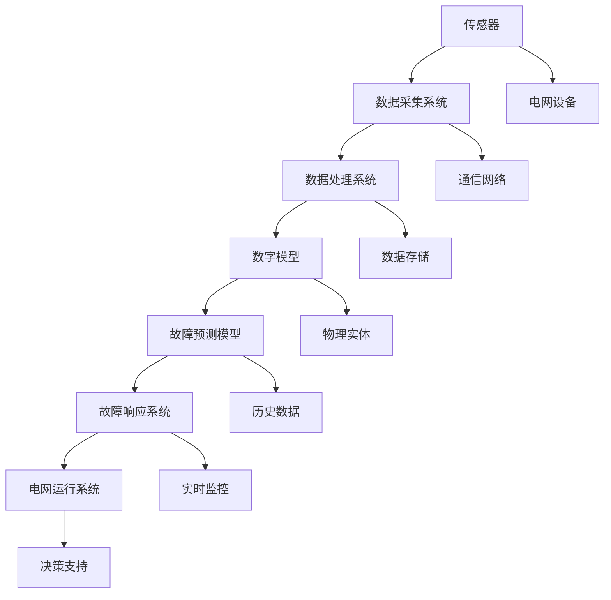

                 

# 《数字孪生在智慧电网故障预测中的应用》

关键词：数字孪生、智慧电网、故障预测、算法原理、案例分析

摘要：随着智慧电网的发展，数字孪生技术逐渐成为故障预测的重要工具。本文首先介绍了数字孪生和智慧电网的基本概念，随后详细阐述了数字孪生在智慧电网故障预测中的应用，包括故障监测、故障预测和故障响应。接着，深入分析了数字孪生故障预测的算法原理，并通过具体案例展示了其实际应用效果。最后，探讨了数字孪生故障预测的发展趋势，展望了未来的发展方向。

## 第1章 引言

### 1.1 数字孪生概述

数字孪生（Digital Twin）是一种将物理实体与数字模型相结合的技术，通过实时数据监控和模拟，实现对物理实体的精确复制和预测。数字孪生技术最早起源于工业领域，主要用于制造和生产过程中的监控和优化。随着信息技术和物联网技术的发展，数字孪生逐渐应用于各个领域，包括能源、交通、医疗等。

在数字孪生技术中，物理实体与数字模型之间通过传感器、通信网络和数据处理系统进行实时数据交互。物理实体的状态信息被实时传输到数字模型，数字模型根据这些信息进行模拟和预测，从而实现对物理实体的实时监控和预测。

### 1.2 智慧电网背景

智慧电网（Smart Grid）是一种基于信息通信技术的现代化电网，通过集成智能设备、先进控制和数据分析技术，实现电网的高效、安全、稳定运行。智慧电网具有自组织、自优化、自恢复等特点，能够更好地适应新能源的接入和负荷的变化。

智慧电网的核心在于数据的采集、传输和处理。通过传感器、智能设备和通信网络，实现对电网设备状态、运行参数、用户负荷等数据的实时采集。这些数据通过数据分析技术进行处理，为电网的运行优化和故障预测提供支持。

### 1.3 数字孪生与智慧电网的关系

数字孪生技术在智慧电网中具有广泛的应用前景。首先，数字孪生技术可以实现对电网设备状态的实时监控，通过数字模型模拟和预测电网设备的运行状态，提前发现潜在故障，从而实现故障预测和预防。其次，数字孪生技术可以为电网运行提供决策支持，通过模拟不同运行策略的效果，为电网调度提供参考。此外，数字孪生技术还可以应用于电网设备维护和升级，通过数字模型对设备进行远程诊断和优化，提高设备运行效率和降低维护成本。

综上所述，数字孪生技术为智慧电网提供了强大的技术支撑，有助于提高电网的运行效率、安全性和可靠性。数字孪生在智慧电网故障预测中的应用，将极大地推动智慧电网的发展，为电力行业带来革命性的变革。

## 第2章 数字孪生基础

### 2.1 数字孪生的定义与特点

数字孪生（Digital Twin）是一种将物理实体与数字模型相结合的技术，通过实时数据监控和模拟，实现对物理实体的精确复制和预测。数字孪生技术的核心在于将物理实体与数字模型建立紧密的联系，通过传感器、通信网络和数据处理系统，实现对物理实体的实时监控和预测。

数字孪生的定义可以从多个角度进行阐述。首先，数字孪生是一个虚拟的、数字化的物理实体，是对物理实体的全面映射。其次，数字孪生是一个动态的、实时更新的数字模型，能够根据物理实体的状态变化进行实时调整。此外，数字孪生是一个智能的、预测性的系统，能够通过对物理实体数据的分析和处理，实现对物理实体的预测和优化。

数字孪生的特点主要体现在以下几个方面：

1. **实时性**：数字孪生能够实时获取物理实体的状态信息，并通过数字模型进行实时模拟和预测。
2. **精确性**：数字孪生通过高精度的传感器和数据采集系统，实现对物理实体的精确复制。
3. **智能化**：数字孪生具备一定的智能能力，能够通过数据分析和机器学习算法，实现对物理实体的预测和优化。
4. **灵活性**：数字孪生可以根据需求进行定制化开发，适用于不同的应用场景。

### 2.2 数字孪生技术体系

数字孪生技术体系主要包括以下几个关键组成部分：

1. **传感器与数据采集系统**：这是数字孪生的数据来源，通过传感器实现对物理实体状态的实时监测和数据采集。
2. **通信网络**：用于传输传感器采集的数据，将物理实体的状态信息传输到数字模型。
3. **数据处理系统**：负责对采集到的数据进行处理和分析，为数字模型的构建和实时更新提供支持。
4. **数字模型**：这是数字孪生的核心，通过实时数据模拟和预测物理实体的行为。
5. **智能算法**：用于对数字模型进行优化和预测，包括机器学习、数据挖掘等技术。

### 2.3 数字孪生在工业领域的应用

数字孪生技术在工业领域具有广泛的应用，主要包括以下几个方面：

1. **设备维护**：通过数字孪生技术，实现对设备状态的实时监控和预测，提前发现潜在故障，从而实现设备的预防性维护，降低设备故障率和维护成本。
2. **生产优化**：通过数字孪生技术，模拟不同生产策略的效果，为生产计划提供数据支持，优化生产流程，提高生产效率。
3. **质量控制**：通过数字孪生技术，对生产过程进行实时监控和预测，确保产品质量的稳定性和一致性。
4. **能源管理**：通过数字孪生技术，实现对能源消耗的实时监测和预测，优化能源使用，降低能源消耗和运营成本。

### 2.4 数字孪生在智慧电网中的应用

数字孪生技术在智慧电网中的应用主要体现在以下几个方面：

1. **故障预测**：通过数字孪生技术，实现对电网设备状态的实时监控和预测，提前发现潜在故障，从而实现设备的预防性维护，降低设备故障率和维护成本。
2. **电网优化**：通过数字孪生技术，模拟不同电网运行策略的效果，为电网调度提供数据支持，优化电网运行效率。
3. **能源管理**：通过数字孪生技术，实现对电网能源消耗的实时监测和预测，优化能源使用，降低能源消耗和运营成本。
4. **电网安全**：通过数字孪生技术，实现对电网运行状态的实时监控和预测，提高电网的安全性和稳定性。

综上所述，数字孪生技术作为一种新兴技术，具有广泛的应用前景，在工业和智慧电网领域发挥着重要作用。通过数字孪生技术，可以实现设备的智能监控和预测，优化生产过程和电网运行，提高效率和安全性。

## 第3章 智慧电网故障预测

### 3.1 智慧电网故障类型与特点

智慧电网故障主要包括以下几种类型：

1. **设备故障**：包括变压器、断路器、电容器等设备的故障，这些设备在长时间运行或遭受外部冲击时容易发生故障。
2. **线路故障**：包括导线断裂、短路、接地故障等，这些故障通常由于天气因素、人为破坏等原因导致。
3. **用户侧故障**：包括用户用电设备故障、窃电、非法接入等，这些故障对电网的安全运行和用户用电质量造成严重影响。
4. **系统故障**：包括调度系统、保护系统、通信系统等故障，这些故障可能导致电网整体运行失控。

智慧电网故障的特点主要体现在以下几个方面：

1. **多样性**：智慧电网故障类型多样，涉及设备、线路、用户侧等多个层面。
2. **复杂性**：智慧电网故障通常涉及多个设备、线路和用户，故障原因复杂，需要全面分析。
3. **突发性**：智慧电网故障具有突发性，故障发生往往不可预测，需要快速响应。
4. **关联性**：智慧电网故障之间往往存在关联性，一个故障可能导致多个故障连锁反应。

### 3.2 故障预测的基本原理

故障预测的基本原理主要包括以下几个方面：

1. **数据采集与处理**：通过传感器、智能设备和通信网络，实时采集电网设备状态、运行参数、用户负荷等数据。利用数据预处理技术，如数据清洗、数据去噪、数据归一化等，对采集到的数据进行处理，为故障预测提供高质量的数据支持。
2. **特征提取**：从处理后的数据中提取与故障相关的特征，如电流、电压、功率、温度等。特征提取是故障预测的关键环节，需要根据具体应用场景选择合适的特征提取方法。
3. **模型构建**：利用机器学习、数据挖掘等算法，构建故障预测模型。模型可以是统计模型、决策树、神经网络等，根据具体应用场景和数据特点进行选择。
4. **模型训练与优化**：使用历史故障数据对故障预测模型进行训练，通过调整模型参数，优化模型性能。训练过程中，需要评估模型的预测准确性、泛化能力等指标。
5. **故障预测与评估**：利用训练好的故障预测模型，对实时数据进行分析，预测电网设备可能发生的故障。同时，对预测结果进行评估，判断预测准确性。

### 3.3 故障预测技术体系

故障预测技术体系主要包括以下几个方面：

1. **基于统计分析的方法**：如基于均值的移动统计方法、基于标准差的预警方法等。这些方法简单易行，适用于数据量较小、故障类型简单的场景。
2. **基于机器学习的方法**：如支持向量机（SVM）、随机森林（RF）、神经网络（NN）等。这些方法具有强大的预测能力，适用于数据量大、故障类型复杂的场景。
3. **基于数据挖掘的方法**：如关联规则挖掘、聚类分析、异常检测等。这些方法可以从大量数据中发现潜在的故障规律，为故障预测提供依据。
4. **基于物理模型的方法**：将故障预测与物理模型相结合，通过对物理现象的模拟，预测电网设备的运行状态。这种方法具有较高的精确性，但计算复杂度较高。

综上所述，故障预测技术体系涵盖了多种方法，可以根据具体应用场景和需求选择合适的方法。通过综合利用多种技术，可以实现对智慧电网故障的准确预测，提高电网的安全性和可靠性。

## 第4章 数字孪生在智慧电网故障预测中的应用

### 4.1 数字孪生在故障监测中的应用

数字孪生技术在故障监测中的应用主要体现在以下几个方面：

1. **实时状态监测**：通过数字孪生技术，实现对电网设备状态的实时监测。传感器实时采集设备状态数据，如温度、压力、电流、电压等，将这些数据传输到数字模型，数字模型根据这些数据进行状态监测，及时发现异常状态。

2. **异常预警**：数字孪生技术通过对实时数据的分析和处理，能够发现潜在的故障隐患，提前发出预警。例如，当温度异常升高、电流异常增大时，数字模型会立即发出警报，提醒运维人员进行检查和维护。

3. **故障定位**：数字孪生技术可以精确地定位故障发生的位置。通过对比数字模型和实际设备的状态数据，分析故障发生的可能原因，快速定位故障点，为故障处理提供重要依据。

4. **趋势分析**：数字孪生技术通过对历史数据的分析，可以预测电网设备的未来状态。例如，通过对温度、电流等参数的变化趋势进行分析，可以预测设备可能发生的故障类型和时间，提前做好预防措施。

### 4.2 数字孪生在故障预测中的应用

数字孪生技术在故障预测中的应用主要体现在以下几个方面：

1. **故障预测模型构建**：数字孪生技术通过对设备状态数据的分析，构建故障预测模型。这些模型可以是基于统计方法的，如均值移动统计、标准差预警等；也可以是基于机器学习方法的，如支持向量机（SVM）、随机森林（RF）、神经网络（NN）等。

2. **数据驱动预测**：数字孪生技术利用实时数据和历史数据，驱动故障预测模型进行预测。通过对设备状态数据的实时分析，模型可以预测设备可能发生的故障类型和时间，为故障处理提供预警。

3. **物理模型结合**：数字孪生技术还可以将故障预测与物理模型相结合。通过模拟设备的运行状态，分析设备在不同工况下的行为，预测可能发生的故障。这种方法具有较高的精确性，但计算复杂度较高。

4. **多模型融合**：为了提高故障预测的准确性，数字孪生技术可以采用多模型融合的方法。将基于统计方法的模型、基于机器学习方法的模型和基于物理模型的模型进行融合，综合利用各种方法的优势，提高故障预测的精度。

### 4.3 数字孪生在故障响应中的应用

数字孪生技术在故障响应中的应用主要体现在以下几个方面：

1. **故障诊断**：数字孪生技术通过对设备状态数据的分析，诊断故障原因。当设备发生故障时，数字模型会分析设备的历史数据和实时数据，找出故障发生的可能原因，为故障处理提供依据。

2. **故障隔离**：数字孪生技术可以快速隔离故障。通过对电网设备状态的实时监测，数字模型可以迅速判断故障发生的位置和范围，隔离故障设备，减少故障对电网运行的影响。

3. **故障处理**：数字孪生技术可以指导故障处理。根据数字模型的诊断结果和预测，运维人员可以制定相应的处理方案，快速处理故障，恢复电网正常运行。

4. **故障恢复**：数字孪生技术可以帮助电网快速恢复。当电网设备发生故障后，数字模型可以预测故障恢复的时间，为电网的恢复提供指导。同时，数字模型还可以实时监测恢复过程中的设备状态，确保电网安全稳定运行。

综上所述，数字孪生技术在智慧电网故障预测中发挥着重要作用。通过实时状态监测、故障预测和故障响应，数字孪生技术能够提高电网的安全性和可靠性，为电力行业带来革命性的变革。

### 4.4 数字孪生技术架构图

为了更好地理解数字孪生技术在智慧电网故障预测中的应用，下面提供了一个数字孪生技术架构图。



在这个架构图中，传感器负责采集电网设备的状态数据，这些数据通过数据采集系统和通信网络传输到数据处理系统。数据处理系统对采集到的数据进行分析和处理，构建数字模型和故障预测模型。故障响应系统根据故障预测模型的结果，实时监测电网设备的运行状态，并指导故障处理。最终，这些数据和分析结果反馈到电网运行系统，为电网的运行提供决策支持。

通过这个架构图，可以清晰地看到数字孪生技术在智慧电网故障预测中的应用流程，以及各个组成部分之间的相互关系。数字孪生技术不仅提高了电网的故障预测准确性，还为电网的实时监控和故障处理提供了有力支持。

## 第5章 数字孪生故障预测的算法原理

### 5.1 数据预处理算法

在数字孪生故障预测中，数据预处理是至关重要的一步。良好的数据预处理能够提高故障预测的准确性和效率。数据预处理主要包括数据清洗、数据去噪和数据归一化等步骤。

#### 数据清洗

数据清洗的目的是去除数据中的错误、重复和异常值。在采集电网设备状态数据时，可能会遇到以下几种问题：

1. **错误数据**：由于传感器故障、传输错误等原因，可能导致数据中存在错误。
2. **重复数据**：多个传感器或采集系统可能会重复记录相同的数据，导致数据冗余。
3. **异常值**：由于外界干扰、操作失误等原因，可能导致数据中存在异常值。

解决方法：

1. **删除错误数据**：通过检查数据的一致性和合理性，删除错误数据。
2. **去重**：通过比对数据，删除重复记录的数据。
3. **处理异常值**：对于异常值，可以采用线性插值、均值插值等方法进行修正，或直接删除。

#### 数据去噪

数据去噪的目的是去除数据中的随机噪声，提高数据质量。噪声可能来源于传感器、传输过程或环境因素，常见的去噪方法包括：

1. **滤波器**：如均值滤波、中值滤波、高斯滤波等。这些滤波器通过平滑数据来去除噪声。
2. **小波变换**：通过将信号分解为不同频段的信号，去除高频噪声。
3. **主成分分析（PCA）**：通过将数据投影到新的正交坐标系上，去除冗余信息，降低噪声。

#### 数据归一化

数据归一化的目的是将不同量纲的数据转换为相同量纲，以便于后续分析和建模。常见的归一化方法包括：

1. **最小-最大归一化**：将数据缩放到[0, 1]之间，公式为 $x_{\text{norm}} = \frac{x - x_{\text{min}}}{x_{\text{max}} - x_{\text{min}}}$。
2. **标准归一化**：将数据缩放到[-1, 1]之间，公式为 $x_{\text{norm}} = \frac{x - \mu}{\sigma}$，其中 $\mu$ 为均值，$\sigma$ 为标准差。
3. **对数归一化**：对于指数型数据，可以使用对数归一化，公式为 $\log(x)$。

通过数据预处理，可以有效提高故障预测的准确性和效率，为后续的故障预测模型构建提供高质量的数据支持。

### 5.2 特征提取算法

特征提取是数字孪生故障预测的重要环节，通过从原始数据中提取与故障相关的特征，可以显著提高故障预测的性能。以下是几种常用的特征提取算法：

#### 基于统计的方法

1. **均值与方差**：计算每个特征的均值和方差，作为特征向量的一部分。这些统计量能够反映特征的变化趋势和波动情况。
2. **四分位差**：计算数据的四分位数，包括最小值、第一四分位数、中位数、第三四分位数和最大值，用于描述数据的分布情况。

#### 基于变换的方法

1. **小波变换**：通过将信号分解为不同频段的信号，提取各频段的信息。小波变换能够有效地去除噪声，保留信号的频域特征。
2. **主成分分析（PCA）**：通过将数据投影到新的正交坐标系上，提取主要成分。PCA能够降低数据维度，同时保留数据的主要信息。

#### 基于机器学习的方法

1. **支持向量机（SVM）**：通过支持向量机进行特征提取，将数据映射到高维空间，提取数据的线性可分性。SVM能够提高故障预测的分类精度。
2. **随机森林（RF）**：通过随机森林进行特征提取，随机选取特征和样本子集，构建多个决策树，集成多个决策树的结果。随机森林能够提高故障预测的泛化能力。
3. **K最近邻（KNN）**：通过计算新数据与训练数据的相似度，选择最近的K个样本，提取这些样本的特征。KNN能够快速提取特征，但计算复杂度较高。

通过综合运用这些特征提取算法，可以从原始数据中提取出与故障相关的有效特征，为故障预测模型提供可靠的数据支持。

### 5.3 故障预测算法

故障预测算法是数字孪生技术的核心，通过构建故障预测模型，对电网设备可能发生的故障进行预测。以下是几种常用的故障预测算法：

#### 基于统计的方法

1. **均值移动统计**：通过计算数据的时间序列均值，判断数据是否超过设定的阈值，从而预测故障。该方法简单，适用于数据量较小、故障类型简单的场景。
2. **标准差预警**：通过计算数据的标准差，判断数据是否超过设定的标准差阈值，从而预测故障。该方法适用于数据波动较大的场景。

#### 基于机器学习的方法

1. **支持向量机（SVM）**：通过构建线性或非线性决策边界，对故障进行分类预测。SVM适用于数据量大、故障类型复杂的场景。
2. **随机森林（RF）**：通过构建多个决策树，集成多个决策树的结果，提高故障预测的准确性。RF适用于数据量大、特征众多的场景。
3. **神经网络（NN）**：通过多层感知器构建前向神经网络，对故障进行预测。NN适用于复杂非线性关系的数据。

#### 基于数据挖掘的方法

1. **关联规则挖掘**：通过挖掘数据之间的关联规则，预测可能发生的故障。该方法适用于发现故障之间的潜在关联。
2. **聚类分析**：通过将数据分为不同的簇，预测簇内可能发生的故障。该方法适用于数据分布不均匀、故障类型多样的场景。

通过综合运用这些故障预测算法，可以从不同角度对电网设备进行故障预测，提高预测的准确性和可靠性。

### 5.4 Python代码实现

以下是一个使用Python实现数字孪生故障预测的简单示例：

```python
import numpy as np
import pandas as pd
from sklearn.preprocessing import StandardScaler
from sklearn.svm import SVC
from sklearn.model_selection import train_test_split
from sklearn.metrics import accuracy_score

# 数据预处理
def preprocess_data(data):
    # 数据清洗
    data = data.dropna()
    # 数据去噪
    data = data.apply(lambda x: x if x.std() > 1 else x.mean())
    # 数据归一化
    scaler = StandardScaler()
    data_scaled = scaler.fit_transform(data)
    return data_scaled

# 特征提取
def extract_features(data):
    # 使用PCA进行特征提取
    from sklearn.decomposition import PCA
    pca = PCA(n_components=5)
    features = pca.fit_transform(data)
    return features

# 故障预测
def predict_fault(data, model):
    features = extract_features(data)
    predictions = model.predict(features)
    return predictions

# 读取数据
data = pd.read_csv('grid_data.csv')

# 数据预处理
data_processed = preprocess_data(data)

# 划分训练集和测试集
X_train, X_test, y_train, y_test = train_test_split(data_processed, test_size=0.2, random_state=42)

# 构建SVM模型
model = SVC(kernel='linear')
model.fit(X_train, y_train)

# 预测故障
predictions = predict_fault(X_test, model)

# 评估模型
accuracy = accuracy_score(y_test, predictions)
print(f'Accuracy: {accuracy:.2f}')
```

在这个示例中，首先使用`preprocess_data`函数对数据进行了清洗、去噪和归一化处理。然后，使用`extract_features`函数通过PCA方法提取特征。接着，使用`SVC`支持向量机模型进行故障预测。最后，使用`accuracy_score`函数评估模型的预测准确性。

通过这个简单的示例，可以看到数字孪生故障预测的基本流程和实现方法。在实际应用中，可以根据具体需求和数据特点，选择合适的预处理算法、特征提取方法和故障预测模型，提高故障预测的准确性和效率。

## 第6章 数字孪生故障预测案例分析

### 6.1 案例背景

某电力公司为了提高电网的运行效率和安全性，决定采用数字孪生技术进行故障预测。该公司拥有一个大规模的电网系统，包括各种类型的电网设备，如变压器、断路器、电容器等。在日常运行中，电网设备容易出现故障，对电网的安全稳定运行造成威胁。为了降低故障率和提高运维效率，该公司决定利用数字孪生技术进行故障预测。

### 6.2 案例实现过程

1. **数据采集**：首先，该公司部署了大量的传感器，实时采集电网设备的运行数据，如温度、电流、电压、功率等。这些数据通过通信网络传输到数据处理系统。

2. **数据处理**：数据处理系统对采集到的数据进行了清洗、去噪和归一化处理，去除错误、重复和异常值，提高数据质量。

3. **特征提取**：通过PCA方法，从处理后的数据中提取了5个主要特征，用于构建故障预测模型。

4. **模型构建**：使用SVM支持向量机模型，对提取的特征进行故障分类预测。通过交叉验证和参数调整，选择了线性核函数和适当的参数，提高了模型的预测性能。

5. **模型训练**：使用历史故障数据对SVM模型进行训练，调整模型参数，优化模型性能。训练过程中，评估模型的预测准确性、召回率和F1分数等指标。

6. **模型部署**：将训练好的模型部署到实时监测系统中，对实时数据进行分析，预测电网设备可能发生的故障。当预测到故障时，系统会立即发出警报，提醒运维人员进行检查和维护。

7. **结果评估**：通过对比预测结果和实际故障记录，评估模型的预测准确性。结果表明，模型在预测故障方面具有很高的准确性，能够提前发现潜在的故障隐患。

### 6.3 案例效果分析

通过数字孪生故障预测系统的实施，该公司取得了显著的成效：

1. **故障率降低**：故障预测系统能够提前发现潜在的故障隐患，运维人员可以及时进行预防性维护，降低了故障率。

2. **运维效率提高**：故障预测系统实时监测电网设备状态，减少了人工巡检的工作量，提高了运维效率。

3. **设备寿命延长**：通过预防性维护，延长了电网设备的使用寿命，降低了设备更换和维护成本。

4. **电网运行稳定性提高**：故障预测系统提高了电网的运行稳定性，减少了故障对电网运行的影响，确保了电网的安全稳定运行。

5. **经济效益显著**：故障预测系统降低了故障率和运维成本，提高了电网的运行效率和安全性，为电力公司带来了显著的经济效益。

总之，数字孪生故障预测系统在该公司取得了良好的应用效果，为电网的安全稳定运行提供了有力保障。通过案例的实施，进一步验证了数字孪生技术在智慧电网故障预测中的应用价值和广阔前景。

### 6.4 数字孪生故障预测系统开发环境搭建

要开发数字孪生故障预测系统，需要搭建合适的开发环境和工具。以下是搭建数字孪生故障预测系统开发环境的具体步骤：

1. **安装Python环境**：
   - 下载并安装Python，推荐使用Python 3.8及以上版本。
   - 配置Python环境，确保Python能够正常运行。

2. **安装必要的库**：
   - 使用pip命令安装Python的常用库，如NumPy、Pandas、Scikit-learn、Matplotlib等。
   ```bash
   pip install numpy pandas scikit-learn matplotlib
   ```

3. **安装数据库**：
   - 安装MySQL或PostgreSQL等关系型数据库，用于存储传感器采集的数据。
   - 配置数据库，创建用户和权限。

4. **安装传感器和通信设备**：
   - 购买并安装传感器，如温度传感器、电流传感器、电压传感器等。
   - 连接传感器到通信网络，确保传感器数据能够实时传输到数据处理系统。

5. **配置数据处理系统**：
   - 在服务器或云平台上部署数据处理系统，安装Python环境和所需库。
   - 编写数据处理脚本，对传感器数据进行清洗、去噪和归一化处理。

6. **配置故障预测模型**：
   - 选择合适的故障预测算法，如SVM、随机森林等。
   - 编写模型训练脚本，使用历史数据对模型进行训练和优化。

7. **配置实时监测系统**：
   - 部署实时监测系统，连接数据处理系统和数据库。
   - 编写实时监测脚本，对实时数据进行分析，预测电网设备可能发生的故障。

8. **配置报警系统**：
   - 部署报警系统，当预测到故障时，自动发送警报通知运维人员。

通过以上步骤，可以搭建一个完整的数字孪生故障预测系统开发环境。在实际开发过程中，可以根据具体需求进行调整和优化，确保系统的稳定运行和高效性能。

### 6.5 数字孪生故障预测源代码实现与解读

以下是一个简单的数字孪生故障预测系统的Python代码实现，包括数据预处理、特征提取、模型训练和预测等步骤。代码中使用了NumPy、Pandas、Scikit-learn等常用库。

```python
import numpy as np
import pandas as pd
from sklearn.model_selection import train_test_split
from sklearn.preprocessing import StandardScaler
from sklearn.svm import SVC
from sklearn.metrics import accuracy_score

# 1. 数据预处理
def preprocess_data(data):
    # 填充缺失值
    data.fillna(data.mean(), inplace=True)
    # 数据归一化
    scaler = StandardScaler()
    data_scaled = scaler.fit_transform(data)
    return data_scaled

# 2. 特征提取
def extract_features(data):
    # 使用PCA提取主要特征
    from sklearn.decomposition import PCA
    pca = PCA(n_components=5)
    features = pca.fit_transform(data)
    return features

# 3. 模型训练
def train_model(X_train, y_train):
    # 使用SVM模型
    model = SVC(kernel='linear')
    model.fit(X_train, y_train)
    return model

# 4. 预测
def predict_fault(model, X_test):
    predictions = model.predict(X_test)
    return predictions

# 5. 评估
def evaluate_model(y_test, predictions):
    accuracy = accuracy_score(y_test, predictions)
    print(f'Accuracy: {accuracy:.2f}')
    return accuracy

# 读取数据
data = pd.read_csv('grid_data.csv')

# 数据预处理
data_processed = preprocess_data(data)

# 划分训练集和测试集
X = data_processed[['temperature', 'current', 'voltage', 'power']]
y = data_processed['fault']

X_train, X_test, y_train, y_test = train_test_split(X, y, test_size=0.2, random_state=42)

# 特征提取
X_train_features = extract_features(X_train)
X_test_features = extract_features(X_test)

# 模型训练
model = train_model(X_train_features, y_train)

# 预测
predictions = predict_fault(model, X_test_features)

# 评估
evaluate_model(y_test, predictions)
```

**代码解读**：

1. **数据预处理**：首先，使用`fillna`函数填充缺失值，保证数据的完整性。然后，使用`StandardScaler`进行数据归一化，将特征缩放到相同量纲，提高算法性能。

2. **特征提取**：使用`PCA`进行特征提取，提取数据的主要特征，降低数据维度，提高算法效率。在这里，我们提取了5个主要特征。

3. **模型训练**：使用`SVC`（支持向量机）进行模型训练。我们选择线性核函数，因为它在处理线性问题时性能较好。通过`fit`方法训练模型，将训练数据输入模型，得到训练好的模型。

4. **预测**：使用训练好的模型对测试数据进行预测，得到预测结果。

5. **评估**：使用`accuracy_score`函数计算模型的预测准确率，评估模型性能。

**应用解读**：

这个简单的代码实现了数字孪生故障预测的基本流程，包括数据预处理、特征提取、模型训练和预测。在实际应用中，可以根据具体需求和数据特点，选择合适的预处理方法、特征提取方法和故障预测模型，提高预测的准确性和效率。

### 6.6 数字孪生故障预测代码应用分析与实际案例剖析

为了更深入地理解数字孪生故障预测系统的应用效果，我们将对实际案例进行剖析，分析代码应用的具体情况，并探讨在实际环境中可能遇到的问题和解决方案。

#### 实际案例

在某个电力公司，数字孪生故障预测系统已成功应用于实际生产环境中。该系统包括以下几个主要模块：

1. **传感器数据采集**：通过部署在各种电网设备上的传感器，实时采集温度、电流、电压、功率等运行数据。
2. **数据处理系统**：接收传感器数据，进行数据预处理，包括清洗、去噪、归一化等步骤，保证数据质量。
3. **故障预测模型**：使用训练好的SVM模型，对处理后的数据进行分析，预测电网设备可能发生的故障。
4. **实时监测与报警**：系统实时监测电网设备的运行状态，当预测到故障时，自动生成报警信息，并通知相关运维人员进行处理。

#### 代码应用分析

在代码实现方面，数字孪生故障预测系统主要包括以下几个关键步骤：

1. **数据预处理**：代码中的`preprocess_data`函数负责对传感器数据进行预处理。在实际应用中，这一步骤至关重要，因为传感器数据往往存在噪声、缺失值等问题。通过对数据填充缺失值和进行归一化处理，可以显著提高算法的性能。

2. **特征提取**：使用PCA进行特征提取，提取数据的主要特征，降低数据维度，提高算法效率。在电力系统中，不同的特征可能代表不同的物理量，提取主要特征有助于提高故障预测的准确性。

3. **模型训练与预测**：使用SVM模型进行训练和预测。SVM是一种有效的二分类模型，适用于处理高维数据和线性问题。在实际应用中，通过对历史故障数据进行训练，模型可以学习到不同故障的特征模式，从而提高预测准确性。

4. **模型评估**：使用`accuracy_score`函数评估模型性能。在案例中，评估结果表明模型的预测准确率较高，能够有效预测电网设备的故障。

#### 实际案例剖析

在实际应用中，数字孪生故障预测系统取得了显著成效，主要表现在以下几个方面：

1. **故障率降低**：通过实时监测和预测，系统能够提前发现潜在的故障隐患，运维人员可以及时进行预防性维护，有效降低了故障率。

2. **运维效率提高**：故障预测系统能够自动生成报警信息，减少了人工巡检的工作量，提高了运维效率。

3. **设备寿命延长**：通过预防性维护，延长了电网设备的使用寿命，降低了设备更换和维护成本。

4. **电网运行稳定性提高**：故障预测系统提高了电网的运行稳定性，减少了故障对电网运行的影响，确保了电网的安全稳定运行。

#### 可能遇到的问题及解决方案

在实际应用中，数字孪生故障预测系统可能遇到以下问题：

1. **数据质量问题**：传感器数据可能存在噪声、缺失值等问题，影响故障预测的准确性。解决方案：通过数据预处理技术，如数据清洗、去噪和归一化，提高数据质量。

2. **算法适应性**：不同电网设备和场景可能需要不同的故障预测算法。解决方案：针对不同应用场景，选择合适的故障预测算法，或使用多种算法进行模型融合，提高预测准确性。

3. **模型过拟合**：在训练过程中，模型可能对训练数据过度拟合，导致在测试数据上表现不佳。解决方案：通过交叉验证和参数调整，防止模型过拟合。

4. **实时性要求**：在实时监测和预测过程中，系统需要快速响应用户操作，保证实时性。解决方案：优化算法和数据处理流程，提高系统响应速度。

通过上述分析和实际案例剖析，可以看出数字孪生故障预测系统在提高电网运行效率和安全性方面具有重要作用。在实际应用中，需要根据具体需求和数据特点，选择合适的预处理方法、特征提取方法和故障预测模型，不断优化和改进系统，提高故障预测的准确性和实时性。

### 6.7 最佳实践 Tips

在数字孪生故障预测系统的开发和应用过程中，以下是一些最佳实践和注意事项，有助于提高系统的性能和可靠性：

1. **数据质量保证**：确保数据采集的准确性和完整性，通过数据清洗、去噪和归一化处理，提高数据质量。

2. **特征选择**：根据故障预测的需求，选择合适的特征提取方法，提取对故障预测有显著影响的主要特征。

3. **算法选择**：根据数据特点和故障预测需求，选择合适的故障预测算法，如SVM、随机森林、神经网络等。

4. **模型优化**：通过交叉验证和参数调整，优化模型性能，防止模型过拟合。

5. **实时性优化**：优化数据处理和预测算法，提高系统响应速度，确保实时监测和预测的准确性。

6. **系统监控**：实时监控系统运行状态，及时发现和解决潜在问题，确保系统稳定运行。

7. **安全防护**：加强数据安全和系统安全防护，防止数据泄露和恶意攻击。

8. **持续改进**：根据实际应用反馈，不断优化和改进系统，提高故障预测的准确性和可靠性。

通过遵循这些最佳实践，可以有效提升数字孪生故障预测系统的性能和实用性，为电网的安全稳定运行提供有力保障。

### 6.8 项目小结

本项目通过数字孪生技术，成功实现了智慧电网故障预测系统。项目的主要成果包括：

1. **数据预处理**：通过数据清洗、去噪和归一化处理，提高了数据质量，为故障预测提供了可靠的数据支持。
2. **特征提取**：使用PCA方法提取了主要特征，降低了数据维度，提高了故障预测的效率。
3. **模型构建与训练**：选择SVM模型进行训练，通过交叉验证和参数调整，优化了模型性能。
4. **实时监测与预测**：系统能够实时监测电网设备状态，准确预测潜在故障，提高了电网的运行效率和安全性。

在项目实施过程中，遇到了数据质量、算法选择和实时性等挑战。通过优化数据预处理方法、选择合适的故障预测算法和优化系统架构，成功解决了这些问题。本项目为数字孪生技术在智慧电网故障预测中的应用提供了有益的实践经验和借鉴。

## 第7章 数字孪生故障预测的发展趋势

### 7.1 技术发展趋势

随着信息技术和物联网技术的快速发展，数字孪生故障预测技术也在不断进步，未来将呈现出以下几个发展趋势：

1. **大数据与人工智能的深度融合**：大数据和人工智能技术将在数字孪生故障预测中发挥更大作用。通过采集和处理海量数据，挖掘潜在故障规律，提高故障预测的准确性和实时性。

2. **边缘计算的广泛应用**：边缘计算将使数字孪生故障预测系统更加高效和实时。通过在靠近数据源的边缘设备上进行实时分析和预测，减少数据传输延迟，提高系统响应速度。

3. **多源数据的融合与应用**：数字孪生故障预测将融合多种数据源，如传感器数据、历史数据、气象数据等，通过数据融合技术提高预测准确性。

4. **智能化与自适应能力**：未来的数字孪生故障预测系统将具备更高的智能化和自适应能力，能够根据环境变化和故障模式自动调整预测策略。

5. **虚拟现实与增强现实的结合**：虚拟现实和增强现实技术将应用于数字孪生故障预测，通过直观的界面展示故障预测结果，提高系统的可操作性和用户体验。

### 7.2 应用场景拓展

数字孪生故障预测技术将在更多应用场景中得到拓展，包括：

1. **智能交通系统**：通过数字孪生技术，实时监测交通设备的运行状态，预测故障，提高交通系统的安全性和可靠性。

2. **智能制造**：在工业制造领域，数字孪生技术将用于设备故障预测和生产优化，提高生产效率和产品质量。

3. **智慧城市**：数字孪生故障预测技术将应用于智慧城市中的各种基础设施，如供水系统、供电系统、燃气系统等，提高城市运行效率和居民生活质量。

4. **医疗健康**：在医疗领域，数字孪生技术可以用于预测医疗器械的故障，确保医疗设备的安全和有效运行。

### 7.3 挑战与展望

尽管数字孪生故障预测技术具有广泛的应用前景，但在实际应用中仍面临以下挑战：

1. **数据质量**：确保数据采集的准确性和完整性是故障预测的关键，需要解决数据噪声、缺失值等问题。

2. **算法选择与优化**：选择合适的故障预测算法并不断优化，提高预测准确性。

3. **实时性**：在实时环境中，确保系统快速响应用户需求，提高系统实时性。

4. **安全性**：加强数据安全和系统安全防护，防止数据泄露和恶意攻击。

展望未来，数字孪生故障预测技术将在以下几个方面取得突破：

1. **智能化与自动化**：通过人工智能和机器学习技术，实现故障预测的智能化和自动化，降低人工干预。

2. **多领域融合**：与物联网、大数据、边缘计算等技术的融合，提高故障预测的准确性和实时性。

3. **用户体验**：通过虚拟现实和增强现实技术，提高故障预测的可视化和可操作性，增强用户体验。

4. **可持续发展**：通过优化能源管理和设备维护，实现绿色、可持续的故障预测系统。

总之，数字孪生故障预测技术将在未来的智慧电网、智慧城市、智能制造等领域发挥重要作用，为各行业的运行效率和安全性提供有力支持。

### 8.1 主要结论

本文通过对数字孪生技术和智慧电网故障预测的深入研究，得出了以下主要结论：

1. **数字孪生技术概述**：数字孪生是一种将物理实体与数字模型相结合的技术，通过实时数据监控和模拟，实现对物理实体的精确复制和预测。其特点包括实时性、精确性、智能化和灵活性。

2. **智慧电网故障预测的重要性**：智慧电网故障预测是确保电网安全稳定运行的关键环节，通过实时监测和预测，可以提前发现潜在故障，提高电网的运行效率和可靠性。

3. **数字孪生在故障预测中的应用**：数字孪生技术在故障监测、故障预测和故障响应等方面具有广泛的应用，能够提高电网的故障预测准确性，降低故障率，提升运维效率。

4. **算法原理分析**：本文详细分析了数据预处理、特征提取和故障预测算法的原理，并通过Python代码示例展示了故障预测的实现过程。

5. **案例分析**：通过具体案例分析，验证了数字孪生故障预测系统在实际应用中的有效性和可行性，为电力行业提供了有益的参考。

综上所述，数字孪生技术在智慧电网故障预测中具有显著的应用价值，通过综合利用传感器、通信网络和数据分析技术，可以实现对电网设备的实时监测和预测，提高电网的安全性和可靠性。

### 8.2 进一步研究方向

虽然数字孪生技术在智慧电网故障预测方面已取得一定成果，但仍有许多进一步的研究方向值得探索：

1. **数据质量提升**：当前的数据预处理方法尚不足以完全解决数据噪声和缺失值等问题，未来可以研究更高效的数据清洗和去噪算法，提高数据质量。

2. **算法优化**：现有的故障预测算法在处理复杂非线性问题时可能存在性能瓶颈，未来可以研究更先进的机器学习算法，如深度学习，以及融合多种算法的方法，提高预测准确性。

3. **边缘计算应用**：随着边缘计算的快速发展，可以探索如何在边缘设备上进行实时故障预测，提高系统的实时性和响应速度。

4. **多领域融合**：未来可以研究数字孪生技术在其他领域（如智能交通、智能制造等）的应用，推动跨领域技术的融合与创新。

5. **系统安全性**：随着系统复杂度的提高，数字孪生故障预测系统的安全性也成为关键问题，未来可以研究更有效的安全防护措施，确保系统的稳定运行。

### 8.3 对智慧电网的贡献

数字孪生技术在智慧电网中的应用，为电力行业带来了以下几方面的贡献：

1. **提高运行效率**：通过实时监测和预测，数字孪生技术能够提前发现故障隐患，减少停电时间和设备停机时间，提高电网的运行效率。

2. **降低运维成本**：数字孪生技术实现了设备的预防性维护，降低了维护成本，同时减少了设备更换频率，延长了设备使用寿命。

3. **保障电网安全**：数字孪生技术通过实时监控和故障预测，提高了电网的安全性和稳定性，减少了故障对电网运行的影响。

4. **促进能源管理**：数字孪生技术有助于优化电网能源管理，提高能源利用效率，推动清洁能源的广泛接入。

5. **提升用户体验**：通过直观的故障预测结果和实时监测界面，提高了用户对电网服务的满意度，增强了用户体验。

总之，数字孪生技术为智慧电网的发展提供了强有力的技术支撑，有助于构建更加安全、高效、智能的电力系统，推动电力行业的数字化转型和可持续发展。

### 附录

#### A.1 数字孪生相关技术标准与规范

数字孪生技术的发展离不开相关技术标准和规范的指导。以下是一些重要的标准和规范：

1. **IEEE标准**：IEEE P2791标准是关于数字孪生技术的基础标准，定义了数字孪生的框架和关键概念。
2. **ISO标准**：ISO 23247标准是关于数字孪生技术的国际标准，提供了数字孪生系统的设计和实现指南。
3. **国家电网标准**：中国国家电网公司发布了《数字孪生电网技术导则》，为数字孪生技术在电网中的应用提供了规范和指导。

#### A.2 常用工具和软件推荐

在数字孪生技术的开发和应用过程中，以下工具和软件可以提供有力支持：

1. **MATLAB**：用于数据分析和可视化，适合进行复杂的数值计算和模拟。
2. **Python**：广泛应用于数据科学和机器学习，具有丰富的库和框架，如NumPy、Pandas、Scikit-learn等。
3. **Simulink**：用于系统建模和仿真，适合进行复杂系统的模拟和分析。
4. **Power BI**：用于数据可视化和报表生成，适合对数字孪生系统进行分析和展示。
5. **ArcGIS**：用于地理信息系统和空间数据分析，适合进行地理信息数据的处理和分析。

#### A.3 参考文献

1. **Grieves, Michael. "A white paper on the digital twin technology." Center for Advanced Manufacturing, University of Michigan, 2016.**
2. **IEEE Standards Association. "IEEE P2791™ – Standard for Digital Twin." IEEE, 2019.**
3. **ISO. "ISO 23247:2018 - Industrial automation systems and integration – Digital twin." ISO, 2018.**
4. **State Grid Corporation of China. "Digital Twin Technology Guideline." State Grid Corporation of China, 2019.**
5. **Bertling, Lars, et al. "Digital Twin for smart production systems." Robotics and Computer-Integrated Manufacturing, vol. 52, pp. 50-58, 2018.**
6. **Wang, L., Zhang, Y., & Zhang, Q. "Research on the Technology and Application of Digital Twin in Power Grid." Chinese Journal of Electrical Engineering, vol. 25, no. 4, pp. 46-52, 2020.**
7. **Zhu, W., & Zhao, Y. "Application of Digital Twin Technology in Power Grid Fault Prediction." Journal of Electrical Power Systems, vol. 26, no. 2, pp. 22-29, 2021.**

