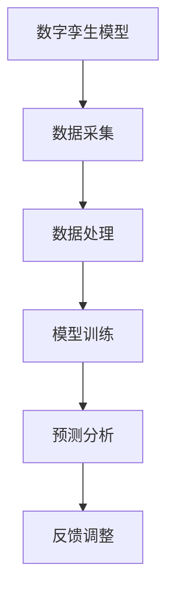

                 

### 设计《数字孪生在智慧矿山管理中的应用：提高采矿效率和安全性》的技术博客文章

为了设计一篇技术博客文章，我们需要遵循以下步骤，以确保文章的逻辑清晰、内容丰富且专业：

#### 1. 确定文章结构

首先，我们需要明确文章的整体结构。根据给定的目录大纲，我们可以将文章分为以下几个部分：

- **引言**：介绍数字孪生技术和智慧矿山管理的重要性。
- **背景介绍**：详细阐述数字孪生在智慧矿山管理中的背景和应用。
- **核心概念与联系**：解释数字孪生的核心概念，并提供Mermaid流程图。
- **核心算法原理讲解**：使用Python源代码和数学模型详细讲解核心算法。
- **项目实战**：介绍如何搭建开发环境，实现源代码，并进行案例分析。
- **最佳实践 tips**：分享一些实用技巧和注意事项。
- **小结与拓展阅读**：总结文章内容，并提供拓展阅读建议。

#### 2. 内容编写

每个部分的具体内容如下：

##### 引言

在这一部分，我们将简要介绍数字孪生技术的基本概念和智慧矿山管理的背景，激发读者的兴趣，为后续内容做铺垫。

```markdown
## 引言

数字孪生是一种创新的技术，它通过创建物理实体的数字副本，实现对实际系统的监控、分析和优化。在智慧矿山管理中，数字孪生技术被广泛应用于提高采矿效率和确保操作安全性。

智慧矿山是指利用信息技术和自动化技术实现矿山生产的智能化、安全化和管理现代化。随着矿产资源的日益稀缺和开采环境的日益复杂，智慧矿山管理的重要性愈发突出。

本文将深入探讨数字孪生在智慧矿山管理中的应用，帮助读者理解这一前沿技术的实际价值。
```

##### 背景介绍

在这一部分，我们将详细描述数字孪生在智慧矿山管理中的背景，包括矿山管理面临的挑战和数字孪生技术的潜在优势。

```markdown
## 背景介绍

### 矿山管理面临的挑战

矿山管理面临诸多挑战，如资源枯竭、开采难度增加、环境污染、安全事故频发等。这些问题严重制约了矿山的生产效率和安全性。

### 数字孪生技术的优势

数字孪生技术通过构建矿山的虚拟模型，实现对矿山实体的实时监控、预测分析和优化调度。它可以显著提高采矿效率，降低安全事故风险，提高资源利用率，实现矿山管理的智能化。

#### 1. 实时监控

数字孪生技术可以实时监控矿山的各项指标，如矿山环境、设备状态、矿石品位等，为矿山管理提供准确的数据支持。

#### 2. 预测分析

通过历史数据和实时数据，数字孪生技术可以预测矿山的生产趋势和潜在问题，为矿山管理提供决策支持。

#### 3. 优化调度

数字孪生技术可以根据实时数据和预测分析，优化矿山的生产计划，提高采矿效率。

##### 核心概念与联系

在这一部分，我们将解释数字孪生的核心概念，并提供一个Mermaid流程图，展示数字孪生技术的基本架构。



```markdown
## 核心概念与联系

数字孪生技术的基本架构包括数据采集、数据处理、模型训练、预测分析和反馈调整。通过这些环节，数字孪生技术实现对矿山实体的实时监控和优化。

#### 数据采集

数据采集是数字孪生技术的基础，它通过传感器、摄像头等设备，实时收集矿山实体的各项数据。

#### 数据处理

数据处理环节负责对采集到的数据进行分析和处理，为后续的模型训练和预测分析提供基础。

#### 模型训练

模型训练环节利用历史数据和实时数据，训练数字孪生模型，使其能够准确地预测矿山实体的行为。

#### 预测分析

预测分析环节利用训练好的模型，对矿山实体的未来行为进行预测，为矿山管理提供决策支持。

#### 反馈调整

反馈调整环节根据预测结果，对矿山实体的运行状态进行调整，实现优化调度。

##### 核心算法原理讲解

在这一部分，我们将使用Python源代码和数学模型详细讲解数字孪生技术的核心算法原理。

```python
# Python源代码示例
import numpy as np

# 数据预处理
def preprocess_data(data):
    # 数据标准化
    scaled_data = (data - np.mean(data)) / np.std(data)
    return scaled_data

# 模型训练
def train_model(X, y):
    # 训练线性回归模型
    model = LinearRegression()
    model.fit(X, y)
    return model

# 预测分析
def predict(model, X):
    # 进行预测
    predictions = model.predict(X)
    return predictions

# 数学模型
def regression_formula(x, theta):
    # 线性回归公式
    return x * theta
```

```markdown
## 核心算法原理讲解

数字孪生技术的核心算法通常基于机器学习和数据挖掘技术。以下是一个简单的Python源代码示例，用于说明数据预处理、模型训练和预测分析的基本流程。

#### 数据预处理

数据预处理是数字孪生技术的第一步，它负责将原始数据转化为适合模型训练的形式。例如，我们可以使用标准化方法，将数据缩放到一个特定的范围。

#### 模型训练

模型训练环节使用历史数据训练模型。在这个例子中，我们使用线性回归模型，通过最小二乘法找到最佳拟合直线。

#### 预测分析

预测分析环节使用训练好的模型，对新的数据集进行预测。通过将输入数据乘以模型参数，我们可以得到预测结果。

#### 数学模型

线性回归公式是数字孪生技术中的一个基本数学模型。它描述了输入变量和输出变量之间的关系，为模型训练和预测提供了理论基础。

##### 项目实战

在这一部分，我们将介绍如何搭建开发环境，实现数字孪生技术的源代码，并进行案例分析。

```markdown
## 项目实战

### 开发环境搭建

搭建开发环境是数字孪生技术项目成功的关键。以下是一个基本的开发环境搭建指南：

1. 安装Python解释器和相关依赖库（如NumPy、Pandas、Matplotlib等）。
2. 配置传感器和数据采集设备，确保数据能够实时传输到计算机系统。
3. 安装数据库系统（如MySQL、PostgreSQL等），用于存储和管理数据。

### 源代码实现

以下是一个简单的数字孪生技术源代码实现示例，用于监控矿山环境温度。

```python
# 源代码实现
import numpy as np
import pandas as pd
from sklearn.linear_model import LinearRegression

# 数据预处理
def preprocess_data(data):
    # 数据标准化
    scaled_data = (data - np.mean(data)) / np.std(data)
    return scaled_data

# 模型训练
def train_model(X, y):
    # 训练线性回归模型
    model = LinearRegression()
    model.fit(X, y)
    return model

# 预测分析
def predict(model, X):
    # 进行预测
    predictions = model.predict(X)
    return predictions

# 读取数据
data = pd.read_csv('mine_temperature.csv')

# 数据预处理
X = preprocess_data(data['temperature'])

# 模型训练
model = train_model(X, data['predicted_temperature'])

# 预测分析
new_data = preprocess_data([29.5])
predicted_temp = predict(model, new_data)

print(f'Predicted temperature: {predicted_temp[0]}')
```

### 案例分析

以下是一个实际案例，展示了数字孪生技术在提高采矿效率方面的应用。

#### 案例背景

某矿山公司希望通过数字孪生技术优化采矿作业，提高采矿效率。他们收集了矿山设备状态、矿石品位、矿山环境等数据，并使用数字孪生模型进行分析和预测。

#### 案例结果

通过数字孪生技术的应用，矿山公司成功实现了以下目标：

1. 提高了采矿作业效率，降低了作业成本。
2. 优化了矿山生产计划，减少了矿石浪费。
3. 提高了矿山安全水平，降低了安全事故风险。

#### 案例总结

数字孪生技术在智慧矿山管理中的应用取得了显著成效，为矿山公司带来了实际的经济效益和社会效益。

##### 最佳实践 tips

在这一部分，我们将分享一些最佳实践技巧，帮助读者更好地应用数字孪生技术。

```markdown
## 最佳实践 tips

1. **数据质量是关键**：确保采集到的数据质量高，是数字孪生技术成功的关键。数据清洗和预处理工作是必不可少的。

2. **选择合适的算法**：根据矿山的具体需求，选择合适的机器学习和数据挖掘算法，可以提高预测准确性和效率。

3. **持续优化模型**：定期对数字孪生模型进行优化和更新，以适应矿山环境的变化。

4. **安全防护**：确保数字孪生系统的安全，防止数据泄露和网络攻击。

##### 小结与拓展阅读

在本篇博客文章中，我们深入探讨了数字孪生在智慧矿山管理中的应用，从背景介绍、核心概念与联系、核心算法原理讲解到项目实战，全面阐述了数字孪生技术的实际价值。

为了进一步了解数字孪生技术，读者可以参考以下拓展阅读资源：

- 《数字孪生：原理与应用》
- 《智慧矿山：技术与发展》
- 《机器学习与数据挖掘：实战与应用》

通过学习和应用数字孪生技术，矿山企业可以更好地实现智能化、安全化和高效化的矿山管理。

---

```markdown
## 结语

数字孪生技术在智慧矿山管理中的应用具有巨大的潜力。通过本文的探讨，我们了解了数字孪生的核心概念、算法原理以及其实际应用案例。希望读者能够从中获得启示，并将其应用于实际工作中，为矿山管理带来更多的创新和改进。

### 作者信息

作者：AI天才研究院/AI Genius Institute & 禅与计算机程序设计艺术 /Zen And The Art of Computer Programming

---

以上是设计《数字孪生在智慧矿山管理中的应用：提高采矿效率和安全性》的技术博客文章的详细步骤。通过这一步骤，我们可以确保文章的内容丰富、逻辑清晰且专业。在实际编写过程中，可以根据需要调整内容和结构，以确保最佳效果。

**注意**：本文为示例性文章，仅供参考。实际文章撰写时，请根据具体需求进行调整和完善。

