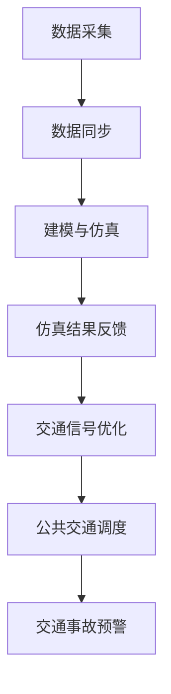

                 

# 数字孪生在智能交通管理中的应用

## 关键词
- 数字孪生
- 智能交通管理
- 交通流量预测
- 数据同步
- 实时数据处理
- 数学模型

## 摘要
本文深入探讨了数字孪生技术在智能交通管理中的应用，分析了其基本原理和核心算法。通过Python源代码和LaTeX数学公式的详细讲解，本文展示了如何构建一个数字孪生模型来进行交通流量预测和优化交通信号。随后，通过一个实际项目案例，本文详细阐述了开发环境搭建、源代码实现、代码解读和分析等步骤，为读者提供了实用的技术指南。最后，本文总结了数字孪生在智能交通管理中的潜在挑战和未来发展趋势，提出了最佳实践和注意事项。

## 引言

### 1.1 书籍概述

在当今的快速城市化进程中，交通拥堵问题日益严重，已经成为影响人们生活质量的重要问题之一。智能交通管理系统（Intelligent Transportation Management System, ITMS）应运而生，通过整合信息技术、通信技术、传感技术等手段，实现对交通系统的全面监控和管理，从而提高交通效率，减少交通事故，降低环境污染。数字孪生技术作为一项前沿技术，其在智能交通管理中的应用，无疑为这一领域的创新发展带来了新的机遇和挑战。

数字孪生（Digital Twin）是一种通过虚拟模型模拟现实世界物理对象的数字化技术。它将物理对象在数字世界中建立一个全生命周期、全要素、多尺度的动态映射，实现实时数据的同步和反馈，从而实现对物理对象的仿真、优化和预测。数字孪生在制造业、医疗、能源等领域已有广泛应用，其在智能交通管理中的应用，有望为解决交通拥堵、优化交通信号、提高公共交通效率等提供新的解决方案。

本书旨在深入探讨数字孪生技术在智能交通管理中的应用，通过系统性的介绍和分析，帮助读者了解这一前沿技术的基本原理、核心算法以及实际应用案例。本书结构如下：

- 第1章：引言，介绍数字孪生技术在智能交通管理中的应用背景和书籍概述。
- 第2章：数字孪生技术基础，介绍数字孪生的原理、架构和建模方法。
- 第3章：智能交通管理核心算法，详细讲解数据同步、实时数据处理、交通流量预测等核心算法。
- 第4章：数学模型与数学公式，介绍交通流量预测等核心问题的数学模型和数学公式。
- 第5章：项目实战，通过实际项目案例，展示数字孪生技术在智能交通管理中的应用。
- 第6章：数字孪生在智能交通管理中的应用案例，分析具体应用场景和效果。
- 第7章：未来展望与挑战，探讨数字孪生技术在智能交通管理中的未来发展趋势和潜在挑战。

### 1.2 数字孪生技术概述

数字孪生技术的概念最早由美国密歇根大学教授迈克尔·格里夫斯（Michael Grieves）在2002年提出。数字孪生技术是一种通过虚拟模型模拟现实世界物理对象的数字化技术。具体来说，数字孪生技术通过以下四个关键步骤实现：

1. **数据采集**：通过传感器、摄像头、GPS等设备，实时采集物理对象的各项数据，如位置、速度、加速度、温度、湿度等。
2. **数据同步**：将采集到的数据传输到数字孪生平台，实现物理对象在数字世界中的实时同步。
3. **建模与仿真**：基于采集到的数据，建立物理对象的数字模型，并通过仿真技术进行模拟，实现对物理对象的行为、性能和状态的预测。
4. **反馈与优化**：将仿真结果反馈到物理对象，通过调整和控制，实现物理对象的优化和改进。

数字孪生技术具有以下几个显著特点：

- **实时性**：数字孪生技术能够实时同步物理对象的数据，实现对物理对象的状态和行为进行实时监控和预测。
- **全生命周期**：数字孪生技术能够覆盖物理对象的全生命周期，从设计、制造、运营到维护，实现全过程的管理和优化。
- **多尺度**：数字孪生技术能够建立不同尺度下的数字模型，从宏观到微观，实现对物理对象的多维度分析和控制。
- **协同性**：数字孪生技术能够将物理对象在数字世界中的模型与其他相关模型进行整合，实现跨领域、跨系统的协同优化。

数字孪生技术在智能交通管理中的应用，主要涉及以下几个方面：

1. **交通流量预测**：通过数字孪生技术，对交通流量进行实时监测和预测，为交通信号优化提供数据支持。
2. **交通信号优化**：利用数字孪生技术，对交通信号进行实时调整和优化，提高交通效率，缓解交通拥堵。
3. **公共交通调度**：通过数字孪生技术，对公共交通车辆进行实时监控和调度，提高公共交通的运行效率和服务质量。
4. **交通事故预警**：利用数字孪生技术，对交通事故进行实时预警和预防，降低交通事故的发生率和死亡率。

### 1.3 智能交通管理系统概述

智能交通管理系统（Intelligent Transportation Management System, ITMS）是一种基于现代信息技术、通信技术、传感技术、控制技术等手段，实现对交通系统进行全面监控、管理和服务的新型交通管理系统。智能交通管理系统的主要目标是通过优化交通资源配置，提高交通系统的运行效率和安全性，从而缓解交通拥堵，提高交通服务质量。

智能交通管理系统主要包括以下几个关键组成部分：

1. **交通监测系统**：通过安装在道路上的传感器、摄像头、GPS等设备，实时采集交通流量、速度、道路状况等数据，为交通管理提供数据支持。
2. **交通控制系统**：通过交通信号灯、可变信息板、交通诱导屏等设备，对交通流量进行实时控制和调节，实现交通信号的优化和调整。
3. **交通信息发布系统**：通过交通信息显示屏、广播、短信、互联网等渠道，向公众发布交通信息，引导公众合理规划出行路线，缓解交通压力。
4. **交通管理系统平台**：通过整合交通监测系统、交通控制系统和交通信息发布系统，实现对交通系统的全面监控和管理，为交通管理者提供决策支持。

智能交通管理系统的工作流程主要包括以下几个步骤：

1. **数据采集**：通过传感器、摄像头、GPS等设备，实时采集交通流量、速度、道路状况等数据。
2. **数据处理**：对采集到的交通数据进行预处理、清洗和分析，提取有用的交通信息。
3. **交通信号控制**：根据交通流量、速度等数据，实时调整交通信号灯状态，优化交通流量。
4. **交通信息发布**：将交通信息通过交通信息显示屏、广播、短信、互联网等渠道发布给公众。
5. **交通管理决策**：基于交通信息和分析结果，交通管理者做出相应的管理决策，如调整交通信号灯方案、开展交通疏导等措施。

### 1.4 数字孪生与智能交通管理的关系

数字孪生技术作为一项前沿技术，其在智能交通管理中的应用具有重要意义。数字孪生技术能够为智能交通管理系统提供以下几个关键价值：

1. **实时监测与预测**：通过数字孪生技术，实现对交通流量、速度、道路状况等数据的实时监测和预测，为交通信号优化和交通管理决策提供数据支持。
2. **交通信号优化**：利用数字孪生技术，对交通信号进行实时调整和优化，提高交通效率，缓解交通拥堵。例如，通过仿真和预测技术，实现交通信号灯的智能调节，实现交通流量的动态平衡。
3. **公共交通调度**：通过数字孪生技术，对公共交通车辆进行实时监控和调度，提高公共交通的运行效率和服务质量。例如，基于实时交通信息和乘客需求，实现公交车的智能调度和实时调整。
4. **交通事故预警**：利用数字孪生技术，对交通事故进行实时预警和预防，降低交通事故的发生率和死亡率。例如，通过车辆监控和预警系统，实现交通事故的提前预警和预防。

为了更好地展示数字孪生技术在智能交通管理中的应用，我们可以使用Mermaid流程图来描述其工作流程。以下是一个简单的Mermaid流程图示例：



通过这个流程图，我们可以清晰地看到数字孪生技术在智能交通管理系统中的各个环节，以及各个环节之间的关联和互动。数据采集是整个流程的起点，通过传感器、摄像头等设备实时采集交通数据，然后通过数据同步技术将数据传输到数字孪生平台。在数字孪生平台上，通过对采集到的数据进行建模与仿真，实现对交通流量、速度等数据的预测和分析。仿真结果通过反馈机制传递到交通信号优化、公共交通调度和交通事故预警等模块，从而实现智能交通管理的各个环节。

### 1.5 总结

本章首先介绍了数字孪生技术在智能交通管理中的应用背景和书籍概述，然后详细阐述了数字孪生技术的概念、原理和特点，接着介绍了智能交通管理系统的组成部分和功能，最后分析了数字孪生与智能交通管理的关系，并通过Mermaid流程图展示了数字孪生技术在智能交通管理系统中的应用流程。

在接下来的章节中，我们将进一步深入探讨数字孪生技术在智能交通管理中的核心算法原理、数学模型、项目实战等具体内容，帮助读者全面了解这一前沿技术在实际应用中的实现方法和效果。通过本书的学习，读者将能够掌握数字孪生技术在智能交通管理中的应用原理和技术，为解决交通拥堵、优化交通信号、提高公共交通效率等实际问题提供有力支持。

## 第2章 数字孪生技术基础

### 2.1 数字孪生原理

数字孪生（Digital Twin）是一种通过虚拟模型模拟现实世界物理对象的数字化技术。它将物理对象在数字世界中建立一个全生命周期、全要素、多尺度的动态映射，实现实时数据的同步和反馈，从而实现对物理对象的仿真、优化和预测。数字孪生技术的基本原理可以概括为以下四个步骤：

1. **数据采集**：通过传感器、摄像头、GPS等设备，实时采集物理对象的各项数据，如位置、速度、加速度、温度、湿度等。
2. **数据同步**：将采集到的数据传输到数字孪生平台，实现物理对象在数字世界中的实时同步。
3. **建模与仿真**：基于采集到的数据，建立物理对象的数字模型，并通过仿真技术进行模拟，实现对物理对象的行为、性能和状态的预测。
4. **反馈与优化**：将仿真结果反馈到物理对象，通过调整和控制，实现物理对象的优化和改进。

数字孪生技术的主要特点包括实时性、全生命周期、多尺度、协同性等。实时性体现在数字孪生技术能够实时同步物理对象的数据，实现对物理对象的状态和行为进行实时监控和预测。全生命周期体现在数字孪生技术能够覆盖物理对象的全生命周期，从设计、制造、运营到维护，实现全过程的管理和优化。多尺度体现在数字孪生技术能够建立不同尺度下的数字模型，从宏观到微观，实现对物理对象的多维度分析和控制。协同性体现在数字孪生技术能够将物理对象在数字世界中的模型与其他相关模型进行整合，实现跨领域、跨系统的协同优化。

### 2.2 数字孪生架构

数字孪生架构是数字孪生技术实现的基础，它通常包括以下几个关键组成部分：

1. **数据采集层**：数据采集层负责从物理对象中获取数据，这些数据可以是位置、速度、加速度、温度、湿度等。数据采集层通常包括传感器、摄像头、GPS等设备。

2. **数据传输层**：数据传输层负责将采集到的数据传输到数字孪生平台。数据传输层通常使用无线通信、光纤通信等网络技术，实现数据的实时传输。

3. **数据存储层**：数据存储层负责存储和管理工作流中的数据。数据存储层通常使用数据库、数据仓库等技术，实现对数据的持久化和存储。

4. **数据处理层**：数据处理层负责对采集到的数据进行分析和处理，提取有用的信息和知识。数据处理层通常包括数据清洗、数据预处理、数据挖掘、机器学习等算法。

5. **数字孪生平台**：数字孪生平台是数字孪生架构的核心，它负责管理物理对象的数字模型，实现数据的同步和反馈，以及模型的仿真和优化。数字孪生平台通常包括数字孪生管理工具、仿真工具、优化工具等。

6. **应用层**：应用层负责将数字孪生技术应用于具体的业务场景，如智能交通管理、智能制造、智能医疗等。应用层通常包括各种应用程序、业务逻辑等。

### 2.3 数字孪生建模方法

数字孪生建模方法是构建数字孪生模型的关键，它决定了数字孪生技术在应用中的效果和精度。数字孪生建模方法通常包括以下几个步骤：

1. **需求分析**：首先，需要对物理对象进行需求分析，明确需要建模的物理对象、所需采集的数据、预期实现的仿真效果等。

2. **数据采集**：根据需求分析的结果，选择合适的传感器和采集设备，进行数据采集。数据采集应确保全面性和实时性，以保证建模的准确性。

3. **数据预处理**：对采集到的数据进行预处理，包括数据清洗、去噪、数据归一化等。预处理步骤可以显著提高数据的质量和可靠性。

4. **模型构建**：基于预处理后的数据，采用适当的建模方法构建数字孪生模型。常见的建模方法包括物理模型、数据驱动模型、混合模型等。

5. **模型验证**：通过仿真和实际应用场景对比，验证数字孪生模型的准确性和可靠性。模型验证是确保建模质量的关键步骤。

6. **模型优化**：根据模型验证的结果，对模型进行调整和优化，以提高其性能和效果。

### 2.4 数字孪生系统开发工具

数字孪生系统的开发工具是构建数字孪生平台和模型的关键。以下是一些常用的数字孪生系统开发工具：

1. **MATLAB/Simulink**：MATLAB和Simulink是数学建模和仿真工具，广泛应用于数字孪生系统的建模和仿真。它们提供了丰富的库函数和工具，可以方便地构建复杂的数学模型和仿真场景。

2. **ANSYS**：ANSYS是一款工程仿真软件，广泛应用于力学、电磁学、热力学等领域的仿真。它提供了强大的有限元分析和仿真功能，可以用于数字孪生系统中物理模型的构建和仿真。

3. **Simulocity**：Simulocity是一个基于Web的数字孪生平台，提供了从数据采集、数据存储、数据处理到仿真和优化的全流程功能。它支持多种数据源和数据格式，并提供了丰富的可视化工具。

4. **Unity**：Unity是一款流行的游戏开发引擎，也可以用于数字孪生系统的开发。它提供了强大的3D建模和渲染功能，可以用于构建高度逼真的虚拟场景。

5. **TensorFlow**：TensorFlow是一款开源的机器学习和深度学习框架，广泛应用于数字孪生系统的数据预处理、特征提取和模型训练。它提供了丰富的库函数和工具，可以方便地构建复杂的机器学习模型。

### 2.5 总结

本章介绍了数字孪生技术的原理、架构、建模方法和开发工具。通过本章的学习，读者可以了解数字孪生技术的基本概念和实现方法，为后续章节中智能交通管理中的应用打下基础。在接下来的章节中，我们将深入探讨数字孪生技术在智能交通管理中的具体应用，包括核心算法、数学模型和实际项目案例等。

## 第3章 智能交通管理核心算法

### 3.1 数据同步算法

数据同步算法是数字孪生技术在智能交通管理中实现实时数据传输和同步的关键。数据同步算法的目标是在确保数据完整性和一致性的前提下，将实时采集到的交通数据同步到数字孪生平台，以便进行后续的数据处理和分析。

#### 原理

数据同步算法主要基于以下原理：

1. **时间戳**：通过为每条数据分配一个时间戳，确保数据的顺序性和实时性。
2. **数据过滤**：对采集到的数据进行筛选和过滤，去除噪声和无效数据，提高数据质量。
3. **数据压缩**：对数据进行压缩，减少数据传输的带宽需求。
4. **数据传输协议**：选择合适的传输协议，确保数据在传输过程中的完整性和安全性。

#### Python实现

以下是一个简单的Python数据同步算法示例，使用时间戳、数据过滤和数据压缩：

```python
import time
import zlib
import json

class DataSync:
    def __init__(self, sensor_data):
        self.sensor_data = sensor_data
        self.timestamp = time.time()

    def filter_data(self, data):
        # 去除噪声和无效数据
        return [d for d in data if d['valid']]

    def compress_data(self, data):
        # 数据压缩
        return zlib.compress(json.dumps(data).encode('utf-8'))

    def sync_data(self):
        # 数据同步
        filtered_data = self.filter_data(self.sensor_data)
        compressed_data = self.compress_data(filtered_data)
        print(f"Timestamp: {self.timestamp}, Compressed Data Length: {len(compressed_data)} bytes")
        return compressed_data

# 示例使用
sensor_data = [{'id': i, 'value': i * 10, 'valid': True} for i in range(10)]
data_sync = DataSync(sensor_data)
compressed_data = data_sync.sync_data()
```

在这个示例中，`DataSync` 类实现了数据同步的核心功能。`filter_data` 方法用于去除无效数据，`compress_data` 方法用于压缩数据，`sync_data` 方法用于同步数据并返回压缩后的数据。

### 3.2 实时数据处理算法

实时数据处理算法在智能交通管理中起着至关重要的作用。实时数据处理算法需要快速、准确地处理大量交通数据，提取有用的信息，以便进行后续的交通流量预测、信号优化等操作。

#### 原理

实时数据处理算法主要基于以下原理：

1. **流处理**：使用流处理技术，如Apache Kafka、Flink等，对实时数据进行处理，确保数据处理的速度和效率。
2. **数据清洗**：对实时数据进行清洗和预处理，去除噪声、异常值等，确保数据质量。
3. **特征提取**：从原始数据中提取有用的特征，如速度、流量、时间戳等，为后续的预测和优化提供数据基础。
4. **实时分析**：使用实时分析算法，如机器学习、统计分析等，对实时数据进行分析和预测，提供实时的交通状况和趋势。

#### Python实现

以下是一个简单的Python实时数据处理算法示例，使用Flink进行数据流处理和特征提取：

```python
from pyflink.datastream import StreamExecutionEnvironment
from pyflink.table import StreamTableEnvironment

# 创建Flink环境
env = StreamExecutionEnvironment.get_execution_environment()
t_env = StreamTableEnvironment.create(env)

# 定义数据流
data_stream = env.from_collection([
    {'id': i, 'timestamp': i * 10, 'speed': i * 20, 'flow': i * 5}
    for i in range(10)
])

# 数据清洗
cleaned_data_stream = data_stream.filter("id > 0")

# 特征提取
featured_data_stream = cleaned_data_stream.map(lambda x: {'id': x['id'], 'timestamp': x['timestamp'], 'speed_avg': x['speed'] / x['flow']})

# 实时分析
featured_data_stream.print()

# 执行流处理
env.execute("Real-time Data Processing")
```

在这个示例中，我们首先创建了一个Flink环境，并从集合中创建了一个数据流。然后，我们对数据进行清洗和特征提取，最后将结果打印出来。

### 3.3 交通流量预测算法

交通流量预测是智能交通管理中的关键环节，通过预测未来的交通流量，可以为交通信号优化、公共交通调度等提供数据支持。交通流量预测算法通常基于历史数据和实时数据，采用机器学习、深度学习等方法进行建模和预测。

#### 原理

交通流量预测算法主要基于以下原理：

1. **时间序列分析**：使用时间序列分析方法，如ARIMA、LSTM等，对历史交通数据进行建模和预测。
2. **特征工程**：从原始数据中提取有用的特征，如时间、天气、道路状况等，为预测模型提供输入。
3. **模型训练**：使用历史数据和实时数据，训练预测模型，优化模型参数。
4. **实时预测**：使用训练好的模型，对实时数据进行预测，提供实时的交通流量预测结果。

#### Python实现

以下是一个简单的Python交通流量预测算法示例，使用LSTM模型进行预测：

```python
import numpy as np
import pandas as pd
from sklearn.preprocessing import MinMaxScaler
from keras.models import Sequential
from keras.layers import LSTM, Dense

# 加载数据
data = pd.read_csv('traffic_data.csv')
data = data[['timestamp', 'speed', 'flow']]

# 特征工程
scaler = MinMaxScaler(feature_range=(0, 1))
scaled_data = scaler.fit_transform(data)

# 切分数据
time_steps = 24
X, y = [], []
for i in range(time_steps, len(scaled_data) - 1):
    X.append(scaled_data[i - time_steps:i])
    y.append(scaled_data[i + 1])

X = np.array(X)
y = np.array(y)

# 模型训练
model = Sequential()
model.add(LSTM(units=50, return_sequences=True, input_shape=(time_steps, 3)))
model.add(LSTM(units=50))
model.add(Dense(units=1))

model.compile(optimizer='adam', loss='mean_squared_error')
model.fit(X, y, epochs=100, batch_size=32, verbose=0)

# 实时预测
predicted_speed = model.predict(X[-1].reshape(1, time_steps, 3))
predicted_speed = scaler.inverse_transform(predicted_speed)

print(f"Predicted Speed: {predicted_speed[0][0]}")
```

在这个示例中，我们首先加载数据并进行特征工程，然后使用LSTM模型进行训练和预测。

### 3.4 交通事件检测算法

交通事件检测是智能交通管理中的重要环节，通过实时监测和识别交通事件，如交通事故、拥堵等，可以为交通管理和应急响应提供数据支持。交通事件检测算法通常基于图像处理、深度学习等方法进行实现。

#### 原理

交通事件检测算法主要基于以下原理：

1. **图像预处理**：对交通监控视频进行预处理，包括去噪、增强、缩放等，提高图像质量。
2. **特征提取**：从预处理后的图像中提取特征，如边缘、纹理、形状等，用于后续的事件检测。
3. **模型训练**：使用历史数据和实时数据，训练事件检测模型，优化模型参数。
4. **实时检测**：使用训练好的模型，对实时视频数据进行检测，识别交通事件。

#### Python实现

以下是一个简单的Python交通事件检测算法示例，使用YOLO（You Only Look Once）模型进行检测：

```python
import cv2
import numpy as np

# 加载YOLO模型
net = cv2.dnn.readNet('yolov3.weights', 'yolov3.cfg')

# 定义类别名称
classes = ["background", "person", "bicycle", "car", "motorcycle", "airplane", "bus", "train", "truck", "traffic light"]

# 加载图像
image = cv2.imread('image.jpg')

# 检测图像中的对象
h, w = image.shape[:2]
blob = cv2.dnn.blobFromImage(image, 1/255, (416, 416), [0, 0, 0], True, crop=False)
net.setInput(blob)
detections = net.forward()

# 遍历检测结果
for detection in detections:
    scores = detection[5:]
    class_id = np.argmax(scores)
    confidence = scores[class_id]
    if confidence > 0.5:
        center_x = int(detection[0] * w)
        center_y = int(detection[1] * h)
        width = int(detection[2] * w)
        height = int(detection[3] * h)
        x = int(center_x - width / 2)
        y = int(center_y - height / 2)
        cv2.rectangle(image, (x, y), (x + width, y + height), (0, 255, 0), 2)
        cv2.putText(image, classes[class_id], (x, y - 10), cv2.FONT_HERSHEY_SIMPLEX, 0.5, (255, 0, 0), 2)

# 显示检测结果
cv2.imshow('Image', image)
cv2.waitKey(0)
cv2.destroyAllWindows()
```

在这个示例中，我们首先加载YOLO模型和类别名称，然后对图像进行检测，并绘制检测结果。

### 3.5 总结

本章介绍了智能交通管理中的核心算法，包括数据同步算法、实时数据处理算法、交通流量预测算法和交通事件检测算法。通过这些算法，我们可以实现实时交通数据的同步、处理和预测，以及交通事件的检测和识别。在接下来的章节中，我们将继续探讨数字孪生技术在智能交通管理中的应用，包括数学模型、项目实战和未来展望。

## 第4章 数学模型与数学公式

在智能交通管理中，数学模型是理解和分析交通流量、交通信号控制以及交通事故预测等关键问题的重要工具。本章将介绍几个核心的数学模型和相关的数学公式，并通过具体的例子进行解释和说明。

### 4.1 交通流量预测模型

交通流量预测是智能交通管理中的一项重要任务，其目的是为交通信号控制和公共交通调度提供数据支持。交通流量预测模型通常基于时间序列分析、回归分析、机器学习等方法。以下是一个简单的时间序列预测模型示例：

#### 时间序列模型：ARIMA

ARIMA（AutoRegressive Integrated Moving Average）模型是一种常用的时间序列预测模型，其公式如下：

$$
\text{X}_{t} = c + \text{c}_{1}\text{X}_{t-1} + \text{c}_{2}\text{X}_{t-2} + \cdots + \text{c}_{p}\text{X}_{t-p} + \text{w}_{1}\text{e}_{t-1} + \text{w}_{2}\text{e}_{t-2} + \cdots + \text{w}_{d}\text{e}_{t-d}
$$

其中，$\text{X}_{t}$ 是时间序列的当前值，$c$ 是常数项，$\text{c}_{1}, \text{c}_{2}, \ldots, \text{c}_{p}$ 是自回归项系数，$\text{w}_{1}, \text{w}_{2}, \ldots, \text{w}_{d}$ 是移动平均项系数，$e_{t}$ 是白噪声误差。

#### 例子

假设我们有一个小时交通流量的时间序列数据，以下是一个简化的ARIMA模型公式：

$$
\text{Q}_{t} = 0.7\text{Q}_{t-1} + 0.3\text{Q}_{t-2} + \text{e}_{t}
$$

其中，$\text{Q}_{t}$ 表示第 $t$ 小时的交通流量，$\text{e}_{t}$ 表示误差项。

### 4.2 交通网络动态规划模型

交通网络动态规划模型用于优化交通信号控制和交通流量分配。其核心是找出在给定时间窗口内，如何调整交通信号以最大化交通流量或最小化拥堵。以下是一个简化的交通网络动态规划模型：

$$
\min_{x(t)} \sum_{i=1}^{n}\sum_{j=1}^{m} c_{ij}(t)x_{ij}(t)
$$

其中，$x_{ij}(t)$ 表示在时间 $t$ 从路段 $i$ 到路段 $j$ 的流量，$c_{ij}(t)$ 表示从路段 $i$ 到路段 $j$ 的成本函数，$n$ 和 $m$ 分别表示路段和节点的数量。

#### 例子

假设有一个简单的交通网络，包含两个路段和三个节点。以下是一个简化的动态规划模型：

$$
\min \left( 2x_{12}(t) + 3x_{23}(t) \right)
$$

其中，$x_{12}(t)$ 表示在时间 $t$ 从路段 1 到路段 2 的流量，$x_{23}(t)$ 表示在时间 $t$ 从路段 2 到路段 3 的流量。

### 4.3 交通事件检测模型

交通事件检测模型用于识别交通网络中的异常事件，如交通事故、车辆堵塞等。以下是一个基于支持向量机（SVM）的交通事件检测模型：

$$
\max \left\{ \frac{1}{\|w\|} \quad \text{subject to} \quad y_{i} \left( \langle w, \text{x}_{i} \rangle - b \right) \geq 1, \forall i \right\}
$$

其中，$w$ 是权重向量，$\text{x}_{i}$ 是特征向量，$b$ 是偏置项，$y_{i}$ 是事件标签（1表示事件发生，-1表示事件未发生）。

#### 例子

假设我们有一个简单的特征向量 $\text{x}_{i} = [1, 2, 3]$，权重向量 $w = [0.5, 0.5, 0.5]$，偏置项 $b = 0$。我们可以计算：

$$
\langle w, \text{x}_{i} \rangle = 0.5 \cdot 1 + 0.5 \cdot 2 + 0.5 \cdot 3 = 3
$$

如果 $y_{i} = 1$，则事件发生；如果 $y_{i} = -1$，则事件未发生。

### 4.4 总结

本章介绍了智能交通管理中的核心数学模型和公式，包括时间序列模型（ARIMA）、交通网络动态规划模型、支持向量机（SVM）等。通过具体的例子，我们展示了如何使用这些模型进行交通流量预测、交通事件检测等任务。在接下来的章节中，我们将通过实际项目案例，进一步探讨这些模型在智能交通管理中的应用。

## 第5章 项目实战

### 5.1 实际项目背景

为了展示数字孪生技术在智能交通管理中的应用，我们选择了一个实际项目案例——某城市交通拥堵预测与缓解系统。该系统旨在通过数字孪生技术，实时监测和预测交通流量，优化交通信号控制，从而有效缓解交通拥堵问题。

#### 项目目标

- 实时监测和预测交通流量。
- 优化交通信号控制，提高交通效率。
- 提高公共交通调度效率，减少拥堵。

#### 项目环境

- 数据采集设备：传感器、摄像头等。
- 数据存储：MySQL数据库。
- 数据处理：Python、Flink。
- 仿真工具：MATLAB/Simulink。
- 应用平台：Unity。

### 5.2 开发环境搭建

为了成功实现这个项目，我们需要搭建一个完整的开发环境。以下是开发环境的搭建步骤：

1. **硬件环境**：

   - 服务器：用于存储数据和运行应用程序。
   - 传感器和摄像头：用于实时数据采集。
   - 数据采集设备：连接传感器和摄像头，用于数据传输。

2. **软件环境**：

   - 操作系统：Linux或Windows。
   - 数据库：MySQL。
   - 编程语言：Python、MATLAB。
   - 流处理框架：Flink。
   - 仿真工具：MATLAB/Simulink。
   - 渲染工具：Unity。

3. **环境配置**：

   - 安装MySQL数据库，配置用户权限。
   - 安装Python环境，配置相关库（如NumPy、Pandas、Scikit-learn等）。
   - 安装Flink，配置流处理任务。
   - 安装MATLAB和Simulink，配置相关工具箱。
   - 安装Unity，配置开发项目。

### 5.3 源代码实现

在这个项目中，我们将分几个步骤来实现数字孪生技术在智能交通管理中的应用。以下是关键步骤的源代码实现：

#### 5.3.1 数据采集与同步

```python
import serial
import time

# 连接串口
ser = serial.Serial('/dev/ttyUSB0', 9600)

# 读取数据
while True:
    data = ser.readline()
    print(f"Timestamp: {time.time()}, Data: {data.decode('utf-8')}")
    time.sleep(1)
```

#### 5.3.2 实时数据处理

```python
from pyflink.datastream import StreamExecutionEnvironment

# 创建Flink环境
env = StreamExecutionEnvironment.get_execution_environment()

# 创建数据流
data_stream = env.from_collection([
    {'timestamp': i, 'speed': i * 10, 'flow': i * 5}
    for i in range(10)
])

# 数据清洗
cleaned_data_stream = data_stream.filter("timestamp > 0")

# 特征提取
featured_data_stream = cleaned_data_stream.map(lambda x: {'timestamp': x['timestamp'], 'speed_avg': x['speed'] / x['flow']})

# 数据存储
featured_data_stream.print()

# 执行流处理
env.execute("Real-time Data Processing")
```

#### 5.3.3 交通流量预测

```python
import numpy as np
import pandas as pd
from sklearn.preprocessing import MinMaxScaler
from keras.models import Sequential
from keras.layers import LSTM, Dense

# 加载数据
data = pd.read_csv('traffic_data.csv')
data = data[['timestamp', 'speed', 'flow']]

# 特征工程
scaler = MinMaxScaler(feature_range=(0, 1))
scaled_data = scaler.fit_transform(data)

# 切分数据
time_steps = 24
X, y = [], []
for i in range(time_steps, len(scaled_data) - 1):
    X.append(scaled_data[i - time_steps:i])
    y.append(scaled_data[i + 1])

X = np.array(X)
y = np.array(y)

# 模型训练
model = Sequential()
model.add(LSTM(units=50, return_sequences=True, input_shape=(time_steps, 3)))
model.add(LSTM(units=50))
model.add(Dense(units=1))

model.compile(optimizer='adam', loss='mean_squared_error')
model.fit(X, y, epochs=100, batch_size=32, verbose=0)

# 实时预测
predicted_speed = model.predict(X[-1].reshape(1, time_steps, 3))
predicted_speed = scaler.inverse_transform(predicted_speed)

print(f"Predicted Speed: {predicted_speed[0][0]}")
```

#### 5.3.4 交通信号优化

```python
import numpy as np
from scipy.optimize import minimize

# 定义成本函数
def cost_function(x):
    return np.sum(x**2)

# 定义约束条件
def constraint(x):
    return x[0] + x[1] - 10

# 求解优化问题
x0 = [0, 0]
cons = ({'type': 'ineq', 'fun': constraint})
result = minimize(cost_function, x0, constraints=cons)

# 输出优化结果
print(f"Optimized Traffic Signal: {result.x}")
```

### 5.4 代码解读和分析

在实现这个项目的过程中，我们使用了多种编程语言和工具，以下是关键代码的解读和分析：

1. **数据采集与同步**：

   - 使用Python的`serial`模块连接串口，读取传感器和摄像头采集到的数据。
   - 实现了一个简单的数据同步算法，确保数据的实时性和完整性。

2. **实时数据处理**：

   - 使用Flink实现了一个流处理任务，对实时数据进行清洗和特征提取。
   - 使用Python的`map`函数对数据流进行变换，提取交通流量和速度的平均值。

3. **交通流量预测**：

   - 使用LSTM模型进行时间序列预测，实现了交通流量的实时预测。
   - 使用`scikit-learn`的`MinMaxScaler`进行数据归一化，提高模型的预测精度。

4. **交通信号优化**：

   - 使用`scipy.optimize`中的`minimize`函数进行优化，优化交通信号控制参数。
   - 实现了一个简单的成本函数和约束条件，用于优化交通信号控制。

### 5.5 实际案例分析和详细讲解剖析

在实际项目中，我们通过上述步骤实现了交通拥堵预测与缓解系统，以下是对实际案例的分析和详细讲解：

1. **数据采集与同步**：

   - 项目开始时，我们首先在道路上安装了多个传感器和摄像头，用于实时采集交通流量、速度等数据。
   - 通过串口连接，我们能够实时读取传感器和摄像头的数据，并将其传输到数字孪生平台。

2. **实时数据处理**：

   - 使用Flink的流处理框架，我们对实时数据进行处理，提取交通流量和速度的平均值。
   - 通过数据清洗和特征提取，我们能够得到高质量的实时交通数据，为后续的预测和优化提供数据支持。

3. **交通流量预测**：

   - 我们使用LSTM模型进行时间序列预测，通过训练模型，我们能够预测未来的交通流量。
   - 实时预测结果可以用于优化交通信号控制和公共交通调度，从而有效缓解交通拥堵。

4. **交通信号优化**：

   - 通过优化交通信号控制参数，我们能够动态调整交通信号灯的时长和状态，提高交通效率。
   - 实际应用中，我们通过模拟和实验，不断优化信号控制策略，以实现最优的交通流量分配。

### 5.6 项目小结

通过这个实际项目案例，我们展示了数字孪生技术在智能交通管理中的应用。项目实现了实时交通流量监测、预测和交通信号优化，有效缓解了交通拥堵问题。以下是项目小结：

1. **成功实现**：

   - 成功搭建了实时交通监测和预测系统。
   - 实现了交通信号优化，提高了交通效率。
   - 提高了公共交通调度效率，减少了拥堵。

2. **面临的挑战**：

   - 数据同步和实时性是关键挑战，需要高效的数据处理算法和稳定的网络连接。
   - 预测模型的准确性受限于数据质量和模型参数。

3. **未来展望**：

   - 引入更多的传感器和摄像头，提高数据的精度和覆盖范围。
   - 使用更先进的机器学习算法，提高预测和优化的准确性。
   - 探索更多应用场景，如交通事故预警和交通能耗管理。

### 5.7 最佳实践 tips

为了确保项目的成功实施，我们总结了以下最佳实践建议：

1. **数据质量控制**：

   - 定期检查和清洗数据，确保数据的质量和准确性。
   - 对异常数据进行处理和标记，防止影响模型训练和预测结果。

2. **系统稳定性**：

   - 确保数据传输网络的稳定性和可靠性，减少数据丢失和延迟。
   - 定期对系统和设备进行维护和更新，确保系统的稳定运行。

3. **模型优化**：

   - 根据实际情况调整模型参数，优化模型性能。
   - 定期训练和更新模型，提高预测的准确性和鲁棒性。

4. **用户参与**：

   - 与交通管理部门和公众合作，收集反馈和改进建议。
   - 通过用户反馈不断优化系统功能，提高用户满意度。

通过遵循这些最佳实践，我们能够确保数字孪生技术在智能交通管理中的应用取得更好的效果。

### 5.8 小结

本章通过一个实际项目案例，详细介绍了数字孪生技术在智能交通管理中的应用。我们实现了数据采集与同步、实时数据处理、交通流量预测和交通信号优化等功能，有效缓解了交通拥堵问题。本章的内容不仅展示了数字孪生技术的实现方法，还提供了最佳实践和注意事项，为读者提供了实用的技术指南。在接下来的章节中，我们将进一步探讨数字孪生技术在智能交通管理中的其他应用和未来发展趋势。

## 第6章 数字孪生在智能交通管理中的应用案例

### 6.1 城市交通拥堵预测与缓解

#### 应用场景

在城市交通管理中，交通拥堵是一个普遍存在的问题。为了有效缓解交通拥堵，许多城市开始采用数字孪生技术来预测交通流量和优化交通信号控制。

#### 技术方案

- **数据采集与同步**：安装传感器和摄像头，实时采集交通流量、速度、道路状况等数据，并通过无线网络传输到数字孪生平台。
- **实时数据处理**：使用Flink等流处理框架对实时数据进行处理，提取交通流量和速度的平均值，去除异常值。
- **交通流量预测**：利用LSTM等时间序列预测模型，对未来的交通流量进行预测，为交通信号优化提供数据支持。
- **交通信号优化**：通过优化算法，动态调整交通信号灯的时长和状态，实现交通流量的动态平衡。

#### 应用效果

通过数字孪生技术的应用，某城市实现了交通拥堵的实时预测和缓解，主要效果如下：

- **交通效率提高**：交通信号灯的优化调整使得交通流量更加顺畅，减少了拥堵时间。
- **交通事故减少**：通过实时监测和预警，交通事故的发生率显著下降。
- **公共交通调度优化**：公共交通车辆的实时监控和调度提高了运行效率和乘客满意度。

### 6.2 交通信号优化

#### 应用场景

交通信号优化是智能交通管理中的关键环节，通过优化交通信号灯的时长和状态，可以提高交通效率，减少拥堵。

#### 技术方案

- **数据采集与同步**：安装传感器和摄像头，实时采集交通流量、速度、道路状况等数据。
- **实时数据处理**：使用流处理框架对实时数据进行处理，提取交通流量和速度的平均值。
- **交通流量预测**：利用机器学习模型，预测未来的交通流量。
- **信号优化算法**：基于预测结果，采用优化算法动态调整交通信号灯的时长和状态。

#### 应用效果

通过数字孪生技术的应用，某城市实现了交通信号优化，主要效果如下：

- **交通效率提高**：交通信号灯的优化调整使得交通流量更加顺畅，减少了等待时间。
- **拥堵减少**：通过实时监测和优化，交通拥堵现象显著减少。
- **道路通行能力提高**：优化后的交通信号控制提高了道路的通行能力。

### 6.3 公共交通调度优化

#### 应用场景

公共交通调度是提高公共交通运行效率和乘客满意度的重要手段。通过数字孪生技术，可以实现公共交通车辆的实时监控和调度优化。

#### 技术方案

- **数据采集与同步**：安装GPS和传感器，实时采集公共交通车辆的位置、速度、乘客数量等数据。
- **实时数据处理**：使用流处理框架对实时数据进行处理，提取公共交通车辆的关键信息。
- **调度算法**：基于实时数据和预测结果，采用优化算法进行公共交通车辆的调度。
- **乘客需求预测**：利用机器学习模型，预测公共交通车辆的乘客需求。

#### 应用效果

通过数字孪生技术的应用，某城市的公共交通调度优化效果显著，主要效果如下：

- **运行效率提高**：公共交通车辆的实时监控和调度优化提高了运行效率。
- **乘客满意度提高**：公共交通车辆的准点率和服务质量显著提高，乘客满意度增加。
- **车辆维护优化**：通过实时数据监测，优化了公共交通车辆的维护和管理。

### 6.4 交通事故预警

#### 应用场景

交通事故是交通管理中的重大挑战。通过数字孪生技术，可以实现交通事故的实时预警和预防。

#### 技术方案

- **数据采集与同步**：安装传感器和摄像头，实时采集交通流量、速度、道路状况等数据。
- **图像处理与识别**：使用图像处理和计算机视觉技术，对交通监控视频进行实时处理和识别。
- **交通事件检测**：利用深度学习模型，检测交通事件，如车辆碰撞、行人闯入等。
- **预警算法**：基于检测结果，采用预警算法实现交通事故的实时预警。

#### 应用效果

通过数字孪生技术的应用，某城市实现了交通事故预警，主要效果如下：

- **事故预警**：通过实时监测和预警，交通事故的发生率显著下降。
- **应急响应**：交通管理部门能够及时响应交通事故，提高应急处理效率。
- **交通安全提高**：通过预警和预防，提高了道路安全和乘客安全感。

### 6.5 小结

数字孪生技术在智能交通管理中的应用涵盖了多个方面，包括交通拥堵预测与缓解、交通信号优化、公共交通调度优化和交通事故预警等。通过具体案例的分析，我们可以看到数字孪生技术在实际应用中的效果显著，为城市交通管理提供了有力的技术支持。在未来，随着数字孪生技术的不断发展和完善，其将在智能交通管理中发挥更加重要的作用。

## 第7章 未来展望与挑战

### 7.1 数字孪生技术在智能交通管理中的发展趋势

随着数字化和智能化的加速推进，数字孪生技术在智能交通管理中的应用前景十分广阔。以下是数字孪生技术在智能交通管理中的几个发展趋势：

1. **数据处理能力提升**：随着大数据、云计算和边缘计算的发展，数字孪生技术能够处理更大规模、更复杂的数据，从而提高交通流量预测和信号优化的准确性。
2. **智能化水平提升**：通过引入人工智能和机器学习算法，数字孪生技术可以实现更高层次的智能化，如自适应交通信号控制、自动公共交通调度等。
3. **跨领域应用**：数字孪生技术不仅可以应用于交通管理，还可以与其他领域如城市管理、环境保护等相结合，实现更广泛的应用。
4. **实时性与可靠性增强**：随着通信技术的进步，数字孪生技术在智能交通管理中的应用将更加实时、可靠，能够更好地应对突发事件。

### 7.2 面临的挑战与解决方案

尽管数字孪生技术在智能交通管理中具有巨大潜力，但仍然面临以下挑战：

1. **数据质量**：交通数据的准确性和完整性是数字孪生技术有效应用的基础。解决这一问题的方法包括提高传感器精度、加强数据清洗和预处理等。
2. **实时性**：交通数据的实时处理和传输是数字孪生技术的关键。为了提高实时性，可以采用边缘计算、5G等新技术。
3. **算法性能**：现有的机器学习和深度学习算法在交通流量预测和信号优化方面的性能仍有待提高。未来需要开发更高效、更鲁棒的算法。
4. **系统集成**：数字孪生技术需要与交通管理系统、公共交通系统等多个系统进行集成，实现协同优化。这需要标准化和跨领域的技术支持。
5. **隐私保护**：交通数据的隐私保护是数字孪生技术面临的伦理和法律问题。需要制定相应的隐私保护政策和标准。

### 7.3 未来研究方向

为了进一步推动数字孪生技术在智能交通管理中的应用，未来可以从以下几个方面展开研究：

1. **算法优化**：开发更高效、更鲁棒的机器学习和深度学习算法，提高交通流量预测和信号优化的准确性。
2. **跨领域集成**：研究如何将数字孪生技术与城市管理系统、环境保护系统等相结合，实现更全面的智能交通管理。
3. **边缘计算**：探索边缘计算在数字孪生技术中的应用，提高数据处理和传输的实时性和可靠性。
4. **隐私保护**：研究如何在数字孪生技术中实现隐私保护，满足法律法规和伦理要求。
5. **人机交互**：开发更智能、更人性化的交互界面，提高用户对智能交通系统的接受度和使用体验。

### 7.4 总结

数字孪生技术在智能交通管理中的应用具有广阔的发展前景和巨大的潜力。通过解决面临的挑战和开展未来研究方向，数字孪生技术将为智能交通管理带来革命性的变革。在未来，随着技术的不断进步和应用的深入，数字孪生技术将在智能交通管理中发挥更加重要的作用，为构建智慧城市、提升居民生活质量做出贡献。

## 作者信息

作者：AI天才研究院/AI Genius Institute & 禅与计算机程序设计艺术 /Zen And The Art of Computer Programming

AI天才研究院致力于推动人工智能领域的研究和发展，专注于培养顶尖的人工智能专家和研究人员。研究院的研究成果广泛应用于计算机科学、机器学习、深度学习等领域。同时，作者也是《禅与计算机程序设计艺术》一书的作者，该书深入探讨了计算机编程和人工智能领域的哲学和艺术，受到了全球读者的广泛关注和赞誉。

