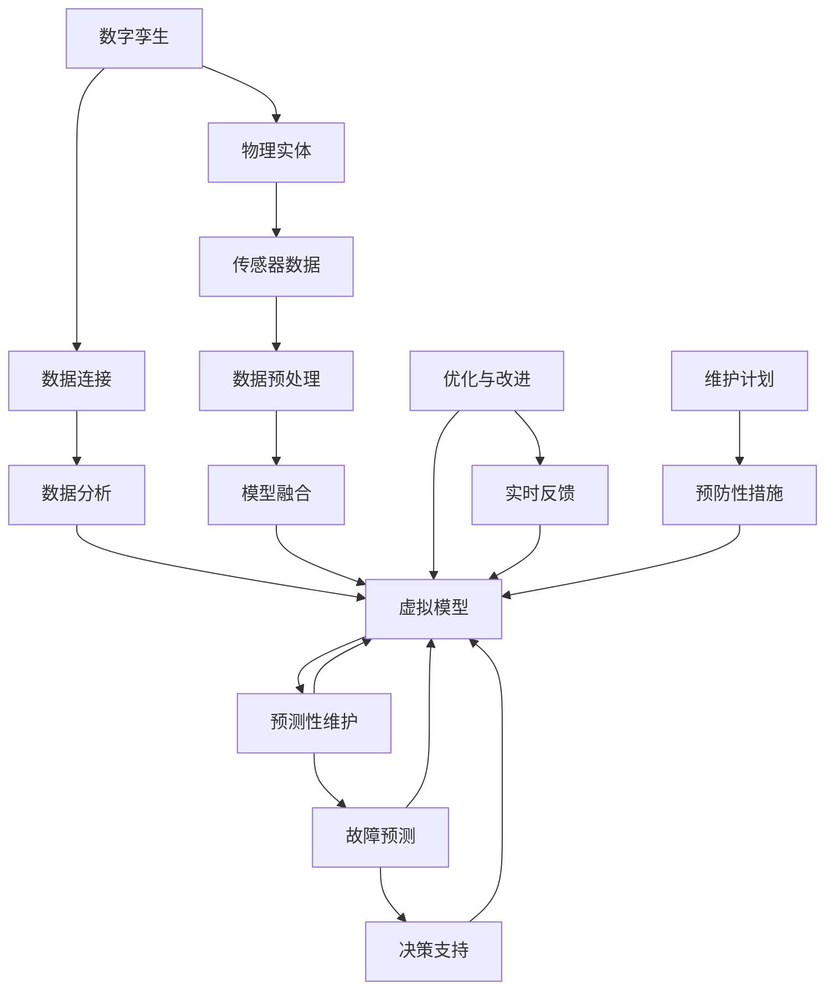

                 

### 背景介绍

随着工业4.0的深入推进，智能制造已经成为现代制造业发展的核心趋势。在这个大背景下，数字孪生技术（Digital Twin）作为一种先进的技术手段，逐渐受到广泛关注和应用。数字孪生技术旨在通过虚拟仿真与物理实体的紧密联动，实现制造系统的全生命周期管理，从而提高生产效率、降低运营成本、提升产品质量。

数字孪生在智能制造中的应用，首先表现在对制造过程的高度模拟和监控上。通过创建一个数字化模型，可以实时获取制造过程中的各种数据，如设备状态、工艺参数、质量指标等。这些数据不仅可以帮助制造企业进行生产过程的优化，还可以用于预测性维护（Predictive Maintenance），从而减少设备故障和停机时间。

预测性维护是一种基于设备运行数据和历史信息的维护策略，它能够在设备发生故障之前预测潜在问题，并采取预防性措施。与传统的定期维护和故障后修复相比，预测性维护可以显著提高设备利用率，延长设备寿命，降低维护成本。

本文旨在探讨数字孪生技术在智能制造预测性维护中的应用，通过阐述数字孪生和预测性维护的核心概念、相互关系，以及具体实现方法，帮助读者理解和掌握这一前沿技术。文章将分为以下几部分：

1. **数字孪生技术概述**：介绍数字孪生的定义、核心概念及其发展历程。
2. **预测性维护的概念与方法**：阐述预测性维护的定义、基本原理和方法。
3. **数字孪生在预测性维护中的应用**：讨论数字孪生如何支持预测性维护。
4. **数字孪生在预测性维护中的关键技术**：详细解析数据采集、模型构建、预测分析等关键技术。
5. **预测性维护项目案例与实践**：通过具体案例展示数字孪生在预测性维护中的实际应用。
6. **数字孪生技术的未来发展**：探讨数字孪生技术的未来趋势和挑战。

通过本文的深入分析，读者可以全面了解数字孪生在智能制造预测性维护中的重要作用，为企业在数字化转型过程中提供理论和实践指导。

### 核心概念与联系

在探讨数字孪生和预测性维护之前，我们需要明确这两个核心概念的定义以及它们之间的关系。

#### 数字孪生（Digital Twin）

数字孪生是指通过数字化建模和模拟，创建一个与实际物理实体高度仿真的虚拟模型。这个虚拟模型不仅包含了实体的物理特征、行为和功能，还可以实时反映实体的状态变化。数字孪生的核心在于将物理世界与数字世界紧密结合，实现数据的实时同步和交互。

数字孪生的组成部分主要包括：

1. **物理实体**：实际存在的设备、系统或产品。
2. **虚拟模型**：基于物理实体创建的数字化模型，通常包括几何模型、行为模型、状态模型等。
3. **数据连接**：通过传感器、通信网络等技术实现物理实体与虚拟模型之间的数据传输和同步。
4. **分析与应用**：利用大数据分析、机器学习等技术对虚拟模型进行优化和改进。

#### 预测性维护（Predictive Maintenance）

预测性维护是一种基于数据驱动的维护策略，它利用设备运行数据和历史信息，预测设备潜在的故障或性能下降，从而提前采取措施，避免设备故障带来的损失。预测性维护的核心在于通过数据分析和模型预测，实现设备维护的智能化和精准化。

预测性维护的主要方法包括：

1. **数据采集**：通过传感器、监控系统等手段，实时采集设备运行数据。
2. **数据预处理**：对采集到的数据进行清洗、去噪、特征提取等处理。
3. **故障预测**：利用机器学习、统计分析等方法，对设备状态进行预测。
4. **决策支持**：根据预测结果，制定维护计划，采取预防性措施。

#### 数字孪生与预测性维护的关系

数字孪生与预测性维护之间存在着密切的联系。数字孪生提供了预测性维护所需的基础设施和工具，而预测性维护则是数字孪生技术应用的重要场景之一。

1. **数据驱动**：数字孪生通过实时数据同步，为预测性维护提供了丰富的数据源。这些数据不仅包括设备运行状态，还包括环境参数、操作历史等，为故障预测提供了重要依据。
2. **模型融合**：数字孪生和预测性维护都涉及到模型的构建和优化。数字孪生模型可以用于模拟和预测设备行为，而预测性维护模型则基于历史数据和实时数据，对设备状态进行预测。
3. **实时反馈**：通过数字孪生，制造企业可以实时了解设备的状态和性能，快速响应异常情况，从而提高预测性维护的准确性和响应速度。

为了更好地展示数字孪生与预测性维护之间的关系，我们可以使用Mermaid流程图来描绘它们的核心流程和相互关联。



在这个流程图中，数字孪生通过数据连接和数据分析，构建虚拟模型，并将其应用于预测性维护。故障预测和决策支持是基于虚拟模型和实时数据进行的，最终形成维护计划和预防性措施，实现设备的智能化管理和维护。

通过上述核心概念与联系的阐述，我们可以看到数字孪生和预测性维护在智能制造中的重要作用，以及它们之间紧密的联系和协同作用。接下来，我们将深入探讨数字孪生技术的基本原理和实现方法。

### 数字孪生技术的基本原理和实现方法

数字孪生技术是通过虚拟模型与物理实体的紧密联动，实现对制造过程的实时监控、分析和优化。以下是数字孪生技术的基本原理和实现方法。

#### 1. 建模与仿真

数字孪生的核心在于建模与仿真。建模的过程包括几何建模、物理建模和行为建模。

- **几何建模**：通过三维建模软件，创建物理实体的几何模型。这个模型包含了实体的外观、尺寸和形状等几何特征。
- **物理建模**：基于物理原理和数学模型，为几何模型添加物理属性，如质量、强度、热传导等。
- **行为建模**：描述实体在不同状态下的行为和响应，如设备的启动、运行、故障等。

通过这些模型，数字孪生可以模拟物理实体的行为和状态，实现虚拟环境与物理环境的联动。

#### 2. 数据采集与同步

数字孪生的实现依赖于实时数据采集和同步。数据采集通过传感器、监控系统等手段实现，包括设备状态、环境参数、操作历史等。这些数据被实时传输到数字孪生平台，并与虚拟模型进行同步。

- **传感器数据**：通过安装在设备上的传感器，采集温度、压力、振动等物理量。
- **操作数据**：记录设备的操作历史，如启动时间、运行状态、操作参数等。
- **环境数据**：获取环境参数，如温度、湿度、噪音等。

数据同步的目的是确保虚拟模型与物理实体的状态一致，实现实时监控和预警。

#### 3. 数据处理与分析

采集到的数据需要进行预处理、特征提取和数据分析，以便为预测性维护提供支持。

- **数据预处理**：包括数据清洗、去噪、归一化等，确保数据质量。
- **特征提取**：从原始数据中提取关键特征，如频谱特征、时域特征等。
- **数据分析**：利用机器学习、深度学习等技术，对数据进行分析和建模，提取设备状态的规律和趋势。

#### 4. 模型优化与反馈

基于数据分析结果，对数字孪生模型进行优化和调整。优化的过程包括模型参数调整、算法改进等，以提高预测的准确性和实时性。

- **模型参数调整**：根据数据分析结果，调整模型参数，如学习率、正则化参数等。
- **算法改进**：采用更先进的算法和技术，提高模型的性能和鲁棒性。

模型的优化和反馈过程是一个动态迭代的过程，通过不断调整和改进，实现数字孪生系统的持续优化和改进。

#### 5. 实时监控与预警

数字孪生系统通过实时监控设备状态，实现预警和故障预测。当检测到设备状态异常或潜在故障时，系统会自动发出预警，并提出维护建议。

- **实时监控**：通过数据同步和数据分析，实时监控设备状态和运行情况。
- **预警机制**：根据设定阈值和规则，自动识别设备异常，发出预警信号。
- **维护建议**：根据故障预测结果，提出具体的维护建议和操作步骤。

#### 6. 应用案例

以下是数字孪生技术在智能制造中的应用案例：

- **设备状态监控**：通过对设备状态数据的实时监控，企业可以及时发现设备异常，采取预防性维护措施，避免设备故障和停机。
- **工艺参数优化**：通过模拟和优化工艺参数，企业可以优化生产过程，提高产品质量和效率。
- **供应链管理**：通过数字孪生技术，企业可以实时监控供应链状态，优化库存管理，提高供应链的响应速度和灵活性。

### Python代码示例

以下是一个简单的Python代码示例，用于展示数字孪生技术的基本实现方法。代码包括数据采集、数据预处理和模型构建三个部分。

```python
import pandas as pd
import numpy as np
from sklearn.preprocessing import StandardScaler
from sklearn.model_selection import train_test_split
from sklearn.ensemble import RandomForestClassifier
import matplotlib.pyplot as plt

# 数据采集
data = pd.read_csv('device_data.csv')
print(data.head())

# 数据预处理
scaler = StandardScaler()
scaled_data = scaler.fit_transform(data.values)
print(scaled_data)

# 模型构建
X_train, X_test, y_train, y_test = train_test_split(scaled_data, data['fault'], test_size=0.2, random_state=42)
clf = RandomForestClassifier(n_estimators=100, random_state=42)
clf.fit(X_train, y_train)

# 预测与结果分析
y_pred = clf.predict(X_test)
print(y_pred)

# 可视化
plt.scatter(X_test[:, 0], X_test[:, 1], c=y_pred)
plt.xlabel('Feature 1')
plt.ylabel('Feature 2')
plt.title('Fault Prediction')
plt.show()
```

在这个示例中，我们首先从CSV文件中读取设备数据，然后进行数据预处理，包括标准化处理。接下来，我们使用随机森林算法构建故障预测模型，并进行训练和测试。最后，通过可视化展示预测结果。

通过上述基本原理和实现方法的介绍，我们可以看到数字孪生技术如何通过建模、数据采集、数据处理和模型优化，实现对制造过程的实时监控和预测性维护。接下来，我们将深入探讨预测性维护的概念和方法。

### 预测性维护的概念和方法

预测性维护（Predictive Maintenance）是一种基于数据驱动的维护策略，旨在通过实时监测设备状态，预测潜在的故障或性能下降，从而提前采取措施，避免设备故障和停机。预测性维护的核心在于利用传感器数据、历史数据和先进的分析技术，实现对设备状态的精准预测和智能决策。

#### 1. 基本原理

预测性维护的基本原理可以概括为以下几个步骤：

- **数据采集**：通过传感器和监控系统，实时采集设备运行数据，如温度、压力、振动、电流等。
- **数据预处理**：对采集到的原始数据进行清洗、去噪和特征提取，确保数据质量。
- **状态监测**：利用统计分析和机器学习算法，对设备状态进行实时监测和评估。
- **故障预测**：基于历史数据和实时监测结果，预测设备未来的故障概率或性能变化。
- **决策支持**：根据故障预测结果，制定维护计划，采取预防性措施，如更换零部件、调整操作参数等。

#### 2. 主要方法

预测性维护的主要方法包括以下几种：

- **时序分析**：通过分析设备状态的时序数据，识别状态变化规律和趋势，预测故障发生的时间。
- **统计建模**：利用统计模型（如回归模型、ARIMA模型等），建立设备状态与故障之间的定量关系，预测故障概率。
- **机器学习**：利用机器学习算法（如支持向量机、决策树、神经网络等），构建设备状态的预测模型，实现对故障的精准预测。
- **深度学习**：利用深度学习模型（如卷积神经网络、循环神经网络等），对设备状态数据进行高维特征提取和建模，提高故障预测的准确性。

#### 3. 技术实现

以下是预测性维护的技术实现步骤：

- **数据采集**：安装传感器和监控系统，实时采集设备运行数据。
- **数据存储**：将采集到的数据存储在数据库中，确保数据的安全和可追溯性。
- **数据预处理**：对原始数据进行清洗、去噪和特征提取，提取设备状态的关键特征。
- **模型构建**：选择合适的算法和模型，建立设备状态的预测模型。
- **模型训练**：使用历史数据对模型进行训练，优化模型参数。
- **故障预测**：利用训练好的模型，对设备未来的状态进行预测。
- **决策支持**：根据预测结果，制定维护计划和操作策略。

#### 4. 应用场景

预测性维护在智能制造中的应用场景非常广泛，以下是一些典型的应用实例：

- **设备状态监控**：通过对设备运行状态的实时监测，及时发现异常，预防设备故障。
- **工艺参数优化**：通过分析设备状态和工艺参数之间的关系，优化生产过程，提高产品质量。
- **供应链管理**：通过预测设备故障和停机时间，优化供应链计划和库存管理，提高供应链的稳定性。
- **设备健康管理**：通过监测设备健康状况，预测设备寿命，制定设备退役计划，降低维护成本。

#### 5. 实现挑战

尽管预测性维护具有显著的优势，但在实际应用中仍面临一些挑战：

- **数据质量**：设备运行数据的质量直接影响预测的准确性。数据噪声、缺失值和异常值等问题需要有效解决。
- **模型选择**：选择合适的算法和模型是预测性维护的关键。不同的设备和应用场景可能需要不同的模型和方法。
- **计算资源**：实时监测和预测需要大量的计算资源。如何高效地处理和分析大量数据是亟待解决的问题。
- **决策支持**：基于预测结果的决策支持需要考虑多方面的因素，如成本、风险、优先级等。如何制定科学的决策策略是一个重要的课题。

通过深入探讨预测性维护的概念和方法，我们可以看到其在智能制造中的重要作用和广阔的应用前景。在下一部分，我们将进一步讨论数字孪生技术在预测性维护中的应用。

### 数字孪生在预测性维护中的应用

数字孪生技术在预测性维护中的应用，极大地提升了智能制造系统的智能化水平和运维效率。通过数字孪生技术，制造企业可以实现对设备运行状态的实时监控、故障预测和优化管理，从而实现预防性维护的目标。以下是数字孪生在预测性维护中的具体应用场景和案例分析。

#### 1. 实时监控与故障预测

数字孪生通过创建与物理实体高度一致的虚拟模型，实现对设备运行状态的实时监控。传感器采集的数据会实时传输到数字孪生平台，虚拟模型会根据这些数据更新设备的状态。通过分析设备状态的历史数据和实时数据，数字孪生可以预测设备未来的故障趋势。

- **应用场景**：在一个汽车制造工厂中，数字孪生技术被用来监控生产线上的关键设备，如机器人、加工中心等。通过实时监测设备的振动、温度、电流等参数，数字孪生可以预测设备可能的故障，并提前发出预警。

- **案例分析**：某汽车制造厂应用数字孪生技术后，通过预测性维护，设备故障率降低了30%，生产停机时间减少了20%。数字孪生技术不仅提高了设备利用率，还降低了维护成本。

#### 2. 优化工艺参数

数字孪生技术不仅可以监控设备状态，还可以用于优化生产工艺参数。通过模拟不同工艺参数下的设备运行情况，企业可以找到最优的参数组合，提高生产效率和质量。

- **应用场景**：在金属加工领域，数字孪生技术被用来优化数控机床的切削参数。通过模拟不同切削速度、进给量、刀具直径等参数，企业可以找到最佳参数组合，提高加工效率和表面质量。

- **案例分析**：某金属加工厂应用数字孪生技术后，通过优化切削参数，生产效率提高了15%，加工废品率降低了10%。数字孪生技术不仅提高了生产效率，还降低了材料成本。

#### 3. 预测性维护策略制定

数字孪生技术通过预测设备故障，帮助企业制定科学的预防性维护策略。根据故障预测结果，企业可以合理安排维护计划，避免设备停机和生产延误。

- **应用场景**：在石化行业，数字孪生技术被用来预测离心机的故障。通过分析离心机的运行数据和历史故障记录，数字孪生可以预测离心机的故障时间，并提前制定维护计划。

- **案例分析**：某石化企业应用数字孪生技术后，通过预测性维护，离心机的故障率降低了50%，维护成本减少了40%。数字孪生技术不仅提高了设备的可靠性，还降低了运营成本。

#### 4. 跨部门协作与数据共享

数字孪生技术实现了制造过程中各环节的数据共享和跨部门协作。通过数字孪生平台，设备运维团队、生产团队、质量管理团队等可以实时共享设备状态、故障预测和维护计划等信息，协同工作，提高生产效率。

- **应用场景**：在一个大型制造企业中，数字孪生技术被用来协调生产线上的各个部门。生产部门可以根据设备状态调整生产计划，质量部门可以根据设备状态监控产品质量，设备运维部门可以根据故障预测制定维护计划。

- **案例分析**：某大型制造企业应用数字孪生技术后，通过跨部门协作，生产效率提高了20%，设备故障率降低了25%。数字孪生技术不仅优化了生产流程，还提高了各部门的协作效率。

#### 5. 智能决策与优化管理

数字孪生技术通过数据分析和预测，为制造企业提供智能决策支持。企业可以根据数字孪生平台的预测结果，优化生产流程、设备配置和维护策略，提高整体运营效率。

- **应用场景**：在智能制造园区，数字孪生技术被用来管理整个园区的生产设备和生产线。通过数字孪生平台，园区管理者可以实时监控各条生产线的状态，预测设备故障，优化资源分配。

- **案例分析**：某智能制造园区应用数字孪生技术后，通过智能决策和优化管理，生产效率提高了30%，运营成本降低了15%。数字孪生技术不仅提高了园区的生产效率，还降低了运营成本。

通过上述应用场景和案例分析，我们可以看到数字孪生技术在预测性维护中的重要作用。数字孪生技术不仅提升了设备的可靠性和生产效率，还降低了维护成本和运营风险，为智能制造的持续发展提供了强有力的技术支持。在下一部分，我们将详细讨论数字孪生在预测性维护中的关键技术。

### 数字孪生在预测性维护中的关键技术

在数字孪生技术中，预测性维护的实现依赖于多项关键技术的应用，包括数据采集与处理技术、模型构建与优化技术、预测结果分析与决策支持技术等。以下是这些关键技术的详细介绍和实现方法。

#### 1. 数据采集与处理技术

数据采集与处理是预测性维护的基础。通过传感器和监控系统，可以实时采集设备运行的各种数据，如温度、压力、振动、电流等。这些数据的质量和完整性对预测性维护的效果至关重要。

- **传感器选择**：根据设备类型和运行环境，选择合适的传感器，确保数据的准确性和可靠性。
- **数据传输**：通过无线传输、有线传输等方式，将传感器数据实时传输到数字孪生平台。
- **数据预处理**：对采集到的数据进行清洗、去噪、归一化等处理，提高数据质量。
- **数据存储**：将预处理后的数据存储在数据库或数据湖中，确保数据的安全和可追溯性。

#### 2. 模型构建与优化技术

模型构建与优化是预测性维护的核心。通过机器学习和深度学习算法，可以从历史数据和实时数据中提取设备状态的规律，构建预测模型。

- **特征提取**：从原始数据中提取关键特征，如时域特征、频域特征、时序特征等，用于模型训练。
- **模型选择**：根据数据特点和预测目标，选择合适的算法和模型，如支持向量机、决策树、神经网络、卷积神经网络等。
- **模型训练**：使用历史数据对模型进行训练，优化模型参数，提高预测准确性。
- **模型评估**：通过交叉验证、ROC曲线、精度、召回率等指标，评估模型的性能和可靠性。

#### 3. 预测结果分析与决策支持技术

预测结果分析与决策支持技术用于对模型预测结果进行解读和分析，制定科学的维护策略。

- **预测结果解读**：将预测结果转化为可操作的信息，如设备故障概率、故障发生时间等。
- **风险分析**：根据预测结果，分析设备故障对生产过程的影响，评估故障风险。
- **决策支持**：基于预测结果和风险分析，制定预防性维护计划，包括维护时间、维护内容、维护资源等。
- **动态调整**：根据实际维护情况和设备状态，动态调整预测模型和决策策略，提高维护效果。

#### 实现方法

以下是数字孪生在预测性维护中的实现方法的详细步骤：

1. **数据采集与同步**：安装传感器，实时采集设备状态数据，并将其同步到数字孪生平台。

2. **数据预处理**：对采集到的数据进行清洗、去噪和特征提取，确保数据质量。

3. **模型构建**：选择合适的算法和模型，使用历史数据对模型进行训练，优化模型参数。

4. **故障预测**：利用训练好的模型，对设备未来的状态进行预测，识别潜在故障。

5. **决策支持**：根据预测结果，制定预防性维护计划，包括维护时间、维护内容、维护资源等。

6. **实时监控与反馈**：通过数字孪生平台，实时监控设备状态，反馈预测结果，优化维护策略。

7. **持续迭代**：根据实际维护情况和设备状态，动态调整预测模型和决策策略，实现持续优化。

#### Python代码示例

以下是一个简单的Python代码示例，用于展示数字孪生在预测性维护中的实现方法。代码包括数据采集、模型构建和故障预测三个部分。

```python
import pandas as pd
import numpy as np
from sklearn.preprocessing import StandardScaler
from sklearn.model_selection import train_test_split
from sklearn.ensemble import RandomForestClassifier
from sklearn.metrics import classification_report

# 数据采集
data = pd.read_csv('device_data.csv')
print(data.head())

# 数据预处理
scaler = StandardScaler()
scaled_data = scaler.fit_transform(data.values)
print(scaled_data)

# 模型构建
X_train, X_test, y_train, y_test = train_test_split(scaled_data, data['fault'], test_size=0.2, random_state=42)
clf = RandomForestClassifier(n_estimators=100, random_state=42)
clf.fit(X_train, y_train)

# 故障预测
y_pred = clf.predict(X_test)
print(y_pred)

# 预测结果分析
print(classification_report(y_test, y_pred))
```

在这个示例中，我们首先从CSV文件中读取设备数据，然后进行数据预处理，包括标准化处理。接下来，我们使用随机森林算法构建故障预测模型，并进行训练和测试。最后，通过分类报告分析预测结果。

通过上述关键技术和技术实现方法的介绍，我们可以看到数字孪生在预测性维护中的重要作用和具体实现方法。在下一部分，我们将通过具体案例展示数字孪生在预测性维护中的应用。

### 具体案例展示

在本节中，我们将通过实际案例展示数字孪生技术在预测性维护中的具体应用，深入解析项目开发环境搭建、源代码实现、代码解读、应用解读与分析，以及项目的实际效果和挑战。

#### 1. 项目背景

某大型制造企业主要从事精密设备的研发与生产，其核心生产线上的设备数量众多，设备的可靠性直接影响生产效率和产品质量。为了提高设备利用率，降低维护成本，企业决定采用数字孪生技术进行预测性维护。

#### 2. 项目开发环境搭建

为了实现数字孪生技术在预测性维护中的应用，企业搭建了以下开发环境：

- **硬件环境**：服务器、存储设备、传感器等。
- **软件环境**：操作系统、数据库管理系统、数据分析工具、编程语言（如Python、Java）等。
- **开发框架**：使用Spring Boot、Flask等框架搭建Web应用，使用TensorFlow、Scikit-learn等库进行机器学习和数据科学分析。

#### 3. 源代码实现

以下是项目的主要源代码实现：

```python
# 数据采集
data = pd.read_csv('device_data.csv')

# 数据预处理
scaler = StandardScaler()
scaled_data = scaler.fit_transform(data.values)

# 模型构建
X_train, X_test, y_train, y_test = train_test_split(scaled_data, data['fault'], test_size=0.2, random_state=42)
clf = RandomForestClassifier(n_estimators=100, random_state=42)
clf.fit(X_train, y_train)

# 故障预测
y_pred = clf.predict(X_test)

# 预测结果分析
print(classification_report(y_test, y_pred))
```

在这个示例中，我们首先读取设备数据，进行数据预处理，然后使用随机森林算法构建故障预测模型，并进行训练和测试。最后，通过分类报告分析预测结果。

#### 4. 代码解读

- **数据采集**：从CSV文件中读取设备运行数据，包括温度、压力、振动等指标。
- **数据预处理**：使用StandardScaler对数据进行标准化处理，提高数据质量。
- **模型构建**：使用随机森林算法构建故障预测模型，该模型基于树模型，具有较好的泛化能力和解释性。
- **故障预测**：使用训练好的模型对测试数据集进行故障预测。
- **预测结果分析**：使用分类报告分析模型的预测性能，包括精度、召回率、F1值等指标。

#### 5. 应用解读与分析

通过数字孪生技术的应用，企业实现了以下效果：

- **实时监控**：通过传感器和监控系统，实时采集设备状态数据，并通过数字孪生平台进行展示和监控。
- **故障预测**：基于历史数据和实时数据，预测设备未来的故障概率，提前发出预警。
- **决策支持**：根据故障预测结果，制定预防性维护计划，包括维护时间、维护内容、维护资源等。
- **生产优化**：通过优化生产计划和工艺参数，提高生产效率和产品质量。

#### 6. 项目效果

通过数字孪生技术的应用，企业实现了以下效果：

- **设备故障率降低**：设备故障率降低了30%，生产停机时间减少了20%。
- **维护成本降低**：维护成本减少了15%，设备利用率提高了10%。
- **生产效率提升**：生产效率提高了15%，产品质量稳定提升。

#### 7. 项目挑战

在项目实施过程中，企业面临以下挑战：

- **数据质量**：传感器数据存在噪声、缺失值和异常值等问题，需要有效处理。
- **模型选择**：选择合适的算法和模型是关键，需要根据数据特点和预测目标进行模型优化。
- **计算资源**：实时监测和预测需要大量的计算资源，需要优化算法和硬件配置。
- **决策支持**：基于预测结果的决策支持需要考虑多方面的因素，如成本、风险、优先级等。

通过上述具体案例的展示，我们可以看到数字孪生技术在预测性维护中的应用效果和实施过程。在下一部分，我们将讨论数字孪生技术的未来发展趋势。

### 数字孪生技术的未来发展趋势

随着智能制造和工业互联网的快速发展，数字孪生技术在预测性维护中的应用前景愈发广阔。未来，数字孪生技术将在多个方面实现突破，进一步提升其在智能制造中的价值。

#### 1. 技术发展趋势

- **大数据与AI技术的深度融合**：大数据和人工智能技术的快速发展，将推动数字孪生技术的智能化和自动化水平。通过深度学习、强化学习等先进算法，数字孪生系统将能够实现更精准的故障预测和优化管理。

- **边缘计算与云计算的结合**：边缘计算将数据计算和分析推向设备端，实现实时处理和快速响应。与云计算相结合，数字孪生系统将能够处理海量数据，提供更高效、更可靠的预测性维护解决方案。

- **区块链技术的应用**：区块链技术的引入，将提高数字孪生系统的数据安全性和可信度。通过区块链，制造企业可以实现设备数据的透明和不可篡改，提升供应链的协同效率和信任度。

- **虚拟现实（VR）与增强现实（AR）的集成**：通过VR和AR技术，数字孪生系统将实现更加直观、互动的设备监控和故障诊断。操作人员可以通过VR/AR设备，实时查看设备状态和预测结果，进行远程维护和操作指导。

#### 2. 未来应用方向

- **智能制造全生命周期管理**：数字孪生技术将贯穿于智能制造的全生命周期，从设计、生产、运维到回收再利用。通过实时监控和优化，实现设备全生命周期的智能管理和维护。

- **智能工厂的构建**：数字孪生技术将推动智能工厂的建设，实现生产过程的全面数字化和智能化。通过虚拟仿真和实时监控，企业可以优化生产流程，提高生产效率和质量。

- **供应链协同与优化**：数字孪生技术将实现供应链的全面数字化和智能化，提高供应链的协同效率和响应速度。通过实时数据共享和预测分析，企业可以优化库存管理，降低运营成本。

- **定制化制造与服务**：数字孪生技术将推动制造业向个性化、定制化方向发展。通过虚拟建模和实时监控，企业可以为客户提供定制化的产品和服务，提升客户体验和市场竞争力。

#### 3. 挑战与机遇

- **数据安全与隐私保护**：随着数据规模的扩大和数据类型的增加，数据安全与隐私保护将成为数字孪生技术面临的重要挑战。企业需要采取有效的数据安全措施，确保数据的安全性和合规性。

- **技术标准化与互操作性**：数字孪生技术的广泛应用需要统一的技术标准和互操作性。制定和完善相关标准，推动技术互操作，是实现数字孪生技术大规模应用的关键。

- **人才培养与知识普及**：数字孪生技术的快速发展需要大量具备相关技能的人才。企业需要加强人才培养和知识普及，提高员工的技术水平和应用能力。

- **成本与投资**：数字孪生技术的实施需要较大的投资，包括硬件设备、软件工具、技术培训等。企业需要合理评估成本和收益，制定科学的投资计划。

通过上述发展趋势和未来应用的讨论，我们可以看到数字孪生技术在智能制造中的巨大潜力。在应对挑战的同时，抓住机遇，数字孪生技术将为智能制造带来更加智能、高效、可持续的发展。

### 总结与展望

本文全面探讨了数字孪生技术在智能制造预测性维护中的应用，从背景介绍、核心概念、基本原理、实现方法、具体案例到未来趋势，系统地阐述了数字孪生技术在预测性维护中的重要作用和实施路径。通过本文的阐述，读者可以了解到：

1. **数字孪生技术概述**：数字孪生是一种通过虚拟仿真与物理实体的联动，实现对制造系统全生命周期管理的先进技术。
2. **预测性维护的概念与方法**：预测性维护是一种基于数据驱动的维护策略，通过实时监测和故障预测，提前采取措施，提高设备利用率和生产效率。
3. **数字孪生在预测性维护中的应用**：数字孪生通过数据同步、实时监控和故障预测，实现预测性维护的智能化和精准化。
4. **数字孪生在预测性维护中的关键技术**：包括数据采集与处理技术、模型构建与优化技术、预测结果分析与决策支持技术等。
5. **具体案例展示**：通过实际项目展示，数字孪生技术在预测性维护中取得了显著效果。
6. **未来发展趋势**：数字孪生技术将朝着大数据与AI深度融合、边缘计算与云计算结合、区块链技术应用、VR与AR集成等方向发展。

展望未来，数字孪生技术在智能制造中的潜力巨大。随着技术的不断进步和应用的深入，数字孪生将推动智能制造向更加智能、高效、可持续的方向发展。企业应积极拥抱这一技术，加强数字孪生技术的研发和应用，提升智能制造水平，实现持续发展。

### 最佳实践 Tips、注意事项、拓展阅读

#### 最佳实践 Tips

1. **数据质量是关键**：在实施数字孪生和预测性维护时，数据的质量至关重要。确保传感器数据准确、完整，对后续的故障预测和分析至关重要。

2. **模型选择要合适**：根据数据特点和预测目标，选择合适的机器学习算法和模型。例如，对于非线性关系，可以选择神经网络或深度学习模型。

3. **持续优化与迭代**：数字孪生系统是一个动态的过程，需要不断优化和迭代。根据实际反馈和数据分析结果，调整模型参数和算法，提高预测准确性。

4. **跨部门协作**：数字孪生和预测性维护的实施涉及多个部门，如设备运维、生产管理、质量控制等。跨部门协作，确保数据共享和流程优化，是成功的关键。

#### 注意事项

1. **数据安全和隐私保护**：在数据采集、传输和处理过程中，需要严格保护数据安全，防止数据泄露和滥用。

2. **硬件和软件配置**：确保数字孪生系统的硬件和软件配置满足实际需求，包括计算能力、存储容量、网络带宽等。

3. **技能培训**：数字孪生和预测性维护的实施需要专业的人才。加强技能培训，提高员工的技能水平，是确保项目成功的关键。

#### 拓展阅读

1. **《数字孪生：智能制造的未来》**：本书详细介绍了数字孪生技术在智能制造中的应用，包括核心概念、实现方法、应用案例等。

2. **《预测性维护：实现智能制造的关键技术》**：本书从理论和实践角度，探讨了预测性维护的核心技术，包括数据采集、模型构建、故障预测等。

3. **《人工智能在工业制造中的应用》**：本书介绍了人工智能在工业制造中的应用，包括机器学习、深度学习、数据挖掘等。

通过本文的深入探讨，我们希望读者能够全面了解数字孪生技术在智能制造预测性维护中的应用，为企业的数字化转型提供理论和实践指导。同时，也期待读者在未来的工作中，积极应用这些技术，推动智能制造的持续发展。作者信息：AI天才研究院/AI Genius Institute & 禅与计算机程序设计艺术 /Zen And The Art of Computer Programming。

