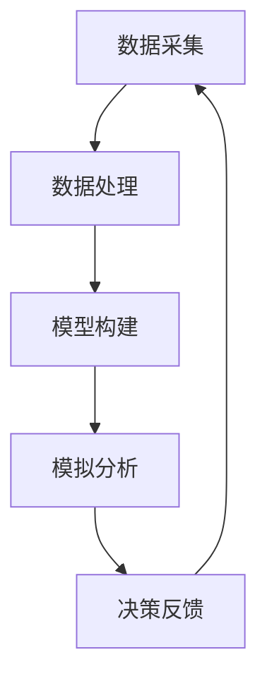

                 

## 引言

随着科技的不断进步，智能建筑管理逐渐成为建筑行业的一个重要发展方向。智能建筑不仅提高了建筑物的使用效率，还显著提升了建筑环境的安全性和舒适性。在这个过程中，数字孪生技术（Digital Twin）作为一种前沿的技术手段，正逐渐受到业界的广泛关注。

### 数字孪生技术的基本概念

数字孪生技术是一种将物理实体与其数字化镜像相结合的方法。通过采集物理实体的实时数据，并在数字世界中创建一个虚拟的副本，即数字孪生，实现对物理实体的实时监控、模拟和分析。数字孪生技术不仅能够提高运营效率，还能通过预测性维护减少设备故障和运营成本。

### 数字孪生在智能建筑管理中的应用

在智能建筑管理中，数字孪生技术可以应用于多个方面。首先，它可以用于建筑设计和施工过程中，通过数字孪生模型进行虚拟仿真，优化建筑结构，提高施工效率。其次，在运营管理阶段，数字孪生可以用于实时监测建筑设备的状态，提前发现潜在问题，实现预测性维护。

### 文章目的与结构

本文旨在系统地探讨数字孪生在智能建筑管理中的应用。文章将分为四个主要部分：

1. **数字孪生概念介绍**：阐述数字孪生技术的基本概念、发展历史和应用领域。
2. **数字孪生在智能建筑管理中的应用**：详细讨论数字孪生在智能建筑中的具体应用场景，包括建筑设计、施工和运营管理。
3. **技术原理讲解**：深入分析数字孪生的技术原理，包括数据采集、数据处理、模型构建和模拟分析。
4. **实际案例分享与未来发展趋势**：通过具体案例分析，展示数字孪生技术的实际应用效果，并探讨未来的发展趋势。

通过本文的阅读，读者将能够全面了解数字孪生技术，并认识到其在智能建筑管理中的巨大潜力。

### 数字孪生技术的核心关键词

- **数字孪生（Digital Twin）**：物理实体与其数字化镜像的有机结合。
- **智能建筑管理**：通过数字化技术提高建筑物使用效率和管理水平。
- **数据采集与处理**：实时获取物理实体数据，并对其进行处理和分析。
- **模型构建与模拟分析**：基于数字孪生模型进行建筑结构和运行状态的模拟和分析。
- **预测性维护**：通过实时监控和预测分析，提前发现设备故障，实现预防性维护。

### 摘要

本文探讨了数字孪生技术在智能建筑管理中的应用。首先，介绍了数字孪生技术的基本概念和发展背景，随后详细分析了其在智能建筑中的具体应用，包括设计优化、施工管理和运营维护。接着，深入讲解了数字孪生的技术原理，如数据采集、数据处理、模型构建和模拟分析。通过实际案例的分享，展示了数字孪生技术的应用效果。最后，讨论了数字孪生技术的发展趋势和未来前景，强调了其在智能建筑管理中的关键作用。本文旨在为读者提供全面的数字孪生技术应用指南，帮助从业者更好地理解和应用这一前沿技术。关键字：数字孪生、智能建筑管理、数据采集、数据处理、模型构建、模拟分析、预测性维护。

## 第一部分：数字孪生概述

### 1.1 数字孪生：概念与背景

数字孪生（Digital Twin）是一种利用数字化技术创建物理实体的数字映射，从而实现对实体进行实时监控、模拟和分析的技术。这个概念最早可以追溯到2002年，美国密歇根大学教授Michael Grieves在《基于模型的系统设计与过程》一书中首次提出。随着物联网（IoT）、云计算、大数据和人工智能等技术的快速发展，数字孪生技术逐渐成为研究热点。

### 数字孪生的基本概念

数字孪生由两个主要部分组成：物理孪生和数字孪生。

- **物理孪生**：实际的物理实体，如建筑物、设备或机器。
- **数字孪生**：基于物理实体创建的数字化镜像，通过实时数据采集、处理和分析，实现对物理实体的虚拟监测和模拟。

### 数字孪生的发展历史

数字孪生技术的发展历程可以分为以下几个阶段：

1. **早期阶段**（2002年之前）：概念提出，主要是理论研究。
2. **起步阶段**（2002-2010年）：随着物联网技术的兴起，数字孪生开始应用于工业领域，如制造业。
3. **快速发展阶段**（2010-2015年）：云计算和大数据技术的成熟，推动了数字孪生在多个行业的应用。
4. **成熟应用阶段**（2015年至今）：人工智能技术的引入，使得数字孪生技术更加智能化，应用领域进一步拓展到建筑、医疗、能源等领域。

### 数字孪生在智能建筑管理中的应用领域

数字孪生在智能建筑管理中的应用非常广泛，主要包括以下几个领域：

1. **建筑设计**：通过数字孪生模型进行虚拟仿真，优化建筑结构，提高设计效率。
2. **施工管理**：实时监测施工进度和质量，提高施工管理水平。
3. **运营维护**：实时监测建筑设备状态，实现预测性维护，降低运营成本。
4. **安全监控**：通过数字孪生模型进行安全预警，提高建筑物的安全性。

### 数字孪生技术的基本特征

数字孪生技术具有以下几个基本特征：

1. **实时性**：通过实时数据采集和更新，实现对物理实体的实时监控。
2. **模拟性**：通过数字模型进行模拟和分析，预测物理实体的运行状态和潜在问题。
3. **智能性**：引入人工智能技术，实现对物理实体的高效管理和优化。
4. **集成性**：将多种技术手段整合在一起，形成一个完整的数字孪生体系。

### 小结

数字孪生技术是一种利用数字化技术创建物理实体数字映射的方法，通过实时数据采集、处理和分析，实现对物理实体的实时监控、模拟和分析。其发展历程可以追溯到2002年，随着物联网、云计算、大数据和人工智能等技术的发展，数字孪生技术在智能建筑管理中的应用日益广泛。数字孪生技术的基本特征包括实时性、模拟性、智能性和集成性。接下来，我们将进一步探讨数字孪生在智能建筑管理中的应用。

## 1.2 数字孪生与智能建筑管理

在智能建筑管理中，数字孪生技术发挥着至关重要的作用。它不仅为建筑设计和施工提供了强大的支持，还在运营和维护阶段带来了显著的优势。本节将详细探讨数字孪生在智能建筑管理中的应用领域、其对建筑管理的积极影响，以及智能建筑管理面临的挑战与机遇。

### 数字孪生在智能建筑管理中的应用领域

1. **建筑设计**：
   数字孪生技术为建筑设计提供了强大的工具。通过创建建筑物的数字孪生模型，设计师可以在虚拟环境中进行仿真和优化。这种虚拟仿真可以帮助设计师提前发现设计中的潜在问题，如结构应力分布、能耗分析等，从而在设计阶段就进行优化，提高建筑设计的质量和效率。

2. **施工管理**：
   数字孪生技术可以实时监测施工进度和质量。通过在施工现场部署传感器和监控系统，实时收集施工过程中的数据，并将其与数字孪生模型进行对比，施工团队可以及时发现和纠正偏差，确保施工的精确性和高效性。此外，数字孪生技术还可以模拟施工过程中的各种场景，为施工团队提供决策支持。

3. **运营维护**：
   在建筑运营阶段，数字孪生技术可以实现对建筑设备的实时监测和预测性维护。通过持续收集建筑设备的数据，数字孪生模型可以分析设备的运行状态，预测潜在故障，并提供维护建议。这种预测性维护可以显著降低设备的故障率和运营成本，提高建筑物的使用效率和安全性。

4. **安全监控**：
   数字孪生技术还可以用于建筑安全监控。通过在建筑物中部署传感器和监控设备，实时收集建筑内部和周边环境的数据，数字孪生模型可以实时分析这些数据，识别潜在的安全隐患，如火灾、泄漏等，并提供及时的预警，确保建筑物的安全。

### 数字孪生对智能建筑管理的积极影响

1. **提高设计效率**：
   通过数字孪生技术，设计师可以在虚拟环境中进行建筑设计和优化，减少了实物模型的需求，提高了设计效率。

2. **降低施工成本**：
   数字孪生技术可以实时监测施工进度和质量，减少施工过程中的错误和返工，从而降低施工成本。

3. **提升运营效率**：
   数字孪生技术可以实现对建筑设备的实时监测和预测性维护，提高建筑物的运行效率，降低运营成本。

4. **增强安全性**：
   数字孪生技术可以实时监控建筑内部和周边环境，提高建筑物的安全性。

### 智能建筑管理面临的挑战与机遇

1. **数据管理**：
   智能建筑中产生的海量数据需要有效管理和存储。如何高效地处理和分析这些数据，提取有价值的信息，是智能建筑管理面临的挑战之一。

2. **技术集成**：
   数字孪生技术需要与其他智能技术（如物联网、大数据分析等）进行集成，构建一个统一的智能建筑管理系统。这需要解决技术兼容性和系统整合问题。

3. **标准化**：
   目前，数字孪生技术的标准化工作仍在进行中。缺乏统一的标准和规范可能导致系统间的互操作性差，影响智能建筑管理的效果。

4. **隐私与安全**：
   智能建筑中涉及大量的个人数据和敏感信息，如何保护这些数据的安全性和隐私性，是一个重要的挑战。

5. **机遇**：
   数字孪生技术为智能建筑管理带来了巨大的机遇。通过数字化和智能化手段，建筑行业可以实现从设计到运营的全面优化，提高效率，降低成本，提升用户体验。

### 小结

数字孪生技术在智能建筑管理中的应用涵盖了建筑设计、施工管理、运营维护和安全监控等多个领域。它不仅提高了设计效率和施工质量，还提升了运营效率和建筑安全性。然而，智能建筑管理也面临着数据管理、技术集成、标准化、隐私和安全等挑战。通过有效应对这些挑战，智能建筑管理将迎来更加广阔的发展前景。

## 1.3 数字孪生在智能建筑管理中的挑战

尽管数字孪生技术在智能建筑管理中展示了巨大的潜力，但其在实际应用过程中也面临着诸多挑战。这些挑战主要集中在技术、数据管理、隐私和安全等方面。本节将详细探讨这些挑战，并提出可能的解决方案。

### 技术挑战

1. **数据采集与处理**：
   数字孪生技术依赖于大量的实时数据。然而，数据采集和处理的复杂性是一个重大挑战。传感器技术、数据传输和存储系统的可靠性需要进一步提高，以确保数据的准确性和实时性。

   **解决方案**：采用高性能传感器和可靠的通信协议，如5G和物联网技术，提升数据采集和传输的效率。同时，利用大数据分析和机器学习技术，对采集到的数据进行实时处理和分析，提高数据处理的准确性和效率。

2. **模型构建与模拟**：
   数字孪生模型需要高度精确地反映物理实体的状态。然而，模型构建和模拟的精度和效率仍然是一个挑战，特别是在处理复杂建筑结构和多变量交互时。

   **解决方案**：利用先进的建模工具和算法，如计算机仿真和人工智能，提高数字孪生模型的构建和模拟精度。同时，通过不断优化和迭代模型，提高模型的适应性和准确性。

3. **系统集成与兼容性**：
   智能建筑管理系统通常涉及多种技术和设备，如传感器、监控系统和控制设备。系统集成与兼容性问题可能导致系统间的不兼容和性能下降。

   **解决方案**：采用开放标准和协议，如物联网标准和云计算平台，确保系统间的互操作性和兼容性。同时，通过模块化和标准化设计，降低系统集成难度。

### 数据管理挑战

1. **数据存储与安全性**：
   智能建筑产生的数据量巨大，需要高效的数据存储和备份方案。同时，如何保护数据的安全性和隐私性也是一个重大挑战。

   **解决方案**：采用分布式存储和云存储技术，提高数据的存储容量和可靠性。同时，通过数据加密和访问控制技术，确保数据的安全性和隐私性。

2. **数据整合与一致性**：
   智能建筑管理系统需要整合来自不同来源的数据，如传感器、监控系统和用户数据。数据整合的一致性和准确性是确保系统正常运行的关键。

   **解决方案**：采用数据集成技术和数据质量管理工具，确保数据的一致性和准确性。同时，通过数据治理策略，规范数据的使用和管理。

### 隐私与安全挑战

1. **用户隐私保护**：
   智能建筑管理系统会收集大量用户数据，如行为数据、位置数据和健康数据。如何保护用户的隐私是一个重大挑战。

   **解决方案**：制定严格的隐私保护政策，明确用户数据的收集、使用和共享规则。同时，采用数据加密和匿名化技术，保护用户的隐私。

2. **网络安全**：
   智能建筑管理系统通常连接到互联网，面临网络攻击和数据泄露的风险。

   **解决方案**：采用网络安全技术和安全策略，如防火墙、入侵检测系统和数据加密，确保系统的网络安全。同时，定期进行安全审计和漏洞修复，提高系统的安全性。

### 小结

数字孪生技术在智能建筑管理中面临着多种技术、数据管理和隐私与安全挑战。通过采用先进的技术手段、完善的数据管理策略和严格的隐私保护措施，可以克服这些挑战，实现数字孪生技术在智能建筑管理中的广泛应用。接下来，我们将进一步探讨数字孪生的技术原理，以便更好地理解其工作原理和应用机制。

## 1.4 数字孪生的技术原理

数字孪生技术作为一种前沿的数字化手段，其核心在于如何高效地创建物理实体的数字化镜像，并通过实时数据采集、数据处理和分析，实现对物理实体的全面监控和管理。下面将详细探讨数字孪生的技术原理，包括数据采集、数据处理、模型构建和模拟分析。

### 数据采集

数据采集是数字孪生技术的第一步，也是关键的一步。数字孪生技术依赖于多种传感器和监测设备，以获取物理实体的各种数据。这些数据可以包括：

1. **环境数据**：如温度、湿度、光照强度、空气质量等。
2. **设备数据**：如建筑设备的运行状态、能源消耗、故障记录等。
3. **结构数据**：如建筑结构的应力分布、振动情况、材料性能等。

传感器技术在这一过程中起着至关重要的作用。高性能传感器可以精确地捕捉物理实体的各种变化，并将这些数据转换为电信号。常见的传感器类型包括温度传感器、湿度传感器、摄像头、加速度计、压力传感器等。此外，随着物联网技术的发展，传感器网络可以实现对物理实体全方位、实时的监测。

### 数据处理

采集到的数据需要经过处理，以便用于后续的建模和分析。数据处理包括以下几个步骤：

1. **数据清洗**：去除噪声和异常值，确保数据的准确性和一致性。
2. **数据转换**：将不同格式的数据转换为统一的格式，便于后续处理和分析。
3. **数据存储**：将处理后的数据存储在数据库或数据仓库中，以便随时调用和分析。

数据处理过程中，大数据技术和云计算技术发挥了重要作用。通过大数据技术，可以高效地处理和分析海量数据，提取有价值的信息。云计算技术则提供了强大的计算和存储能力，支持大规模数据处理。

### 模型构建

在数据处理完成后，数字孪生模型构建是下一步的关键步骤。数字孪生模型是对物理实体的数字化映射，它需要准确地反映物理实体的各个方面，包括结构、功能、状态等。构建数字孪生模型通常包括以下几个步骤：

1. **数据建模**：根据采集到的数据，构建物理实体的数据模型。这通常需要使用数据建模工具，如SQL、NoSQL数据库或数据模型设计工具。
2. **物理建模**：基于数据模型，构建物理实体的物理模型。物理模型通常使用3D建模工具或CAD软件进行构建。
3. **集成建模**：将数据模型和物理模型进行集成，形成一个完整的数字孪生模型。集成建模可以采用可视化建模工具，如Dynamo或Graphviz。

### 模拟分析

数字孪生模型构建完成后，可以通过模拟分析来预测物理实体的行为和状态。模拟分析可以包括以下几种类型：

1. **静态分析**：对物理实体的静态特性进行模拟，如结构应力分析、热能分布等。
2. **动态分析**：对物理实体的动态行为进行模拟，如机械振动分析、设备故障预测等。
3. **交互分析**：模拟物理实体与其他物理实体或环境的交互，如建筑内部气流模拟、能源消耗分析等。

模拟分析通常使用计算机仿真工具，如ANSYS、Simulink、MATLAB等。通过这些工具，可以实现对物理实体复杂行为的精确模拟和分析。

### 数字孪生技术的优势

数字孪生技术通过实时数据采集、数据处理和模型构建，实现对物理实体的全面监控和管理，具有以下优势：

1. **实时监控**：通过实时数据采集和更新，可以实现对物理实体的实时监控，及时发现和处理问题。
2. **预测性分析**：通过模拟分析，可以预测物理实体的行为和状态，提前发现潜在问题，实现预测性维护。
3. **优化决策**：基于数字孪生模型，可以模拟不同方案的效果，为决策提供数据支持，优化设计和运营方案。
4. **降低成本**：通过预测性维护和优化设计，可以减少设备的故障率和运营成本。

### 小结

数字孪生技术通过数据采集、数据处理、模型构建和模拟分析，实现对物理实体的全面监控和管理。其优势在于实时监控、预测性分析和优化决策，有助于提高运营效率、降低成本和提升用户体验。接下来，我们将通过实际案例来探讨数字孪生技术在智能建筑管理中的具体应用。

## 1.5 数字孪生技术的实际应用案例

数字孪生技术在智能建筑管理中展示了巨大的潜力，通过以下实际应用案例，我们可以深入了解其在建筑设计和施工、运营和维护等方面的具体应用和效果。

### 案例一：智慧办公楼数字孪生系统

某国际知名企业在其新建的智慧办公楼中，应用了数字孪生技术进行设计和施工管理。该项目利用BIM（建筑信息模型）技术创建数字孪生模型，通过实时数据采集和分析，实现了以下效果：

1. **设计优化**：在建筑设计阶段，通过数字孪生模型，设计师能够进行虚拟仿真，优化建筑结构和布局。例如，通过对不同空调系统的模拟分析，找到了最佳空调系统配置方案，降低了能耗。

2. **施工管理**：在施工阶段，数字孪生模型与施工现场实时联动，监控施工进度和质量。通过传感器网络和物联网技术，实时监测施工过程中的关键参数，如温度、湿度、材料使用情况等。一旦发现偏差，系统能够及时发出警报，并通知施工团队进行调整，确保施工的精确性和高效性。

3. **运营维护**：在运营阶段，数字孪生模型继续发挥作用。通过持续监测建筑设备的运行状态，如空调系统、照明系统等，系统能够预测设备故障，提供维护建议。例如，通过对空调系统的实时数据分析，系统能够提前发现冷凝器故障，提前进行维护，避免了突发故障导致的停机。

### 案例二：绿色社区数字孪生系统

某绿色社区项目利用数字孪生技术进行全生命周期的管理，实现了以下效果：

1. **能源管理**：通过数字孪生模型，社区可以实现智能能源管理。系统能够实时监测社区的能源消耗情况，分析能耗数据，优化能源使用。例如，通过太阳能和风能的实时监测和预测，社区能够调整能源使用策略，最大限度地利用可再生能源。

2. **环境监测**：数字孪生模型还可以用于环境监测。通过部署在社区内的传感器网络，实时监测空气质量、噪声水平等环境参数。一旦监测到异常，系统能够及时发出预警，并采取相应的措施，如调整绿化带喷灌时间、关闭噪音源等。

3. **居民服务**：数字孪生技术还可以为居民提供个性化的服务。例如，通过分析居民的行为数据，社区能够提供定制化的健身、娱乐和购物建议，提升居民的生活质量。

### 案例三：智能医院数字孪生系统

某智能医院项目利用数字孪生技术进行医院管理和运营优化，实现了以下效果：

1. **设备管理**：通过数字孪生模型，医院能够实时监控医疗设备的运行状态。例如，对MRI、CT等大型医疗设备的实时监测，能够提前发现设备故障，安排维护，确保设备的高效运行。

2. **患者护理**：数字孪生模型还可以用于患者护理。通过实时监测患者的生命体征数据，医生能够及时掌握患者的健康状况，提供个性化的治疗方案。例如，对于重症患者，数字孪生系统能够实时分析患者的生命体征，及时发现异常，通知医生采取紧急措施。

3. **运营优化**：通过数字孪生模型，医院能够优化资源配置，提高运营效率。例如，通过对病床利用率的分析，医院能够合理安排床位，减少床位闲置，提高病床利用率。

### 小结

通过以上实际应用案例，我们可以看到数字孪生技术在智能建筑管理中的广泛应用和显著效果。无论是在建筑设计、施工管理，还是在运营维护阶段，数字孪生技术都能够提供实时数据支持，优化管理决策，提高运营效率，降低成本，提升用户体验。随着数字孪生技术的不断发展，其在智能建筑管理中的应用将更加深入和广泛。

### 1.6 数字孪生技术的未来发展趋势

数字孪生技术在智能建筑管理中的应用已经取得了显著成果，但未来仍有着广阔的发展空间和潜力。以下将探讨数字孪生技术的未来发展趋势，包括技术创新、新应用场景的拓展和潜在的市场需求。

#### 技术创新

1. **人工智能与机器学习**：随着人工智能和机器学习技术的不断进步，数字孪生技术将更加智能化。通过深度学习和强化学习，数字孪生系统能够自我学习和优化，提高预测准确性，实现更高效的运营管理。

2. **区块链技术**：区块链技术在数字孪生中的应用将显著提升数据的安全性和透明性。通过分布式账本技术，数字孪生系统能够确保数据的不可篡改性和隐私保护，同时促进数据的共享和互操作性。

3. **边缘计算**：边缘计算能够将数据处理和分析推向网络边缘，减少数据传输延迟，提高实时性。数字孪生技术结合边缘计算，能够实现更高效的数据处理和更快速的响应，满足智能建筑管理对实时性的需求。

#### 新应用场景的拓展

1. **智慧城市**：数字孪生技术将在智慧城市中发挥重要作用，通过创建城市的数字化模型，实现城市资源的优化配置和高效管理。例如，交通管理、环境保护、城市规划等都可以通过数字孪生技术得到改进。

2. **智能家居**：随着智能家居的普及，数字孪生技术将应用于家庭设备的管理和优化。通过数字孪生模型，智能家居系统能够实时监测家居设备的运行状态，提供个性化的服务，提高居住体验。

3. **可再生能源管理**：数字孪生技术在可再生能源（如太阳能、风能）的管理中具有巨大潜力。通过数字孪生模型，可再生能源系统可以实现更高效的能源采集、存储和分配，提高能源利用效率。

#### 潜在的市场需求

1. **能源节约**：随着能源消耗的增加和环保意识的提升，智能建筑和智慧城市对能源节约的需求日益增长。数字孪生技术能够通过实时监控和优化，降低能源消耗，满足市场需求。

2. **运维效率**：智能建筑和智慧城市的管理和运维成本较高，通过数字孪生技术实现预测性维护和优化管理，可以显著降低运维成本，提升管理效率。

3. **安全性提升**：随着安全威胁的增加，智能建筑和智慧城市对安全性的要求越来越高。数字孪生技术可以通过实时监控和预警，提高安全防护能力，保障系统安全。

### 小结

数字孪生技术在智能建筑管理中的应用前景广阔，未来将迎来更多的技术创新和应用场景拓展。随着人工智能、区块链和边缘计算等新技术的引入，数字孪生技术将更加智能化、安全化和高效化。同时，随着市场需求的不断增长，数字孪生技术在智能建筑管理中的潜在价值将得到进一步释放。通过不断创新和应用，数字孪生技术有望成为推动智能建筑和智慧城市发展的重要动力。

## 总结与展望

数字孪生技术作为智能建筑管理的重要工具，已在多个领域展示了其卓越的潜力。通过本文的探讨，我们系统地了解了数字孪生技术的概念、应用场景、技术原理以及实际案例。以下是对本文内容的简要总结和未来展望。

### 总结

- **基本概念**：数字孪生是一种通过数字化手段创建物理实体的数字映射，实现对物理实体的实时监控、模拟和分析的技术。
- **应用领域**：数字孪生在智能建筑管理中的应用涵盖了建筑设计、施工管理、运营维护和安全监控等多个方面。
- **技术原理**：数字孪生技术涉及数据采集、数据处理、模型构建和模拟分析等环节，通过实时数据支持和智能分析，实现对物理实体的全面管理和优化。
- **实际案例**：通过智慧办公楼、绿色社区和智能医院等实际案例，展示了数字孪生技术在提高设计效率、降低施工成本、提升运营效率和增强安全性等方面的显著效果。
- **未来趋势**：随着人工智能、区块链和边缘计算等新技术的引入，数字孪生技术将更加智能化、安全化和高效化，并有望在智慧城市、智能家居和可再生能源管理等领域得到广泛应用。

### 展望

- **技术创新**：未来，数字孪生技术将在人工智能、区块链和边缘计算等前沿技术的推动下，实现更高效的实时数据处理和更精确的模拟分析。
- **新应用场景**：随着技术的进步，数字孪生技术将在智慧城市、智能家居和可再生能源管理等领域得到更广泛的应用，推动整个建筑和城市行业向智能化方向发展。
- **市场需求**：随着能源消耗的增加和环保意识的提升，数字孪生技术将在能源节约和运维效率方面发挥重要作用，满足市场对高效、安全、智能建筑管理的需求。

### 结语

数字孪生技术作为智能建筑管理的重要工具，具有巨大的潜力和广阔的发展前景。通过本文的探讨，我们不仅了解了数字孪生技术的核心概念和应用场景，还对其技术原理和未来趋势有了更深入的认识。未来，随着技术的不断进步和应用的深入，数字孪生技术将推动智能建筑和智慧城市的发展，为人类创造更加高效、安全和舒适的生活环境。

## 附录

### 附录 A：数字孪生技术资源与工具

#### A.1 常用数字孪生平台

1. **GE Predix**：GE公司的数字孪生平台，提供从数据采集到分析和优化的全流程解决方案。
2. **Siemens MindSphere**：西门子的工业互联网平台，支持数字孪生技术的开发和部署。
3. **PTC ThingWorx**：PTC的数字孪生平台，提供设备连接、数据分析和应用开发的一体化解决方案。
4. **Aveva Insight**：Aveva的数字孪生平台，支持从设计到运营的全生命周期管理。

#### A.2 数字孪生相关工具

1. **CAD软件**：如Autodesk Revit、ArchiCAD等，用于数字孪生模型的构建和设计。
2. **BIM软件**：如Navisworks、Bentley Systems等，用于建筑信息模型的构建和管理。
3. **物联网平台**：如AWS IoT、Azure IoT、Google IoT等，用于设备连接和数据采集。
4. **数据分析工具**：如Tableau、PowerBI、Qlik等，用于数据可视化和分析。

#### A.3 数字孪生开源项目

1. **Eclipse Hono**：一个开源的物联网边缘计算平台，用于数字孪生应用的数据采集和处理。
2. **FastDouble**：一个开源的数字孪生框架，提供从数据采集到分析的全流程解决方案。
3. **OpenDTech**：一个开源的数字孪生平台，支持从数据采集到可视化的全流程功能。
4. **OpenMCT**：一个开源的监控与任务控制台，用于数字孪生应用的可视化和控制。

### 附录 B：相关阅读推荐

1. **《数字孪生：定义、应用与未来》**：一本全面介绍数字孪生技术的基础书籍，适合初学者了解数字孪生的基本概念和应用。
2. **《数字孪生实践指南》**：详细介绍了数字孪生技术在各行业中的应用和实践，适合对数字孪生有一定了解的读者。
3. **《智能建筑管理》**：一本系统介绍智能建筑管理和技术的书籍，涵盖数字孪生技术在智能建筑中的应用。
4. **《物联网：构建智能世界》**：详细介绍了物联网技术的基本概念、架构和应用，对理解数字孪生技术的背景和基础有帮助。

通过这些资源和推荐书籍，读者可以进一步深入学习和了解数字孪生技术及其在智能建筑管理中的应用。

### Mermaid 流程图



### 算法伪代码

```plaintext
Algorithm DigitalTwinSimulation
Input: BuildingData
Output: SimulationResult

1. Initialize Model
2. for each DataPoint in BuildingData
   3. Update Model with DataPoint
4. Run Simulation on Model
5. Collect SimulationResults
6. Output SimulationResults
```

```latex
$$
E = mc^2
$$
$$
1 + 1 = 2
$$
```

