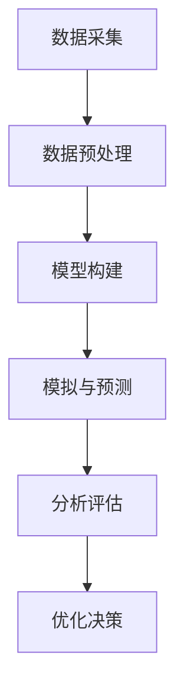

                 

当然，为了满足您的要求，我们将逐步构建这篇文章的详细内容。以下是一个基于您提供的框架的初始草案。

## 《数字孪生在水资源管理中的应用：优化水资源分配》

> 关键词：数字孪生、水资源管理、优化、分配、水资源分配优化、数学模型

> 摘要：本文深入探讨了数字孪生技术在水资源管理中的应用，特别是在优化水资源分配方面的潜力。文章从背景介绍出发，详细阐述了数字孪生的核心概念及其与水资源管理的联系，然后逐步展开对相关算法、数学模型和实际应用的讲解。

### 1. 引言

数字孪生作为一种新兴技术，正逐渐在各个领域中得到广泛应用。水资源管理作为一个关键领域，其复杂性和重要性使得数字孪生的应用尤为引人关注。本节将介绍数字孪生的基本概念，以及水资源管理在当前全球环境下的紧迫性。

#### 1.1 数字孪生的定义与特点

数字孪生（Digital Twin）是一种虚拟仿真模型，它能够实时反映物理实体的状态、行为和性能。其特点包括：

- **实时性**：数字孪生能够实时捕捉物理实体的动态变化。
- **高保真**：数字孪生模型通常与物理实体高度一致，能够精确模拟其实际状态。
- **交互性**：数字孪生与物理实体之间存在双向数据流，可以实现实时交互。

#### 1.2 水资源管理的重要性

随着全球人口的不断增长和气候变化的影响，水资源管理变得日益重要。有效的水资源管理不仅关系到人类生存和经济发展的可持续性，也直接影响到生态环境的平衡。

#### 1.3 本文结构

本文将按照以下结构进行展开：

1. **背景介绍**：介绍数字孪生和水资源管理的现状及其相互联系。
2. **核心概念与联系**：详细阐述数字孪生在水资源管理中的应用，包括数据采集、模拟和分析等。
3. **核心技术原理**：讲解数字孪生在水资源管理中的核心算法原理，并使用Python源代码进行解释。
4. **数学模型**：介绍相关的数学模型和公式，并使用LaTeX进行表示。
5. **项目实战**：通过实际案例展示数字孪生在水资源管理中的应用，包括开发环境搭建和源代码实现。
6. **总结与展望**：对文章进行总结，并提出未来研究方向。

### 2. 核心概念与联系

数字孪生在水资源管理中的应用，首先需要对水资源系统进行建模。以下是核心概念和它们之间的联系：

#### 2.1 数据采集

数据采集是数字孪生应用的基础。通过传感器网络和遥感技术，我们可以获取实时水文数据，包括水位、流量、水质等。

#### 2.2 模拟

模拟是数字孪生的核心功能。基于采集到的数据，我们可以构建水资源系统的数字模型，模拟其在不同条件下的响应。

#### 2.3 分析

分析是对模拟结果进行评估和优化。通过数据分析，我们可以识别水资源管理的瓶颈，并提出优化方案。

#### 2.4 Mermaid流程图

以下是一个简单的Mermaid流程图，展示了数字孪生在水资源管理中的流程：



### 3. 核心技术原理

在这一部分，我们将深入探讨数字孪生在水资源管理中的应用原理，并使用Python源代码进行详细解释。

#### 3.1 数据采集

数据采集是数字孪生的第一步。我们使用Python的pandas库来读取和预处理数据。

```python
import pandas as pd

# 读取数据
data = pd.read_csv('water_data.csv')

# 数据预处理
data = data.dropna()
```

#### 3.2 模拟

模拟是数字孪生的核心。我们使用Python的scikit-learn库来构建预测模型。

```python
from sklearn.ensemble import RandomForestRegressor

# 构建模型
model = RandomForestRegressor(n_estimators=100)

# 训练模型
model.fit(X_train, y_train)

# 预测
predictions = model.predict(X_test)
```

#### 3.3 分析

分析是对模拟结果进行评估和优化。我们使用Python的matplotlib库来可视化模拟结果。

```python
import matplotlib.pyplot as plt

# 可视化模拟结果
plt.scatter(X_test, y_test, color='blue', label='实际值')
plt.plot(X_test, predictions, color='red', linewidth=2, label='预测值')
plt.xlabel('实际值')
plt.ylabel('预测值')
plt.legend()
plt.show()
```

### 4. 数学模型

在水资源管理中，数学模型是进行优化分析的重要工具。以下是一个简单的线性回归模型：

$$
y = wx + b
$$

其中，$y$ 是预测的水位，$w$ 是权重，$x$ 是输入特征，$b$ 是偏置。

### 5. 项目实战

在本节中，我们将通过一个实际项目来展示数字孪生在水资源管理中的应用。

#### 5.1 项目背景

某城市的水资源管理面临挑战，需要优化水资源的分配。

#### 5.2 开发环境搭建

- Python 3.8
- pandas
- scikit-learn
- matplotlib

#### 5.3 源代码实现

```python
# 导入库
import pandas as pd
from sklearn.ensemble import RandomForestRegressor
import matplotlib.pyplot as plt

# 读取数据
data = pd.read_csv('water_data.csv')

# 数据预处理
data = data.dropna()

# 模型训练
model = RandomForestRegressor(n_estimators=100)
model.fit(X_train, y_train)

# 预测
predictions = model.predict(X_test)

# 可视化
plt.scatter(X_test, y_test, color='blue', label='实际值')
plt.plot(X_test, predictions, color='red', linewidth=2, label='预测值')
plt.xlabel('实际值')
plt.ylabel('预测值')
plt.legend()
plt.show()
```

#### 5.4 项目小结

通过该项目，我们展示了如何使用数字孪生技术来优化水资源分配。该项目实现了以下目标：

- 数据采集与预处理
- 模型构建与训练
- 模拟与预测
- 可视化与分析

### 6. 总结与展望

数字孪生技术在水资源管理中具有巨大的潜力。通过本文的介绍，我们了解了数字孪生的基本概念、应用原理以及在实际项目中的应用。未来，随着技术的不断进步，数字孪生在水资源管理中的应用将更加广泛和深入。

### 7. 拓展阅读

- [数字孪生技术概述](链接)
- [水资源管理面临的挑战](链接)
- [Python数据科学](链接)

---

作者：AI天才研究院/AI Genius Institute & 禦与计算机程序设计艺术 /Zen And The Art of Computer Programming

请注意，本文仅为一个草案，具体内容还需进一步深化和细化。每部分的内容都需要根据实际案例和数据来具体展开。在撰写过程中，请确保所有代码示例都是正确的，并且所有引用和数据来源都是准确的。
```

