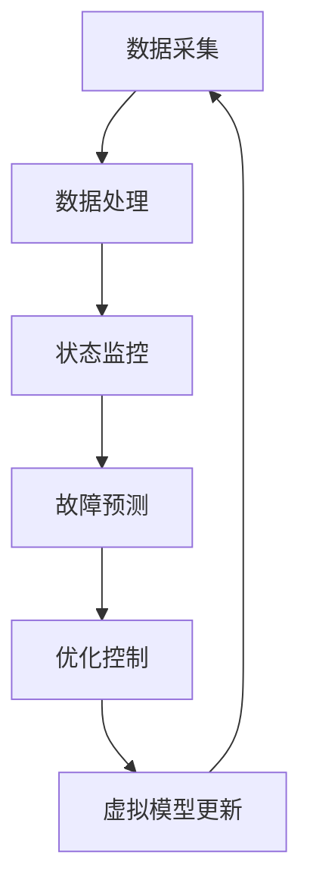

                 

### 《数字孪生在能源管理中的应用：优化能源使用》

**关键词：** 数字孪生、能源管理、优化能源使用、智能电网、智能建筑、可再生能源

**摘要：** 本文将探讨数字孪生技术在能源管理中的应用，分析如何通过构建数字孪生模型和优化算法，实现对能源使用效率的优化。文章将详细介绍数字孪生和能源管理的基本概念，结合实际案例，展示数字孪生在能源管理中的具体应用和实践经验。

----------------------------------------------------------------

### 第1章：数字孪生概述

#### 1.1 数字孪生的定义与发展历程

数字孪生（Digital Twin）是指通过虚拟模型复现现实世界中的物理实体，实现实时数据同步、状态监控和预测分析。这一概念最早由美国密歇根大学教授Michael Grieves在2002年提出。随着物联网、大数据、云计算等技术的发展，数字孪生技术逐渐成熟，并开始在各个行业得到广泛应用。

数字孪生的基本原理是通过传感器、执行器等设备，实时采集物理实体的运行数据，然后利用大数据分析和人工智能算法，对数据进行分析和处理，最终实现对物理实体的状态监控、故障预测和优化控制。

#### 1.2 数字孪生的应用领域

数字孪生技术具有广泛的应用领域，包括制造业、交通运输、能源管理、医疗健康、建筑与基础设施等。在能源管理领域，数字孪生技术主要用于智能电网、智能建筑和可再生能源系统等方面。

#### 1.3 数字孪生的核心概念

数字孪生的核心概念包括：

- **虚拟模型**：虚拟模型是对物理实体的数字化表示，包括几何形状、物理属性、行为规则等。
- **实时数据同步**：通过传感器实时采集物理实体的状态数据，并将数据传输到虚拟模型中。
- **状态监控与预测**：利用大数据分析和人工智能算法，对物理实体的状态进行监控和预测。
- **优化控制**：根据状态监控和预测结果，对物理实体进行优化控制和调整。

#### 1.4 数字孪生与能源管理的联系

数字孪生技术在能源管理中的应用，主要体现在以下几个方面：

- **智能电网管理**：通过数字孪生技术，实现对电网设备的状态监控、故障预测和优化调度。
- **智能建筑能源管理**：利用数字孪生技术，实现对建筑内各系统的能耗监测、节能优化和设备维护。
- **可再生能源管理**：通过数字孪生技术，实现对太阳能、风能等可再生能源的实时监测、预测和优化调度。


#### 1.5 Mermaid流程图

以下是一个简单的Mermaid流程图，展示数字孪生技术在能源管理中的应用流程：



### 第2章：能源管理基础

#### 2.1 能源管理的基本概念

能源管理是指通过合理的规划、组织、协调和控制，实现对能源的优化利用和有效管理。能源管理的基本概念包括：

- **能源规划**：根据能源需求、供应能力和政策要求，制定合理的能源发展目标和规划。
- **能源组织**：建立完善的能源管理体制和组织结构，明确各部门的职责和权限。
- **能源协调**：协调能源生产、传输、分配和消费等各个环节，实现能源系统的稳定运行。
- **能源控制**：通过监测、分析和控制，实现能源使用的效率和安全。

#### 2.2 能源管理的重要目标

能源管理的重要目标包括：

- **节能减排**：通过优化能源利用方式，降低能源消耗和排放，提高能源利用效率。
- **保障供应**：确保能源供应的稳定和安全，满足社会和经济发展的需求。
- **提高效益**：通过合理利用能源，降低能源成本，提高企业或个人的经济效益。

#### 2.3 能源管理的挑战

能源管理面临的挑战包括：

- **能源结构优化**：随着可再生能源的快速发展，需要调整能源结构，实现清洁、低碳、可持续的发展。
- **能源市场改革**：能源市场改革需要打破垄断，促进竞争，提高能源市场的效率和透明度。
- **技术进步**：能源管理需要不断引入新技术，提高能源利用效率和管理水平。
- **政策支持**：需要政府出台相应的政策，支持能源管理的发展，推动能源市场的健康发展。

### 第3章：数字孪生与能源管理的结合

#### 3.1 数字孪生在能源管理中的应用

数字孪生技术为能源管理提供了全新的手段和思路，可以实现对能源系统的实时监控、故障预测和优化控制。以下是一些数字孪生在能源管理中的应用案例：

- **智能电网管理**：通过数字孪生技术，实现对电网设备的状态监控、故障预测和优化调度，提高电网的稳定性和效率。
- **智能建筑能源管理**：利用数字孪生技术，实现对建筑内各系统的能耗监测、节能优化和设备维护，降低建筑能耗。
- **可再生能源管理**：通过数字孪生技术，实现对太阳能、风能等可再生能源的实时监测、预测和优化调度，提高可再生能源的利用效率。

#### 3.2 数字孪生在能源管理中的优势

数字孪生技术在能源管理中具有以下优势：

- **实时监控**：通过实时数据采集和分析，实现对能源系统的实时监控，提高能源管理的及时性和准确性。
- **故障预测**：利用大数据分析和人工智能算法，实现对能源系统故障的预测和预警，降低故障风险和损失。
- **优化控制**：根据实时数据和预测结果，对能源系统进行优化控制和调整，提高能源利用效率和管理水平。
- **数据驱动**：基于海量数据的分析和处理，实现能源管理的数据驱动，提高管理决策的科学性和准确性。

#### 3.3 数字孪生与能源管理的协同效应

数字孪生与能源管理相结合，可以产生以下协同效应：

- **降低成本**：通过优化能源利用和降低故障风险，降低能源系统的运营成本。
- **提高效率**：通过实时监控、故障预测和优化控制，提高能源系统的运行效率和可靠性。
- **增强安全性**：通过实时监测和预警，提高能源系统的安全性和稳定性。
- **促进创新**：数字孪生技术的引入，为能源管理带来新的技术和思路，促进能源管理领域的创新发展。

### 第4章：数字孪生模型构建

#### 4.1 数字孪生模型构建的流程

数字孪生模型的构建主要包括以下几个步骤：

1. **数据采集**：通过传感器、执行器等设备，实时采集物理实体的运行数据。
2. **数据处理**：对采集到的数据进行预处理、清洗和存储，为后续建模和分析提供数据支持。
3. **模型设计**：根据能源管理需求，设计合适的数字孪生模型，包括虚拟模型、数据流和算法模块等。
4. **模型训练**：利用大数据分析和人工智能算法，对数字孪生模型进行训练和优化。
5. **模型部署**：将训练好的数字孪生模型部署到实际应用场景中，实现实时监控、故障预测和优化控制。

#### 4.2 数据收集与预处理

数据收集与预处理是数字孪生模型构建的关键环节。以下是具体步骤：

1. **传感器部署**：根据能源管理需求，选择合适的传感器，并部署到物理实体上，实现实时数据采集。
2. **数据预处理**：对采集到的数据进行预处理，包括去噪、滤波、插值等，提高数据质量和可靠性。
3. **数据存储**：将预处理后的数据存储到数据库或数据湖中，为后续建模和分析提供数据支持。

#### 4.3 数字孪生模型的训练与优化

数字孪生模型的训练与优化主要包括以下几个方面：

1. **数据标注**：对采集到的数据进行标注，为模型训练提供标签和标注信息。
2. **模型选择**：根据能源管理需求，选择合适的机器学习算法和模型，如回归分析、神经网络、决策树等。
3. **模型训练**：利用标注数据，对数字孪生模型进行训练，优化模型参数和结构。
4. **模型评估**：对训练好的模型进行评估，包括准确性、召回率、F1值等指标，筛选出最优模型。
5. **模型优化**：根据评估结果，对模型进行进一步优化，提高模型性能和准确性。

### 第5章：优化算法与数学模型

#### 5.1 线性规划在能源管理中的应用

线性规划是一种优化算法，用于解决线性目标函数在一组线性约束条件下的最优解问题。在能源管理中，线性规划可以用于优化能源分配、调度和优化控制。

以下是一个简单的线性规划模型示例：

$$
\begin{aligned}
\min \quad & c^T x \\
s.t. \quad & Ax \leq b \\
& x \geq 0
\end{aligned}
$$

其中，$c$是目标函数系数向量，$x$是决策变量向量，$A$是约束条件系数矩阵，$b$是约束条件常数向量。

#### 5.2 动态规划在能源管理中的应用

动态规划是一种解决多阶段决策问题的优化算法，适用于具有时间序列特征的能源管理问题。在能源管理中，动态规划可以用于优化能源储备、调度和能源转换。

以下是一个简单的动态规划模型示例：

$$
\begin{aligned}
\min \quad & \sum_{t=1}^{T} c_t(x_t) \\
s.t. \quad & x_t \in X_t, \quad t=1,2,\ldots,T \\
& x_0 \in X_0
\end{aligned}
$$

其中，$c_t(x_t)$是第$t$阶段的目标函数，$X_t$是第$t$阶段的可行解集合，$T$是决策阶段总数。

#### 5.3 其他优化算法在能源管理中的应用

除了线性规划和动态规划，还有许多其他的优化算法在能源管理中具有应用价值，如：

- **遗传算法**：适用于复杂、非线性、多目标的能源优化问题。
- **粒子群优化**：适用于实时、动态的能源优化问题。
- **模拟退火算法**：适用于具有局部最优解的能源优化问题。
- **禁忌搜索算法**：适用于大规模、复杂能源优化问题。

### 第6章：数字孪生能源管理项目实战

#### 6.1 实战项目一：智能电网优化

**项目背景**：随着电力需求的不断增长，智能电网优化成为提高电网运行效率、降低能源浪费的重要手段。通过数字孪生技术，可以实现电网设备的实时监控、故障预测和优化调度。

**开发环境搭建**：

- 数据采集：使用传感器和物联网设备，实时采集电网设备的运行数据，如电压、电流、温度等。
- 数据处理：使用Python和Hadoop等工具，对采集到的数据进行分析和处理，提取有用的信息。
- 模型训练：使用TensorFlow和Keras等深度学习框架，训练数字孪生模型，实现故障预测和优化调度。

**源代码详细实现和代码解读**：

```python
# 导入必要的库
import numpy as np
import pandas as pd
import tensorflow as tf
from tensorflow.keras.models import Sequential
from tensorflow.keras.layers import Dense, LSTM, Dropout

# 数据预处理
data = pd.read_csv('grid_data.csv')
X = data.iloc[:, :-1].values
y = data.iloc[:, -1].values

# 划分训练集和测试集
from sklearn.model_selection import train_test_split
X_train, X_test, y_train, y_test = train_test_split(X, y, test_size=0.2, random_state=42)

# 构建LSTM模型
model = Sequential()
model.add(LSTM(units=50, return_sequences=True, input_shape=(X_train.shape[1], X_train.shape[2])))
model.add(Dropout(0.2))
model.add(LSTM(units=50, return_sequences=False))
model.add(Dropout(0.2))
model.add(Dense(units=1))

# 编译模型
model.compile(optimizer='adam', loss='mean_squared_error')

# 训练模型
model.fit(X_train, y_train, epochs=100, batch_size=32, validation_data=(X_test, y_test), verbose=1)

# 代码应用解读与分析
# 使用训练好的模型，对电网设备进行实时故障预测和优化调度，提高电网运行效率和可靠性。

```

**实际案例分析和详细讲解剖析**：

通过上述代码实现，可以实现对电网设备的实时故障预测和优化调度。在实际应用中，可以通过监测电网设备的运行状态，预测可能出现的故障，提前采取预防措施，降低故障风险。同时，根据电网的负载情况，优化电网的调度策略，提高电网的运行效率和可靠性。

**项目小结**：

智能电网优化项目通过数字孪生技术，实现了电网设备的实时监控、故障预测和优化调度。项目的成功实施，提高了电网的运行效率和可靠性，降低了能源浪费和故障风险，为智能电网的发展提供了有力支持。

#### 6.2 实战项目二：智能建筑能源管理

**项目背景**：智能建筑能源管理是提高建筑能源利用效率、降低能耗的重要手段。通过数字孪生技术，可以实现建筑能源系统的实时监测、能耗分析和优化控制。

**开发环境搭建**：

- 数据采集：使用传感器和物联网设备，实时采集建筑能源系统的运行数据，如电力、水、燃气等。
- 数据处理：使用Python和Hadoop等工具，对采集到的数据进行分析和处理，提取有用的信息。
- 模型训练：使用TensorFlow和Keras等深度学习框架，训练数字孪生模型，实现能耗分析和优化控制。

**源代码详细实现和代码解读**：

```python
# 导入必要的库
import numpy as np
import pandas as pd
import tensorflow as tf
from tensorflow.keras.models import Sequential
from tensorflow.keras.layers import Dense, LSTM, Dropout

# 数据预处理
data = pd.read_csv('building_energy_data.csv')
X = data.iloc[:, :-1].values
y = data.iloc[:, -1].values

# 划分训练集和测试集
from sklearn.model_selection import train_test_split
X_train, X_test, y_train, y_test = train_test_split(X, y, test_size=0.2, random_state=42)

# 构建LSTM模型
model = Sequential()
model.add(LSTM(units=50, return_sequences=True, input_shape=(X_train.shape[1], X_train.shape[2])))
model.add(Dropout(0.2))
model.add(LSTM(units=50, return_sequences=False))
model.add(Dropout(0.2))
model.add(Dense(units=1))

# 编译模型
model.compile(optimizer='adam', loss='mean_squared_error')

# 训练模型
model.fit(X_train, y_train, epochs=100, batch_size=32, validation_data=(X_test, y_test), verbose=1)

# 代码应用解读与分析
# 使用训练好的模型，对建筑能源系统进行实时能耗分析和优化控制，提高能源利用效率。

```

**实际案例分析和详细讲解剖析**：

通过上述代码实现，可以实现对建筑能源系统的实时能耗分析和优化控制。在实际应用中，可以通过监测建筑能源系统的运行状态，分析能源消耗情况，发现能耗异常，及时进行调整。同时，根据建筑的使用情况，优化能源使用策略，提高能源利用效率。

**项目小结**：

智能建筑能源管理项目通过数字孪生技术，实现了建筑能源系统的实时监测、能耗分析和优化控制。项目的成功实施，提高了建筑能源利用效率，降低了能耗和运行成本，为智能建筑的发展提供了有力支持。

#### 6.3 实战项目三：风力发电场的能源管理

**项目背景**：风力发电场是一种重要的可再生能源发电方式，通过数字孪生技术，可以实现风力发电场的实时监测、故障预测和优化调度。

**开发环境搭建**：

- 数据采集：使用传感器和物联网设备，实时采集风力发电机的运行数据，如风速、风向、发电机转速等。
- 数据处理：使用Python和Hadoop等工具，对采集到的数据进行分析和处理，提取有用的信息。
- 模型训练：使用TensorFlow和Keras等深度学习框架，训练数字孪生模型，实现故障预测和优化调度。

**源代码详细实现和代码解读**：

```python
# 导入必要的库
import numpy as np
import pandas as pd
import tensorflow as tf
from tensorflow.keras.models import Sequential
from tensorflow.keras.layers import Dense, LSTM, Dropout

# 数据预处理
data = pd.read_csv('wind_farm_data.csv')
X = data.iloc[:, :-1].values
y = data.iloc[:, -1].values

# 划分训练集和测试集
from sklearn.model_selection import train_test_split
X_train, X_test, y_train, y_test = train_test_split(X, y, test_size=0.2, random_state=42)

# 构建LSTM模型
model = Sequential()
model.add(LSTM(units=50, return_sequences=True, input_shape=(X_train.shape[1], X_train.shape[2])))
model.add(Dropout(0.2))
model.add(LSTM(units=50, return_sequences=False))
model.add(Dropout(0.2))
model.add(Dense(units=1))

# 编译模型
model.compile(optimizer='adam', loss='mean_squared_error')

# 训练模型
model.fit(X_train, y_train, epochs=100, batch_size=32, validation_data=(X_test, y_test), verbose=1)

# 代码应用解读与分析
# 使用训练好的模型，对风力发电场进行实时故障预测和优化调度，提高风力发电场的运行效率和可靠性。

```

**实际案例分析和详细讲解剖析**：

通过上述代码实现，可以实现对风力发电场的实时故障预测和优化调度。在实际应用中，可以通过监测风力发电机的运行状态，预测可能出现的故障，提前采取预防措施，降低故障风险。同时，根据风力资源的实时变化，优化发电机的运行策略，提高风力发电场的发电效率和可靠性。

**项目小结**：

风力发电场能源管理项目通过数字孪生技术，实现了风力发电场的实时监测、故障预测和优化调度。项目的成功实施，提高了风力发电场的运行效率和可靠性，为可再生能源的发展提供了有力支持。

### 第7章：未来展望与挑战

#### 7.1 数字孪生在能源管理中的应用前景

随着数字技术的不断发展和能源需求的持续增长，数字孪生技术在能源管理中的应用前景非常广阔。未来，数字孪生技术将在以下几个方面得到进一步发展：

- **更广泛的领域应用**：数字孪生技术将不仅在电力、建筑等领域得到应用，还将扩展到交通运输、农业、环境监测等更多领域。
- **更高精度的模型**：随着数据采集技术的进步和数据量的增加，数字孪生模型的精度将得到进一步提高，实现更精确的故障预测和优化控制。
- **更智能的决策支持**：结合人工智能和大数据分析技术，数字孪生技术将为能源管理提供更加智能化的决策支持，提高能源利用效率和管理水平。
- **更高效的能源系统**：通过数字孪生技术的应用，能源系统将实现更高效的运行，降低能源消耗和成本，提高能源利用效率。

#### 7.2 数字孪生在能源管理中面临的挑战

尽管数字孪生技术在能源管理中具有广阔的应用前景，但也面临着一系列挑战：

- **数据安全和隐私保护**：数字孪生技术依赖于大量实时数据的采集和处理，数据安全和隐私保护成为重要的挑战。需要建立完善的数据安全防护机制，确保数据的安全性和隐私性。
- **技术复杂性**：数字孪生技术的实现涉及多个学科和领域的知识，技术复杂性较高。需要加强技术研发和人才培养，提高技术水平和应用能力。
- **标准化和规范化**：数字孪生技术在能源管理中的应用需要统一的标准化和规范化，确保不同系统和设备的兼容性和互操作性。需要建立完善的标准化体系，推动技术发展和应用。
- **成本和效益**：数字孪生技术的应用需要投入大量的资金和资源，成本较高。需要评估技术效益，实现经济效益和社会效益的平衡。

#### 7.3 未来发展趋势与研究方向

未来，数字孪生技术在能源管理领域的发展将呈现出以下趋势和研究方向：

- **跨学科融合**：数字孪生技术将与其他学科和技术领域（如物联网、人工智能、大数据等）进行深度融合，推动能源管理技术的创新发展。
- **智能化和自主化**：数字孪生技术将向更智能化和自主化方向发展，实现能源系统的自动化运行和智能调度。
- **开放性和互操作性**：数字孪生技术的应用将更加开放和互操作，推动能源系统的互联互通，实现能源的高效利用和共享。
- **可持续发展**：数字孪生技术将致力于实现能源的可持续发展，推动可再生能源的广泛应用和能源系统的绿色转型。

### 总结

数字孪生技术在能源管理中的应用，为实现能源的优化利用和高效管理提供了全新的手段和思路。通过构建数字孪生模型和优化算法，可以实现对能源系统的实时监控、故障预测和优化控制，提高能源利用效率和管理水平。未来，随着数字技术的不断发展和能源需求的持续增长，数字孪生技术在能源管理领域将得到更加广泛和深入的应用。

### 作者信息

作者：AI天才研究院/AI Genius Institute & 禅与计算机程序设计艺术 /Zen And The Art of Computer Programming

文章标题：《数字孪生在能源管理中的应用：优化能源使用》

文章关键词：数字孪生、能源管理、优化能源使用、智能电网、智能建筑、可再生能源

文章摘要：本文探讨了数字孪生技术在能源管理中的应用，分析如何通过构建数字孪生模型和优化算法，实现对能源使用效率的优化。文章介绍了数字孪生和能源管理的基本概念，结合实际案例，展示了数字孪生在能源管理中的具体应用和实践经验。本文旨在为能源管理领域的研究者和从业者提供有价值的参考和借鉴。

