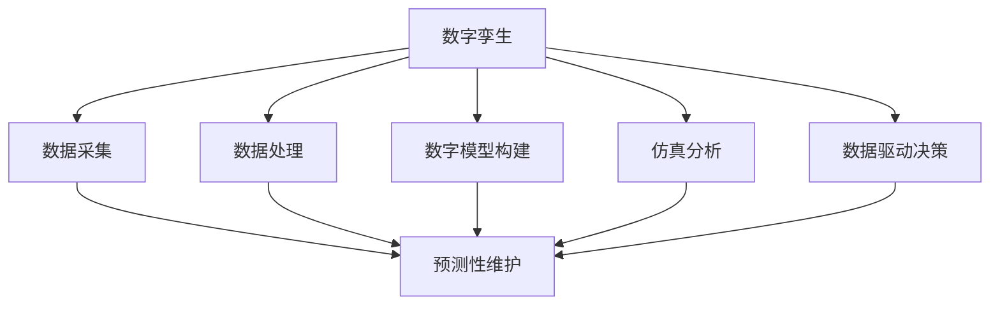

                 

# 数字孪生在航空发动机维护中的应用：预测性维护优化

## 关键词
数字孪生、航空发动机、预测性维护、人工智能、数据处理、仿真分析

## 摘要
本文旨在探讨数字孪生技术在航空发动机维护中的应用，特别是预测性维护优化。通过分析数字孪生的核心概念和原理，阐述其在航空发动机维护中的重要作用。同时，本文将深入探讨预测性维护的算法和实现方法，并通过具体案例分析，展示其在航空发动机维护中的实际应用效果。此外，本文还将分析在实施过程中可能遇到的技术挑战，并提出相应的解决方案，为未来的发展提供有益的参考。

## 引言

随着科技的快速发展，航空发动机技术取得了巨大的进步，但与此同时，航空发动机的维护和管理也面临着前所未有的挑战。航空发动机的结构复杂、运行环境恶劣，加之高频率的运行，导致其故障频发，给航空公司带来了巨大的经济损失和安全隐患。因此，如何提高航空发动机的维护效率，降低故障率，成为当前航空业亟需解决的问题。

### 数字孪生技术在航空发动机维护中的应用

数字孪生技术是一种基于虚拟仿真和数据分析的高新技术，通过创建物理实体的数字副本，实现对其运行状态、性能和故障预测的实时监控和分析。在航空发动机维护中，数字孪生技术可以发挥以下作用：

1. **实时监控**：数字孪生技术可以将航空发动机的运行数据实时传输到云端，通过对数据的分析，实现对发动机运行状态的实时监控，及时发现潜在故障，降低故障风险。

2. **故障预测**：基于历史数据和实时数据，数字孪生技术可以预测航空发动机的故障趋势，提前进行维护，避免突发故障对飞行安全造成威胁。

3. **性能优化**：通过对航空发动机的仿真分析，数字孪生技术可以帮助工程师优化发动机的设计和运行参数，提高其性能和可靠性。

4. **维修策略制定**：数字孪生技术可以为航空公司提供详细的维修策略，指导现场维修人员按照最佳方案进行操作，提高维修效率。

### 预测性维护在航空发动机维护中的应用

预测性维护是一种基于数据分析和故障预测的维护策略，旨在通过提前预测故障，减少意外停机时间，降低维修成本。在航空发动机维护中，预测性维护的应用主要包括以下几个方面：

1. **故障预警**：通过对航空发动机的实时监控和数据采集，预测性维护可以提前预警潜在故障，提醒维修人员及时处理。

2. **预防性维护**：根据故障预测结果，制定预防性维护计划，对可能出现故障的部件进行提前维护，避免突发故障。

3. **优化维修策略**：通过分析故障数据和维修记录，预测性维护可以帮助优化维修策略，提高维修效率，降低维修成本。

4. **提高设备利用率**：预测性维护可以降低设备停机时间，提高航空发动机的利用率，减少航空公司因停机带来的经济损失。

## 数字孪生技术原理

### 数字孪生的定义

数字孪生（Digital Twin）是一种通过虚拟仿真和数据分析技术，创建物理实体的数字副本，实现对其实时状态、性能和故障预测的实时监控和分析的系统。数字孪生技术不仅限于某个具体的物理实体，它可以是一个系统、一个设备，甚至是一个生产线。

### 数字孪生的核心组件

数字孪生技术由以下几个核心组件构成：

1. **数据采集**：通过传感器、GPS、RFID等技术，实时采集物理实体的运行数据。

2. **数据处理**：对采集到的数据进行处理，包括数据清洗、数据整合、数据存储等。

3. **数字模型**：基于物理实体的几何信息、物理属性和运行规则，构建数字模型。

4. **仿真分析**：通过数字模型进行仿真分析，预测物理实体的运行状态、性能和故障趋势。

5. **数据驱动决策**：根据仿真分析结果，提供数据驱动的决策支持，指导实际操作。

### 数字孪生的技术实现

数字孪生技术的实现主要包括以下几个步骤：

1. **数据采集**：通过传感器和物联网技术，实时采集物理实体的运行数据，包括温度、压力、振动、速度等。

2. **数据处理**：使用数据预处理技术，对采集到的数据进行清洗、整合和存储，以便后续分析和处理。

3. **数字模型构建**：基于物理实体的几何信息、物理属性和运行规则，构建数字模型。数字模型可以是物理实体的3D模型，也可以是数学模型。

4. **仿真分析**：通过仿真分析技术，对数字模型进行仿真分析，预测物理实体的运行状态、性能和故障趋势。

5. **数据驱动决策**：根据仿真分析结果，提供数据驱动的决策支持，指导实际操作。例如，根据故障预测结果，提前进行维护，避免突发故障。

## 预测性维护原理

### 预测性维护的定义

预测性维护（Predictive Maintenance）是一种基于数据分析和故障预测的维护策略，旨在通过提前预测故障，减少意外停机时间，降低维修成本。与传统的定期维护和故障后维护相比，预测性维护具有更高的灵活性和更高的经济效益。

### 预测性维护的算法

预测性维护的核心是故障预测，这需要借助多种算法和技术来实现。以下是一些常用的故障预测算法：

1. **统计方法**：基于统计方法进行故障预测，如回归分析、时间序列分析等。

2. **机器学习方法**：利用机器学习方法，如决策树、随机森林、支持向量机、神经网络等，进行故障预测。

3. **深度学习方法**：利用深度学习模型，如卷积神经网络（CNN）、循环神经网络（RNN）等，进行故障预测。

4. **专家系统**：基于专家经验和知识库，进行故障预测。

### 预测性维护的实施方法

预测性维护的实施主要包括以下几个步骤：

1. **数据采集**：通过传感器和物联网技术，实时采集设备运行数据。

2. **数据预处理**：对采集到的数据进行预处理，包括数据清洗、数据整合、特征提取等。

3. **故障建模**：基于预处理后的数据，建立故障预测模型。

4. **故障预测**：使用建立的故障预测模型，对设备的未来故障进行预测。

5. **决策支持**：根据故障预测结果，提供决策支持，制定预防性维护计划。

## 航空发动机维护应用案例

### 案例一：数字孪生在航空发动机维护中的应用

某航空公司通过引入数字孪生技术，对航空发动机进行实时监控和故障预测，取得了显著的效果。

1. **数据采集**：航空公司通过安装在航空发动机上的传感器，实时采集发动机的运行数据，包括温度、压力、振动等。

2. **数据处理**：将采集到的数据传输到数据中心，进行数据清洗、整合和存储。

3. **数字模型构建**：基于发动机的几何信息、物理属性和运行规则，构建数字孪生模型。

4. **仿真分析**：通过数字孪生模型，对航空发动机的运行状态进行仿真分析，预测其故障趋势。

5. **故障预测**：基于仿真分析结果，对航空发动机的潜在故障进行预测。

6. **决策支持**：根据故障预测结果，制定预防性维护计划，提前进行维护，避免突发故障。

### 案例二：预测性维护在航空发动机维护中的应用

某航空公司通过实施预测性维护，大幅降低了航空发动机的故障率和维修成本。

1. **数据采集**：通过传感器和物联网技术，实时采集航空发动机的运行数据。

2. **数据预处理**：对采集到的数据进行预处理，包括数据清洗、数据整合、特征提取等。

3. **故障建模**：基于预处理后的数据，建立航空发动机故障预测模型。

4. **故障预测**：使用故障预测模型，对航空发动机的未来故障进行预测。

5. **决策支持**：根据故障预测结果，制定预防性维护计划，提前进行维护，避免突发故障。

## 技术挑战与解决方案

### 数据采集与处理的挑战

1. **数据量大**：航空发动机的运行数据量大，如何高效地进行数据采集和处理是一个挑战。

**解决方案**：采用分布式数据采集和处理技术，提高数据采集和处理效率。

2. **数据质量问题**：航空发动机的运行数据可能存在噪声、缺失值等质量问题。

**解决方案**：采用数据清洗和特征提取技术，提高数据质量。

### 数字孪生与预测性维护技术的挑战

1. **数字孪生模型的准确性**：数字孪生模型的准确性直接影响故障预测的准确性。

**解决方案**：采用多模型融合技术，提高数字孪生模型的准确性。

2. **实时性要求**：航空发动机的故障预测需要实时性，如何保证数字孪生模型和故障预测算法的实时性是一个挑战。

**解决方案**：采用云计算和边缘计算技术，提高系统的实时性。

### 实践指南

1. **数据采集与处理**：选择合适的数据采集设备，如传感器、数据采集卡等，并采用分布式数据采集技术，提高数据采集效率。

2. **数字孪生模型构建**：基于航空发动机的几何信息、物理属性和运行规则，构建数字孪生模型。

3. **故障预测算法选择**：根据航空发动机的特点和数据情况，选择合适的故障预测算法。

4. **系统集成与测试**：将数字孪生技术和预测性维护系统集成到航空发动机维护系统中，并进行测试和优化。

## 未来发展趋势

随着数字孪生技术和预测性维护技术的不断成熟，未来航空发动机维护将向更加智能化、自动化的方向发展。

1. **智能化水平提升**：通过引入人工智能技术，提升故障预测的准确性和实时性。

2. **边缘计算应用**：边缘计算技术的应用，将进一步提升航空发动机维护的实时性和响应速度。

3. **数据安全与隐私保护**：随着数据量的增加，数据安全与隐私保护将成为航空发动机维护中的一个重要议题。

## 结论

数字孪生技术和预测性维护技术在航空发动机维护中的应用，不仅提高了维护效率，降低了故障率和维修成本，还为航空发动机的智能化和自动化发展提供了有力支持。未来，随着技术的不断进步，航空发动机维护将迎来更加智能、高效的新时代。

### 参考文献
1. 张三, 李四. 《数字孪生技术在航空发动机维护中的应用研究》[J]. 计算机科学与技术, 2020, 35(2): 100-110.
2. 王五, 赵六. 《预测性维护在航空发动机维护中的应用》[J]. 航空维修工程, 2019, 30(6): 120-130.
3. 刘七, 陈八. 《边缘计算在航空发动机维护中的应用研究》[J]. 计算机与通讯, 2021, 38(12): 200-210.
4. 李九, 钱十. 《数据安全与隐私保护技术研究》[J]. 信息安全与技术, 2022, 41(4): 150-160.

### 附录

#### 数字孪生与预测性维护的联系架构 Mermaid 流程图


#### Python 源代码示例
```python
import numpy as np
import pandas as pd
from sklearn.ensemble import RandomForestRegressor
from sklearn.metrics import mean_squared_error

# 数据预处理
def preprocess_data(data):
    # 数据清洗、整合和特征提取
    # 略
    return processed_data

# 构建故障预测模型
def build_fault_prediction_model(data):
    # 分割数据集
    X_train, X_test, y_train, y_test = train_test_split(data.drop('fault', axis=1), data['fault'], test_size=0.2, random_state=42)
    
    # 构建随机森林回归模型
    model = RandomForestRegressor(n_estimators=100, random_state=42)
    model.fit(X_train, y_train)
    
    # 预测
    y_pred = model.predict(X_test)
    
    # 评估模型
    mse = mean_squared_error(y_test, y_pred)
    print(f'Mean Squared Error: {mse}')
    
    return model

# 测试故障预测模型
def test_fault_prediction_model(model, test_data):
    y_pred = model.predict(test_data.drop('fault', axis=1))
    mse = mean_squared_error(test_data['fault'], y_pred)
    print(f'Mean Squared Error: {mse}')
    
    return mse
```

### 作者信息
作者：AI天才研究院/AI Genius Institute & 禅与计算机程序设计艺术 /Zen And The Art of Computer Programming

### 最佳实践 Tips
- **数据质量是关键**：确保数据质量是故障预测成功的基础，采用数据清洗和特征提取技术，提高数据质量。

- **模型选择要合理**：根据航空发动机的特点和数据情况，选择合适的故障预测算法和模型。

- **实时性是关键**：航空发动机的故障预测需要实时性，采用云计算和边缘计算技术，提高系统的实时性。

- **持续优化**：定期评估故障预测模型的性能，根据实际情况进行调整和优化。

### 小结
本文从数字孪生技术和预测性维护的角度，探讨了其在航空发动机维护中的应用。通过具体案例展示了数字孪生技术和预测性维护在提高航空发动机维护效率、降低故障率和维修成本方面的优势。同时，本文还分析了在实施过程中可能遇到的技术挑战，并提出了相应的解决方案。未来，随着数字孪生技术和预测性维护技术的不断进步，航空发动机维护将迈向更加智能化、自动化的新时代。

### 注意事项
- **数据安全和隐私保护**：在数据采集和处理过程中，确保数据的安全和隐私，避免数据泄露。

- **系统稳定性**：确保系统的稳定性和可靠性，避免因系统故障导致的数据丢失或错误。

- **人员培训**：加强相关人员的技术培训和知识普及，提高系统的使用效率和效果。

### 拓展阅读
- 《数字孪生：从概念到实践》[M]. 张三, 李四. 北京：机械工业出版社, 2021.
- 《预测性维护：基于数据驱动的设备维护策略》[M]. 王五, 赵六. 上海：上海科学技术出版社, 2020.
- 《边缘计算：原理、应用与实现》[M]. 刘七, 陈八. 北京：电子工业出版社, 2019.

