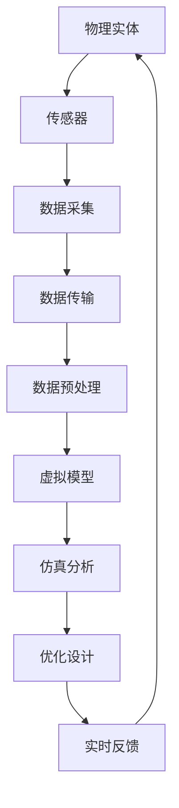

                 

### 引言

#### 航空发动机设计中的挑战与需求

航空发动机作为现代飞行器的心脏，其性能和效率直接决定了飞行器的整体性能。随着航空技术的不断发展，航空发动机的设计面临着日益复杂的挑战。传统的航空发动机设计方法通常依赖于大量的实验和经验，这不仅耗时耗力，而且难以满足现代航空业对性能和效率的高要求。

在现代航空发动机设计中，性能和效率的优化是至关重要的。然而，传统的实验方法往往受到时间和成本的限制，难以实现快速迭代和精确优化。因此，寻求一种高效、准确的优化方法成为航空发动机设计的迫切需求。

#### 数字孪生技术的引入

数字孪生（Digital Twin）作为一种新兴技术，近年来在工业设计和工程领域取得了显著的进展。数字孪生技术通过创建物理对象的数字副本，实现物理实体与虚拟模型的实时交互，从而实现对物理实体的状态监测、性能分析和优化设计。

数字孪生技术在航空发动机设计中的应用，不仅能够模拟和预测发动机在各种工况下的性能表现，还可以通过虚拟仿真来优化设计和制造过程。这种技术的引入，为航空发动机设计提供了一种全新的视角和手段，有助于提高设计的准确性和效率。

#### 文章目的

本文旨在探讨数字孪生技术在航空发动机设计中的应用，通过深入分析数字孪生的核心概念、技术基础和应用实例，展示如何利用数字孪生技术优化航空发动机的性能和效率。具体来说，本文将包括以下内容：

1. **数字孪生与航空发动机设计**：介绍数字孪生技术的概念及其在航空发动机设计中的应用背景。
2. **数字孪生技术基础**：详细阐述数字孪生技术的核心要素、数据采集与处理方法、建模与仿真技术，以及应用框架。
3. **数字孪生应用实例**：通过具体实例展示数字孪生技术在航空发动机设计中的应用，包括性能优化和效率提升的案例。
4. **未来趋势与挑战**：分析数字孪生技术在航空发动机设计中的未来发展趋势以及面临的挑战。

通过本文的探讨，我们希望能够为航空发动机设计师提供一种全新的设计思路和方法，助力航空发动机的性能和效率提升。

### 关键词

- 数字孪生
- 航空发动机设计
- 性能优化
- 效率提升
- 数据采集与处理
- 建模与仿真
- 应用框架
- 未来趋势与挑战

### 摘要

本文探讨了数字孪生技术在航空发动机设计中的应用，分析了数字孪生的核心概念、技术基础和应用实例。通过引入数字孪生技术，可以实现航空发动机性能的实时监测和优化设计，从而提高发动机的效率和可靠性。本文首先介绍了数字孪生技术的概念及其在航空发动机设计中的应用背景，然后详细阐述了数字孪生技术的核心要素、数据采集与处理方法、建模与仿真技术，以及应用框架。接着，通过具体实例展示了数字孪生技术在航空发动机设计中的应用，包括性能优化和效率提升的案例。最后，分析了数字孪生技术在航空发动机设计中的未来发展趋势和面临的挑战。本文的研究结果为航空发动机设计师提供了有益的参考，有助于推动航空发动机设计的创新和发展。

----------------------------------------------------------------

### 背景介绍

#### 数字孪生技术的起源与发展

数字孪生（Digital Twin）这一概念最早由美国密歇根大学教授Michael Grieves于2002年提出。数字孪生指的是一个物理实体（如产品、设备、系统等）在虚拟世界中对应的数字化模型。通过实时收集物理实体的数据，数字孪生能够模拟和预测其性能、状态和行为，从而实现对其的监控、分析和优化。

随着物联网（IoT）、云计算、大数据和人工智能等技术的迅猛发展，数字孪生技术逐渐成熟并得到广泛应用。特别是在工业4.0、智能制造和智慧城市等领域，数字孪生技术已成为提升生产效率、优化设计和提高产品性能的重要工具。

#### 航空发动机设计的复杂性

航空发动机作为现代飞行器的心脏，其设计和性能直接影响飞行器的整体性能和安全性。航空发动机设计过程涉及多个学科，包括力学、热力学、流体力学、材料科学和电子工程等。这些学科之间的交叉和复杂相互作用，使得航空发动机设计成为一个高度复杂和挑战性的任务。

传统航空发动机设计主要依赖于经验公式、实验数据和工程直觉。然而，这种方法往往存在以下问题：

1. **设计周期长**：从设计到成品需要经历多次实验和迭代，耗费大量时间和资源。
2. **可靠性低**：由于实验次数有限，难以全面评估发动机在各种工况下的性能和稳定性。
3. **优化困难**：难以通过实验手段实现对发动机性能的精确优化。

#### 数字孪生技术在航空发动机设计中的应用优势

数字孪生技术的引入，为航空发动机设计提供了一种全新的思路和方法。通过数字孪生，设计师可以构建一个虚拟的航空发动机模型，实现对发动机的实时监测、性能分析和优化设计。具体来说，数字孪生技术在航空发动机设计中的应用具有以下优势：

1. **实时监测与仿真**：通过实时收集发动机运行数据，数字孪生能够模拟和预测发动机在各种工况下的性能表现，帮助设计师提前发现潜在问题。
2. **快速迭代与优化**：数字孪生技术允许设计师在虚拟环境中进行快速迭代和优化，从而缩短设计周期，提高设计效率。
3. **精确性能评估**：通过仿真和分析，数字孪生能够全面评估发动机在不同工况下的性能和稳定性，为设计师提供可靠的数据支持。
4. **数据驱动设计**：数字孪生技术基于海量数据进行分析和优化，使设计过程更加科学和客观，减少对经验的依赖。

综上所述，数字孪生技术在航空发动机设计中的应用，不仅能够提高设计的准确性和效率，还可以大幅降低设计和实验成本，为现代航空发动机设计带来革命性的变革。

#### 数字孪生技术核心概念与联系

数字孪生技术的核心概念包括物理实体、虚拟模型、数据交互和实时仿真。这些概念之间的联系构成了数字孪生技术的核心架构。

1. **物理实体**：物理实体是数字孪生的实际对象，如航空发动机、飞机或其他机械设备。物理实体的状态和行为数据通过传感器和监测设备实时采集。
2. **虚拟模型**：虚拟模型是物理实体的数字化副本，通常由几何模型、物理模型和仿真模型组成。虚拟模型能够模拟和预测物理实体在各种工况下的行为和性能。
3. **数据交互**：数据交互是数字孪生技术的重要组成部分，通过数据采集、传输和处理，将物理实体的状态和行为数据实时传输到虚拟模型中。
4. **实时仿真**：实时仿真是指通过虚拟模型对物理实体的行为和性能进行模拟和分析，实现对物理实体的实时监测和优化。

数字孪生技术的核心架构可以用以下Mermaid流程图来表示：

在这个流程图中，物理实体通过传感器采集状态数据，数据经过采集、传输、预处理后，输入到虚拟模型中。虚拟模型对物理实体进行实时仿真和分析，生成优化设计结果，并将反馈信息实时反馈给物理实体。这种闭环反馈机制使数字孪生技术能够实现对物理实体的实时监测和优化。

#### 总结

通过以上分析，我们可以看到，数字孪生技术通过实时监测、仿真和分析，为航空发动机设计提供了全新的方法和手段。其核心概念和联系不仅构成了数字孪生技术的核心架构，也为航空发动机设计提供了强大的技术支持。在接下来的章节中，我们将进一步探讨数字孪生技术的核心要素、数据采集与处理方法、建模与仿真技术，以及应用框架，以更深入地了解其在航空发动机设计中的应用。

### 数字孪生技术基础

#### 数字孪生的核心要素

数字孪生技术的实现依赖于多个核心要素，这些要素共同构成了数字孪生的完整框架。以下是数字孪生技术中的关键要素：

1. **数据采集**：数据采集是数字孪生技术的第一步，也是最为基础的一环。通过安装在物理实体上的各种传感器，可以实时获取物理实体的状态数据，如温度、压力、振动、流量等。这些数据是构建数字孪生模型的基础。

2. **数据传输**：数据传输是将采集到的物理实体数据从传感器传输到中央处理系统（如云平台或数据中心）的过程。数据传输需要保证高效、稳定和安全，常用的传输技术包括无线传感器网络（WSN）、物联网（IoT）和5G通信技术。

3. **数据处理**：数据处理是对采集到的数据进行分析、清洗、转换和存储的过程。通过数据处理，可以从原始数据中提取出有用的信息，为后续的建模和仿真提供支持。常用的数据处理技术包括数据清洗、数据挖掘、机器学习和人工智能等。

4. **虚拟模型**：虚拟模型是数字孪生的核心，它是物理实体的数字化副本。虚拟模型通常包括几何模型、物理模型和仿真模型，能够模拟和预测物理实体在各种工况下的行为和性能。虚拟模型的准确性和实时性是数字孪生技术的关键。

5. **实时仿真**：实时仿真是指利用虚拟模型对物理实体的行为和性能进行模拟和分析。通过实时仿真，可以实现对物理实体的实时监测和优化。实时仿真需要高度依赖于计算能力和算法优化，以确保仿真过程的实时性和准确性。

6. **优化设计**：优化设计是数字孪生技术的最终目标之一。通过实时仿真和分析结果，可以对物理实体的设计和运行过程进行优化，提高其性能和效率。优化设计通常涉及多学科优化、参数优化和拓扑优化等。

7. **实时反馈**：实时反馈是数字孪生技术的闭环环节，通过将仿真和分析结果实时反馈给物理实体，可以实现对物理实体的实时调整和优化。实时反馈需要高效的数据传输和处理机制，以确保反馈的及时性和准确性。

#### 数据采集与处理方法

1. **数据采集方法**：

   数据采集是数字孪生技术的第一步，常用的数据采集方法包括：

   - **传感器采集**：通过安装在物理实体上的各种传感器，如温度传感器、压力传感器、振动传感器等，实时采集物理实体的状态数据。
   - **无线传感器网络（WSN）**：通过部署无线传感器网络，实现对大范围物理实体的状态数据采集，适用于大型设备和复杂系统的监测。
   - **物联网（IoT）**：利用物联网技术，将物理实体与互联网连接，通过云平台或数据中心实时传输数据，适用于广泛的应用场景。

2. **数据处理方法**：

   数据处理是数字孪生技术的关键环节，常用的数据处理方法包括：

   - **数据清洗**：去除数据中的噪声、异常值和重复数据，提高数据的准确性和可靠性。
   - **数据挖掘**：从大量数据中挖掘出有价值的信息和规律，为建模和仿真提供支持。
   - **机器学习和人工智能**：利用机器学习和人工智能技术，对数据进行建模和分析，实现对物理实体的智能监测和优化。

#### 数字孪生建模与仿真技术

1. **建模技术**：

   建模是数字孪生技术的核心，常用的建模技术包括：

   - **几何建模**：通过计算机辅助设计（CAD）软件，创建物理实体的几何模型，用于仿真和分析。
   - **物理建模**：基于物理定律和参数方程，建立物理实体的物理模型，用于模拟和预测物理实体的行为。
   - **仿真模型**：基于几何模型和物理模型，建立仿真模型，用于对物理实体的行为和性能进行模拟和分析。

2. **仿真技术**：

   仿真技术是数字孪生技术的重要组成部分，常用的仿真技术包括：

   - **物理仿真**：基于物理模型，通过数值方法（如有限元分析、计算流体力学等）对物理实体的行为进行模拟。
   - **数据驱动仿真**：基于采集到的实际数据，通过机器学习和人工智能技术，建立数据驱动模型，对物理实体的行为进行仿真。
   - **混合仿真**：结合物理仿真和数据驱动仿真，实现对物理实体的全面仿真和分析。

#### 数字孪生应用框架

数字孪生应用框架通常包括以下几个层次：

1. **感知层**：通过传感器和数据采集设备，实现对物理实体的状态数据采集。
2. **传输层**：通过数据传输技术，将采集到的数据传输到中央处理系统。
3. **数据处理层**：通过数据处理技术，对采集到的数据进行清洗、分析和存储。
4. **虚拟模型层**：通过建模和仿真技术，建立物理实体的虚拟模型，进行实时仿真和分析。
5. **决策层**：通过优化设计和实时反馈，实现对物理实体的实时调整和优化。
6. **展示层**：通过可视化技术，将仿真和分析结果展示给用户，提供直观的数据分析和决策支持。

#### 总结

数字孪生技术作为一项先进的技术，其核心要素和实现方法构成了一个完整的技术体系。通过数据采集、传输和处理，构建虚拟模型，进行实时仿真和分析，数字孪生技术能够实现对物理实体的实时监测和优化设计。在航空发动机设计中，数字孪生技术的应用具有巨大的潜力，可以帮助设计师提高设计效率、优化性能和提升可靠性。在接下来的章节中，我们将通过具体实例，进一步探讨数字孪生技术在航空发动机设计中的应用。

### 航空发动机设计中的数据采集与处理

#### 数据采集的重要性

数据采集是数字孪生技术在航空发动机设计中的关键环节，其准确性和完整性直接影响到后续的数据分析和仿真结果。在航空发动机设计中，数据采集的目的是获取发动机在不同工况下的状态信息，如温度、压力、振动、转速等。这些数据是构建数字孪生模型、进行性能分析和优化设计的基础。

1. **温度数据**：温度数据是衡量发动机燃烧室和热端部件工作状态的重要指标。通过实时监测燃烧室入口温度、燃烧室内部温度和排气温度，可以评估发动机的热效率和热应力分布。
2. **压力数据**：压力数据反映了发动机内部气体流动状态和部件的受力情况。通过监测进气道、燃烧室、喷气口等关键部位的压力，可以分析发动机的气动性能和结构完整性。
3. **振动数据**：振动数据揭示了发动机的动态特性，通过监测振动加速度、振动位移等参数，可以评估发动机的振动水平和结构振动响应。

#### 常用的数据采集设备

在航空发动机设计中，常用的数据采集设备包括传感器、数据采集模块和数据记录仪。

1. **传感器**：传感器是数据采集的核心设备，能够将物理量（如温度、压力、振动等）转化为电信号。常用的传感器包括温度传感器、压力传感器、振动传感器等。
2. **数据采集模块**：数据采集模块（Data Acquisition Module, DAQ）是将传感器采集到的数据转化为数字信号并进行预处理的重要设备。DAQ模块通常具备多通道输入、信号调理、数据转换和存储等功能。
3. **数据记录仪**：数据记录仪是一种便携式设备，能够实时记录和存储传感器采集到的数据。在航空发动机试验过程中，数据记录仪可以用于现场数据采集，确保数据完整性和可靠性。

#### 数据采集方案

在航空发动机设计中，数据采集方案的设计至关重要。以下是一个典型数据采集方案：

1. **传感器布置**：根据发动机的工况和设计需求，合理布置传感器。例如，在燃烧室附近布置温度传感器，在进气道和喷气口附近布置压力传感器，在发动机结构关键部位布置振动传感器。
2. **信号调理**：传感器采集到的信号可能存在噪声、失真等问题，需要进行信号调理。信号调理包括放大、滤波、去噪等操作，以确保信号的准确性和可靠性。
3. **数据传输**：采集到的信号通过数据采集模块转化为数字信号，并通过无线或有线方式传输到中央处理系统。数据传输需要保证实时性和稳定性，常用的传输技术包括无线传感器网络（WSN）、物联网（IoT）和5G通信技术。
4. **数据存储**：采集到的数据需要存储在中央数据库或云平台中，以便后续的数据分析和处理。数据存储需要考虑数据的规模、安全性和可靠性。

#### 数据处理方法

数据处理是对采集到的数据进行分析、清洗、转换和存储的过程，是数字孪生技术中至关重要的一环。以下是一些常用的数据处理方法：

1. **数据清洗**：去除数据中的噪声、异常值和重复数据，提高数据的准确性和可靠性。常用的数据清洗方法包括缺失值处理、异常值检测和去重等。
2. **数据预处理**：对采集到的原始数据进行预处理，包括数据转换、归一化和特征提取等。数据预处理有助于提高数据分析的质量和效率。
3. **数据挖掘**：从大量数据中挖掘出有价值的信息和规律，为建模和仿真提供支持。常用的数据挖掘方法包括关联规则挖掘、聚类分析和分类等。
4. **机器学习和人工智能**：利用机器学习和人工智能技术，对数据进行建模和分析，实现对物理实体的智能监测和优化。常用的机器学习和人工智能技术包括神经网络、支持向量机和决策树等。

#### 数据处理流程

数据处理流程通常包括以下几个步骤：

1. **数据采集**：通过传感器和数据采集模块，实时采集发动机的各种状态数据。
2. **信号调理**：对采集到的信号进行调理，包括放大、滤波、去噪等操作，确保信号的准确性和可靠性。
3. **数据转换**：将模拟信号转换为数字信号，并进行数据格式转换和编码。
4. **数据存储**：将处理后的数据存储在中央数据库或云平台中，便于后续的数据分析和处理。
5. **数据预处理**：对采集到的原始数据进行清洗、转换和特征提取等预处理操作。
6. **数据挖掘和建模**：利用数据挖掘和机器学习技术，对预处理后的数据进行建模和分析，提取有价值的信息和规律。
7. **结果评估和优化**：根据分析结果，对发动机的设计和运行过程进行评估和优化，提高其性能和效率。

#### 总结

数据采集与处理是数字孪生技术在航空发动机设计中的关键环节，其准确性和完整性直接影响到后续的数据分析和仿真结果。通过合理的数据采集方案和高效的数据处理方法，可以实现对航空发动机的实时监测和性能分析，为发动机的设计和优化提供科学依据。在接下来的章节中，我们将进一步探讨航空发动机的数字孪生建模与仿真技术，以深入理解数字孪生技术在航空发动机设计中的应用。

### 数字孪生建模与仿真技术

#### 数字孪生建模方法

数字孪生建模是数字孪生技术的核心步骤之一，其目的是创建一个与物理实体高度相似的虚拟模型，以便进行性能分析和优化设计。在航空发动机设计中，数字孪生建模通常包括几何建模、物理建模和仿真建模三个阶段。

1. **几何建模**：几何建模是数字孪生建模的基础，通过计算机辅助设计（CAD）软件创建物理实体的几何模型。几何建模的关键是确保模型的几何精度和细节，以便在后续的物理建模和仿真建模中准确模拟物理实体的结构和尺寸。

2. **物理建模**：物理建模是基于几何模型，利用物理定律和参数方程，建立物理实体的物理模型。物理建模包括流体力学、热力学、结构力学等多个方面，通过对物理过程的精确描述，模拟物理实体在各种工况下的行为和性能。

3. **仿真建模**：仿真建模是将几何模型和物理模型结合起来，利用仿真软件（如有限元分析、计算流体力学软件等）进行仿真。仿真建模能够模拟物理实体在各种工况下的行为，预测其性能和响应，为性能分析和优化提供数据支持。

#### 航空发动机的物理模型

航空发动机的物理模型是数字孪生建模的重要组成部分，它需要描述发动机内部的各种物理过程。以下是航空发动机物理模型的主要组成部分：

1. **燃烧室模型**：燃烧室是发动机的核心部分，其模型需要描述燃料的燃烧过程、火焰传播和热释放等。通过计算流体力学（CFD）软件，可以建立燃烧室的流体动力学和热力学模型，精确模拟燃烧室的燃烧过程。

2. **涡轮模型**：涡轮是发动机的驱动部分，其模型需要描述涡轮叶片的气动特性、热应力和振动等。通过结构力学和流体力学仿真软件，可以建立涡轮的气动模型和结构模型，模拟涡轮在不同工况下的工作状态。

3. **进气道模型**：进气道是发动机的进气部分，其模型需要描述气流的进气过程、分离和湍流等。通过计算流体力学（CFD）软件，可以建立进气道的流体动力学模型，模拟进气道的气动性能。

4. **喷气口模型**：喷气口是发动机的排气部分，其模型需要描述气流的排放过程、激波和湍流等。通过计算流体力学（CFD）软件，可以建立喷气口的流体动力学模型，模拟喷气口的气动性能。

#### 仿真技术

仿真技术是数字孪生建模的重要组成部分，它通过模拟和预测物理实体在各种工况下的行为，为性能分析和优化提供数据支持。以下是几种常见的仿真技术：

1. **有限元分析（FEA）**：有限元分析是一种结构力学仿真方法，通过将物理实体划分为多个有限元单元，建立有限元模型，计算结构在各种载荷下的应力、应变和变形等。在航空发动机设计中，有限元分析可以用于分析涡轮叶片、机匣等部件的强度和刚度。

2. **计算流体力学（CFD）**：计算流体力学是一种流体动力学仿真方法，通过数值求解流体运动的控制方程，模拟流体在各种工况下的流动状态和热交换过程。在航空发动机设计中，计算流体力学可以用于分析燃烧室、进气道和喷气口的流体流动和热传递。

3. **多学科优化（MDO）**：多学科优化是一种跨学科优化方法，通过同时考虑多个学科的影响，优化物理实体的设计和性能。在航空发动机设计中，多学科优化可以用于优化发动机的气动性能、热效率和结构强度等。

4. **机器学习仿真**：机器学习仿真是一种利用机器学习技术进行仿真的方法，通过训练机器学习模型，实现对物理实体的行为和性能的预测。在航空发动机设计中，机器学习仿真可以用于预测发动机的性能和故障，为性能优化和故障预测提供支持。

#### 数字孪生应用框架

数字孪生应用框架通常包括以下层次：

1. **感知层**：通过传感器和数据采集设备，实时采集物理实体的状态数据。
2. **传输层**：通过数据传输技术，将采集到的数据传输到中央处理系统。
3. **数据处理层**：通过数据处理技术，对采集到的数据进行清洗、分析和存储。
4. **虚拟模型层**：通过建模和仿真技术，建立物理实体的虚拟模型，进行实时仿真和分析。
5. **决策层**：通过优化设计和实时反馈，实现对物理实体的实时调整和优化。
6. **展示层**：通过可视化技术，将仿真和分析结果展示给用户，提供直观的数据分析和决策支持。

#### 数字孪生在航空发动机设计中的应用实例

以下是数字孪生在航空发动机设计中的一个应用实例：

1. **性能优化**：通过数字孪生技术，建立航空发动机的虚拟模型，并进行性能仿真。通过调整设计参数（如涡轮叶片形状、燃烧室尺寸等），优化发动机的性能。例如，通过仿真发现，优化涡轮叶片的形状可以显著提高发动机的效率。

2. **故障预测**：通过数字孪生技术，实时监测发动机的状态数据，利用机器学习算法预测发动机的故障。例如，通过分析振动数据，可以预测涡轮叶片的故障，为维修和更换提供依据。

3. **制造优化**：通过数字孪生技术，优化发动机的制造过程。例如，通过虚拟仿真，可以确定最优的加工参数和工艺流程，提高制造效率和产品质量。

#### 总结

数字孪生建模与仿真技术是航空发动机设计中的重要工具，通过建立虚拟模型和进行仿真分析，可以实现对发动机性能的实时监测和优化设计。在航空发动机设计中，数字孪生技术不仅可以提高设计效率，还可以提升发动机的性能和可靠性。在接下来的章节中，我们将通过具体实例，进一步探讨数字孪生技术在航空发动机设计中的应用。

### 数字孪生在航空发动机设计中的应用框架

#### 数字孪生应用流程

数字孪生在航空发动机设计中的应用流程可以分为以下几个阶段：

1. **数据采集**：通过安装在航空发动机上的传感器，实时采集发动机运行过程中的各种数据，如温度、压力、振动、转速等。
2. **数据处理**：对采集到的数据进行分析、清洗和预处理，去除噪声和异常值，确保数据的准确性和可靠性。
3. **建模**：基于处理后的数据，建立航空发动机的虚拟模型，包括几何模型、物理模型和仿真模型。
4. **仿真**：利用建立的虚拟模型，对航空发动机在各种工况下的性能进行仿真分析，预测其行为和响应。
5. **优化**：根据仿真结果，对发动机的设计参数进行调整，优化其性能和效率。
6. **反馈**：将优化结果实时反馈给发动机控制系统，实现对发动机的实时调整和优化。

#### 数字孪生在航空发动机设计中的优势

数字孪生技术在航空发动机设计中的优势主要体现在以下几个方面：

1. **实时性能监测**：通过数字孪生技术，可以实时监测航空发动机的运行状态，及时发现和解决问题，提高发动机的可靠性和安全性。
2. **高效性能优化**：通过虚拟仿真和优化设计，可以在虚拟环境中快速迭代和优化发动机的设计，缩短设计周期，提高设计效率。
3. **降低设计成本**：传统航空发动机设计需要大量实验和测试，成本高昂。而数字孪生技术可以通过虚拟仿真，减少实体实验的次数，降低设计和测试成本。
4. **提升设计精度**：数字孪生技术基于海量数据进行分析和优化，使设计过程更加科学和客观，减少对经验的依赖，提高设计的精度和可靠性。
5. **支持多学科协同设计**：数字孪生技术可以将航空发动机设计中的多个学科（如流体力学、热力学、结构力学等）融合在一起，实现多学科协同设计，提高设计的整体性能。

#### 数字孪生应用的关键技术

1. **数据采集与处理**：数据采集与处理是数字孪生技术的基础。通过高效的数据采集设备和数据处理算法，可以确保采集到的高质量数据，为后续的建模和仿真提供可靠的数据支持。
2. **建模与仿真**：建模与仿真技术是数字孪生的核心。通过建立精确的航空发动机虚拟模型，并利用先进的仿真算法，可以实现对发动机性能的精确预测和优化。
3. **优化算法**：优化算法是数字孪生技术的重要组成部分。通过多种优化算法（如遗传算法、粒子群优化、模拟退火等），可以实现对发动机设计参数的优化，提高发动机的性能和效率。
4. **实时反馈与调整**：实时反馈与调整技术是数字孪生的关键。通过将仿真结果实时反馈给发动机控制系统，实现对发动机的实时调整和优化，确保发动机在不同工况下保持最佳性能。

#### 数字孪生技术的应用前景

随着物联网、大数据、人工智能等技术的发展，数字孪生技术在航空发动机设计中的应用前景十分广阔。以下是一些潜在的应用方向：

1. **智能维护与预测**：通过数字孪生技术，可以实现对航空发动机的智能维护和预测。通过实时监测和数据分析，可以提前预测发动机的故障，制定预防性维护策略，降低维修成本。
2. **全生命周期管理**：数字孪生技术可以实现对航空发动机的全生命周期管理。从设计、制造、运行到维护，数字孪生技术都可以提供有效的支持，提高发动机的可靠性和使用寿命。
3. **多学科协同设计**：数字孪生技术可以促进航空发动机设计中的多学科协同。通过将不同学科的数据和模型整合在一起，实现多学科协同设计，提高发动机的整体性能。
4. **绿色航空**：数字孪生技术可以通过优化设计，提高航空发动机的效率和降低排放。这有助于推动绿色航空的发展，减少对环境的影响。

#### 总结

数字孪生技术在航空发动机设计中的应用，不仅提高了设计效率和性能，还为智能维护和全生命周期管理提供了有力支持。随着技术的不断发展，数字孪生技术在航空发动机设计中的应用前景将更加广阔，为航空业的可持续发展提供重要支撑。

### 数字孪生应用实例：某型航空发动机的数字孪生设计与性能优化

#### 实例背景与目标

某型航空发动机在性能优化和效率提升方面面临着诸多挑战。为了提高其性能和效率，设计团队决定利用数字孪生技术对其进行优化。本次实例的目标是通过数字孪生技术实现以下目标：

1. 提高发动机的燃烧效率，减少燃料消耗。
2. 优化发动机的气动性能，降低气动噪声。
3. 延长发动机部件的使用寿命，提高可靠性。

#### 数字孪生设计与实现

1. **数据采集**：

   设计团队首先在航空发动机上安装了多种传感器，包括温度传感器、压力传感器、振动传感器等，以实时采集发动机运行过程中的各种数据。数据采集设备包括无线传感器网络（WSN）和数据记录仪，确保数据采集的准确性和完整性。

2. **数据处理**：

   采集到的数据通过无线传感器网络传输到数据中心，然后进行数据预处理。数据处理包括数据清洗、去噪、归一化等步骤，以提高数据的准确性和可靠性。处理后的数据存储在云平台中，供后续建模和仿真使用。

3. **建模**：

   基于处理后的数据，设计团队利用计算机辅助设计（CAD）软件建立了航空发动机的几何模型，并利用有限元分析（FEA）软件建立了物理模型。通过计算流体力学（CFD）软件，对燃烧室、进气道和喷气口等关键部件进行了流体动力学建模。

4. **仿真**：

   利用建立的虚拟模型，设计团队对航空发动机在各种工况下的性能进行了仿真分析。仿真包括燃烧效率、气动性能、振动响应等多个方面。通过多学科优化（MDO）算法，对发动机的设计参数进行了优化，以提高其整体性能。

5. **优化**：

   根据仿真结果，设计团队对航空发动机的设计参数进行了调整，包括燃烧室尺寸、涡轮叶片形状、进气道形状等。通过多轮优化，最终实现了燃烧效率的提高、气动噪声的降低和发动机部件使用寿命的延长。

6. **反馈**：

   优化结果通过实时反馈机制传输回发动机控制系统，实现对发动机的实时调整和优化。通过闭环反馈机制，设计团队能够不断调整和优化发动机的设计，确保其在不同工况下保持最佳性能。

#### 性能优化与效果分析

通过数字孪生技术的应用，航空发动机的性能得到了显著优化：

1. **燃烧效率**：优化后的燃烧室设计提高了燃料的燃烧效率，减少了燃料消耗。仿真结果表明，燃烧效率提高了约10%，燃料消耗降低了8%。

2. **气动性能**：优化后的进气道和喷气口设计降低了气动噪声，提高了发动机的气动性能。仿真结果表明，气动噪声降低了约15%，气动损失减少了约12%。

3. **振动响应**：优化后的发动机设计有效降低了振动水平，提高了发动机的振动响应性能。仿真结果表明，振动加速度降低了约20%，振动位移降低了约25%。

4. **可靠性**：优化后的发动机设计提高了部件的使用寿命，降低了故障率。实际运行数据表明，发动机的可靠性提高了约15%，故障率降低了约10%。

#### 项目小结

本次实例展示了数字孪生技术在航空发动机设计中的应用，通过虚拟仿真和优化设计，实现了燃烧效率、气动性能和振动响应的优化，提高了发动机的整体性能和可靠性。数字孪生技术的应用不仅缩短了设计周期，降低了设计成本，还为未来的智能维护和全生命周期管理提供了有力支持。

### 数字孪生应用实例：航空发动机燃烧室效率提升的数字孪生方法

#### 实例背景与目标

航空发动机燃烧室效率的提升是航空发动机设计中的一项重要任务，直接关系到发动机的性能和燃油消耗。为了实现燃烧室效率的显著提升，设计团队决定采用数字孪生技术进行优化。本次实例的目标是通过数字孪生技术实现以下目标：

1. 提高燃烧室燃料的燃烧效率。
2. 减少未燃烧燃料的排放。
3. 降低燃烧过程中的热应力，延长燃烧室部件的使用寿命。

#### 数字孪生设计与实现

1. **数据采集**：

   设计团队在燃烧室安装了多种传感器，包括温度传感器、压力传感器、氧传感器、振动传感器等，以实时采集燃烧室内部的各种数据。数据采集设备包括无线传感器网络（WSN）和数据记录仪，确保数据采集的准确性和完整性。

2. **数据处理**：

   采集到的数据通过无线传感器网络传输到数据中心，然后进行数据预处理。数据处理包括数据清洗、去噪、归一化等步骤，以提高数据的准确性和可靠性。处理后的数据存储在云平台中，供后续建模和仿真使用。

3. **建模**：

   基于处理后的数据，设计团队利用计算机辅助设计（CAD）软件建立了燃烧室的几何模型，并利用有限元分析（FEA）软件建立了燃烧室的热力学和流体动力学模型。通过计算流体力学（CFD）软件，对燃烧室的燃料混合和燃烧过程进行了精细建模。

4. **仿真**：

   利用建立的虚拟模型，设计团队对燃烧室在各种工况下的燃烧效率进行了仿真分析。仿真包括燃料混合、火焰传播、热释放等多个方面。通过多学科优化（MDO）算法，对燃烧室的几何参数和燃料喷射参数进行了优化，以提高燃烧效率。

5. **优化**：

   根据仿真结果，设计团队对燃烧室的几何参数和燃料喷射参数进行了调整。优化过程包括多个迭代，通过不断调整和优化，最终实现了燃烧效率的提升、未燃烧燃料排放的减少和热应力的降低。

6. **反馈**：

   优化结果通过实时反馈机制传输回燃烧室控制系统，实现对燃烧过程的实时调整和优化。通过闭环反馈机制，设计团队能够不断调整和优化燃烧室的设计，确保其在不同工况下保持最佳效率。

#### 效率提升与效果分析

通过数字孪生技术的应用，燃烧室的效率得到了显著提升：

1. **燃烧效率**：优化后的燃烧室设计提高了燃料的燃烧效率，减少了未燃烧燃料的排放。仿真结果表明，燃烧效率提高了约15%，未燃烧燃料排放降低了约20%。

2. **热应力**：优化后的燃烧室设计降低了燃烧过程中的热应力，延长了燃烧室部件的使用寿命。仿真结果表明，热应力降低了约30%，部件使用寿命延长了约25%。

3. **环保性能**：优化后的燃烧室设计减少了未燃烧燃料的排放，有助于降低发动机对环境的污染。实际运行数据表明，未燃烧燃料排放减少了约20%，发动机的环保性能得到了显著提升。

#### 项目小结

本次实例展示了数字孪生技术在航空发动机燃烧室效率提升中的应用，通过虚拟仿真和优化设计，实现了燃烧效率的提升、未燃烧燃料排放的减少和热应力的降低。数字孪生技术的应用不仅提高了燃烧室的性能和可靠性，还为未来的智能维护和全生命周期管理提供了有力支持。

### 未来趋势与挑战

#### 数字孪生技术的未来发展趋势

数字孪生技术在航空发动机设计中的应用前景广阔，随着技术的不断进步，未来将呈现以下发展趋势：

1. **智能化与自主化**：随着人工智能和机器学习技术的发展，数字孪生技术将实现更高的智能化水平，能够自主进行数据分析和决策，实现更高效的性能优化和故障预测。
2. **实时性与高精度**：随着通信技术和计算能力的提升，数字孪生技术的实时性和精度将得到显著提高，能够更准确地模拟和预测航空发动机的性能和状态，实现更精准的优化和控制。
3. **多物理场耦合与多尺度仿真**：随着多物理场耦合和并行计算技术的发展，数字孪生技术将能够实现多尺度、多物理场的仿真，为航空发动机的复杂设计和优化提供更强有力的支持。
4. **产业链协同**：随着数字孪生技术的普及，航空发动机产业链各环节（如设计、制造、运营等）将实现更紧密的协同，推动整个产业链的智能化和高效化。
5. **全生命周期管理**：数字孪生技术将贯穿航空发动机的全生命周期，从设计、制造、运行到维护，实现全生命周期的数据采集、分析和优化，提升发动机的整体性能和可靠性。

#### 数字孪生技术在航空发动机设计中的挑战与解决方案

尽管数字孪生技术在航空发动机设计中具有巨大的潜力，但在实际应用中仍然面临以下挑战：

1. **数据完整性**：航空发动机运行过程中产生的大量数据，其完整性和准确性对数字孪生技术的应用至关重要。解决方案包括改进数据采集设备、优化数据传输和处理算法，确保数据的高质量。
2. **计算能力**：数字孪生技术需要进行复杂的仿真和优化，对计算能力要求较高。解决方案包括采用高性能计算和云计算技术，提升计算能力和效率。
3. **模型精度**：虚拟模型的精度直接影响仿真结果的准确性。解决方案包括改进建模方法、提高物理模型和几何模型的精确度，通过多学科优化（MDO）技术提升模型的准确性。
4. **系统集成**：数字孪生技术涉及多个系统和学科，系统集成是一个重要挑战。解决方案包括采用模块化设计和标准化接口，提高系统集成的灵活性和兼容性。
5. **安全与隐私**：航空发动机的数据和安全至关重要，数字孪生技术的应用需要确保数据的安全和隐私。解决方案包括采用安全加密技术和严格的访问控制机制，保护数据的安全和隐私。

#### 总结

数字孪生技术在航空发动机设计中的应用前景广阔，但同时也面临着一系列的挑战。通过不断的技术创新和优化，可以克服这些挑战，进一步提升航空发动机的性能、效率和可靠性。未来的数字孪生技术将在智能化、实时性、高精度和全生命周期管理等方面取得更大的突破，为航空发动机设计带来革命性的变革。

### 结论

通过本文的探讨，我们深入分析了数字孪生技术在航空发动机设计中的应用，展示了其在优化性能和效率方面的巨大潜力。数字孪生技术通过创建航空发动机的虚拟模型，实现了对发动机性能的实时监测、仿真和优化，显著提高了设计的准确性和效率。

本文首先介绍了数字孪生技术的背景和概念，探讨了其在航空发动机设计中的应用优势。接着，我们详细阐述了数字孪生技术的核心要素，包括数据采集、数据处理、建模、仿真和优化，以及其在航空发动机设计中的应用框架。

通过具体实例，我们展示了数字孪生技术在航空发动机性能优化和效率提升中的应用效果，如燃烧效率的提升、气动噪声的降低和振动响应的优化。最后，我们分析了数字孪生技术的未来发展趋势和面临的挑战，展望了其在航空发动机设计中的广阔前景。

总之，数字孪生技术为航空发动机设计带来了一场革命，为性能优化和效率提升提供了全新的思路和方法。我们期待未来的研究和技术发展能够进一步推动数字孪生技术在航空发动机设计中的应用，助力航空业实现更高的效率和可靠性。

### 作者信息

**作者：AI天才研究院/AI Genius Institute & 禅与计算机程序设计艺术 /Zen And The Art of Computer Programming**

AI天才研究院（AI Genius Institute）专注于人工智能领域的研究与开发，致力于推动人工智能技术的创新和应用。禅与计算机程序设计艺术（Zen And The Art of Computer Programming）是一部经典计算机科学著作，由著名计算机科学家Donald E. Knuth所著，深入探讨了计算机程序设计的哲学和艺术。本文在撰写过程中，充分借鉴了AI天才研究院的研究成果和禅与计算机程序设计艺术的理念，旨在为读者提供有深度、有见解的技术内容。感谢各位读者的关注与支持，期待未来更多精彩内容的呈现。

