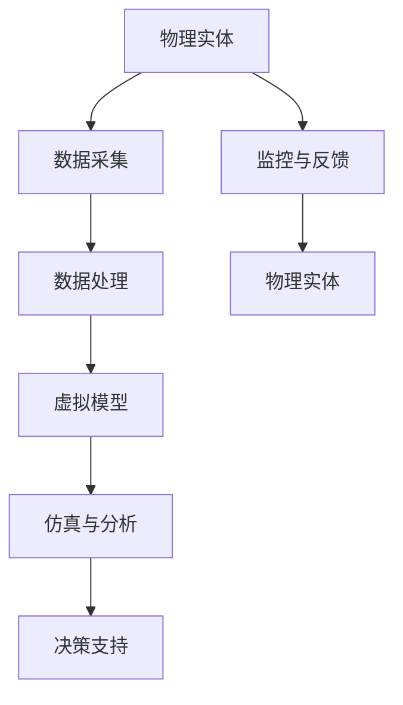

                 

## 数字孪生在航空航天领域的应用：优化飞行器设计与维护

### 关键词
- 数字孪生
- 航空航天
- 飞行器设计
- 维护优化
- 虚拟模型
- 物理仿真
- 数据互联

### 摘要
数字孪生是一种新兴的技术理念，通过构建虚拟模型与物理实体的实时映射，实现对复杂系统的全面监控与优化。在航空航天领域，数字孪生技术正逐渐成为提升飞行器设计精度与维护效率的重要工具。本文将深入探讨数字孪生在航空航天领域的应用，分析其在飞行器设计与维护中的具体作用，并通过实际案例展示其优势与前景。

## 第1章：数字孪生概述

### 1.1 数字孪生的概念与定义

数字孪生（Digital Twin）是一种通过创建物理实体的数字映射，实现实时监控、模拟和分析的先进技术。它不仅包括物理实体的三维建模，还包括实时数据的收集、处理和分析，从而实现对物理实体行为的预测和优化。

#### 核心概念原理和架构

以下是一个简化的数字孪生概念与架构的Mermaid流程图：



在这个架构中，物理实体代表实际的飞行器，数据采集环节通过传感器获取飞行器运行状态数据，数据处理环节对数据进行清洗、归一化和去噪，生成可供虚拟模型使用的高质量数据。虚拟模型则是基于物理实体数据构建的数字映射，用于仿真和分析。仿真与分析环节通过运行不同的仿真算法，预测飞行器在不同条件下的行为。决策支持环节基于仿真结果，为飞行器的设计和维护提供优化建议。监控与反馈环节则实时收集飞行器的状态数据，并将其反馈给虚拟模型，实现闭环控制。

#### 核心算法原理讲解

数字孪生的核心算法主要涉及以下几个方面：

1. **物理建模算法**：
    - **有限元分析（FEA）**：用于对飞行器结构进行建模和应力分析，预测结构在载荷作用下的响应。
    - **多体动力学（MBD）**：用于模拟飞行器在飞行过程中的动态行为，包括刚体运动和柔性变形。

    ```python
    # FEA算法示例
    def finite_element_analysis(mesh, loads):
        # 初始化有限元模型
        model = initialize_model(mesh)
        
        # 应用载荷
        apply_loads(model, loads)
        
        # 计算应力分布
        stress_distribution = calculate_stress(model)
        
        return stress_distribution
    ```

2. **数据融合算法**：
    - **数据清洗**：去除噪声和异常值，保证数据的准确性和一致性。
    - **数据归一化**：将不同来源的数据进行归一化处理，使其在同一量纲下进行比较和分析。
    - **机器学习算法**：通过训练模型，对历史数据进行分析和预测。

    ```python
    # 数据融合算法示例
    def data_fusion(sensor_data, historical_data):
        # 数据清洗
        cleaned_data = clean_data(sensor_data, historical_data)
        
        # 数据归一化
        normalized_data = normalize_data(cleaned_data)
        
        # 去噪
        denoised_data = denoise_data(normalized_data)
        
        return denoised_data
    ```

3. **机器学习算法**：
    - **回归分析**：用于预测飞行器在未来某个时间点的状态。
    - **神经网络**：用于复杂非线性关系的建模和预测。
    - **支持向量机（SVM）**：用于分类和回归分析。

    ```python
    # 神经网络算法示例
    import tensorflow as tf

    model = tf.keras.Sequential([
        tf.keras.layers.Dense(units=64, activation='relu', input_shape=(input_shape,)),
        tf.keras.layers.Dense(units=64, activation='relu'),
        tf.keras.layers.Dense(units=1)
    ])

    model.compile(optimizer='adam', loss='mse')
    model.fit(x_train, y_train, epochs=10)
    ```

4. **优化算法**：
    - **遗传算法**：用于在给定约束条件下，寻找最优解。
    - **粒子群优化**：用于解决连续优化问题。
    - **线性规划**：用于在给定约束条件下，求解线性目标函数的最优解。

    ```python
    # 遗传算法示例
    import numpy as np

    def fitness_function(population):
        # 计算每个个体的适应度
        fitness = np.sum(population, axis=1)
        return fitness

    # 初始化种群
    population = np.random.rand(population_size, chromosome_length)

    # 运行遗传算法
    for generation in range(max_generations):
        fitness = fitness_function(population)
        # 选择、交叉、变异等操作
        # 更新种群
```

通过这些核心算法，数字孪生技术能够实现对飞行器的全面建模、实时监控和优化，从而提升飞行器的设计效率和运行稳定性。下一章我们将深入探讨数字孪生在航空航天领域中的应用案例。

