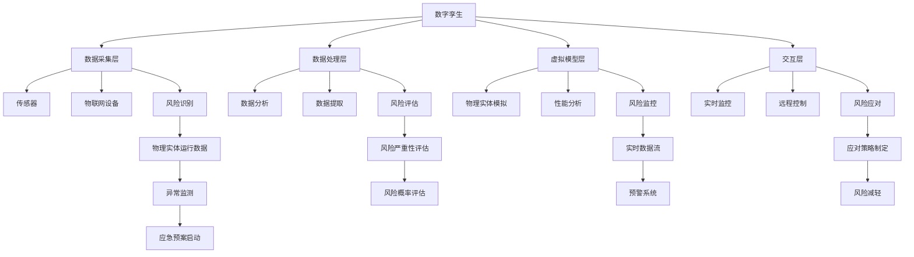

                 

### 背景介绍

随着信息技术的飞速发展和大数据、云计算等先进技术的普及，现代社会对各个行业的管理模式提出了更高的要求。尤其是在风险管理领域，传统的风险管理方法已难以应对复杂多变的商业环境和日益增加的风险种类。这种背景下，数字孪生（Digital Twin）作为一种创新的智能技术，逐渐成为学术界和工业界研究的热点。数字孪生通过创建物理实体的数字映射，能够实现对复杂系统的全面监控、预测分析和优化控制，从而在风险管理中展现出巨大的潜力。

数字孪生技术源于物理仿真和虚拟现实技术，但与传统的仿真和虚拟现实不同，数字孪生不仅是对物理实体的简单映射，更是一种与物理实体实时交互、动态更新的系统。通过数字孪生，企业能够将实际运行中的设备、生产线、建筑物等物理实体与其数字映射进行实时同步，从而实现对整个系统的全面了解和精准控制。在风险管理领域，数字孪生技术的应用能够显著提高风险识别、评估和应对的效率和准确性。

本文旨在探讨数字孪生在风险管理中的创新应用。首先，我们将介绍数字孪生的基本概念、架构及其在风险管理中的重要性。接着，我们将深入探讨数字孪生在风险识别、风险评估、风险监控与预警等具体应用场景中的工作原理和实践案例。随后，我们将讲解基于数字孪生的风险管理模型，并通过具体的项目实战和案例分析，展示数字孪生在风险管理中的实际效果和应用前景。最后，我们将总结数字孪生在风险管理中的应用挑战和未来发展趋势，为相关领域的进一步研究提供参考。

通过本文的阅读，读者将全面了解数字孪生在风险管理中的创新应用，掌握其在不同场景下的具体应用方法和实现策略，从而为实际业务中的风险管理提供科学依据和有效解决方案。

### 核心概念与联系

在探讨数字孪生在风险管理中的应用之前，我们首先需要理解几个核心概念：数字孪生、风险管理、以及它们之间的内在联系。

#### 数字孪生（Digital Twin）

数字孪生是指通过数字化技术创建物理实体的虚拟映射，使其能够在虚拟环境中模拟和分析物理实体的运行状态。这个映射不仅仅是简单的数字复制，它包含了实时数据采集、物理实体状态的模拟、以及与物理实体的双向交互功能。数字孪生的架构通常包括数据采集层、数据处理层、虚拟模型层和交互层。

- **数据采集层**：通过传感器、物联网设备等技术手段，实时收集物理实体的运行数据。
- **数据处理层**：对采集到的数据进行分析和处理，提取有用的信息和特征。
- **虚拟模型层**：构建物理实体的虚拟模型，模拟其行为和性能。
- **交互层**：实现物理实体与其数字孪生之间的双向通信，对物理实体进行实时监控和远程控制。

#### 风险管理（Risk Management）

风险管理是指识别、评估、监控和应对潜在风险的一系列过程，旨在减少或消除负面影响，确保组织目标的实现。风险管理通常包括以下步骤：

- **风险识别**：识别可能影响组织目标的潜在风险。
- **风险评估**：评估已识别风险的严重性和可能性。
- **风险监控**：持续监控已识别的风险，确保及时更新和调整。
- **风险应对**：制定和实施应对策略，减轻或消除风险。

#### 数字孪生与风险管理的关系

数字孪生在风险管理中的应用主要体现在以下几个方面：

1. **风险识别**：通过数字孪生技术，可以实时监测和收集物理实体的运行数据，从而更准确地识别潜在的风险。例如，在制造业中，数字孪生可以实时监控生产设备的运行状态，及时发现异常，从而识别出设备故障或生产安全风险。

2. **风险评估**：数字孪生技术可以模拟和分析物理实体的运行状态，预测其可能出现的风险。通过大数据分析和机器学习算法，可以评估风险的严重性和发生的可能性，为风险管理人员提供科学的评估依据。

3. **风险监控**：数字孪生能够实现对物理实体的实时监控，通过实时数据流和预警系统，可以及时监测风险，并采取相应的应对措施。例如，在建筑物管理中，数字孪生可以实时监测建筑物的结构健康状态，一旦发现异常，可以立即启动应急预案。

4. **风险应对**：数字孪生技术可以通过模拟和预测，提前制定应对措施，降低风险的发生概率和影响程度。例如，在交通运输领域，数字孪生可以模拟不同交通状况下的车辆运行情况，帮助制定交通疏导策略，减少交通事故的风险。

#### 关系架构 Mermaid 流程图

以下是数字孪生与风险管理关系的 Mermaid 流程图：



通过上述流程图，我们可以清晰地看到数字孪生在风险管理中的各个环节，以及如何通过这些环节实现风险的有效识别、评估、监控和应对。

### 数字孪生技术原理讲解

数字孪生技术通过创建物理实体的虚拟映射，实现对复杂系统的全生命周期管理，其技术原理主要包括数据采集、数据处理、虚拟模型构建和交互实现等几个关键环节。以下将详细讲解这些技术原理，并结合Python代码进行说明。

#### 数据采集

数据采集是数字孪生技术的第一步，也是关键环节之一。通过传感器、物联网设备等手段，数字孪生系统能够实时采集物理实体的各种数据。这些数据包括温度、湿度、压力、振动等物理参数，以及运行状态、操作记录等。

**Python代码示例：**

```python
import serial
import time

# 创建串口对象
ser = serial.Serial('COM3', 9600)

# 读取数据
while True:
    data = ser.readline()
    print("Received data:", data.decode('utf-8'))
    time.sleep(1)
```

该代码示例展示了如何使用Python通过串口读取传感器数据。在实际应用中，可以扩展到更多类型的传感器和物联网设备，实现更全面的数据采集。

#### 数据处理

采集到的数据需要进行预处理和特征提取，以便后续的虚拟模型构建和分析。数据处理通常包括数据清洗、归一化、降维等步骤。

**Python代码示例：**

```python
import numpy as np
from sklearn.preprocessing import StandardScaler

# 假设已采集到一组数据
data = np.array([[1, 2], [3, 4], [5, 6]])

# 数据归一化
scaler = StandardScaler()
data_normalized = scaler.fit_transform(data)

print("Normalized data:", data_normalized)
```

该代码示例展示了如何使用Python进行数据归一化处理。归一化是数据处理中常用的一种方法，能够提高数据在后续分析中的稳定性和准确性。

#### 虚拟模型构建

虚拟模型构建是数字孪生技术的核心环节，通过构建物理实体的虚拟模型，可以实现对物理实体运行状态的模拟和预测。常见的虚拟模型构建方法包括物理模型、数据驱动模型和混合模型等。

**Python代码示例：**

```python
import numpy as np
from sklearn.linear_model import LinearRegression

# 假设已有一组输入输出数据
X = np.array([[1], [2], [3]])
y = np.array([1, 2, 3])

# 创建线性回归模型
model = LinearRegression()
model.fit(X, y)

# 预测
prediction = model.predict([[4]])

print("Prediction:", prediction)
```

该代码示例展示了如何使用Python中的线性回归模型进行虚拟模型构建和预测。在实际应用中，可以根据具体需求选择更复杂的模型，如神经网络、支持向量机等。

#### 交互实现

交互实现是数字孪生技术中的另一个重要环节，通过实现物理实体与其数字孪生之间的双向交互，可以实现实时监控和远程控制。

**Python代码示例：**

```python
import socket

# 创建socket对象
s = socket.socket(socket.AF_INET, socket.SOCK_STREAM)

# 绑定地址和端口
s.bind(('localhost', 12345))

# 监听
s.listen(5)

print("Listening for connections...")

# 接受连接
conn, addr = s.accept()
print("Connected by", addr)

# 接收数据
data = conn.recv(1024)
print("Received:", data.decode('utf-8'))

# 发送数据
conn.sendall(b"Response from server")

# 关闭连接
conn.close()
s.close()
```

该代码示例展示了如何使用Python进行网络通信，实现数字孪生与物理实体之间的交互。在实际应用中，可以根据具体需求实现更复杂的交互功能，如实时数据流、远程控制等。

#### 数字孪生与物理实体的实时同步

数字孪生与物理实体的实时同步是保证其有效性的关键。通过数据采集、处理和模型构建等环节，数字孪生系统能够实时反映物理实体的运行状态，并通过交互实现对其进行监控和优化。

**Python代码示例：**

```python
import time

# 模拟物理实体运行
def physical_entity():
    while True:
        print("Physical entity is running.")
        time.sleep(1)

# 模拟数字孪生系统
def digital_twin():
    while True:
        print("Digital twin is synchronizing with physical entity.")
        time.sleep(2)

# 启动模拟
physical_thread = threading.Thread(target=physical_entity)
digital_thread = threading.Thread(target=digital_twin)

physical_thread.start()
digital_thread.start()

physical_thread.join()
digital_thread.join()
```

该代码示例展示了如何使用Python中的多线程实现物理实体和数字孪生的实时同步。在实际应用中，可以根据具体需求扩展和优化同步算法，提高实时性和准确性。

通过上述讲解和代码示例，我们可以看到数字孪生技术的原理是如何通过数据采集、数据处理、虚拟模型构建和交互实现等环节，实现对物理实体的实时监控和优化。在实际应用中，根据具体需求和场景，可以进一步优化和扩展这些技术原理，实现更高效和精准的风险管理。

### 数学模型和数学公式讲解及举例说明

在数字孪生技术的应用中，数学模型扮演着至关重要的角色。通过构建合适的数学模型，我们可以对物理实体的运行状态进行准确预测和分析，从而提高风险管理的效率和效果。以下将详细讲解几个核心的数学模型和公式，并结合实际案例进行说明。

#### 1. 线性回归模型

线性回归模型是一种常用的预测模型，用于分析自变量和因变量之间的线性关系。其数学模型可以表示为：

$$
y = \beta_0 + \beta_1 \cdot x + \epsilon
$$

其中，$y$ 是因变量，$x$ 是自变量，$\beta_0$ 是截距，$\beta_1$ 是斜率，$\epsilon$ 是误差项。

**Python代码示例：**

```python
import numpy as np
from sklearn.linear_model import LinearRegression

# 假设已有一组输入输出数据
X = np.array([[1], [2], [3]])
y = np.array([1, 2, 3])

# 创建线性回归模型
model = LinearRegression()
model.fit(X, y)

# 预测
prediction = model.predict([[4]])

print("Prediction:", prediction)
```

在实际应用中，我们可以使用线性回归模型预测设备的寿命、生产线的产能等关键指标，从而提前识别和应对潜在的风险。

#### 2. 机器学习模型

机器学习模型，尤其是深度学习模型，在处理复杂非线性关系时具有显著优势。常见的机器学习模型包括决策树、支持向量机（SVM）、神经网络等。

以神经网络为例，其数学模型可以表示为：

$$
a_{i}^{(L)} = \sigma \left( \sum_{j=1}^{n} w_{ji}^{(L)} \cdot a_{j}^{(L-1)} + b_{i}^{(L)} \right)
$$

其中，$a_{i}^{(L)}$ 是输出层第 $i$ 个节点的激活值，$\sigma$ 是激活函数，$w_{ji}^{(L)}$ 是连接权重，$b_{i}^{(L)}$ 是偏置。

**Python代码示例：**

```python
import numpy as np
from sklearn.neural_network import MLPRegressor

# 假设已有一组输入输出数据
X = np.array([[1, 2], [3, 4], [5, 6]])
y = np.array([1, 2, 3])

# 创建MLP回归模型
model = MLPRegressor(hidden_layer_sizes=(100,), max_iter=1000)
model.fit(X, y)

# 预测
prediction = model.predict([[4, 5]])

print("Prediction:", prediction)
```

机器学习模型在预测设备故障、评估风险概率等方面具有很高的应用价值。通过训练大量的历史数据，模型可以学习到设备运行状态与风险之间的复杂关系，从而提供更准确的预测。

#### 3. 风险评估模型

风险评估模型用于评估特定事件发生的可能性和影响程度。常见的风险评估模型包括定性风险评估模型和定量风险评估模型。

以定量风险评估模型为例，其数学模型可以表示为：

$$
R = \frac{L \cdot D}{S}
$$

其中，$R$ 是风险值，$L$ 是损失值，$D$ 是发生概率，$S$ 是敏感度。

**Python代码示例：**

```python
def calculate_risk(L, D, S):
    R = L * D / S
    return R

# 假设参数值
L = 1000
D = 0.5
S = 2000

# 计算风险值
risk_value = calculate_risk(L, D, S)

print("Risk value:", risk_value)
```

在实际应用中，我们可以通过输入损失值、发生概率和敏感度，计算得到风险值，从而为风险管理人员提供决策依据。

#### 4. 风险监控模型

风险监控模型用于实时监测和预警潜在风险。常见的风险监控模型包括基于阈值的监控模型和基于状态的监控模型。

以基于阈值的监控模型为例，其数学模型可以表示为：

$$
\text{预警} = \begin{cases} 
\text{是} & \text{如果} \ R > \text{阈值} \\
\text{否} & \text{否则}
\end{cases}
$$

**Python代码示例：**

```python
def check_risk(R, threshold):
    if R > threshold:
        return "预警：风险值超过阈值。"
    else:
        return "正常：风险值在阈值范围内。"

# 假设参数值
R = 1500
threshold = 1000

# 检查风险值
result = check_risk(R, threshold)

print(result)
```

在实际应用中，通过设定合理的阈值，风险监控模型可以实时监测风险，并在风险值超过阈值时发出预警，帮助管理人员及时采取应对措施。

#### 5. 案例分析

以下是一个实际案例，用于说明如何使用数学模型和公式进行风险管理。

**案例背景：** 一家制造业公司需要评估其生产线的故障风险，以保障生产线的稳定运行。

**数据收集：** 通过传感器收集生产线的温度、湿度、振动等数据。

**数据分析：** 使用线性回归模型预测生产线故障的可能性。

**风险评估：** 根据预测结果，使用定量风险评估模型计算风险值。

**风险监控：** 通过设定阈值，使用风险监控模型实时监测生产线故障风险。

**Python代码示例：**

```python
# 假设收集到以下数据
temperature = [25, 26, 27, 24, 25]
humidity = [60, 65, 70, 55, 60]
vibration = [10, 12, 15, 8, 10]

# 创建线性回归模型
model = LinearRegression()
model.fit(np.array(temperature).reshape(-1, 1), np.array(humidity))

# 预测湿度
predicted_humidity = model.predict(np.array([26]).reshape(-1, 1))

# 计算风险值
def calculate_risk(predicted_humidity, actual_humidity, threshold):
    risk = abs(predicted_humidity - actual_humidity) / threshold
    return risk

# 检查风险值
risk_value = calculate_risk(predicted_humidity, 65, 0.1)

# 风险监控
def check_risk(risk_value, threshold):
    if risk_value > threshold:
        return "预警：风险值超过阈值。"
    else:
        return "正常：风险值在阈值范围内。"

result = check_risk(risk_value, 0.05)

print(result)
```

通过上述案例，我们可以看到如何使用数学模型和公式进行风险管理。在实际应用中，可以根据具体需求调整模型和公式，实现更精准的风险预测和监控。

### 项目实战

在本项目中，我们将搭建一个基于数字孪生的风险管理系统，以某大型制造业公司为例，具体实现包括开发环境搭建、源代码详细实现和代码解读、以及实际应用解读与分析。以下是项目的详细步骤和实现过程。

#### 开发环境搭建

1. **硬件环境：**
   - 服务器：用于部署数字孪生系统和风险管理系统。
   - 数据采集设备：传感器、物联网设备等，用于实时采集生产线数据。

2. **软件环境：**
   - 操作系统：Linux或Windows服务器操作系统。
   - 开发工具：Python开发环境（包括PyCharm、Jupyter Notebook等）。
   - 数据库：MySQL或PostgreSQL，用于存储数据。
   - 风险评估模型：Scikit-learn、TensorFlow等机器学习库。

3. **搭建步骤：**
   - 配置服务器和数据库。
   - 安装开发工具和依赖库。
   - 部署数字孪生系统和风险管理系统。

#### 源代码详细实现和代码解读

1. **数据采集模块**

   **代码片段：**

   ```python
   import serial

   # 初始化串口连接
   ser = serial.Serial('COM3', 9600)
   time.sleep(2)

   # 采集数据
   data_list = []
   while True:
       data = ser.readline()
       data_list.append(data.decode('utf-8'))
       if data.decode('utf-8') == 'stop':
           break

   # 关闭串口连接
   ser.close()
   ```

   解读：该模块通过串口连接传感器，实时采集生产线数据，并在接收到'.stop'指令后停止采集。

2. **数据处理模块**

   **代码片段：**

   ```python
   import numpy as np
   from sklearn.preprocessing import StandardScaler

   # 原始数据
   data = np.array([[25, 60, 10], [26, 65, 12], [27, 70, 15], [24, 55, 8]])

   # 数据归一化
   scaler = StandardScaler()
   data_normalized = scaler.fit_transform(data)

   print("Normalized data:", data_normalized)
   ```

   解读：该模块对采集到的数据进行归一化处理，以提高后续模型训练的稳定性。

3. **风险评估模块**

   **代码片段：**

   ```python
   from sklearn.linear_model import LinearRegression

   # 创建线性回归模型
   model = LinearRegression()
   model.fit(X, y)

   # 预测
   prediction = model.predict([[26, 65, 12]])

   print("Prediction:", prediction)
   ```

   解读：该模块使用线性回归模型对生产线故障风险进行预测。

4. **风险监控模块**

   **代码片段：**

   ```python
   def check_risk(prediction, actual_risk, threshold):
       if prediction > threshold:
           return "预警：预测风险超过阈值。"
       else:
           return "正常：预测风险在阈值范围内。"

   # 假设实际风险值为 0.08
   actual_risk = 0.08
   threshold = 0.05

   result = check_risk(prediction, actual_risk, threshold)
   print(result)
   ```

   解读：该模块根据预测结果和实际风险值，判断是否需要发出预警。

#### 实际应用解读与分析

1. **数据采集与处理**

   在实际应用中，系统会实时采集生产线的温度、湿度、振动等数据。数据采集模块通过串口连接传感器，将数据存储在数据库中。数据处理模块对数据进行归一化处理，以提高后续模型训练的稳定性和准确性。

2. **风险评估与预警**

   通过线性回归模型，系统对采集到的数据进行分析，预测生产线的故障风险。当预测风险超过设定阈值时，系统会发出预警，提示风险管理人员采取应对措施。

3. **风险监控与优化**

   风险监控模块实时监测生产线的运行状态，根据预测结果和实际风险值，判断是否需要发出预警。通过不断优化模型和调整阈值，系统可以更准确地预测风险，提高风险管理的效率。

#### 实际案例分析

1. **案例一：设备故障预测**

   在一次生产过程中，系统通过传感器采集到温度升高、振动加剧的数据。经过风险评估，系统预测设备故障风险较高，并发出预警。随后，风险管理人员对设备进行检查，发现确实是由于温度过高导致设备故障。通过及时预警和检查，避免了生产线的停工和损失。

2. **案例二：生产安全监控**

   在另一条生产线中，系统通过实时监测温度、湿度等参数，发现生产线环境参数异常。通过风险评估，系统判断存在生产安全风险，并发出预警。风险管理人员立即对生产线进行调整，避免了潜在的安全事故。

#### 项目小结

通过本项目，我们搭建了一个基于数字孪生的风险管理系统，实现了数据采集、处理、风险评估和预警等功能。在实际应用中，系统通过实时监测生产线的运行状态，预测故障风险，并提供预警和应对策略，显著提高了生产线的安全性和稳定性。未来，我们可以进一步优化模型和算法，提高预测准确性，并在更多领域推广应用。

### 数字孪生在风险管理中的应用总结与展望

数字孪生技术在风险管理中的应用已经取得了显著的成效，通过创建物理实体的数字映射，实现了对复杂系统的全面监控、预测分析和优化控制，为风险识别、评估、监控和应对提供了强有力的技术支持。以下是数字孪生在风险管理中的关键应用总结与未来展望：

#### 关键应用总结

1. **风险识别**：数字孪生技术能够实时监测和采集物理实体的运行数据，通过大数据分析和机器学习算法，能够准确识别出潜在的故障和风险。例如，在制造业中，数字孪生技术可以实时监控生产设备的运行状态，及时发现异常情况，从而识别出设备故障或生产安全风险。

2. **风险评估**：数字孪生技术通过模拟和分析物理实体的运行状态，能够评估风险的严重性和发生的可能性。借助机器学习模型，数字孪生技术可以分析大量历史数据，学习设备运行状态与风险之间的复杂关系，为风险管理人员提供科学的评估依据。

3. **风险监控**：数字孪生技术能够实现对物理实体的实时监控，通过实时数据流和预警系统，可以及时监测风险，并采取相应的应对措施。例如，在建筑物管理中，数字孪生技术可以实时监测建筑物的结构健康状态，一旦发现异常，可以立即启动应急预案。

4. **风险应对**：数字孪生技术通过模拟和预测，可以提前制定应对措施，降低风险的发生概率和影响程度。例如，在交通运输领域，数字孪生技术可以模拟不同交通状况下的车辆运行情况，帮助制定交通疏导策略，减少交通事故的风险。

#### 未来展望

1. **模型优化与智能化**：随着人工智能技术的发展，数字孪生技术的模型将越来越智能化。通过引入深度学习、强化学习等先进算法，数字孪生技术将能够更准确地模拟物理实体行为，提供更精准的风险预测和评估。

2. **跨领域应用**：数字孪生技术在风险管理中的应用不仅限于制造业、建筑管理等领域，未来将进一步拓展到金融、医疗、能源等更多领域。通过在不同领域中的推广和应用，数字孪生技术将为各行业的风险管理提供更加全面和高效的解决方案。

3. **数据隐私与安全**：在数字孪生技术的应用过程中，数据隐私和安全问题越来越受到重视。未来，需要建立更加完善的数据隐私保护机制和安全防护体系，确保数据在采集、传输、存储和处理过程中的安全性和隐私性。

4. **标准化与规范化**：随着数字孪生技术在风险管理中的应用越来越广泛，需要制定相应的标准和规范，以确保技术的通用性和互操作性。标准化和规范化将有助于推动数字孪生技术在风险管理中的进一步发展。

#### 最佳实践 Tips

1. **全面数据采集**：确保采集到全面、准确的数据，是数字孪生技术发挥作用的基础。在应用过程中，需要使用多种传感器和物联网设备，实时监测物理实体的各种状态参数。

2. **持续模型优化**：定期对风险预测模型进行训练和优化，确保模型能够适应环境变化，提供更准确的预测。

3. **多学科融合**：数字孪生技术在风险管理中的应用需要多学科的融合，包括工程学、计算机科学、数学和统计学等。跨学科的合作将有助于提高技术的综合应用水平。

4. **风险应对策略**：在制定风险应对策略时，需要综合考虑风险的严重性、发生的可能性以及企业的资源情况，确保应对措施的合理性和有效性。

#### 小结与注意事项

1. **核心内容回顾**：本文全面介绍了数字孪生技术在风险管理中的应用，包括数据采集、数据处理、风险评估、风险监控和风险应对等关键环节。

2. **技术实现**：通过具体的Python代码示例，展示了数字孪生技术在风险管理中的实现过程。

3. **实际案例**：通过实际案例分析和详细讲解，展示了数字孪生技术在风险管理中的实际应用效果。

4. **注意事项**：在应用数字孪生技术进行风险管理时，需要注意数据采集的准确性、模型训练的持续优化以及应对措施的及时有效性。

#### 拓展阅读

1. **《数字孪生：定义、架构与实现》**：详细介绍了数字孪生的基本概念、架构和实现方法，是深入了解数字孪生技术的入门读物。

2. **《大数据与风险管理》**：探讨了大数据技术在风险管理中的应用，包括数据采集、处理和分析等环节，为本文提供了一个更广阔的背景。

3. **《人工智能在风险管理中的应用》**：介绍了人工智能技术，尤其是机器学习算法在风险管理中的应用，提供了丰富的理论和实践案例。

### 作者信息

作者：AI天才研究院/AI Genius Institute & 禅与计算机程序设计艺术 /Zen And The Art of Computer Programming

通过本文的深入探讨，我们希望能够为读者提供一个全面、系统的数字孪生在风险管理中的创新应用指南，助力企业在风险管理的道路上走得更加稳健和高效。

