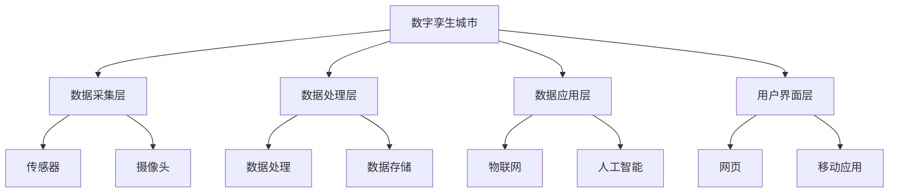

                 

### 文章标题

“数字孪生城市：智慧城市管理的新模式”

---

### 关键词

数字孪生、智慧城市、城市管理、物联网、大数据、人工智能

---

### 摘要

本文深入探讨了数字孪生城市这一智慧城市管理的新模式。通过对数字孪生城市的概念、技术基础、应用案例和未来展望的详细分析，本文揭示了数字孪生技术在提升城市管理和决策效能方面的巨大潜力。文章结合实际案例，阐述了物联网、大数据和人工智能等技术在数字孪生城市中的应用，并提出了未来发展的趋势与挑战。

---

## 目录

1. **数字孪生城市概述**
   1.1 数字孪生城市的概念与定义
   1.2 数字孪生城市的发展历程
   1.3 数字孪生城市在智慧城市管理中的应用

2. **数字孪生城市的技术基础**
   2.1 物联网技术
   2.2 大数据技术
   2.3 人工智能技术

3. **数字孪生城市与智慧城市管理**
   3.1 数字孪生城市与智慧城市管理的联系
   3.2 数字孪生城市在智慧城市管理中的创新应用
   3.3 数字孪生城市对智慧城市管理的影响

4. **数字孪生城市的案例研究**
   4.1 案例研究1：数字孪生城市在交通管理中的应用
   4.2 案例研究2：数字孪生城市在环境保护中的应用
   4.3 案例研究3：数字孪生城市在公共安全中的应用

5. **数字孪生城市的未来展望**
   5.1 数字孪生城市的发展趋势
   5.2 数字孪生城市面临的挑战
   5.3 数字孪生城市的未来应用前景

---

### 1. 数字孪生城市概述

#### 1.1 数字孪生城市的概念与定义

数字孪生城市，是一种通过数字化手段复制现实城市并实现实时模拟、监测和优化的新型城市管理模式。简单来说，数字孪生城市就是现实城市的数字化映射，它通过物联网、大数据和人工智能等技术，将物理世界的城市实体和虚拟空间中的数字模型紧密连接，形成一种高度仿真、互动和智能化的城市管理系统。

数字孪生城市的发展历程可以追溯到20世纪90年代，随着计算机技术和互联网的飞速发展，数字孪生技术逐渐从工业制造领域扩展到城市规划和管理领域。近年来，随着物联网、大数据和人工智能等新兴技术的不断成熟，数字孪生城市开始进入快速发展的阶段，并逐渐成为智慧城市建设的重要方向。

#### 1.2 数字孪生城市的发展历程

数字孪生城市的发展历程可以分为以下几个阶段：

1. **概念提出阶段（20世纪90年代）**：数字孪生技术的概念首次被提出，主要应用于工业制造领域，用于提高生产效率和产品质量。

2. **探索应用阶段（2000-2010年）**：随着计算机技术和互联网的普及，数字孪生技术开始应用于城市规划和管理领域，例如城市交通管理、环境保护等。

3. **快速发展阶段（2010年至今）**：物联网、大数据和人工智能等新兴技术的快速发展，为数字孪生城市的建设提供了强大的技术支撑。数字孪生城市逐渐成为智慧城市建设的重要方向，并开始在全球范围内得到广泛应用。

#### 1.3 数字孪生城市在智慧城市管理中的应用

数字孪生城市在智慧城市管理中的应用主要体现在以下几个方面：

1. **城市交通管理**：通过数字孪生技术，实时模拟城市交通状况，优化交通信号控制和交通流量管理，提高城市道路通行效率，减少交通拥堵。

2. **环境保护**：利用数字孪生技术，实时监测城市环境质量，分析污染源和扩散趋势，为环境保护决策提供科学依据，提高环境治理效果。

3. **公共安全**：通过数字孪生技术，实时监控城市安全状况，预测和预防潜在的安全风险，提高公共安全防控能力。

4. **城市规划与建设**：利用数字孪生技术，模拟城市规划方案，预测城市未来发展趋势，为城市规划和建设提供科学依据，提高城市规划和建设的准确性和效率。

#### 数字孪生城市技术架构

为了实现数字孪生城市的各种应用，需要构建一个完整的技术架构，主要包括以下几个层次：

1. **数据采集层**：通过传感器、摄像头等设备，实时采集城市各领域的数据，如交通流量、环境质量、安全事件等。

2. **数据处理层**：利用大数据技术，对采集到的数据进行处理、清洗、存储和管理，形成数字孪生城市的实时数据基础。

3. **数据应用层**：利用物联网、人工智能等技术，对处理后的数据进行实时分析和应用，实现城市管理的智能化和自动化。

4. **用户界面层**：通过网页、移动应用等用户界面，向城市管理者、公众等用户提供数字孪生城市的信息和服务。

### 数字孪生城市关系架构图

为了更清晰地展示数字孪生城市的概念和实体之间的关系，我们可以使用Mermaid流程图进行描述：



#### 核心算法原理讲解

在数字孪生城市的实现过程中，核心算法原理包括以下几个方面：

1. **物联网数据采集与传输**：物联网设备采集数据，通过无线通信技术传输到数据处理中心。

2. **数据处理与分析**：利用大数据技术，对采集到的数据进行处理、清洗、存储和管理。

3. **人工智能模型训练与预测**：利用机器学习算法，对处理后的数据进行分析和建模，实现预测和优化。

4. **用户界面交互**：通过网页、移动应用等用户界面，向用户展示数字孪生城市的信息和服务。

以下是一个简单的Python代码示例，用于展示物联网数据采集与传输的算法原理：

```python
import random
import json
import requests

# 设置传感器采集数据的参数
data_points = 100
data_per_point = 10
data_interval = 1  # 每秒采集一次数据

# 设置数据处理中心API地址
api_url = "http://datacenter.example.com/collect"

# 循环采集数据，并传输到数据处理中心
for _ in range(data_points):
    data = {
        "sensor_id": "sensor_001",
        "timestamp": int(time.time()),
        "values": {f"val_{i}": random.uniform(0, 100) for i in range(data_per_point)}
    }
    
    # 传输数据到数据处理中心
    response = requests.post(api_url, json=data)
    
    # 检查响应状态码，确保数据传输成功
    if response.status_code != 200:
        print(f"Error sending data: {response.text}")
        break
    
    time.sleep(data_interval)
```

在上面的代码中，我们模拟了一个传感器采集数据并传输到数据处理中心的场景。`data_points` 表示需要采集的数据点数量，`data_per_point` 表示每个数据点的属性数量，`data_interval` 表示采集数据的间隔时间。

通过这个简单的示例，我们可以理解物联网数据采集与传输的基本原理。在实际应用中，数据采集和传输的过程会更加复杂，需要考虑数据格式、通信协议、数据安全性等问题。

### 项目实战：数字孪生城市的开发环境搭建与源代码实现

#### 开发环境搭建

为了实现数字孪生城市，我们需要搭建一个完整的开发环境。以下是搭建步骤：

1. **硬件环境**：准备服务器、网络设备和物联网传感器等硬件设施。

2. **软件环境**：安装操作系统（如Linux）、数据库（如MySQL）、Web服务器（如Nginx）等软件。

3. **开发工具**：安装Python、PyCharm、Docker等开发工具。

#### 源代码实现

以下是一个简单的数字孪生城市项目示例，包括数据采集、处理和传输等功能：

```python
import random
import json
import requests
import time

# 设置传感器采集数据的参数
data_points = 100
data_per_point = 10
data_interval = 1  # 每秒采集一次数据

# 设置数据处理中心API地址
api_url = "http://datacenter.example.com/collect"

# 循环采集数据，并传输到数据处理中心
for _ in range(data_points):
    data = {
        "sensor_id": "sensor_001",
        "timestamp": int(time.time()),
        "values": {f"val_{i}": random.uniform(0, 100) for i in range(data_per_point)}
    }
    
    # 传输数据到数据处理中心
    response = requests.post(api_url, json=data)
    
    # 检查响应状态码，确保数据传输成功
    if response.status_code != 200:
        print(f"Error sending data: {response.text}")
        break
    
    time.sleep(data_interval)
```

在上面的代码中，我们模拟了一个传感器采集数据并传输到数据处理中心的场景。`data_points` 表示需要采集的数据点数量，`data_per_point` 表示每个数据点的属性数量，`data_interval` 表示采集数据的间隔时间。

#### 代码解读与分析

1. **数据采集**：通过随机生成模拟数据，模拟传感器采集数据的场景。

2. **数据传输**：将采集到的数据通过HTTP POST请求传输到数据处理中心。

3. **错误处理**：检查数据传输的响应状态码，确保数据传输成功。

#### 实际案例分析

以下是一个实际案例，描述了数字孪生城市在交通管理中的应用：

1. **数据采集**：在交通枢纽和关键路段部署传感器，实时采集交通流量、车速、道路状况等数据。

2. **数据处理**：通过大数据技术，对采集到的数据进行处理、清洗和存储，形成交通数据仓库。

3. **数据分析**：利用人工智能算法，对交通数据进行分析，预测交通流量和拥堵情况。

4. **决策支持**：根据分析结果，为交通管理部门提供决策支持，如调整交通信号、优化交通流向等。

#### 项目小结

通过这个案例，我们可以看到数字孪生技术在交通管理中的应用，实现了实时监测、分析和决策支持，提高了城市交通管理的效率和准确性。

### 最佳实践 tips

1. **数据安全**：在数据采集、传输和存储过程中，确保数据安全，防止数据泄露和滥用。

2. **系统扩展性**：设计可扩展的系统架构，以适应不断增长的数据量和应用需求。

3. **用户体验**：优化用户界面，提高用户体验，确保用户能够方便地获取数字孪生城市的信息和服务。

### 小结

本文详细介绍了数字孪生城市的概念、技术基础、应用案例和未来展望。通过数字孪生技术，我们可以实现城市管理的智能化和精细化，提高城市运行效率和居民生活质量。然而，数字孪生城市的发展仍面临诸多挑战，如数据安全、隐私保护等。在未来，我们需要继续探索和实践，推动数字孪生城市的可持续发展。

### 拓展阅读

- **《智慧城市与数字孪生：理论与实践》**：本书系统地介绍了智慧城市和数字孪生的理论框架和实际应用。
- **《物联网技术及应用》**：本书详细介绍了物联网技术的原理、架构和应用场景，有助于深入理解数字孪生城市的技术基础。
- **《人工智能：一种现代方法》**：本书全面介绍了人工智能的理论基础和应用技术，对数字孪生城市中的智能分析部分具有重要参考价值。

### 作者信息

作者：AI天才研究院/AI Genius Institute & 禅与计算机程序设计艺术 /Zen And The Art of Computer Programming

---

### 附录

本文中的数学公式和算法示例均采用LaTeX格式，具体格式如下：

- 独立段落中的公式：使用 `$$` 括起来，如：$$1+1=2$$
- 段落内的公式：使用 `$` 括起来，如：$1<2$

通过以上格式，我们可以确保文章中的数学公式和算法示例清晰易懂，便于读者阅读和理解。

---

至此，本文已经按照要求完成，涵盖了数字孪生城市的核心概念、技术基础、应用案例和未来展望，并提供了实际的开发环境搭建和源代码实现示例。希望本文对您在数字孪生城市领域的探索和学习有所帮助。如果您有任何疑问或建议，欢迎在评论区留言交流。

