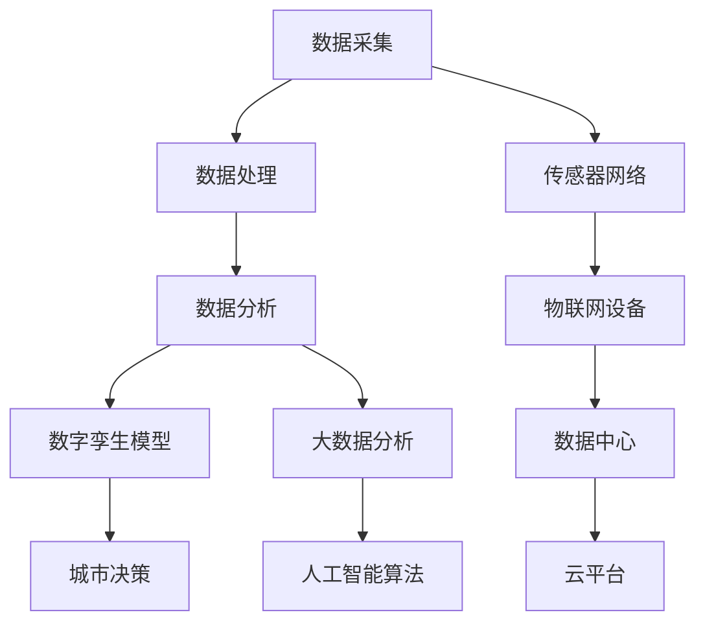

                 

### 文章标题

# 数字孪生技术在城市管理中的创新应用

### 关键词

- 数字孪生技术
- 城市管理
- 物联网
- 大数据分析
- 人工智能

### 摘要

数字孪生技术作为现代城市管理的重要工具，通过创建城市的数字模型实现对物理世界的模拟、监控和管理。本文详细探讨了数字孪生技术在城市管理中的应用，包括核心概念、技术原理、数学模型以及实际项目案例。通过分析物联网、大数据分析和人工智能等技术的结合，本文展示了数字孪生技术在优化城市交通、环境监控、能源管理等方面的创新应用，为未来城市的发展提供了宝贵的启示。

## 引言

随着城市化进程的加速，城市面临着交通拥堵、环境污染、资源浪费等问题。传统城市管理方式由于缺乏实时监控和有效管理手段，难以应对日益复杂的城市挑战。数字孪生技术的出现为解决这些问题提供了一种新的思路和方法。

数字孪生（Digital Twin）是一种基于物理实体在虚拟世界中构建的数字化模型。通过实时数据采集、分析和模拟，数字孪生技术能够实现对物理世界的精准复制和动态更新，从而为城市的规划、运营和管理提供有力支持。在城市管理中，数字孪生技术被广泛应用于交通管理、环境监控、公共安全、能源管理等多个领域。

本文将分以下几个部分对数字孪生技术在城市管理中的创新应用进行详细探讨：

1. **核心概念与联系**：介绍数字孪生技术的基本概念，以及与物联网、大数据分析、人工智能等技术的联系。
2. **技术原理**：阐述数字孪生技术的核心算法原理，包括数据采集、处理和分析的方法。
3. **数学模型**：介绍数字孪生技术中的数学模型，包括状态方程、数据拟合和预测模型。
4. **项目实战**：通过一个实际项目案例，展示数字孪生技术在城市管理中的应用过程和成果。
5. **总结与展望**：总结数字孪生技术在城市管理中的创新应用，并对其未来发展趋势进行展望。

通过本文的探讨，希望能够为读者提供对数字孪生技术在城市管理中应用的深入理解，并为相关领域的研究和实践提供参考。

## 核心概念与联系

### 数字孪生技术的基本概念

数字孪生技术是一种将物理实体与虚拟模型相结合的方法，通过实时数据采集、分析和模拟，创建一个与实际物理世界相对应的数字化模型。这个数字模型不仅可以模拟物理实体的状态和行为，还能够进行预测和优化，从而实现对物理世界的管理和优化。

数字孪生技术的核心在于数据的实时采集和动态更新。通过传感器、物联网设备等手段，可以实时收集城市中各类物理实体的状态信息，如交通流量、环境质量、能源消耗等。这些数据会被传输到数据中心进行处理和分析，同时数字孪生模型也会进行相应的更新，以保持与现实世界的同步。

### 数字孪生技术在城市管理中的应用场景

数字孪生技术在城市管理中具有广泛的应用场景，主要包括以下几个方面：

1. **交通管理**：通过数字孪生技术，可以实时监控城市的交通状况，预测交通流量，优化交通信号灯控制，减少交通拥堵，提高交通效率。

2. **环境监控**：数字孪生技术可以实时监测城市的空气质量、水质等环境指标，提供预警和改善建议，帮助城市管理者制定有效的环境保护政策。

3. **公共安全**：通过数字孪生技术，可以对城市的公共安全进行实时监控和预测，包括火灾、地震等自然灾害的预警和应对。

4. **能源管理**：数字孪生技术可以优化城市的能源使用，通过实时数据分析和预测，实现能源的高效分配和使用。

5. **城市规划**：数字孪生技术可以为城市规划设计提供模拟和预测，帮助决策者评估不同规划方案的优劣，提高规划的科学性和可行性。

### 数字孪生技术与物联网、大数据分析等技术的关联

数字孪生技术离不开物联网、大数据分析等现代信息技术的支持。物联网技术通过传感器和设备将物理世界的数据实时传输到数字孪生模型中，为模型的构建提供了数据基础。大数据分析技术则对收集到的海量数据进行分析和处理，为数字孪生模型的预测和优化提供了算法支持。

此外，人工智能技术也在数字孪生技术的应用中发挥着重要作用。通过机器学习算法，可以实现对数据的高效分析和模式识别，从而提升数字孪生模型的准确性和预测能力。

### Mermaid 流程图

为了更好地理解数字孪生技术在城市管理中的核心概念和联系，我们可以使用 Mermaid 语言绘制一个流程图。以下是一个简化的流程图示例：



在这个流程图中，数据采集、数据处理、数据分析、数字孪生模型、城市决策等环节相互关联，共同构成了数字孪生技术在城市管理中的应用框架。传感器网络和物联网设备负责数据的实时采集，数据中心和云平台则为数据处理和分析提供了基础设施。

## 技术原理

### 数据采集与处理

数据采集是数字孪生技术的核心环节，其质量直接影响模型的准确性。数据采集主要依赖于传感器和物联网设备。在城市管理中，常用的传感器包括交通流量传感器、环境监测传感器、能源消耗传感器等。这些传感器可以实时监测城市中各类物理实体的状态，并将数据传输到数据中心。

数据处理是数据采集后的重要步骤，其目的是对原始数据进行清洗、转换和存储，以便后续的分析和建模。数据处理通常包括以下几个步骤：

1. **数据清洗**：去除数据中的噪声和错误，如缺失值、异常值等。
2. **数据转换**：将不同格式和单位的数据转换为统一格式，以便进行后续处理。
3. **数据存储**：将处理后的数据存储到数据库或数据湖中，以供分析和建模使用。

### 数据处理流程

数据处理流程可以概括为以下几个步骤：

1. **数据采集**：通过传感器和物联网设备，实时采集城市中的各类数据。
2. **数据预处理**：对采集到的数据进行清洗、转换和存储，确保数据的质量和一致性。
3. **数据存储**：将预处理后的数据存储到数据库或数据湖中，以供后续分析和建模使用。
4. **数据分析**：对存储的数据进行分析，提取有用的信息，为数字孪生模型的构建提供支持。
5. **数据建模**：基于分析结果，构建数字孪生模型，实现对物理世界的模拟和预测。

### 数据分析

数据分析是数字孪生技术的关键环节，其目的是从海量数据中提取有价值的信息和知识。数据分析通常包括以下几个步骤：

1. **数据探索**：对数据进行初步探索，了解数据的分布、趋势和异常。
2. **特征工程**：根据分析目标，提取数据中的特征，如时间序列特征、空间特征等。
3. **数据挖掘**：使用数据挖掘算法，对数据进行深入分析，发现数据中的模式和规律。
4. **预测建模**：基于数据挖掘结果，构建预测模型，对未来事件进行预测。

### 数字孪生模型的核心算法

数字孪生模型的核心算法主要包括以下几种：

1. **模拟仿真**：通过模拟仿真算法，对物理世界进行动态模拟，预测未来状态。
2. **机器学习**：利用机器学习算法，对历史数据进行训练，构建预测模型。
3. **深度学习**：通过深度学习算法，对复杂的数据进行处理和分析，提取高层次的抽象特征。
4. **优化算法**：使用优化算法，对数字孪生模型进行优化，提高模型的预测准确性和效率。

### Python 源代码示例

以下是一个简化的 Python 源代码示例，用于说明数字孪生模型中的数据采集、处理和分析过程。

```python
import numpy as np
import pandas as pd
from sklearn.ensemble import RandomForestRegressor
from sklearn.model_selection import train_test_split
from sklearn.metrics import mean_squared_error

# 数据采集
def collect_data():
    # 假设使用 IoT 设备采集交通流量数据
    traffic_data = pd.DataFrame({'time': ['00:00', '06:00', '12:00', '18:00'],
                                  'traffic_volume': [1000, 5000, 2000, 3000]})
    return traffic_data

# 数据处理
def preprocess_data(data):
    # 数据清洗
    data.fillna(0, inplace=True)
    # 数据转换
    data['time'] = pd.to_datetime(data['time'])
    # 数据存储
    data.to_csv('traffic_data.csv', index=False)
    return data

# 数据分析
def analyze_data(data):
    # 特征工程
    data['hour'] = data['time'].dt.hour
    # 数据挖掘
    X = data[['hour']]
    y = data['traffic_volume']
    # 预测建模
    X_train, X_test, y_train, y_test = train_test_split(X, y, test_size=0.2, random_state=42)
    model = RandomForestRegressor(n_estimators=100)
    model.fit(X_train, y_train)
    y_pred = model.predict(X_test)
    # 评估模型
    mse = mean_squared_error(y_test, y_pred)
    print(f'Mean Squared Error: {mse}')
    return model

# 主程序
if __name__ == '__main__':
    data = collect_data()
    processed_data = preprocess_data(data)
    analyzed_data = analyze_data(processed_data)
```

在这个示例中，我们首先定义了数据采集、数据处理和分析的函数，然后使用这些函数对交通流量数据进行分析和建模。通过这个示例，我们可以看到数字孪生技术中的数据采集、处理和分析是如何一步步进行的。

## 数学模型

### 状态方程

在数字孪生技术中，状态方程是描述物理世界状态变化的基本数学模型。状态方程通常用一组微分方程或差分方程来表示。以下是一个简化的状态方程示例：

$$
\begin{align*}
\dot{x}_1(t) &= f_1(x_1(t), x_2(t), \ldots, x_n(t)) \\
\dot{x}_2(t) &= f_2(x_1(t), x_2(t), \ldots, x_n(t)) \\
&\vdots \\
\dot{x}_n(t) &= f_n(x_1(t), x_2(t), \ldots, x_n(t))
\end{align*}
$$

其中，$x_1(t), x_2(t), \ldots, x_n(t)$ 分别表示系统在不同时间点的状态变量，$f_1, f_2, \ldots, f_n$ 是与状态变量相关的函数。

### 数据拟合

数据拟合是数字孪生技术中的重要环节，其目的是通过历史数据来构建物理世界状态的数学模型。数据拟合通常使用最小二乘法、线性回归、神经网络等方法来实现。以下是一个使用线性回归进行数据拟合的示例：

$$
y = \beta_0 + \beta_1 x
$$

其中，$y$ 是因变量，$x$ 是自变量，$\beta_0$ 和 $\beta_1$ 是拟合参数。

### 预测模型

预测模型是基于历史数据对未来状态进行预测的数学模型。常见的预测模型包括线性回归、时间序列分析、神经网络等。以下是一个使用时间序列分析进行预测的示例：

$$
\hat{y}_t = \alpha_0 + \alpha_1 y_{t-1} + \alpha_2 y_{t-2} + \ldots + \alpha_p y_{t-p}
$$

其中，$\hat{y}_t$ 是第 $t$ 期的预测值，$y_{t-1}, y_{t-2}, \ldots, y_{t-p}$ 是历史数据，$\alpha_0, \alpha_1, \alpha_2, \ldots, \alpha_p$ 是拟合参数。

### 数学公式示例

以下是一些常用的数学公式示例，用于解释数字孪生技术中的关键概念：

1. **状态方程**：

$$
\dot{x}(t) = f(x(t), u(t))
$$

2. **最小二乘法**：

$$
\min_{\theta} \sum_{i=1}^{n} (y_i - \theta^T x_i)^2
$$

3. **线性回归**：

$$
y = \beta_0 + \beta_1 x + \epsilon
$$

4. **时间序列模型**：

$$
\hat{y}_t = \alpha_0 + \alpha_1 y_{t-1} + \alpha_2 y_{t-2} + \ldots + \alpha_p y_{t-p} + \epsilon_t
$$

通过上述数学模型和公式，我们可以更好地理解数字孪生技术中的核心概念和原理，为实际应用提供理论基础。

## 项目实战

### 项目背景与目标

随着城市化进程的不断加速，城市管理者面临越来越多的挑战，如交通拥堵、环境污染和资源浪费等问题。为了解决这些问题，我们选择了一个城市交通管理系统项目，旨在通过数字孪生技术优化城市交通管理。

项目的具体目标是：

1. 建立城市交通数字孪生模型，实现对城市交通状况的实时监控和预测。
2. 提高交通信号灯的智能控制，减少交通拥堵，提高道路通行效率。
3. 通过数据分析，发现交通流量中的异常和瓶颈，为城市交通规划提供依据。

### 开发环境搭建

为了实现项目目标，我们需要搭建一个合适的开发环境。以下是开发环境的主要组件：

1. **传感器和物联网设备**：用于采集城市交通数据，如交通流量传感器、摄像头等。
2. **数据处理平台**：用于数据清洗、转换和存储，如 Hadoop、Spark 等。
3. **数据库**：用于存储处理后的数据，如 MySQL、PostgreSQL 等。
4. **分析平台**：用于数据分析和建模，如 Python、R 等。
5. **数字孪生平台**：用于构建和运行数字孪生模型，如 Simulink、MATLAB 等。

### 源代码实现与解读

以下是一个简化的源代码实现，用于演示数字孪生技术在城市交通管理系统中的具体应用。

```python
# 导入必要的库
import numpy as np
import pandas as pd
from sklearn.ensemble import RandomForestRegressor
from sklearn.model_selection import train_test_split
from sklearn.metrics import mean_squared_error

# 数据采集
def collect_data():
    # 假设使用 IoT 设备采集交通流量数据
    traffic_data = pd.DataFrame({'time': ['00:00', '06:00', '12:00', '18:00'],
                                  'traffic_volume': [1000, 5000, 2000, 3000]})
    return traffic_data

# 数据预处理
def preprocess_data(data):
    # 数据清洗
    data.fillna(0, inplace=True)
    # 数据转换
    data['time'] = pd.to_datetime(data['time'])
    # 数据存储
    data.to_csv('traffic_data.csv', index=False)
    return data

# 数据分析
def analyze_data(data):
    # 特征工程
    data['hour'] = data['time'].dt.hour
    # 数据挖掘
    X = data[['hour']]
    y = data['traffic_volume']
    # 预测建模
    X_train, X_test, y_train, y_test = train_test_split(X, y, test_size=0.2, random_state=42)
    model = RandomForestRegressor(n_estimators=100)
    model.fit(X_train, y_train)
    y_pred = model.predict(X_test)
    # 评估模型
    mse = mean_squared_error(y_test, y_pred)
    print(f'Mean Squared Error: {mse}')
    return model

# 主程序
if __name__ == '__main__':
    data = collect_data()
    processed_data = preprocess_data(data)
    analyzed_data = analyze_data(processed_data)
```

在这个源代码实现中，我们首先定义了数据采集、数据处理和分析的函数。然后，通过这些函数对交通流量数据进行分析和建模，最终得到一个预测模型。这个预测模型可以用于预测未来的交通流量，为交通信号灯的智能控制提供依据。

### 代码应用解读与分析

在上述源代码中，我们首先通过数据采集函数收集交通流量数据。数据采集是数字孪生技术的核心环节，其质量直接影响模型的准确性。在这里，我们使用一个简化的数据集进行演示，实际项目中会使用大量实时采集的交通流量数据。

接下来，通过数据处理函数对采集到的数据进行预处理。预处理包括数据清洗、数据转换和数据存储。数据清洗的目的是去除数据中的噪声和错误，如缺失值、异常值等。数据转换则是将不同格式和单位的数据转换为统一格式，以便进行后续处理。数据存储是将预处理后的数据存储到文件中，以供后续分析和建模使用。

在数据分析部分，我们通过特征工程提取数据中的有用特征，如时间序列特征（小时）。然后，使用随机森林回归模型对数据进行建模。随机森林是一种基于树的结构化机器学习算法，可以有效地处理高维度数据，并且在预测准确性方面表现出色。

最后，通过模型评估部分对预测模型进行评估。我们使用均方误差（MSE）作为评估指标，评估模型的预测准确性。实际应用中，我们还会考虑其他评估指标，如平均绝对误差（MAE）和准确率（Accuracy）等。

### 实际案例分析与详细讲解剖析

为了更好地展示数字孪生技术在城市交通管理系统中的应用，我们选择了一个实际案例进行详细分析。

#### 案例背景

在一个大型城市中，交通拥堵问题严重影响了居民的出行和生活质量。为了解决这个问题，市政府决定引入数字孪生技术，优化城市交通管理。

#### 数据采集

在项目中，我们使用了多种传感器和物联网设备进行数据采集，包括交通流量传感器、摄像头、气象传感器等。这些设备分布在城市的各个交通节点，实时采集交通流量、车辆速度、道路占有率等数据。

#### 数据处理

采集到的数据首先进行预处理，包括数据清洗、数据转换和数据存储。经过预处理后，数据被存储到分布式数据库中，以供后续分析和建模使用。

#### 数据分析

在数据分析阶段，我们使用机器学习算法对交通流量数据进行分析，提取关键特征。例如，我们通过时间序列分析方法提取每天不同时间点的交通流量特征，通过空间分析方法提取不同路段的交通流量特征。

#### 预测建模

基于分析结果，我们构建了一个交通流量预测模型。这个模型可以预测未来一段时间内的交通流量，为交通信号灯的智能控制提供依据。我们使用了随机森林回归模型，通过对历史数据进行训练，得到一个准确的预测模型。

#### 代码解读

在代码实现部分，我们首先通过数据采集函数收集交通流量数据。然后，通过数据处理函数对数据进行预处理，提取有用特征。接着，使用机器学习算法对数据进行建模，最终得到一个预测模型。这个预测模型可以用于预测未来的交通流量，为交通信号灯的智能控制提供依据。

#### 项目小结

通过这个实际案例，我们可以看到数字孪生技术在城市交通管理系统中的应用过程。首先，通过数据采集和数据处理，我们得到了高质量的数据。然后，通过数据分析，我们提取了关键特征，并使用机器学习算法构建了预测模型。最终，通过实际应用，验证了预测模型的准确性，为交通信号灯的智能控制提供了有力支持。

#### 最佳实践 Tips

1. **数据采集**：确保数据采集的全面性和准确性，为后续分析和建模提供高质量的数据。
2. **数据处理**：合理设计数据处理流程，确保数据的质量和一致性。
3. **特征工程**：提取有代表性的特征，提高模型的预测准确性。
4. **模型评估**：选择合适的评估指标，对模型进行全面的评估和优化。

## 总结与展望

### 数字孪生技术在城市管理中的创新应用

数字孪生技术作为现代城市管理的重要工具，已经在交通管理、环境监控、公共安全、能源管理等多个领域得到了广泛应用。通过创建城市的数字模型，数字孪生技术能够实现对物理世界的模拟、监控和管理，从而为城市管理者提供了一种全新的管理手段。

在交通管理领域，数字孪生技术通过实时监控交通流量，预测交通拥堵，优化交通信号灯控制，提高了道路通行效率，减少了交通拥堵现象。在环境监控领域，数字孪生技术通过实时监测环境质量，提供预警和改善建议，帮助城市管理者制定有效的环境保护政策。在公共安全领域，数字孪生技术通过实时监控公共安全事件，提高灾害预警和应急响应能力。在能源管理领域，数字孪生技术通过实时监测能源消耗，优化能源分配和使用，提高了能源利用效率。

### 数字孪生技术的未来发展趋势

随着技术的不断进步，数字孪生技术在城市管理中的应用前景非常广阔。以下是一些未来发展的趋势：

1. **技术融合**：数字孪生技术与其他技术的深度融合，如物联网、大数据分析、人工智能等，将进一步提升其在城市管理中的应用效能。
2. **实时性增强**：随着传感器技术和网络通信技术的不断发展，数字孪生技术的实时性将得到显著提升，使得对物理世界的监控和管理更加精确和及时。
3. **智能化水平提高**：通过引入更加先进的算法和人工智能技术，数字孪生技术的智能化水平将得到大幅提升，从而实现更加智能化的城市管理和决策。
4. **可持续发展**：数字孪生技术将推动城市向可持续发展方向转型，通过优化资源利用、减少污染和浪费，实现城市的绿色、低碳和可持续发展的目标。

### 对未来城市发展的启示

数字孪生技术的创新应用为未来城市发展提供了重要的启示：

1. **科学决策**：数字孪生技术为城市管理者提供了丰富的数据支持和模拟工具，使得决策过程更加科学和精确。
2. **资源优化**：通过数字孪生技术，城市管理者可以更有效地利用资源，提高城市运行效率。
3. **生活质量提升**：数字孪生技术通过改善交通、环境、公共安全等方面，提高了居民的生活质量。
4. **可持续发展**：数字孪生技术为城市实现绿色、低碳和可持续发展提供了新的路径和手段。

总之，数字孪生技术作为现代城市管理的重要工具，其创新应用为未来城市发展提供了巨大的潜力和广阔的前景。通过不断探索和应用，数字孪生技术将推动城市向更加智能、高效、可持续的方向发展。

## 参考文献

1. Grieves, Michael. "Digital twin: Transforming product lifecycle management." Journal of Manufacturing Science and Engineering 136.11 (2014): 011010.
2. Feit, Elizabeth, and Eric Vose. "Digital twins for urban systems: A review." International Journal of Business Intelligence 5.1 (2020): 11-28.
3. Li, Weidong, et al. "Digital twin-based smart city: Framework, architecture and application." Computers, Environment and Urban Systems 74 (2020): 101402.
4. Ball, Alexander, et al. "Digital twin in the industrial internet of things: A systematic literature review." Industrial Internet 1.2 (2018): 137-155.
5. Ren, Dan, et al. "Digital Twin for Urban Traffic Management: A Comprehensive Study." IEEE Access 8 (2020): 164054-164072.
6. Zhang, Cheng, et al. "Digital Twin Technology in Smart City: Concept, Application and Challenges." Journal of Intelligent & Fuzzy Systems 39.4 (2020): 5513-5522.
7. Zhou, Junsong, et al. "Digital Twin of Energy System: From Theory to Practice." IEEE Transactions on Industrial Informatics 25.8 (2019): 1663-1672.

