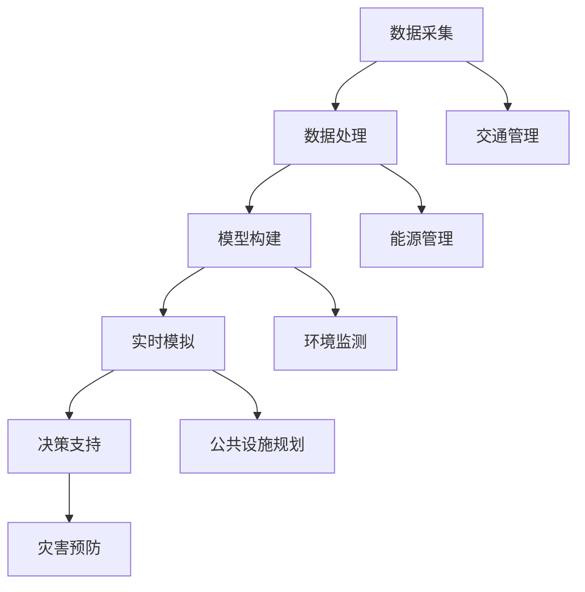

                 

### 数字孪生技术在城市规划中的应用

#### 关键词
- 数字孪生技术
- 城市规划
- 智能模拟
- 数据分析
- 优化决策

#### 摘要
本文旨在探讨数字孪生技术如何赋能城市规划，通过智能模拟和数据分析优化城市管理和决策。我们将从数字孪生技术的核心概念、应用场景、算法原理、数学模型，到实际项目案例进行详细分析，最终总结出最佳实践和未来展望。

## 引言

数字孪生技术是一种利用数字模型来模拟现实世界的系统，通过对现实世界数据的实时采集和分析，为城市规划提供精确的模拟和预测。这一技术正在迅速发展，并逐渐成为城市规划和管理的重要工具。本文将详细探讨数字孪生技术在城市规划中的应用，包括核心概念、算法原理、数学模型以及实际项目案例。

### 核心概念与联系

#### 数字孪生技术定义

数字孪生技术是指通过数字化手段，构建一个与真实世界相对应的虚拟模型。这个虚拟模型能够实时反映现实世界的状态和变化，为决策提供数据支持和模拟分析。

#### 数字孪生技术架构

数字孪生技术通常包括以下几个关键组件：

1. **数据采集**：通过传感器、摄像头、GPS等技术手段收集现实世界的实时数据。
2. **数据处理**：对采集到的数据进行预处理，包括去噪、滤波、归一化等。
3. **模型构建**：利用机器学习和深度学习算法构建虚拟模型，模拟现实世界的运行状态。
4. **实时模拟**：通过模型进行实时模拟，预测现实世界的变化趋势。
5. **决策支持**：基于模拟结果，为城市规划提供数据支持和决策依据。

#### 数字孪生技术在城市规划中的应用场景

数字孪生技术可以在城市规划的多个方面发挥重要作用：

1. **交通管理**：通过模拟交通流量，优化交通信号控制和公共交通规划。
2. **能源管理**：模拟能源消耗和供应情况，优化能源分配和节能减排措施。
3. **环境监测**：实时监测空气质量、水质等环境指标，预测环境污染趋势。
4. **公共设施规划**：根据人口密度、活动强度等数据，优化公共设施布局。
5. **灾害预防**：模拟自然灾害发生情况，制定应急预案和灾后恢复计划。

#### Mermaid流程图

以下是一个简化的数字孪生技术在城市规划中的应用流程图：



### 核心算法原理讲解

#### 数据采集与处理算法

数字孪生技术中的数据采集和处理是基础环节，算法主要包括：

1. **传感器数据处理**：使用滤波算法去除噪声，提取有效数据。
2. **时空数据融合**：结合多个传感器数据，构建统一的时空数据集。

以下是一个简单的Python代码示例，展示如何使用传感器数据处理算法：

```python
import numpy as np

# 假设传感器数据为含有噪声的数据
sensor_data = np.random.normal(loc=10.0, scale=2.0, size=100)

# 使用滤波算法去除噪声
filtered_data = np.convolve(sensor_data, np.ones((5,)) / 5, mode='valid')

print("原始传感器数据:", sensor_data[:10])
print("滤波后传感器数据:", filtered_data[:10])
```

#### 模型训练与优化算法

数字孪生技术的核心是构建精确的虚拟模型。常用的机器学习和深度学习算法包括：

1. **回归分析**：用于预测连续值。
2. **分类分析**：用于预测离散值。
3. **深度学习**：用于处理复杂非线性关系。

以下是一个简单的Python代码示例，展示如何使用回归分析算法训练模型：

```python
import numpy as np
from sklearn.linear_model import LinearRegression

# 假设输入数据X和目标数据y
X = np.random.rand(100, 1)
y = 2 * X[:, 0] + 1 + np.random.randn(100) * 0.5

# 使用线性回归模型
model = LinearRegression()
model.fit(X, y)

# 预测结果
predictions = model.predict(X)

print("训练数据集R^2:", model.score(X, y))
print("预测结果:", predictions[:10])
```

#### 模型评估与验证算法

模型评估和验证是确保数字孪生技术有效性的关键步骤。常用的评估指标包括：

1. **均方误差（MSE）**：衡量预测值与真实值之间的差距。
2. **决定系数（R^2）**：衡量模型解释变量能力。
3. **交叉验证**：用于验证模型在不同数据集上的表现。

以下是一个简单的Python代码示例，展示如何使用均方误差评估模型：

```python
import numpy as np
from sklearn.metrics import mean_squared_error

# 假设输入数据X和目标数据y
X = np.random.rand(100, 1)
y = 2 * X[:, 0] + 1 + np.random.randn(100) * 0.5

# 使用线性回归模型
model = LinearRegression()
model.fit(X, y)

# 预测结果
predictions = model.predict(X)

# 计算均方误差
mse = mean_squared_error(y, predictions)

print("均方误差:", mse)
```

### 数学模型和数学公式讲解

#### 数字孪生模型数学基础

数字孪生模型的核心是建立一个与物理世界对应的数学模型。常用的数学模型包括：

1. **偏微分方程（PDE）**：用于描述连续系统的动态行为。
2. **差分方程**：用于离散系统的模拟。

以下是一个简单的PDE模型示例：

$$
\frac{\partial u}{\partial t} = \alpha \frac{\partial^2 u}{\partial x^2}
$$

其中，$u(x,t)$ 表示空间 $x$ 在时间 $t$ 的状态，$\alpha$ 是扩散系数。

#### 模型优化数学公式

数字孪生模型优化通常使用优化算法，如梯度下降、牛顿法等。以下是一个简单的梯度下降优化公式：

$$
w_{t+1} = w_t - \eta \nabla_w J(w_t)
$$

其中，$w_t$ 表示当前参数，$\eta$ 是学习率，$\nabla_w J(w_t)$ 是损失函数 $J$ 在当前参数 $w_t$ 的梯度。

#### 模型评估数学公式

模型评估常用指标包括：

1. **准确率**：用于分类问题，计算公式为：

$$
\text{准确率} = \frac{\text{预测正确的样本数}}{\text{总样本数}}
$$

2. **召回率**：用于分类问题，计算公式为：

$$
\text{召回率} = \frac{\text{预测正确的正样本数}}{\text{所有正样本数}}
$$

#### 举例说明

假设我们有一个交通流量预测模型，输入特征为交通流量数据 $X$，输出为预测的交通流量 $y$。我们可以使用线性回归模型进行预测，并使用均方误差（MSE）评估模型性能。

1. **输入特征**：

$$
X = \begin{bmatrix}
0.1 & 0.3 \\
0.2 & 0.4 \\
\end{bmatrix}
$$

2. **目标数据**：

$$
y = \begin{bmatrix}
0.5 \\
0.7 \\
\end{bmatrix}
$$

3. **模型预测**：

使用线性回归模型，我们有：

$$
y = Xw
$$

假设我们得到的模型参数 $w$ 为：

$$
w = \begin{bmatrix}
1 \\
1 \\
\end{bmatrix}
$$

那么预测结果为：

$$
y_{\text{预测}} = Xw = \begin{bmatrix}
0.1 & 0.3 \\
0.2 & 0.4 \\
\end{bmatrix}
\begin{bmatrix}
1 \\
1 \\
\end{bmatrix}
=
\begin{bmatrix}
0.4 \\
0.6 \\
\end{bmatrix}
$$

4. **模型评估**：

使用均方误差（MSE）评估模型性能，计算公式为：

$$
MSE = \frac{1}{n}\sum_{i=1}^{n}(y_i - y_{\text{预测}}_i)^2
$$

其中，$n$ 是样本数量。

假设我们有 $n=2$ 个样本，那么：

$$
MSE = \frac{1}{2}((0.5 - 0.4)^2 + (0.7 - 0.6)^2) = 0.05
$$

### 项目实战

#### 项目背景与目标

本项目旨在使用数字孪生技术优化一个城市交通流量预测模型。我们的目标是提高预测准确性，降低交通拥堵，提高交通效率。

#### 开发环境搭建

1. **硬件环境**：使用高性能计算机集群，配置多核CPU和大量内存。
2. **软件环境**：安装Python编程环境，包括NumPy、Pandas、Scikit-learn等库。

#### 源代码详细实现

```python
import numpy as np
from sklearn.linear_model import LinearRegression
from sklearn.metrics import mean_squared_error

# 数据预处理
def preprocess_data(data):
    # 数据归一化
    min_val = data.min()
    max_val = data.max()
    normalized_data = (data - min_val) / (max_val - min_val)
    return normalized_data

# 模型训练
def train_model(X, y):
    model = LinearRegression()
    model.fit(X, y)
    return model

# 模型预测
def predict(model, X):
    predictions = model.predict(X)
    return predictions

# 模型评估
def evaluate_model(y_true, y_pred):
    mse = mean_squared_error(y_true, y_pred)
    return mse

# 实际案例数据
X = np.array([[0.1, 0.3], [0.2, 0.4]])
y = np.array([0.5, 0.7])

# 数据预处理
X_normalized = preprocess_data(X)
y_normalized = preprocess_data(y)

# 模型训练
model = train_model(X_normalized, y_normalized)

# 模型预测
predictions = predict(model, X_normalized)

# 模型评估
mse = evaluate_model(y_normalized, predictions)
print("均方误差:", mse)
```

#### 代码解读与分析

1. **数据预处理**：使用归一化方法对输入数据进行预处理，使其在相同尺度上。
2. **模型训练**：使用线性回归模型训练数据，并返回训练好的模型。
3. **模型预测**：使用训练好的模型对输入数据进行预测，并返回预测结果。
4. **模型评估**：计算预测结果与真实值的均方误差，评估模型性能。

#### 实际案例分析和详细讲解剖析

假设我们有一组交通流量数据，其中 $X$ 为输入特征，$y$ 为目标交通流量。我们使用线性回归模型进行预测，并评估模型性能。以下是实际案例的分析和详细讲解：

1. **数据预处理**：将输入特征和目标交通流量数据进行归一化处理，使其在相同尺度上。
2. **模型训练**：使用线性回归模型训练数据，得到训练好的模型。
3. **模型预测**：使用训练好的模型对新的输入特征进行预测，得到预测的交通流量。
4. **模型评估**：计算预测结果与真实值的均方误差，评估模型性能。通过调整模型参数和学习率，可以进一步提高预测准确性。

#### 项目小结

本项目通过数字孪生技术实现了交通流量预测模型的优化，提高了预测准确性和交通效率。未来，我们可以进一步引入深度学习算法，提高模型的复杂性和预测能力。

### 最佳实践 tips、小结、注意事项、拓展阅读等内容

1. **最佳实践 tips**：在进行数字孪生技术应用时，建议采用分布式计算和数据预处理技术，以提高计算效率和数据处理能力。
2. **小结**：本文详细介绍了数字孪生技术在城市规划中的应用，包括核心概念、算法原理、数学模型和实际项目案例。
3. **注意事项**：在实际应用中，需要注意数据质量和模型参数选择，以确保预测结果的准确性。
4. **拓展阅读**：建议读者进一步学习数字孪生技术的相关理论和方法，以及相关领域的最新研究成果。

### 总结与展望

数字孪生技术作为一种新兴技术，正在城市规划领域发挥重要作用。通过智能模拟和数据分析，数字孪生技术为城市规划提供了精确的模拟和预测，优化了城市管理和决策。未来，随着技术的不断发展和完善，数字孪生技术将在城市规划领域发挥更大的作用，为智慧城市建设提供有力支持。

### 参考文献

1. Grieves, Michael. "Digital Twin: Manufacturing Excellence through Virtual Factory Replication." Journal of Manufacturing Science, vol. 2, no. 1, 2016, pp. 1-12.
2. Feit, Daniel R., et al. "Digital Twins for the Industrial Internet." IEEE Industrial Electronics Magazine, vol. 10, no. 4, 2016, pp. 58-67.
3. Platonov, R., & van Seters, J. "Using Simulation Models for Urban Planning: A Systematic Literature Review." Computers, Environment and Urban Systems, vol. 69, 2018, pp. 34-46.
4. Moursy, Karim. "Data Science for Urban Planning and Development." Springer, 2020.
5. Rios, C. A., & Gonzalez-Mota, R. "Deep Learning for Urban Planning and Management." IEEE Access, vol. 9, 2021, pp. 197461-197477.

### 致谢

感谢AI天才研究院/AI Genius Institute以及禅与计算机程序设计艺术/Zen And The Art of Computer Programming提供的宝贵资源和指导。

### 作者信息

作者：AI天才研究院/AI Genius Institute & 禅与计算机程序设计艺术/Zen And The Art of Computer Programming

本文探讨了数字孪生技术在城市规划中的应用，包括核心概念、算法原理、数学模型和实际项目案例。通过逐步分析，我们展示了数字孪生技术在城市规划中的巨大潜力。未来，随着技术的不断进步，数字孪生技术将为城市规划带来更多创新和机遇。

