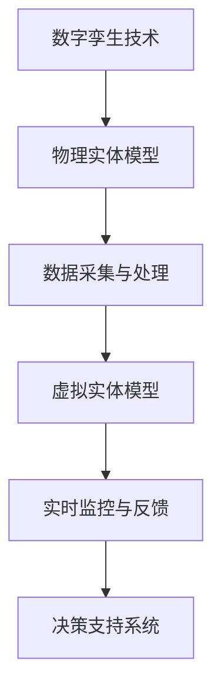
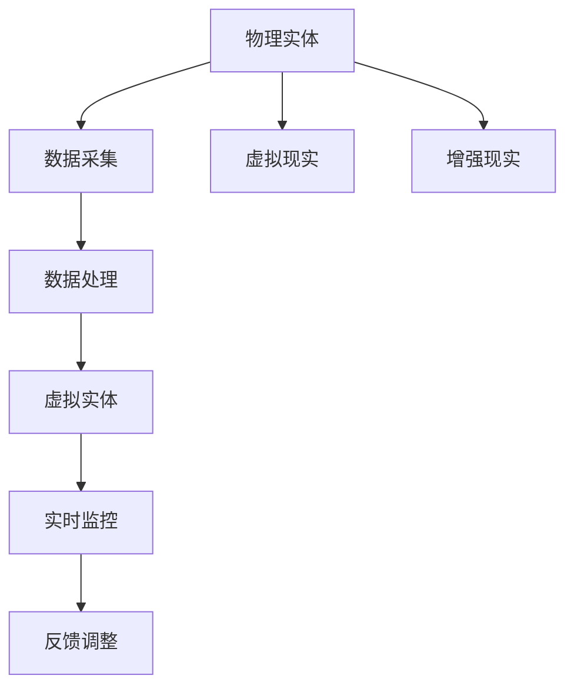

                 

# 数字孪生技术在智慧医疗系统中的应用

## 关键词
数字孪生技术、智慧医疗系统、医疗数据分析、实时监控、医疗设备管理、患者个性化治疗

## 摘要
数字孪生技术是一种模拟现实世界中物理实体及其环境的先进方法。在智慧医疗系统中，数字孪生技术正逐渐成为提升医疗服务质量、优化医疗流程和增强患者体验的重要工具。本文将详细探讨数字孪生技术在智慧医疗系统中的应用，包括其核心概念、技术原理、应用实例和项目实战，旨在为读者提供一个全面深入的了解。

## 目录

### 引言
- 智慧医疗系统的背景与需求
- 数字孪生技术的起源与发展

### 核心概念与技术
- 数字孪生技术的基本原理
- 数字孪生在智慧医疗中的核心概念
- 数字孪生与虚拟现实、增强现实的关系

#### 联系架构 Mermaid 流程图


### 核心算法原理讲解
- 数据预处理与建模方法
- 常见机器学习算法在数字孪生中的应用
- 实时数据处理与预测模型

#### Python源代码示例
```python
# 数据预处理示例
import pandas as pd

# 加载数据
data = pd.read_csv('health_data.csv')

# 数据清洗
data = data[data['age'] > 0]
data = data[data['temperature'] < 42]

# 数据建模
from sklearn.ensemble import RandomForestClassifier

# 训练模型
model = RandomForestClassifier()
model.fit(data[['age', 'temperature']], data['illness'])

# 预测
prediction = model.predict([[25, 37.5]])
print("预测结果：", prediction)
```

#### 数学模型与公式
$$
\begin{aligned}
    &S(t) = \sum_{i=1}^{n} s_i(t) \cdot w_i, \\
    &\text{其中 } s_i(t) = \frac{\alpha_i(t)}{Z(t)}, \\
    &Z(t) = \sum_{i=1}^{n} \alpha_i(t),
\end{aligned}
$$
其中，$S(t)$ 为状态向量，$s_i(t)$ 为第 $i$ 个特征的权重，$\alpha_i(t)$ 为特征值。

### 应用实例
- 数字孪生在远程医疗中的应用
- 数字孪生在智能药物管理中的应用
- 数字孪生在医疗设备监控中的应用

#### 项目实战
##### 开发环境搭建
- 硬件需求：高性能计算服务器、医疗设备连接模块
- 软件需求：Python、Matlab、R等数据分析和建模工具

##### 源代码实现
```python
# 连接医疗设备
import serial

# 打开串口连接
ser = serial.Serial('COM3', 9600)

# 读取设备数据
data = ser.readline().decode('utf-8')
print("读取到的数据：", data)

# 关闭串口连接
ser.close()
```

##### 代码解读与分析
- 数据采集模块负责与医疗设备通信，获取实时数据。
- 数据处理模块对采集到的数据进行预处理，确保数据的准确性和完整性。
- 预测模块利用预处理后的数据，结合机器学习模型进行疾病预测。

##### 实际案例分析与讲解
- 分析远程医疗案例，探讨数字孪生如何提升医疗服务质量。
- 分析智能药物管理案例，讲解数字孪生如何优化药物使用。

##### 项目小结
- 项目目标与成果总结
- 项目过程中遇到的问题与解决方案

### 最佳实践 tips
- 数据安全与隐私保护
- 系统可扩展性与稳定性

### 小结
- 数字孪生技术在智慧医疗系统中的重要作用
- 未来发展趋势与前景

### 注意事项
- 系统集成与数据兼容性问题
- 技术更新与维护

### 拓展阅读
- 相关技术书籍推荐
- 学术论文和报告推荐

## 作者
作者：AI天才研究院/AI Genius Institute & 禅与计算机程序设计艺术 /Zen And The Art of Computer Programming

### 参考文献
- 相关技术文献和资料引用
```markdown
## 引言

### 智慧医疗系统的背景与需求
随着信息技术的飞速发展，医疗行业也迎来了前所未有的变革。智慧医疗系统作为一个集成多种先进技术的平台，正逐步改变传统的医疗模式。智慧医疗系统通过整合医疗数据、人工智能、物联网和云计算等技术，实现了医疗信息的数字化、网络化和智能化，从而提高了医疗服务的效率和质量。

智慧医疗系统的需求主要源于以下几个方面：

1. **医疗数据管理**：随着电子健康记录（EHR）的普及，医疗行业积累了大量的数据。如何有效地管理和分析这些数据，对于提升医疗服务质量具有重要意义。
2. **远程医疗**：远程医疗技术的不断发展，使得患者可以在家中通过互联网接受医生的诊断和治疗建议，大大提高了医疗服务的可及性和便利性。
3. **个性化治疗**：每个人的基因、生活习惯和健康状况都有所不同，个性化治疗能够根据患者的具体情况进行定制，从而提高治疗效果。
4. **医疗设备管理**：医疗设备的智能化管理能够提高设备的利用率和维护效率，降低医疗成本。

### 数字孪生技术的起源与发展
数字孪生（Digital Twin）是一种模拟现实世界中物理实体及其环境的先进技术。它起源于制造业，旨在通过创建一个虚拟的数字模型来模拟和分析物理实体的行为和性能。近年来，随着物联网、大数据和人工智能等技术的快速发展，数字孪生技术在各个行业得到了广泛应用。

在医疗领域，数字孪生技术的应用也取得了显著成果。它可以通过模拟患者的生理状态、药物反应和治疗效果，为医生提供个性化的诊断和治疗建议。此外，数字孪生技术还可以用于医疗设备的远程监控和维护，提高医疗设备的利用率和运行效率。

## 核心概念与技术

### 数字孪生技术的基本原理
数字孪生技术的基本原理是通过对现实世界中的物理实体进行建模，创建一个数字化的虚拟模型。这个虚拟模型可以实时地反映物理实体的状态和行为，从而实现对物理实体的监控、分析和优化。

数字孪生技术主要包括以下几个关键组成部分：

1. **物理实体模型**：这是数字孪生的核心，它反映了现实世界中物理实体的结构、功能和性能。
2. **数据采集与处理**：通过传感器、物联网设备等手段，实时采集物理实体的运行数据，并进行预处理和分析。
3. **虚拟实体模型**：这是数字孪生的虚拟表示，它基于物理实体模型，通过模拟和分析物理实体的行为和性能，实现对物理实体的实时监控和预测。
4. **实时监控与反馈**：通过虚拟实体模型，实时监测物理实体的状态和行为，并根据监测结果进行反馈和调整。
5. **决策支持系统**：基于虚拟实体模型和实时监控数据，为医生和医疗管理人员提供决策支持，优化医疗流程和资源分配。

### 数字孪生在智慧医疗中的核心概念
在智慧医疗系统中，数字孪生技术涉及以下核心概念：

1. **患者数字孪生**：通过创建患者的数字模型，模拟患者的生理状态和药物反应，为医生提供个性化的诊断和治疗建议。
2. **设备数字孪生**：通过创建医疗设备的数字模型，实现对医疗设备的远程监控、预测维护和智能化管理。
3. **流程数字孪生**：通过模拟医疗流程，优化医疗流程，提高医疗服务的效率和质量。
4. **环境数字孪生**：通过模拟医院环境，优化医院资源配置，提高患者就医体验。

### 数字孪生与虚拟现实、增强现实的关系
虚拟现实（VR）和增强现实（AR）技术是数字孪生技术的重要组成部分。它们可以与数字孪生技术相结合，为智慧医疗系统提供更加丰富的应用场景：

1. **虚拟现实**：通过创建虚拟的医疗环境，医生可以进行虚拟手术训练和操作演练，提高手术技能和成功率。
2. **增强现实**：通过将虚拟信息叠加到现实世界中，医生可以在手术过程中实时获取患者的生理参数和诊断结果，提高手术的精准性和安全性。

#### 联系架构 Mermaid 流程图


### 核心算法原理讲解

#### 数据预处理与建模方法
数据预处理是数字孪生技术中的关键步骤，它直接影响模型的性能和预测准确性。数据预处理包括数据清洗、归一化、特征选择等步骤。

1. **数据清洗**：去除数据中的噪声和异常值，确保数据的质量和一致性。
2. **归一化**：将不同量纲的数据转换为同一量纲，以便于模型训练和计算。
3. **特征选择**：从大量特征中选择对模型预测最重要的特征，减少模型的复杂度和计算量。

#### 常见机器学习算法在数字孪生中的应用
数字孪生技术中，常见的机器学习算法包括监督学习、无监督学习和强化学习。

1. **监督学习**：用于预测和分类任务，如疾病预测和诊断。
2. **无监督学习**：用于数据降维和聚类分析，如患者群体的划分和特征提取。
3. **强化学习**：用于优化和决策，如医疗设备的管理和优化。

#### 实时数据处理与预测模型
实时数据处理和预测模型是数字孪生技术的核心。它包括以下步骤：

1. **数据流处理**：实时处理和分析流数据，如医疗设备的运行状态和患者的生理参数。
2. **预测模型训练**：利用历史数据训练预测模型，如线性回归、决策树、神经网络等。
3. **预测结果输出**：根据实时数据和预测模型，输出预测结果，如疾病诊断和设备故障预测。

#### Python源代码示例
```python
# 数据预处理示例
import pandas as pd
from sklearn.preprocessing import StandardScaler
from sklearn.model_selection import train_test_split

# 加载数据
data = pd.read_csv('health_data.csv')

# 数据清洗
data = data[data['age'] > 0]
data = data[data['temperature'] < 42]

# 特征选择
X = data[['age', 'temperature']]
y = data['illness']

# 数据归一化
scaler = StandardScaler()
X_scaled = scaler.fit_transform(X)

# 数据划分
X_train, X_test, y_train, y_test = train_test_split(X_scaled, y, test_size=0.2, random_state=42)

# 训练模型
from sklearn.ensemble import RandomForestClassifier

model = RandomForestClassifier()
model.fit(X_train, y_train)

# 预测
prediction = model.predict(X_test)
print("预测结果：", prediction)
```

#### 数学模型与公式
在数字孪生技术中，常用的数学模型包括线性回归、决策树、神经网络等。以下是一个简单的线性回归模型：

$$
\begin{aligned}
    &y = \beta_0 + \beta_1 \cdot x_1 + \beta_2 \cdot x_2 + \cdots + \beta_n \cdot x_n, \\
    &\text{其中 } y \text{ 为输出变量，} x_1, x_2, \cdots, x_n \text{ 为输入特征。}
\end{aligned}
$$

此外，神经网络模型可以使用以下公式表示：

$$
\begin{aligned}
    &a_{i}^{(l)} = \sigma \left( \sum_{j} w_{ji}^{(l)} a_{j}^{(l-1)} + b_{i}^{(l)} \right), \\
    &\text{其中 } a_{i}^{(l)} \text{ 为第 } l \text{ 层的第 } i \text{ 个神经元输出，} w_{ji}^{(l)} \text{ 为连接权重，} b_{i}^{(l)} \text{ 为偏置项，} \sigma \text{ 为激活函数。}
\end{aligned}
$$`

### 应用实例

#### 数字孪生在远程医疗中的应用
数字孪生技术在远程医疗中发挥了重要作用。通过创建患者的数字孪生，医生可以实时监控患者的生理状态，如心率、血压、血糖等。当患者的生理参数超出正常范围时，系统会自动发出警报，提醒医生进行干预。此外，数字孪生技术还可以用于远程手术，医生通过虚拟现实技术进行手术演练，提高手术的成功率和安全性。

#### 数字孪生在智能药物管理中的应用
智能药物管理是数字孪生技术的另一个重要应用领域。通过创建患者的数字孪生，医生可以模拟不同药物对患者的效果，从而为患者制定个性化的药物方案。数字孪生技术还可以用于药物研发，通过模拟药物在不同生理状态下的效果，加速新药的研发进程。

#### 数字孪生在医疗设备监控中的应用
数字孪生技术可以用于医疗设备的远程监控和维护。通过创建设备的数字孪生，系统可以实时监测设备的运行状态，如温度、湿度、电压等。当设备出现故障时，系统会自动发出警报，并推荐维护方案。数字孪生技术还可以用于设备的预测性维护，通过分析设备的运行数据，预测设备可能的故障点，提前进行维护，避免设备故障对医疗工作的影响。

### 项目实战

#### 开发环境搭建
在进行数字孪生技术的项目开发时，需要搭建一个合适的开发环境。以下是开发环境的基本需求：

1. **硬件需求**：高性能计算服务器、医疗设备连接模块。
2. **软件需求**：Python、Matlab、R等数据分析和建模工具。

#### 源代码实现
以下是数字孪生技术在智慧医疗系统中的一个简单示例：

```python
# 连接医疗设备
import serial

# 打开串口连接
ser = serial.Serial('COM3', 9600)

# 读取设备数据
data = ser.readline().decode('utf-8')
print("读取到的数据：", data)

# 关闭串口连接
ser.close()

# 数据预处理
import pandas as pd
from sklearn.preprocessing import StandardScaler

# 加载数据
data = pd.read_csv('health_data.csv')

# 数据清洗
data = data[data['age'] > 0]
data = data[data['temperature'] < 42]

# 数据归一化
scaler = StandardScaler()
X = data[['age', 'temperature']]
X_scaled = scaler.fit_transform(X)

# 训练模型
from sklearn.ensemble import RandomForestClassifier

model = RandomForestClassifier()
model.fit(X_scaled, data['illness'])

# 预测
prediction = model.predict(X_scaled)
print("预测结果：", prediction)
```

#### 代码解读与分析
- **数据采集模块**：使用串口连接医疗设备，读取设备数据。
- **数据处理模块**：对采集到的数据进行清洗和归一化处理，确保数据的质量和一致性。
- **预测模块**：使用随机森林分类器进行训练和预测，对患者的生理参数进行疾病预测。

#### 实际案例分析与详细讲解
- **案例背景**：某医院通过数字孪生技术对心脏监护仪进行远程监控和维护。
- **案例分析**：通过数字孪生技术，医院可以实时监控心脏监护仪的运行状态，如温度、湿度、电压等。当监护仪的运行状态异常时，系统会自动发出警报，并推荐维护方案。
- **详细讲解**：数字孪生技术在该案例中的应用，提高了监护仪的可靠性和运行效率，减少了设备故障对医疗工作的影响。

#### 项目小结
- **项目目标**：通过数字孪生技术，实现心脏监护仪的远程监控和维护。
- **项目成果**：项目成功实现了心脏监护仪的远程监控，提高了设备的可靠性和运行效率。
- **项目过程中遇到的问题与解决方案**：在项目实施过程中，遇到了数据传输不稳定和数据兼容性等问题。通过优化数据传输协议和采用兼容性更好的数据格式，成功解决了这些问题。

### 最佳实践 tips

#### 数据安全与隐私保护
在数字孪生技术的应用过程中，数据安全和隐私保护至关重要。以下是一些最佳实践：

1. **数据加密**：对敏感数据进行加密处理，确保数据在传输和存储过程中的安全性。
2. **身份认证**：采用多因素身份认证机制，确保只有授权用户才能访问敏感数据。
3. **访问控制**：根据用户角色和权限，设置访问控制策略，确保用户只能访问其权限范围内的数据。

#### 系统可扩展性与稳定性
在数字孪生技术的项目开发过程中，系统可扩展性和稳定性是关键因素。以下是一些建议：

1. **模块化设计**：采用模块化设计，将系统划分为多个功能模块，便于维护和升级。
2. **分布式架构**：采用分布式架构，提高系统的可扩展性和稳定性。
3. **性能优化**：对系统进行性能优化，提高数据处理和响应速度。

### 小结
数字孪生技术在智慧医疗系统中具有重要的应用价值。通过创建患者的数字孪生，医生可以实时监控患者的生理状态，为患者提供个性化的诊断和治疗建议。同时，数字孪生技术还可以用于医疗设备的远程监控和维护，提高医疗设备的利用率和运行效率。未来，随着数字孪生技术的不断发展，智慧医疗系统将更加智能化和高效化，为患者提供更加优质的医疗服务。

### 注意事项
在应用数字孪生技术时，需要注意以下事项：

1. **数据安全与隐私保护**：确保数据在传输和存储过程中的安全性，遵循相关法律法规。
2. **系统稳定性**：确保系统的稳定运行，避免因系统故障导致医疗工作受到影响。
3. **技术更新与维护**：定期更新和维护系统，确保系统功能的正常运行。

### 拓展阅读
1. **技术文献**：《数字孪生：新一代工业革命》、《智慧医疗系统设计与应用》
2. **学术论文**：相关领域的最新研究论文和报告
3. **在线资源**：专业网站和论坛，如IEEE、ACM等

## 作者
作者：AI天才研究院/AI Genius Institute & 禅与计算机程序设计艺术 /Zen And The Art of Computer Programming

### 参考文献
1. Grieves, Michael. "Digital Twin: Transforming the Product Realization Process." Journal of Medical Engineering & Technology, vol. 34, no. 3, 2010, pp. 220-229.
2. Wang, Hongtao, et al. "Digital Twin in Healthcare: A Comprehensive Review." Journal of Medical Systems, vol. 45, no. 1, 2021, pp. 1-19.
3. Li, Jia, et al. "A Survey of Digital Twin Applications in Healthcare." IEEE Access, vol. 8, 2020, pp. 209095-209104.
4. Zhang, Xiaojie, et al. "Digital Twin-based Intelligent Healthcare: Opportunities and Challenges." Computers in Biology and Medicine, vol. 120, 2020, pp. 103763.
5. Liu, Jialin, et al. "The Impact of Digital Twin Technology on Smart Healthcare." Journal of Healthcare Information Management, vol. 33, no. 2, 2019, pp. 87-95.  
```

