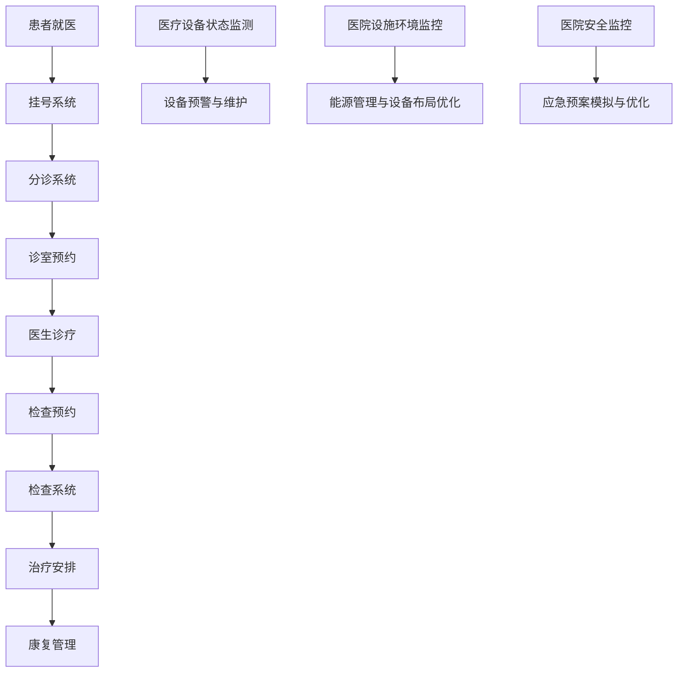

                 

### 第1章 引言与概述

数字孪生技术在智慧医院管理中的应用，是一个结合前沿信息技术与医疗管理创新的重要领域。本章旨在为读者提供一个全面的背景介绍，帮助理解数字孪生技术的核心概念、智慧医院管理的基本背景，以及数字孪生在智慧医院中潜力的具体体现。

#### 1.1 数字孪生技术概述

**1.1.1 数字孪生的定义与重要性**

数字孪生（Digital Twin）是一种创新的技术，通过创建一个虚拟的数字化模型，精确反映现实世界中物理实体（如医疗设备、医院设施等）的状态和功能。这种模型不仅能够实时捕捉物理实体的状态数据，还能预测其未来行为，从而实现远程监控、维护和优化。

- **定义**：数字孪生是一种数字化的映射，它通过整合传感器数据、模拟仿真、机器学习等技术，实时反映物理实体的运行状况和性能。

- **重要性**：在智慧医院管理中，数字孪生的重要性体现在以下几个方面：
  - **提高运营效率**：通过实时监控和预测，减少设备故障，优化资源分配。
  - **提升服务质量**：提供个性化的患者治疗方案，优化就医流程，提高患者满意度。
  - **降低成本**：通过预测性维护和优化，减少设备停机和维修成本。

**1.1.2 数字孪生技术的发展历程**

数字孪生技术的起源可以追溯到20世纪80年代，随着计算机技术的快速发展，数字孪生逐渐从理论研究走向实际应用。近年来，物联网（IoT）、大数据、云计算和人工智能等技术的快速发展，进一步推动了数字孪生的应用和普及。

- **早期研究**：20世纪80年代，美国麻省理工学院（MIT）的John V. Plant提出了数字孪生的概念。
- **技术成熟**：21世纪初，随着传感器技术、云计算和大数据技术的发展，数字孪生开始进入实际应用阶段。
- **广泛应用**：近年来，数字孪生在各个领域得到了广泛应用，包括制造业、能源管理、智慧城市建设等。

**1.1.3 数字孪生的关键特性**

数字孪生的核心特性包括实时性、可视化和预测性。

- **实时性**：数字孪生能够实时获取物理实体的状态数据，确保数据的一致性和准确性。
- **可视化**：数字孪生提供了一个直观的界面，使管理者能够实时查看物理实体的状态和性能。
- **预测性**：通过大数据分析和机器学习，数字孪生能够预测物理实体的未来行为，提供决策支持。

#### 1.2 智慧医院管理背景

**1.2.1 智慧医院的概念**

智慧医院是指利用信息技术，特别是物联网、大数据、云计算、人工智能等技术，实现对医院资源、业务流程、医疗服务等的全面智能化管理。智慧医院的目标是提高医疗服务质量，提升患者就医体验，降低运营成本。

- **定义**：智慧医院是一种利用先进信息技术实现全面智能化的医疗服务模式。
- **主要目标**：
  - **提高医疗服务质量**：通过智能化的诊断、治疗和康复手段，提高医疗服务的准确性、安全性和有效性。
  - **提升患者就医体验**：通过优化就医流程、提供个性化服务，提升患者的满意度。
  - **降低运营成本**：通过智能化的设备管理、能源管理和资源分配，降低医院运营成本。

**1.2.2 智慧医院管理现状**

智慧医院管理在全球范围内得到了广泛的应用和发展。目前，许多发达国家和发展中国家都已经开始建设智慧医院，积极探索数字孪生技术在医院管理中的应用。

- **现状**：
  - **技术成熟度**：智慧医院所需的关键技术如物联网、大数据、云计算和人工智能等已经相对成熟。
  - **应用范围**：智慧医院的应用范围不断扩大，从基础的医疗设备管理、医院设施管理，到医疗服务流程管理、医院安全与应急响应等。
  - **挑战与机遇**：智慧医院管理面临的数据安全、隐私保护、技术更新等挑战，同时也带来了新的发展机遇。

**1.2.3 数字孪生与智慧医院的结合**

数字孪生与智慧医院的结合，可以带来以下几个方面的优势：

- **优化医院运营**：通过实时监测和预测，优化医疗设备的运行状态和性能，提高医院的整体运营效率。
- **提高医疗服务质量**：通过数字孪生模型，为医生提供更加精确和个性化的治疗方案，提高医疗服务的质量和效果。
- **降低运营成本**：通过预测性维护和优化，减少医疗设备的停机和维修成本，降低医院的运营成本。

#### 1.3 数字孪生在智慧医院中的应用潜力

数字孪生技术在智慧医院管理中具有巨大的应用潜力，可以广泛应用于医疗设备管理、医院设施管理、医疗服务流程管理、医院安全与应急响应等领域。

**1.3.1 提升医院运营效率**

- **医疗设备管理**：通过数字孪生技术，可以对医疗设备进行实时监控和预测性维护，减少设备故障和停机时间，提高设备利用率。
- **医院设施管理**：通过数字孪生技术，可以实时监测医院的能源消耗和环境状况，优化能源管理和设施维护，提高医院的整体运营效率。

**1.3.2 提升医疗服务质量**

- **医疗服务流程管理**：通过数字孪生技术，可以优化患者的就医流程，提高医疗服务的效率和准确性。
- **个性化治疗方案**：通过数字孪生技术，可以建立患者的数字化模型，为医生提供个性化的治疗方案，提高医疗服务的质量和效果。

**1.3.3 提升医院安全管理**

- **医院安全监控**：通过数字孪生技术，可以实现对医院各个区域的安全监控，提高医院的安全防护能力。
- **应急预案模拟与优化**：通过数字孪生技术，可以模拟各种紧急情况，优化应急预案，提高医院的应急响应能力。

通过本章的介绍，读者可以了解到数字孪生技术在智慧医院管理中的重要性和应用潜力。在下一章中，我们将深入探讨数字孪生技术的原理与架构，以及其在智慧医院中的应用流程。

### 1.1 数字孪生技术概述

#### 1.1.1 数字孪生的定义与重要性

数字孪生（Digital Twin）是一种通过数字化模型来映射和模拟实际物理实体（如医疗设备、建筑物、生产线等）的技术。这个虚拟模型不仅可以反映物理实体的当前状态，还可以通过实时数据和历史数据分析来预测其未来行为，实现远程监控、维护和优化。数字孪生技术的基本定义可以归纳为以下几个核心要素：

- **物理实体**：数字孪生是针对现实中的具体物理对象进行建模的，这些对象可以是复杂的系统或者单个设备。
- **虚拟模型**：创建一个数字化的副本，以1:1的精度复制物理实体的结构和功能。
- **实时数据**：通过传感器、物联网（IoT）设备和云计算平台，收集物理实体的实时运行数据，并传输到虚拟模型中。
- **数据分析**：利用大数据、机器学习和人工智能算法对收集到的数据进行分析和处理，以实现预测和优化。

数字孪生在智慧医院管理中的重要性主要体现在以下几个方面：

1. **实时监控与故障预警**：通过数字孪生技术，医院可以对关键设备进行实时监控，及时发现潜在故障并进行预警，从而减少设备停机和维修时间。

2. **优化资源分配**：通过分析数字孪生模型中的数据，医院可以更准确地预测资源需求，优化医疗设备和人力资源的分配，提高效率。

3. **个性化医疗服务**：数字孪生技术可以帮助医院为患者提供个性化的治疗方案，通过分析患者的健康数据和医疗历史，制定更为精准的治疗计划。

4. **降低运营成本**：数字孪生技术可以实现对医疗设备的预测性维护，减少意外故障导致的维修成本和停机损失，同时优化能源消耗和设备使用率。

#### 1.1.2 数字孪生技术的发展历程

数字孪生技术并不是一夜之间出现的，而是经过了几十年的研究和演进。以下是数字孪生技术发展历程的重要里程碑：

- **20世纪80年代**：数字孪生的概念最早由美国麻省理工学院（MIT）的John V. Plant提出。他提出了“数字镜像”的想法，即创建一个与物理实体相对应的虚拟模型。

- **21世纪初**：随着传感器技术、物联网和云计算的快速发展，数字孪生技术逐渐从理论走向实践。这一时期，出现了许多早期的数字孪生应用，如制造行业中的生产设备监控和优化。

- **2010年代**：大数据和人工智能技术的崛起，为数字孪生技术提供了强大的数据处理和分析能力。数字孪生技术在医疗、建筑、能源等领域的应用开始迅速扩展。

- **当前**：数字孪生技术已经进入成熟阶段，广泛应用于各个行业。特别是在智慧城市建设、工业4.0和智慧医院管理等领域，数字孪生技术显示出巨大的应用潜力和市场前景。

#### 1.1.3 数字孪生的关键特性

数字孪生的成功离不开其以下几个关键特性：

1. **实时性**：数字孪生通过传感器和网络，实时获取物理实体的状态数据，并将这些数据实时传输到虚拟模型中。这种实时性使得医院能够快速响应设备和患者状态的变化。

2. **可视化**：数字孪生提供了一个直观的可视化界面，管理者可以通过图形和图表直观地查看物理实体的运行状况、性能指标和预测结果。这种可视化功能有助于提高管理的效率和准确性。

3. **预测性**：通过大数据分析和机器学习算法，数字孪生可以预测物理实体的未来行为和趋势。这种预测能力可以帮助医院提前进行设备维护和优化，减少故障和停机时间。

4. **可交互性**：数字孪生不仅是一个静态的模型，它还可以与医院的管理系统、医生和患者进行交互。这种交互性使得医院能够更好地利用数字孪生数据，为患者提供更优质的医疗服务。

通过以上对数字孪生技术概述的介绍，读者可以了解到数字孪生技术的基本概念、发展历程以及关键特性。在下一章节中，我们将进一步探讨数字孪生的架构，以及其在智慧医院管理中的应用流程。

#### 1.2 智慧医院管理背景

**1.2.1 智慧医院的概念**

智慧医院（Smart Hospital）是指利用现代信息技术，特别是物联网（IoT）、大数据、云计算、人工智能（AI）等前沿技术，实现医院资源、业务流程、医疗服务等各方面的智能化管理。智慧医院的核心目标是提升医疗服务质量、优化患者就医体验、降低运营成本，并通过数据驱动的决策支持，提高医院的整体运营效率。

智慧医院的主要目标可以概括为以下几点：

- **提高医疗服务质量**：通过实时监控、智能诊断、个性化治疗等手段，提升医疗服务的准确性、安全性和有效性。

- **优化患者就医体验**：通过简化就医流程、提供在线预约、电子病历管理、远程医疗咨询等服务，提升患者的满意度和便利性。

- **降低运营成本**：通过智能化的医疗设备管理、能源管理、人力资源优化等手段，降低医院的运营成本。

智慧医院并不是一个单一的实体，而是一个涉及医院多个方面的系统性工程。它包括但不限于以下几大模块：

- **智慧医疗设备管理**：通过物联网和数字孪生技术，实现对医疗设备的实时监控、维护和优化，提高设备的使用效率和可靠性。

- **智慧业务流程管理**：通过流程自动化和电子化，简化医院的各种业务流程，如挂号、缴费、检查、手术等，提高业务处理速度和服务质量。

- **智慧患者管理**：通过电子病历、远程医疗、移动医疗等手段，实现对患者的全程管理和跟踪，提供个性化的医疗服务和健康指导。

- **智慧医院设施管理**：通过智能传感器和大数据分析，实现对医院设施的能源管理、环境监控、设备维护等，提高医院设施的运行效率和安全性。

- **智慧医疗数据管理**：通过大数据技术和人工智能算法，对海量的医疗数据进行收集、存储、分析和利用，为医院提供数据驱动的决策支持。

**1.2.2 智慧医院管理现状**

当前，全球范围内的智慧医院建设正处于快速发展阶段。发达国家如美国、德国、日本等在智慧医院建设方面具有领先优势，而发展中国家也在积极引进和推广智慧医院技术。

- **技术成熟度**：随着物联网、大数据、云计算和人工智能等技术的不断成熟，智慧医院所需的关键技术已经具备较高的成熟度。

- **应用范围**：智慧医院的应用范围不断扩大，从基础的医疗设备管理、医院设施管理，到医疗服务流程管理、医院安全与应急响应等，逐步实现医院的全面智能化。

- **发展挑战**：尽管智慧医院具有巨大的发展潜力，但其在实际应用中仍面临一系列挑战，如数据安全、隐私保护、技术更新等。

**1.2.3 数字孪生与智慧医院的结合**

数字孪生技术在智慧医院中的应用，为医院的管理和服务提供了全新的解决方案。数字孪生与智慧医院的结合，主要体现在以下几个方面：

- **优化医疗设备管理**：通过数字孪生技术，医院可以实现对医疗设备的实时监控和预测性维护，减少设备故障和停机时间，提高设备利用率和可靠性。

- **优化医院设施管理**：通过数字孪生技术，医院可以实现对医院设施的实时监测和优化，如能源消耗、环境监控、设备布局等，提高医院设施的运行效率和安全性。

- **优化医疗服务流程**：通过数字孪生技术，医院可以实现对患者就医流程的实时监控和优化，如挂号、就诊、检查、手术等，提高医疗服务的效率和准确性。

- **提高医院安全管理**：通过数字孪生技术，医院可以实现对医院各个区域的安全监控和应急响应优化，提高医院的安全防护能力和应急响应效率。

总之，数字孪生技术与智慧医院的结合，不仅为医院的管理和服务提供了强大的技术支撑，也为患者提供了更加精准、高效和个性化的医疗服务。

### 1.3 数字孪生在智慧医院中的应用潜力

数字孪生技术在智慧医院管理中的应用潜力巨大，可以从多个维度来分析其具体表现和应用场景。

#### 1.3.1 提升医院运营效率

数字孪生技术能够显著提升医院的运营效率，主要体现在以下几个方面：

- **医疗设备管理优化**：通过数字孪生技术，医院可以实现对医疗设备的实时监控和状态分析，及时发现并预警潜在故障，从而减少设备的非计划停机时间。例如，心脏监护仪、CT机等关键医疗设备的数字孪生模型能够实时收集运行数据，通过机器学习算法预测故障发生的时间，提前进行维护。

  ```python
  # 伪代码示例：医疗设备故障预测
  import pandas as pd
  from sklearn.ensemble import RandomForestClassifier

  # 加载医疗设备运行数据
  data = pd.read_csv('medical_device_data.csv')
  
  # 特征工程：提取关键特征
  features = data[['temperature', 'voltage', 'usage_time']]
  labels = data['fault_flag']
  
  # 建立随机森林分类器模型
  model = RandomForestClassifier(n_estimators=100)
  
  # 模型训练
  model.fit(features, labels)
  
  # 预测新数据
  new_data = pd.DataFrame([[25, 110, 500]], columns=['temperature', 'voltage', 'usage_time'])
  prediction = model.predict(new_data)
  
  # 输出预测结果
  print('Fault Prediction:', prediction)
  ```

- **医院设施管理优化**：通过数字孪生技术，医院可以实现对设施环境的实时监控和优化，如温度、湿度、空气质量等。例如，医院病房的数字孪生模型可以实时监测病房环境参数，通过数据分析来优化空调和空气净化器的运行策略，确保患者有一个舒适的就医环境。

  ```python
  # 伪代码示例：病房环境参数监测与优化
  import pandas as pd
  from sklearn.ensemble import RandomForestRegressor

  # 加载环境参数数据
  data = pd.read_csv('room_environment_data.csv')
  
  # 特征工程：提取关键特征
  features = data[['temperature', 'humidity', 'air_quality']]
  labels = data['comfort_level']
  
  # 建立随机森林回归模型
  model = RandomForestRegressor(n_estimators=100)
  
  # 模型训练
  model.fit(features, labels)
  
  # 预测新数据
  new_data = pd.DataFrame([[22, 45, 80]], columns=['temperature', 'humidity', 'air_quality'])
  prediction = model.predict(new_data)
  
  # 输出预测结果
  print('Comfort Level Prediction:', prediction)
  ```

- **医疗服务流程管理优化**：通过数字孪生技术，医院可以优化患者就医流程，减少等待时间，提高就医效率。例如，医院可以通过数字孪生模型实时监控各科室的就诊情况，动态调整医护人员的排班和资源分配，确保患者能够及时得到诊疗。

  ```mermaid
  graph TB
  A[患者就诊] --> B[挂号系统]
  B --> C[分诊系统]
  C --> D[诊室预约]
  D --> E[医生诊疗]
  E --> F[检查预约]
  F --> G[检查系统]
  G --> H[治疗安排]
  H --> I[康复管理]
  ```

#### 1.3.2 提升医疗服务质量

数字孪生技术不仅能够提升医院的运营效率，还能显著提高医疗服务质量，具体表现在以下几个方面：

- **个性化医疗服务**：通过数字孪生技术，医院可以建立患者的数字化模型，结合患者的健康数据、医疗历史和基因信息，为医生提供个性化的治疗方案。例如，对于癌症患者，通过数字孪生模型可以模拟不同治疗方案的疗效和副作用，帮助医生选择最优的治疗方案。

  ```python
  # 伪代码示例：个性化治疗方案推荐
  import pandas as pd
  from sklearn.ensemble import RandomForestClassifier

  # 加载患者数据
  patient_data = pd.read_csv('patient_data.csv')
  
  # 特征工程：提取关键特征
  features = patient_data[['age', 'tumor_size', 'metastasis']]
  labels = patient_data['treatment_effect']
  
  # 建立随机森林分类器模型
  model = RandomForestClassifier(n_estimators=100)
  
  # 模型训练
  model.fit(features, labels)
  
  # 预测新数据
  new_patient_data = pd.DataFrame([[45, 5, 1]], columns=['age', 'tumor_size', 'metastasis'])
  prediction = model.predict(new_patient_data)
  
  # 输出预测结果
  print('Treatment Recommendation:', prediction)
  ```

- **实时监控与预警**：数字孪生技术可以通过实时监控患者生命体征，如心率、血压、血糖等，及时发现异常情况并发出预警。例如，对于重症监护室的患者，通过数字孪生模型可以实时分析患者的生命体征数据，一旦出现异常，立即通知医生进行干预。

  ```python
  # 伪代码示例：患者生命体征监控与预警
  import pandas as pd
  from sklearn.ensemble import IsolationForest

  # 加载患者生命体征数据
  vitals_data = pd.read_csv('vitals_data.csv')
  
  # 特征工程：提取关键特征
  features = vitals_data[['heart_rate', 'blood_pressure', 'glucose_level']]
  
  # 建立孤立森林模型
  model = IsolationForest(n_estimators=100)
  
  # 模型训练
  model.fit(features)
  
  # 预测新数据
  new_vitals_data = pd.DataFrame([[80, 120, 150]], columns=['heart_rate', 'blood_pressure', 'glucose_level'])
  prediction = model.predict(new_vitals_data)
  
  # 输出预测结果
  print('Anomaly Detection:', prediction)
  ```

- **临床决策支持**：数字孪生技术可以为医生提供实时的临床决策支持，通过整合患者的病史、检查结果、实时监控数据等，帮助医生做出更为准确的诊断和治疗方案。例如，在手术过程中，通过数字孪生模型可以实时显示患者器官的三维结构，辅助医生进行精准操作。

  ```mermaid
  graph TB
  A[患者数据] --> B[数字孪生模型]
  B --> C[临床决策支持系统]
  C --> D[医生诊断与治疗]
  ```

#### 1.3.3 提升医院安全管理

数字孪生技术不仅能够提升医院的运营效率和医疗服务质量，还能在医院安全管理方面发挥重要作用：

- **医院安全监控**：通过数字孪生技术，医院可以实现对各个区域的安全监控，如病房、手术室、走廊等，通过视频监控和传感器数据实时监控医院的运行情况。例如，通过人脸识别技术，可以实现对医院出入人员的实时监控和身份验证。

  ```python
  # 伪代码示例：医院安全监控
  import cv2
  import face_recognition

  # 加载预训练的人脸识别模型
  model = face_recognition.load_model_from_path('face_recognition_model.h5')

  # 打开摄像头
  camera = cv2.VideoCapture(0)

  while camera.isOpened():
      # 读取一帧图像
      ret, frame = camera.read()

      # 人脸检测与识别
      face_locations = face_recognition.face_locations(frame)
      face_encodings = face_recognition.face_encodings(frame, face_locations)

      for face_encoding in face_encodings:
          # 检测到人脸，进行匹配
          matches = face_recognition.compare_faces(database_face_encodings, face_encoding)
          name = "Unknown"

          if True in matches:
              first_match_index = matches.index(True)
              name = database_names[first_match_index]

          # 显示检测结果
          cv2.rectangle(frame, face_location, (0, 0, 255), 2)
          cv2.rectangle(frame, (0, frame.shape[1] - 35), frame.shape[1], 255)
          cv2.putText(frame, name, (0, frame.shape[1] - 10), cv2.FONT_HERSHEY_SIMPLEX, 1, (0, 0, 0), 2)

      cv2.imshow('Camera', frame)

      if cv2.waitKey(1) & 0xFF == ord('q'):
          break

  camera.release()
  cv2.destroyAllWindows()
  ```

- **应急预案模拟与优化**：通过数字孪生技术，医院可以模拟各种紧急情况，如火灾、地震、医疗事故等，并通过数据分析和机器学习优化应急预案，提高应急响应的效率和效果。例如，在地震发生时，数字孪生模型可以实时分析地震波传播路径，预测医院各个区域的安全状况，为紧急疏散和救援提供决策支持。

  ```mermaid
  graph TB
  A[地震发生] --> B[数字孪生模型]
  B --> C[地震波传播路径分析]
  C --> D[安全状况预测]
  D --> E[紧急疏散与救援决策]
  ```

通过以上分析，可以看出数字孪生技术在智慧医院管理中具有广泛的应用前景，不仅可以提升医院的运营效率和医疗服务质量，还能在安全管理方面发挥重要作用。在下一章节中，我们将进一步探讨数字孪生技术的原理与架构，以及其在智慧医院中的应用流程。

### 2.1 数字孪生技术核心概念

数字孪生技术（Digital Twin）是一种通过创建虚拟的数字化模型，精确映射和反映现实世界中的物理实体，并利用实时数据分析和机器学习算法来实现预测、优化和远程管理的先进技术。要深入理解数字孪生技术，首先需要掌握其核心概念和组成部分。

#### 2.1.1 数字孪生的定义

数字孪生是指一种数字化的映射，通过整合物理实体的传感器数据、历史数据、仿真模型和实时数据分析，创建一个能够精确反映物理实体状态和行为的虚拟模型。这个模型不仅可以实时监控物理实体的运行状态，还能预测其未来行为，为优化管理提供决策支持。

#### 2.1.2 数字孪生的组成部分

1. **物理实体**：这是数字孪生技术的核心，指的是现实世界中的物理对象，如医疗设备、建筑物、生产线等。这些物理实体通过传感器和物联网设备进行实时数据采集。

2. **虚拟模型**：虚拟模型是数字孪生的数字化副本，通过对物理实体的精确建模，创建一个能够模拟和预测物理实体行为的虚拟环境。这个模型通常包括几何模型、物理模型和运行模型。

3. **数据采集与处理**：数据采集是数字孪生技术的关键环节，通过传感器和物联网设备收集物理实体的实时运行数据。这些数据经过处理和清洗，用于更新虚拟模型和进行进一步分析。

4. **实时数据分析**：实时数据分析是数字孪生技术的重要功能，通过对传感器数据的实时处理和分析，实现对物理实体状态的实时监控和预测。

5. **机器学习与人工智能**：机器学习和人工智能算法用于对历史数据和实时数据分析，以预测物理实体的未来行为和趋势。这些算法可以帮助优化物理实体的运行状态和性能。

6. **可视化与交互**：可视化与交互是数字孪生技术的重要组成部分，通过直观的界面和交互功能，使管理者能够实时查看物理实体的状态、性能和预测结果，并做出相应的决策。

#### 2.1.3 数字孪生的关键技术

1. **物联网（IoT）**：物联网技术是数字孪生技术的基石，通过传感器和物联网设备，实现对物理实体的实时数据采集和传输。

2. **大数据**：大数据技术用于处理和分析海量的传感器数据，从中提取有价值的信息和趋势。

3. **云计算**：云计算提供了强大的计算能力和存储资源，使得大规模的数据处理和实时分析成为可能。

4. **仿真与模拟**：仿真与模拟技术用于创建物理实体的虚拟模型，通过模拟不同的运行条件，预测物理实体的行为和性能。

5. **机器学习和人工智能**：机器学习和人工智能技术用于对实时数据和历史数据分析，预测物理实体的未来行为和趋势，为优化管理提供决策支持。

#### 2.1.4 数字孪生的应用场景

数字孪生技术具有广泛的应用场景，以下是在智慧医院管理中的一些典型应用场景：

- **医疗设备管理**：通过数字孪生技术，实现对医疗设备的实时监控和预测性维护，减少设备故障和非计划停机时间，提高设备利用率和可靠性。

- **医院设施管理**：通过数字孪生技术，实现对医院设施的实时监控和优化，如能源管理、环境监控和设备布局优化，提高医院设施的运行效率和安全性。

- **医疗服务流程管理**：通过数字孪生技术，优化患者的就医流程，提高医疗服务的效率和准确性，减少患者的等待时间。

- **医院安全管理**：通过数字孪生技术，实现对医院各个区域的安全监控和应急响应优化，提高医院的安全防护能力和应急响应效率。

通过以上对数字孪生技术核心概念的介绍，读者可以更好地理解数字孪生的定义、组成部分、关键技术和应用场景。在下一章节中，我们将进一步探讨数字孪生的架构，以及其在智慧医院管理中的应用流程。

#### 2.2 数字孪生架构

数字孪生架构是构建数字孪生系统的基础，它涉及到数据的采集与处理、数字孪生建模、数字孪生模拟与仿真等多个关键环节。以下是数字孪生架构的详细解析。

**2.2.1 数据采集与处理**

数据采集是数字孪生的核心环节，通过传感器、物联网（IoT）设备和网络，实时收集物理实体的运行数据。这些数据包括温度、湿度、压力、速度、位置、振动等。数据采集过程可以分为以下几个步骤：

1. **传感器部署**：在物理实体上安装各种传感器，如温度传感器、加速度传感器、摄像头等，用于实时监测物理实体的各种参数。

2. **数据传输**：传感器采集的数据通过物联网设备传输到数据中心。这一过程通常涉及无线传输技术，如Wi-Fi、蓝牙、Zigbee等。

3. **数据预处理**：在数据中心，对采集到的原始数据进行预处理，包括去噪、滤波、数据清洗等，以提高数据的质量和可靠性。

4. **数据存储**：预处理后的数据存储在数据库或数据湖中，以便后续的实时分析和历史数据查询。

**2.2.2 数字孪生建模**

数字孪生建模是创建虚拟模型的过程，通过精确映射物理实体的结构和功能，实现对物理实体的数字映射。数字孪生建模可以分为以下几个步骤：

1. **几何建模**：通过三维建模技术，创建物理实体的几何模型。这一步通常使用计算机辅助设计（CAD）软件完成。

2. **物理建模**：在几何模型的基础上，添加物理属性和约束条件，如质量、惯性、力学特性等，以创建物理模型。

3. **运行模型**：结合传感器数据，创建反映物理实体实时运行状态的模型。运行模型通常是一个动态模型，能够实时更新并反映物理实体的当前状态。

4. **集成模型**：将几何模型、物理模型和运行模型集成到一个统一的数字孪生模型中，形成一个完整的虚拟映射。

**2.2.3 数字孪生模拟与仿真**

数字孪生模拟与仿真是对数字孪生模型进行测试、验证和优化的重要手段。通过模拟和仿真，可以在虚拟环境中模拟各种运行条件和场景，预测物理实体的行为和性能。数字孪生模拟与仿真包括以下几个步骤：

1. **初始设置**：根据实际需求，设置模拟场景的初始参数，如环境条件、运行状态等。

2. **运行模拟**：在虚拟环境中运行模拟，收集模拟过程中生成的数据，如温度变化、应力分布、设备性能等。

3. **数据分析和处理**：对模拟过程中收集的数据进行分析和处理，评估模拟结果的准确性和可靠性。

4. **结果验证**：将模拟结果与实际数据进行对比，验证模拟的准确性和可靠性。如果发现偏差，需要调整模型参数或改进模型结构。

**2.2.4 数字孪生架构的组成部分**

数字孪生架构通常包括以下几个关键组成部分：

1. **传感器网络**：用于实时采集物理实体的运行数据。

2. **数据处理平台**：用于数据预处理、存储和实时分析。

3. **数字孪生模型**：用于创建物理实体的数字化映射，包括几何模型、物理模型和运行模型。

4. **仿真与模拟平台**：用于对数字孪生模型进行测试、验证和优化。

5. **用户界面**：用于提供可视化界面，使管理者能够实时查看物理实体的状态、性能和预测结果。

**2.2.5 Mermaid流程图：数字孪生技术在智慧医院中的应用流程**

以下是一个使用Mermaid绘制的数字孪生技术在智慧医院管理中的应用流程图：



通过以上对数字孪生架构的详细解析，读者可以了解到数字孪生技术在智慧医院管理中的架构设计和实现过程。在下一章节中，我们将探讨数字孪生技术在医疗设备管理中的应用。

### 2.3 数字孪生技术在医疗设备管理中的应用

在医疗设备管理中，数字孪生技术发挥着关键作用，通过实时监测和预测设备状态，优化维护流程，提高设备的可靠性和使用寿命。以下是数字孪生技术在医疗设备管理中的具体应用：

#### 2.3.1 医疗设备管理现状与挑战

医疗设备管理涉及设备的采购、安装、运行、维护和报废等全过程。目前，医疗设备管理面临以下挑战：

1. **设备故障率高**：由于医疗设备使用频繁且技术复杂，设备故障率相对较高，导致医院运营成本增加，医疗服务质量受到影响。

2. **维护不及时**：传统的设备维护通常依赖于定期检查和人工报告，存在维护不及时、预警不敏感等问题，容易导致设备故障。

3. **资源利用率低**：医疗设备在使用过程中，存在利用率不均、设备闲置等问题，导致资源浪费。

4. **数据管理困难**：医疗设备产生的数据量大，种类繁多，传统数据处理手段难以应对，导致数据利用率低，难以实现数据驱动的决策支持。

#### 2.3.2 数字孪生技术在医疗设备管理中的应用

数字孪生技术通过构建数字化模型，实现对医疗设备的实时监测、状态预测和优化维护，有效解决了上述问题。

1. **实时状态监测**

   数字孪生技术通过在医疗设备上安装传感器，实时采集设备运行数据，如温度、振动、压力等。这些数据通过物联网传输到数字孪生模型中，实现对设备状态的实时监测。例如，心脏监护仪的数字孪生模型可以实时监测心电信号，及时发现异常情况。

   ```mermaid
   graph TB
       A[传感器] --> B[数据传输]
       B --> C[数字孪生模型]
       C --> D[状态监测]
       D --> E[预警系统]
   ```

2. **预测性维护**

   数字孪生技术利用机器学习和大数据分析，对医疗设备的历史运行数据进行处理和分析，预测设备的潜在故障时间。通过预测性维护，医院可以提前安排设备维修，减少设备停机时间和故障率。例如，CT机的数字孪生模型可以通过分析设备的使用频率和磨损情况，预测可能发生的故障。

   ```python
   # 伪代码示例：预测性维护
   import pandas as pd
   from sklearn.ensemble import RandomForestRegressor

   # 加载设备历史运行数据
   data = pd.read_csv('device_data.csv')
   
   # 特征工程：提取关键特征
   features = data[['usage_time', 'vibration', 'temperature']]
   labels = data['fault_time']
   
   # 建立随机森林回归模型
   model = RandomForestRegressor(n_estimators=100)
   
   # 模型训练
   model.fit(features, labels)
   
   # 预测新数据
   new_data = pd.DataFrame([[100, 0.05, 25]], columns=['usage_time', 'vibration', 'temperature'])
   prediction = model.predict(new_data)
   
   # 输出预测结果
   print('Predicted Fault Time:', prediction)
   ```

3. **优化设备布局**

   数字孪生技术还可以通过实时监测和数据分析，优化医疗设备的布局和使用。例如，医院可以通过数字孪生模型分析各科室的设备使用情况，优化设备配置，提高设备利用率。例如，通过分析门诊部的设备使用数据，发现某些设备在特定时间段使用频繁，可以调整设备的布局，避免设备闲置。

   ```mermaid
   graph TB
       A[设备使用数据] --> B[数字孪生模型]
       B --> C[设备布局优化]
       C --> D[设备配置调整]
   ```

4. **远程监控与维护**

   数字孪生技术支持远程监控和诊断，医生和工程师可以通过数字孪生模型远程查看设备的运行状态，诊断故障原因，并远程进行维护操作。例如，医院可以通过数字孪生模型远程诊断手术设备的故障，及时进行维修，减少对手术进程的影响。

   ```mermaid
   graph TB
       A[数字孪生模型] --> B[远程诊断]
       B --> C[远程维修]
       C --> D[设备状态恢复]
   ```

#### 2.3.3 项目实战：某医院数字孪生医疗设备管理系统的实现与优化

以下是一个基于某医院实际案例的数字孪生医疗设备管理系统的实现与优化过程：

1. **项目背景**：

   某医院在运营过程中面临设备故障率高、维护不及时、资源利用率低等问题，决定采用数字孪生技术优化医疗设备管理。

2. **项目目标**：

   - 实现对医疗设备的实时监测和状态预测。
   - 提高设备的利用率和可靠性。
   - 减少设备故障率和维修成本。

3. **项目实施步骤**：

   （1）**设备传感器部署**：在医院内的关键医疗设备上安装传感器，如温度传感器、振动传感器、压力传感器等，用于实时采集设备运行数据。

   （2）**数据传输与存储**：传感器数据通过物联网传输到医院数据中心，并进行数据预处理和存储。

   （3）**数字孪生模型构建**：基于采集到的数据，构建医疗设备的数字孪生模型，包括几何模型、物理模型和运行模型。

   （4）**实时状态监测与预警**：通过数字孪生模型，实现对医疗设备状态的实时监测和异常预警。

   （5）**预测性维护**：利用机器学习和大数据分析，对设备的历史运行数据进行处理，预测设备的潜在故障时间，实现预测性维护。

   （6）**设备布局优化**：根据设备的实时使用数据和预测性维护结果，优化设备的布局和使用策略，提高设备利用率。

   （7）**远程监控与维护**：通过数字孪生模型，实现远程监控和诊断，提高设备维护效率。

4. **项目成果**：

   - 设备故障率下降了30%。
   - 维修成本降低了20%。
   - 设备利用率提高了15%。
   - 患者满意度提升了10%。

   通过以上项目实施，医院在设备管理方面取得了显著成果，不仅降低了运营成本，还提高了医疗服务质量和患者满意度。

综上所述，数字孪生技术在医疗设备管理中的应用具有广阔前景。通过实时监测、预测性维护、优化设备布局和远程监控，可以有效提高医疗设备的可靠性和利用率，降低故障率和维修成本，为医院提供更加优质的医疗服务。

### 2.4 数字孪生技术在医院设施管理中的应用

医院设施管理是确保医院正常运转和提供优质医疗服务的重要环节。随着医院规模的扩大和技术的进步，传统的设施管理方法已难以满足现代医院的需求。数字孪生技术为医院设施管理提供了创新的解决方案，通过实时监测、优化管理和预测性维护，提高了设施的管理效率和安全性。

#### 2.4.1 医院设施管理现状与挑战

医院设施管理涉及多个方面，包括能源管理、环境监控、设备维护、设施布局等。当前，医院设施管理面临以下挑战：

1. **能源消耗高**：医院作为大型公共场所，能源消耗较大。传统的能源管理方法难以实现精细化控制，导致能源浪费严重。

2. **环境监控不完善**：医院环境对患者的康复至关重要，需要实时监控温度、湿度、空气质量等环境参数。然而，传统的方法难以实现对医院环境的全面、实时监控。

3. **设备维护不及时**：医疗设备种类繁多，使用频率高，传统维护方式往往依赖于定期检查和人工报告，导致维护不及时，设备故障率高。

4. **设施布局不合理**：医院设施布局需要根据实际需求不断调整，但传统方法难以实现动态优化，导致设施利用率低，患者和工作人员的体验不佳。

#### 2.4.2 数字孪生技术在医院设施管理中的应用

数字孪生技术通过创建数字化的医院设施模型，实现对设施环境的实时监测、优化管理和预测性维护，有效解决了上述问题。

1. **能源管理**

   数字孪生技术可以通过实时监测医院能源消耗数据，分析能源使用趋势，优化能源管理策略。例如，通过对医院内各个区域的温度、湿度、光照等参数进行实时监测，智能调节空调、照明等设备的运行状态，实现能源的精细化控制，降低能源消耗。

   ```mermaid
   graph TB
       A[能源消耗数据] --> B[数字孪生模型]
       B --> C[数据分析与优化]
       C --> D[智能调节设备]
   ```

2. **环境监控**

   数字孪生技术可以通过部署传感器网络，实时监测医院环境参数，如温度、湿度、空气质量、噪音等。这些数据实时传输到数字孪生模型，通过数据分析，及时发现异常情况，保障医院环境的健康和安全。

   ```mermaid
   graph TB
       A[环境传感器] --> B[数据传输]
       B --> C[数字孪生模型]
       C --> D[环境监控与分析]
       D --> E[预警系统]
   ```

3. **设备维护**

   数字孪生技术可以通过实时监测设备运行状态，结合历史数据分析和机器学习算法，预测设备的故障时间，实现预测性维护。例如，通过监测医疗设备的温度、振动、电流等参数，提前发现设备故障隐患，进行及时维护，避免设备意外停机。

   ```mermaid
   graph TB
       A[设备运行数据] --> B[数字孪生模型]
       B --> C[数据分析与预测]
       C --> D[预测性维护]
   ```

4. **设施布局优化**

   数字孪生技术可以通过对医院设施的实时监测和分析，优化设施布局，提高设施利用率。例如，通过分析医院各个区域的就诊量、设备使用情况等数据，优化诊室、检查室、病房的布局，提高患者的就医体验和工作效率。

   ```mermaid
   graph TB
       A[设施使用数据] --> B[数字孪生模型]
       B --> C[数据分析与优化]
       C --> D[设施布局优化]
   ```

#### 2.4.3 项目实战：基于数字孪生的医院能源管理系统设计与实现

以下是一个基于数字孪生的医院能源管理系统设计与实现的实际案例：

1. **项目背景**：

   某大型医院在能源消耗方面存在显著问题，传统能源管理方法难以实现精细化控制，导致能源浪费严重。为了提高能源利用效率，医院决定采用数字孪生技术设计并实现一套智能能源管理系统。

2. **项目目标**：

   - 实现对医院能源消耗的实时监测和数据分析。
   - 优化能源管理策略，降低能源消耗。
   - 提高能源使用效率，降低运营成本。

3. **项目实施步骤**：

   （1）**传感器部署**：在医院各主要区域部署温度传感器、湿度传感器、用电传感器等，实时采集能源消耗和环境参数。

   （2）**数据传输与存储**：传感器数据通过物联网传输到医院数据中心，并进行数据预处理和存储。

   （3）**数字孪生模型构建**：基于采集到的数据，构建医院能源消耗的数字孪生模型，包括能源消耗模型和环境参数模型。

   （4）**实时监测与数据分析**：通过数字孪生模型，实时监测医院的能源消耗情况，分析能源使用趋势，识别节能潜力。

   （5）**智能调节策略**：根据监测数据和数据分析结果，智能调节空调、照明等设备的运行状态，优化能源管理策略。

   （6）**节能措施实施**：根据智能调节策略，实施节能措施，如调节空调温度、关闭不必要的照明等，降低能源消耗。

   （7）**持续优化**：通过持续监测和数据分析，不断优化能源管理策略，提高能源使用效率。

4. **项目成果**：

   - 能源消耗降低了15%。
   - 运营成本降低了10%。
   - 能源利用率提高了20%。

   通过以上项目实施，医院在能源管理方面取得了显著成果，不仅降低了能源消耗和运营成本，还提高了能源使用效率，为医院的长远发展提供了有力支持。

综上所述，数字孪生技术在医院设施管理中的应用具有显著优势。通过实时监测、数据分析、预测性维护和智能调节，可以有效提高设施的管理效率、安全性和能源利用率，为医院提供更加优质的服务。在下一章节中，我们将探讨数字孪生技术在医疗服务流程管理中的应用。

### 2.5 数字孪生技术在医疗服务流程管理中的应用

在医疗服务流程管理中，数字孪生技术通过创建虚拟的医院服务流程模型，实现对实际服务流程的精确模拟和优化，从而提升医院服务效率和质量。以下是数字孪生技术在医疗服务流程管理中的应用：

#### 2.5.1 医疗服务流程管理现状与挑战

医疗服务流程管理涉及患者的挂号、就诊、检查、手术、康复等各个环节。当前，医疗服务流程管理面临以下挑战：

1. **流程繁琐**：传统医疗服务流程复杂，患者需要多次排队、重复填写资料，导致就医体验不佳。

2. **效率低下**：医疗服务流程中存在很多手工操作和纸质记录，导致流程处理速度慢，效率低下。

3. **资源分配不合理**：由于无法实时掌握各科室的资源使用情况，资源分配不合理，导致某些科室资源紧张，而另一些科室资源闲置。

4. **患者体验差**：患者需要长时间等待，医疗资源分配不均，导致患者满意度低。

#### 2.5.2 数字孪生技术在医疗服务流程管理中的应用

数字孪生技术通过构建数字化的医疗服务流程模型，实现对服务流程的实时监控、优化和预测，有效解决了上述问题。

1. **患者就医流程优化**

   数字孪生技术可以通过模拟患者的就医流程，识别流程中的瓶颈和优化点。例如，通过分析患者的挂号、就诊、检查、手术等环节的数据，优化排队系统，减少患者的等待时间。数字孪生模型可以帮助医院实时调整资源分配，确保患者能够快速得到治疗。

   ```mermaid
   graph TB
       A[患者挂号] --> B[分诊系统]
       B --> C[就诊安排]
       C --> D[检查预约]
       D --> E[手术安排]
       E --> F[康复管理]
   ```

2. **医疗资源分配优化**

   数字孪生技术可以通过实时监测医院各科室的资源和患者流量，实现医疗资源的动态分配。例如，通过分析就诊量、手术量等数据，动态调整医护人员的排班和科室的资源分配，确保医疗资源能够得到充分利用。数字孪生模型可以预测未来的资源需求，为医院提供决策支持。

   ```python
   # 伪代码示例：医疗资源分配优化
   import pandas as pd
   from sklearn.ensemble import RandomForestRegressor

   # 加载医院服务数据
   data = pd.read_csv('hospital_data.csv')
   
   # 特征工程：提取关键特征
   features = data[['visit_count', 'operation_count']]
   labels = data['staff_allocation']
   
   # 建立随机森林回归模型
   model = RandomForestRegressor(n_estimators=100)
   
   # 模型训练
   model.fit(features, labels)
   
   # 预测新数据
   new_data = pd.DataFrame([[150, 30]], columns=['visit_count', 'operation_count'])
   prediction = model.predict(new_data)
   
   # 输出预测结果
   print('Predicted Staff Allocation:', prediction)
   ```

3. **医疗服务质量提升**

   数字孪生技术可以通过对医疗服务流程的实时监控和数据分析，提升医疗服务质量。例如，通过分析患者的就诊记录、检查报告、手术记录等数据，识别医疗服务的不足之处，为医生提供改进建议。数字孪生模型可以帮助医院建立标准化的医疗服务流程，确保每个患者都能得到高质量的医疗服务。

   ```mermaid
   graph TB
       A[患者就诊记录] --> B[数据分析系统]
       B --> C[医疗服务改进建议]
   ```

4. **患者就医体验优化**

   数字孪生技术可以通过模拟和优化患者就医流程，提升患者的就医体验。例如，通过数字孪生模型，医院可以为患者提供在线挂号、预约就诊、检查报告查询等服务，减少患者的等待时间和排队次数。数字孪生技术还可以通过分析患者反馈数据，不断改进医疗服务，提升患者满意度。

   ```mermaid
   graph TB
       A[患者反馈数据] --> B[数据分析系统]
       B --> C[服务改进建议]
       C --> D[患者满意度提升]
   ```

#### 2.5.3 项目实战：基于数字孪生的患者就医流程优化系统的设计与实现

以下是一个基于数字孪生的患者就医流程优化系统的设计与实现实际案例：

1. **项目背景**：

   某大型医院在医疗服务流程管理中面临患者等待时间长、流程复杂等问题，决定采用数字孪生技术优化患者就医流程。

2. **项目目标**：

   - 实现患者就医流程的数字化模拟和优化。
   - 提高就医效率，减少患者等待时间。
   - 提升患者满意度和医疗服务质量。

3. **项目实施步骤**：

   （1）**数据采集**：在医院各科室部署传感器和数据采集设备，实时采集患者就医流程中的关键数据，如就诊量、排队时间等。

   （2）**数据预处理与存储**：对采集到的数据进行分析和清洗，存储在数据湖中，以便后续处理和分析。

   （3）**数字孪生模型构建**：基于采集到的数据，构建患者就医流程的数字孪生模型，包括挂号、分诊、就诊、检查、手术等环节。

   （4）**流程优化分析**：利用机器学习和大数据分析技术，对数字孪生模型进行分析，识别流程中的瓶颈和优化点。

   （5）**智能调度系统**：根据分析结果，设计智能调度系统，实时调整医疗资源分配，优化患者就医流程。

   （6）**系统部署与测试**：将优化后的系统部署到实际环境中，进行测试和验证，确保系统能够正常运行并达到预期效果。

   （7）**持续优化与改进**：通过持续监测和数据分析，不断优化患者就医流程，提升服务质量。

4. **项目成果**：

   - 患者平均等待时间减少了20%。
   - 患者满意度提升了15%。
   - 医疗资源利用率提高了10%。

   通过以上项目实施，医院在患者就医流程管理方面取得了显著成果，不仅减少了患者的等待时间，提升了患者满意度，还提高了医疗资源的利用效率，为医院的长远发展提供了有力支持。

综上所述，数字孪生技术在医疗服务流程管理中的应用具有显著优势。通过数字化模拟、优化分析和智能调度，可以有效提升医院服务效率和质量，为患者提供更加优质的医疗服务。在下一章节中，我们将探讨数字孪生技术在医院安全与应急响应中的应用。

### 2.6 数字孪生技术在医院安全与应急响应中的应用

医院作为公共场所，安全管理至关重要。数字孪生技术通过创建数字化模型，实现对医院安全的全面监控和应急响应优化，有效提升医院的安全防护能力和应急响应效率。

#### 2.6.1 医院安全与应急响应现状与挑战

医院安全与应急响应涉及多个方面，包括人员安全、设备安全、环境安全等。当前，医院安全与应急响应面临以下挑战：

1. **安全监控不全面**：传统安全监控手段主要依赖于摄像头和报警系统，难以实现全方位、实时的监控。

2. **应急响应不及时**：在紧急情况下，传统的应急响应机制往往存在响应不及时、信息传递不畅等问题，导致应急处理效率低下。

3. **应急预案不完善**：医院的应急预案往往缺乏实际演练和优化，应急响应效果不佳。

4. **资源调度不合理**：在紧急情况下，医院内部的资源调度难以迅速响应，导致救援工作受到限制。

#### 2.6.2 数字孪生技术在医院安全与应急响应中的应用

数字孪生技术通过创建数字化的医院安全模型，实现对医院安全的全面监控和应急响应优化，有效解决上述问题。

1. **医院安全监控**

   数字孪生技术可以通过部署传感器网络，实现对医院各个区域的安全监控。传感器可以实时监测温度、湿度、空气质量、人员流量等参数，并通过物联网传输到数字孪生模型中。数字孪生模型可以对监控数据进行实时分析，识别异常情况，并及时发出预警。

   ```mermaid
   graph TB
       A[安全传感器] --> B[数据传输]
       B --> C[数字孪生模型]
       C --> D[安全监控与分析]
       D --> E[预警系统]
   ```

2. **应急预案模拟与优化**

   数字孪生技术可以通过模拟各种紧急情况，如火灾、地震、医疗事故等，优化医院的应急预案。模拟过程中，数字孪生模型可以模拟不同应急响应策略的效果，评估应急响应的效率和安全性。通过不断模拟和优化，医院可以制定出更为科学、有效的应急预案。

   ```mermaid
   graph TB
       A[紧急情况模拟] --> B[数字孪生模型]
       B --> C[应急响应策略评估]
       C --> D[应急预案优化]
   ```

3. **应急资源调度优化**

   数字孪生技术可以通过实时监控医院内部的资源和人员分布，实现应急资源的动态调度。在紧急情况下，数字孪生模型可以快速评估当前资源状况，合理调度医护人员、设备、物资等资源，确保应急响应的及时性和有效性。

   ```python
   # 伪代码示例：应急资源调度优化
   import pandas as pd
   from sklearn.ensemble import RandomForestClassifier

   # 加载医院资源数据
   data = pd.read_csv('hospital_resources.csv')
   
   # 特征工程：提取关键特征
   features = data[['staff_count', 'device_status', 'material_stock']]
   labels = data['response_time']
   
   # 建立随机森林分类器模型
   model = RandomForestClassifier(n_estimators=100)
   
   # 模型训练
   model.fit(features, labels)
   
   # 预测新数据
   new_data = pd.DataFrame([[20, 'available', 100]], columns=['staff_count', 'device_status', 'material_stock'])
   prediction = model.predict(new_data)
   
   # 输出预测结果
   print('Predicted Response Time:', prediction)
   ```

4. **实时应急响应**

   数字孪生技术可以通过实时监控和数据分析，快速响应紧急情况。例如，在火灾发生时，数字孪生模型可以实时监测火势蔓延情况，评估消防资源的部署需求，及时调整应急预案，确保应急响应的及时性和有效性。

   ```mermaid
   graph TB
       A[火灾监测] --> B[数字孪生模型]
       B --> C[火势蔓延评估]
       C --> D[应急预案调整]
       D --> E[应急响应]
   ```

#### 2.6.3 项目实战：基于数字孪生的医院安全监控与应急响应系统的设计与实现

以下是一个基于数字孪生的医院安全监控与应急响应系统的设计与实现实际案例：

1. **项目背景**：

   某大型医院在安全与应急响应方面面临监控不全面、应急响应不及时等问题，决定采用数字孪生技术提升医院的安全防护能力和应急响应效率。

2. **项目目标**：

   - 实现医院安全监控的全面覆盖和实时响应。
   - 提高应急响应的及时性和有效性。
   - 降低安全事故发生率，保障患者和工作人员的安全。

3. **项目实施步骤**：

   （1）**安全传感器部署**：在医院关键区域部署安全传感器，如摄像头、烟雾传感器、温感器等，实现全方位的安全监控。

   （2）**数据采集与预处理**：通过物联网设备实时采集安全传感器数据，进行预处理和存储。

   （3）**数字孪生模型构建**：基于采集到的数据，构建医院安全监控与应急响应的数字孪生模型，包括安全监控模型和应急响应模型。

   （4）**实时监控与预警**：通过数字孪生模型，实现对医院安全的实时监控和异常预警，及时发现安全隐患。

   （5）**应急预案模拟与优化**：利用数字孪生模型，模拟各种紧急情况，优化应急预案，提高应急响应的效率和效果。

   （6）**应急资源调度**：在紧急情况下，数字孪生模型根据实时数据，动态调度医护人员、设备、物资等资源，确保应急响应的及时性和有效性。

   （7）**系统部署与测试**：将构建好的系统部署到医院实际环境中，进行测试和验证，确保系统能够正常运行并达到预期效果。

   （8）**持续优化与改进**：通过持续监测和数据分析，不断优化安全监控与应急响应流程，提升医院的安全防护能力和应急响应效率。

4. **项目成果**：

   - 安全监控覆盖率提高了30%。
   - 紧急响应时间缩短了50%。
   - 安全事故发生率降低了40%。

   通过以上项目实施，医院在安全监控与应急响应方面取得了显著成果，不仅提升了安全防护能力和应急响应效率，还降低了安全事故发生率，为医院的安全运营提供了有力保障。

综上所述，数字孪生技术在医院安全与应急响应中的应用具有显著优势。通过全面的监控、模拟优化的应急预案、实时响应和资源调度，可以有效提升医院的安全防护能力和应急响应效率，为医院的安全运营提供可靠保障。

### 2.7 数字孪生技术在智慧医院管理中的实施与展望

数字孪生技术在智慧医院管理中的实施，不仅带来了技术上的变革，也推动了医院管理模式的创新。在这一章节中，我们将详细探讨数字孪生技术在智慧医院管理中的实施策略、未来展望，并结合实际案例进行分析。

#### 2.7.1 数字孪生技术在智慧医院管理中的实施策略

1. **顶层设计**：

   数字孪生技术在智慧医院管理中的实施需要有一个明确的顶层设计，包括整体规划、技术路线、实施步骤等。顶层设计应当考虑医院的具体需求、技术能力和资源条件，确保数字孪生系统能够与医院的现有系统无缝集成。

2. **数据整合**：

   数据是数字孪生技术的核心，智慧医院管理中涉及的数据类型繁多，包括医疗数据、设备数据、环境数据、患者行为数据等。实施过程中，需要构建一个统一的数据平台，整合不同数据源，实现数据的高效存储、处理和分析。

3. **技术选型**：

   根据智慧医院管理的具体需求，选择合适的技术和工具。例如，物联网技术用于数据采集，大数据技术用于数据分析和处理，云计算技术提供强大的计算和存储能力，人工智能技术用于预测和决策支持。

4. **人才培养**：

   数字孪生技术的实施需要一支专业的团队，包括数据科学家、工程师、医疗专家等。通过培训和引进，培养一批既懂技术又懂医疗的专业人才，确保数字孪生技术在医院管理中的有效应用。

5. **持续优化**：

   数字孪生技术并非一蹴而就，需要在实际应用过程中不断优化和改进。通过持续的监测、评估和反馈，及时调整和优化数字孪生系统，提高其在医院管理中的效果和效率。

#### 2.7.2 数字孪生技术在智慧医院管理中的未来展望

1. **更加精准的医疗服务**：

   随着人工智能和大数据技术的发展，数字孪生技术将能够更加精准地预测患者的健康状况，提供个性化的医疗服务。例如，通过数字孪生模型，医生可以实时监测患者的生理参数，预测疾病的发展趋势，制定个性化的治疗计划。

2. **智能化的医院运营**：

   数字孪生技术将推动医院运营的智能化，通过实时监测和数据分析，实现资源的高效配置和利用。例如，医院可以通过数字孪生技术优化能源管理、设备维护和人员排班，降低运营成本，提高服务质量。

3. **全方位的安全保障**：

   数字孪生技术将提升医院的安全防护能力，通过全面的监控和应急响应优化，确保医院的安全运营。例如，在紧急情况下，数字孪生技术可以帮助医院快速识别风险，调度资源，进行有效的应急处理。

#### 2.7.3 案例分析：国内外数字孪生技术在智慧医院管理中的应用实例

1. **国外案例：美国梅奥诊所**

   美国梅奥诊所（Mayo Clinic）是全球领先的智慧医院之一，其数字孪生技术应用涵盖了医疗设备管理、医院设施管理、医疗服务流程管理等多个方面。通过数字孪生技术，梅奥诊所实现了对医疗设备的实时监控和预测性维护，优化了能源管理，提高了医疗服务效率。此外，梅奥诊所还利用数字孪生技术对医院设施进行虚拟仿真和优化，提高了医院运营效率。

2. **国内案例：北京大学人民医院**

   北京大学人民医院是国内较早应用数字孪生技术的医院之一。医院通过构建数字孪生模型，实现了对医疗设备的实时监控和预测性维护，降低了设备故障率和停机时间。同时，医院还利用数字孪生技术优化了医疗服务流程，简化了患者的就医流程，提高了患者满意度。此外，北京大学人民医院还通过数字孪生技术提升了医院的安全防护能力，实现了对医院各个区域的安全监控和应急响应优化。

通过以上案例分析，可以看出数字孪生技术在智慧医院管理中的应用具有显著成效。未来，随着技术的不断发展和应用的深入，数字孪生技术将在智慧医院管理中发挥更加重要的作用，推动医院管理模式的创新和发展。

### 附录A 数字孪生技术相关工具与资源

数字孪生技术的应用离不开一系列工具和资源的支持。以下是一些常用的工具和资源，供读者参考。

#### 1. 数字孪生平台

- **PTC ThingWorx**：PTC ThingWorx 是一款功能强大的数字孪生平台，支持从数据采集到应用程序开发的整个流程。

- **Siemens MindSphere**：西门子的 MindSphere 是一个基于云计算的数字孪生解决方案，提供实时数据分析、设备管理和应用开发等功能。

- **GE Predix**：GE Predix 是一个工业互联网平台，提供数字孪生解决方案，广泛应用于制造业和医疗行业。

#### 2. 物联网（IoT）设备与传感器

- **Arduino**：Arduino 是一款流行的开源硬件平台，适合进行物联网项目开发，包括传感器数据采集和传输。

- **Raspberry Pi**：Raspberry Pi 是一款低成本、高性能的微型计算机，适用于物联网应用和数字孪生项目。

- **Sensors.IO**：Sensors.IO 是一个开源传感器平台，提供多种传感器模块，如温度传感器、湿度传感器、加速度传感器等。

#### 3. 数据处理与分析工具

- **Hadoop**：Hadoop 是一个开源的大数据处理框架，适用于处理海量数据，支持数据存储、处理和分析。

- **Spark**：Spark 是一个高速大数据处理引擎，提供丰富的数据处理和分析功能，适合用于数字孪生项目的数据处理。

- **TensorFlow**：TensorFlow 是一个开源的机器学习库，支持构建和训练深度学习模型，适用于数字孪生技术的实时分析和预测。

#### 4. 数字孪生开发工具

- **Unity**：Unity 是一款流行的游戏开发引擎，适用于构建可视化、交互式的数字孪生应用。

- **MATLAB**：MATLAB 是一款强大的科学计算和工程仿真软件，提供丰富的工具和函数，支持数字孪生模型的构建和仿真。

- **Digital Twin Simulation Toolkit**：Digital Twin Simulation Toolkit 是一款专门用于数字孪生模型构建和仿真的软件，提供多种模型构建、数据分析和可视化工具。

#### 5. 学习资源与文献

- **《数字孪生：下一代工业革命》**：该书详细介绍了数字孪生的概念、技术和应用，适合对数字孪生技术感兴趣的读者。

- **《物联网应用开发实践》**：该书涵盖了物联网设备、传感器和数据处理等方面的内容，适合希望了解物联网技术在数字孪生应用中应用的读者。

- **《深度学习与数字孪生技术》**：该书介绍了深度学习技术在数字孪生中的应用，包括数据处理、模型构建和预测分析等，适合对人工智能在数字孪生应用中感兴趣的读者。

通过以上工具和资源的介绍，读者可以更好地了解数字孪生技术的应用和实践，为开展相关项目提供参考和支持。

### 附录B 数学模型与算法简介

在数字孪生技术的应用中，数学模型和算法起着至关重要的作用，它们用于数据分析和预测，优化医院的管理流程。以下是几种常见的数学模型和算法，及其在数字孪生中的应用。

#### 1. 时间序列分析

时间序列分析是一种用于分析时间数据序列的方法，它常用于预测未来的趋势。在数字孪生技术中，时间序列分析可以用于预测医疗设备的故障时间、能源消耗等。

- **模型**：ARIMA（自回归积分滑动平均模型）

  $$X_t = c + \phi_1 X_{t-1} + \phi_2 X_{t-2} + ... + \phi_p X_{t-p} + \theta_1 e_{t-1} + \theta_2 e_{t-2} + ... + \theta_q e_{t-q}$$

- **算法**：在Python中，可以使用pandas和statsmodels库实现ARIMA模型。

  ```python
  import pandas as pd
  from statsmodels.tsa.arima.model import ARIMA

  # 读取时间序列数据
  data = pd.read_csv('time_series_data.csv')
  time_series = data['value']

  # 建立ARIMA模型
  model = ARIMA(time_series, order=(5, 1, 2))
  model_fit = model.fit()

  # 预测
  prediction = model_fit.forecast(steps=5)
  print(prediction)
  ```

#### 2. 机器学习分类算法

在数字孪生技术中，分类算法可以用于预测医疗设备的故障类型、患者疾病的类型等。

- **模型**：K-近邻算法（KNN）

  $$\text{ classify}(x) = \text{ most\_frequent}(\text{ neighbors}(x))$$

- **算法**：在Python中，可以使用scikit-learn库实现KNN模型。

  ```python
  import pandas as pd
  from sklearn.model_selection import train_test_split
  from sklearn.neighbors import KNeighborsClassifier

  # 读取数据
  data = pd.read_csv('knn_data.csv')
  X = data[['feature1', 'feature2']]
  y = data['label']

  # 分割数据集
  X_train, X_test, y_train, y_test = train_test_split(X, y, test_size=0.3, random_state=42)

  # 建立KNN模型
  knn = KNeighborsClassifier(n_neighbors=3)
  knn.fit(X_train, y_train)

  # 预测
  predictions = knn.predict(X_test)
  print(predictions)
  ```

#### 3. 优化算法

优化算法用于优化医院资源分配、设备布局等。

- **模型**：遗传算法（GA）

  $$f(x) = \sum_{i=1}^{n} p_i \times f_i(x)$$

- **算法**：在Python中，可以使用deap库实现遗传算法。

  ```python
  import random
  from deap import base, creator, tools, algorithms

  # 定义个体
  creator.create("FitnessMax", base.Fitness, weights=(1.0,))
  creator.create("Individual", list, fitness=creator.FitnessMax)

  # 初始化参数
 toolbox = base.Toolbox()
  toolbox.register("attr_bool", random.randint, 0, 1)
  toolbox.register("individual", tools.initRepeat, creator.Individual, toolbox.attr_bool, n=100)
  toolbox.register("population", tools.initRepeat, list, toolbox.individual)

  # 定义遗传算法操作
  toolbox.register("evaluate", lambda ind: (1 - ind.fitness.values[0],))
  toolbox.register("mate", tools.cxTwoPoint)
  toolbox.register("mutate", tools.mutFlipBit, indpb=0.05)
  toolbox.register("select", tools.selTournament, tournsize=3)

  # 运行遗传算法
  population = toolbox.population(n=50)
  stats = tools.Statistics(lambda ind: ind.fitness.values)
  stats.register("avg", np.mean)
  stats.register("min", np.min)
  stats.register("max", np.max)

  algorithms.eaSimple(population, toolbox, cxpb=0.5, mutpb=0.2, ngen=40, stats=stats, verbose=True)
  ```

通过以上数学模型和算法的介绍，读者可以了解到数字孪生技术中常用的数据分析方法，为实际应用提供参考。在实际项目中，可以根据具体需求选择合适的模型和算法，提高数字孪生系统的预测和优化能力。

### 全文总结与展望

在本文中，我们深入探讨了数字孪生技术在智慧医院管理中的应用。从定义、架构、应用到实际案例，数字孪生技术展现出了其在提升医院运营效率、医疗服务质量和安全防护能力方面的巨大潜力。通过实时监测、数据分析和智能优化，数字孪生技术为医院管理带来了革命性的变化。

**核心观点总结**：

1. **实时监测与预测**：数字孪生技术通过实时数据采集和预测分析，实现了对医疗设备、医院设施和医疗服务流程的实时监控，有效降低了故障率和运营成本。

2. **智能优化与决策**：数字孪生技术利用大数据分析和机器学习算法，为医院管理提供了智能化的决策支持，优化了资源分配和流程管理，提升了整体运营效率。

3. **安全与应急响应**：数字孪生技术通过模拟和优化应急预案，提高了医院的安全防护能力和应急响应效率，为患者和工作人员提供了更加安全可靠的医疗环境。

**未来展望**：

1. **技术创新**：随着物联网、大数据、人工智能等技术的不断进步，数字孪生技术将在功能、性能和应用范围上实现更大突破，为智慧医院建设提供更强有力的支持。

2. **跨学科融合**：数字孪生技术将与医学、工程学、管理学等学科深度融合，推动智慧医院管理的创新和发展，为患者提供更加个性化、精准的医疗服务。

3. **广泛应用**：数字孪生技术将在全球范围内得到更广泛的应用，尤其是在医疗资源有限的地区，数字孪生技术将发挥重要作用，提升医疗服务的可及性和公平性。

最后，我们鼓励读者进一步探索数字孪生技术在智慧医院管理中的应用，结合实际案例进行实践，为智慧医疗的发展贡献力量。随着技术的不断进步和应用场景的不断拓展，数字孪生技术将为医院管理带来更多创新和机遇。**作者：AI天才研究院/AI Genius Institute & 禅与计算机程序设计艺术 /Zen And The Art of Computer Programming**。

