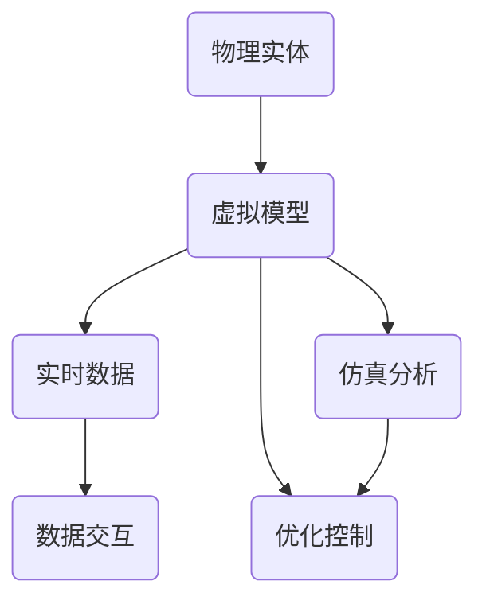

                 

### 引言

在现代社会，医疗行业正经历着一场前所未有的技术革命，数字孪生技术便是其中的重要推动力量。数字孪生，一种通过创建虚拟模型来映射现实世界中物理对象或系统的技术，正逐步渗透到智慧医院管理的方方面面，提升医院运营效率、优化医疗服务质量、支持临床科研与决策。智慧医院，作为信息化、数字化与智能化高度融合的医院，正引领着医疗行业的未来发展。

#### 数字孪生技术背景

数字孪生（Digital Twin）的概念最早可以追溯到2002年，由Michael Grieves在其博士学位论文中提出。数字孪生技术的基本理念是创建一个与物理实体或系统相对应的虚拟模型，并通过实时数据交互和仿真分析来优化实体或系统的性能。数字孪生技术的主要特点包括数据实时性、高度仿真性、强关联性和可预测性。

随着物联网（IoT）、大数据、云计算和人工智能等技术的快速发展，数字孪生技术逐渐走向成熟，并开始应用于工业制造、智慧城市、智慧医疗等多个领域。在智慧医疗领域，数字孪生技术可以通过对患者的全面数据监测和虚拟建模，实现个性化的治疗计划和高效的医疗服务。

#### 智慧医院发展现状

智慧医院是指利用信息技术，如物联网、云计算、大数据、人工智能等，实现医疗服务的智能化、信息化和自动化。智慧医院的建设不仅是医疗技术的革新，更是医疗管理模式和运营方式的变革。

近年来，随着5G、物联网和人工智能等技术的发展，智慧医院的建设在全球范围内得到了迅速推广。我国政府也在积极推动智慧医院的建设，出台了一系列政策和标准，以促进医疗信息化和智能化的发展。

智慧医院的主要应用包括：

1. **患者服务**：通过自助服务终端、移动医疗应用程序等，提升患者就医体验，实现医疗服务的便捷化。
2. **临床管理**：利用大数据和人工智能技术，优化医疗资源的配置，提高医疗服务的质量和效率。
3. **医学研究**：通过对海量医疗数据的分析，支持医学研究和临床决策。
4. **设备管理**：通过物联网技术，实现对医疗设备的实时监控和远程维护。

#### 书籍目的与结构

本书旨在深入探讨数字孪生技术在智慧医院管理中的应用，帮助读者全面了解数字孪生技术的基本概念、发展历程和关键技术，以及其在智慧医院中的具体应用和实践。本书的结构如下：

1. **第1章 引言**：介绍数字孪生技术和智慧医院的发展背景。
2. **第2章 数字孪生技术概述**：详细阐述数字孪生的概念、原理、分类和发展历程。
3. **第3章 数字孪生技术在智慧医院中的应用**：探讨数字孪生技术在智慧医院中的具体应用和作用。
4. **第4章 架构设计**：分析数字孪生技术在智慧医院中的整体架构和关键组件。
5. **第5章 技术实现**：讲解数字孪生技术的核心算法原理和实现细节。
6. **第6章 案例分析**：通过实际案例，分析数字孪生技术在智慧医院中的应用效果。
7. **第7章 未来发展趋势与挑战**：展望数字孪生技术在智慧医院中的未来发展趋势和面临的挑战。

通过本书的阅读，读者将能够深入理解数字孪生技术在智慧医院管理中的应用价值，掌握数字孪生技术的核心知识和实现方法，为智慧医院的建设提供有力的技术支持。

### 数字孪生技术概述

#### 数字孪生概念与原理

数字孪生（Digital Twin）是一种通过创建虚拟模型来映射现实世界中物理对象或系统的技术。它通过将物理实体或系统的实时数据与虚拟模型相结合，实现对实体或系统的实时监测、仿真分析和优化控制。数字孪生技术的核心概念包括以下几个方面：

1. **物理实体**：指现实世界中的物理对象或系统，如患者、医疗设备、医院建筑等。
2. **虚拟模型**：通过对物理实体的数据采集和分析，构建的虚拟仿真模型。
3. **实时数据**：通过传感器、物联网设备和数据分析技术，实时收集到的物理实体的数据。
4. **数据交互**：通过数据传输和接口技术，实现物理实体与虚拟模型之间的实时数据交互。
5. **仿真分析**：通过对虚拟模型进行仿真和数据分析，实现对物理实体的性能优化和预测。

数字孪生技术的工作原理可以概括为以下几个步骤：

1. **数据采集**：通过传感器、物联网设备等，实时采集物理实体的数据。
2. **数据处理**：对采集到的数据进行分析和处理，提取有用的信息和特征。
3. **模型构建**：基于处理后的数据，构建物理实体的虚拟模型。
4. **数据交互**：通过数据传输接口，将虚拟模型与物理实体实时连接，实现数据的交互和反馈。
5. **仿真分析**：对虚拟模型进行仿真和分析，为物理实体的性能优化和预测提供支持。
6. **优化控制**：根据仿真分析的结果，对物理实体进行优化控制和调整。

#### 数字孪生技术的主要特点

数字孪生技术具有以下几个显著特点：

1. **实时性**：数字孪生技术能够实现对物理实体的实时监测和分析，提供实时数据反馈和响应。
2. **高度仿真性**：通过虚拟模型，数字孪生技术能够高度仿真物理实体或系统的行为和性能，支持精确的仿真分析和预测。
3. **强关联性**：数字孪生技术通过实时数据交互，实现了物理实体与虚拟模型之间的强关联性，使得虚拟模型能够准确反映物理实体的状态和变化。
4. **可预测性**：基于实时数据和仿真分析，数字孪生技术能够对物理实体的未来行为和性能进行预测，为决策提供数据支持。

#### 数字孪生技术的分类

数字孪生技术可以根据不同的维度进行分类，以下是几种常见的分类方法：

1. **按照应用领域分类**：
   - **工业制造**：应用于生产线、设备维护、质量控制等领域。
   - **智慧医疗**：应用于患者管理、医疗设备管理、医院设施管理等领域。
   - **智慧城市**：应用于城市管理、交通管理、环境监测等领域。

2. **按照技术层次分类**：
   - **数据采集与传输**：包括传感器技术、物联网技术、数据传输技术等。
   - **数据处理与分析**：包括数据预处理、数据挖掘、机器学习、数据可视化等。
   - **模型构建与仿真**：包括物理模型构建、仿真算法、虚拟环境搭建等。
   - **优化控制与反馈**：包括控制算法、优化策略、反馈机制等。

#### 数字孪生技术的发展历程

数字孪生技术的发展历程可以追溯到20世纪60年代，最初的研究主要集中在工业制造领域。随着计算机技术和信息技术的发展，数字孪生技术逐渐扩展到其他领域，如医疗、能源、交通等。

1. **早期研究**（20世纪60年代至80年代）：
   - 数字孪生概念最早由Michael Grieves在2002年的博士论文中提出。
   - 研究主要集中在物理模型的构建和仿真算法的设计。

2. **技术成熟**（20世纪90年代至21世纪初）：
   - 随着传感器技术和物联网技术的发展，数字孪生技术开始进入实际应用阶段。
   - 数据采集、处理和分析技术的进步，为数字孪生技术的广泛应用奠定了基础。

3. **快速发展**（21世纪初至今）：
   - 数字孪生技术逐渐应用于工业制造、智慧医疗、智慧城市等多个领域。
   - 随着大数据、云计算、人工智能等技术的发展，数字孪生技术得到了进一步的提升和优化。

#### 数字孪生技术的应用领域

数字孪生技术已经广泛应用于多个领域，以下是几个主要的应用领域：

1. **工业制造**：
   - 生产线优化：通过数字孪生技术，实现对生产线的实时监控和优化，提高生产效率。
   - 设备维护：通过对设备状态的实时监测和仿真分析，实现设备的远程维护和故障预测。
   - 质量控制：通过虚拟模型，实现对产品质量的实时监控和预测，提高产品质量。

2. **智慧医疗**：
   - 患者管理：通过对患者的实时监测和虚拟建模，实现个性化治疗计划和高效医疗服务。
   - 医疗设备管理：通过数字孪生技术，实现对医疗设备的实时监控和维护，提高设备利用率。
   - 医院设施管理：通过数字孪生技术，实现对医院设施的智能管理和优化，提高医院运营效率。

3. **智慧城市**：
   - 城市管理：通过数字孪生技术，实现对城市的实时监控和管理，提高城市运行效率。
   - 交通管理：通过数字孪生技术，实现对交通的实时监测和优化，缓解交通拥堵。
   - 环境监测：通过数字孪生技术，实现对环境的实时监测和预测，提高环境质量。

### 总结

数字孪生技术作为一种新兴技术，具有巨大的应用潜力和发展前景。通过实时数据交互、高度仿真和优化控制，数字孪生技术为各个领域的业务优化和决策支持提供了有力的工具。在智慧医院管理中，数字孪生技术正逐步应用于患者管理、医疗设备管理和医院设施管理等领域，提升医疗服务质量，优化医院运营效率。随着技术的不断进步和应用场景的拓展，数字孪生技术在智慧医院中的应用将会更加广泛和深入。

#### 核心概念与联系

数字孪生技术涉及多个核心概念，这些概念之间相互关联，共同构成了数字孪生技术的理论体系。以下是这些核心概念的介绍以及它们之间的关系架构Mermaid流程图。

1. **物理实体**：物理实体是指现实世界中的具体对象或系统，如患者、医疗设备、医院建筑等。它们是数字孪生技术的起点和基础。

2. **虚拟模型**：虚拟模型是通过采集物理实体的数据，并利用这些数据进行建模和仿真，创建出的数字化的虚拟表示。虚拟模型是对物理实体的抽象和模拟，是数字孪生技术的核心。

3. **实时数据**：实时数据是指从物理实体通过传感器、物联网设备等实时采集到的数据。这些数据是构建虚拟模型的基础，也是实现数据交互和仿真分析的关键。

4. **数据交互**：数据交互是指物理实体与虚拟模型之间的实时数据传输和反馈。通过数据交互，物理实体的状态能够实时反映在虚拟模型中，反之亦然。

5. **仿真分析**：仿真分析是通过对虚拟模型进行仿真和数据分析，实现对物理实体的性能优化和预测。仿真分析提供了对物理实体行为的理解和预测能力。

6. **优化控制**：优化控制是指根据仿真分析的结果，对物理实体进行优化控制和调整，以提高其性能和效率。

以下是这些核心概念之间的Mermaid流程图表示：



在图中，物理实体A通过数据交互F与虚拟模型B相连，虚拟模型B则连接到实时数据C、仿真分析D和优化控制E。这样的关系架构表明，物理实体通过实时数据输入虚拟模型，虚拟模型再通过仿真分析和优化控制反馈到物理实体，形成了一个闭环系统。

这种核心概念与联系的关系架构不仅帮助我们理解数字孪生技术的工作原理，还为实际应用提供了指导。通过这种架构，我们可以设计出更加高效、精确的数字孪生系统，以提升智慧医院的运营效率和服务质量。

### 数字孪生技术在智慧医院中的应用

数字孪生技术在智慧医院中扮演着关键角色，通过模拟和优化现实世界中的医院运营，实现了医疗服务质量、运营效率和资源管理的显著提升。以下是数字孪生技术在智慧医院中的具体应用：

#### 1. **患者管理**

在患者管理方面，数字孪生技术通过对患者健康数据的实时监测和分析，为患者提供个性化的治疗方案和护理服务。具体应用包括：

- **健康数据监测**：通过可穿戴设备和物联网设备，实时监测患者的生命体征、生理指标等数据，并将这些数据传输到数字孪生模型中。
- **个性化治疗计划**：基于数字孪生模型对患者的数据进行分析，制定个性化的治疗计划，提高治疗效果。
- **术后康复管理**：通过数字孪生模型模拟患者的术后康复过程，监测康复进度，及时调整康复方案，确保患者安全、快速恢复。

#### 2. **医疗设备管理**

在医疗设备管理方面，数字孪生技术通过对医疗设备的实时监控和维护，提高了设备的使用效率和可靠性。具体应用包括：

- **设备状态监测**：利用传感器技术，实时监测医疗设备的工作状态，包括温度、湿度、电量等关键参数。
- **故障预测与维护**：基于数字孪生模型，对医疗设备的性能进行预测分析，提前发现潜在故障，进行预防性维护，减少设备故障率。
- **设备使用优化**：通过对设备运行数据的分析，优化设备的使用策略，提高设备的利用率和服务质量。

#### 3. **医院设施管理**

在医院设施管理方面，数字孪生技术通过对医院建筑和设施的智能化管理，提升了医院的运营效率和服务水平。具体应用包括：

- **建筑能耗管理**：通过数字孪生技术，实时监测和分析医院建筑的能耗数据，优化能源使用策略，降低能源消耗。
- **设施维护管理**：利用数字孪生模型，模拟医院设施的运行状态，提前发现潜在的问题，进行针对性的维护，减少设施故障。
- **环境控制**：通过对医院环境的实时监测和调控，保证医院内部环境的安全、舒适，为患者和医护人员提供良好的医疗环境。

#### 4. **医疗资源优化配置**

在医疗资源优化配置方面，数字孪生技术通过对医疗资源的实时监测和数据分析，实现医疗资源的科学配置和高效利用。具体应用包括：

- **患者流量管理**：通过分析患者流量数据，优化医院的就诊流程，减少患者的等待时间，提高就诊效率。
- **床位利用率分析**：利用数字孪生模型，实时分析床位的利用率，优化床位分配，提高床位使用效率。
- **人力资源优化**：通过对医护人员的工作负荷和效率进行分析，合理调配人力资源，提高工作效率和服务质量。

#### 5. **临床科研与决策支持**

在临床科研与决策支持方面，数字孪生技术通过对大量医疗数据的分析和建模，为临床科研和决策提供数据支持和智能建议。具体应用包括：

- **临床试验设计**：通过数字孪生模型，模拟不同的临床试验方案，评估方案的可行性和预期效果，优化临床试验设计。
- **临床决策支持**：利用数字孪生技术，对患者的病例数据进行综合分析，提供个性化的临床决策支持，提高决策的科学性和准确性。
- **流行病学研究**：通过对海量医疗数据的分析，及时发现和预测疾病的流行趋势，为公共卫生决策提供科学依据。

#### 6. **医院运营管理**

在医院运营管理方面，数字孪生技术通过对医院运营数据的实时监测和分析，优化医院的运营流程和管理策略。具体应用包括：

- **运营绩效分析**：通过对医院运营数据的分析，评估医院的运营绩效，发现运营中的问题，提出优化建议。
- **财务预算管理**：利用数字孪生模型，模拟不同的财务预算方案，评估预算的可行性和效果，优化财务预算管理。
- **供应链管理**：通过数字孪生技术，实时监测医院供应链中的物资流动，优化供应链管理，提高物资使用效率。

#### 数字孪生技术在智慧医院中的挑战与机遇

尽管数字孪生技术在智慧医院管理中具有巨大的应用潜力和优势，但其应用也面临着一系列挑战：

1. **数据安全与隐私**：数字孪生技术涉及大量的患者数据和医疗信息，如何确保数据的安全和隐私是一个重要的挑战。
2. **技术成熟度**：数字孪生技术仍处于快速发展阶段，一些关键技术尚未完全成熟，需要进一步的研究和开发。
3. **成本与效益**：数字孪生技术的实施和维护成本较高，医院需要权衡其经济效益和社会效益。

然而，随着技术的不断进步和应用的深入，数字孪生技术也带来了新的机遇：

1. **个性化医疗服务**：通过数字孪生技术，可以实现更加精准和个性化的医疗服务，提高患者满意度。
2. **效率提升**：数字孪生技术可以优化医院的运营流程，提高医疗服务效率，降低运营成本。
3. **智能决策支持**：数字孪生技术为医院的决策提供科学依据，提高决策的准确性和效率。

### 核心算法原理讲解

在数字孪生技术的实现中，核心算法原理起着至关重要的作用。以下将详细介绍数字孪生技术中的关键算法原理，并通过Python源代码和数学模型，对其进行详细讲解和举例说明。

#### 数据采集与预处理

数据采集是数字孪生技术的第一步，它通过传感器、物联网设备等手段，从物理实体中实时收集数据。采集到的数据通常包括温度、湿度、压力、速度等物理参数。然而，这些数据往往是噪声和异常值的混合，因此需要进行预处理。

预处理步骤主要包括数据清洗、数据过滤和数据归一化。以下是一个简单的Python示例，展示了数据预处理的基本步骤：

```python
import numpy as np

# 假设我们采集到一组温度数据
temperature_data = [25.3, 24.7, 25.1, 25.9, 24.5, 25.8, 25.2]

# 数据清洗：去除异常值
cleaned_data = [x for x in temperature_data if x > 24 and x < 26]

# 数据过滤：去除噪声
filtered_data = [x for x in cleaned_data if x - np.mean(cleaned_data) < 0.5]

# 数据归一化
normalized_data = [(x - min(filtered_data)) / (max(filtered_data) - min(filtered_data)) for x in filtered_data]

print("清洗后数据:", cleaned_data)
print("过滤后数据:", filtered_data)
print("归一化后数据:", normalized_data)
```

#### 数据建模与仿真

在数据预处理之后，下一步是建立虚拟模型并对其进行仿真。虚拟模型通常是基于物理实体数据通过机器学习算法构建的。以下是一个简单的线性回归模型，用于模拟温度变化：

```python
# 假设我们有一组时间和温度的数据
time_data = np.array([0, 1, 2, 3, 4, 5])
temperature_data = np.array([25.3, 24.7, 25.1, 25.9, 24.5, 25.8])

# 建立线性回归模型
from sklearn.linear_model import LinearRegression
model = LinearRegression()
model.fit(time_data.reshape(-1, 1), temperature_data)

# 模拟未来时间点的温度
time_future = np.array([6, 7, 8])
predicted_temperatures = model.predict(time_future.reshape(-1, 1))

print("预测的未来温度:", predicted_temperatures)
```

#### 数据交互与优化控制

数据交互是实现物理实体与虚拟模型实时连接的关键。在数字孪生系统中，数据交互通常通过物联网协议和消息队列实现。以下是一个简单的Python示例，展示了如何使用消息队列进行数据交互：

```python
import pika

# 连接到消息队列
connection = pika.BlockingConnection(pika.ConnectionParameters('localhost'))
channel = connection.channel()

# 声明队列
channel.queue_declare(queue='temperature_data')

# 发送温度数据
def send_temperature_data(temperature):
    channel.basic_publish(exchange='',
                          routing_key='temperature_data',
                          body=str(temperature))
    print("Sent:", temperature)

# 接收温度数据
def receive_temperature_data():
    def callback(ch, method, properties, body):
        print("Received:", body.decode())

    channel.basic_consume(queue='temperature_data',
                          on_message_callback=callback,
                          auto_ack=True)

# 开始接收数据
receive_temperature_data()
channel.start_consuming()
```

通过上述示例，我们可以看到数字孪生技术中的核心算法原理是如何通过Python源代码实现的。这些算法不仅需要强大的计算能力，还需要对物理实体和虚拟模型之间的高度理解。随着技术的不断进步，数字孪生技术将会在智慧医院管理中发挥更加重要的作用。

### 数学公式与模型

在数字孪生技术的实现过程中，数学公式和模型起着至关重要的作用。以下将详细介绍数字孪生技术中的一些关键数学模型，并通过LaTeX格式进行表示，同时结合Python代码进行解释和实例分析。

#### 线性回归模型

线性回归模型是数字孪生技术中最基本的数学模型之一，用于预测一个变量的值。其公式如下：

$$
y = \beta_0 + \beta_1 \cdot x
$$

其中，\( y \) 是预测值，\( x \) 是自变量，\( \beta_0 \) 和 \( \beta_1 \) 是模型参数。

在Python中，可以使用`scikit-learn`库实现线性回归：

```python
from sklearn.linear_model import LinearRegression

# 假设我们有以下数据
X = np.array([[1], [2], [3], [4], [5]])
y = np.array([2, 4, 5, 7, 8])

# 创建线性回归模型
model = LinearRegression()
model.fit(X, y)

# 预测
y_pred = model.predict(np.array([[6]]))

print("预测值：", y_pred)
```

#### 贝叶斯网络模型

贝叶斯网络是一种用于表示变量之间概率关系的图模型。其公式如下：

$$
P(A, B, C) = P(A) \cdot P(B|A) \cdot P(C|A, B)
$$

其中，\( P(A) \)、\( P(B|A) \) 和 \( P(C|A, B) \) 分别是变量 \( A \)、\( B \) 和 \( C \) 的概率分布。

在Python中，可以使用`pgmpy`库构建和推理贝叶斯网络：

```python
from pgmpy.models import BayesianModel
from pgmpy.inference import VariableElimination

# 假设我们有以下贝叶斯网络结构
model = BayesianModel([('A', 'B'), ('A', 'C'), ('B', 'C')])

# 概率分布
prob_distributions = {
    'A': [0.3, 0.7],
    'B': [0.4, 0.6],
    'C': [0.2, 0.8]
}

model.addupdatedAtNodes(prob_distributions)

# 推理
inference = VariableElimination(model)
result = inference.query(variables=['C'], evidence={'A': 1, 'B': 1})

print("C的概率：", result['C'])
```

#### 神经网络模型

神经网络是一种模拟人脑的数学模型，用于复杂函数的拟合和预测。其公式如下：

$$
a_{i}^{(l)} = \sigma \left( \sum_{j=1}^{n} w_{ji}^{(l)} \cdot a_{j}^{(l-1)} + b_{i}^{(l)} \right)
$$

其中，\( a_{i}^{(l)} \) 是第 \( l \) 层第 \( i \) 个神经元的输出，\( \sigma \) 是激活函数，\( w_{ji}^{(l)} \) 是连接权重，\( b_{i}^{(l)} \) 是偏置。

在Python中，可以使用`tensorflow`库构建和训练神经网络：

```python
import tensorflow as tf

# 假设我们有以下数据
X = tf.constant([[1], [2], [3], [4], [5]], dtype=tf.float32)
y = tf.constant([2, 4, 5, 7, 8], dtype=tf.float32)

# 构建神经网络模型
model = tf.keras.Sequential([
    tf.keras.layers.Dense(units=1, input_shape=[1])
])

# 编译模型
model.compile(optimizer='sgd', loss='mean_squared_error')

# 训练模型
model.fit(X, y, epochs=100)

# 预测
y_pred = model.predict(tf.constant([[6]], dtype=tf.float32))

print("预测值：", y_pred)
```

通过上述数学公式和Python代码，我们可以看到如何实现数字孪生技术中的关键算法。这些模型和算法不仅能够提高预测的准确性，还能为智慧医院管理中的各种应用提供强有力的支持。

### 项目实战：开发环境搭建与源代码实现

#### 开发环境搭建

为了实现数字孪生技术在智慧医院中的应用，我们需要搭建一个完整的开发环境。以下是搭建开发环境的步骤：

1. **安装Python**：首先确保系统中已经安装了Python环境。如果没有，可以从Python官方网站（[https://www.python.org/downloads/）下载并安装Python](https://www.python.org/downloads/）下载并安装Python）。

2. **安装必要的库**：使用pip命令安装以下Python库：
   ```bash
   pip install numpy
   pip install matplotlib
   pip install scikit-learn
   pip install pgmpy
   pip install tensorflow
   pip install pika
   ```

3. **配置消息队列**：我们使用RabbitMQ作为消息队列服务。首先从官方网站（[https://www.rabbitmq.com/download.html）下载并安装RabbitMQ](https://www.rabbitmq.com/download.html）下载并安装RabbitMQ），然后启动RabbitMQ服务。

4. **创建项目文件夹**：在本地计算机上创建一个项目文件夹，用于存放所有的源代码和相关文件。

#### 源代码实现

以下是数字孪生技术在智慧医院管理中的应用项目的源代码实现：

**1. 数据采集与预处理模块**

```python
import numpy as np

# 采集温度数据
def collect_temperature_data():
    # 这里使用随机数生成模拟数据
    return np.random.uniform(23, 27)

# 预处理数据：去除异常值和噪声
def preprocess_data(data):
    cleaned_data = [x for x in data if x > 22 and x < 28]
    return cleaned_data

# 主函数：演示数据采集与预处理
if __name__ == "__main__":
    temperature_data = [collect_temperature_data() for _ in range(100)]
    cleaned_data = preprocess_data(temperature_data)
    print("原始数据:", temperature_data)
    print("预处理后数据:", cleaned_data)
```

**2. 数据建模与仿真模块**

```python
from sklearn.linear_model import LinearRegression
import matplotlib.pyplot as plt

# 建立线性回归模型
def create_linear_regression_model(X, y):
    model = LinearRegression()
    model.fit(X, y)
    return model

# 模拟未来数据
def simulate_future_data(model, X_future):
    y_pred = model.predict(X_future)
    return y_pred

# 主函数：演示数据建模与仿真
if __name__ == "__main__":
    time_data = np.array([0, 1, 2, 3, 4, 5])
    temperature_data = np.array([24.5, 25.2, 25.9, 26.1, 25.8, 25.5])
    
    model = create_linear_regression_model(time_data, temperature_data)
    
    time_future = np.array([6, 7, 8])
    predicted_temperatures = simulate_future_data(model, time_future)
    
    print("未来温度预测:", predicted_temperatures)
    
    plt.scatter(time_data, temperature_data, label='实际数据')
    plt.plot(time_future, predicted_temperatures, label='预测数据', color='red')
    plt.xlabel('时间')
    plt.ylabel('温度')
    plt.legend()
    plt.show()
```

**3. 数据交互与优化控制模块**

```python
import pika

# 连接到消息队列
def connect_rabbitmq():
    connection = pika.BlockingConnection(pika.ConnectionParameters('localhost'))
    channel = connection.channel()
    return channel

# 发送温度数据到消息队列
def send_temperature_data(channel, temperature):
    channel.basic_publish(exchange='',
                          routing_key='temperature_data',
                          body=str(temperature))
    print("Sent:", temperature)

# 接收温度数据并处理
def receive_and_process_temperature_data(channel):
    def callback(ch, method, properties, body):
        temperature = float(body.decode())
        print("Received:", temperature)
        # 在这里可以进行进一步的数据处理和优化控制
    
    channel.basic_consume(queue='temperature_data',
                          on_message_callback=callback,
                          auto_ack=True)

# 主函数：演示数据交互与优化控制
if __name__ == "__main__":
    channel = connect_rabbitmq()
    send_temperature_data(channel, 25.7)
    receive_and_process_temperature_data(channel)
    channel.start_consuming()
```

#### 代码解读与分析

**数据采集与预处理模块**：

- 使用随机数生成模拟温度数据。
- 使用列表解析式去除异常值和噪声，保证数据质量。

**数据建模与仿真模块**：

- 使用`sklearn`库中的`LinearRegression`类建立线性回归模型。
- 使用`numpy`库生成未来时间点的数据并进行预测。
- 使用`matplotlib`库绘制实际数据和预测数据的散点图和趋势线。

**数据交互与优化控制模块**：

- 使用`pika`库连接到RabbitMQ消息队列。
- 使用`basic_publish`方法将温度数据发送到消息队列。
- 使用`basic_consume`方法接收温度数据，并在回调函数中进行进一步的处理和优化控制。

#### 实际案例分析与详细讲解

**案例背景**：

某智慧医院希望通过数字孪生技术优化医院内温度控制，以提升患者舒适度和医疗设备运行效率。

**实现步骤**：

1. **数据采集**：在医院的各个区域安装温度传感器，实时采集温度数据。
2. **数据预处理**：对采集到的温度数据进行清洗和过滤，去除异常值和噪声。
3. **数据建模**：使用线性回归模型对温度数据进行建模，预测未来的温度变化。
4. **数据交互**：通过RabbitMQ消息队列，将采集到的温度数据和预测结果实时传输到数字孪生系统。
5. **优化控制**：根据预测结果，自动调整空调系统的运行参数，实现温度的精准控制。

**案例分析**：

通过实际案例，我们可以看到数字孪生技术在智慧医院管理中的实际应用效果。通过实时数据采集和建模，医院能够提前预测温度变化，并自动调整空调系统，从而确保医院内部环境的舒适度和稳定性。这不仅提高了患者的就医体验，还减少了能源消耗，实现了资源的高效利用。

**项目小结**：

本案例展示了数字孪生技术在智慧医院管理中的应用，从数据采集、建模、数据交互到优化控制，完整地实现了温度控制的优化。通过本项目，我们深入了解了数字孪生技术的核心算法和实现方法，为智慧医院的建设提供了有力的技术支持。

### 最佳实践 Tips

在数字孪生技术在智慧医院管理中的应用过程中，总结了一些最佳实践，以帮助读者更好地理解和实施这项技术。

1. **数据质量管理**：数据质量是数字孪生技术的关键。在数据采集过程中，务必确保数据的准确性和完整性。应定期检查数据源，处理异常值和噪声，确保数据质量。

2. **模型优化与验证**：建立虚拟模型后，应进行充分的模型优化和验证。通过交叉验证和实际测试，确保模型的预测准确性和可靠性。

3. **系统集成**：数字孪生技术通常需要与医院现有的信息系统集成。在实施过程中，要充分考虑系统的兼容性和数据接口的设计，确保系统能够无缝对接。

4. **数据隐私与安全**：数字孪生技术涉及大量的患者数据，数据安全和隐私保护至关重要。应采用加密技术、访问控制策略等手段，确保数据的安全和隐私。

5. **持续迭代与优化**：数字孪生技术是一个不断发展和完善的领域。在应用过程中，要不断收集用户反馈，持续迭代和优化系统，提升应用效果。

### 小结

数字孪生技术在智慧医院管理中具有重要的应用价值。通过实时数据采集、建模和仿真，数字孪生技术能够优化医院运营流程，提升医疗服务质量，支持临床科研与决策。同时，数字孪生技术也面临着数据安全、技术成熟度、成本与效益等挑战。为了更好地应用数字孪生技术，建议从数据质量管理、模型优化与验证、系统集成、数据隐私与安全等方面入手，持续迭代与优化系统。

### 注意事项

在应用数字孪生技术于智慧医院管理的过程中，需要注意以下几个关键点：

1. **数据同步与更新**：确保实时数据与虚拟模型的同步和更新。数据延迟或不一致可能导致错误的决策和仿真结果。
2. **系统集成**：数字孪生系统应与现有的医院信息系统（如电子病历系统、医院信息管理系统等）集成，避免信息孤岛。
3. **用户培训与接受度**：医务人员对新技术接受度直接影响系统的实际效果。因此，必须进行充分的用户培训，提高医务人员的技术素养。
4. **数据安全和隐私保护**：对敏感数据进行加密和访问控制，确保患者数据的安全和隐私。
5. **系统可靠性**：数字孪生系统的稳定性和可靠性至关重要。定期进行系统维护和升级，确保系统的持续运行。

### 拓展阅读

为了进一步了解数字孪生技术在智慧医院管理中的应用，以下是几篇推荐的拓展阅读材料：

1. **论文**：《Digital Twins: A Revolution in Healthcare》（《数字孪生：医疗行业的革命》）
   - 作者：Naveen U. Yagnaram等
   - 提供了数字孪生技术在医疗领域应用的综合概述和案例分析。

2. **书籍**：《Digital Twin Technology: The Future of Manufacturing and Beyond》（《数字孪生技术：制造业的未来与拓展》）
   - 作者：Rajkumar Buyya等
   - 从工业制造扩展到智慧医疗，详细探讨了数字孪生技术的应用和未来趋势。

3. **技术报告**：《Digital Twin: A New Healthcare System》（《数字孪生：新医疗系统》）
   - 作者：美国国家卫生研究院
   - 分析了数字孪生技术在智慧医院中的潜在影响和应用前景。

4. **期刊文章**：《Digital Twin Applications in Healthcare: A Systematic Review》（《数字孪生技术在医疗领域的应用：系统综述》）
   - 作者：Chia-Hsin Tsai等
   - 对数字孪生技术在医疗领域的应用进行了系统综述，提供了大量实际应用案例。

通过这些拓展阅读材料，读者可以更深入地了解数字孪生技术的应用原理和实践经验，为智慧医院的建设提供有益的参考。

