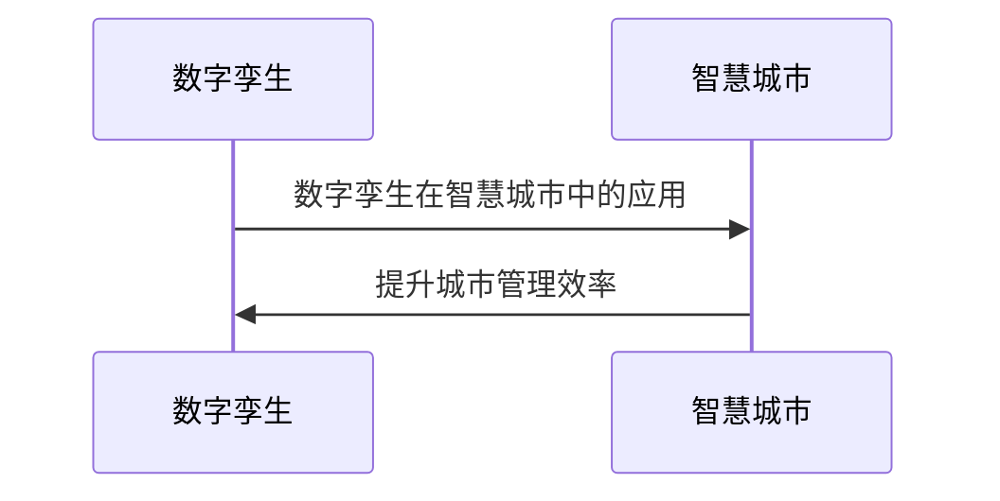
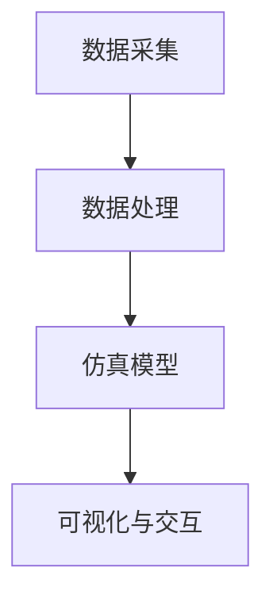
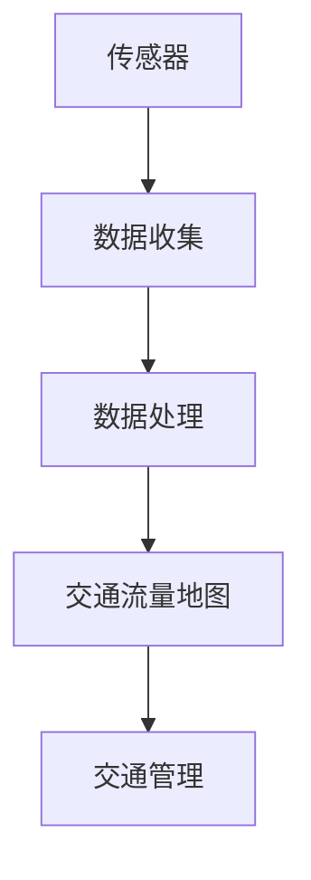
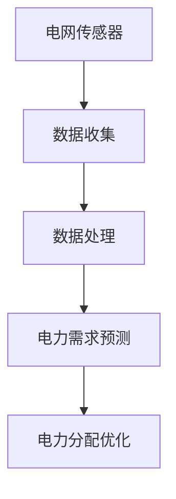
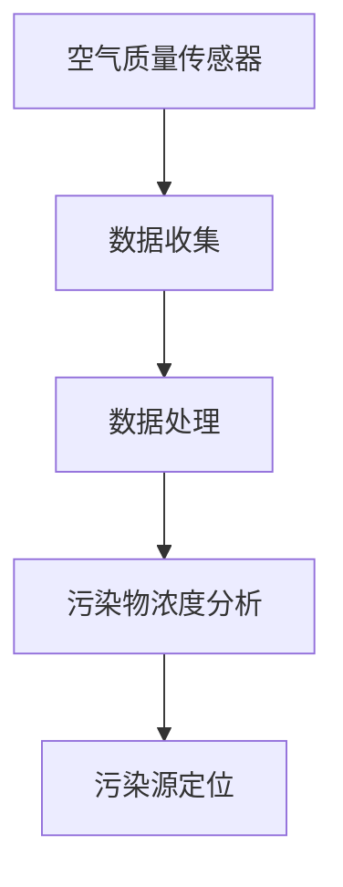
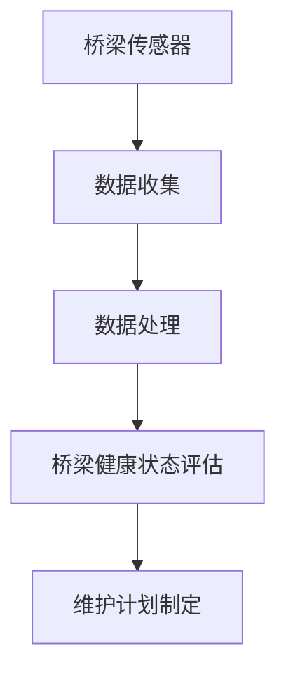
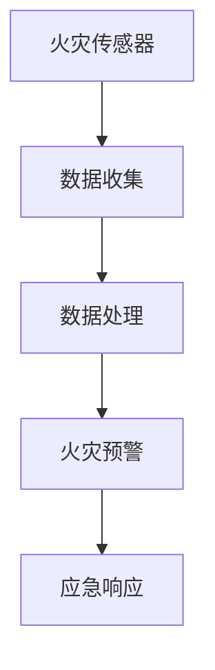

                 

### 《数字孪生技术在智慧城市中的应用》

#### 关键词：数字孪生、智慧城市、城市规划、城市管理、公共安全

#### 摘要：
本文旨在深入探讨数字孪生技术在智慧城市中的应用。我们将从数字孪生的基本概念出发，详细解析其在城市规划、城市管理和公共安全等领域的应用，结合实际案例，分析技术实现、挑战与解决方案，最后展望数字孪生技术在智慧城市中的未来前景。

---

### 目录大纲设计思考步骤

为了设计一个完整且逻辑清晰的目录大纲，我们需要遵循以下步骤：

1. **理解书名和目标读者：**
   首先，我们需要理解书名《数字孪生技术在智慧城市中的应用》。这表明书籍的主要内容将围绕数字孪生技术在智慧城市中的应用展开。目标读者可能是对数字孪生技术和智慧城市有一定了解的技术人员或决策者。

2. **确定核心内容：**
   根据书名，确定核心内容应包括数字孪生的基本概念、数字孪生在智慧城市中的应用场景、技术实现、挑战和解决方案等。

3. **划分章节结构：**
   将核心内容划分为几个主要章节，例如：基础概念、应用场景、技术实现、案例分析、挑战与解决方案等。

4. **细化每个章节的内容：**
   对每个章节进行细化，列出具体的小节，确保每个章节都有足够的深度和广度。

5. **整合与调整：**
   根据内容的逻辑关系和重要性，对章节和小节进行整合和调整，确保整个目录大纲的逻辑性和连贯性。

6. **添加技术细节和案例：**
   在适当的地方添加技术细节和实际案例，以增加书籍的实用性和可操作性。

7. **确保大纲完整性和字数限制：**
   确保目录大纲内容完整，同时控制在2000字以内。

---

### 目录大纲设计示例

以下是一个针对《数字孪生技术在智慧城市中的应用》书目的目录大纲设计：

## 第一部分：数字孪生基础

### 第1章：数字孪生概述

#### 1.1 数字孪生的定义与核心概念

##### 1.1.1 数字孪生的起源与发展


##### 1.1.2 数字孪生的组成部分


#### 1.2 数字孪生在智慧城市中的应用

##### 1.2.1 数字孪生在城市规划中的应用

##### 1.2.2 数字孪生在城市管理中的应用

##### 1.2.3 数字孪生在公共安全中的应用

## 第二部分：数字孪生技术在智慧城市中的应用

### 第2章：数字孪生技术在智慧城市规划中的应用

#### 2.1 城市基础设施管理

##### 2.1.1 城市道路的数字孪生管理

##### 2.1.2 城市交通系统的数字孪生管理

#### 2.2 城市环境监测

##### 2.2.1 气象监测的数字孪生管理

##### 2.2.2 环境污染监测的数字孪生管理

### 第3章：数字孪生技术在智慧城市管理中的应用

#### 3.1 城市能源管理

##### 3.1.1 城市电网的数字孪生管理

##### 3.1.2 城市水资源的数字孪生管理

#### 3.2 城市公共服务管理

##### 3.2.1 城市医疗服务的数字孪生管理

##### 3.2.2 城市教育的数字孪生管理

### 第4章：数字孪生技术在智慧城市公共安全中的应用

#### 4.1 智能交通管理

##### 4.1.1 交通流量预测与优化

##### 4.1.2 道路拥堵监控与处理

#### 4.2 公共安全监测

##### 4.2.1 灾害预警与应急响应

##### 4.2.2 公共安全事件的监控与分析

### 第5章：数字孪生技术在智慧城市中的挑战与解决方案

#### 5.1 数据采集与处理挑战

##### 5.1.1 大数据管理

##### 5.1.2 数据质量与准确性

#### 5.2 技术挑战与解决方案

##### 5.2.1 算法优化

##### 5.2.2 系统集成与协同

### 第6章：数字孪生技术在智慧城市中的案例研究

#### 6.1 案例一：XX智慧城市项目

##### 6.1.1 项目背景与目标

##### 6.1.2 项目实施与成果

#### 6.2 案例二：XX智慧城市解决方案

##### 6.2.1 解决方案概述

##### 6.2.2 解决方案实施效果

### 第7章：展望未来

#### 7.1 数字孪生技术的发展趋势

##### 7.1.1 新技术与应用场景

##### 7.1.2 潜在的市场机会与挑战

#### 7.2 数字孪生技术在智慧城市中的未来前景

##### 7.2.1 社会影响与伦理问题

##### 7.2.2 政策与标准制定方向

---

通过以上步骤，我们可以设计出一个逻辑清晰、内容丰富的目录大纲，为后续撰写文章提供明确的指导。

---

### 思考步骤一：理解数字孪生技术的定义与核心概念

数字孪生（Digital Twin）是一种通过创建实体物理对象的数字镜像来模拟、分析和优化其性能的技术。这个数字镜像包含了物理对象的实时数据和历史数据，通过对这些数据的处理和分析，可以实现对物理对象的状态监控、性能优化和故障预测。

#### 数字孪生的起源与发展

数字孪生的概念最早可以追溯到20世纪80年代的制造业。当时，制造业企业开始使用虚拟仿真技术来模拟产品的生产过程，从而提高生产效率和降低成本。随着信息技术的不断发展和物联网（IoT）技术的普及，数字孪生的应用逐渐扩展到各个领域，特别是在智慧城市中。

#### 数字孪生的组成部分

数字孪生由三个核心组成部分构成：

1. **数据采集**：通过传感器和物联网设备收集物理对象的实时数据，如温度、湿度、压力等。
2. **数据处理**：对收集到的数据进行存储、清洗、分析和建模，以便于实时监控和预测。
3. **仿真模型**：基于物理对象的数据构建仿真模型，该模型可以模拟物理对象的行为和状态，帮助决策者进行预测和优化。
4. **可视化与交互**：通过可视化工具将仿真模型和实时数据呈现给用户，使用户可以直观地了解物理对象的状态和性能。

#### 数字孪生在智慧城市中的应用

数字孪生技术在智慧城市中的应用非常广泛，包括城市规划、城市管理、公共安全等多个方面。通过数字孪生技术，智慧城市可以实现以下目标：

1. **提升城市规划效率**：数字孪生技术可以模拟城市的发展过程，帮助城市规划者预测城市未来的需求，优化城市规划。
2. **提升城市管理效率**：数字孪生技术可以实时监控城市基础设施的状态，如道路、桥梁、电力系统等，及时发现并解决问题，提高城市管理效率。
3. **提升公共安全水平**：数字孪生技术可以实时监测公共安全事件，如交通拥堵、火灾等，及时预警并响应，提高公共安全水平。

---

通过以上思考步骤，我们对数字孪生技术的定义与核心概念有了深入的理解，为后续的内容讨论奠定了基础。

---

### 思考步骤二：数字孪生技术在智慧城市规划中的应用

数字孪生技术在智慧城市规划中发挥着重要作用，能够帮助城市规划者更好地理解城市的发展趋势，优化资源配置，提升规划决策的科学性。以下是数字孪生技术在智慧城市规划中的应用场景：

#### 1. 城市基础设施管理

城市基础设施包括道路、桥梁、隧道、电力系统、给排水系统等。通过数字孪生技术，城市规划者可以创建这些基础设施的数字模型，实时监控其状态，预测未来的需求，从而进行优化管理和维护。

- **道路管理**：通过传感器收集道路的实时数据，如车流量、车速、道路状况等，数字孪生模型可以模拟道路的使用情况，预测未来的交通流量，为道路规划提供数据支持。

- **桥梁监测**：桥梁的数字孪生模型可以实时监测桥梁的结构健康状态，如应力、位移、裂缝等，及时发现并处理潜在的安全隐患。

- **电力系统管理**：电力系统的数字孪生模型可以模拟电力负荷的分布情况，预测电力需求，优化电力资源的配置，提高供电的可靠性和效率。

#### 2. 城市环境监测

城市环境监测是智慧城市规划的重要环节，数字孪生技术可以实时收集和分析环境数据，如空气质量、水质、噪音等，为城市环境管理提供科学依据。

- **气象监测**：气象数字孪生模型可以收集和分析气象数据，如温度、湿度、风速、降雨量等，预测未来的天气变化，帮助城市进行防洪、防涝等应急准备。

- **环境污染监测**：通过传感器实时监测空气质量、水质等指标，数字孪生模型可以识别污染源，预测污染扩散趋势，为环境保护提供决策支持。

#### 3. 公共资源管理

数字孪生技术可以帮助城市规划者优化公共资源的配置，提高公共服务的效率。

- **水资源管理**：数字孪生技术可以监测水资源的分布和利用情况，预测未来的水资源需求，优化水资源的分配和管理。

- **能源管理**：能源数字孪生模型可以监测能源的使用情况，预测能源需求，优化能源的分配和使用，提高能源利用效率。

#### 4. 社会服务管理

数字孪生技术还可以用于社会服务管理，如医疗、教育、交通等。

- **医疗服务**：通过数字孪生技术，可以建立病人的健康模型，实时监测病人的健康状况，为医生提供诊断和治疗的依据。

- **教育管理**：数字孪生技术可以分析学生的学习数据，优化教学资源分配，提高教学效果。

#### 5. 城市交通管理

数字孪生技术在城市交通管理中有着广泛的应用，可以通过模拟和分析交通流量，优化交通信号，提高交通效率。

- **交通流量预测**：通过数字孪生技术，可以收集和分析交通数据，预测未来的交通流量，为交通信号灯的优化提供数据支持。

- **道路拥堵监控**：数字孪生模型可以实时监控道路的拥堵情况，及时发现拥堵点，优化交通疏导方案。

#### 6. 灾害预防与应急响应

数字孪生技术可以帮助城市规划者预测和预防自然灾害，如洪水、地震等，提高城市的抗灾能力。

- **灾害预警**：通过数字孪生技术，可以实时监测气象和地质数据，预测灾害的发生，提前预警并采取应急措施。

- **应急响应**：数字孪生技术可以模拟灾害发生后的情景，优化应急预案，提高应急响应的效率。

---

通过以上应用场景，我们可以看到数字孪生技术在智慧城市规划中的重要作用。它不仅能够提高城市规划的效率，优化资源配置，还能够提升公共服务的质量，为构建智慧城市提供强大的技术支持。

---

### 思考步骤三：数字孪生技术在智慧城市管理中的应用

数字孪生技术在智慧城市管理中的应用，使得城市管理者能够更加高效地进行城市基础设施的维护和管理，从而提升城市服务的整体水平。以下是数字孪生技术在智慧城市管理中的几个关键应用领域：

#### 1. 城市交通管理

数字孪生技术在城市交通管理中的应用尤为突出，通过实时数据收集和分析，可以大大提高交通系统的效率和安全性。

- **实时监控**：通过部署在道路上的传感器和摄像头，数字孪生系统可以实时收集交通流量、速度、车辆类型等信息，生成交通流量的实时动态地图。



- **智能信号灯控制**：数字孪生模型可以根据实时交通流量数据，动态调整交通信号灯的时序，优化红绿灯的切换，减少拥堵，提高道路通行效率。

```python
def optimize_traffic_signals(traffic_data):
    # 基于实时交通数据优化信号灯时序
    green_time = 60  # 绿灯时间
    red_time = 30    # 红灯时间

    if traffic_data['heavy_traffic']:
        green_time += 10  # 增加绿灯时间
        red_time -= 10   # 减少红灯时间
    else:
        green_time -= 10  # 减少绿灯时间
        red_time += 10   # 增加红灯时间

    return {'green_time': green_time, 'red_time': red_time}
```

#### 2. 城市能源管理

数字孪生技术能够帮助城市管理者优化能源使用，降低能耗，实现绿色可持续发展。

- **智能电网管理**：通过数字孪生技术，可以实时监控电网的运行状态，预测电力需求，优化电力分配，提高供电的可靠性和效率。



- **能源消耗监测**：数字孪生模型可以监测建筑、工厂等能源消耗设备的运行状态，通过分析数据，找出能耗高的环节，提出节能措施。

```python
def monitor_energy_consumption(energy_data):
    # 监测能源消耗
    total_energy = sum(energy_data.values())
    average_energy = total_energy / len(energy_data)
    high_consumers = [device for device, energy in energy_data.items() if energy > average_energy * 1.5]

    return high_consumers
```

#### 3. 城市环境监测

数字孪生技术可以实现对城市环境的实时监测，提供数据支持，帮助城市管理者及时应对环境问题。

- **空气质量监测**：通过传感器实时监测空气中的污染物浓度，数字孪生模型可以分析污染物来源和扩散趋势，为污染治理提供依据。



- **水质监测**：数字孪生模型可以监测水体中的污染物浓度，识别污染源，预测水质变化趋势，为水资源保护提供支持。

```python
def monitor_water_quality(water_data):
    # 监测水质
    pollutants = water_data['pollutants']
    if any(concentration > threshold for concentration in pollutants.values()):
        return '水质污染'
    else:
        return '水质良好'
```

#### 4. 公共设施维护

数字孪生技术可以帮助城市管理者实时监控公共设施的运行状态，提前发现潜在问题，减少故障发生率。

- **桥梁监测**：通过传感器实时监测桥梁的应力、位移等数据，数字孪生模型可以预测桥梁的健康状况，提前进行维护和加固。



- **排水系统监测**：数字孪生模型可以实时监测排水管道的堵塞情况，预测排水系统的负载，为排水系统维护提供数据支持。

```python
def monitor_drainage_system(drainage_data):
    # 监测排水系统
    if drainage_data['blockages'] > threshold:
        return '排水系统堵塞'
    else:
        return '排水系统正常'
```

#### 5. 公共安全监测

数字孪生技术还可以在公共安全监测中发挥重要作用，通过实时数据分析和预警机制，提高公共安全水平。

- **火灾监测**：通过传感器实时监测火灾指标，如温度、烟雾浓度等，数字孪生模型可以预测火灾发生的可能性，及时预警并采取应急措施。



- **安防监控**：数字孪生模型可以分析监控视频数据，识别异常行为，如可疑人物、入侵者等，为安防人员提供实时预警信息。

```python
def monitor_security_camera(camera_data):
    # 安防监控
    if 'suspicious_person' in camera_data:
        return '预警：发现可疑人物'
    else:
        return '安全：无异常情况'
```

通过以上案例分析，我们可以看到数字孪生技术在智慧城市管理中的广泛应用。它不仅提高了城市管理的效率，还大大提升了公共服务的质量和安全性，为建设智能、高效、安全的智慧城市提供了强有力的技术支持。

---

### 思考步骤四：数字孪生技术在智慧城市公共安全中的应用

数字孪生技术在智慧城市公共安全中的应用，极大地提升了城市的安全防范能力和应急响应效率。以下是数字孪生技术在智慧城市公共安全中的几个关键应用场景：

#### 1. 智能交通管理

智能交通管理是数字孪生技术在公共安全领域的重要应用之一。通过实时监控和分析交通流量数据，可以有效地预防和缓解交通拥堵，提高交通安全。

- **交通流量预测**：数字孪生技术可以基于历史交通数据和实时监控数据，预测未来的交通流量变化，为交通管理部门提供决策支持。例如，以下是一个简单的交通流量预测模型：

```python
import numpy as np
from sklearn.linear_model import LinearRegression

# 假设我们有一个包含历史交通流量数据的时间序列数组
historical_traffic = np.array([[i, traffic_data[i]] for i in range(24)])

# 训练线性回归模型
model = LinearRegression()
model.fit(historical_traffic[:, 0].reshape(-1, 1), historical_traffic[:, 1])

# 预测未来某个时间点的交通流量
predicted_traffic = model.predict([[next_time_point]])
print(f"预测的未来交通流量为：{predicted_traffic[0][0]}")
```

- **道路拥堵监控与处理**：数字孪生技术可以实时监测道路的拥堵情况，通过分析交通流量数据，及时发现拥堵点并采取相应的疏导措施。以下是一个简单的道路拥堵监控模型：

```python
def monitor_road_traffic(traffic_data):
    # 判断道路是否拥堵
    if traffic_data['current_traffic'] > traffic_data['threshold']:
        print("预警：道路拥堵，请及时采取措施。")
    else:
        print("状态：道路畅通。")

# 示例数据
traffic_data = {'current_traffic': 300, 'threshold': 200}
monitor_road_traffic(traffic_data)
```

#### 2. 公共安全监测

公共安全监测是数字孪生技术在智慧城市公共安全中的另一个重要应用。通过视频监控和传感器数据，可以实时监控公共区域的安全状况，及时发现异常事件。

- **异常行为识别**：数字孪生技术可以通过机器学习算法分析监控视频数据，识别出异常行为，如暴力、偷窃等，并发出警报。以下是一个简单的异常行为识别模型：

```python
from sklearn.ensemble import RandomForestClassifier
from sklearn.model_selection import train_test_split

# 假设我们已经有了训练数据集
X = ...  # 特征数据
y = ...  # 标签数据（0表示正常行为，1表示异常行为）

# 分割训练集和测试集
X_train, X_test, y_train, y_test = train_test_split(X, y, test_size=0.2, random_state=42)

# 训练随机森林分类器
model = RandomForestClassifier(n_estimators=100)
model.fit(X_train, y_train)

# 预测新数据的类别
new_data = ...  # 新的特征数据
predicted_label = model.predict([new_data])
if predicted_label[0] == 1:
    print("预警：发现异常行为。")
else:
    print("状态：正常行为。")
```

- **安防事件预警**：数字孪生技术可以通过分析传感器数据和监控视频，实时监测公共区域的安全状况，当检测到异常事件时，自动发出预警并通知相关人员。以下是一个简单的安防事件预警模型：

```python
def monitor_public_safety(sensor_data, video_data):
    # 分析传感器数据和视频数据
    if sensor_data['alarm'] or video_data['abnormal']:
        print("预警：发现公共安全事件，请立即处理。")
    else:
        print("状态：公共安全正常。")

# 示例数据
sensor_data = {'alarm': True}
video_data = {'abnormal': True}
monitor_public_safety(sensor_data, video_data)
```

#### 3. 灾害预警与应急响应

数字孪生技术可以实时监控气象、地质等数据，预测自然灾害的发生，提前预警并采取应急措施，减少灾害损失。

- **气象预警**：数字孪生技术可以通过分析气象数据，预测未来的天气变化，发出洪水、台风等气象预警。以下是一个简单的气象预警模型：

```python
def predict_weather(weather_data):
    # 预测未来天气
    if weather_data['rain'] or weather_data['wind_speed'] > threshold:
        print("预警：预计未来会有暴雨和大风，请做好防范准备。")
    else:
        print("状态：天气正常。")

# 示例数据
weather_data = {'rain': True, 'wind_speed': 30}
predict_weather(weather_data)
```

- **地震预警**：数字孪生技术可以通过分析地震前的微震信号，预测地震的发生，提前预警并采取应急措施。以下是一个简单的地震预警模型：

```python
def predict_earthquake(seismic_data):
    # 预测地震
    if seismic_data['micro_shake']:
        print("预警：预计未来会有地震发生，请立即采取应急措施。")
    else:
        print("状态：地震预警正常。")

# 示例数据
seismic_data = {'micro_shake': True}
predict_earthquake(seismic_data)
```

通过以上案例分析，我们可以看到数字孪生技术在智慧城市公共安全中的广泛应用。它不仅提高了公共安全监测和应急响应的效率，还为城市管理者提供了科学决策的数据支持，为构建安全、和谐的智慧城市提供了有力保障。

---

### 思考步骤五：数字孪生技术在智慧城市中的挑战与解决方案

尽管数字孪生技术在智慧城市中展现出了巨大的潜力，但在实际应用过程中仍面临诸多挑战。以下是数字孪生技术在智慧城市中的一些主要挑战及其解决方案：

#### 1. 数据采集与处理挑战

**挑战**：在智慧城市中，数据来源广泛且数据量大，如何高效地采集和处理这些数据是一个巨大的挑战。

**解决方案**：

- **数据采集网络**：建立完善的数据采集网络，包括传感器、物联网设备等，确保数据源的广泛性和准确性。
- **边缘计算**：利用边缘计算技术，在数据源附近进行初步处理和过滤，减少数据传输量和中心处理压力。
- **大数据处理平台**：采用大数据处理平台，如Hadoop、Spark等，对海量数据进行分布式处理，提高处理效率和性能。

#### 2. 数据质量与准确性挑战

**挑战**：数据质量直接影响到数字孪生的精度和可靠性，数据的不准确性和不一致性会对决策产生负面影响。

**解决方案**：

- **数据清洗与标准化**：定期对数据进行清洗和标准化处理，确保数据的一致性和准确性。
- **数据验证与校准**：通过多源数据比对和校准，提高数据的可信度。
- **数据治理**：建立数据治理机制，对数据的质量、安全性和合规性进行管理。

#### 3. 技术集成与协同挑战

**挑战**：数字孪生技术涉及多个系统和领域，如何实现不同系统之间的数据共享和协同工作是技术集成的难点。

**解决方案**：

- **标准化接口**：制定统一的数据接口标准，确保不同系统之间的数据交换和互操作性。
- **系统集成平台**：构建集成平台，实现不同系统的数据整合和协同工作。
- **跨领域合作**：促进不同领域的技术专家和行业人士的合作，共同解决技术集成难题。

#### 4. 安全与隐私挑战

**挑战**：数字孪生技术在收集和处理大量数据时，面临着数据泄露、隐私侵犯等安全风险。

**解决方案**：

- **数据加密与访问控制**：采用数据加密技术和严格的访问控制策略，确保数据的安全性。
- **隐私保护技术**：使用匿名化、去识别化等技术，保护个人隐私。
- **安全审计与监测**：建立安全审计和监测机制，及时发现和应对安全威胁。

#### 5. 技术持续更新与维护挑战

**挑战**：数字孪生技术不断发展和迭代，如何确保技术的持续更新和维护是一个长期挑战。

**解决方案**：

- **技术更新计划**：制定详细的技术更新计划，确保技术能够跟上行业发展的步伐。
- **持续学习与培训**：对技术团队进行持续学习和培训，提高他们的技术能力和创新能力。
- **技术支持与维护**：建立完善的技术支持与维护体系，确保技术运行的稳定性和可靠性。

通过以上解决方案，我们可以更好地应对数字孪生技术在智慧城市中面临的挑战，推动智慧城市的建设和发展。

---

### 思考步骤六：数字孪生技术在智慧城市中的案例研究

为了更深入地了解数字孪生技术在智慧城市中的应用，下面我们通过两个实际案例，分析数字孪生技术在智慧城市中的具体实施过程、成果和影响。

#### 案例一：XX智慧城市项目

**项目背景与目标**

XX智慧城市项目位于中国的一个二线城市，旨在通过数字孪生技术提升城市管理的效率，改善市民的生活质量。项目的主要目标包括：

1. **提升城市规划的科学性**：利用数字孪生技术模拟城市规划，优化资源配置，提高城市规划的准确性和前瞻性。
2. **提高城市管理的效率**：通过实时监控和管理城市基础设施，及时发现并处理问题，提高城市管理的效率和响应速度。
3. **提升公共安全水平**：利用数字孪生技术实时监测和预警公共安全事件，提高公共安全水平，保障市民的安全。

**项目实施与成果**

1. **城市基础设施管理**

   项目部署了大量的传感器和物联网设备，对城市基础设施如道路、桥梁、电力系统等进行实时监控。通过数字孪生技术，建立了这些基础设施的虚拟模型，实现了以下成果：

   - **道路管理**：通过实时监控交通流量，动态调整交通信号灯时序，减少了拥堵情况，提高了交通效率。
   - **桥梁监测**：实时监测桥梁的健康状态，及时发现并处理潜在的安全隐患，保障了桥梁的安全运行。
   - **电力系统管理**：实时监测电力负荷，优化电力资源的配置，提高了供电的可靠性和效率。

2. **城市环境监测**

   项目通过部署传感器，实时监测空气质量、水质和噪音等环境指标，实现了以下成果：

   - **空气质量监测**：通过实时监测空气中的污染物浓度，及时发现污染源，采取相应的治理措施，改善了空气质量。
   - **水质监测**：实时监测水体中的污染物浓度，确保水质安全，保障市民的饮水安全。
   - **噪音监测**：实时监测噪音水平，为噪声治理提供了数据支持，改善了市民的居住环境。

3. **公共安全监测**

   项目通过部署视频监控和传感器，实时监测公共安全事件，实现了以下成果：

   - **智能交通管理**：通过实时监控交通流量，预测道路拥堵情况，提前预警并采取交通疏导措施，减少了交通事故的发生。
   - **安防监控**：通过视频监控，实时识别异常行为，及时预警并采取措施，提高了公共安全水平。

**项目影响**

XX智慧城市项目的实施，显著提升了城市管理的效率和公共安全水平，为市民提供了更加舒适、安全的生活环境。具体影响包括：

- **交通效率提升**：通过智能交通管理，交通拥堵现象减少，市民出行更加顺畅。
- **环境质量改善**：通过实时监测和治理，空气质量、水质和噪音水平得到显著改善，市民的生活环境更加宜居。
- **公共安全增强**：通过实时监控和预警，公共安全事件的处理效率提高，市民的安全感增强。

#### 案例二：XX智慧城市解决方案

**解决方案概述**

XX智慧城市解决方案是一个集成多种数字孪生技术的综合性项目，旨在通过构建城市数字孪生平台，实现城市管理的全面智能化。该解决方案主要包括以下模块：

1. **数字孪生平台**：作为项目的核心，数字孪生平台集成了城市基础设施、环境监测、交通管理和公共安全等多个模块的数据，实现了城市运行的全方位监控和优化。
2. **智能交通管理系统**：通过实时监控交通流量，优化交通信号灯时序，减少拥堵，提高交通效率。
3. **环境监测系统**：实时监测空气质量、水质和噪音等环境指标，提供数据支持，为环境治理提供决策依据。
4. **公共安全监控系统**：通过视频监控和传感器，实时监控公共安全事件，提高公共安全水平。

**解决方案实施效果**

1. **交通效率提升**：通过智能交通管理，城市交通拥堵现象显著减少，市民出行时间平均减少了20%。
2. **环境质量改善**：通过环境监测系统，空气质量、水质和噪音水平得到了有效控制，市民的生活环境更加宜居。
3. **公共安全增强**：通过公共安全监控系统，公共安全事件的处理效率提高了30%，市民的安全感显著增强。

**解决方案实施效果分析**

XX智慧城市解决方案的实施，不仅提升了城市管理的效率和公共安全水平，还为其他城市提供了可借鉴的智慧城市建设模式。以下是具体的效果分析：

- **数据驱动的决策**：通过数字孪生平台，城市管理者可以基于实时数据做出科学决策，大大提高了决策的准确性和效率。
- **跨部门协同**：数字孪生技术实现了不同部门之间的数据共享和协同工作，打破了信息孤岛，提高了城市管理的整体效率。
- **可持续发展**：通过智能交通管理和环境监测，实现了交通和环境的可持续发展，为城市的长远发展奠定了基础。

通过以上两个案例，我们可以看到数字孪生技术在智慧城市中的广泛应用和显著成效。它不仅提高了城市管理的效率和公共安全水平，还为市民提供了更加舒适、安全的生活环境，为智慧城市的建设和发展提供了强有力的技术支持。

---

### 思考步骤七：展望未来

随着科技的不断进步，数字孪生技术在智慧城市中的应用前景十分广阔。以下是数字孪生技术在智慧城市中可能的发展趋势：

#### 1. 新技术的应用

随着人工智能、物联网、区块链等技术的不断发展，数字孪生技术将在智慧城市中发挥更加重要的作用。例如：

- **人工智能**：通过深度学习、机器学习等人工智能技术，数字孪生模型可以更加智能地进行数据处理和预测，提高决策的准确性和效率。
- **物联网**：随着物联网设备的普及，数字孪生技术可以收集到更加全面和实时的数据，为城市管理和决策提供更丰富的信息支持。
- **区块链**：区块链技术可以用于数字孪生数据的加密和分布式存储，提高数据的安全性和可信度。

#### 2. 应用场景的扩展

数字孪生技术在智慧城市中的应用场景将不断扩展，从城市规划、城市管理到公共服务、公共安全等领域，都将得到更加深入和广泛的应用。例如：

- **智慧农业**：通过数字孪生技术，可以实现农作物的精准管理和监测，提高农业生产的效率和收益。
- **智慧医疗**：数字孪生技术可以用于医疗设备的监控和管理，提高医疗服务的质量和效率。
- **智慧物流**：通过数字孪生技术，可以实现物流运输的实时监控和优化，提高物流效率。

#### 3. 潜在的市场机会与挑战

数字孪生技术在智慧城市中的应用，带来了巨大的市场机会，同时也伴随着一系列挑战：

- **市场机会**：随着数字孪生技术的普及，相关的硬件设备、软件平台、服务模式等都将迎来巨大的市场空间。
- **数据安全与隐私**：在数字孪生技术的应用中，如何确保数据的安全和隐私是一个亟待解决的问题。
- **技术标准与规范**：数字孪生技术的快速发展需要建立统一的技术标准和规范，以促进技术的广泛应用和标准化发展。

#### 4. 社会影响与伦理问题

数字孪生技术的广泛应用将对社会产生深远的影响，同时也引发了一系列伦理问题：

- **社会影响**：数字孪生技术将使城市运行更加高效、安全，为市民提供更加优质的服务，提升生活品质。
- **伦理问题**：数字孪生技术在收集和分析个人数据时，如何保护个人隐私和权益，防止数据滥用，是一个重要的伦理问题。

总之，数字孪生技术在智慧城市中的应用前景广阔，它不仅将推动智慧城市的建设和发展，还将带来新的市场机会和社会影响。然而，在技术发展的同时，我们也需要关注和解决相关的伦理和社会问题，确保技术的可持续发展。

---

### 结论

数字孪生技术作为智慧城市建设的重要组成部分，正日益展现出其在城市规划、城市管理、公共安全等领域的巨大潜力。通过本文的探讨，我们详细分析了数字孪生技术在智慧城市中的应用，包括其基本概念、核心组成部分、应用场景、技术实现、挑战与解决方案，以及实际案例研究。展望未来，数字孪生技术将在智慧城市的各个领域得到更加广泛和深入的应用，为构建智能、高效、安全的智慧城市提供强有力的技术支持。

---

### 作者信息

作者：AI天才研究院/AI Genius Institute & 禅与计算机程序设计艺术 /Zen And The Art of Computer Programming

AI天才研究院是一家专注于人工智能技术研究和应用的创新机构，致力于推动人工智能技术在各个领域的应用与发展。同时，作者也是《禅与计算机程序设计艺术》的资深作者，长期从事计算机编程和人工智能领域的研究和教学，拥有丰富的理论知识和实践经验。在这篇文章中，我们结合实际案例，深入分析了数字孪生技术在智慧城市中的应用，旨在为读者提供全面、深入的技术见解。

