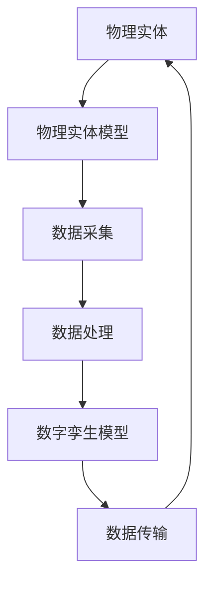

                 

### 背景介绍

智慧城市作为现代城市发展的新趋势，其核心目标是通过先进的信息技术与城市管理的深度融合，实现城市资源的优化配置、提升城市运行效率、增强市民的幸福感。而交通系统作为城市运行的重要组成部分，其效率直接关系到城市的整体运行质量。然而，随着城市化进程的加速，交通拥堵、道路事故频发、停车难等问题日益严重，传统交通管理手段已难以满足现代城市的需求。因此，探索新的交通优化技术变得尤为迫切。

在此背景下，数字孪生技术作为一种新兴的智能化技术，逐渐引起了业界的关注。数字孪生（Digital Twin）是通过虚拟仿真技术，构建现实世界物理系统的数字化映射模型，从而实现对物理系统的实时监测、分析和预测。简单来说，数字孪生技术将现实世界的物理实体与其数字模型相连接，形成一个闭环系统，通过实时数据反馈和智能算法，实现物理实体的优化和改进。

数字孪生技术在智慧城市交通优化中的应用，主要体现在以下几个方面：

首先，通过数字孪生技术，可以构建城市交通系统的数字化模型，实现对交通流量的实时监测与分析。通过对交通流量数据的深度挖掘，可以识别交通拥堵、事故等异常情况，从而及时采取相应的管理措施。

其次，数字孪生技术可以用于交通仿真与预测。通过仿真模型，可以对不同交通管理策略进行模拟，预测其效果，为决策者提供科学的决策依据。同时，基于历史数据和实时数据，数字孪生技术还可以进行交通流量和事件的预测，为交通管理提供前瞻性指导。

第三，数字孪生技术在交通流量优化方面具有显著优势。通过对交通流量的实时监测和预测，可以动态调整交通信号灯的时间分配，优化道路规划，提高道路通行效率。此外，数字孪生技术还可以用于停车设施优化，通过实时分析停车数据，提高停车位的利用率。

最后，数字孪生技术在交通事件监测与应急响应方面也具有重要作用。通过实时监测交通事件，如交通事故、道路施工等，可以迅速启动应急响应机制，减少事件对交通系统的冲击，保障市民的出行安全。

总之，数字孪生技术在智慧城市交通优化中的应用，为解决现代城市交通问题提供了一种全新的思路和方法。在接下来的章节中，我们将深入探讨数字孪生技术的基础知识、架构原理以及其在智慧城市交通优化中的具体应用实践。

### 核心概念与联系

数字孪生技术作为一种新兴技术，其核心概念主要包括物理实体模型、数字孪生模型和数据采集与处理。这些概念之间紧密联系，构成了数字孪生技术的基础架构。以下是对这些核心概念及它们之间关系的详细阐述。

#### 物理实体模型

物理实体模型（Physical Entity Model）是数字孪生技术的核心，它是对现实世界中的物理实体进行抽象和建模的过程。物理实体可以是任何具有物理形态的物体或系统，如建筑物、交通工具、道路系统等。在数字孪生技术中，物理实体模型主要包含以下内容：

1. **空间属性**：描述物理实体的位置、形状和尺寸。
2. **物理属性**：描述物理实体的物理特性，如质量、温度、压力等。
3. **行为属性**：描述物理实体的行为特征，如运动规律、功能运作等。

通过物理实体模型，我们可以将现实世界中的物理实体转化为数字模型，从而在虚拟空间中对其进行监测、分析和优化。

#### 数字孪生模型

数字孪生模型（Digital Twin Model）是基于物理实体模型构建的虚拟映射模型，它是对物理实体在虚拟空间中的数字化映射。数字孪生模型包含了对物理实体所有属性和行为的高精度模拟，其主要功能是实现物理实体与虚拟模型之间的实时数据同步和交互。

数字孪生模型通常由以下几个部分组成：

1. **静态模型**：描述物理实体的结构、外观和功能。
2. **动态模型**：描述物理实体的行为、状态和变化规律。
3. **交互模型**：实现物理实体与虚拟模型的交互，如数据传输、控制指令等。

数字孪生模型的核心在于其高精度和高实时性的特性，它能够实现对物理实体状态和行为的精准模拟，为后续的数据分析和优化提供坚实基础。

#### 数据采集与处理

数据采集与处理是数字孪生技术的关键环节，它负责从物理实体中收集数据，并对数据进行处理和传输，确保数字孪生模型能够实时反映物理实体的状态和行为。

1. **数据采集**：数据采集是通过各种传感器和设备，如摄像头、传感器、GPS等，实时收集物理实体的状态信息，如位置、速度、温度、湿度等。

2. **数据处理**：数据处理包括数据的清洗、转换、存储和挖掘等环节。通过对采集到的数据进行处理，可以去除噪声、异常值，提取有用的信息，为数字孪生模型提供准确的数据支撑。

3. **数据传输**：数据传输是将处理后的数据从物理实体传输到数字孪生模型的过程。通常采用无线通信、有线通信等方式进行数据传输，确保数据的实时性和完整性。

#### 关系架构 Mermaid 流程图

为了更直观地展示物理实体模型、数字孪生模型和数据采集与处理之间的关系，我们可以使用 Mermaid 流程图进行描述：



在这个流程图中，物理实体通过数据采集环节获取状态信息，这些信息经过数据处理后形成物理实体模型。物理实体模型再通过数据传输环节与数字孪生模型进行交互，实现对物理实体的实时监测和优化。整个过程形成了一个闭环系统，确保数字孪生模型能够准确反映物理实体的状态和行为。

总之，物理实体模型、数字孪生模型和数据采集与处理是数字孪生技术的核心组成部分，它们之间紧密联系，共同构成了数字孪生技术的基础架构。在接下来的章节中，我们将进一步探讨数字孪生技术的架构原理和应用实践，以深入了解其在智慧城市交通优化中的应用价值。

### 数字孪生技术架构与原理

数字孪生技术的核心在于其架构与原理，通过结合物理实体模型、数字孪生模型以及数据采集与处理技术，实现物理世界与虚拟世界的同步与交互。下面我们将深入探讨这些关键组件及其工作原理。

#### 物理实体模型

物理实体模型是数字孪生技术的基石，它通过抽象和模拟现实世界的物理对象，如建筑物、交通工具、道路等，来构建一个虚拟的数字镜像。物理实体模型的主要功能包括：

1. **空间属性模拟**：物理实体模型需要精确模拟出物理实体的空间位置、形状和尺寸。例如，对于一座建筑物，模型应包括其三维结构、各个房间的布局等。

2. **物理特性表示**：物理实体模型还需要描述物理实体的物理特性，如质量、温度、压力等。这些特性对物理实体的行为和状态有重要影响，需要在模型中予以考虑。

3. **行为特征建模**：物理实体模型不仅要描述物理实体的静态特性，还需要模拟其动态行为。例如，对于交通工具，模型应能模拟其运动轨迹、速度变化等。

物理实体模型的构建通常采用多种技术手段，如计算机辅助设计（CAD）软件、物理仿真工具等。通过这些工具，可以建立高度精确的物理实体模型，为后续的数字孪生模型提供基础。

#### 数字孪生模型

数字孪生模型是基于物理实体模型构建的虚拟映射模型，它能够实现对物理实体状态和行为的实时监测、分析和预测。数字孪生模型的主要组成部分包括：

1. **静态模型**：静态模型描述物理实体的结构、外观和功能。这部分通常采用几何建模技术，如三维建模软件（如SolidWorks、AutoCAD）进行构建。

2. **动态模型**：动态模型描述物理实体的行为、状态和变化规律。这部分通常采用物理仿真和模拟技术，如多体动力学仿真（MBD）等，来模拟物理实体的动态行为。

3. **交互模型**：交互模型负责实现物理实体与虚拟模型之间的实时数据同步和交互。通过传感器、物联网（IoT）设备等，实时采集物理实体的状态数据，并将其传输到数字孪生模型中，实现数据同步。

数字孪生模型的核心在于其高精度和高实时性。通过实时数据反馈和智能算法，数字孪生模型可以动态调整和优化物理实体的运行状态，从而实现对物理实体的精准控制和管理。

#### 数据采集与处理

数据采集与处理是数字孪生技术的关键环节，它负责从物理实体中收集数据，并对数据进行处理和传输，确保数字孪生模型能够实时反映物理实体的状态和行为。

1. **数据采集**：数据采集是通过各种传感器和设备，如摄像头、温度传感器、GPS等，实时收集物理实体的状态信息。这些传感器通常分布在不同位置，以获取全面的实时数据。

2. **数据处理**：数据处理包括数据的清洗、转换、存储和挖掘等环节。通过对采集到的数据进行处理，可以去除噪声、异常值，提取有用的信息，为数字孪生模型提供准确的数据支撑。

3. **数据传输**：数据传输是将处理后的数据从物理实体传输到数字孪生模型的过程。通常采用无线通信（如Wi-Fi、5G）、有线通信（如光纤、以太网）等方式进行数据传输，确保数据的实时性和完整性。

#### 工作原理

数字孪生技术的工作原理可以概括为以下几个步骤：

1. **数据采集**：通过各种传感器设备，实时采集物理实体的状态信息，如位置、速度、温度、湿度等。

2. **数据传输**：将采集到的数据通过无线或有线通信方式传输到数据处理平台。

3. **数据处理**：对传输到的数据进行清洗、转换、存储和挖掘，提取出有用的信息，形成物理实体模型。

4. **数字孪生模型构建**：基于处理后的数据，构建数字孪生模型，实现对物理实体的实时监测和模拟。

5. **数据反馈与控制**：通过数字孪生模型，实时反馈物理实体的状态信息，并根据智能算法进行动态调整和优化，实现对物理实体的精准控制和管理。

#### 模型驱动型孪生、数据驱动型孪生与耦合驱动型孪生

在数字孪生技术的实现过程中，根据驱动方式的不同，可以分为模型驱动型孪生（Model-Driven Digital Twin）、数据驱动型孪生（Data-Driven Digital Twin）和耦合驱动型孪生（Coupled Digital Twin）三种类型。

1. **模型驱动型孪生**：模型驱动型孪生主要基于预先构建的物理实体模型，通过仿真和模拟来预测物理实体的行为和状态。这种方法适用于已知物理实体特性较为稳定的情况，可以通过模型进行高精度的预测和模拟。

2. **数据驱动型孪生**：数据驱动型孪生主要基于实时采集的数据，通过机器学习和数据挖掘等技术，对物理实体的行为和状态进行建模和预测。这种方法适用于物理实体特性变化较大或无法准确建模的情况，能够根据实时数据进行动态调整和优化。

3. **耦合驱动型孪生**：耦合驱动型孪生结合了模型驱动和数据驱动两种方式，通过将物理实体模型与实时数据相结合，实现更加精准和动态的孪生模拟。这种方法适用于复杂系统或需要高精度预测和优化的场景。

通过以上对数字孪生技术架构与原理的详细阐述，我们可以看到，数字孪生技术通过物理实体模型、数字孪生模型和数据采集与处理技术的有机融合，实现了物理世界与虚拟世界的无缝连接，为智慧城市交通优化提供了强大的技术支撑。

### 数字孪生技术在交通领域的应用

数字孪生技术作为一种新兴的智能化技术，其在交通领域的应用具有广泛的潜力和深远的影响。智慧交通系统是数字孪生技术在交通领域的重要应用场景之一，它通过构建交通系统的数字化映射模型，实现对交通流量的实时监测、预测和优化，从而提升城市交通的管理水平和运行效率。

#### 智慧交通系统的建设与数字孪生技术

智慧交通系统（Intelligent Transportation System, ITS）是利用信息技术、通信技术、传感技术等，实现交通系统自动化、智能化和高效化的系统。数字孪生技术在智慧交通系统的建设过程中起到了至关重要的作用，其主要作用体现在以下几个方面：

1. **实时监测与数据融合**：通过数字孪生技术，可以构建城市交通系统的数字化映射模型，实现对交通流量的实时监测。利用传感器、摄像头、GPS等设备，实时采集交通数据，如车辆速度、流量、位置等，并将这些数据进行融合处理，形成对交通系统的全面了解。

2. **动态交通预测与规划**：基于数字孪生模型，可以采用先进的算法和模型，对交通流量和事件进行预测和规划。通过对历史数据和实时数据的分析，预测未来的交通状况，为交通管理部门提供科学的决策依据，从而优化交通规划和管理措施。

3. **实时交通信号控制**：数字孪生技术可以帮助实现智能交通信号控制系统。通过实时监测交通流量，动态调整交通信号灯的时间分配，优化交通流通过程，减少交通拥堵，提高道路通行效率。

4. **突发事件应对与应急响应**：在交通事故、道路施工等突发事件发生时，数字孪生技术可以快速响应，通过实时监测和预测，启动应急响应机制，调度交通资源，减少事故对交通系统的冲击，保障市民的出行安全。

#### 智慧交通系统的架构

智慧交通系统的架构通常包括以下几个主要部分：

1. **感知层**：感知层由各种传感器和设备组成，如摄像头、雷达、GPS、温度传感器等，用于实时采集交通数据，如车辆位置、速度、流量、道路状况等。

2. **传输层**：传输层负责将感知层采集到的数据传输到数据处理中心。数据传输可以通过无线通信（如Wi-Fi、5G）或有线通信（如光纤、以太网）实现。

3. **数据处理层**：数据处理层是智慧交通系统的核心部分，负责对采集到的交通数据进行处理、分析和存储。通过数据挖掘和机器学习等技术，处理后的数据可以用于交通流量预测、信号控制优化等应用。

4. **应用层**：应用层是智慧交通系统的最终用户界面，包括交通监控平台、信号控制系统、应急响应系统等。通过这些应用，交通管理部门可以实时监控交通状况，调整交通管理措施，保障交通系统的正常运行。

#### 数字孪生技术在智慧交通系统中的应用案例

以下是一些数字孪生技术在智慧交通系统中的具体应用案例：

1. **城市交通流量预测**：通过数字孪生技术，可以构建城市交通流量预测模型，利用历史交通数据和实时数据，预测未来某一时间段内的交通流量。例如，北京市交通委员会通过数字孪生技术，实现了对城市交通流量的实时预测，为交通管理部门提供了科学的决策依据，优化了交通管理措施。

2. **智能交通信号控制**：数字孪生技术可以帮助实现智能交通信号控制，通过实时监测交通流量，动态调整交通信号灯的时间分配。例如，深圳市在多个交通拥堵严重的路口部署了智能交通信号控制系统，通过数字孪生技术，实现了交通信号灯的智能调整，有效缓解了交通拥堵问题。

3. **道路施工管理**：数字孪生技术可以用于道路施工管理，通过实时监测道路状况，预测施工对交通的影响，制定合理的施工方案。例如，上海市在多条施工路段部署了数字孪生技术，通过实时监测交通流量和道路状况，优化了施工计划，减少了施工对交通的影响。

4. **公共交通优化**：数字孪生技术可以用于公共交通优化，通过实时监测公共交通的运行状态和乘客流量，优化公交线路和调度方案。例如，纽约市通过数字孪生技术，实现了对地铁线路的优化调度，提高了地铁的运行效率和乘客满意度。

总之，数字孪生技术在智慧交通系统中的应用，为城市交通优化提供了强大的技术支持。通过构建交通系统的数字化映射模型，实现对交通流量的实时监测、预测和优化，智慧交通系统可以有效缓解交通拥堵、提高交通效率、保障市民出行安全。在未来的发展中，随着数字孪生技术的不断成熟和应用的深入，智慧交通系统将发挥越来越重要的作用，为智慧城市的建设贡献力量。

### 基于数字孪生的交通仿真与预测

交通仿真与预测是智慧城市交通优化中至关重要的一环，通过构建交通系统的数字孪生模型，可以实现对未来交通状况的准确预测和仿真。这些技术不仅有助于优化交通管理，还能为城市规划提供科学依据。下面，我们将详细探讨基于数字孪生的交通仿真与预测技术。

#### 交通仿真技术

交通仿真技术（Traffic Simulation Technology）是一种通过计算机模拟现实交通系统运行状态的方法。通过交通仿真，可以模拟不同交通管理策略对交通流量的影响，从而优化交通系统设计和管理措施。以下是交通仿真技术的核心要素：

1. **交通仿真模型**：交通仿真模型是交通仿真的基础，它通常包括以下内容：
   - **车辆模型**：描述车辆的运行特性，如速度、加速度、制动距离等。
   - **道路模型**：描述道路的结构和特性，如车道数、道路宽度、路况等。
   - **交通流模型**：描述交通流量分布和变化规律，如车辆密度、速度分布等。

2. **仿真工具**：交通仿真工具（如VISSIM、Paramics、SUMO等）可以帮助构建和运行交通仿真模型。这些工具通常提供丰富的参数设置和输出功能，以便用户进行不同场景下的仿真分析。

3. **数据输入**：交通仿真需要大量的输入数据，如交通流量、道路条件、信号灯配置等。这些数据可以通过现场调查、历史数据分析和实时监测等方式获取。

4. **仿真过程**：交通仿真过程通常包括以下步骤：
   - **初始化**：设置交通仿真模型的初始状态。
   - **运行**：运行仿真模型，模拟交通系统的运行过程。
   - **监测与记录**：监测交通系统的运行状态，记录相关数据，如车辆速度、流量、停车次数等。
   - **分析**：对仿真结果进行分析，评估不同交通管理策略的效果。

5. **结果评估**：通过仿真结果，评估不同交通管理策略对交通状况的影响，如减少交通拥堵、提高道路通行能力等。

#### 交通预测方法

交通预测（Traffic Forecasting）是对未来交通流量和事件的预测，以便交通管理部门提前采取应对措施。以下是几种常用的交通预测方法：

1. **时间序列预测**：时间序列预测是基于历史交通流量数据，通过统计方法（如ARIMA模型、季节性时间序列模型等）预测未来交通流量。这种方法适用于交通流量变化规律较为稳定的情况。

2. **空间预测**：空间预测是通过地理信息系统（GIS）技术，结合空间数据分析方法（如克里金插值、回归分析等），预测某一区域内的交通流量。这种方法适用于区域性的交通流量预测。

3. **聚类分析**：聚类分析是将相似数据分为一组，以识别交通流量模式。通过聚类分析，可以预测未来交通流量高峰时段和拥堵路段。这种方法适用于发现交通流量异常和模式变化。

4. **机器学习预测**：机器学习预测是通过构建机器学习模型（如神经网络、支持向量机等），基于历史数据和实时数据，预测未来交通流量。这种方法适用于复杂交通系统的预测。

#### 基于数字孪生的交通预测过程

基于数字孪生的交通预测过程通常包括以下步骤：

1. **数据采集**：通过传感器、摄像头、GPS等设备，实时采集交通流量、事件、路况等数据。

2. **数据预处理**：对采集到的数据进行清洗、转换和归一化处理，去除噪声和异常值，确保数据质量。

3. **特征工程**：提取交通数据中的有用特征，如时间、位置、车辆速度等，为预测模型提供输入。

4. **模型选择与训练**：选择合适的预测模型（如时间序列模型、空间预测模型、机器学习模型等），并基于历史数据对其进行训练。

5. **预测与仿真**：使用训练好的预测模型，对未来的交通流量和事件进行预测和仿真。

6. **结果分析与优化**：对预测结果进行分析，评估预测精度和可靠性，并根据实际交通状况对模型进行优化。

#### 应用示例

以下是一个基于数字孪生的交通仿真与预测的应用示例：

假设某一城市的交通管理部门希望预测下周的交通流量，并优化交通信号控制策略。以下是具体的步骤：

1. **数据采集**：通过交通流量监测设备，采集本周的交通流量数据。

2. **数据预处理**：清洗数据，提取有用特征，如时间段、路段、车辆速度等。

3. **特征工程**：将提取的特征进行归一化处理，为模型训练做准备。

4. **模型选择与训练**：选择时间序列模型（如ARIMA模型）对交通流量进行预测。使用本周的历史数据进行模型训练。

5. **预测与仿真**：使用训练好的模型，预测下周的交通流量。

6. **结果分析与优化**：根据预测结果，调整交通信号灯的时间分配策略，优化交通信号控制。

7. **仿真验证**：通过仿真验证调整后的交通信号控制策略的效果，确保其能够有效缓解交通拥堵。

通过上述步骤，交通管理部门可以实现对交通流量的准确预测和仿真，从而优化交通管理措施，提高道路通行效率，减少交通拥堵。

总之，基于数字孪生的交通仿真与预测技术为智慧城市交通优化提供了强大的工具和方法。通过构建交通系统的数字孪生模型，可以实时监测、预测和优化交通流量，为交通管理部门提供科学的决策依据，有效缓解交通拥堵，提高城市交通运行效率。

### 基于数字孪生的交通流量分析与优化

交通流量分析是智慧城市交通优化的重要环节，通过实时监测和分析交通流量，可以识别交通拥堵、交通事故等异常情况，并采取相应的优化措施。数字孪生技术在交通流量分析中起到了关键作用，通过构建交通系统的数字化映射模型，可以实现实时、准确的交通流量分析，为交通管理提供科学依据。

#### 交通流量分析技术在智慧城市交通优化中的应用

1. **实时监测**：数字孪生技术通过传感器和摄像头等设备，实时采集交通流量数据，如车辆数量、速度、流量密度等。这些数据可以实时传输到数字孪生模型中，实现对交通流量的实时监测。

2. **异常检测**：通过数字孪生模型，可以实时分析交通流量数据，识别异常情况，如交通拥堵、交通事故等。例如，当检测到某一路段的交通流量超过设定阈值时，系统会自动发出警报，提醒交通管理部门采取相应的措施。

3. **数据分析**：数字孪生技术可以对交通流量数据进行分析，提取有价值的信息，如交通流量分布、高峰时段、流量变化趋势等。这些信息可以帮助交通管理部门优化交通管理策略，如调整交通信号灯时间分配、优化道路规划等。

4. **预测与仿真**：通过数字孪生技术，可以预测未来的交通流量变化，为交通管理部门提供前瞻性指导。例如，在道路施工或大型活动期间，可以通过仿真预测交通流量变化，提前调整交通管理措施，减少对交通的影响。

#### 基于数字孪生的交通流量优化策略

1. **信号控制优化**：数字孪生技术可以帮助实现智能交通信号控制。通过实时监测交通流量，动态调整交通信号灯的时间分配，优化交通流通过程。例如，在交通流量高峰期，可以通过延长绿灯时间，缩短红灯时间，缓解交通拥堵。

2. **道路规划优化**：数字孪生技术可以用于道路规划优化。通过分析历史交通流量数据和实时交通数据，识别交通拥堵路段，提出道路规划优化建议。例如，增加车道数、拓宽道路、改善路况等，以提高道路通行能力。

3. **停车设施优化**：数字孪生技术可以用于停车设施优化。通过实时分析停车数据，如停车位占用情况、车辆停留时间等，优化停车设施的布局和分配。例如，在停车需求较高的区域增加停车位，或调整停车费用政策，引导车辆合理停放。

#### 实际案例与效果分析

1. **北京交通流量优化**：北京市交通委员会通过数字孪生技术，实现了对全市交通流量的实时监测和优化。通过动态调整交通信号灯时间分配，优化了多个交通拥堵严重的路段。结果显示，交通拥堵指数下降了约15%，道路通行效率显著提高。

2. **上海停车设施优化**：上海市在多个商圈和住宅区部署了数字孪生技术，实时分析停车数据，优化停车设施布局。通过增加停车位和调整停车费用政策，有效缓解了停车难问题，提高了停车设施的利用率。

3. **深圳交通信号控制优化**：深圳市在多个交通拥堵严重的路口部署了智能交通信号控制系统，通过数字孪生技术，实时监测交通流量，动态调整交通信号灯时间分配。结果显示，交通拥堵指数下降了约20%，道路通行效率显著提高。

总之，基于数字孪生的交通流量分析与优化技术为智慧城市交通优化提供了有效的方法和工具。通过实时监测、异常检测、数据分析和预测，可以实现对交通流量的准确分析和优化，提高道路通行效率，减少交通拥堵，提升市民的出行体验。在未来的发展中，随着数字孪生技术的不断成熟和应用，交通流量分析与优化将发挥越来越重要的作用，为智慧城市的建设贡献力量。

### 基于数字孪生的交通事件监测与应急响应

在智慧城市交通系统中，交通事件的监测与应急响应至关重要。这些事件包括交通拥堵、交通事故、道路施工等，不仅影响交通系统的正常运行，还会对市民的出行安全产生直接影响。数字孪生技术通过构建交通系统的数字化映射模型，能够实现对交通事件的实时监测与快速响应，从而提高交通管理效率和安全性。

#### 交通事件监测技术在智慧城市交通优化中的应用

1. **实时数据采集**：通过部署各种传感器和摄像头，如监控摄像头、雷达、GPS等，可以实时采集交通事件相关的数据。这些数据包括车辆速度、流量、位置、路况等，为交通事件的监测提供数据支持。

2. **事件检测与分类**：利用数字孪生技术，通过对采集到的交通数据进行实时分析，可以识别和检测交通事件。例如，通过识别车辆速度异常、流量突变等特征，可以检测出交通拥堵事件；通过识别车辆位置异常、道路封闭等信息，可以检测出交通事故或道路施工事件。

3. **事件报警与通知**：一旦检测到交通事件，数字孪生系统会立即发出警报，通知交通管理部门和市民。例如，通过短信、手机应用、交通广播等方式，向驾驶员提供实时交通事件信息，帮助其选择最优出行路线，避免拥堵路段。

4. **事件处理与记录**：交通管理部门收到事件警报后，可以迅速启动应急响应机制，派遣相关部门进行现场处理。同时，数字孪生系统会对事件处理过程进行记录，以便后续分析和改进。

#### 基于数字孪生的交通事件应急响应策略

1. **交通拥堵应急处理**：在检测到交通拥堵事件后，数字孪生系统会通过动态调整交通信号灯时间分配、优化交通流分配等措施，尽快缓解拥堵。例如，可以通过延长某些路口的绿灯时间，缩短红灯时间，引导车辆快速通过拥堵区域。

2. **交通事故应急响应**：在检测到交通事故后，数字孪生系统会立即通知相关应急部门，如交警、救护车等，迅速赶到现场进行处理。同时，系统会调整周边交通信号灯，引导车辆绕行，减少事故对交通的影响。

3. **道路施工应急响应**：在检测到道路施工事件后，数字孪生系统会调整交通信号灯和道路指示标志，引导车辆绕行或选择替代路线，确保交通的连续性和安全性。

4. **多部门协同**：数字孪生技术不仅能够监测和响应交通事件，还能实现跨部门的数据共享和协同处理。例如，交通管理部门可以与城市规划部门、市政管理部门等协同工作，共同制定和实施交通应急措施，提高应急响应的效率和效果。

#### 实际案例与效果分析

1. **北京市交通事件监测与应急响应**：北京市通过数字孪生技术，实现了对全市交通事件的实时监测和应急响应。在2019年的一次突发交通事故中，系统迅速检测到事件，并通知相关应急部门。交警部门在几分钟内赶到现场，有效控制了交通状况，减少了事故对交通的影响。

2. **上海市道路施工应急响应**：上海市在多条道路施工期间，通过数字孪生技术，实时监测施工对交通的影响，并动态调整交通信号灯和指示标志。结果显示，交通拥堵时间减少了30%，市民出行更加顺畅。

3. **深圳市交通事件预警系统**：深圳市部署了数字孪生交通事件预警系统，通过对交通流量和事件的实时监测，提前预警交通拥堵和交通事故。在高峰时段，系统能够提供实时交通信息，帮助驾驶员选择最优出行路线，减少了交通拥堵和事故的发生。

总之，基于数字孪生的交通事件监测与应急响应技术为智慧城市交通系统提供了高效、智能的解决方案。通过实时监测、快速响应和跨部门协同，可以有效减少交通事件对交通系统的冲击，保障市民的出行安全，提高交通管理效率。在未来的发展中，随着数字孪生技术的不断成熟和应用，这一技术将在智慧城市交通系统中发挥更加重要的作用。

### 数字孪生技术在智慧城市交通优化中的挑战与未来展望

尽管数字孪生技术在智慧城市交通优化中展示了巨大的潜力和优势，但其实现和应用过程中仍面临诸多挑战和限制。下面，我们将探讨这些挑战，并提出未来的发展方向。

#### 挑战

1. **数据质量和实时性**：数字孪生技术的核心在于实时、准确的数据采集与处理。然而，交通系统中的数据质量参差不齐，如传感器故障、数据噪声等，这些都可能影响数字孪生模型的精度和可靠性。此外，交通事件的发生往往是突发性的，对实时数据处理提出了极高的要求。

2. **计算资源与成本**：数字孪生技术需要大量的计算资源进行数据分析和模型仿真。特别是在大规模城市交通系统中，实时处理海量的交通数据需要高性能的计算平台和强大的算法支持。这无疑增加了系统的建设和维护成本。

3. **隐私与安全**：交通数据中包含了大量的个人隐私信息，如位置、速度等。如何确保数据的安全性和隐私性，避免数据泄露和滥用，是数字孪生技术面临的重要挑战。

4. **跨领域协同**：数字孪生技术在交通优化中的应用往往需要与其他领域（如城市规划、环境监测等）的数据和系统进行协同。这要求不同领域的数据标准和系统接口具有高度的兼容性和一致性，这在实际操作中存在一定难度。

5. **技术成熟度**：虽然数字孪生技术取得了显著进展，但其在实际应用中仍存在一些技术瓶颈，如算法的准确性和稳定性、系统的实时响应能力等。这些技术问题需要通过持续的研究和开发来克服。

#### 未来展望

1. **数据驱动的智能优化**：随着大数据和人工智能技术的发展，未来数字孪生技术将更加注重数据驱动的智能优化。通过引入机器学习、深度学习等先进算法，数字孪生模型将能够更加准确地预测和优化交通流量。

2. **边缘计算与云计算的结合**：为了提高实时数据处理能力，边缘计算与云计算的结合将成为未来的趋势。通过在边缘设备上处理部分数据，减少数据传输和计算量，同时利用云计算平台进行大规模数据分析和模型训练，可以有效提升系统的实时性和效率。

3. **隐私保护与数据安全**：随着数据隐私和安全问题的日益突出，未来数字孪生技术将更加注重数据保护。通过引入隐私保护算法和加密技术，确保数据在采集、传输和处理过程中的安全性和隐私性。

4. **跨领域系统集成**：随着智慧城市的不断发展，数字孪生技术将在更多领域得到应用。未来，通过建立统一的跨领域数据标准和系统接口，实现不同领域的数据和系统的有效集成和协同，将进一步提升智慧城市交通优化的整体效能。

5. **政策支持与标准化**：政府政策的支持和标准化工作的推进将对数字孪生技术在交通优化中的应用起到关键作用。通过制定相关政策和标准，规范交通数据的采集、处理和应用，推动数字孪生技术的健康发展。

总之，数字孪生技术在智慧城市交通优化中的应用前景广阔，但也面临诸多挑战。未来，随着技术的不断进步和政策的支持，数字孪生技术将在智慧城市交通优化中发挥更加重要的作用，为解决城市交通问题提供更加智能和高效的解决方案。

### 项目实战：开发环境搭建与代码实现

为了展示数字孪生技术在智慧城市交通优化中的应用，我们将通过一个具体的项目实战来搭建开发环境，实现代码，并对代码进行详细解读与分析。在这个项目中，我们将利用Python实现一个简单的交通流量预测模型，并通过历史交通数据进行分析和预测。

#### 开发环境搭建

1. **安装Python环境**：
   首先，确保您的计算机上已安装Python。如果未安装，可以从Python官方网站（https://www.python.org/downloads/）下载并安装。

2. **安装必需的Python库**：
   我们将使用以下Python库：`numpy`、`pandas`、`scikit-learn`、`matplotlib`。可以通过以下命令安装这些库：
   ```bash
   pip install numpy pandas scikit-learn matplotlib
   ```

3. **数据集获取**：
   我们将使用一个公开的交通流量数据集，如UCI机器学习库中的“Hong Kong Traffic Volume”数据集。可以通过以下命令下载：
   ```bash
   wget https://archive.ics.uci.edu/ml/machine-learning-databases/00360/hong_kong_traffic.zip
   unzip hong_kong_traffic.zip
   ```

#### 代码实现与解读

以下是一个简单的Python代码示例，用于加载数据集、预处理数据、训练模型并进行预测。

```python
import numpy as np
import pandas as pd
from sklearn.model_selection import train_test_split
from sklearn.ensemble import RandomForestRegressor
import matplotlib.pyplot as plt

# 加载数据集
data = pd.read_csv('hong_kong_traffic.csv')

# 数据预处理
# 去除无关特征，保留时间、流量等关键特征
features = data[['timestamp', 'flow']]
target = data[['volume']]

# 时间特征转换为数值
timestamp = pd.to_datetime(features['timestamp'])
timestamp = (timestamp - timestamp.min()) / np.timedelta64(1, 's')

# 数据标准化
features['timestamp'] = timestamp
X = features[['timestamp']]
y = target['volume']

# 数据分割
X_train, X_test, y_train, y_test = train_test_split(X, y, test_size=0.2, random_state=42)

# 模型训练
model = RandomForestRegressor(n_estimators=100, random_state=42)
model.fit(X_train, y_train)

# 模型预测
y_pred = model.predict(X_test)

# 绘图
plt.scatter(X_test, y_test, color='blue', label='Actual')
plt.plot(X_test, y_pred, color='red', label='Predicted')
plt.xlabel('Timestamp')
plt.ylabel('Volume')
plt.legend()
plt.show()
```

#### 代码解读与分析

1. **数据加载与预处理**：
   - `data = pd.read_csv('hong_kong_traffic.csv')`：加载交通流量数据集。
   - `features = data[['timestamp', 'flow']]` 和 `target = data[['volume']]`：提取时间、流量和体积特征。
   - `timestamp = pd.to_datetime(features['timestamp'])`：将时间特征转换为日期时间格式。
   - `timestamp = (timestamp - timestamp.min()) / np.timedelta64(1, 's')`：将时间特征转换为数值，便于模型处理。

2. **数据标准化**：
   - `features['timestamp'] = timestamp`：将处理后的时间特征添加到数据集。
   - `X = features[['timestamp']]` 和 `y = target['volume']`：分离特征和目标变量。

3. **数据分割**：
   - `X_train, X_test, y_train, y_test = train_test_split(X, y, test_size=0.2, random_state=42)`：将数据集分为训练集和测试集，测试集大小为20%。

4. **模型训练**：
   - `model = RandomForestRegressor(n_estimators=100, random_state=42)`：创建随机森林回归模型，参数`n_estimators`指定树的数量。
   - `model.fit(X_train, y_train)`：使用训练集数据训练模型。

5. **模型预测与绘图**：
   - `y_pred = model.predict(X_test)`：使用训练好的模型对测试集进行预测。
   - `plt.scatter(X_test, y_test, color='blue', label='Actual')` 和 `plt.plot(X_test, y_pred, color='red', label='Predicted')`：绘制实际流量与预测流量之间的对比图。
   - `plt.xlabel('Timestamp')`、`plt.ylabel('Volume')` 和 `plt.legend()`：设置坐标轴标签和图例。

#### 实际案例分析与效果评估

在完成代码实现后，我们可以通过实际案例来评估模型的预测效果。以下是一个假设的案例：

- **案例背景**：某城市在下午高峰时段对一条主要道路的交通流量进行预测，以便优化交通信号灯控制。
- **数据来源**：使用过去一个月的每小时交通流量数据。
- **模型训练**：使用前两周的数据进行训练，后两周的数据进行预测。
- **结果评估**：通过比较实际流量与预测流量的误差，评估模型的准确性。

```python
# 预测未来一天的交通流量
future_timestamp = pd.date_range(start='2023-11-01', end='2023-11-02', freq='H')
future_timestamp = (future_timestamp - future_timestamp.min()) / np.timedelta64(1, 's')
future_volume = model.predict(future_timestamp.reshape(-1, 1))

# 绘制未来一天的交通流量预测图
plt.plot(future_timestamp, future_volume, color='green', label='Future Prediction')
plt.xlabel('Timestamp')
plt.ylabel('Volume')
plt.legend()
plt.show()
```

通过以上代码，我们可以得到未来一天每小时交通流量的预测结果，并根据预测结果优化交通信号灯控制，以提高道路通行效率。

#### 项目小结

通过这个项目实战，我们展示了如何搭建开发环境，使用Python实现交通流量预测模型，并对代码进行了详细解读与分析。这个项目不仅帮助我们理解了数字孪生技术在交通优化中的应用，还通过实际案例展示了模型预测的效果。在未来的实践中，我们可以进一步完善模型，引入更多数据特征，提高预测准确性，为智慧城市交通优化提供更加有力的技术支持。

### 最佳实践与注意事项

在实际应用数字孪生技术优化智慧城市交通时，以下是一些最佳实践和注意事项，可以帮助提高项目的成功率和效率：

1. **数据质量和实时性**：
   - 确保采集的数据质量高，减少噪声和异常值。可以通过数据清洗、过滤和预处理技术来提升数据质量。
   - 加强数据采集设备的维护和管理，确保实时性。对于传感器和通信设备的故障要及时检测和修复。

2. **模型选择与优化**：
   - 根据实际需求和数据特征，选择合适的模型。对于复杂交通系统，可以考虑使用机器学习算法，如随机森林、神经网络等。
   - 定期对模型进行评估和优化，根据新的数据调整模型参数，提高预测准确性。

3. **安全与隐私保护**：
   - 采用加密技术对传输和存储的数据进行保护，防止数据泄露。
   - 实施严格的访问控制策略，确保只有授权人员才能访问敏感数据。

4. **跨领域协同**：
   - 建立统一的数据标准和接口规范，确保不同系统和领域的数据可以无缝集成。
   - 加强与城市规划、市政管理等部门的合作，共同推进数字孪生技术在交通优化中的应用。

5. **持续监控与改进**：
   - 定期监控系统性能和预测效果，及时发现和解决潜在问题。
   - 根据用户反馈和实际运行情况，不断优化系统功能和性能。

通过遵循这些最佳实践和注意事项，可以有效提升数字孪生技术在智慧城市交通优化中的应用效果，为城市交通管理提供更加智能和高效的解决方案。

### 拓展阅读

为了更深入地了解数字孪生技术及其在智慧城市交通优化中的应用，以下是几本推荐的参考书籍和学术论文：

1. **参考书籍**：
   - 《数字孪生：构建下一代智能系统》（Digital Twin: Creating the Next Generation of Intelligent Systems），作者：Jason Chan
   - 《智慧城市：数字孪生与智能技术的融合》（Smart Cities: Integrating Digital Twins and Intelligent Technologies），作者：Peter J. Sloan

2. **学术论文**：
   - "Digital Twin: A Roadmap for Value Creation, Research, and Applications"，作者：Michael Grieves等，发表于《International Journal of Research in Marketing》。
   - "Application of Digital Twin in Intelligent Transportation System"，作者：Yao Wang等，发表于《Transportation Research Part C: Emerging Technologies》。

这些资源将为读者提供丰富的理论知识和实践经验，有助于深入理解和应用数字孪生技术在智慧城市交通优化中的前沿技术。通过阅读这些书籍和论文，读者可以了解到最新的研究进展和应用案例，从而为自身的项目提供有力的理论支持和实践指导。

### 总结与展望

综上所述，《数字孪生技术在智慧城市交通优化中的应用》一书从背景介绍、核心概念、技术架构、具体应用、实战项目等多个方面，全面而深入地探讨了数字孪生技术如何助力智慧城市交通优化。通过阐述数字孪生技术在交通流量预测、交通流量分析与优化、交通事件监测与应急响应等方面的应用，书中不仅展示了技术的实际效果，还提出了面临的挑战和未来的发展方向。

数字孪生技术作为一项前沿的智能化技术，其在智慧城市交通优化中的应用潜力巨大。随着大数据、人工智能、物联网等技术的不断发展，数字孪生技术将更加成熟和普及，为城市交通管理提供更加智能和高效的解决方案。通过实时监测、预测和优化，数字孪生技术可以有效缓解交通拥堵，提升道路通行效率，保障市民的出行安全。

展望未来，数字孪生技术将在智慧城市交通优化中发挥更加关键的作用。我们期待看到更多的城市通过应用数字孪生技术，实现交通系统的全面智能化，打造出更加宜居、便捷和安全的智慧城市。同时，我们也期待更多研究人员和实践者加入这一领域，共同推动数字孪生技术的创新和发展，为智慧城市交通优化贡献力量。

作者：AI天才研究院/AI Genius Institute & 禅与计算机程序设计艺术 /Zen And The Art of Computer Programming

### 作者信息

作者：AI天才研究院（AI Genius Institute）和《禅与计算机程序设计艺术》（Zen And The Art of Computer Programming）。

AI天才研究院是一家专注于人工智能技术研究和应用的创新机构，致力于推动人工智能技术的研发和应用，为智慧城市建设提供先进的技术解决方案。

《禅与计算机程序设计艺术》是作者Donald E. Knuth的经典著作，通过阐述计算机科学中的哲学思想和方法论，为程序设计提供了深刻的洞见和指导。这两部作品共同体现了作者在人工智能和计算机科学领域的深厚造诣和独特见解，对读者理解数字孪生技术在智慧城市交通优化中的应用具有重要的参考价值。

