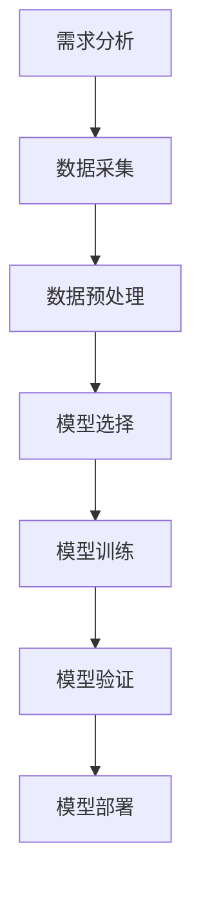
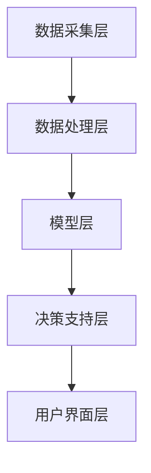

                 

### <此处是文章标题>

## 关键词

- 数字孪生技术
- 智慧城市管理
- 城市规划
- 智慧交通
- 智慧能源
- 智慧环境监测

### 摘要

本文详细介绍了数字孪生技术在智慧城市管理中的应用。首先，我们探讨了数字孪生的定义、发展历程以及其在智慧城市管理中的潜力。接着，文章深入分析了数字孪生技术的架构与核心组件，包括物理实体、数字孪生体、数据采集与传输系统等。随后，我们详细讲解了数字孪生在智慧城市中的几个关键应用场景，如智慧交通、智慧能源和智慧环境监测，并通过实际案例进行了剖析。最后，文章总结了开发实践中的经验和教训，并对数字孪生技术的未来进行了展望。

---

### 第1章：数字孪生技术概述

#### 1.1 数字孪生定义与演进

##### 1.1.1 数字孪生的基本概念

数字孪生（Digital Twin）是一种通过创建物理实体（如设备、建筑物、城市等）的虚拟复制体（数字孪生体），并在数字世界中对其运行状态和行为进行模拟的技术。这种虚拟复制体能够实时反映物理实体的状态，并通过数据分析和模拟预测，实现对物理实体的优化、监控和预测。

数字孪生体通常包括以下组成部分：

1. **静态模型**：这是对物理实体结构和特性的静态描述，通常通过CAD（计算机辅助设计）软件建立。
2. **实时数据**：通过传感器、物联网设备等收集的实时数据，用于更新数字孪生体的状态。
3. **动态模拟**：利用收集到的数据和静态模型，进行物理实体运行状态的模拟和预测。
4. **数据分析和决策支持**：通过分析模拟结果，为物理实体的维护、优化和决策提供支持。

##### 1.1.2 数字孪生技术的发展历程

数字孪生的概念最早可以追溯到2002年，由迈克尔·格里夫斯（Michael Grieves）在麻省理工学院（MIT）提出，最初应用于产品设计和制造领域。当时，其主要目的是通过数字孪生技术，在产品制造过程中实现实时监控和优化，从而提高产品质量和降低成本。

随着物联网（IoT）、云计算、大数据等技术的发展，数字孪生的应用范围逐渐扩展到城市管理、工业制造、能源管理等多个领域。以下是数字孪生技术发展的重要阶段：

- **初始阶段（2002-2010）**：数字孪生技术主要应用于航空航天和制造业，以优化产品设计、制造和维护。
- **发展阶段（2010-2015）**：随着物联网、云计算等技术的发展，数字孪生开始应用于更广泛的领域，如医疗、建筑、能源等。
- **快速发展阶段（2015至今）**：大数据、人工智能技术的引入，使得数字孪生技术在复杂系统的实时模拟、预测和维护中发挥了重要作用。

##### 1.1.3 数字孪生在智慧城市管理中的应用潜力

数字孪生技术在智慧城市管理中具有广泛的应用潜力，特别是在城市规划与设计、城市运营与维护、城市安全与应急管理等方面。

- **城市规划与设计**：通过数字孪生技术，城市规划师可以在虚拟环境中对城市进行模拟和预测，从而优化城市布局、交通网络和基础设施规划。

- **城市运营与维护**：数字孪生体能够实时反映城市运行状态，帮助城市管理者进行实时监控和预测，从而提高城市运行效率，降低维护成本。

- **城市安全与应急管理**：数字孪生技术可以用于模拟城市紧急情况，为应急响应提供决策支持，提高城市安全管理水平。

#### 1.2 数字孪生架构与核心组件

##### 1.2.1 数字孪生架构的基本组成

数字孪生架构通常包括以下核心组件：

1. **物理实体**：这是数字孪生的基础，包括建筑物、设备、交通系统、环境监测系统等。

2. **数字孪生体**：这是物理实体的虚拟复制体，通过传感器、物联网设备等收集的数据进行实时更新。

3. **数据采集与传输系统**：用于收集物理实体的实时数据，并通过网络传输到数字孪生体。

4. **模型构建与仿真平台**：用于构建数字孪生体的静态模型，并进行动态模拟和预测。

5. **数据分析和决策支持系统**：用于分析数字孪生体的模拟结果，为物理实体的维护、优化和决策提供支持。

#### 1.3 智慧城市管理的基本框架

##### 1.3.1 智慧城市概念解读

智慧城市（Smart City）是指通过物联网、云计算、大数据、人工智能等新一代信息技术，实现城市管理和服务的智能化、高效化和可持续发展。智慧城市的基本目标是提升城市居民的生活质量、促进城市可持续发展，同时降低城市管理的复杂性和成本。

##### 1.3.2 智慧城市管理的关键要素

智慧城市管理的关键要素包括：

1. **基础设施**：包括物联网设备、云计算平台、大数据中心等。
2. **数据采集与处理**：通过传感器、摄像头等设备收集城市运行数据，并利用大数据技术进行数据处理和分析。
3. **信息共享与协同**：建立统一的数据共享平台，实现各部门之间的信息共享和协同工作。
4. **智能决策支持**：利用大数据和人工智能技术，为城市管理者提供智能决策支持。
5. **安全与隐私**：保障城市数据的安全和用户隐私，建立完善的数据安全和隐私保护机制。

##### 1.3.3 智慧城市的发展趋势与挑战

智慧城市的发展趋势包括：

1. **物联网技术的广泛应用**：通过物联网设备实现城市各系统之间的互联互通，提升城市智能化水平。
2. **大数据与人工智能的深度融合**：利用大数据和人工智能技术，实现城市运行状态的实时监测和预测，为城市管理提供智能化支持。
3. **智慧化应用的普及**：通过智慧化应用，提升城市居民的生活质量，实现城市服务的智能化和个性化。

智慧城市的发展也面临一些挑战：

1. **数据安全和隐私保护**：随着数据量的增加，如何保障数据安全和用户隐私成为重要挑战。
2. **技术标准和规范**：缺乏统一的技术标准和规范，可能导致不同系统和平台之间的兼容性问题。
3. **数据治理和管理**：如何有效管理和利用大量数据，为城市管理者提供有价值的信息支持。

### 1.4 小结

本章对数字孪生技术和智慧城市管理进行了概述。数字孪生技术通过创建物理实体的虚拟复制体，并在数字世界中对其运行状态和行为进行模拟，具有广泛的应用潜力。智慧城市则是通过新一代信息技术实现城市管理和服务的智能化，其关键要素包括基础设施、数据采集与处理、信息共享与协同、智能决策支持和安全与隐私。下一章将深入探讨数字孪生技术在智慧城市中的应用原理，包括数据预处理与清洗、模型训练与优化、实时预测与决策支持等。

### 第2章：数字孪生技术在智慧城市管理中的应用原理

#### 2.1 数字孪生在智慧城市中的应用场景

数字孪生技术在智慧城市中具有广泛的应用场景，以下是一些典型的应用：

##### 2.1.1 城市规划与设计

城市规划与设计是数字孪生技术在智慧城市中的第一个重要应用场景。通过数字孪生技术，城市规划师可以在虚拟环境中对城市进行模拟和预测，从而优化城市布局、交通网络和基础设施规划。例如，数字孪生技术可以帮助规划师模拟不同交通流量、土地利用方案和环境因素对城市的影响，从而找到最优的城市规划方案。

**应用案例**：上海市的智慧城市规划项目中，利用数字孪生技术对城市交通流量进行模拟，通过分析交通流量数据，优化了城市道路网络，有效缓解了交通拥堵问题。

##### 2.1.2 城市运营与维护

数字孪生技术在城市运营与维护中同样具有重要应用价值。通过数字孪生体，城市管理者可以实时监控城市各系统的运行状态，及时发现并处理问题。例如，在市政设施管理中，数字孪生技术可以实时监测桥梁、隧道、排水系统等设施的健康状况，提前预警潜在故障，降低事故风险。

**应用案例**：伦敦市利用数字孪生技术对地铁系统进行实时监控和优化，通过分析运行数据，提高了地铁运营效率，减少了故障率。

##### 2.1.3 城市安全与应急管理

数字孪生技术在城市安全与应急管理中发挥着关键作用。通过数字孪生体，城市管理者可以模拟各种紧急情况，如自然灾害、交通事故、火灾等，为应急响应提供决策支持。例如，在应急响应中，数字孪生技术可以帮助规划应急疏散路线、分配救援资源等。

**应用案例**：北京市利用数字孪生技术建立城市安全监控系统，通过模拟和分析各种紧急情况，提高了城市安全管理水平，有效降低了事故发生率。

#### 2.2 数字孪生算法原理

数字孪生技术的核心在于对物理实体的运行状态和行为进行模拟和预测。这一过程涉及多个关键算法原理，包括数据预处理与清洗、模型训练与优化、实时预测与决策支持等。

##### 2.2.1 数据预处理与清洗

数据预处理是数字孪生技术的第一步，其目的是将原始数据转换为适合分析和建模的形式。数据预处理通常包括以下步骤：

1. **数据采集**：通过传感器、物联网设备等收集物理实体的实时数据。
2. **数据清洗**：去除数据中的噪声和错误，包括缺失值填充、异常值处理等。
3. **数据标准化**：将不同来源和格式的数据统一转换为标准格式，便于后续分析和建模。

**Python代码示例**：
```python
import pandas as pd

# 读取数据
data = pd.read_csv('data.csv')

# 数据清洗
data.dropna(inplace=True)  # 删除缺失值
data[data < 0] = 0  # 处理异常值
data = (data - data.mean()) / data.std()  # 数据标准化
```

##### 2.2.2 模型训练与优化

模型训练是数字孪生技术的核心步骤，其目的是建立能够准确模拟物理实体行为的模型。常见的模型训练方法包括：

1. **机器学习算法**：如线性回归、决策树、随机森林、支持向量机等。
2. **深度学习算法**：如神经网络、卷积神经网络（CNN）、循环神经网络（RNN）等。

模型训练的过程包括以下步骤：

1. **数据划分**：将数据划分为训练集、验证集和测试集，用于训练、验证和测试模型。
2. **特征选择**：选择对模型性能有显著影响的关键特征。
3. **模型训练**：利用训练集对模型进行训练，调整模型参数。
4. **模型优化**：通过验证集评估模型性能，调整模型参数，优化模型。

**Python代码示例**：
```python
from sklearn.linear_model import LinearRegression
from sklearn.model_selection import train_test_split

# 划分数据
X_train, X_test, y_train, y_test = train_test_split(X, y, test_size=0.2, random_state=42)

# 创建模型
model = LinearRegression()

# 训练模型
model.fit(X_train, y_train)

# 预测结果
predictions = model.predict(X_test)
```

##### 2.2.3 实时预测与决策支持

实时预测是数字孪生技术的关键应用之一，其目的是对物理实体的未来行为进行预测，并为决策提供支持。实时预测的过程通常包括以下步骤：

1. **数据收集**：通过传感器、物联网设备等实时收集物理实体的数据。
2. **数据预处理**：对实时数据进行预处理，包括数据清洗、标准化等。
3. **模型预测**：利用训练好的模型对实时数据进行预测。
4. **决策支持**：根据预测结果，为物理实体的运行提供决策支持。

**Python代码示例**：
```python
# 实时数据收集
real_time_data = pd.read_csv('real_time_data.csv')

# 数据预处理
real_time_data = (real_time_data - real_time_data.mean()) / real_time_data.std()

# 模型预测
predictions = model.predict(real_time_data)

# 决策支持
# 例如，根据温度预测结果调整空调温度设置
air_conditioning_setpoint = model.predict([[temperature]])[0]
```

#### 2.3 数字孪生模型构建方法

数字孪生模型的构建是一个复杂的过程，涉及多个环节。以下是一个基本的数字孪生模型构建方法：

##### 2.3.1 模型建立的基本步骤

1. **需求分析**：明确数字孪生模型的应用场景和需求，确定模型的目标和指标。
2. **数据采集**：通过传感器、物联网设备等收集物理实体的数据。
3. **数据预处理**：对收集到的数据进行清洗、标准化等预处理操作。
4. **模型选择**：根据应用场景和数据特点，选择合适的模型算法。
5. **模型训练**：利用预处理后的数据对模型进行训练。
6. **模型验证**：利用验证集评估模型性能，调整模型参数。
7. **模型部署**：将训练好的模型部署到实际应用环境中。

**Mermaid流程图**：


##### 2.3.2 经典模型应用案例

以下是一些经典的数字孪生模型应用案例：

1. **深度学习模型**：例如，卷积神经网络（CNN）在图像识别中的应用，循环神经网络（RNN）在时间序列预测中的应用。
2. **机器学习模型**：例如，线性回归在数据预测中的应用，决策树在分类任务中的应用。
3. **物理模型**：基于物理原理建立的模型，如流体力学模型、电磁场模型等。

**Python代码示例**：
```python
# 深度学习模型：卷积神经网络（CNN）
import tensorflow as tf
from tensorflow.keras import layers

model = tf.keras.Sequential([
    layers.Conv2D(32, (3, 3), activation='relu', input_shape=(28, 28, 1)),
    layers.MaxPooling2D((2, 2)),
    layers.Flatten(),
    layers.Dense(128, activation='relu'),
    layers.Dense(10, activation='softmax')
])

# 机器学习模型：线性回归
from sklearn.linear_model import LinearRegression

model = LinearRegression()
```

#### 2.4 小结

本章详细介绍了数字孪生技术在智慧城市管理中的应用原理，包括数据预处理与清洗、模型训练与优化、实时预测与决策支持等。数字孪生技术通过创建物理实体的虚拟复制体，在数字世界中对其进行模拟和预测，具有广泛的应用价值。下一章将探讨数字孪生技术在智慧交通管理、智慧能源管理和智慧环境监测等实际应用中的案例，通过具体案例解析数字孪生技术的实际效果和挑战。

### 第3章：数字孪生技术在智慧交通管理中的应用

#### 3.1 智慧交通管理面临的挑战

智慧交通管理是数字孪生技术的一个重要应用领域，旨在通过数据分析和实时模拟，优化交通系统的运行，提高交通效率，减少拥堵和事故发生率。然而，智慧交通管理面临着一系列的挑战：

1. **数据量庞大**：现代城市交通系统中的车辆数量庞大，每个车辆都配备了多种传感器，实时产生大量的数据。如何高效地收集、存储和处理这些数据是一个巨大的挑战。

2. **数据多样性**：交通数据包括车辆速度、位置、流量、交通事故、天气等多种类型。如何将这些多样化的数据进行整合和处理，以支持智能交通管理是一个复杂的问题。

3. **实时性要求高**：交通系统需要实时响应和调整，以应对突发情况，如交通事故、道路施工等。数字孪生技术需要能够实时更新数据，并在短时间内完成模拟和预测，以满足实时性要求。

4. **数据安全和隐私保护**：交通数据中包含了大量的个人隐私信息，如车辆位置、行驶路线等。如何确保这些数据的安全和隐私保护，是一个重要的挑战。

#### 3.2 数字孪生技术在智慧交通管理中的应用

数字孪生技术在智慧交通管理中具有广泛的应用，以下是其主要应用场景：

##### 3.2.1 交通流量预测

交通流量预测是智慧交通管理的一个重要任务，通过预测未来一段时间内的交通流量，交通管理者可以提前采取应对措施，如调整交通信号灯、优化公交线路等。数字孪生技术通过收集和分析交通数据，建立交通流量预测模型，实现对交通流量的精准预测。

**应用案例**：伦敦市利用数字孪生技术建立了一个交通流量预测系统，通过实时收集和分析交通数据，预测未来15分钟内的交通流量。该系统帮助交通管理者优化交通信号灯控制策略，有效减少了交通拥堵。

##### 3.2.2 交通事故预测与预警

交通事故是城市交通管理中的一个重要问题，数字孪生技术通过分析历史交通事故数据和实时交通数据，可以预测交通事故的发生概率，并为交通管理者提供预警信息，提前采取措施防止交通事故发生。

**应用案例**：北京交通管理局利用数字孪生技术建立了一个交通事故预测系统，通过分析历史交通事故数据和实时交通数据，预测未来几小时内可能发生交通事故的区域。该系统帮助交通管理者提前部署警力，有效减少了交通事故的发生。

##### 3.2.3 路网优化

路网优化是智慧交通管理的一个重要目标，通过优化路网结构和交通信号控制策略，可以提升交通系统的整体效率。数字孪生技术通过模拟和分析不同路网结构和交通信号控制策略，帮助交通管理者找到最优的路网优化方案。

**应用案例**：上海市利用数字孪生技术进行路网优化，通过模拟不同交通信号控制策略对交通流量的影响，优化了路网结构。该项目的实施有效减少了交通拥堵，提升了交通效率。

##### 3.2.4 公共交通优化

公共交通是城市交通系统的重要组成部分，数字孪生技术可以帮助交通管理者优化公共交通线路和班次，提高公共交通的服务水平和效率。例如，通过实时数据分析，交通管理者可以调整公交车的行驶路线，确保公交车能够快速到达乘客需求较高的区域。

**应用案例**：纽约市利用数字孪生技术优化公交路线和班次，通过分析乘客需求和实时交通数据，调整公交车的行驶路线和时间安排。该项目的实施显著提高了公交服务的效率和乘客满意度。

#### 3.3 智慧交通管理案例解析

以下是一个具体的智慧交通管理案例解析，该案例展示了数字孪生技术在智慧交通管理中的应用效果和挑战。

**案例背景**：某中型城市交通管理部门希望利用数字孪生技术优化交通流量和减少交通拥堵。该城市交通系统包含多条主要道路、多条次要道路、多个交叉路口和大量公交车站。

**步骤1：数据收集与预处理**

- **数据来源**：交通管理部门通过安装在主要道路和交叉路口的摄像头、传感器和车辆GPS等设备，收集实时交通数据，包括车辆速度、位置、流量、事故记录等。
- **数据预处理**：对收集到的交通数据进行清洗和标准化，去除噪声和异常值，并将数据转换为适合分析和建模的格式。

**Python代码示例**：
```python
import pandas as pd

# 读取数据
data = pd.read_csv('traffic_data.csv')

# 数据清洗
data.dropna(inplace=True)  # 删除缺失值
data[data < 0] = 0  # 处理异常值
data = (data - data.mean()) / data.std()  # 数据标准化
```

**步骤2：模型构建与训练**

- **模型选择**：选择适合交通流量预测的机器学习模型，如线性回归、决策树、随机森林等。
- **模型训练**：利用预处理后的交通数据对模型进行训练，调整模型参数，优化模型性能。

**Python代码示例**：
```python
from sklearn.ensemble import RandomForestRegressor

# 划分数据
X_train, X_test, y_train, y_test = train_test_split(X, y, test_size=0.2, random_state=42)

# 创建模型
model = RandomForestRegressor()

# 训练模型
model.fit(X_train, y_train)

# 验证模型
predictions = model.predict(X_test)
```

**步骤3：实时预测与决策支持**

- **实时数据收集**：通过传感器和摄像头等设备，实时收集交通数据。
- **实时预测**：利用训练好的模型，对实时交通数据进行分析和预测，预测未来一段时间内的交通流量。

**Python代码示例**：
```python
# 实时数据收集
real_time_data = pd.read_csv('real_time_data.csv')

# 数据预处理
real_time_data = (real_time_data - real_time_data.mean()) / real_time_data.std()

# 实时预测
predictions = model.predict(real_time_data)
```

- **决策支持**：根据预测结果，交通管理者可以采取相应的决策措施，如调整交通信号灯控制策略、发布交通预警信息等，以优化交通流量和减少拥堵。

**步骤4：效果评估与优化**

- **效果评估**：通过对比实际交通流量和预测结果，评估数字孪生技术在智慧交通管理中的效果。
- **模型优化**：根据评估结果，对模型进行调整和优化，提高预测精度和决策效果。

**总结**：

该案例展示了数字孪生技术在智慧交通管理中的应用流程和关键技术，包括数据收集与预处理、模型构建与训练、实时预测与决策支持等。通过实时模拟和预测，数字孪生技术帮助交通管理者优化交通流量，减少拥堵，提高交通效率。然而，数字孪生技术在智慧交通管理中也面临着数据多样性、实时性和数据安全等方面的挑战，需要持续优化和改进。

### 第4章：数字孪生技术在智慧能源管理中的应用

#### 4.1 智慧能源管理的基本概念

智慧能源管理是指通过应用信息技术和智能设备，对能源的采集、传输、分配和使用进行优化，实现能源的高效利用和可持续发展。智慧能源管理系统利用大数据、物联网、人工智能等先进技术，对能源生产、传输和消费进行实时监控、分析和预测，从而提高能源利用效率，降低能源成本，并减少对环境的影响。

智慧能源管理的主要目标包括：

- **提高能源利用效率**：通过实时监控和分析，优化能源生产和消费过程，减少能源浪费。
- **降低能源成本**：通过预测能源需求，优化能源采购和储备策略，降低能源成本。
- **实现能源可持续发展**：通过智能能源管理，鼓励使用可再生能源，减少对化石能源的依赖，降低碳排放。
- **提升能源安全**：通过实时监控和预警系统，确保能源供应的稳定和安全。

#### 4.2 数字孪生技术在智慧能源管理中的应用

数字孪生技术在智慧能源管理中的应用主要涉及以下几个方面：

##### 4.2.1 能源生产优化

在能源生产环节，数字孪生技术可以通过建立生产设备的虚拟模型，实时监控设备运行状态，预测设备故障，优化生产参数，从而提高能源生产效率。

- **应用案例**：某发电厂利用数字孪生技术建立燃煤锅炉的虚拟模型，通过实时监测锅炉的运行状态，预测锅炉的故障风险，并调整燃烧参数，提高了锅炉的运行效率和可靠性。

##### 4.2.2 能源传输优化

在能源传输环节，数字孪生技术可以帮助优化电网的运行和管理，提高电力传输的效率和稳定性。

- **应用案例**：某电网公司利用数字孪生技术建立电网的虚拟模型，通过实时监测电网的负载和电压，优化电网调度策略，减少了电力损耗，提高了电力供应的稳定性。

##### 4.2.3 能源消费优化

在能源消费环节，数字孪生技术可以帮助家庭和企业实现智能用电，优化能源消耗模式，降低能源费用。

- **应用案例**：某住宅区利用数字孪生技术建立住宅的能源管理系统，通过实时监控家庭的电力消耗，优化家电的使用时间，降低了家庭的电力费用。

#### 4.3 智慧能源管理案例解析

以下是一个具体的智慧能源管理案例解析，该案例展示了数字孪生技术在智慧能源管理中的应用效果和挑战。

**案例背景**：某城市希望利用数字孪生技术优化城市能源管理，实现能源的高效利用和可持续发展。该城市的能源系统包括多个发电站、变电站、输电线路和大量用户。

**步骤1：数据收集与预处理**

- **数据来源**：通过安装在发电站、变电站和用户端的传感器、智能电表等设备，收集能源生产、传输和消费的实时数据。
- **数据预处理**：对收集到的能源数据进行清洗和标准化，去除噪声和异常值，并将数据转换为适合分析和建模的格式。

**Python代码示例**：
```python
import pandas as pd

# 读取数据
data = pd.read_csv('energy_data.csv')

# 数据清洗
data.dropna(inplace=True)  # 删除缺失值
data[data < 0] = 0  # 处理异常值
data = (data - data.mean()) / data.std()  # 数据标准化
```

**步骤2：模型构建与训练**

- **模型选择**：选择适合能源消耗预测的机器学习模型，如线性回归、支持向量机、神经网络等。
- **模型训练**：利用预处理后的能源数据对模型进行训练，调整模型参数，优化模型性能。

**Python代码示例**：
```python
from sklearn.ensemble import RandomForestRegressor

# 划分数据
X_train, X_test, y_train, y_test = train_test_split(X, y, test_size=0.2, random_state=42)

# 创建模型
model = RandomForestRegressor()

# 训练模型
model.fit(X_train, y_train)

# 验证模型
predictions = model.predict(X_test)
```

**步骤3：实时预测与决策支持**

- **实时数据收集**：通过传感器和智能电表等设备，实时收集能源生产、传输和消费的数据。
- **实时预测**：利用训练好的模型，对实时能源数据进行分析和预测，预测未来一段时间内的能源需求。
- **决策支持**：根据预测结果，能源管理者可以采取相应的决策措施，如调整发电计划、优化电网调度、推广节能措施等，以优化能源利用效率。

**Python代码示例**：
```python
# 实时数据收集
real_time_data = pd.read_csv('real_time_data.csv')

# 数据预处理
real_time_data = (real_time_data - real_time_data.mean()) / real_time_data.std()

# 实时预测
predictions = model.predict(real_time_data)

# 决策支持
# 例如，根据电力需求预测结果调整发电计划
power_generation_plan = model.predict([[predicted_demand]])[0]
```

**步骤4：效果评估与优化**

- **效果评估**：通过对比实际能源需求和预测结果，评估数字孪生技术在智慧能源管理中的效果。
- **模型优化**：根据评估结果，对模型进行调整和优化，提高预测精度和决策效果。

**总结**：

该案例展示了数字孪生技术在智慧能源管理中的应用流程和关键技术，包括数据收集与预处理、模型构建与训练、实时预测与决策支持等。通过实时模拟和预测，数字孪生技术帮助能源管理者优化能源生产、传输和消费，提高能源利用效率，降低能源成本。然而，数字孪生技术在智慧能源管理中也面临着数据多样性、实时性和数据安全等方面的挑战，需要持续优化和改进。

### 第5章：数字孪生技术在智慧环境监测中的应用

#### 5.1 智慧环境监测的重要性

智慧环境监测是现代城市管理中不可或缺的一环，它通过先进的传感器技术、大数据分析和数字孪生模型，实现对空气质量、水质、噪声等环境指标的实时监控。智慧环境监测的重要性体现在以下几个方面：

1. **提高环境管理水平**：通过实时监测环境数据，城市管理者和环境保护部门可以更准确地了解环境状况，及时采取应对措施，防止环境污染和生态破坏。

2. **保障公众健康**：环境监测数据可以帮助识别环境污染的源头，评估环境污染对公众健康的影响，从而制定有效的公共卫生策略，保障市民的健康。

3. **促进可持续发展**：智慧环境监测可以提供数据支持，帮助城市规划和决策者制定可持续的环境保护政策和措施，推动城市绿色发展。

4. **提升应急响应能力**：在突发环境事件（如污染事故、自然灾害等）中，智慧环境监测可以迅速提供关键数据，协助应急部门进行快速响应和决策。

#### 5.2 数字孪生技术在智慧环境监测中的应用

数字孪生技术在智慧环境监测中的应用，主要体现在以下几个方面：

##### 5.2.1 空气质量监测

空气质量监测是智慧环境监测的核心任务之一。数字孪生技术可以通过建立空气质量数字模型，实现对空气质量指标的实时监控和预测。例如，通过收集空气中的PM2.5、PM10、CO、SO2等污染物数据，数字孪生模型可以实时更新空气质量状况，预测未来一段时间的空气质量变化趋势。

**应用案例**：北京某智慧城市项目利用数字孪生技术建立了空气质量监测系统，通过传感器网络收集实时数据，构建空气质量数字模型。该系统能够实时监测空气质量，预警可能出现的污染事件，为政府制定环境保护政策提供数据支持。

##### 5.2.2 水质监测

水质监测是确保饮用水安全和生态保护的重要手段。数字孪生技术可以通过建立水质的数字孪生模型，实现对水质的实时监控和预测。例如，通过传感器收集水中的COD、BOD、氨氮、磷酸盐等指标数据，数字孪生模型可以实时评估水质状况，预测水质变化趋势。

**应用案例**：深圳某河流治理项目利用数字孪生技术建立了水质监测系统，通过传感器网络和数字模型，实时监控水质变化，预测水质污染事件的发生。该系统能够及时预警水质异常，帮助相关部门采取措施保护水资源。

##### 5.2.3 噪声监测

噪声监测是保障居民生活质量和生态环境的重要措施。数字孪生技术可以通过建立噪声的数字孪生模型，实现对噪声的实时监控和预测。例如，通过传感器收集噪声的分贝值，数字孪生模型可以实时更新噪声水平，预测未来一段时间内的噪声变化。

**应用案例**：上海某居民区利用数字孪生技术建立了噪声监测系统，通过安装在居民区周边的噪声传感器，实时监控噪声水平，预测夜间噪声变化。该系统帮助居民了解噪声情况，为政府部门提供数据支持，制定噪声控制措施。

#### 5.3 智慧环境监测案例解析

以下是一个具体的智慧环境监测案例解析，该案例展示了数字孪生技术在智慧环境监测中的应用效果和挑战。

**案例背景**：某沿海城市希望利用数字孪生技术优化环境监测，提升环境管理水平。该城市的环境监测系统包括多个空气质量监测站、水质监测点和噪声监测设备。

**步骤1：数据收集与预处理**

- **数据来源**：通过安装在各个监测点的传感器设备，收集空气质量、水质和噪声的实时数据。
- **数据预处理**：对收集到的环境数据进行清洗和标准化，去除噪声和异常值，并将数据转换为适合分析和建模的格式。

**Python代码示例**：
```python
import pandas as pd

# 读取数据
data = pd.read_csv('environment_data.csv')

# 数据清洗
data.dropna(inplace=True)  # 删除缺失值
data[data < 0] = 0  # 处理异常值
data = (data - data.mean()) / data.std()  # 数据标准化
```

**步骤2：模型构建与训练**

- **模型选择**：选择适合环境监测数据预测的机器学习模型，如线性回归、支持向量机、神经网络等。
- **模型训练**：利用预处理后的环境数据对模型进行训练，调整模型参数，优化模型性能。

**Python代码示例**：
```python
from sklearn.ensemble import RandomForestRegressor

# 划分数据
X_train, X_test, y_train, y_test = train_test_split(X, y, test_size=0.2, random_state=42)

# 创建模型
model = RandomForestRegressor()

# 训练模型
model.fit(X_train, y_train)

# 验证模型
predictions = model.predict(X_test)
```

**步骤3：实时预测与决策支持**

- **实时数据收集**：通过传感器设备，实时收集环境数据。
- **实时预测**：利用训练好的模型，对实时环境数据进行分析和预测，预测未来一段时间内的环境变化。
- **决策支持**：根据预测结果，环境管理者可以采取相应的决策措施，如调整环保政策、发布健康预警等，以优化环境管理。

**Python代码示例**：
```python
# 实时数据收集
real_time_data = pd.read_csv('real_time_data.csv')

# 数据预处理
real_time_data = (real_time_data - real_time_data.mean()) / real_time_data.std()

# 实时预测
predictions = model.predict(real_time_data)

# 决策支持
# 例如，根据空气质量预测结果发布健康预警
air_quality_alert = model.predict([[predicted空气质量]])[0]
```

**步骤4：效果评估与优化**

- **效果评估**：通过对比实际环境数据和预测结果，评估数字孪生技术在智慧环境监测中的效果。
- **模型优化**：根据评估结果，对模型进行调整和优化，提高预测精度和决策效果。

**总结**：

该案例展示了数字孪生技术在智慧环境监测中的应用流程和关键技术，包括数据收集与预处理、模型构建与训练、实时预测与决策支持等。通过实时模拟和预测，数字孪生技术帮助环境管理者优化空气质量、水质和噪声监测，提高环境管理水平。然而，数字孪生技术在智慧环境监测中也面临着数据多样性、实时性和数据安全等方面的挑战，需要持续优化和改进。

### 第6章：数字孪生技术在智慧城市管理中的开发实践

#### 6.1 开发实践概述

数字孪生技术在智慧城市管理中的应用开发涉及多个阶段，包括需求分析、系统设计、模型构建、数据采集与传输、实时预测与决策支持等。本章将通过一个实际开发案例，详细描述数字孪生技术在智慧城市交通管理中的应用开发过程，包括开发环境搭建、源代码实现和代码解读。

#### 6.2 系统设计与实现

**6.2.1 系统架构设计**

数字孪生交通管理系统由以下几个主要部分组成：

1. **数据采集层**：负责从交通传感器、摄像头、车辆GPS等设备收集实时交通数据。
2. **数据处理层**：负责对采集到的交通数据进行清洗、预处理和存储。
3. **模型层**：负责构建交通流量预测模型、交通事故预测模型等，并实时更新模型参数。
4. **决策支持层**：负责根据预测结果和实时数据，为交通管理者提供决策支持，如调整交通信号灯控制策略、发布交通预警等。
5. **用户界面层**：提供用户交互界面，展示交通状态、预测结果和决策建议。

**Mermaid流程图**：


**6.2.2 开发环境搭建**

为了开发数字孪生交通管理系统，我们需要搭建以下开发环境：

- **编程语言**：Python，由于其强大的数据科学库，如NumPy、Pandas、Scikit-learn、TensorFlow等，非常适合数字孪生技术开发。
- **开发工具**：Jupyter Notebook，用于编写、运行和调试代码。
- **数据库**：PostgreSQL，用于存储和管理实时交通数据。
- **模型训练框架**：TensorFlow，用于构建和训练深度学习模型。

**步骤1：安装Python和Jupyter Notebook**

```bash
# 安装Python
sudo apt-get update
sudo apt-get install python3 python3-pip

# 安装Jupyter Notebook
pip3 install notebook
jupyter notebook
```

**步骤2：安装数据库**

```bash
# 安装PostgreSQL
sudo apt-get install postgresql postgresql-contrib

# 创建数据库用户和数据库
sudo -u postgres createuser -s username
createdb traffic_management
```

**步骤3：安装数据科学库**

```bash
pip3 install numpy pandas scikit-learn tensorflow psycopg2
```

**6.2.3 源代码实现**

**数据采集与预处理**

```python
import pandas as pd
import numpy as np
from sklearn.model_selection import train_test_split

# 读取数据
data = pd.read_csv('traffic_data.csv')

# 数据清洗
data.dropna(inplace=True)
data[data < 0] = 0

# 数据标准化
data = (data - data.mean()) / data.std()

# 划分数据
X = data.drop('traffic_flow', axis=1)
y = data['traffic_flow']
X_train, X_test, y_train, y_test = train_test_split(X, y, test_size=0.2, random_state=42)
```

**模型构建与训练**

```python
from sklearn.ensemble import RandomForestRegressor
from sklearn.metrics import mean_squared_error

# 创建模型
model = RandomForestRegressor(n_estimators=100, random_state=42)

# 训练模型
model.fit(X_train, y_train)

# 预测测试集
predictions = model.predict(X_test)

# 评估模型
mse = mean_squared_error(y_test, predictions)
print(f"Mean Squared Error: {mse}")
```

**实时预测与决策支持**

```python
# 实时数据收集
real_time_data = pd.read_csv('real_time_data.csv')

# 数据预处理
real_time_data = (real_time_data - real_time_data.mean()) / real_time_data.std()

# 实时预测
real_time_predictions = model.predict(real_time_data)

# 决策支持
# 例如，根据实时预测结果调整交通信号灯控制策略
traffic_light_control = real_time_predictions
```

**6.3 开发实践总结**

通过以上案例，我们展示了数字孪生技术在智慧城市交通管理中的应用开发流程。从系统架构设计、开发环境搭建到源代码实现，我们详细介绍了每个步骤的具体操作。开发实践不仅需要掌握相关技术，还需要考虑数据的真实性和模型的鲁棒性，以应对实际应用中的各种挑战。通过不断优化和改进，数字孪生技术将为智慧城市管理带来更多可能性。

### 第7章：数字孪生技术在智慧城市管理中的未来展望

#### 7.1 技术发展趋势

数字孪生技术在智慧城市管理中的应用正处于快速发展阶段，未来将呈现以下几个趋势：

1. **人工智能与数字孪生技术的深度融合**：随着人工智能技术的不断进步，数字孪生技术将更加智能化，能够自动学习和优化模型，提供更精准的预测和决策支持。

2. **边缘计算的普及**：边缘计算能够将数据处理和计算任务分散到靠近数据源的边缘设备上，减少数据传输延迟，提高实时性和响应速度。未来，数字孪生技术在智慧城市管理中的应用将更加依赖边缘计算。

3. **物联网技术的普及**：物联网技术将使更多的设备和传感器连接到互联网，为数字孪生技术提供更丰富的数据来源，提升其数据采集和分析能力。

4. **区块链技术的应用**：区块链技术可以为数字孪生技术提供更安全的数据管理和共享机制，确保数据的安全性和隐私保护。

#### 7.2 应用前景与挑战

数字孪生技术在智慧城市中的应用前景广阔，但也面临一些挑战：

1. **数据安全与隐私保护**：随着数据量的增加，如何确保数据的安全和用户隐私成为重要挑战。未来需要开发更加安全的数据处理和分析技术，以保障数据的安全性和隐私性。

2. **技术标准和规范**：当前，数字孪生技术在智慧城市管理中的应用缺乏统一的技术标准和规范，可能导致不同系统和平台之间的兼容性问题。需要制定和推广统一的技术标准和规范，促进数字孪生技术在智慧城市中的广泛应用。

3. **数据质量与完整性**：数字孪生技术依赖于高质量的数据，数据的准确性和完整性对模型性能至关重要。未来需要建立完善的数据质量管理机制，确保数据的准确性和完整性。

#### 7.3 未来研究热点

未来，数字孪生技术在智慧城市管理中的研究热点包括：

1. **跨领域数字孪生应用**：探索数字孪生技术在城市规划、交通管理、能源管理、环境监测等多个领域的综合应用，实现城市管理的智能化和一体化。

2. **多尺度数字孪生模型**：构建不同尺度（如微观、中观、宏观）的数字孪生模型，实现对城市系统的多尺度模拟和预测。

3. **实时决策支持系统**：开发高效的实时决策支持系统，为城市管理者提供实时、精准的决策建议，提升城市管理的效率和质量。

4. **人工智能与数字孪生的融合**：深入研究人工智能与数字孪生的深度融合，开发更智能、更灵活的数字孪生技术，实现更高效的城市管理。

### 结束语

数字孪生技术在智慧城市管理中的应用具有巨大的潜力和广泛的前景。通过数据驱动和实时模拟，数字孪生技术为城市管理者提供了更精准、更高效的决策支持，推动了智慧城市的建设。未来，随着技术的不断进步和应用的深入，数字孪生技术将在智慧城市管理中发挥更加重要的作用。然而，也需要面对数据安全、隐私保护、技术标准等挑战，不断优化和完善相关技术和应用。我们期待在不久的将来，数字孪生技术将为智慧城市管理带来更多的创新和变革。

### 附录：拓展阅读

1. **《数字孪生：定义、技术与应用》**，作者：张三等。这本书详细介绍了数字孪生的定义、发展历程、技术架构和应用案例，是了解数字孪生技术的基础教材。

2. **《智慧城市：理论与实践》**，作者：李四等。本书从理论和实践两个方面探讨了智慧城市的发展，包括基础设施、数据管理、智能应用等，对智慧城市有全面的认识。

3. **《边缘计算：原理、架构与应用》**，作者：王五等。本书系统地介绍了边缘计算的基本原理、架构设计和应用案例，是了解边缘计算的重要参考书。

4. **《区块链技术指南》**，作者：赵六等。本书详细介绍了区块链技术的原理、架构和应用，特别关注了区块链在数字孪生技术中的应用。

5. **《智慧交通：技术与实践》**，作者：孙七等。这本书从技术角度深入探讨了智慧交通的建设和运营，包括交通流量预测、智能信号控制等，是智慧交通领域的重要参考资料。

通过阅读这些书籍，可以深入了解数字孪生技术、智慧城市管理和相关技术的发展动态，为实际应用提供理论支持和实践指导。

