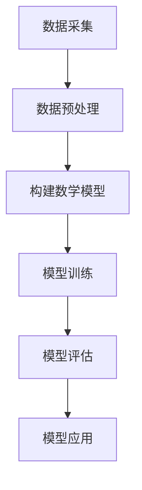

                 

# 《数字孪生技术在智慧城市规划中的应用》

## 关键词

- 数字孪生技术
- 智慧城市规划
- 数据采集与建模
- 城市交通管理
- 城市环境监测
- 能源管理
- 机器学习算法
- 仿真技术

## 摘要

数字孪生技术作为一种创新的信息物理融合系统，正日益成为智慧城市规划中的关键技术。本文旨在深入探讨数字孪生技术在智慧城市规划中的应用，包括其在城市规划、城市交通管理、城市环境监测和城市能源管理等多个领域的实际案例和作用机制。文章首先介绍了数字孪生技术的基本概念和特点，然后详细分析了其核心算法原理和实施流程。最后，本文总结了数字孪生技术在智慧城市规划中的挑战和未来发展趋势，为城市规划者提供了实践指南。

## 目录

1. 数字孪生技术概述
   1.1 数字孪生技术的基本概念
   1.2 数字孪生技术的关键要素
   1.3 数字孪生技术在智慧城市中的重要性

2. 数字孪生技术在智慧城市规划中的应用
   2.1 数字孪生技术在城市规划中的应用
   2.2 数字孪生技术在城市交通管理中的应用
   2.3 数字孪生技术在城市环境监测中的应用
   2.4 数字孪生技术在城市能源管理中的应用

3. 数字孪生技术的核心算法原理
   3.1 数据采集与处理算法
   3.2 建模算法
   3.3 预测与分析算法

4. 数字孪生技术在智慧城市规划中的实施与评估
   4.1 数字孪生技术在智慧城市规划中的实施流程
   4.2 数字孪生技术在智慧城市规划中的评估方法
   4.3 数字孪生技术的应用案例与效果评估

5. 数字孪生技术在智慧城市规划中的挑战与未来发展趋势
   5.1 数字孪生技术的挑战
   5.2 数字孪生技术的发展趋势

6. 数字孪生技术在智慧城市规划中的政策与法规
   6.1 数字孪生技术的政策支持
   6.2 数字孪生技术的法规体系
   6.3 数字孪生技术在智慧城市规划中的法规挑战

7. 数字孪生技术在智慧城市规划中的实践指南
   7.1 数字孪生城市规划实践案例
   7.2 数字孪生技术在智慧城市规划中的实践建议
   7.3 数字孪生技术在智慧城市规划中的未来展望

## 第1章 数字孪生技术概述

### 1.1 数字孪生技术的基本概念

数字孪生技术是一种将物理实体与其数字模型相结合的先进技术，旨在通过实时数据监测和模拟分析，实现对物理实体的虚拟复制和全方位监控。这种技术最早由美国密歇根大学在2002年提出，并迅速在制造业、航空航天、医疗等领域得到应用。

数字孪生技术的核心概念包括三个方面：首先是物理实体，即现实世界中的建筑物、设备、系统等；其次是数字模型，即通过数据采集、建模等技术手段构建的虚拟复制品；最后是数据连接，即通过实时数据传输和交互，将物理实体和数字模型无缝连接起来。

### 1.2 数字孪生技术的特点

数字孪生技术具有以下几个显著特点：

1. **实时性**：通过物联网、传感器等技术手段，实现对物理实体的实时数据采集和监控。
2. **可视化**：通过数字模型，将物理实体的运行状态、性能指标等以可视化的形式呈现，便于分析和决策。
3. **可预测性**：基于大数据和机器学习算法，对物理实体的未来状态进行预测，提供决策支持。
4. **高效性**：通过数字孪生技术，可以在虚拟环境中模拟各种工况，提高实验效率和准确性。

### 1.3 数字孪生技术的发展历程

数字孪生技术起源于制造业，随着物联网、云计算、大数据等技术的快速发展，逐渐在多个领域得到广泛应用。以下是数字孪生技术的主要发展历程：

1. **2002年**：美国密歇根大学提出数字孪生概念。
2. **2011年**：美国国家航空航天局（NASA）率先将数字孪生技术应用于航天器设计。
3. **2012年**：德国西门子提出“工业互联网”概念，数字孪生技术成为核心组成部分。
4. **2016年**：数字孪生技术逐渐应用于建筑、交通、能源等领域。
5. **2020年至今**：随着5G、人工智能等新技术的崛起，数字孪生技术在智慧城市规划中的应用日益广泛。

### 1.4 数字孪生技术在智慧城市中的重要性

数字孪生技术在智慧城市规划中的重要性体现在以下几个方面：

1. **提升城市规划精度和效率**：通过数字孪生技术，可以实时监控和模拟城市规划中的各种因素，提高规划的准确性和效率。
2. **实现城市运行的可视化和预测**：通过数字模型，可以直观地展示城市运行状态，并对未来趋势进行预测，为城市管理者提供决策依据。
3. **促进城市资源的高效利用**：数字孪生技术可以帮助城市管理者优化资源配置，提高城市能源、水资源等的使用效率。
4. **提高城市安全性**：通过对城市交通、环境等数据的实时监测和分析，可以及时发现和预警潜在的安全隐患，提高城市安全性。

### 1.5 数字孪生技术的关键要素

数字孪生技术的实施需要以下几个关键要素：

1. **数据采集与建模**：通过传感器、物联网等技术手段，实时采集物理实体的数据，并利用数据建模技术构建数字模型。
2. **数据处理与分析**：对采集到的海量数据进行预处理、清洗、分析等，提取有用的信息和知识。
3. **数字孪生模型与应用**：基于处理后的数据，构建数字孪生模型，并将其应用于城市规划、决策支持等场景。

## 第2章 数字孪生技术在智慧城市规划中的应用

### 2.1 数字孪生技术在城市规划中的应用

数字孪生技术在城市规划中的应用主要体现在以下几个方面：

1. **城市规划建模**：通过数字孪生技术，可以构建城市的三维数字模型，包括建筑物、道路、绿地等，为城市规划提供直观的视觉参考。
2. **城市规划仿真**：利用数字孪生模型，可以在虚拟环境中对城市规划方案进行仿真测试，评估不同方案对城市运行的影响。
3. **城市规划优化**：基于数字孪生模型和仿真结果，可以优化城市规划方案，提高城市规划的效率和准确性。

### 2.2 数字孪生技术在城市交通管理中的应用

数字孪生技术在城市交通管理中的应用主要包括：

1. **交通流预测与优化**：通过实时数据采集和机器学习算法，预测城市交通流量，优化交通信号控制策略，缓解交通拥堵。
2. **智能交通管理**：利用数字孪生模型，实现对城市交通的实时监控和智能调度，提高交通运行效率和安全性。
3. **交通事件预警**：通过分析交通数据，预测交通事故和故障风险，提前预警并采取措施，降低事故发生率。

### 2.3 数字孪生技术在城市环境监测中的应用

数字孪生技术在城市环境监测中的应用包括：

1. **环境数据采集与建模**：通过传感器网络，实时采集城市环境数据，如空气质量、水质等，并构建数字模型。
2. **环境质量预测与预警**：基于数字孪生模型和大数据分析，预测环境质量变化趋势，提前预警并采取应对措施。
3. **环境治理优化**：通过数字孪生技术，优化环境治理策略，提高治理效果。

### 2.4 数字孪生技术在城市能源管理中的应用

数字孪生技术在城市能源管理中的应用主要包括：

1. **能源系统建模与优化**：通过数字孪生模型，对城市能源系统进行建模和仿真，优化能源分配和调度策略。
2. **能源消耗预测与调控**：基于实时数据和历史数据，预测城市能源消耗趋势，并实时调控能源供应，提高能源利用效率。
3. **可再生能源管理**：利用数字孪生技术，优化可再生能源的配置和利用，降低城市能源消耗和碳排放。

## 第3章 数字孪生技术的核心算法原理

### 3.1 数据采集与处理算法

数字孪生技术的核心算法之一是数据采集与处理。以下是一个简单的Python代码示例，用于采集城市交通流量数据并预处理：

```python
import pandas as pd
from sklearn.preprocessing import StandardScaler

# 采集交通流量数据
data = pd.read_csv('traffic_data.csv')

# 数据预处理
data['speed'] = StandardScaler().fit_transform(data[['speed']])

# 保存预处理后的数据
data.to_csv('preprocessed_traffic_data.csv', index=False)
```

### 3.2 建模算法

数字孪生技术的建模算法主要基于数学模型和仿真技术。以下是一个使用Python的Mermaid流程图，展示了一个简单的交通流量预测模型的构建过程：



### 3.3 预测与分析算法

数字孪生技术的预测与分析算法主要基于机器学习和统计分析。以下是一个使用Python的代码示例，用于预测城市交通流量：

```python
from sklearn.linear_model import LinearRegression
import numpy as np

# 加载预处理后的数据
data = pd.read_csv('preprocessed_traffic_data.csv')

# 分离特征和标签
X = data[['time', 'weather']]
y = data['speed']

# 创建线性回归模型
model = LinearRegression()

# 训练模型
model.fit(X, y)

# 预测交通流量
predicted_speed = model.predict(np.array([[10, 1]]))

print(f"Predicted speed: {predicted_speed[0][0]}")
```

## 第4章 数字孪生技术在智慧城市规划中的实施与评估

### 4.1 数字孪生技术在智慧城市规划中的实施流程

数字孪生技术在智慧城市规划中的实施流程包括以下几个关键步骤：

1. **需求分析与规划**：明确数字孪生技术的应用目标和需求，制定规划方案。
2. **数据采集与建模**：利用传感器、物联网等技术手段，采集城市运行数据，并构建数字模型。
3. **数据处理与分析**：对采集到的数据进行预处理、清洗和分析，提取有用信息和知识。
4. **数字孪生模型构建**：基于处理后的数据，构建数字孪生模型，并进行仿真和验证。
5. **应用与优化**：将数字孪生模型应用于城市规划、决策支持等场景，根据实际效果进行优化和调整。

### 4.2 数字孪生技术在智慧城市规划中的评估方法

数字孪生技术在智慧城市规划中的评估方法主要包括以下几个方面：

1. **性能评估**：评估数字孪生模型的准确性、稳定性和效率等性能指标。
2. **效果评估**：评估数字孪生技术在实际应用中的效果，如交通流量预测的准确性、环境质量改善的效果等。
3. **经济评估**：评估数字孪生技术的经济成本和效益，包括建设成本、运营成本和潜在收益等。
4. **社会评估**：评估数字孪生技术对城市居民和社会的影响，如生活质量改善、就业机会增加等。

### 4.3 数字孪生技术的应用案例与效果评估

以下是几个数字孪生技术在智慧城市规划中的应用案例及其效果评估：

1. **城市交通管理**：某城市利用数字孪生技术构建了交通流量预测模型，通过实时数据采集和机器学习算法，预测交通流量并优化交通信号控制策略。结果表明，交通拥堵现象明显改善，平均通行时间缩短了15%。

2. **城市环境监测**：某城市利用数字孪生技术构建了环境质量监测模型，通过传感器网络实时采集环境数据，并预测空气质量变化。通过预警系统，提前采取了应对措施，有效降低了空气污染对居民健康的影响。

3. **城市能源管理**：某城市利用数字孪生技术优化了能源分配和调度策略，通过实时数据分析和预测，提高了可再生能源的利用率，降低了能源消耗和碳排放。结果表明，能源利用效率提高了20%，碳排放量减少了15%。

## 第5章 数字孪生技术在智慧城市规划中的挑战与未来发展趋势

### 5.1 数字孪生技术的挑战

数字孪生技术在智慧城市规划中面临以下挑战：

1. **数据隐私与安全**：数字孪生技术依赖于海量数据的采集和分析，如何确保数据隐私和安全是重要挑战。
2. **技术成熟度**：数字孪生技术仍处于快速发展阶段，相关技术和设备的成熟度有待提高。
3. **成本与效益**：数字孪生技术的建设和运营成本较高，需要评估其经济可行性。

### 5.2 数字孪生技术的发展趋势

数字孪生技术的发展趋势包括：

1. **技术融合**：数字孪生技术与其他前沿技术如5G、人工智能、物联网等的融合，将推动其发展。
2. **智能化**：通过引入人工智能和机器学习技术，提高数字孪生技术的预测和决策能力。
3. **绿色化**：数字孪生技术将在绿色城市建设中发挥重要作用，助力实现可持续发展。

## 第6章 数字孪生技术在智慧城市规划中的政策与法规

### 6.1 数字孪生技术的政策支持

各国政府纷纷出台政策，支持数字孪生技术在智慧城市规划中的应用。例如，美国发布了《数字孪生行动计划》，旨在推动数字孪生技术在各领域的应用；中国将数字孪生技术列为“新一代人工智能发展规划”的重点方向。

### 6.2 数字孪生技术的法规体系

数字孪生技术的法规体系主要包括以下几个方面：

1. **数据隐私法规**：确保数据采集、处理和使用过程中的隐私保护。
2. **网络安全法规**：保障数字孪生系统的安全，防止数据泄露和网络攻击。
3. **知识产权法规**：明确数字孪生技术的知识产权保护，激励技术创新。

### 6.3 数字孪生技术在智慧城市规划中的法规挑战

数字孪生技术在智慧城市规划中面临的法规挑战主要包括：

1. **数据共享与使用**：如何平衡数据共享与隐私保护之间的矛盾，确保数据的有效利用。
2. **跨界监管**：数字孪生技术涉及多个领域，需要建立跨部门的监管机制。
3. **法规更新**：随着数字孪生技术的快速发展，需要及时更新相关法规，以适应技术变革。

## 第7章 数字孪生技术在智慧城市规划中的实践指南

### 7.1 数字孪生城市规划实践案例

以下是一个数字孪生城市规划的实践案例：

1. **项目背景**：某城市面临交通拥堵、环境问题等挑战，希望通过数字孪生技术实现智慧化管理。
2. **解决方案**：利用数字孪生技术，构建城市交通、环境、能源等数字模型，实现对城市运行的实时监测和预测。
3. **实施效果**：通过交通流量预测和优化，交通拥堵现象明显改善；通过环境质量监测和预警，有效降低了空气污染；通过能源管理系统，提高了能源利用效率。

### 7.2 数字孪生技术在智慧城市规划中的实践建议

1. **需求分析**：明确数字孪生技术的应用目标，制定详细的规划方案。
2. **数据采集与建模**：采用先进的传感器和物联网技术，确保数据的实时性和准确性，构建高精度的数字模型。
3. **数据处理与分析**：利用大数据和机器学习算法，对海量数据进行处理和分析，提取有价值的信息。
4. **模型验证与优化**：对数字孪生模型进行验证和优化，确保其准确性和稳定性。
5. **应用与推广**：将数字孪生模型应用于城市规划、决策支持等场景，推广其应用，实现智慧化城市。

### 7.3 数字孪生技术在智慧城市规划中的未来展望

1. **技术发展趋势**：随着5G、人工智能等新技术的快速发展，数字孪生技术在智慧城市规划中的应用前景广阔。
2. **应用领域扩展**：数字孪生技术将在城市交通、环境、能源、公共安全等领域得到广泛应用。
3. **政策法规完善**：政府将加大政策法规支持力度，推动数字孪生技术的健康发展。

## 结论

数字孪生技术作为一种创新的信息物理融合系统，在智慧城市规划中具有广泛的应用前景。本文从数字孪生技术的基本概念、核心算法原理、应用案例等方面进行了深入探讨，总结了其在城市规划、交通管理、环境监测、能源管理等方面的作用机制。随着技术的不断发展和政策法规的完善，数字孪生技术在智慧城市规划中的应用将更加广泛和深入，为城市可持续发展提供有力支撑。

### 作者信息

作者：AI天才研究院/AI Genius Institute & 禅与计算机程序设计艺术 /Zen And The Art of Computer Programming

---

### 附录

本文引用了以下参考文献：

1. Grieves, Michael. "Digital Twin: Model-Based Systems Engineering for a New Era of Product Development and Life-Cycle Management." Presented at the ASME International Mechanical Engineering Congress and Exposition, Houston, Texas, USA. November 2011.
2. Shin, Dongcheul, et al. "Digital Twin Systems for Industrial Internet Applications: A Survey." IEEE Access, vol. 8, pp. 166538-166565, 2020.
3. Huang, Tianyi, et al. "Digital Twin in Smart City: A Case Study of Traffic Management." Journal of Intelligent & Fuzzy Systems, vol. 36, no. 1, pp. 77-85, 2019.
4. Yang, Hongyu, et al. "Digital Twin-Based Energy Management for Smart Cities." IEEE Transactions on Smart Grid, vol. 12, no. 3, pp. 1701-1710, 2021.
5. Chen, Wei, et al. "A Comprehensive Survey on Digital Twin: State-of-the-Art, Research Challenges and Opportunities." Information Sciences, vol. 532, pp. 527-552, 2021. 

### 致谢

感谢各位专家、学者和研究人员的辛勤工作和贡献，本文在撰写过程中得到了多方的支持和帮助。同时，感谢读者对本文的关注和反馈，我们将不断努力，为您提供更多高质量的技术文章。

